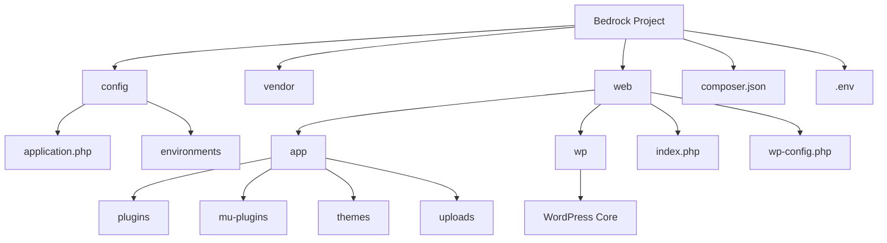
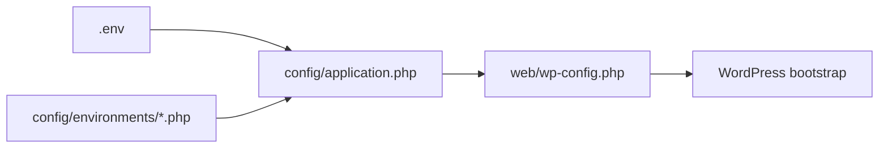

# Bedrock WordPress Project Structure

[← Back to PHP Notebook](../README.md)

## Overview

Bedrock is a WordPress boilerplate from Roots that provides a more application-oriented project structure, Composer-based dependency management, environment-based configuration, and a cleaner separation between WordPress core and custom application code.

The most important distinction is:

- `web/wp/` contains **WordPress core** and should not be edited directly.
- `web/app/` is the Bedrock equivalent of the traditional `wp-content/` directory and contains application-level WordPress code and content.
- `config/` contains the real WordPress configuration.
- `vendor/` contains Composer-managed PHP dependencies.
- `web/` is the public document root for the web server.

> **Rule of thumb:** treat `web/wp/` like framework/vendor code and put project-specific WordPress code under `web/app/`.

## Quick Navigation

- [1. Mental Model](#1-mental-model)
- [2. Default Bedrock Structure](#2-default-bedrock-structure)
- [3. Directory Responsibilities](#3-directory-responsibilities)
- [4. `web/wp` vs `web/app`](#4-webwp-vs-webapp)
- [5. Traditional WordPress vs Bedrock](#5-traditional-wordpress-vs-bedrock)
- [6. Where Custom Code Should Go](#6-where-custom-code-should-go)
- [7. Where REST API Code Should Go](#7-where-rest-api-code-should-go)
- [8. Configuration Flow](#8-configuration-flow)
- [9. Composer and Dependency Management](#9-composer-and-dependency-management)
- [10. Web Server Document Root](#10-web-server-document-root)
- [11. Files You Should Not Edit Directly](#11-files-you-should-not-edit-directly)
- [12. Recommended Development Rules](#12-recommended-development-rules)
- [13. Common Mistakes](#13-common-mistakes)
- [14. Verification Checklist](#14-verification-checklist)
- [15. Bedrock v2 Structure Note](#15-bedrock-v2-structure-note)
- [References](#references)

## 1. Mental Model



Think of Bedrock as three main layers:

1. **Infrastructure and configuration** — `.env`, `config/`, and `composer.json`.
2. **Application code** — `web/app/`.
3. **Framework/core code** — `web/wp/` and Composer packages under `vendor/`.

## 2. Default Bedrock Structure

A typical Bedrock project looks like this:

```text
project/
├── .env
├── .env.example
├── composer.json
├── composer.lock
├── config/
│   ├── application.php
│   └── environments/
│       ├── development.php
│       └── staging.php
├── vendor/
└── web/
    ├── app/
    │   ├── mu-plugins/
    │   ├── plugins/
    │   ├── themes/
    │   └── uploads/
    ├── index.php
    ├── wp-config.php
    └── wp/
        ├── wp-admin/
        ├── wp-includes/
        └── ...
```

### Key responsibilities

- `.env` stores environment-specific values such as database credentials and application URLs.
- `config/` contains WordPress configuration logic.
- `vendor/` contains Composer-installed PHP packages.
- `web/` is the public web root.
- `web/app/` contains WordPress application code and content.
- `web/wp/` contains WordPress core.

## 3. Directory Responsibilities

| Path | Responsibility | Edit directly? |
|---|---|---:|
| `.env` | Environment-specific configuration and secrets | Yes, locally/deployment-specific |
| `.env.example` | Example environment configuration | Yes |
| `composer.json` | Defines PHP, WordPress, plugin, theme, and package dependencies | Yes |
| `composer.lock` | Locks exact dependency versions | Normally generated by Composer |
| `config/application.php` | Main WordPress configuration | Yes |
| `config/environments/` | Environment-specific configuration overrides | Yes |
| `vendor/` | Composer-managed PHP packages | No |
| `web/` | Public document root | Depends on file |
| `web/app/` | Equivalent to `wp-content/` | Yes, for project-owned code |
| `web/app/plugins/` | Normal WordPress plugins | Yes, for custom plugins |
| `web/app/mu-plugins/` | Must-use plugins / application-level functionality | Yes |
| `web/app/themes/` | WordPress themes | Yes, for custom themes |
| `web/app/uploads/` | WordPress uploaded media | Managed by WordPress/runtime |
| `web/wp/` | Composer-managed WordPress core | No |
| `web/wp-config.php` | Loader required by WordPress | No in normal development |

## 4. `web/wp` vs `web/app`

This is the most important Bedrock distinction.

### `web/wp/`

`web/wp/` contains WordPress core.

Typical contents include:

```text
web/wp/
├── wp-admin/
├── wp-includes/
├── wp-login.php
├── wp-settings.php
└── ...
```

Responsibilities:

- WordPress core runtime.
- WordPress administration core files.
- WordPress framework functions and APIs.
- Installed and managed through Composer in Bedrock.

Do **not** add project business logic, custom APIs, or custom features here.

Do **not** patch WordPress core directly unless you are deliberately maintaining a temporary patch with a controlled patching strategy.

### `web/app/`

`web/app/` is the Bedrock equivalent of the standard WordPress `wp-content/` directory.

```text
web/app/
├── mu-plugins/
├── plugins/
├── themes/
└── uploads/
```

Responsibilities:

- Custom plugins.
- Must-use plugins.
- Themes.
- Uploaded media.
- Application-specific WordPress functionality.

This is where most project-specific WordPress development happens.

## 5. Traditional WordPress vs Bedrock

| Traditional WordPress | Bedrock |
|---|---|
| `/wp-admin/` | `/web/wp/wp-admin/` |
| `/wp-includes/` | `/web/wp/wp-includes/` |
| `/wp-content/plugins/` | `/web/app/plugins/` |
| `/wp-content/mu-plugins/` | `/web/app/mu-plugins/` |
| `/wp-content/themes/` | `/web/app/themes/` |
| `/wp-content/uploads/` | `/web/app/uploads/` |
| `wp-config.php` configuration | `config/application.php` + environment config |
| WordPress core stored directly in project root | WordPress core under `web/wp/` |
| Manual dependency installation is common | Composer is the primary dependency manager |

A useful migration mental map is:

```text
Standard WordPress                  Bedrock
------------------                  -------
wp-content/plugins/       ────────>  web/app/plugins/
wp-content/mu-plugins/    ────────>  web/app/mu-plugins/
wp-content/themes/        ────────>  web/app/themes/
wp-content/uploads/       ────────>  web/app/uploads/
WordPress core            ────────>  web/wp/
wp-config.php settings    ────────>  config/application.php + .env
```

## 6. Where Custom Code Should Go

Choose the location based on the responsibility of the code.

| Code type | Recommended location |
|---|---|
| Custom theme | `web/app/themes/<theme-name>/` |
| Reusable feature plugin | `web/app/plugins/<plugin-name>/` |
| Application-critical functionality | `web/app/mu-plugins/<plugin-name>/` |
| REST API owned by a feature plugin | `web/app/plugins/<plugin-name>/` |
| REST API required by the whole application | `web/app/mu-plugins/<api-name>/` |
| WordPress core modification | Avoid; do not place it in `web/wp/` |

Application behavior should not depend on a theme unless the behavior is genuinely presentation-specific.

For business logic, integrations, background processing, custom REST endpoints, and domain functionality, prefer a plugin or must-use plugin.

## 7. Where REST API Code Should Go

Do not write custom REST API code inside `web/wp/`.

For a project-level API, a clean structure can be:

```text
web/app/mu-plugins/
└── app-api/
    ├── app-api.php
    └── src/
        ├── Controllers/
        ├── Routes/
        ├── Services/
        └── Repositories/
```

Alternatively, if the API belongs to an optional or reusable feature:

```text
web/app/plugins/
└── app-api/
    ├── app-api.php
    └── src/
        ├── Controllers/
        ├── Routes/
        └── Services/
```

### Selection rule

1. Use `web/app/plugins/` when the API belongs to a feature that can be activated or deactivated.
2. Use `web/app/mu-plugins/` when the API is mandatory application infrastructure or core business functionality.
3. Avoid placing API logic in the theme unless the endpoint is tightly coupled to presentation behavior.
4. Never place custom API logic in `web/wp/`.

WordPress REST endpoints are normally registered through `register_rest_route()` during the `rest_api_init` hook.

Example endpoint URL:

```text
https://example.com/wp-json/myapp/v1/resource
```

## 8. Configuration Flow

Bedrock separates environment values from application configuration.



### Step 1 — `.env`

Store environment-specific values such as:

```text
DB_NAME
DB_USER
DB_PASSWORD
DB_HOST
WP_ENV
WP_HOME
WP_SITEURL
AUTH_KEY
SECURE_AUTH_KEY
...
```

Do not commit real secrets from `.env` to Git.

### Step 2 — `config/application.php`

This is the main Bedrock WordPress configuration file and performs the role normally associated with the traditional `wp-config.php`.

It defines values such as:

- Database configuration.
- Content directory location.
- WordPress URLs.
- Authentication salts.
- Debug settings.
- File modification policies.
- WordPress bootstrap paths.

### Step 3 — `config/environments/`

Environment-specific files override configuration for environments such as development or staging.

Example:

```text
config/environments/
├── development.php
└── staging.php
```

### Step 4 — `web/wp-config.php`

`web/wp-config.php` exists because WordPress expects to find a `wp-config.php` file in a known location.

In Bedrock it mainly loads Composer and the real configuration from `config/application.php`.

Do not use it as the normal place for project configuration.

## 9. Composer and Dependency Management

Bedrock treats WordPress and many WordPress extensions as dependencies.

`composer.json` is responsible for defining those dependencies.

Conceptually:

```text
composer.json
    │
    ├── WordPress core ─────────────> web/wp/
    ├── WordPress plugins ──────────> web/app/plugins/
    ├── WordPress MU plugins ───────> web/app/mu-plugins/
    ├── WordPress themes ───────────> web/app/themes/
    └── PHP packages ───────────────> vendor/
```

The current Bedrock Composer configuration uses installer paths to place WordPress package types into their appropriate `web/app/` directories and installs WordPress core into `web/wp/`.

This means generated dependency code should normally be changed by updating dependency definitions and running Composer, not by manually editing installed files.

## 10. Web Server Document Root

The web server document root should point to:

```text
/path/to/project/web
```

Not to:

```text
/path/to/project
```

This separation keeps project-level files such as `.env`, `composer.json`, `config/`, and `vendor/` outside the public document root.

Example conceptual deployment:

```text
/var/www/example/
├── .env                  # Not directly public
├── composer.json         # Not directly public
├── config/               # Not directly public
├── vendor/               # Not directly public
└── web/                  # Web server document root
    ├── app/
    ├── wp/
    ├── index.php
    └── wp-config.php
```

## 11. Files You Should Not Edit Directly

### `web/wp/`

Reason:

- WordPress core is managed as a dependency.
- Manual changes can disappear during dependency updates.
- Core modifications make upgrades and security maintenance harder.

### `vendor/`

Reason:

- Composer manages this directory.
- Changes will be overwritten by Composer operations.

### `web/wp-config.php`

Reason:

- It is primarily a WordPress-compatible configuration loader.
- Bedrock configuration belongs in `config/application.php`, environment config files, and `.env`.

### Composer-managed third-party packages

Do not directly patch installed packages as the normal development workflow. Prefer:

- Updating package versions.
- Configuration or hooks.
- Extension points provided by the dependency.
- A controlled patch mechanism when a patch is unavoidable.

## 12. Recommended Development Rules

1. **Keep WordPress core immutable.**

   Never implement project functionality by editing `web/wp/`.

2. **Keep business logic outside themes.**

   Use plugins or must-use plugins for application behavior that should survive a theme change.

3. **Use must-use plugins for mandatory application functionality.**

   This is useful for core integrations, project-wide REST APIs, security/bootstrap behavior, and required domain functionality.

4. **Use normal plugins for optional or reusable features.**

   These features can be activated and deactivated through WordPress.

5. **Manage dependencies through Composer when possible.**

   Avoid manually copying dependency code into Composer-managed locations.

6. **Keep environment secrets in `.env`.**

   Do not hard-code credentials into source-controlled PHP files.

7. **Point the web server to `web/`.**

   Do not expose the project root as the document root.

8. **Follow the project's `.gitignore`.**

   Generated dependencies, environment secrets, uploads, and project-owned source code may have different version-control policies.

## 13. Common Mistakes

| Mistake | Why it is a problem | Better approach |
|---|---|---|
| Editing `web/wp/` | Changes can disappear after WordPress updates | Implement behavior in plugins/hooks |
| Writing APIs in WordPress core | Couples custom code to dependency code | Use `web/app/plugins/` or `web/app/mu-plugins/` |
| Putting all business logic in a theme | Logic disappears or breaks when theme changes | Move application logic to plugins |
| Editing `vendor/` | Composer overwrites the changes | Change dependency/configuration or use a controlled patch |
| Putting secrets in PHP source | Risk of credential leakage | Store environment values in `.env` |
| Using project root as DocumentRoot | Can expose sensitive project files | Point DocumentRoot to `web/` |
| Treating `web/app/` as WordPress core | Leads to incorrect ownership assumptions | Treat it as application-level `wp-content` |

## 14. Verification Checklist

Use this checklist when reviewing a Bedrock project:

- [ ] Web server DocumentRoot points to `web/`.
- [ ] WordPress core exists under `web/wp/`.
- [ ] WordPress application content exists under `web/app/`.
- [ ] Custom plugins are under `web/app/plugins/`.
- [ ] Mandatory application plugins are under `web/app/mu-plugins/` when appropriate.
- [ ] Custom themes are under `web/app/themes/`.
- [ ] Main configuration is in `config/application.php`.
- [ ] Environment-specific configuration is separated from source code.
- [ ] `.env` secrets are not committed.
- [ ] `web/wp/` is not used for custom business logic.
- [ ] `vendor/` is not manually modified.
- [ ] API endpoints are implemented in application-owned plugins rather than WordPress core.
- [ ] Composer dependency definitions match the installed WordPress/plugin/theme dependencies.

## 15. Bedrock v2 Structure Note

Roots has an open Bedrock v2 design issue that proposes structural changes such as renaming `web/` to `public/` and changing how the content directories are arranged.

However, the current Bedrock repository and official installation/folder-structure documentation still use the structure documented above:

```text
web/
├── app/
└── wp/
```

Therefore, when working with a current Bedrock project, verify the project's actual Bedrock version and repository structure before assuming the proposed v2 layout.

## References

- [Roots Bedrock](https://roots.io/bedrock/)
- [Bedrock Folder Structure](https://roots.io/bedrock/docs/folder-structure/)
- [Bedrock Configuration](https://roots.io/bedrock/docs/configuration/)
- [Bedrock Installation](https://roots.io/bedrock/docs/installation/)
- [Roots Bedrock GitHub Repository](https://github.com/roots/bedrock)
- [Bedrock v2 Proposal](https://github.com/roots/bedrock/issues/764)
