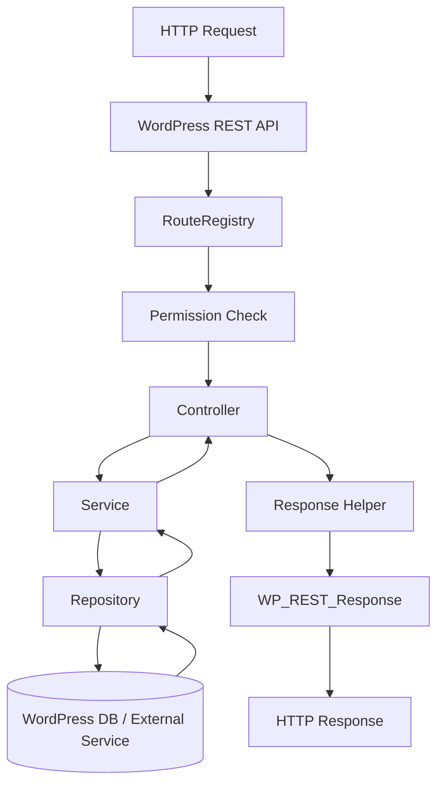
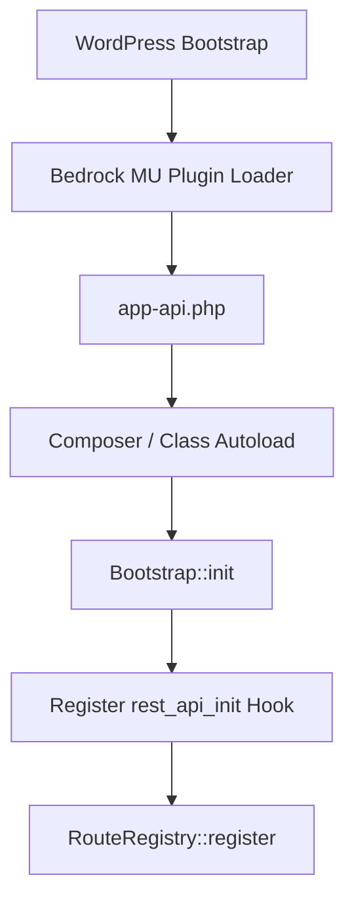
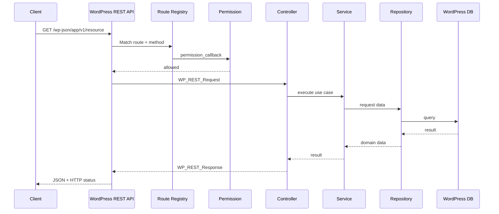

# Bedrock WordPress API Structure

[← Back to Bedrock Structure](../bedrock-wp-structure.md)

## Overview

This document describes a practical structure for building a custom REST API inside a Bedrock WordPress project.

The recommended default is to keep application-level API code inside a must-use plugin:

```text
web/app/mu-plugins/app-api/
```

This keeps the API independent from the active theme and makes it part of the application rather than presentation code.

> **Rule of thumb:** routes define the HTTP contract, controllers coordinate requests, services contain business logic, repositories access data, and WordPress provides the REST runtime, authentication context, database connection, and response lifecycle.

## Quick Navigation

- [1. Recommended Location](#1-recommended-location)
- [2. Recommended API Structure](#2-recommended-api-structure)
- [3. File Responsibilities](#3-file-responsibilities)
- [4. Configuration Strategy](#4-configuration-strategy)
- [5. Bootstrap Flow](#5-bootstrap-flow)
- [6. Request Execution Flow](#6-request-execution-flow)
- [7. Route Registration](#7-route-registration)
- [8. Controller Layer](#8-controller-layer)
- [9. Permission Layer](#9-permission-layer)
- [10. Service Layer](#10-service-layer)
- [11. Repository Layer](#11-repository-layer)
- [12. Response Layer](#12-response-layer)
- [13. Autoloading](#13-autoloading)
- [14. Authentication and Authorization](#14-authentication-and-authorization)
- [15. Error Handling](#15-error-handling)
- [16. API Versioning](#16-api-versioning)
- [17. Minimal API Example](#17-minimal-api-example)
- [18. Full Runtime Flow](#18-full-runtime-flow)
- [19. What Not to Add](#19-what-not-to-add)
- [20. Verification Checklist](#20-verification-checklist)
- [References](#references)

## 1. Recommended Location

For an API that is part of the application's core functionality, use:

```text
web/app/mu-plugins/app-api/
```

For an optional feature that should be manually activated or deactivated, use:

```text
web/app/plugins/app-api/
```

### Why prefer a must-use plugin?

A project-level API normally should not depend on:

- The current WordPress theme.
- A user remembering to activate a plugin.
- Theme lifecycle changes.
- Presentation-layer code.

A must-use plugin is therefore a good default when the API is mandatory application infrastructure.

### Important Bedrock loading behavior

Bedrock includes a must-use plugin autoloader that can load normal plugin directories placed under `web/app/mu-plugins/`.

With the default Bedrock setup, this structure can work directly:

```text
web/app/mu-plugins/
└── app-api/
    └── app-api.php
```

If the Bedrock MU-plugin autoloader has been removed, native WordPress only automatically loads PHP files located directly in the root of `mu-plugins/`.

In that case, add a root loader:

```text
web/app/mu-plugins/
├── app-api-loader.php
└── app-api/
    └── app-api.php
```

Example loader:

```php
<?php

require_once __DIR__ . '/app-api/app-api.php';
```

## 2. Recommended API Structure

A practical project-level API can start with this structure:

```text
web/app/mu-plugins/
└── app-api/
    ├── app-api.php
    ├── config/
    │   ├── api.php
    │   └── services.php
    ├── src/
    │   ├── Bootstrap.php
    │   ├── Routes/
    │   │   └── RouteRegistry.php
    │   ├── Controllers/
    │   │   ├── BaseController.php
    │   │   └── HealthController.php
    │   ├── Permissions/
    │   │   └── ApiPermission.php
    │   ├── Services/
    │   │   └── HealthService.php
    │   ├── Repositories/
    │   │   └── ExampleRepository.php
    │   └── Support/
    │       └── Response.php
    └── tests/
        ├── Unit/
        └── Integration/
```

This is intentionally small enough to understand but separated enough to prevent route files from becoming large business-logic files.

### Layer model



## 3. File Responsibilities

| File / Directory | Responsibility |
|---|---|
| `app-api.php` | Plugin entry point and bootstrap loader |
| `config/api.php` | API namespace, version, defaults, limits, feature flags |
| `config/services.php` | External service configuration mapping |
| `src/Bootstrap.php` | Initializes the API and registers WordPress hooks |
| `src/Routes/RouteRegistry.php` | Registers REST routes and connects routes to controllers |
| `src/Controllers/` | Handles REST requests and coordinates application calls |
| `src/Permissions/` | Authorization and capability checks |
| `src/Services/` | Business logic and use-case orchestration |
| `src/Repositories/` | WordPress database/query/data-access logic |
| `src/Support/Response.php` | Consistent success/error response helpers |
| `tests/Unit/` | Tests isolated PHP business logic |
| `tests/Integration/` | Tests WordPress/API integration behavior |

## 4. Configuration Strategy

A clean Bedrock API normally needs **two API-specific configuration files plus the project-level `.env`**.

That gives three configuration layers:

```text
Bedrock project
├── .env                       # Environment values and secrets
└── web/app/mu-plugins/app-api/
    └── config/
        ├── api.php            # API behavior
        └── services.php       # External service mapping
```

### Configuration layer 1 — `.env`

Use the Bedrock project `.env` for values that change by environment or contain secrets.

Example:

```text
APP_API_EXTERNAL_URL=https://api.example.com
APP_API_EXTERNAL_TOKEN=secret-value
APP_API_TIMEOUT=10
```

Do not commit real secrets.

### Configuration layer 2 — `config/api.php`

Use this file for API-specific application configuration.

Example:

```php
<?php

return [
    'namespace' => 'app',
    'version' => 'v1',
    'default_page_size' => 20,
    'max_page_size' => 100,
];
```

The resulting REST namespace becomes:

```text
app/v1
```

Example endpoint:

```text
https://example.com/wp-json/app/v1/health
```

### Configuration layer 3 — `config/services.php`

Use this file to map external integrations.

Example:

```php
<?php

return [
    'external_api' => [
        'base_url' => env('APP_API_EXTERNAL_URL'),
        'token' => env('APP_API_EXTERNAL_TOKEN'),
        'timeout' => (int) env('APP_API_TIMEOUT', 10),
    ],
];
```

### Why there is no `database.php`

Do not create a second database configuration for normal WordPress data access.

Bedrock already configures the WordPress database through the project `.env` and `config/application.php`.

API repositories should use the existing WordPress database layer such as:

- `$wpdb`.
- `WP_Query`.
- `WP_User_Query`.
- WordPress metadata APIs.
- WordPress content APIs.

Create a separate database configuration only when the API intentionally connects to an additional external database.

### Why there is no default `auth.php`

WordPress already has an authentication and capability system.

Do not build another authentication configuration layer unless the application has a real requirement for a separate authentication mechanism.

## 5. Bootstrap Flow

The API starts when WordPress loads the must-use plugin.



### `app-api.php`

Keep the plugin entry point small.

Example:

```php
<?php
/**
 * Plugin Name: App API
 * Description: Application REST API.
 */

use App\Api\Bootstrap;

if (! defined('ABSPATH')) {
    exit;
}

Bootstrap::init();
```

The entry point should not contain controllers, SQL queries, or business logic.

Its job is only to initialize the API.

### `Bootstrap.php`

Example:

```php
<?php

namespace App\Api;

use App\Api\Routes\RouteRegistry;

final class Bootstrap
{
    public static function init(): void
    {
        add_action('rest_api_init', [RouteRegistry::class, 'register']);
    }
}
```

The important rule is that custom REST routes should be registered on `rest_api_init`.

## 6. Request Execution Flow

For a request such as:

```text
GET /wp-json/app/v1/health
```

The execution flow is:

```text
1. HTTP request
        ↓
2. Bedrock web/index.php
        ↓
3. WordPress bootstrap
        ↓
4. MU plugins loaded
        ↓
5. app-api.php
        ↓
6. Bootstrap::init()
        ↓
7. rest_api_init
        ↓
8. RouteRegistry registers /app/v1/health
        ↓
9. WordPress matches route + HTTP method
        ↓
10. Authentication context resolved
        ↓
11. permission_callback executes
        ↓
12. Request arguments are validated/sanitized
        ↓
13. Controller executes
        ↓
14. Service executes business logic
        ↓
15. Repository reads/writes data if needed
        ↓
16. Controller builds response
        ↓
17. WP_REST_Response / WP_Error
        ↓
18. JSON HTTP response
```

## 7. Route Registration

Routes should define the HTTP contract, not business logic.

Recommended responsibility:

```text
Route
├── URL
├── HTTP method
├── Controller callback
├── Permission callback
└── Request argument rules
```

Example `RouteRegistry.php`:

```php
<?php

namespace App\Api\Routes;

use App\Api\Controllers\HealthController;

final class RouteRegistry
{
    public static function register(): void
    {
        $controller = new HealthController();

        register_rest_route('app/v1', '/health', [
            'methods' => 'GET',
            'callback' => [$controller, 'index'],
            'permission_callback' => '__return_true',
        ]);
    }
}
```

For non-public endpoints, do not use `__return_true`.

Use a real permission callback.

### Route naming

Use a stable namespace and version:

```text
app/v1
```

Examples:

```text
GET    /wp-json/app/v1/users
GET    /wp-json/app/v1/users/{id}
POST   /wp-json/app/v1/users
PUT    /wp-json/app/v1/users/{id}
DELETE /wp-json/app/v1/users/{id}
```

## 8. Controller Layer

Controllers should translate the HTTP request into an application call.

A controller may:

1. Read validated request values.
2. Call a service.
3. Transform the result into a REST response.

It should not contain large SQL queries or complex business rules.

Example:

```php
<?php

namespace App\Api\Controllers;

use App\Api\Services\HealthService;
use WP_REST_Request;
use WP_REST_Response;

final class HealthController
{
    public function index(WP_REST_Request $request): WP_REST_Response
    {
        $service = new HealthService();

        return new WP_REST_Response(
            $service->check(),
            200
        );
    }
}
```

For larger APIs, controllers can extend `WP_REST_Controller` and follow WordPress controller conventions such as:

```text
register_routes()
get_items()
get_item()
create_item()
update_item()
delete_item()
prepare_item_for_response()
get_item_schema()
```

## 9. Permission Layer

Authorization should be explicit.

Example `ApiPermission.php`:

```php
<?php

namespace App\Api\Permissions;

use WP_REST_Request;

final class ApiPermission
{
    public static function canManage(WP_REST_Request $request): bool
    {
        return current_user_can('manage_options');
    }
}
```

Then register it:

```php
'permission_callback' => [ApiPermission::class, 'canManage'],
```

WordPress requires a `permission_callback` for custom REST routes.

For intentionally public endpoints:

```php
'permission_callback' => '__return_true',
```

For private endpoints, prefer capability checks such as:

```php
current_user_can('edit_posts');
current_user_can('manage_options');
```

Do not rely only on checking whether a user is logged in when authorization depends on what the user is allowed to do.

## 10. Service Layer

Services contain business logic and application use cases.

Example:

```php
<?php

namespace App\Api\Services;

final class HealthService
{
    public function check(): array
    {
        return [
            'status' => 'ok',
            'timestamp' => current_time('mysql'),
        ];
    }
}
```

A service may coordinate:

- Multiple repositories.
- WordPress APIs.
- External APIs.
- Validation that is business-specific rather than HTTP-specific.
- Transactions or multi-step operations.

A service should not know about the REST URL.

That keeps business logic reusable from:

- REST endpoints.
- WP-CLI commands.
- Cron jobs.
- Admin actions.
- Background jobs.

## 11. Repository Layer

Repositories isolate data-access logic from controllers and services.

Example using `$wpdb`:

```php
<?php

namespace App\Api\Repositories;

use wpdb;

final class ExampleRepository
{
    public function __construct(
        private wpdb $db
    ) {
    }

    public function findById(int $id): ?object
    {
        $table = $this->db->prefix . 'example';

        return $this->db->get_row(
            $this->db->prepare(
                "SELECT * FROM {$table} WHERE id = %d",
                $id
            )
        );
    }
}
```

Use a repository when data access becomes complex enough that keeping queries inside a service would make the service hard to understand or test.

For simple WordPress content queries, direct use of WordPress APIs inside a service may be sufficient.

Do not create repository classes only to add layers with no practical value.

## 12. Response Layer

A small response helper can keep API output consistent.

Example `Response.php`:

```php
<?php

namespace App\Api\Support;

use WP_REST_Response;

final class Response
{
    public static function success(
        mixed $data,
        int $status = 200
    ): WP_REST_Response {
        return new WP_REST_Response([
            'success' => true,
            'data' => $data,
        ], $status);
    }
}
```

Example JSON:

```json
{
  "success": true,
  "data": {
    "status": "ok"
  }
}
```

For WordPress-native APIs, it is also completely valid to return:

- `WP_REST_Response`.
- `WP_Error`.
- Data wrapped with `rest_ensure_response()`.

Do not introduce a custom response envelope unless the project benefits from a consistent API contract.

## 13. Autoloading

Avoid manually requiring every class file.

For project-owned code, PSR-4 autoloading is a clean option.

The Bedrock root `composer.json` can contain an autoload mapping such as:

```json
{
  "autoload": {
    "psr-4": {
      "App\\Api\\": "web/app/mu-plugins/app-api/src/"
    }
  }
}
```

Then regenerate Composer's autoloader:

```bash
composer dump-autoload
```

### Root Composer vs plugin Composer

For an API that exists only inside one Bedrock application, prefer the root Bedrock `composer.json`.

Add a separate `composer.json` inside `app-api/` only when the API plugin is intended to be packaged, versioned, or reused independently.

This keeps the default project structure simpler.

## 14. Authentication and Authorization

Keep these concepts separate:

```text
Authentication
Who is making the request?

Authorization
Is this identity allowed to perform this action?
```

WordPress REST API permissions should be enforced through `permission_callback`.

Common authentication approaches include:

| Client | Typical approach |
|---|---|
| WordPress admin/front-end on same site | WordPress cookie + REST nonce |
| Trusted external client | WordPress Application Passwords where appropriate |
| Separate application requiring token-based auth | Dedicated authentication solution/plugin after explicit design |
| Public read-only endpoint | No login, but explicit `permission_callback => __return_true` |

Do not implement custom JWT or token logic only because the project has REST endpoints.

Choose an authentication mechanism based on actual client and security requirements.

## 15. Error Handling

Use HTTP status codes consistently.

| Situation | Typical status |
|---|---:|
| Successful GET | `200` |
| Successful create | `201` |
| Invalid request | `400` |
| Unauthenticated | `401` |
| Authenticated but forbidden | `403` |
| Resource not found | `404` |
| Conflict | `409` |
| Unexpected server error | `500` |

Example:

```php
return new WP_Error(
    'app_not_found',
    'Resource not found.',
    ['status' => 404]
);
```

Do not expose:

- SQL statements.
- Stack traces.
- API tokens.
- Internal filesystem paths.
- Database credentials.

## 16. API Versioning

Version the API namespace from the beginning.

Recommended:

```text
app/v1
```

Instead of:

```text
app
```

Example evolution:

```text
/wp-json/app/v1/users
/wp-json/app/v2/users
```

Do not create a new version for every internal implementation change.

Create a new API version when the external contract changes incompatibly.

## 17. Minimal API Example

For a very small API, start smaller than the full structure.

```text
app-api/
├── app-api.php
├── config/
│   └── api.php
└── src/
    ├── Bootstrap.php
    ├── Routes/
    │   └── RouteRegistry.php
    ├── Controllers/
    │   └── HealthController.php
    └── Services/
        └── HealthService.php
```

That is **6 core files**:

```text
1. app-api.php
2. config/api.php
3. src/Bootstrap.php
4. src/Routes/RouteRegistry.php
5. src/Controllers/HealthController.php
6. src/Services/HealthService.php
```

Add the following only when required:

```text
config/services.php      # External integrations
Permissions/             # Shared/complex authorization
Repositories/            # Complex data access
Support/Response.php     # Shared response contract
tests/                   # Automated tests
```

This prevents overengineering a small API.

## 18. Full Runtime Flow

The full system can be understood as four phases.

### Phase 1 — Application bootstrap

```text
Bedrock
  ↓
WordPress
  ↓
MU plugin loader
  ↓
app-api.php
  ↓
Bootstrap.php
```

### Phase 2 — Route registration

```text
rest_api_init
  ↓
RouteRegistry
  ↓
register_rest_route()
```

### Phase 3 — Request processing

```text
HTTP Request
  ↓
Route Match
  ↓
Authentication
  ↓
Permission Callback
  ↓
Argument Validation / Sanitization
  ↓
Controller
```

### Phase 4 — Application execution

```text
Controller
  ↓
Service
  ↓
Repository / WordPress API / External API
  ↓
Service Result
  ↓
Controller
  ↓
WP_REST_Response or WP_Error
  ↓
JSON Response
```

### Complete sequence



## 19. What Not to Add

Avoid adding framework-style layers only because another framework uses them.

Do not automatically create:

```text
Middleware/
Models/
Entities/
Factories/
Providers/
Kernel/
Database/
Auth/
Events/
Commands/
```

WordPress already provides many runtime concepts differently from Laravel, Symfony, or Spring.

Add a layer only when the project has a clear responsibility for it.

### Recommended growth path

Start with:

```text
Routes
Controllers
Services
```

Then add when needed:

```text
Repositories     → complex data access
Permissions      → reusable authorization rules
Support          → shared API utilities
Integrations     → external APIs
DTOs             → complex typed data transfer
Tests            → automated verification
```

## 20. Verification Checklist

Use this checklist when reviewing a Bedrock REST API structure:

- [ ] API code is outside `web/wp/`.
- [ ] Project-level API is placed in a plugin or must-use plugin.
- [ ] API bootstrap file contains minimal initialization logic.
- [ ] Routes are registered on `rest_api_init`.
- [ ] Every route has a `permission_callback`.
- [ ] Public routes explicitly use `__return_true`.
- [ ] Private routes use capability-based authorization where appropriate.
- [ ] Routes do not contain business logic.
- [ ] Controllers remain thin.
- [ ] Business logic is placed in services.
- [ ] Complex data access is isolated in repositories.
- [ ] WordPress database configuration is reused instead of duplicated.
- [ ] Environment secrets remain in the Bedrock `.env`.
- [ ] API config does not contain real secrets.
- [ ] External integration config reads values from environment variables.
- [ ] API namespace includes a version such as `app/v1`.
- [ ] HTTP status codes are consistent.
- [ ] Internal stack traces and secrets are not returned to API clients.
- [ ] PSR-4 or another consistent autoloading strategy is used for larger APIs.
- [ ] The project does not add unnecessary architecture layers before they are needed.

## References

- [WordPress REST API Handbook — Extending the REST API](https://developer.wordpress.org/rest-api/extending-the-rest-api/)
- [WordPress REST API — Adding Custom Endpoints](https://developer.wordpress.org/rest-api/extending-the-rest-api/adding-custom-endpoints/)
- [WordPress REST API — Routes and Endpoints](https://developer.wordpress.org/rest-api/extending-the-rest-api/routes-and-endpoints/)
- [WordPress `register_rest_route()` Reference](https://developer.wordpress.org/reference/functions/register_rest_route/)
- [Roots Bedrock — Must-use Plugin Autoloader](https://roots.io/bedrock/docs/mu-plugin-autoloader/)
- [Roots Bedrock — Composer](https://roots.io/bedrock/docs/composer/)
