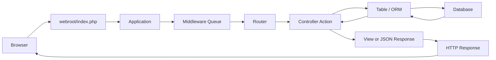
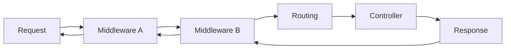
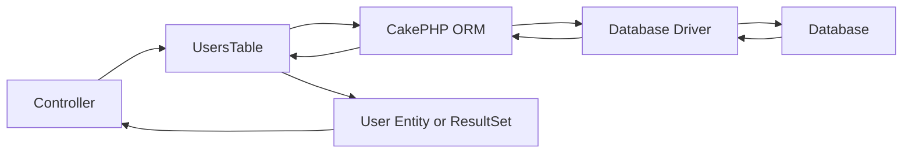
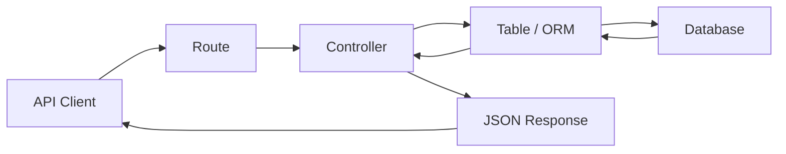
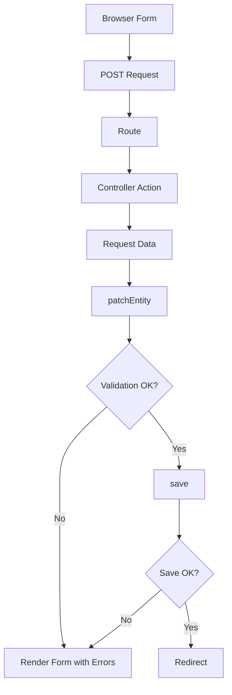
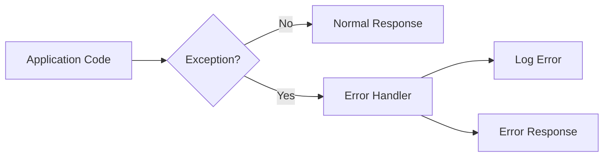
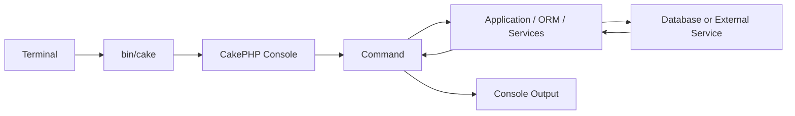
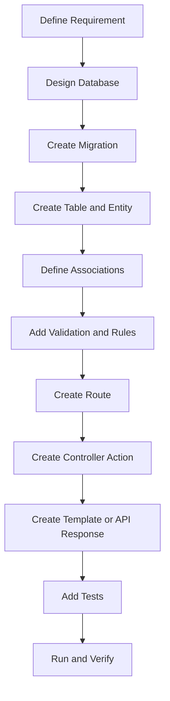

# CakePHP Application Workflow Guide

> A practical guide to understanding how a CakePHP application works from an incoming HTTP request to routing, middleware, controllers, ORM/database access, views, responses, CLI commands, and debugging.

> **Target:** CakePHP 5.x.

## Table of Contents

- [1. Goal](#1-goal)
- [2. The Big Picture](#2-the-big-picture)
- [3. Main CakePHP Runtime Layers](#3-main-cakephp-runtime-layers)
- [4. HTTP Request Lifecycle](#4-http-request-lifecycle)
- [5. Routing Flow](#5-routing-flow)
- [6. Middleware Flow](#6-middleware-flow)
- [7. Controller Flow](#7-controller-flow)
- [8. Model and ORM Flow](#8-model-and-orm-flow)
- [9. Database Read Flow](#9-database-read-flow)
- [10. Database Write Flow](#10-database-write-flow)
- [11. View and Response Flow](#11-view-and-response-flow)
- [12. JSON API Flow](#12-json-api-flow)
- [13. Form Submission Flow](#13-form-submission-flow)
- [14. Validation and Rules Flow](#14-validation-and-rules-flow)
- [15. Authentication and Authorization Position](#15-authentication-and-authorization-position)
- [16. Error and Exception Flow](#16-error-and-exception-flow)
- [17. CLI Command Flow](#17-cli-command-flow)
- [18. Migration Flow](#18-migration-flow)
- [19. Example: Users Index Page](#19-example-users-index-page)
- [20. Example: Create User](#20-example-create-user)
- [21. How to Trace an Existing CakePHP Feature](#21-how-to-trace-an-existing-cakephp-feature)
- [22. Debugging Workflow](#22-debugging-workflow)
- [23. Workflow-to-File Map](#23-workflow-to-file-map)
- [24. Recommended Development Workflow](#24-recommended-development-workflow)
- [25. Workflow Checklist](#25-workflow-checklist)
- [26. Related Documentation](#26-related-documentation)
- [27. References](#27-references)

---

## 1. Goal

The goal of this document is to answer:

> **What happens inside CakePHP when a request enters the application?**

and:

> **Where should you look when you need to understand, debug, or modify a CakePHP feature?**

A CakePHP application should not be read as one large block of PHP code.

Instead, follow the application flow:

```text
URL
  |
  v
Route
  |
  v
Middleware
  |
  v
Controller
  |
  v
Table / ORM
  |
  v
Database
  |
  v
Controller
  |
  v
View / JSON
  |
  v
Response
```

---

## 2. The Big Picture

A standard browser request usually follows this path:



This is the most important CakePHP workflow to remember.

A controller should coordinate the request. Heavy business logic should generally live outside the controller, commonly in the model/domain/service layer.

---

## 3. Main CakePHP Runtime Layers

The main runtime layers are:

| Layer | Main Responsibility | Common Location |
|---|---|---|
| Entry Point | Starts the web application | `webroot/index.php` |
| Application | Configures application runtime | `src/Application.php` |
| Middleware | Handles cross-cutting HTTP concerns | `src/Application.php`, `src/Middleware/` |
| Router | Maps URL to controller/action | `config/routes.php` |
| Controller | Coordinates request handling | `src/Controller/` |
| Table | Queries and persists collections | `src/Model/Table/` |
| Entity | Represents one record | `src/Model/Entity/` |
| Database | Stores application data | MySQL/PostgreSQL/etc. |
| View | Coordinates rendering | `src/View/` |
| Template | Produces HTML/output | `templates/` |
| Response | Returns HTTP result | CakePHP HTTP layer |

A simplified file tree:

```text
www/
├── config/
│   ├── app.php
│   ├── app_local.php
│   └── routes.php
│
├── src/
│   ├── Application.php
│   ├── Controller/
│   │   └── UsersController.php
│   ├── Middleware/
│   └── Model/
│       ├── Entity/
│       │   └── User.php
│       └── Table/
│           └── UsersTable.php
│
├── templates/
│   └── Users/
│       ├── index.php
│       ├── view.php
│       ├── add.php
│       └── edit.php
│
└── webroot/
    └── index.php
```

---

## 4. HTTP Request Lifecycle

Suppose a browser requests:

```text
GET /users
```

The high-level lifecycle is:

```text
1. Web server receives the request
2. Request enters webroot/index.php
3. CakePHP application boots
4. Middleware processes the request
5. Router resolves URL
6. Controller action runs
7. Controller reads/writes data through ORM
8. Controller prepares response data
9. View/template renders or JSON response is built
10. Response travels back through middleware
11. Web server returns response to client
```

### Important

The request is represented by CakePHP's request object.

In a controller:

```php
$this->request
```

Examples:

```php
$method = $this->request->getMethod();

$data = $this->request->getData();

$id = $this->request->getParam('id');

$query = $this->request->getQuery();
```

---

## 5. Routing Flow

Routes decide which controller and action handle a URL.

Typical location:

```text
config/routes.php
```

Example:

```php
$routes->connect(
    '/users',
    [
        'controller' => 'Users',
        'action' => 'index',
    ]
);
```

Flow:

```text
GET /users
    |
    v
config/routes.php
    |
    v
UsersController
    |
    v
index()
```

### Dynamic parameters

Example:

```php
$routes->connect(
    '/users/{id}',
    [
        'controller' => 'Users',
        'action' => 'view',
    ]
)->setPass(['id']);
```

Request:

```text
GET /users/10
```

can resolve to:

```text
UsersController::view(10)
```

### Debug routes

Use:

```bash
bin/cake routes
```

With Docker:

```bash
docker compose exec app php bin/cake routes
```

This is one of the first commands to use when a URL returns an unexpected 404.

---

## 6. Middleware Flow

Middleware sits between the HTTP entry point and the controller layer.

A simplified flow:



Middleware can be used for:

- error handling;
- asset handling;
- routing;
- request body parsing;
- CSRF protection;
- authentication;
- authorization integration;
- CORS;
- custom headers;
- request logging.

The application middleware queue is commonly configured in:

```text
src/Application.php
```

Example concept:

```php
public function middleware(MiddlewareQueue $middlewareQueue): MiddlewareQueue
{
    $middlewareQueue
        ->add(new ErrorHandlerMiddleware(...))
        ->add(new RoutingMiddleware($this));

    return $middlewareQueue;
}
```

### Why middleware order matters

Middleware runs in sequence.

Changing:

```text
A -> B -> C
```

to:

```text
C -> A -> B
```

can change application behavior.

When debugging authentication, routing, CORS, CSRF, or headers, always inspect middleware order.

---

## 7. Controller Flow

After routing determines the correct controller/action, CakePHP runs the controller.

Example:

```text
src/Controller/UsersController.php
```

```php
namespace App\Controller;

class UsersController extends AppController
{
    public function index(): void
    {
        $users = $this->Users->find()->all();

        $this->set(compact('users'));
    }
}
```

The controller does three main things:

```text
Read Request
    |
    v
Coordinate Application Logic
    |
    v
Create Response Data
```

### Controller responsibilities

A controller commonly:

- reads route parameters;
- reads query parameters;
- reads POST data;
- calls model/service logic;
- handles success/failure flow;
- sets view variables;
- redirects;
- creates JSON/file/custom responses.

### Thin controller principle

Prefer:

```text
Controller
    |
    +-- coordinate
    +-- call domain/model/service logic
    +-- select response
```

Avoid putting large amounts of business logic directly into controller actions.

---

## 8. Model and ORM Flow

CakePHP's ORM primarily uses:

```text
Table Objects
+
Entities
```

For:

```text
users
```

the conventional model classes are:

```text
src/Model/Table/UsersTable.php
src/Model/Entity/User.php
```

### Table class

A Table class represents a collection of records.

Typical responsibilities:

- queries;
- associations;
- validation;
- application rules;
- save/delete operations;
- custom finders.

### Entity class

An Entity represents one record.

Example:

```text
users table

id | name | email
10 | Alan | alan@example.com

        |
        v

User Entity
```

### ORM flow



---

## 9. Database Read Flow

Example controller query:

```php
$users = $this->Users
    ->find()
    ->where([
        'active' => true,
    ])
    ->orderBy([
        'name' => 'ASC',
    ])
    ->all();
```

Conceptual flow:

```text
UsersController
    |
    v
UsersTable
    |
    v
Query Builder
    |
    v
SQL
    |
    v
Database
    |
    v
Rows
    |
    v
Entities / ResultSet
    |
    v
UsersController
```

The controller usually should not create raw database connections manually.

Use the CakePHP data layer unless there is a specific technical reason not to.

---

## 10. Database Write Flow

Writing data normally has more steps than reading.

Typical create flow:

```text
POST data
   |
   v
newEmptyEntity()
   |
   v
patchEntity()
   |
   +--> Validation
   |
   v
save()
   |
   +--> Application Rules
   |
   v
Database
```

Example:

```php
$user = $this->Users->newEmptyEntity();

if ($this->request->is('post')) {
    $user = $this->Users->patchEntity(
        $user,
        $this->request->getData()
    );

    if ($this->Users->save($user)) {
        return $this->redirect([
            'action' => 'view',
            $user->id,
        ]);
    }
}

$this->set(compact('user'));
```

### Important distinction

```text
patchEntity()
    |
    +-- maps request data
    +-- validation
    +-- updates entity state

save()
    |
    +-- rules
    +-- persistence
    +-- database write
```

---

## 11. View and Response Flow

For normal HTML pages, the controller passes data to the view layer.

Example:

```php
$this->set(compact('users'));
```

By convention:

```text
UsersController::index()
        |
        v
templates/Users/index.php
```

Template example:

```php
<h1>Users</h1>

<?php foreach ($users as $user): ?>
    <p><?= h($user->name) ?></p>
<?php endforeach; ?>
```

Rendering flow:

```text
Controller Action
    |
    v
View Variables
    |
    v
Template
    |
    v
Layout
    |
    v
HTML Response
```

A layout is commonly located in:

```text
templates/layout/default.php
```

---

## 12. JSON API Flow

CakePHP does not require every request to render HTML.

API flow:



Example explicit response:

```php
public function view($id)
{
    $user = $this->Users->get($id);

    return $this->response
        ->withType('application/json')
        ->withStringBody(json_encode([
            'id' => $user->id,
            'name' => $user->name,
        ]));
}
```

A real CakePHP API may instead use CakePHP's JSON view/serialization features.

The important difference is:

```text
HTML page:
Controller -> Template -> HTML

API:
Controller -> Serialized Data -> JSON
```

---

## 13. Form Submission Flow

A typical form workflow:



Example controller action:

```php
public function add()
{
    $user = $this->Users->newEmptyEntity();

    if ($this->request->is('post')) {
        $user = $this->Users->patchEntity(
            $user,
            $this->request->getData()
        );

        if ($this->Users->save($user)) {
            $this->Flash->success('User saved.');

            return $this->redirect([
                'action' => 'index',
            ]);
        }

        $this->Flash->error('Unable to save user.');
    }

    $this->set(compact('user'));
}
```

---

## 14. Validation and Rules Flow

CakePHP separates validation from application rules.

### Validation

Validation checks whether incoming data has an acceptable format.

Examples:

```text
Required field
Valid email
Minimum length
Numeric value
Date format
```

Usually defined in:

```text
src/Model/Table/UsersTable.php
```

Example:

```php
public function validationDefault(Validator $validator): Validator
{
    $validator
        ->requirePresence('email', 'create')
        ->notEmptyString('email')
        ->email('email');

    return $validator;
}
```

### Application rules

Rules validate application state.

Example:

```text
Email must be unique.
Company must exist.
Order cannot be deleted after payment.
```

Conceptual flow:

```text
Request Data
    |
    v
Validation
    |
    v
Entity
    |
    v
Application Rules
    |
    v
Database Write
```

---

## 15. Authentication and Authorization Position

Authentication and authorization are related but different.

```text
Authentication:
Who are you?

Authorization:
Are you allowed to do this?
```

They can participate at different application layers depending on the libraries and architecture used.

A common conceptual flow is:

```text
Request
   |
   v
Authentication Middleware
   |
   v
Routing
   |
   v
Authorization Check
   |
   v
Controller
```

Do not assume every CakePHP project implements authentication in exactly the same place.

When analyzing an existing project, inspect:

```text
composer.json
src/Application.php
src/Controller/AppController.php
src/Controller/
config/routes.php
plugins/
```

---

## 16. Error and Exception Flow

Errors can occur at any stage:

```text
Routing
Middleware
Controller
ORM
Database
Template
External Service
```

Conceptually:



Useful places to inspect:

```text
logs/
config/app.php
config/app_local.php
src/Application.php
```

Docker environment:

```bash
docker compose logs -f app
```

CakePHP logs:

```text
www/logs/
```

---

## 17. CLI Command Flow

CakePHP also works without an HTTP request.

CLI entry point:

```text
bin/cake
```

Example:

```bash
bin/cake routes
```

Docker:

```bash
docker compose exec app php bin/cake routes
```

Conceptual flow:



Custom commands commonly live in:

```text
src/Command/
```

Examples:

```text
ImportUsersCommand
GenerateReportCommand
SyncOrdersCommand
CleanupFilesCommand
```

---

## 18. Migration Flow

If the project uses CakePHP Migrations:

```text
Migration File
    |
    v
bin/cake migrations migrate
    |
    v
Migration Plugin
    |
    v
Database Schema Change
```

Typical commands:

```bash
bin/cake migrations status
bin/cake migrations migrate
```

Docker:

```bash
docker compose exec app php bin/cake migrations status
docker compose exec app php bin/cake migrations migrate
```

Always distinguish:

```text
Schema migration
    !=
Application data migration
```

Schema migration changes tables/columns/indexes.

Data migration changes application records.

For important production migrations, plan:

```text
Inventory
Mapping
Backup
Migration
Verification
Rollback
```

---

## 19. Example: Users Index Page

Suppose the browser opens:

```text
http://cakephp.local:8080/users
```

### Step 1 — Browser

```text
GET /users
```

### Step 2 — Apache

Apache serves CakePHP through:

```text
webroot/index.php
```

### Step 3 — CakePHP application

Application and middleware start processing the request.

### Step 4 — Router

```text
/users
    |
    v
UsersController::index()
```

### Step 5 — Controller

```php
public function index(): void
{
    $users = $this->Users->find()->all();

    $this->set(compact('users'));
}
```

### Step 6 — ORM

```text
UsersTable
    |
    v
users database table
```

### Step 7 — Database

Database returns user rows.

### Step 8 — Entity/ResultSet

CakePHP converts results into ORM objects.

### Step 9 — Template

CakePHP renders:

```text
templates/Users/index.php
```

### Step 10 — Response

HTML returns to the browser.

Full path:

```text
GET /users
   |
   v
webroot/index.php
   |
   v
Application
   |
   v
Middleware
   |
   v
Router
   |
   v
UsersController::index()
   |
   v
UsersTable
   |
   v
Database
   |
   v
UsersTable
   |
   v
UsersController
   |
   v
templates/Users/index.php
   |
   v
HTML Response
```

---

## 20. Example: Create User

Request:

```text
POST /users/add
```

Form:

```text
name=Alan
email=alan@example.com
```

Flow:

```text
POST /users/add
    |
    v
Route
    |
    v
UsersController::add()
    |
    v
$request->getData()
    |
    v
UsersTable::newEmptyEntity()
    |
    v
UsersTable::patchEntity()
    |
    v
Validation
    |
    v
UsersTable::save()
    |
    v
Application Rules
    |
    v
INSERT / UPDATE
    |
    v
Database
    |
    v
Redirect / Success Response
```

This flow is fundamental for CakePHP CRUD development.

---

## 21. How to Trace an Existing CakePHP Feature

When you inherit an unfamiliar CakePHP project, do not start by reading every file.

Start from the visible behavior.

Example:

```text
URL:
/customers/view/100
```

### Step 1 — Find the route

Inspect:

```text
config/routes.php
```

or run:

```bash
bin/cake routes
```

### Step 2 — Find the controller

Example:

```text
src/Controller/CustomersController.php
```

Find:

```php
public function view($id)
```

### Step 3 — Find the model calls

Look for:

```text
$this->Customers
$this->Orders
fetchTable()
getTableLocator()
services
components
```

### Step 4 — Find the Table classes

Example:

```text
src/Model/Table/CustomersTable.php
src/Model/Table/OrdersTable.php
```

Inspect:

- associations;
- custom finders;
- validation;
- rules;
- callbacks;
- save logic.

### Step 5 — Find the Entity

Example:

```text
src/Model/Entity/Customer.php
```

Inspect:

- accessible fields;
- getters;
- setters;
- virtual fields.

### Step 6 — Find the template

Example:

```text
templates/Customers/view.php
```

Then inspect:

```text
templates/element/
templates/layout/
src/View/Helper/
src/View/Cell/
```

if the page uses shared UI components.

### Step 7 — Check plugins

If a class is not inside `src/`, inspect:

```text
plugins/
vendor/
composer.json
```

---

## 22. Debugging Workflow

A practical debugging order:

```text
1. URL
2. Route
3. Middleware
4. Controller
5. Request data
6. Table/ORM
7. SQL/database
8. Entity
9. Template/JSON
10. Response
11. Logs
```

### Problem: 404

Check:

```text
config/routes.php
bin/cake routes
Apache rewrite
VirtualHost
webroot/
```

### Problem: controller not called

Check:

```text
route
controller name
action name
prefix/plugin route
middleware
```

### Problem: wrong data

Check:

```text
controller parameters
Table finder
associations
conditions
database data
entity getters
```

### Problem: save fails

Check:

```text
request data
patchEntity errors
validation
rules
database constraints
callbacks
logs
```

Useful debug:

```php
debug($entity->getErrors());
```

### Problem: template incorrect

Check:

```text
Controller::set()
template path
layout
elements
helpers
view cells
CSS/JS
```

### Problem: database connection

Check:

```text
config/app_local.php
DB_HOST
DB_PORT
DB_DATABASE
DB_USERNAME
DB_PASSWORD
Docker mysql service
```

In the Docker setup from the previous guide:

```text
CakePHP -> mysql:3306
```

not:

```text
CakePHP -> localhost:3306
```

---

## 23. Workflow-to-File Map

| Workflow Stage | File / Location |
|---|---|
| HTTP Entry | `webroot/index.php` |
| Application Boot | `src/Application.php` |
| Middleware | `src/Application.php`, `src/Middleware/` |
| Routes | `config/routes.php` |
| Controller | `src/Controller/*Controller.php` |
| Shared Controller Logic | `src/Controller/AppController.php` |
| Table / ORM | `src/Model/Table/*Table.php` |
| Entity | `src/Model/Entity/*.php` |
| Validation | Usually Table class |
| Application Rules | Usually Table class |
| View | `src/View/` |
| Template | `templates/<Controller>/` |
| Layout | `templates/layout/` |
| Elements | `templates/element/` |
| Config | `config/app.php`, `config/app_local.php` |
| Database | Datasource configuration + database server |
| CLI Commands | `src/Command/` |
| CLI Entry | `bin/cake` |
| Logs | `logs/` |
| Public Assets | `webroot/` |

---

## 24. Recommended Development Workflow

When building a new CakePHP feature, a practical order is:



### Suggested implementation order

```text
1. Understand requirement
2. Identify data model
3. Design schema
4. Create migration
5. Build Table/Entity classes
6. Configure associations
7. Add validation
8. Add application rules
9. Add route
10. Add controller action
11. Add template/API response
12. Add tests
13. Verify logs and edge cases
```

This order is not mandatory for every feature, but it is a strong default for database-backed CakePHP work.

---

## 25. Workflow Checklist

### Request Flow

- [ ] Identify the URL.
- [ ] Identify the HTTP method.
- [ ] Find the route.
- [ ] Check middleware.
- [ ] Find the controller action.
- [ ] Inspect request parameters and request body.
- [ ] Identify model/service calls.
- [ ] Inspect ORM queries.
- [ ] Verify database data.
- [ ] Identify the response path.

### Data Flow

- [ ] Identify Table classes.
- [ ] Identify Entity classes.
- [ ] Check associations.
- [ ] Check validation.
- [ ] Check application rules.
- [ ] Check callbacks.
- [ ] Check database constraints.

### View Flow

- [ ] Identify view variables.
- [ ] Identify template.
- [ ] Identify layout.
- [ ] Identify elements.
- [ ] Identify helpers/cells.
- [ ] Identify public CSS/JS assets.

### Debugging

- [ ] Run `bin/cake routes`.
- [ ] Inspect application logs.
- [ ] Inspect Docker logs if using Docker.
- [ ] Check entity validation errors.
- [ ] Verify datasource configuration.
- [ ] Verify generated SQL/data conditions when necessary.
- [ ] Confirm that the issue is code, configuration, or data before changing logic.

---

## 26. Related Documentation

Recommended reading order:

```text
1. What Is CakePHP?
        |
        v
2. CakePHP Project Structure
        |
        v
3. CakePHP Application Workflow
        |
        v
4. CakePHP Docker Development
        |
        v
5. Real Project Analysis
```

Related files:

- [**What Is CakePHP?**](./what-is-cakephp.md)
- [**CakePHP Project Structure Guide**](./cakephp-project-structure.md)
- [**CakePHP Docker Development Guide**](./cakephp-docker-development-guide.md)

---

## 27. References

Official CakePHP documentation used as the technical baseline:

- [CakePHP 5.x Documentation](https://book.cakephp.org/5.x/)
- [Controllers](https://book.cakephp.org/5.x/controllers.html)
- [Request & Response Objects](https://book.cakephp.org/5.x/controllers/request-response.html)
- [Routing](https://book.cakephp.org/5.x/development/routing.html)
- [Middleware](https://book.cakephp.org/5.x/controllers/middleware.html)
- [Views](https://book.cakephp.org/5.x/views.html)
- [Database Access & ORM](https://book.cakephp.org/5.x/orm.html)
- [Table Objects](https://book.cakephp.org/5.x/orm/table-objects.html)
- [Entities](https://book.cakephp.org/5.x/orm/entities.html)
- [Validation](https://book.cakephp.org/5.x/orm/validation.html)
- [Console Commands](https://book.cakephp.org/5.x/console-commands.html)

---

## Summary

The core CakePHP request workflow is:

```text
Browser / API Client
        |
        v
webroot/index.php
        |
        v
Application
        |
        v
Middleware
        |
        v
Routing
        |
        v
Controller
        |
        v
Table / ORM
        |
        v
Database
        |
        v
Controller
        |
        v
Template / JSON
        |
        v
HTTP Response
```

For debugging an existing feature, follow this order:

```text
URL
-> Route
-> Middleware
-> Controller
-> Model / ORM
-> Database
-> View / Response
-> Logs
```

This workflow is more reliable than searching randomly through the project because each CakePHP layer has a clear responsibility and a predictable location.
