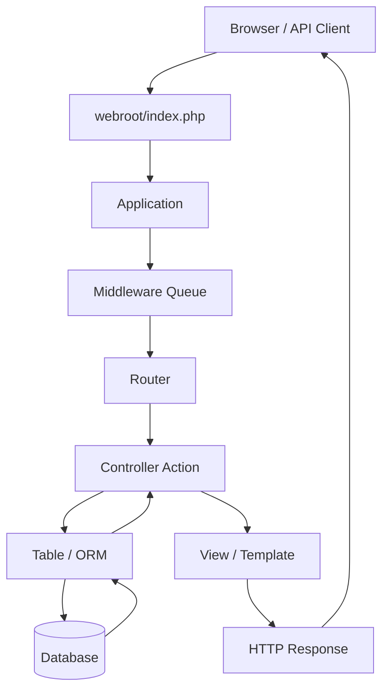

# CakePHP Project Structure Guide

> A practical reference for understanding the standard CakePHP application structure, request flow, MVC layers, database access, configuration, testing, plugins, runtime directories, and the main differences between CakePHP generations.

## Table of Contents

- [1. Scope](#1-scope)
- [2. CakePHP at a Glance](#2-cakephp-at-a-glance)
- [3. Standard CakePHP 5.x Project Structure](#3-standard-cakephp-5x-project-structure)
- [4. Root-Level Files](#4-root-level-files)
- [5. Top-Level Directories](#5-top-level-directories)
- [6. The `config/` Directory](#6-the-config-directory)
- [7. The `src/` Directory](#7-the-src-directory)
- [8. The `templates/` Directory](#8-the-templates-directory)
- [9. The `webroot/` Directory](#9-the-webroot-directory)
- [10. The `plugins/` Directory](#10-the-plugins-directory)
- [11. The `resources/` Directory](#11-the-resources-directory)
- [12. The `tests/` Directory](#12-the-tests-directory)
- [13. Runtime and Dependency Directories](#13-runtime-and-dependency-directories)
- [14. Database Connection and ORM Structure](#14-database-connection-and-orm-structure)
- [15. MVC Request Flow](#15-mvc-request-flow)
- [16. Naming Conventions](#16-naming-conventions)
- [17. Example: Users Feature](#17-example-users-feature)
- [18. Where to Look for Common Tasks](#18-where-to-look-for-common-tasks)
- [19. CakePHP Version Structure Differences](#19-cakephp-version-structure-differences)
- [20. How to Identify the CakePHP Version](#20-how-to-identify-the-cakephp-version)
- [21. Production and Deployment Notes](#21-production-and-deployment-notes)
- [22. Structure Verification Checklist](#22-structure-verification-checklist)
- [23. References](#23-references)

---

## 1. Scope

This document focuses on the **standard CakePHP 5.x application skeleton**, which is the current structure used by modern CakePHP applications.

A real project can contain additional directories created by plugins, packages, generators, custom architecture, or project-specific conventions. Therefore, this guide distinguishes between:

- standard CakePHP application directories;
- common generated or optional directories;
- project-specific directories that may be added by developers.

A short comparison with CakePHP 2.x, 3.x, and 4.x is included near the end because older CakePHP projects can look significantly different.

---

## 2. CakePHP at a Glance

CakePHP is a PHP web application framework built around **Convention over Configuration** and an MVC-style architecture.

The main application flow is usually:

```text
HTTP Request
    |
    v
webroot/index.php
    |
    v
Application / Middleware
    |
    v
Router
    |
    v
Controller
    |
    +------> Table / ORM ------> Database
    |
    v
View / Template
    |
    v
HTTP Response
```

CakePHP automatically connects many classes through naming conventions.

For example:

```text
Database table: users

        |
        v

src/Model/Table/UsersTable.php
        |
        v

src/Model/Entity/User.php
        |
        v

src/Controller/UsersController.php
        |
        v

templates/Users/index.php
```

---

## 3. Standard CakePHP 5.x Project Structure

A typical CakePHP 5.x project looks like this:

```text
my_app/
├── bin/
│   └── cake
│
├── config/
│   ├── app.php
│   ├── app_local.php
│   ├── bootstrap.php
│   └── routes.php
│
├── logs/
│
├── plugins/
│
├── resources/
│   └── locales/
│
├── src/
│   ├── Application.php
│   ├── Command/
│   ├── Console/
│   ├── Controller/
│   │   ├── AppController.php
│   │   └── Component/
│   ├── Form/
│   ├── Mailer/
│   ├── Middleware/
│   ├── Model/
│   │   ├── Behavior/
│   │   ├── Entity/
│   │   ├── Enum/
│   │   └── Table/
│   └── View/
│       ├── Cell/
│       └── Helper/
│
├── templates/
│   ├── element/
│   ├── email/
│   ├── Error/
│   ├── layout/
│   └── <ControllerName>/
│
├── tests/
│   ├── Fixture/
│   └── TestCase/
│
├── tmp/
│
├── vendor/
│
├── webroot/
│   ├── css/
│   ├── img/
│   ├── js/
│   ├── .htaccess
│   └── index.php
│
├── .editorconfig
├── .gitattributes
├── .gitignore
├── .htaccess
├── composer.json
├── index.php
├── phpcs.xml
├── phpstan.neon
├── phpunit.xml.dist
└── README.md
```

Not every optional subdirectory is created in every fresh project. Some appear after you create the corresponding class or feature.

---

## 4. Root-Level Files

### `composer.json`

Defines the PHP dependencies, autoloading rules, scripts, and package metadata.

The most important dependency for identifying the framework version is usually:

```json
{
  "require": {
    "cakephp/cakephp": "^5.x"
  }
}
```

Use this file first when you need to determine which CakePHP version a project uses.

### `.env` or environment variables

CakePHP projects often use environment variables for deployment-specific configuration.

A `.env` file is **not guaranteed to exist** in the standard skeleton. Some projects use a package such as dotenv, Docker environment variables, CI/CD secrets, or server-level configuration instead.

Do not assume database credentials are always stored in a `.env` file.

### `.htaccess`

Used primarily with Apache for URL rewriting.

CakePHP normally routes requests through:

```text
webroot/index.php
```

The application should not expose internal directories such as `config/`, `src/`, or `vendor/` directly.

### `phpunit.xml.dist`

Default PHPUnit configuration for automated tests.

### `phpcs.xml`

Configuration for PHP_CodeSniffer and coding-style validation.

### `phpstan.neon`

Configuration for PHPStan static analysis when included by the application skeleton or project.

### `README.md`

Project-level installation, development, deployment, or contributor documentation.

---

## 5. Top-Level Directories

| Directory | Responsibility | Usually Edited by Developers? |
|---|---|---|
| `bin/` | CakePHP console executable | Rarely |
| `config/` | Application, database, bootstrap, and routing configuration | Yes |
| `logs/` | Runtime log output | No |
| `plugins/` | Application plugins | Sometimes |
| `resources/` | Localization and resource files | Yes |
| `src/` | Main PHP application source code | Yes |
| `templates/` | HTML/view templates and layouts | Yes |
| `tests/` | Automated tests and fixtures | Yes |
| `tmp/` | Cache, sessions, and temporary runtime data | No |
| `vendor/` | Composer dependencies | No |
| `webroot/` | Public web files and front controller | Yes, carefully |

The two most important development areas are normally:

```text
src/
templates/
```

The two directories that should normally **not** be manually edited are:

```text
vendor/
tmp/
```

---

## 6. The `config/` Directory

The `config/` directory contains the application's core configuration.

Typical structure:

```text
config/
├── app.php
├── app_local.php
├── bootstrap.php
└── routes.php
```

### `config/app.php`

Contains application-wide configuration that should generally remain consistent between environments.

Common settings include:

- application namespace;
- default locale;
- timezone;
- encoding;
- cache configuration;
- logging configuration;
- email transports;
- datasource defaults;
- security-related application settings.

### `config/app_local.php`

Contains environment-specific configuration.

This is one of the first files to inspect when checking a CakePHP database connection.

Typical database configuration:

```php
'Datasources' => [
    'default' => [
        'className' => 'Cake\\Database\\Connection',
        'driver' => 'Cake\\Database\\Driver\\Mysql',
        'host' => 'localhost',
        'username' => 'root',
        'password' => 'secret',
        'database' => 'my_database',
    ],
],
```

Depending on the project, values can be loaded from environment variables instead of being written directly into this file.

### `config/bootstrap.php`

Runs during application startup.

It is commonly used to:

- load configuration;
- configure services;
- initialize plugins;
- configure localization;
- load project-specific bootstrap logic.

Avoid putting normal controller or business logic here.

### `config/routes.php`

Defines URL routing.

Example:

```php
$routes->connect(
    '/users',
    ['controller' => 'Users', 'action' => 'index']
);
```

This maps:

```text
GET /users
        |
        v
UsersController::index()
```

Routes can also define:

- route prefixes;
- plugin routes;
- REST-style resources;
- scoped routes;
- fallback routes.

---

## 7. The `src/` Directory

The `src/` directory contains the main PHP source code for the application.

### 7.1 `src/Application.php`

The central application class.

Typical responsibilities include:

- application bootstrap integration;
- middleware registration;
- service container registration;
- plugin loading;
- application lifecycle configuration.

Conceptually:

```text
HTTP Request
    |
    v
Application.php
    |
    v
Middleware Queue
    |
    v
Router / Controller
```

### 7.2 `src/Controller/`

Contains HTTP controllers.

Example:

```text
src/Controller/
├── AppController.php
├── UsersController.php
└── Component/
```

A controller receives a routed request and coordinates the application response.

Example:

```php
class UsersController extends AppController
{
    public function index()
    {
        $users = $this->Users->find()->all();
        $this->set(compact('users'));
    }
}
```

Controllers should generally coordinate work instead of containing large amounts of reusable business logic.

#### `AppController.php`

Base controller for the application.

Shared controller configuration can be defined here, such as:

- components;
- authentication-related setup;
- authorization-related setup;
- shared initialization logic.

#### `Controller/Component/`

Contains reusable controller-level components.

A component is useful for logic that must be shared between multiple controllers but still belongs to the HTTP/controller layer.

---

### 7.3 `src/Model/`

Contains the application's ORM and data-layer classes.

Typical structure:

```text
src/Model/
├── Behavior/
├── Entity/
├── Enum/
└── Table/
```

#### `Model/Table/`

Table classes represent database tables and provide the main ORM query interface.

Example:

```text
Database:
users

CakePHP:
src/Model/Table/UsersTable.php
```

Typical responsibilities:

- table configuration;
- associations;
- validation;
- finders;
- persistence rules;
- ORM queries.

Example:

```php
class UsersTable extends Table
{
    public function initialize(array $config): void
    {
        parent::initialize($config);

        $this->setTable('users');
        $this->setPrimaryKey('id');
    }
}
```

#### `Model/Entity/`

Entity classes represent individual records.

Example:

```text
users table
    |
    +-- row id=10
            |
            v
      User entity
```

Typical entity file:

```text
src/Model/Entity/User.php
```

Entities can contain:

- accessible-field configuration;
- virtual properties;
- getters and setters;
- record-specific domain behavior.

#### `Model/Behavior/`

Behaviors package reusable model/table logic.

Use a behavior when multiple Table classes need the same data-layer functionality.

#### `Model/Enum/`

May contain application enums used by the model/domain layer.

This is useful for values such as:

```text
OrderStatus
UserRole
PaymentState
```

The exact use of enums depends on the application architecture.

---

### 7.4 `src/Form/`

Contains form objects that are not directly backed by a database table.

Useful for:

- contact forms;
- search forms;
- multi-model forms;
- command-style input;
- validation-only forms.

Example:

```text
src/Form/ContactForm.php
```

---

### 7.5 `src/Mailer/`

Contains email-related classes.

Example:

```text
src/Mailer/UserMailer.php
```

Typical responsibilities:

- selecting email templates;
- setting recipients;
- setting subjects;
- passing data into email templates.

---

### 7.6 `src/Middleware/`

Contains custom PSR-style middleware.

Middleware runs before or after the controller and can inspect or modify the HTTP request/response.

Common examples:

- authentication;
- authorization;
- CORS;
- API request logging;
- custom headers;
- request normalization.

Flow:

```text
Request
  |
Middleware A
  |
Middleware B
  |
Router
  |
Controller
  |
Response
```

---

### 7.7 `src/Command/`

Contains CakePHP CLI commands.

Example:

```text
src/Command/ImportUsersCommand.php
```

A command can be executed through the Cake console.

Conceptually:

```bash
bin/cake import_users
```

This directory may not exist until a command is created.

---

### 7.8 `src/Console/`

Used for console-related application setup, including scripts used during installation or Composer-driven setup depending on the application skeleton/version.

Most normal application development will happen in `Command/`, not in `Console/`.

---

### 7.9 `src/View/`

Contains PHP classes related to presentation behavior.

Typical structure:

```text
src/View/
├── AppView.php
├── Cell/
└── Helper/
```

#### `AppView.php`

Base View class for application-wide view configuration.

#### `View/Helper/`

Helpers provide reusable presentation logic for templates.

Examples:

- custom HTML rendering;
- formatting values;
- reusable UI behavior.

#### `View/Cell/`

View Cells are small reusable presentation units with their own logic and templates.

They are useful for components such as:

- dashboard widgets;
- sidebar blocks;
- notification counters;
- reusable dynamic fragments.

---

## 8. The `templates/` Directory

The `templates/` directory contains presentation templates.

Typical structure:

```text
templates/
├── Users/
│   ├── index.php
│   ├── view.php
│   ├── add.php
│   └── edit.php
├── element/
├── email/
├── Error/
└── layout/
    └── default.php
```

### Controller templates

The controller name normally maps to a template directory.

Example:

```text
UsersController::index()
        |
        v
templates/Users/index.php
```

### `templates/layout/`

Contains page layouts.

The default layout usually wraps the template content with the shared HTML structure.

Example:

```text
<html>
  <head>...</head>
  <body>
      Header
      Navigation

      Page template content

      Footer
  </body>
</html>
```

### `templates/element/`

Contains reusable template fragments.

Examples:

```text
templates/element/header.php
templates/element/footer.php
templates/element/pagination.php
```

Elements are useful when the same HTML fragment appears in multiple views.

### `templates/email/`

Contains email templates.

Depending on project configuration, separate HTML and text versions can be used.

### `templates/Error/`

Contains error-page templates.

Examples may include application-specific rendering for:

- 404 errors;
- 500 errors;
- development exceptions.

---

## 9. The `webroot/` Directory

The `webroot/` directory is the **public document root**.

Typical structure:

```text
webroot/
├── css/
├── img/
├── js/
├── files/
├── .htaccess
└── index.php
```

Only files intended to be publicly reachable should normally be placed here.

### `webroot/index.php`

This is the HTTP front controller.

A normal request ultimately enters the CakePHP application through this file.

```text
Browser
   |
   v
webroot/index.php
   |
   v
CakePHP application
```

### Static assets

Typical public assets:

```text
webroot/css/
webroot/js/
webroot/img/
```

User-uploaded files may also be exposed here, but applications often use dedicated storage services or protected download handlers instead.

### Security rule

The web server's document root should point to:

```text
/path/to/project/webroot
```

and **not** to the project root.

This helps prevent direct public access to:

```text
config/
src/
vendor/
tests/
logs/
```

---

## 10. The `plugins/` Directory

CakePHP plugins are modular packages that can contain their own:

- controllers;
- models;
- templates;
- routes;
- commands;
- migrations;
- configuration;
- tests.

Conceptually:

```text
plugins/
└── ExamplePlugin/
    ├── config/
    ├── src/
    ├── templates/
    └── tests/
```

Plugins can be application-local or installed through Composer.

Do not assume every dependency in `vendor/` is a CakePHP plugin.

---

## 11. The `resources/` Directory

The standard modern CakePHP skeleton uses `resources/` for non-code application resources.

A common structure is:

```text
resources/
└── locales/
```

### `resources/locales/`

Contains translation files used for internationalization and localization.

Typical use cases:

- UI translations;
- validation messages;
- multilingual applications.

---

## 12. The `tests/` Directory

Contains automated tests.

A common structure:

```text
tests/
├── Fixture/
└── TestCase/
    ├── Controller/
    ├── Model/
    │   └── Table/
    └── ...
```

### `tests/TestCase/`

Contains test classes.

The structure often mirrors the application code.

Example:

```text
src/Controller/UsersController.php
        |
        v
tests/TestCase/Controller/UsersControllerTest.php
```

### `tests/Fixture/`

Contains database fixtures when the project uses fixture-based testing.

Fixtures provide controlled test data.

Modern projects can also use migrations, factories, or other testing strategies depending on the tooling installed.

---

## 13. Runtime and Dependency Directories

### `logs/`

Contains application logs.

Examples:

```text
logs/error.log
logs/debug.log
```

The exact filenames depend on logging configuration.

This directory normally needs to be writable by the PHP process.

### `tmp/`

Contains temporary runtime data.

Depending on configuration, it can contain:

- cache files;
- session data;
- temporary application data.

This directory must normally be writable.

Do not treat files in `tmp/` as durable application data.

### `vendor/`

Contains Composer-installed dependencies.

Typical contents include:

```text
vendor/cakephp/
vendor/psr/
vendor/composer/
...
```

Important rule:

> Do not manually edit files inside `vendor/`.

Changes can be overwritten by:

```bash
composer install
composer update
```

The actual CakePHP framework source is installed under Composer-managed dependencies, while your application code belongs in `src/`.

---

## 14. Database Connection and ORM Structure

CakePHP supports database access through its datasource and ORM layers.

### 14.1 Where to check the database configuration

Start with:

```text
config/app_local.php
```

Then check:

```text
config/app.php
environment variables
deployment configuration
Docker configuration
CI/CD secrets
```

Search for:

```text
Datasources
default
Cake\Database\Driver\Mysql
host
port
username
database
```

### 14.2 Database-to-code mapping

For a table:

```sql
users
```

CakePHP commonly maps it to:

```text
src/Model/Table/UsersTable.php
src/Model/Entity/User.php
```

The Table class works with collections and queries.

The Entity class represents a single record.

Conceptually:

```text
users table
    |
    +-- UsersTable
          |
          +-- find()
          +-- get()
          +-- save()
          +-- delete()
          |
          v
       User Entity
```

### 14.3 Associations

Associations are normally defined in Table classes.

Examples:

```php
$this->belongsTo('Companies');
$this->hasMany('Orders');
$this->belongsToMany('Roles');
```

This creates an ORM-level relationship between application models.

---

## 15. MVC Request Flow

A simplified CakePHP request lifecycle:



For an API endpoint that returns JSON, the view/template stage can differ depending on how the controller serializes the response.

The important separation is:

| Layer | Main Responsibility |
|---|---|
| Router | Map URL to application action |
| Middleware | Cross-cutting HTTP processing |
| Controller | Coordinate request handling |
| Table / ORM | Query and persist data |
| Entity | Represent individual records |
| View / Template | Render output |
| Webroot | Public HTTP entry point and static files |

---

## 16. Naming Conventions

CakePHP relies heavily on conventions.

Example domain:

```text
Database table:
users

Table class:
UsersTable

Entity:
User

Controller:
UsersController

Template directory:
templates/Users/
```

### Common mapping

| Object | Convention Example |
|---|---|
| Database table | `users` |
| Table class | `UsersTable` |
| Entity class | `User` |
| Controller | `UsersController` |
| Controller URL | `/users` |
| Template directory | `templates/Users/` |
| Index action template | `templates/Users/index.php` |

Following CakePHP conventions reduces explicit configuration.

A project can override conventions, but custom mappings should be verified instead of assumed.

---

## 17. Example: Users Feature

A basic Users feature could look like:

```text
src/
├── Controller/
│   └── UsersController.php
└── Model/
    ├── Entity/
    │   └── User.php
    └── Table/
        └── UsersTable.php

templates/
└── Users/
    ├── index.php
    ├── view.php
    ├── add.php
    └── edit.php

tests/
└── TestCase/
    ├── Controller/
    │   └── UsersControllerTest.php
    └── Model/
        └── Table/
            └── UsersTableTest.php
```

Request:

```text
GET /users
```

Flow:

```text
routes.php
   |
   v
UsersController::index()
   |
   v
UsersTable::find()
   |
   v
users database table
   |
   v
templates/Users/index.php
   |
   v
HTML response
```

This pattern is one of the easiest ways to navigate an unfamiliar CakePHP codebase.

---

## 18. Where to Look for Common Tasks

| You Need to Find | Start Here |
|---|---|
| Database credentials | `config/app_local.php` |
| Database driver | `config/app.php`, `config/app_local.php` |
| URL definitions | `config/routes.php` |
| Request handling | `src/Controller/` |
| Database queries | `src/Model/Table/` |
| Record properties | `src/Model/Entity/` |
| Model associations | `src/Model/Table/` |
| HTML pages | `templates/<Controller>/` |
| Shared page layout | `templates/layout/` |
| Shared HTML fragments | `templates/element/` |
| Public JavaScript | `webroot/js/` |
| Public CSS | `webroot/css/` |
| Public images | `webroot/img/` |
| Middleware | `src/Middleware/` or `Application.php` |
| CLI commands | `src/Command/` |
| Email logic | `src/Mailer/` |
| Translation files | `resources/locales/` |
| Application logs | `logs/` |
| Composer packages | `composer.json`, `vendor/` |
| Automated tests | `tests/` |
| Installed CakePHP version | `composer.json`, `composer.lock` |

---

## 19. CakePHP Version Structure Differences

CakePHP's structure has changed across major versions.

### CakePHP 2.x

Typical application structure:

```text
app/
├── Config/
│   ├── database.php
│   ├── bootstrap.php
│   └── routes.php
├── Controller/
├── Model/
├── Plugin/
├── View/
│   ├── Elements/
│   └── Layouts/
├── webroot/
└── tmp/
```

Key characteristics:

- main application code is under `app/`;
- database configuration is commonly in `app/Config/database.php`;
- views commonly use `.ctp` files;
- no modern `src/Model/Table` + `Entity` structure.

### CakePHP 3.x

CakePHP 3 introduced the modern namespace-oriented source structure.

Common characteristics:

```text
src/
├── Controller/
├── Model/
│   ├── Entity/
│   └── Table/
├── Shell/
├── Template/
└── View/
```

An important difference from newer CakePHP versions is that templates were commonly located under:

```text
src/Template/
```

instead of the modern top-level:

```text
templates/
```

### CakePHP 4.x

CakePHP 4 moved toward the structure that modern CakePHP developers will recognize:

```text
src/
templates/
resources/
config/
webroot/
```

It also continued the Table/Entity ORM organization.

### CakePHP 5.x

CakePHP 5.x continues the modern structure:

```text
config/
resources/
src/
templates/
tests/
webroot/
```

For new codebase analysis, CakePHP 5.x should be treated as the primary modern reference unless the project dependency metadata proves otherwise.

---

## 20. How to Identify the CakePHP Version

Do not identify the version from folder names alone.

Use evidence in this order.

### Step 1 — Check `composer.json`

Search for:

```json
"cakephp/cakephp": "..."
```

Example:

```json
"cakephp/cakephp": "^5.0"
```

### Step 2 — Check `composer.lock`

If the project has installed dependencies locked, `composer.lock` can show the exact installed CakePHP package version.

### Step 3 — Use Composer

From the project root:

```bash
composer show cakephp/cakephp
```

### Step 4 — Inspect the structure

Use structure only as supporting evidence.

```text
app/Config/database.php
app/Controller/
app/Model/
app/View/
    => strongly suggests CakePHP 2-style project

src/Template/
    => commonly CakePHP 3-style project

templates/
src/Model/Table/
src/Model/Entity/
    => modern CakePHP 4/5-style project
```

Always prefer dependency metadata over assumptions based on directories.

---

## 21. Production and Deployment Notes

### Web server document root

Production web servers should serve:

```text
/path/to/application/webroot/
```

not:

```text
/path/to/application/
```

### Writable directories

Make sure the PHP/web-server process can write to the runtime directories required by the application, especially:

```text
tmp/
logs/
```

Incorrect permissions can cause runtime errors or degraded behavior.

### Protect configuration

Do not expose:

```text
config/app_local.php
environment secrets
database passwords
API keys
private certificates
```

### Composer dependencies

Production deployment commonly installs dependencies through Composer.

Do not modify `vendor/` manually.

### Application cache

When configuration or code changes unexpectedly fail to appear, check project-specific cache handling under:

```text
tmp/
```

and use CakePHP-supported cache-clearing procedures rather than deleting unrelated production data blindly.

---

## 22. Structure Verification Checklist

Use this checklist when reviewing an unfamiliar CakePHP repository.

- [ ] Identify the CakePHP version from `composer.json` or `composer.lock`.
- [ ] Locate the application entry point in `webroot/index.php`.
- [ ] Inspect `config/app.php`.
- [ ] Inspect `config/app_local.php` or environment-based overrides.
- [ ] Inspect `config/routes.php`.
- [ ] Locate controllers under `src/Controller/`.
- [ ] Locate Table classes under `src/Model/Table/`.
- [ ] Locate Entity classes under `src/Model/Entity/`.
- [ ] Locate templates under `templates/` or the version-specific equivalent.
- [ ] Identify middleware registration in `Application.php`.
- [ ] Check custom middleware in `src/Middleware/`.
- [ ] Check plugins under `plugins/` and Composer dependencies.
- [ ] Check public assets under `webroot/`.
- [ ] Check test coverage under `tests/`.
- [ ] Confirm `tmp/` and `logs/` are treated as runtime directories.
- [ ] Confirm the web server document root points to `webroot/`.
- [ ] Do not edit Composer-managed code under `vendor/`.
- [ ] Verify custom mappings instead of assuming CakePHP conventions always apply.

---

## 23. References

Official CakePHP references used to verify this guide:

- [CakePHP 5.x — Structure & Conventions](https://book.cakephp.org/5.x/intro/conventions.html)
- [CakePHP 5.x — Installation Guide](https://book.cakephp.org/5.x/installation.html)
- [CakePHP 5.x — Configuration](https://book.cakephp.org/5.x/development/configuration.html)
- [CakePHP Application Skeleton](https://github.com/cakephp/app)
- [CakePHP 4.x — Folder Structure](https://book.cakephp.org/4.x/intro/cakephp-folder-structure.html)
- [CakePHP 3.x — Folder Structure](https://book.cakephp.org/3.x/intro/cakephp-folder-structure.html)

---

## Summary

For a modern CakePHP application, remember these core locations:

```text
config/             -> configuration, routes, database settings
src/Controller/     -> HTTP request handling
src/Model/Table/    -> ORM queries and table behavior
src/Model/Entity/   -> individual database records
templates/          -> rendered views
webroot/            -> public document root
tests/              -> automated tests
vendor/             -> Composer-managed dependencies
tmp/ + logs/        -> writable runtime data
```

When analyzing an existing project, start with `composer.json`, then follow the request path from `webroot/index.php` through routing, controllers, ORM classes, and templates.
