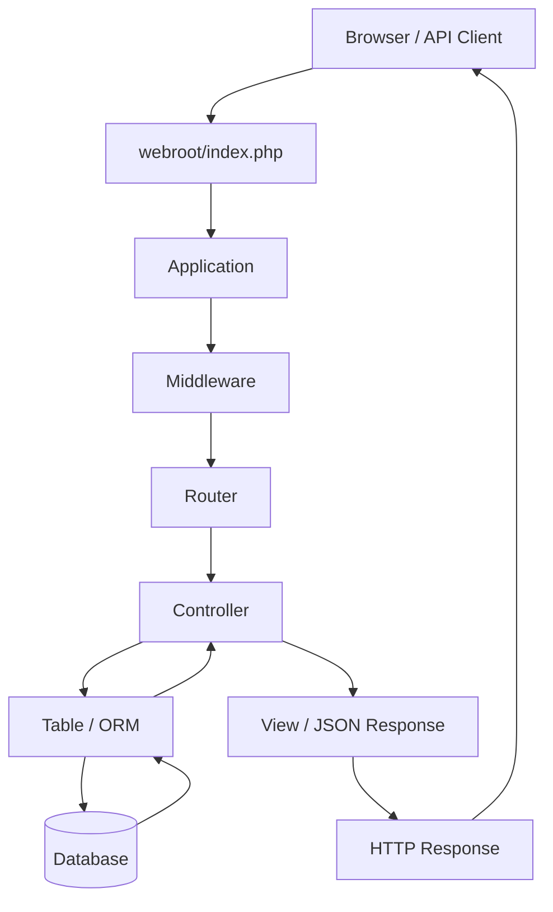

# What Is CakePHP?

> A practical introduction to CakePHP, its major versions, core strengths, use cases, trade-offs, and reasons to choose it for a PHP application.

> **Version snapshot:** August 27, 2026. CakePHP changes over time, so always verify the current supported versions before starting a new project.

## Table of Contents

- [1. What Is CakePHP?](#1-what-is-cakephp)
- [2. What Problem Does CakePHP Solve?](#2-what-problem-does-cakephp-solve)
- [3. CakePHP Architecture](#3-cakephp-architecture)
- [4. How Many CakePHP Versions Exist?](#4-how-many-cakephp-versions-exist)
- [5. Current Version Status](#5-current-version-status)
- [6. What Is CakePHP Strong At?](#6-what-is-cakephp-strong-at)
- [7. Why Use CakePHP?](#7-why-use-cakephp)
- [8. When CakePHP Is a Good Choice](#8-when-cakephp-is-a-good-choice)
- [9. When CakePHP May Not Be the Best Choice](#9-when-cakephp-may-not-be-the-best-choice)
- [10. CakePHP vs Plain PHP](#10-cakephp-vs-plain-php)
- [11. CakePHP vs Other PHP Frameworks](#11-cakephp-vs-other-php-frameworks)
- [12. Typical CakePHP Use Cases](#12-typical-cakephp-use-cases)
- [13. Main CakePHP Features](#13-main-cakephp-features)
- [14. Development Workflow](#14-development-workflow)
- [15. Should You Learn or Use CakePHP Today?](#15-should-you-learn-or-use-cakephp-today)
- [16. Quick Decision Checklist](#16-quick-decision-checklist)
- [17. Related Documentation](#17-related-documentation)
- [18. References](#18-references)

---

## 1. What Is CakePHP?

**CakePHP is an open-source PHP web application framework** used to build server-side applications such as websites, APIs, admin systems, business applications, and database-driven platforms.

It provides a structured way to organize PHP code instead of building every application feature manually.

CakePHP is based heavily on:

- MVC-style application architecture;
- Convention over Configuration;
- Object-Relational Mapping (ORM);
- routing;
- controllers and middleware;
- validation;
- templates and views;
- database abstraction;
- security utilities;
- testing;
- console commands;
- plugins and reusable packages.

In simple terms:

```text
Plain PHP
    |
    | You design most application conventions yourself
    v

CakePHP
    |
    | Gives you an application structure,
    | routing, ORM, validation, security tools,
    | testing conventions, CLI tools, and libraries
    v

Structured PHP Application
```

CakePHP does **not** replace PHP.

It runs on PHP and provides a framework around PHP development.

---

## 2. What Problem Does CakePHP Solve?

A web application normally needs many recurring capabilities:

```text
Routing
Controllers
Database connections
SQL queries
Validation
Authentication integration
Authorization integration
Sessions
Cookies
Error handling
Logging
Caching
Email
Security protections
Testing
CLI commands
HTML rendering
API responses
Configuration
Dependency management
```

Without a framework, developers must design or integrate many of these concerns themselves.

CakePHP provides conventions and reusable components so developers can focus more on application-specific business logic.

For example, instead of manually creating a database abstraction for a `users` table, CakePHP can represent it with:

```text
users
  |
  v
UsersTable
  |
  v
User Entity
```

A controller can then work with the model layer using CakePHP's ORM.

---

## 3. CakePHP Architecture

CakePHP applications generally follow an MVC-style request flow.



The main responsibilities are:

| Layer | Responsibility |
|---|---|
| Router | Maps URLs to application actions |
| Middleware | Handles cross-cutting HTTP concerns |
| Controller | Coordinates request processing |
| Table / ORM | Queries and persists data |
| Entity | Represents an individual record |
| View / Template | Renders HTML or other output |
| Configuration | Defines application and environment settings |
| Webroot | Public HTTP entry point and static assets |

For a detailed directory-level explanation, see:

[**CakePHP Project Structure Guide**](./cakephp-project-structure.md)

---

## 4. How Many CakePHP Versions Exist?

As of **August 27, 2026**, CakePHP has had **five released major generations**:

```text
CakePHP 1.x
CakePHP 2.x
CakePHP 3.x
CakePHP 4.x
CakePHP 5.x
```

CakePHP **6.0 is in development**, so it should not be counted as a completed stable major generation yet.

Therefore:

> **Released major generations: 5**

> **Next major generation in development: CakePHP 6.x**

### Major-version overview

| Major Version | General Status in 2026 | Notes |
|---|---|---|
| CakePHP 1.x | End of Life | Very old generation |
| CakePHP 2.x | End of Life | Legacy architecture |
| CakePHP 3.x | End of Life | Introduced the modern namespaced architecture |
| CakePHP 4.x | Security-support phase | Modern architecture, older major line |
| CakePHP 5.x | Current major line | Recommended major line for current CakePHP development |
| CakePHP 6.x | In development | Future major release |

CakePHP has followed Semantic Versioning since CakePHP 2.0.

Version numbers follow:

```text
MAJOR.MINOR.PATCH
```

Example:

```text
5.4.1
| | |
| | +-- Patch release
| +---- Minor release
+------ Major release
```

In general:

- **major** releases can contain breaking changes;
- **minor** releases add features while aiming to remain backwards compatible;
- **patch** releases focus on bug fixes, maintenance, and security fixes.

---

## 5. Current Version Status

### Snapshot: August 27, 2026

The latest stable CakePHP release is:

```text
CakePHP 5.4.1
```

CakePHP 5.x is the current stable major generation.

The official supported-version documentation lists the supported branches at this snapshot as:

| Major Line | Supported Branches | PHP Range |
|---|---|---|
| 5.x | 5.2 to 5.4 | PHP 8.1 to PHP 8.5 depending on minor version |
| 4.x | 4.4 to 4.6 | PHP 7.2 to PHP 8.3 depending on minor version |
| 3.x | None | End of Life |
| 2.x | None | End of Life |
| 1.x | None | End of Life |

The CakePHP project is also actively developing CakePHP 6.0.

### Important

Do not select a CakePHP version only from this document when starting a future project.

Always check:

- the official supported versions page;
- the latest GitHub release;
- the PHP version available in your environment.

---

## 6. What Is CakePHP Strong At?

CakePHP is particularly strong in applications where **structured database-backed business development** is important.

### 6.1 Convention over Configuration

One of CakePHP's most recognizable principles is:

> **Convention over Configuration**

If the project follows CakePHP naming conventions, the framework can automatically connect many pieces of the application.

Example:

```text
Database table
users

      |
      v

Table class
UsersTable

      |
      v

Entity
User

      |
      v

Controller
UsersController

      |
      v

Templates
templates/Users/
```

This reduces repetitive configuration.

The benefit becomes more noticeable when an application contains many CRUD-style resources.

---

### 6.2 Database and ORM Development

CakePHP has a built-in ORM designed around relational database applications.

Its primary model objects are:

```text
Table Objects
    +
Entities
```

Table objects manage collections of records and database operations.

Entities represent individual records.

The ORM supports:

- queries;
- inserts;
- updates;
- deletes;
- associations;
- transactions;
- validation;
- application rules;
- database type conversion;
- custom finders;
- relational data loading.

Example:

```php
$users = $this->Users
    ->find()
    ->where(['active' => true])
    ->all();
```

This makes CakePHP a strong choice for applications whose core behavior revolves around structured relational data.

---

### 6.3 CRUD and Business Applications

CakePHP works especially well for applications containing many resources such as:

```text
Users
Customers
Orders
Products
Invoices
Bookings
Payments
Reports
Categories
Employees
Documents
Tickets
```

These systems often need the same recurring patterns:

```text
List
View
Create
Edit
Delete
Validate
Search
Paginate
Authorize
Persist
```

CakePHP's conventions, ORM, Bake tooling, validation, forms, and templates reduce the amount of infrastructure code required for these patterns.

---

### 6.4 Data Validation and Application Rules

CakePHP separates two important concepts:

1. **input validation**;
2. **application/domain rules**.

Example:

```text
Validation:
"Is this a valid email address?"

Application rule:
"Is this email address already used by another account?"
```

This separation is useful for business applications because syntactic validation and state-dependent business rules are not the same problem.

---

### 6.5 Rapid Development with Bake

CakePHP has a code-generation tool called **Bake**.

Bake can generate common application classes and CRUD scaffolding.

For example, it can help create:

```text
Controllers
Table classes
Entities
Templates
Tests
Fixtures
```

This is useful when building conventional database-backed modules quickly.

Generated code should still be reviewed and adapted to the application's actual business rules.

---

### 6.6 Clear Project Structure

CakePHP gives developers predictable locations for common responsibilities.

For example:

```text
config/             Configuration
src/Controller/     Request handling
src/Model/Table/    Database and ORM behavior
src/Model/Entity/   Records
src/Middleware/     HTTP middleware
templates/          Views
webroot/            Public files
tests/              Automated tests
```

This predictability is valuable for:

- team development;
- onboarding developers;
- code review;
- maintenance;
- legacy-system analysis.

---

### 6.7 Built-in Web Application Capabilities

CakePHP includes or officially supports a broad set of common application capabilities.

Examples include:

- routing;
- HTTP requests and responses;
- middleware;
- pagination;
- sessions;
- caching;
- logging;
- email;
- validation;
- events;
- internationalization;
- localization;
- testing;
- REST development;
- plugins;
- dependency injection;
- console commands.

Instead of choosing a separate package for every basic application concern, teams can start with a coherent framework ecosystem.

---

### 6.8 Security Tooling

CakePHP provides tools and documentation for common web security concerns, including:

- CSRF protection;
- form protection;
- HTTPS enforcement;
- Content Security Policy support;
- security headers;
- security utilities.

A framework cannot make an application automatically secure.

Developers must still correctly implement:

- authentication;
- authorization;
- access control;
- secrets management;
- input handling;
- file uploads;
- infrastructure security;
- dependency updates.

However, having framework-level security primitives reduces the need to implement common protections from scratch.

---

### 6.9 Long-Term Maintainability

CakePHP strongly encourages consistent conventions.

For a team maintaining a business application for years, consistency can matter more than allowing every developer to organize code differently.

A predictable convention makes it easier to answer questions such as:

```text
Where is this route defined?
Where is this database table mapped?
Where is the validation rule?
Where is this controller action?
Where is the template?
Where are the tests?
```

---

## 7. Why Use CakePHP?

CakePHP should be considered when you want a **structured, convention-driven PHP framework with a mature ORM and strong support for database-backed applications**.

### Reason 1 — Less Boilerplate

CakePHP conventions can reduce repetitive configuration.

You spend less time connecting conventional parts manually.

---

### Reason 2 — Strong Relational Database Workflow

The Table + Entity model works well for business applications with relational data.

Associations such as:

```text
belongsTo
hasOne
hasMany
belongsToMany
```

provide a structured way to model database relationships.

---

### Reason 3 — Fast CRUD Development

CakePHP can be productive for admin portals, management systems, internal tools, and applications with many forms and database entities.

Bake can accelerate the initial implementation.

---

### Reason 4 — Consistent Architecture

CakePHP makes many architectural decisions for you.

This can be an advantage for teams that prefer:

```text
consistency
over
unlimited architectural freedom
```

---

### Reason 5 — Mature Framework

CakePHP has existed across five released major generations.

That history means developers can find:

- established conventions;
- migration documentation;
- production experience;
- community knowledge;
- stable core concepts.

Maturity does not mean old versions should be used.

New applications should stay on supported branches.

---

### Reason 6 — Good Fit for Existing CakePHP Systems

If an organization already owns a CakePHP application, continuing to use CakePHP for compatible modules can often be more practical than introducing another framework.

Changing frameworks can introduce:

- duplicated infrastructure;
- different coding conventions;
- additional training;
- migration cost;
- deployment complexity;
- inconsistent maintenance practices.

---

### Reason 7 — Good Balance Between Framework and PHP

CakePHP gives developers a complete framework while still exposing standard PHP concepts and Composer packages.

You can use external Composer libraries where the framework does not provide a suitable feature.

---

## 8. When CakePHP Is a Good Choice

CakePHP is a strong candidate when several of these conditions are true:

- the application is PHP-based;
- the project is database-heavy;
- relational data is important;
- the project has many CRUD workflows;
- the team values conventions;
- predictable structure is important;
- rapid business-feature development matters;
- the team already knows CakePHP;
- you are maintaining an existing CakePHP system;
- you need a traditional server-rendered MVC application;
- you need a REST backend backed by relational data;
- you want built-in ORM, validation, routing, testing, and console tooling.

Examples:

```text
ERP modules
CRM systems
Booking systems
Inventory systems
Admin portals
Internal business applications
E-commerce back offices
CMS-style applications
Customer portals
Workflow applications
REST APIs
```

---

## 9. When CakePHP May Not Be the Best Choice

CakePHP is not automatically the best PHP framework for every project.

Consider alternatives when:

### Your team already has deep expertise in another framework

For example, if the team has strong Laravel or Symfony knowledge, switching to CakePHP without a technical reason can reduce productivity.

### The ecosystem of another framework is critical

Some projects depend heavily on framework-specific packages, hosting services, communities, or integrations.

### The application architecture is highly unconventional

CakePHP's conventions are a strength when you follow them.

If the application intentionally uses a very different architecture, the framework may require more adaptation.

### You are building a very small application

For a tiny script or extremely small service, a full framework may be unnecessary.

### You are maintaining a very old CakePHP version

Do not interpret "CakePHP is still maintained" as meaning CakePHP 1.x, 2.x, or 3.x should continue to be used.

Old CakePHP applications should be evaluated for:

- PHP compatibility;
- security support;
- framework support;
- dependency support;
- migration cost.

---

## 10. CakePHP vs Plain PHP

### Plain PHP

```text
Developer decides:
- routing structure
- database layer
- validation architecture
- project organization
- error handling
- middleware patterns
- reusable conventions
```

### CakePHP

```text
Framework provides:
- project conventions
- router
- controller architecture
- ORM
- validation
- middleware
- templates
- caching
- logging
- testing conventions
- CLI tooling
```

Comparison:

| Area | Plain PHP | CakePHP |
|---|---|---|
| Initial freedom | Very high | Structured |
| Built-in conventions | Minimal | Strong |
| ORM | Must add/build | Built in |
| Routing | Must add/build | Built in |
| Validation | Must add/build | Built in |
| Project structure | Developer-defined | Convention-driven |
| CRUD productivity | Depends on implementation | Strong |
| Framework learning curve | None | Required |
| Long-term consistency | Team-dependent | Framework-assisted |

CakePHP is useful when the value of standardization outweighs the cost of learning and following a framework.

---

## 11. CakePHP vs Other PHP Frameworks

CakePHP should not be selected simply because it is "better" than every other PHP framework.

Framework choice depends on the application and team.

A simplified comparison:

| Framework | General Character |
|---|---|
| CakePHP | Convention-driven, ORM-focused, strong CRUD/business application workflow |
| Laravel | Developer-friendly ecosystem, broad package/community adoption, highly popular application framework |
| Symfony | Component-oriented, flexible, common in complex enterprise architectures |
| Slim | Minimal/microframework approach for smaller HTTP applications and APIs |

These descriptions are intentionally broad.

A proper framework decision should compare:

- team experience;
- project lifetime;
- ecosystem requirements;
- application architecture;
- deployment environment;
- performance requirements;
- support lifecycle;
- migration cost;
- available developers.

---

## 12. Typical CakePHP Use Cases

### Business Management System

```text
Customers
  |
Orders
  |
Invoices
  |
Payments
  |
Reports
```

CakePHP's relational ORM and CRUD patterns fit naturally.

### Admin Portal

```text
Users
Roles
Permissions
Products
Categories
Settings
Audit Data
```

The framework provides predictable controller, model, validation, and template layers.

### REST API

```text
Mobile App
    |
    v
CakePHP API
    |
    v
ORM
    |
    v
Database
```

CakePHP can return structured JSON responses instead of server-rendered HTML.

### Existing Enterprise Application

CakePHP is also highly relevant when maintaining an existing CakePHP codebase.

In that situation, understanding the framework can be more important than evaluating whether you would select it for a new greenfield application.

---

## 13. Main CakePHP Features

The CakePHP 5.x documentation covers a broad set of framework capabilities.

### HTTP Layer

- routing;
- request objects;
- response objects;
- middleware;
- sessions;
- controllers;
- components;
- pagination.

### View Layer

- templates;
- layouts;
- elements;
- helpers;
- cells;
- JSON views;
- XML views;
- themes.

### Database and ORM

- query builder;
- Table objects;
- Entities;
- associations;
- result sets;
- saving;
- deleting;
- validation;
- schema handling;
- behaviors.

### Core Libraries

- events;
- caching;
- locking;
- email;
- logging;
- collections;
- filesystem utilities;
- HTTP client;
- date and time;
- internationalization.

### Development Tools

- console commands;
- Bake;
- testing;
- debugging;
- plugins;
- migrations;
- dependency injection;
- REST support.

### Security

- CSRF protection;
- form protection;
- HTTPS enforcement;
- Content Security Policy tooling;
- security headers;
- security utilities.

---

## 14. Development Workflow

A typical CakePHP development workflow might look like this:

```text
1. Define database schema
        |
        v
2. Create/Generate Table and Entity classes
        |
        v
3. Configure associations
        |
        v
4. Add validation and application rules
        |
        v
5. Create controller actions
        |
        v
6. Configure routes
        |
        v
7. Build templates or API responses
        |
        v
8. Add tests
        |
        v
9. Run application verification
```

For database-backed CRUD features, CakePHP Bake can automate part of the initial generation.

---

## 15. Should You Learn or Use CakePHP Today?

### For a new PHP developer

CakePHP is useful for learning:

- MVC concepts;
- request/response lifecycle;
- ORM patterns;
- relational database modeling;
- validation;
- routing;
- middleware;
- framework conventions.

However, you should learn modern CakePHP rather than starting from CakePHP 2.x or 3.x tutorials.

### For a developer maintaining an existing CakePHP project

Yes.

Understanding CakePHP's:

```text
routing
controllers
Table classes
Entities
templates
configuration
plugins
ORM
version differences
```

is essential for safely modifying the application.

### For a new production project

CakePHP remains a valid modern PHP framework, but the decision should be based on the project context.

A strong reason to choose it is:

> The project is a relational-data-heavy PHP application and the team benefits from CakePHP's conventions, ORM, tooling, and predictable structure.

A weak reason is:

> "CakePHP exists, therefore every PHP application should use it."

Framework selection should be deliberate.

---

## 16. Quick Decision Checklist

Consider CakePHP when:

- [ ] The project will run on a PHP version supported by the selected CakePHP release.
- [ ] The application relies heavily on a relational database.
- [ ] The team prefers Convention over Configuration.
- [ ] ORM productivity is important.
- [ ] The system contains significant CRUD functionality.
- [ ] Predictable project structure matters.
- [ ] The project benefits from CakePHP's built-in validation and web tooling.
- [ ] The team is willing to follow CakePHP conventions.
- [ ] The required plugins/packages support the selected CakePHP version.
- [ ] The selected CakePHP branch is still supported.

Before choosing CakePHP, also check:

- [ ] Would Laravel provide a more useful ecosystem for this team?
- [ ] Would Symfony better fit the required architecture?
- [ ] Is a smaller framework sufficient?
- [ ] Is this an existing CakePHP system where migration cost is a major factor?
- [ ] Is the application using an old CakePHP version that should be upgraded first?

---

## 17. Related Documentation

Continue with:

[**CakePHP Project Structure Guide**](./cakephp-project-structure.md)

It explains:

- the full CakePHP project tree;
- `config/`;
- `src/`;
- controllers;
- Table classes;
- Entities;
- middleware;
- templates;
- `webroot/`;
- tests;
- plugins;
- database configuration;
- request lifecycle;
- differences between CakePHP 2, 3, 4, and 5.

---

## 18. References

Official CakePHP sources used to verify this document:

- [CakePHP 5.x Documentation](https://book.cakephp.org/5.x/)
- [CakePHP Supported Versions](https://book.cakephp.org/5.x/intro/supported-versions.html)
- [CakePHP Release Policy](https://book.cakephp.org/5.x/release-policy.html)
- [CakePHP Development Process](https://book.cakephp.org/5.x/appendices/cakephp-development-process.html)
- [CakePHP Database Access & ORM](https://book.cakephp.org/5.x/orm.html)
- [CakePHP Validation](https://book.cakephp.org/5.x/orm/validation.html)
- [CakePHP Security](https://book.cakephp.org/5.x/security.html)
- [CakePHP 5.0 Release Announcement](https://bakery.cakephp.org/2023/09/09/cakephp_500.html)
- [CakePHP GitHub Releases](https://github.com/cakephp/cakephp/releases)
- [CakePHP Version Map](https://github.com/cakephp/cakephp/wiki)

---

## Summary

CakePHP is a mature PHP web framework focused on providing a predictable, convention-driven way to build database-backed applications.

As of August 27, 2026:

```text
Released major generations: 1.x -> 5.x
Current major generation:    5.x
Latest stable release:       5.4.1
Next major generation:       6.x (in development)
```

Its strongest areas are:

```text
Convention over Configuration
Relational Database ORM
CRUD Development
Validation and Business Rules
Predictable Project Structure
Rapid Development Tooling
Web Application Infrastructure
Maintainability
```

CakePHP is especially suitable when the application is database-heavy, the team values conventions, and long-term structural consistency matters.
