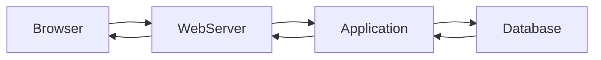

[← Back to CMS Learning Roadmap](roadmap.md)

# Stage 01 — Web and CMS Foundations

This stage builds the minimum technical foundation required to understand a CMS as a software system rather than only as an administration interface.

## Table of Contents

1. [Objectives](#objectives)
2. [Web Foundations](#web-foundations)
3. [Backend Foundations](#backend-foundations)
4. [Database Foundations](#database-foundations)
5. [CMS Fundamentals](#cms-fundamentals)
6. [Core CMS Capabilities](#core-cms-capabilities)
7. [Practice Project](#practice-project)
8. [Completion Checklist](#completion-checklist)

## Objectives

By the end of this stage, you should be able to:

- explain where a CMS fits in a web architecture;
- describe how browsers, web servers, applications, and databases communicate;
- distinguish a CMS from a framework, website builder, and static site generator;
- build a small content-management application with authentication and permissions.

## Web Foundations

Study the following concepts:

- HTTP and HTTPS;
- request and response structure;
- HTTP methods and status codes;
- URL, domain, DNS, and routing;
- browser, web server, and application server roles;
- cookies, sessions, and tokens;
- HTML, CSS, and JavaScript fundamentals;
- JSON and REST APIs;
- file uploads and static assets.

### Basic Request Flow



## Backend Foundations

A language commonly used by production CMS platforms is recommended. PHP is a practical choice for traditional CMS learning, but the concepts are transferable.

Learn:

- variables, arrays, functions, and control flow;
- object-oriented programming;
- classes, interfaces, inheritance, and composition;
- namespaces and dependency management;
- exception and error handling;
- file-system access;
- database access;
- input validation and output escaping;
- authentication and authorization;
- environment-based configuration.

## Database Foundations

Understand:

- tables, rows, columns, and data types;
- primary and foreign keys;
- one-to-one, one-to-many, and many-to-many relationships;
- indexes and query plans;
- transactions;
- normalization and denormalization;
- migrations and seed data;
- soft deletion and audit fields;
- basic `SELECT`, `INSERT`, `UPDATE`, and `DELETE` operations.

## CMS Fundamentals

Study the differences between:

| System type | Main characteristic |
|---|---|
| Traditional CMS | Content management and page rendering are handled by the same platform |
| Headless CMS | Content is exposed primarily through APIs |
| Decoupled CMS | CMS backend and frontend are separated but remain integrated |
| Digital Experience Platform | CMS plus personalization, analytics, campaigns, and integrations |
| Static Site Generator | Pages are generated ahead of request time |
| E-commerce CMS | Content management is combined with catalog, checkout, and commerce features |

## Core CMS Capabilities

```text
CMS
├── Content management
├── Content types and fields
├── Categories, tags, and relationships
├── User management
├── Roles and permissions
├── Media management
├── Menus and navigation
├── Themes and templates
├── Extensions and plugins
├── Workflow and revisions
├── Search
├── APIs and integrations
├── Cache
└── Administration interface
```

For each capability, answer:

- What problem does it solve?
- What data does it store?
- Who may access it?
- Which components depend on it?
- How can it fail?

## Practice Project

Build a small content-management application containing:

- user login and logout;
- administrator and editor roles;
- article create, read, update, and delete operations;
- categories;
- draft and published states;
- publication date;
- basic permission checks;
- frontend article listing and detail pages.

The purpose is not to create a complete CMS. The purpose is to experience the problems that a CMS must solve.

## Completion Checklist

- [ ] I can explain the complete browser-to-database request flow.
- [ ] I understand authentication and authorization as separate concerns.
- [ ] I can model articles, categories, users, and roles in a relational database.
- [ ] I can explain how a CMS differs from a web framework.
- [ ] I can explain how a theme differs from a plugin or extension.
- [ ] I have completed the mini content-management application.

[← Back to CMS Learning Roadmap](roadmap.md)
