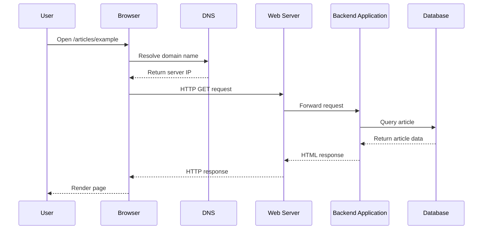
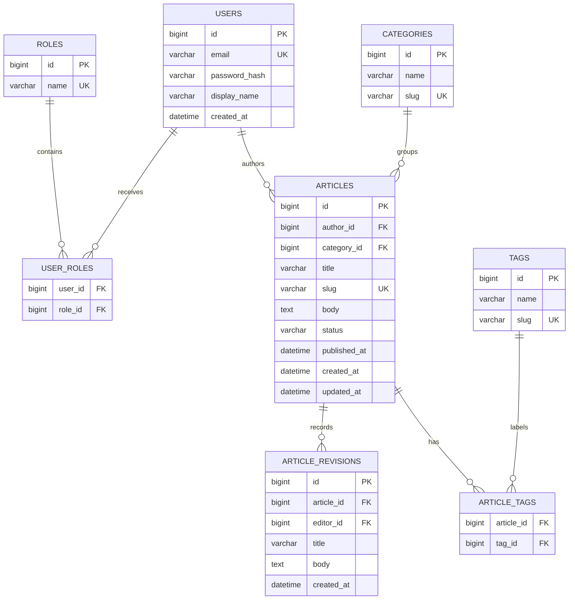
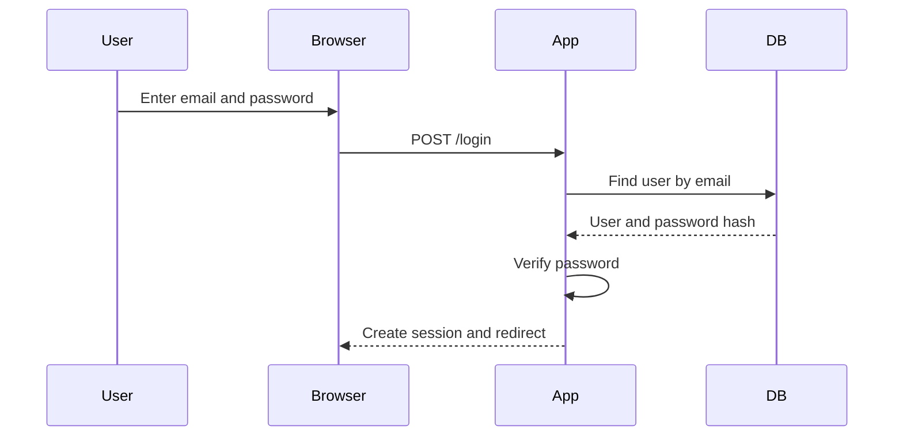

[← Back to CMS Learning Roadmap](roadmap.md)

# Stage 01 — Web and CMS Foundations

This stage builds the technical foundation required to understand a Content Management System (CMS) as a complete software system rather than only as an administration interface.

The goal is not to master every web technology immediately. The goal is to understand the components that participate in a CMS request, how data moves through the system, and why common CMS features exist.

---

## Table of Contents

1. [Stage Target](#stage-target)
2. [Learning Outcomes](#learning-outcomes)
3. [Recommended Study Order](#recommended-study-order)
4. [Part 1 — How the Web Works](#part-1--how-the-web-works)
5. [Part 2 — Frontend Foundations](#part-2--frontend-foundations)
6. [Part 3 — Backend and PHP Foundations](#part-3--backend-and-php-foundations)
7. [Part 4 — Database Foundations](#part-4--database-foundations)
8. [Part 5 — Authentication and Authorization](#part-5--authentication-and-authorization)
9. [Part 6 — CMS Fundamentals](#part-6--cms-fundamentals)
10. [Part 7 — Core CMS Capabilities](#part-7--core-cms-capabilities)
11. [Practice Project — Mini Content Management Application](#practice-project--mini-content-management-application)
12. [Stage Exercises](#stage-exercises)
13. [Suggested Study Schedule](#suggested-study-schedule)
14. [Learning Resources](#learning-resources)
15. [Completion Checklist](#completion-checklist)

---

## Stage Target

By completing Stage 01, you should understand the complete path from a browser request to stored CMS content and back to a rendered response.

You should be able to explain:

```text
User action
→ Browser request
→ DNS and web server
→ Application entry point
→ Routing and backend logic
→ Permission validation
→ Database query
→ HTML or JSON response
→ Browser rendering
```

You should also be able to build a small content-management application with users, roles, articles, categories, draft and published states, and basic server-side permission checks.

---

## Learning Outcomes

After completing this stage, you should be able to:

- explain the roles of a browser, DNS server, web server, backend application, database, and CMS;
- describe the structure of an HTTP request and response;
- use common HTTP methods and understand major status-code groups;
- build simple HTML forms and submit data to a backend;
- write basic PHP using functions, arrays, classes, namespaces, exceptions, and database access;
- design a small relational database with primary keys, foreign keys, relationships, and indexes;
- distinguish authentication from authorization;
- explain the differences among a CMS, framework, website builder, static site generator, and headless CMS;
- identify the major capabilities that most CMS platforms provide;
- implement a small content-management application without depending on an existing CMS.

---

## Recommended Study Order

Follow this sequence:

```text
1. HTTP and browser-server communication
2. HTML, forms, CSS, and basic JavaScript
3. PHP and backend request processing
4. SQL and relational database design
5. Authentication and authorization
6. CMS concepts and common CMS capabilities
7. Mini content-management project
```

Do not begin by reading the source code of a large CMS. First learn the problems that a CMS must solve. Source code becomes much easier to understand after you have implemented a small version of those problems yourself.

---

# Part 1 — How the Web Works

## 1.1 The Main Components

A basic web application contains these components:

| Component | Responsibility |
|---|---|
| Browser | Sends requests, receives responses, renders HTML and executes JavaScript |
| DNS | Converts a domain name into an IP address |
| Web server | Accepts HTTP connections and serves static files or forwards requests to the application |
| Backend application | Applies business rules, permissions, validation, and data processing |
| Database | Stores structured and persistent data |
| File or object storage | Stores uploaded images, documents, videos, and generated files |
| Cache | Stores reusable results to reduce repeated work |

### Basic Request Flow



## 1.2 HTTP and HTTPS

HTTP is the protocol used by clients and servers to exchange requests and responses.

HTTPS is HTTP protected by TLS encryption. HTTPS helps protect data from being read or modified while it travels between the browser and server.

An HTTP message commonly contains:

```text
Request or status line
Headers
Blank line
Optional body
```

### Example Request

```http
GET /articles/42 HTTP/1.1
Host: example.com
Accept: text/html
Cookie: session_id=abc123
```

### Example Response

```http
HTTP/1.1 200 OK
Content-Type: text/html; charset=UTF-8
Cache-Control: no-cache

<h1>Example Article</h1>
```

## 1.3 HTTP Methods

| Method | Typical use | CMS example |
|---|---|---|
| `GET` | Read a resource | Display an article |
| `POST` | Create or submit data | Create a new article |
| `PUT` | Replace a resource | Replace the complete article representation |
| `PATCH` | Partially update a resource | Change only the article title or status |
| `DELETE` | Remove a resource | Delete an article |
| `HEAD` | Read headers without the response body | Check whether a media file exists |
| `OPTIONS` | Discover supported request behavior | Inspect API or CORS options |

A method name does not enforce security by itself. The server must still validate identity, permission, input, and resource ownership.

## 1.4 HTTP Status Codes

Status codes are grouped by purpose:

| Range | Meaning | Examples |
|---|---|---|
| `1xx` | Informational | Request processing information |
| `2xx` | Successful | `200 OK`, `201 Created`, `204 No Content` |
| `3xx` | Redirection | `301 Moved Permanently`, `302 Found`, `304 Not Modified` |
| `4xx` | Client-side problem | `400 Bad Request`, `401 Unauthorized`, `403 Forbidden`, `404 Not Found` |
| `5xx` | Server-side problem | `500 Internal Server Error`, `503 Service Unavailable` |

Important distinction:

- `401 Unauthorized` normally means the client has not successfully authenticated.
- `403 Forbidden` means the identity is known, but it does not have permission to perform the action.

## 1.5 URLs, Domains, DNS, and Routing

Consider this URL:

```text
https://example.com:443/articles/php-basics?page=2#examples
```

| Part | Value |
|---|---|
| Scheme | `https` |
| Host | `example.com` |
| Port | `443` |
| Path | `/articles/php-basics` |
| Query string | `page=2` |
| Fragment | `examples` |

DNS resolves the host to an IP address. Routing inside the web application decides which backend code handles the path.

Example route:

```text
GET /articles/{slug}
→ ArticleController::show($slug)
```

## 1.6 Cookies, Sessions, and Tokens

HTTP is stateless: each request is independent unless the application adds a way to connect requests.

### Cookie

A small value stored by the browser and sent with matching requests.

Typical uses:

- session identifier;
- language preference;
- consent preference;
- non-sensitive display settings.

### Server-Side Session

The browser stores a session ID. The server stores the associated session data.

```text
Browser cookie: session_id=abc123
Server session: abc123 → user_id=25, role=editor
```

### Token

A token can carry or reference authentication information and is often sent in an HTTP header.

```http
Authorization: Bearer <token>
```

Do not store passwords or sensitive secrets directly in cookies or expose them in URLs.

## 1.7 Practical Exercises

1. Open the browser developer tools and inspect the Network tab.
2. Load a public website and identify:
   - request URL;
   - method;
   - request headers;
   - response status;
   - response headers;
   - content type;
   - cookies.
3. Use `curl` to request a page:

```bash
curl -i https://example.com
```

4. Send a request that follows redirects:

```bash
curl -i -L http://example.com
```

5. Draw the complete request flow for opening an article page.

### Part 1 Checkpoint

You are ready to continue when you can explain why an application might return `200`, `302`, `401`, `403`, `404`, or `500`.

---

# Part 2 — Frontend Foundations

A CMS commonly produces HTML pages for visitors and administration interfaces for editors. You do not need to become a frontend specialist in this stage, but you must understand the browser-facing layer.

## 2.1 HTML

HTML defines document structure and meaning.

Study:

- headings and paragraphs;
- links and navigation;
- lists;
- images;
- tables;
- forms;
- semantic elements such as `header`, `nav`, `main`, `article`, `section`, and `footer`;
- accessibility basics;
- metadata in the document head.

### Article Page Example

```html
<!doctype html>
<html lang="en">
<head>
    <meta charset="utf-8">
    <meta name="viewport" content="width=device-width, initial-scale=1">
    <title>CMS Foundations</title>
</head>
<body>
    <header>
        <nav aria-label="Primary navigation">
            <a href="/">Home</a>
            <a href="/articles">Articles</a>
        </nav>
    </header>

    <main>
        <article>
            <h1>CMS Foundations</h1>
            <p>Learn how content moves from a database to a web page.</p>
        </article>
    </main>
</body>
</html>
```

## 2.2 HTML Forms

Forms are essential in CMS administration pages.

```html
<form method="post" action="/admin/articles">
    <label for="title">Title</label>
    <input id="title" name="title" type="text" required>

    <label for="body">Content</label>
    <textarea id="body" name="body" required></textarea>

    <label for="status">Status</label>
    <select id="status" name="status">
        <option value="draft">Draft</option>
        <option value="published">Published</option>
    </select>

    <button type="submit">Save article</button>
</form>
```

Understand:

- `GET` forms versus `POST` forms;
- field names and submitted values;
- client-side validation versus server-side validation;
- file-upload encoding;
- CSRF protection;
- escaping values when redisplaying submitted data.

Client-side validation improves usability, but it does not replace server-side validation.

## 2.3 CSS

Learn enough CSS to create readable administration and content pages:

- selectors;
- cascade and specificity;
- box model;
- spacing;
- typography;
- flexbox;
- grid;
- responsive layouts;
- reusable classes.

Keep content structure in HTML and visual presentation in CSS.

## 2.4 JavaScript Fundamentals

Learn:

- variables and functions;
- arrays and objects;
- DOM selection and events;
- form interaction;
- `fetch()` for API requests;
- JSON parsing;
- basic error handling.

Example:

```javascript
async function loadArticles() {
    const response = await fetch('/api/articles');

    if (!response.ok) {
        throw new Error(`Request failed: ${response.status}`);
    }

    return response.json();
}
```

## 2.5 Practical Exercises

1. Create a semantic article-detail page.
2. Create an article form containing title, slug, body, category, and status.
3. Style the page for desktop and mobile widths.
4. Add JavaScript that warns when an editor tries to leave a form with unsaved changes.
5. Submit a form and inspect the request payload in the Network tab.

### Part 2 Checkpoint

You should be able to explain what the browser validates and what the server must validate again.

---

# Part 3 — Backend and PHP Foundations

PHP is a practical language for learning traditional CMS architecture because many widely used CMS platforms are written in PHP. The architectural concepts are transferable to Java, C#, Python, JavaScript, and other backend ecosystems.

## 3.1 Backend Responsibilities

A backend application commonly handles:

- routing;
- authentication;
- authorization;
- request parsing;
- validation;
- business rules;
- database access;
- file handling;
- rendering HTML;
- returning JSON APIs;
- logging and error handling.

A useful mental model is:

```text
Request
→ Validate identity and permission
→ Validate input
→ Execute use case
→ Read or change data
→ Build response
```

## 3.2 PHP Language Basics

Learn:

- PHP syntax and types;
- variables and constants;
- strings, numbers, booleans, and null;
- indexed and associative arrays;
- conditions;
- loops;
- functions;
- strict comparisons;
- null handling.

```php
<?php

declare(strict_types=1);

function normalizeStatus(string $status): string
{
    $allowed = ['draft', 'published', 'archived'];

    if (!in_array($status, $allowed, true)) {
        throw new InvalidArgumentException('Unsupported article status.');
    }

    return $status;
}
```

## 3.3 Object-Oriented Programming

Understand:

- class and object;
- constructor;
- encapsulation;
- interface;
- inheritance;
- composition;
- dependency injection;
- static state and its risks.

Prefer composition when one class needs another service.

```php
<?php

declare(strict_types=1);

interface ArticleRepository
{
    public function findPublishedBySlug(string $slug): ?Article;
}

final class ShowArticle
{
    public function __construct(
        private ArticleRepository $articles,
    ) {
    }

    public function execute(string $slug): Article
    {
        $article = $this->articles->findPublishedBySlug($slug);

        if ($article === null) {
            throw new RuntimeException('Article not found.');
        }

        return $article;
    }
}
```

## 3.4 Namespaces and Dependency Management

Namespaces prevent naming conflicts and make code organization clearer.

```php
<?php

namespace App\Content\Application;

final class PublishArticle
{
}
```

Learn Composer concepts:

- `composer.json`;
- package installation;
- semantic version constraints;
- autoloading;
- development dependencies;
- lock files.

## 3.5 Exceptions and Error Handling

Use exceptions for exceptional conditions that cannot be handled at the current layer.

Separate:

- validation errors;
- authentication failures;
- authorization failures;
- not-found errors;
- database or infrastructure failures;
- unexpected programming errors.

Do not show internal stack traces or database credentials to public users. Log detailed information on the server and return a safe response to the client.

## 3.6 Request Input and Output Safety

All external input is untrusted, including:

- form fields;
- query parameters;
- route parameters;
- cookies;
- HTTP headers;
- uploaded files;
- external API responses.

Apply these rules:

1. validate input based on the business requirement;
2. normalize accepted input;
3. reject invalid input clearly;
4. use prepared SQL statements;
5. escape output for its destination context;
6. check permission on the server;
7. do not trust hidden form fields.

Example output escaping:

```php
<h1><?= htmlspecialchars($article->title, ENT_QUOTES, 'UTF-8') ?></h1>
```

## 3.7 Files and Uploads

A CMS commonly accepts media uploads. Learn to validate:

- file size;
- detected MIME type;
- allowed extensions;
- generated storage name;
- storage location;
- user permission;
- duplicate files;
- image dimensions;
- error conditions.

Do not trust the original filename or MIME value supplied by the browser.

## 3.8 Environment Configuration

Keep environment-specific values outside application logic:

```text
APP_ENV=development
APP_DEBUG=true
DB_HOST=database
DB_NAME=mini_cms
DB_USER=app_user
DB_PASSWORD=change-me
```

Never commit real production secrets to the repository.

## 3.9 Practical Exercises

1. Write PHP functions for validating an article title, slug, status, and publication date.
2. Create an `Article` class.
3. Define an `ArticleRepository` interface.
4. Create a `PublishArticle` service that checks current state and publication date.
5. Add exception handling that converts known failures into appropriate HTTP responses.
6. Build one HTML endpoint and one JSON endpoint for article details.

### Part 3 Checkpoint

You should be able to separate request coordination, business logic, data access, and presentation instead of writing the entire application inside one PHP file.

---

# Part 4 — Database Foundations

CMS platforms depend heavily on database design. Content, users, permissions, menus, configuration, revisions, and workflows are usually represented as related data.

## 4.1 Relational Database Concepts

Understand:

- database and schema;
- table, row, and column;
- data type;
- primary key;
- foreign key;
- unique constraint;
- default value;
- nullable versus required field;
- index;
- transaction.

## 4.2 Relationships

### One-to-One

One record corresponds to one other record.

```text
User 1 — 1 UserProfile
```

### One-to-Many

One category can contain many articles.

```text
Category 1 — * Article
```

### Many-to-Many

An article may have many tags, and a tag may belong to many articles.

```text
Article * — * Tag
```

This normally requires a junction table such as `article_tags`.

## 4.3 Suggested Mini CMS Schema



## 4.4 SQL Operations

### Create

```sql
INSERT INTO categories (name, slug)
VALUES ('Backend', 'backend');
```

### Read

```sql
SELECT id, title, slug, published_at
FROM articles
WHERE status = 'published'
  AND published_at <= CURRENT_TIMESTAMP
ORDER BY published_at DESC;
```

### Update

```sql
UPDATE articles
SET title = :title,
    body = :body,
    updated_at = CURRENT_TIMESTAMP
WHERE id = :id;
```

### Delete

```sql
DELETE FROM article_tags
WHERE article_id = :article_id;
```

Use parameterized queries instead of placing raw user input directly into SQL.

## 4.5 Indexes

Indexes can make reads faster but add storage and write cost.

Useful candidates for the mini CMS:

- unique index on `users.email`;
- unique index on `articles.slug`;
- index on `articles.status` and `articles.published_at`;
- index on foreign-key columns;
- unique composite index on `article_tags(article_id, tag_id)`.

Do not add indexes without understanding the queries they support.

## 4.6 Transactions

A transaction groups related changes so they succeed or fail together.

Publishing an article may require:

```text
1. Insert a revision
2. Update the article state
3. Record an audit entry
4. Commit all changes
```

If one required database step fails, roll back the transaction.

## 4.7 Normalization and Denormalization

Normalization reduces duplicated data and update inconsistencies.

Denormalization intentionally duplicates or precomputes data to improve a measured use case.

For Stage 01, prefer a normalized relational design. Do not optimize for hypothetical scale before you can explain the current model and queries.

## 4.8 Migrations and Seed Data

A migration records a database schema change in source control.

Seed data provides predictable development records, such as:

- administrator role;
- editor role;
- test users;
- example category;
- example article.

The project should be reproducible without manually creating tables through a database user interface.

## 4.9 Practical Exercises

1. Draw the ER diagram before writing SQL.
2. Create migration files for the proposed schema.
3. Insert sample users, roles, categories, articles, and tags.
4. Write queries for:
   - all published articles;
   - articles in one category;
   - all tags for an article;
   - articles written by one author;
   - latest revision of an article.
5. Add an index and compare the query plan before and after.
6. Implement one transaction that updates an article and creates a revision.

### Part 4 Checkpoint

You should be able to explain why each table, key, relationship, constraint, and index exists.

---

# Part 5 — Authentication and Authorization

Authentication and authorization are separate responsibilities.

| Concept | Question |
|---|---|
| Authentication | Who are you? |
| Authorization | Are you allowed to perform this action on this resource? |

## 5.1 Authentication

A basic login flow:



Important rules:

- store password hashes, not plain-text passwords;
- regenerate session identifiers after login;
- use secure, HTTP-only cookies;
- limit repeated login attempts;
- use generic login error messages;
- invalidate sessions appropriately after logout or sensitive account changes.

## 5.2 Authorization

A simple role model:

| Action | Visitor | Editor | Administrator |
|---|---:|---:|---:|
| View published article | Yes | Yes | Yes |
| View own drafts | No | Yes | Yes |
| Create article | No | Yes | Yes |
| Edit own article | No | Yes | Yes |
| Edit any article | No | No | Yes |
| Publish article | No | Optional | Yes |
| Manage users | No | No | Yes |

Permission must be checked on the server for every protected action.

Hiding the “Delete” button is a user-interface decision. Rejecting an unauthorized `DELETE` or `POST` request is a security decision.

## 5.3 Ownership Checks

Role checks alone may not be enough.

```php
<?php

function canEditArticle(User $user, Article $article): bool
{
    if ($user->hasRole('administrator')) {
        return true;
    }

    return $user->hasRole('editor')
        && $article->authorId === $user->id;
}
```

## 5.4 Practical Exercises

1. Build a login and logout flow.
2. Create administrator and editor accounts.
3. Create a permission matrix before writing authorization code.
4. Test protected endpoints by sending requests directly, not only by clicking visible buttons.
5. Confirm that one editor cannot update another editor's article.
6. Confirm that unauthenticated users receive an appropriate response.

### Part 5 Checkpoint

You should be able to explain why a user may be authenticated but still receive a `403 Forbidden` response.

---

# Part 6 — CMS Fundamentals

## 6.1 What Is a CMS?

A CMS is a software platform that allows authorized users to create, structure, manage, review, publish, and deliver content without rebuilding the complete application for every content change.

A CMS commonly separates:

```text
Content
Presentation
Users and permissions
Workflow
Delivery
Extensions and integrations
```

## 6.2 What Problem Does a CMS Solve?

Without a CMS, every content update may require a developer to edit source files or database records directly.

A CMS provides controlled tools for:

- editors to manage content;
- administrators to manage users and configuration;
- developers to extend features;
- visitors or applications to consume published content;
- organizations to control approval, history, and access.

## 6.3 CMS Versus Related Systems

| System | Main responsibility | Typical user |
|---|---|---|
| CMS | Manage and publish structured content | Editors, administrators, developers |
| Web framework | Provide building blocks for custom applications | Developers |
| Website builder | Visually assemble websites with limited coding | Non-technical site owners |
| Static site generator | Generate static files from templates and content | Developers and technical writers |
| Headless CMS | Manage content and expose it through APIs | Editors and frontend developers |
| E-commerce platform | Manage products, carts, orders, payments, and commerce workflows | Store teams and customers |
| Digital Experience Platform | Combine content, personalization, analytics, campaigns, and integrations | Enterprise marketing and technology teams |

A CMS may internally use a web framework, but the two are not interchangeable. A framework gives developers primitives. A CMS gives users ready-made content-management capabilities.

## 6.4 Traditional, Headless, and Decoupled CMS

### Traditional CMS

```text
CMS administration
+ Content storage
+ Backend logic
+ Page rendering
```

The CMS produces the visitor-facing page directly.

### Headless CMS

```text
CMS administration
+ Content storage
+ API
```

A separate frontend consumes content through an API.

### Decoupled CMS

The CMS and frontend are separated but intentionally integrated for preview, publishing, routing, and cache invalidation.

At this stage, understand the differences only. Detailed architectural trade-offs belong to later stages.

## 6.5 Content Modeling

A content model defines the structure of information.

Example article type:

```text
Article
├── Title
├── Slug
├── Summary
├── Body
├── Featured image
├── Category
├── Tags
├── Author
├── Status
├── Publication date
└── SEO metadata
```

A strong content model represents meaning, not only page appearance.

For example, `author`, `publication date`, and `category` are reusable content concepts. “Large blue text on the left” is a presentation decision.

## 6.6 Content Lifecycle

A basic lifecycle:

```text
Draft
→ Review
→ Approved
→ Published
→ Archived
```

Even a simple CMS must define:

- valid states;
- who may perform each transition;
- what published means;
- whether future publication is allowed;
- whether old versions can be restored.

## 6.7 Practical Exercises

1. Compare one CMS and one web framework. List what each provides by default.
2. Design content models for:
   - article;
   - author profile;
   - product review;
   - event.
3. Draw a content lifecycle for an editorial team.
4. Explain when a headless CMS adds useful flexibility and when it adds unnecessary complexity.
5. Identify which mini-project features belong to content, presentation, workflow, access control, and infrastructure.

### Part 6 Checkpoint

You should be able to explain why a CMS is more than an article CRUD interface.

---

# Part 7 — Core CMS Capabilities

Most CMS platforms provide variations of the following capabilities.

```text
CMS
├── Content modeling and content management
├── Categories, tags, and relationships
├── User management
├── Roles, permissions, and ownership
├── Media management
├── Menus and navigation
├── Themes, templates, and layouts
├── Extensions, modules, and plugins
├── Workflow, revisions, and scheduling
├── Search
├── APIs, feeds, and integrations
├── Cache
├── Configuration
├── Logging and audit history
└── Administration interface
```

## 7.1 Content Management

Responsibilities:

- create and edit entries;
- validate required fields;
- manage status;
- store authorship and timestamps;
- publish and unpublish content;
- support revisions.

## 7.2 Taxonomy and Relationships

Taxonomy helps organize content through categories, tags, topics, or controlled vocabularies.

Relationships connect content entities, for example:

```text
Article → Author
Article → Category
Article → Related Articles
Event → Venue
Product → Brand
```

## 7.3 User and Permission Management

Responsibilities:

- user identities;
- groups and roles;
- permissions;
- ownership;
- account state;
- password and session management;
- audit history.

## 7.4 Media Management

Responsibilities:

- upload;
- validation;
- metadata;
- folders or collections;
- image variants;
- references from content;
- access control;
- deletion rules.

## 7.5 Menus and Navigation

A CMS may store navigation independently from content.

A menu item may point to:

- a content entry;
- a category listing;
- a custom route;
- an external URL;
- another menu item.

This separation allows editors to reorganize navigation without changing article records.

## 7.6 Themes and Templates

Themes and templates control presentation.

They should not become the primary location for business rules, permission checks, or database updates.

## 7.7 Extensions and Plugins

Extensions add or change behavior without rewriting the CMS core.

Examples:

- contact form;
- analytics integration;
- search provider;
- authentication provider;
- custom content feature;
- image-processing integration.

Detailed extension architecture is covered in later stages.

## 7.8 Workflow, Revisions, and Scheduling

These capabilities provide controlled changes:

- drafts;
- approvals;
- revision history;
- rollback;
- scheduled publication;
- audit records.

## 7.9 Search

Search may begin with SQL filtering and later use a dedicated search engine.

At this stage, understand that search must respect publication status and permission rules.

## 7.10 API and Integration

CMS data may be delivered through:

- rendered HTML;
- JSON REST API;
- feeds;
- webhooks;
- exports;
- integration events.

## 7.11 Cache

Caching avoids repeated work, but cached content must be invalidated when the underlying content or permission context changes.

Detailed caching strategy belongs to later stages.

## 7.12 Capability Analysis Exercise

For every capability, answer:

1. What problem does it solve?
2. What data does it store?
3. Who may access or change it?
4. Which components depend on it?
5. What validation is required?
6. How can it fail?
7. What should be logged?
8. What would happen if the capability did not exist?

---

# Practice Project — Mini Content Management Application

## Project Goal

Build a small CMS-like application from basic web technologies. Do not use an existing CMS for this project.

A lightweight framework is acceptable after you understand the underlying request flow, but the project should not hide all routing, authentication, database, and rendering behavior from you.

## Required Scope

### Public Website

- article list page;
- article detail page;
- category page;
- only published and currently available content is public;
- escaped output;
- basic responsive layout.

### Administration

- login and logout;
- article list;
- create article;
- edit article;
- view article;
- delete or archive article;
- category management;
- draft and published status;
- publication date;
- validation messages.

### Users and Permissions

- administrator role;
- editor role;
- administrator can manage all articles and users;
- editor can create articles and edit only permitted articles;
- all checks are enforced on the server.

### Database

- migrations;
- seed data;
- foreign keys;
- unique constraints;
- indexes for important queries;
- prepared statements;
- article revision history.

### Error Handling

Handle at least:

- invalid form data;
- unauthenticated access;
- forbidden action;
- missing article;
- duplicate slug;
- database failure;
- invalid state transition.

## Suggested Folder Structure

```text
mini-cms/
├── public/
│   └── index.php
├── src/
│   ├── Application/
│   ├── Content/
│   ├── Identity/
│   ├── Infrastructure/
│   └── Presentation/
├── templates/
├── migrations/
├── tests/
├── config/
├── storage/
├── composer.json
└── README.md
```

The exact structure may differ. The important goal is to separate responsibilities clearly.

## Required Documentation

Create a project README containing:

1. project goal;
2. installation instructions;
3. environment variables;
4. database migration instructions;
5. test accounts;
6. feature list;
7. permission matrix;
8. ER diagram;
9. request-flow diagram;
10. known limitations;
11. test instructions.

## Required Test Scenarios

- visitor can view a published article;
- visitor cannot view a draft article;
- unauthenticated user cannot access administration pages;
- editor can create an article;
- editor cannot manage users;
- editor cannot modify a protected article owned by another user;
- administrator can manage all articles;
- invalid data is rejected;
- duplicate slug is rejected;
- article output is escaped;
- article update creates a revision;
- failed multi-step write is rolled back.

## Definition of Done

The project is complete when another developer can clone it, configure the environment, run migrations, load seed data, start the application, and verify all required scenarios using the README.

---

# Stage Exercises

## Concept Exercises

1. Explain the difference between DNS and application routing.
2. Explain the difference between HTTP and HTTPS.
3. Explain why HTTP is described as stateless.
4. Compare cookies, sessions, and bearer tokens.
5. Explain why client-side validation is insufficient.
6. Explain primary keys, foreign keys, and indexes.
7. Explain authentication versus authorization.
8. Explain CMS versus framework.
9. Explain traditional versus headless CMS.
10. Explain why a content model should represent meaning rather than visual layout.

## Design Exercises

1. Draw the request flow for opening a public article.
2. Draw the request flow for saving an article in the administration interface.
3. Create an ER diagram for users, roles, articles, categories, tags, and revisions.
4. Create a permission matrix for visitor, editor, and administrator.
5. Design an article workflow with valid transitions.
6. Identify all trust boundaries in the mini CMS.
7. Define which operations should execute inside a database transaction.

## Debugging Exercises

Create and fix these problems intentionally:

1. route returns `404` even though the article exists;
2. duplicate slug causes a database error;
3. editor can modify another editor's article;
4. draft article appears publicly;
5. HTML entered in the title executes in the browser;
6. article save updates data but fails to create a revision;
7. database credentials are accidentally displayed in an error page.

For each problem, document:

- observed behavior;
- root cause;
- affected layer;
- fix;
- test that prevents recurrence.

---

# Suggested Study Schedule

A practical duration is **6–8 weeks** at approximately **8–12 hours per week**.

| Week | Focus | Expected output |
|---|---|---|
| 1 | HTTP, HTTPS, URLs, DNS, requests, responses | Request-flow notes and `curl` exercises |
| 2 | HTML, forms, CSS, JavaScript basics | Article page and administration form |
| 3 | PHP syntax, OOP, errors, Composer | Small backend endpoints and domain classes |
| 4 | SQL, relational modeling, indexes, transactions | ER diagram, migrations, and SQL exercises |
| 5 | Authentication, sessions, roles, permissions | Login flow and permission matrix |
| 6 | CMS concepts, content models, workflow | CMS capability analysis |
| 7 | Mini CMS implementation | Working public and administration features |
| 8 | Testing, debugging, documentation | Completed project and Stage 01 review |

Move faster if the topics are already familiar, but do not skip the exercises and project evidence.

---

# Learning Resources

The following sources are selected because they are official or widely trusted primary learning references.

## Web and HTTP

- [MDN — Overview of HTTP](https://developer.mozilla.org/en-US/docs/Web/HTTP/Guides/Overview)
- [MDN — HTTP Reference](https://developer.mozilla.org/en-US/docs/Web/HTTP/Reference)
- [MDN — HTTP Methods](https://developer.mozilla.org/en-US/docs/Web/HTTP/Reference/Methods)
- [MDN — HTTP Status Codes](https://developer.mozilla.org/en-US/docs/Web/HTTP/Reference/Status)
- [MDN — Working with URLs](https://developer.mozilla.org/en-US/docs/Learn_web_development/Howto/Web_mechanics/What_is_a_URL)
- [MDN — Using HTTP Cookies](https://developer.mozilla.org/en-US/docs/Web/HTTP/Guides/Cookies)
- [MDN — Client-Server Overview](https://developer.mozilla.org/en-US/docs/Learn_web_development/Extensions/Server-side/First_steps/Client-Server_overview)

## HTML, CSS, and JavaScript

- [MDN — Learn Web Development](https://developer.mozilla.org/en-US/docs/Learn_web_development)
- [MDN — Structuring Content with HTML](https://developer.mozilla.org/en-US/docs/Learn_web_development/Core/Structuring_content)
- [MDN — HTML Forms](https://developer.mozilla.org/en-US/docs/Learn_web_development/Extensions/Forms)
- [MDN — CSS Styling Basics](https://developer.mozilla.org/en-US/docs/Learn_web_development/Core/Styling_basics)
- [MDN — JavaScript Guide](https://developer.mozilla.org/en-US/docs/Web/JavaScript/Guide)
- [MDN — Fetch API](https://developer.mozilla.org/en-US/docs/Web/API/Fetch_API/Using_Fetch)

## PHP and Backend Development

- [PHP Manual](https://www.php.net/manual/en/)
- [PHP Language Reference](https://www.php.net/manual/en/langref.php)
- [PHP Basic Syntax](https://www.php.net/manual/en/language.basic-syntax.php)
- [PHP Classes and Objects](https://www.php.net/manual/en/language.oop5.php)
- [PHP Exceptions](https://www.php.net/manual/en/language.exceptions.php)
- [PHP Sessions](https://www.php.net/manual/en/book.session.php)
- [PHP Password Hashing](https://www.php.net/manual/en/book.password.php)
- [PHP PDO](https://www.php.net/manual/en/book.pdo.php)
- [Composer Documentation](https://getcomposer.org/doc/)

## Database and SQL

- [MySQL — Getting Started](https://dev.mysql.com/doc/mysql-getting-started/en/)
- [MySQL 8.4 Reference Manual](https://dev.mysql.com/doc/refman/8.4/en/)
- [MySQL Tutorial](https://dev.mysql.com/doc/refman/8.4/en/tutorial.html)
- [MySQL — InnoDB Transactions](https://dev.mysql.com/doc/refman/8.4/en/innodb-transaction-model.html)
- [MySQL — Optimization and Indexes](https://dev.mysql.com/doc/refman/8.4/en/optimization-indexes.html)
- [PostgreSQL Tutorial](https://www.postgresql.org/docs/current/tutorial.html)

You may use either MySQL or PostgreSQL for the mini project. The relational modeling principles are more important than the selected database product.

## Security, Authentication, and Authorization

- [OWASP Authentication Cheat Sheet](https://cheatsheetseries.owasp.org/cheatsheets/Authentication_Cheat_Sheet.html)
- [OWASP Authorization Cheat Sheet](https://cheatsheetseries.owasp.org/cheatsheets/Authorization_Cheat_Sheet.html)
- [OWASP Input Validation Cheat Sheet](https://cheatsheetseries.owasp.org/cheatsheets/Input_Validation_Cheat_Sheet.html)
- [OWASP Cross-Site Scripting Prevention Cheat Sheet](https://cheatsheetseries.owasp.org/cheatsheets/Cross_Site_Scripting_Prevention_Cheat_Sheet.html)
- [OWASP SQL Injection Prevention Cheat Sheet](https://cheatsheetseries.owasp.org/cheatsheets/SQL_Injection_Prevention_Cheat_Sheet.html)
- [OWASP File Upload Cheat Sheet](https://cheatsheetseries.owasp.org/cheatsheets/File_Upload_Cheat_Sheet.html)

## CMS Concepts

- [WordPress — Introduction to Content Management](https://wordpress.org/documentation/article/wordpress-features/)
- [Drupal — User Guide](https://www.drupal.org/docs/user_guide/en/index.html)
- [Joomla Documentation](https://docs.joomla.org/)
- [Strapi Documentation](https://docs.strapi.io/)
- [Directus Documentation](https://docs.directus.io/)

Use CMS product documentation to observe how real systems implement content types, users, permissions, media, navigation, workflow, themes, and extensions. Do not treat one product's terminology as the universal architecture.

---

# Completion Checklist

## Web Foundations

- [ ] I can explain the complete browser-to-database request flow.
- [ ] I understand DNS, URLs, routing, HTTP methods, headers, and status codes.
- [ ] I can inspect and explain requests using browser developer tools and `curl`.
- [ ] I understand cookies, sessions, and tokens at a foundational level.

## Frontend Foundations

- [ ] I can create semantic HTML pages and forms.
- [ ] I understand client-side and server-side validation responsibilities.
- [ ] I can create a basic responsive layout.
- [ ] I can use JavaScript to call a JSON API and handle errors.

## Backend Foundations

- [ ] I can write structured PHP with functions, classes, interfaces, namespaces, and exceptions.
- [ ] I can separate routing, application logic, data access, and presentation.
- [ ] I validate input and escape output correctly.
- [ ] I use environment configuration and do not commit secrets.

## Database Foundations

- [ ] I can model articles, categories, tags, users, roles, and revisions.
- [ ] I understand primary keys, foreign keys, constraints, relationships, and indexes.
- [ ] I can write basic create, read, update, and delete queries.
- [ ] I use prepared statements and transactions where required.
- [ ] I can reproduce the schema using migrations and seed data.

## Identity and Access

- [ ] I understand authentication and authorization as separate concerns.
- [ ] I have implemented login, logout, sessions, roles, and ownership checks.
- [ ] I enforce authorization on the server.
- [ ] I have tested unauthorized requests directly.

## CMS Understanding

- [ ] I can explain how a CMS differs from a web framework and website builder.
- [ ] I can compare traditional, headless, and decoupled CMS architectures.
- [ ] I understand content modeling and content lifecycle fundamentals.
- [ ] I can explain the purpose of major CMS capabilities.

## Project Evidence

- [ ] I completed the mini content-management application.
- [ ] I created an ER diagram and request-flow diagram.
- [ ] I documented a permission matrix.
- [ ] I tested required success and failure scenarios.
- [ ] Another developer can run the project by following the README.
- [ ] I documented at least three intentionally created and fixed defects.

When every item is complete, continue to [Stage 02 — Practical CMS Usage](stage-02-practical-cms-usage.md).

[← Back to CMS Learning Roadmap](roadmap.md)
