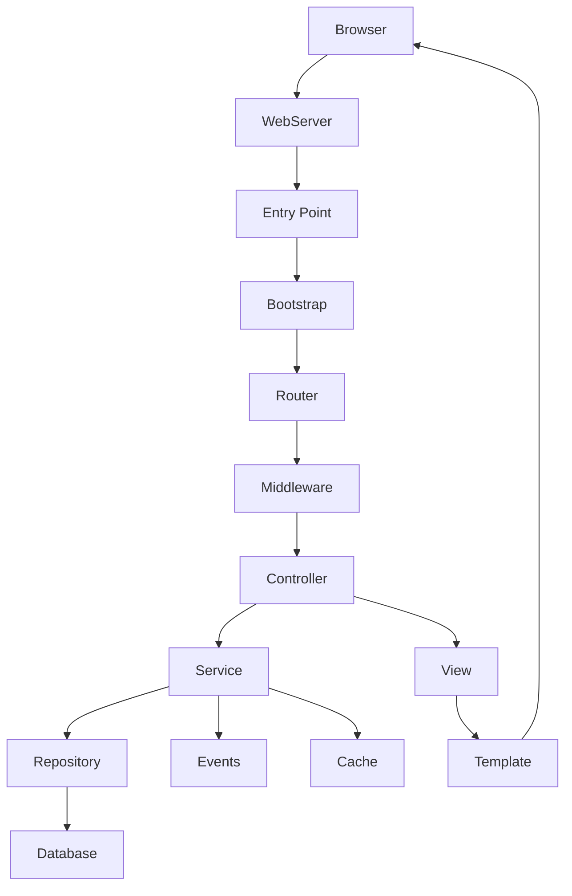

[← Back to CMS Learning Roadmap](roadmap.md)

# Stage 03 — CMS Architecture

This stage changes the perspective from using a CMS to understanding it as an application architecture.

## Table of Contents

1. [Objectives](#objectives)
2. [Request Lifecycle](#request-lifecycle)
3. [Architectural Layers](#architectural-layers)
4. [Extension Architecture](#extension-architecture)
5. [Dependency Injection and Events](#dependency-injection-and-events)
6. [Architecture Investigation](#architecture-investigation)
7. [Completion Checklist](#completion-checklist)

## Objectives

You should be able to trace a request, explain component responsibilities, identify extension points, and locate architectural problems in a CMS codebase.

## Request Lifecycle



Trace both frontend and administrator requests. Identify where authentication, authorization, cache, localization, error handling, and extension hooks execute.

## Architectural Layers

### Entry Point and Bootstrap

Responsibilities commonly include:

- loading dependencies and configuration;
- creating the application and service container;
- registering error handling;
- initializing sessions, database access, extensions, and routing.

### Router and Middleware

Study static and dynamic routes, parameters, slugs, SEO URLs, route priority, middleware ordering, and route-level authorization.

### Controller

A controller should coordinate a request, validate basic input, call application services, and select a response. It should not contain the complete business process.

### Service Layer

Application services represent use cases such as:

```text
CreateArticle
PublishArticle
AssignRole
UploadMedia
GenerateNavigation
```

### Data Access

Compare:

- Active Record;
- Query Builder;
- Repository;
- Data Mapper;
- Object-Relational Mapping.

Evaluate coupling, testability, query control, and migration cost.

### Rendering

Understand:

- view models;
- templates;
- layouts and partials;
- template inheritance;
- output escaping;
- asset management;
- server-side rendering;
- response formats other than HTML.

## Extension Architecture

```text
Extension Platform
├── Theme or template
├── Layout override
├── Module, block, or widget
├── Plugin or event listener
├── Component or feature package
├── API integration
└── Language package
```

Investigate:

- discovery and registration;
- installation and removal lifecycle;
- database migrations;
- dependency declaration;
- configuration storage;
- event subscriptions;
- compatibility rules;
- update mechanisms;
- failure isolation.

## Dependency Injection and Events

Learn:

- service containers;
- service providers;
- interface bindings;
- factories;
- service scopes;
- event publishers and subscribers;
- event payload contracts;
- listener priority;
- synchronous versus asynchronous events.

Avoid uncontrolled global state and hidden dependencies.

## Architecture Investigation

Trace one real request such as:

```text
GET /news/example-article
```

Document:

1. entry file;
2. bootstrap process;
3. matched route;
4. middleware chain;
5. controller and action;
6. application service;
7. database queries;
8. permission checks;
9. cache reads and invalidation rules;
10. events and plugin hooks;
11. selected layout and template;
12. final response.

## Completion Checklist

- [ ] I can draw the full request lifecycle from memory.
- [ ] I can separate controller, service, repository, and presentation responsibilities.
- [ ] I can identify how extensions are discovered and executed.
- [ ] I can explain the service container and event system.
- [ ] I can locate authentication, authorization, cache, and error-handling boundaries.
- [ ] I have completed a documented request trace using a real CMS codebase.

[← Back to CMS Learning Roadmap](roadmap.md)
