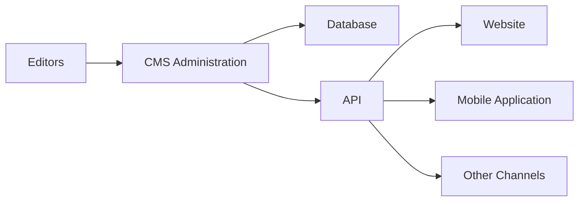

[← Back to CMS Learning Roadmap](roadmap.md)

# Stage 06 — Advanced CMS Architecture

This stage covers architectures used when a single traditional CMS deployment is no longer sufficient.

## Table of Contents

1. [Objectives](#objectives)
2. [Headless and Decoupled CMS](#headless-and-decoupled-cms)
3. [Multi-Site Architecture](#multi-site-architecture)
4. [Multilingual Architecture](#multilingual-architecture)
5. [Workflow and Revisions](#workflow-and-revisions)
6. [Search Architecture](#search-architecture)
7. [Asynchronous Processing](#asynchronous-processing)
8. [Completion Checklist](#completion-checklist)

## Objectives

Design CMS solutions that support multiple channels, sites, languages, editorial workflows, large search indexes, and asynchronous processes.

## Headless and Decoupled CMS



Study:

- content APIs;
- frontend routing;
- preview of unpublished content;
- authentication across applications;
- static generation and revalidation;
- SEO in separated frontends;
- asset URLs;
- API and CDN caching;
- webhooks and cache invalidation;
- frontend and CMS release coordination.

A headless CMS increases frontend freedom but also increases integration, preview, caching, and operational complexity.

## Multi-Site Architecture

Design for:

- shared and site-specific content;
- shared users and permissions;
- domain mapping;
- themes per site;
- configuration inheritance;
- extension sharing;
- content syndication;
- cache namespaces;
- site-level isolation and failure boundaries.

Compare a shared database, schema-per-site, and deployment-per-site approach.

## Multilingual Architecture

Understand:

- translation entities and relationships;
- field-level versus document-level translation;
- language fallback;
- localized URLs and slugs;
- translation workflow and status;
- shared and localized media;
- permission by locale;
- search indexing by language.

## Workflow and Revisions

Example editorial flow:

```text
Draft
→ Review
→ Approved
→ Scheduled
→ Published
→ Archived
```

A robust workflow may require:

- role-based transitions;
- approval rules;
- comments and assignments;
- immutable revision history;
- comparison and rollback;
- notifications;
- scheduled transitions;
- audit trails;
- recovery from partially completed actions.

## Search Architecture

Possible progression:

```text
SQL filtering
→ Database full-text search
→ Elasticsearch or OpenSearch
→ Semantic or hybrid search
```

Study indexing, tokenization, ranking, filters, facets, synonyms, permissions, incremental indexing, full reindexing, and eventual consistency.

Search results must respect the same visibility rules as the source content.

## Asynchronous Processing

Use queues and workers for work that should not block interactive requests, such as:

- media conversion;
- search indexing;
- bulk imports;
- notifications;
- webhook delivery;
- static-page generation;
- analytics processing.

Design retries, dead-letter handling, idempotency, ordering requirements, duplicate-message handling, and observability.

## Completion Checklist

- [ ] I can explain when headless architecture is justified and when it is not.
- [ ] I can design preview and cache invalidation for a separated frontend.
- [ ] I can compare multi-site isolation strategies.
- [ ] I can model multilingual content and fallback behavior.
- [ ] I can design an editorial workflow with revision history.
- [ ] I can design permission-aware search indexing.
- [ ] I can move appropriate background work to reliable queues and workers.

[← Back to CMS Learning Roadmap](roadmap.md)
