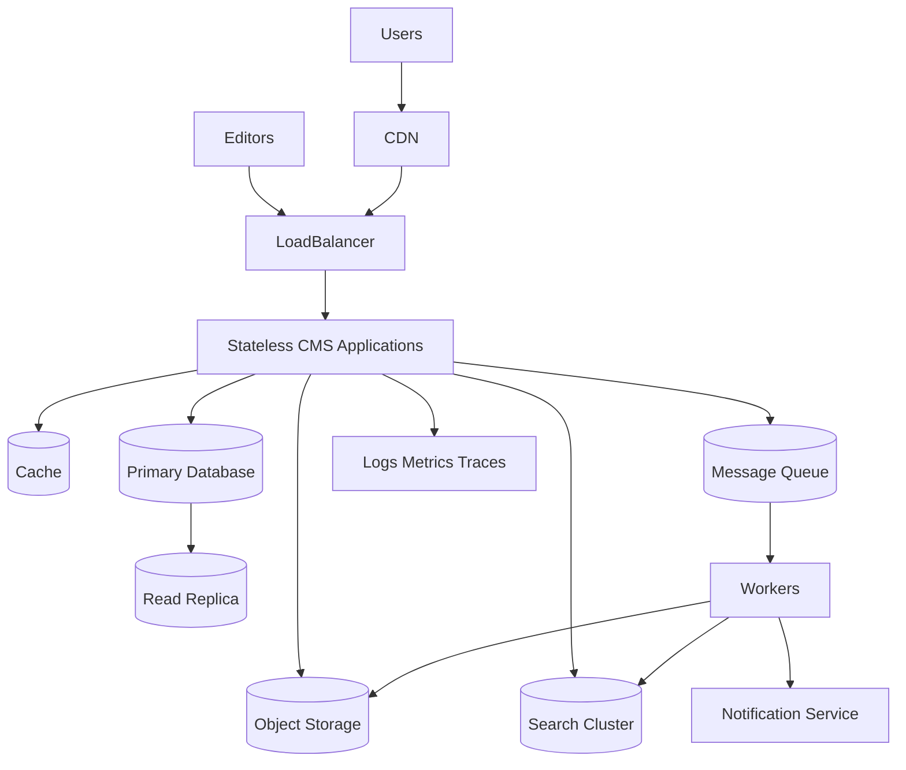

[← Back to CMS Learning Roadmap](roadmap.md)

# Stage 07 — CMS System Design

This stage combines CMS knowledge with system-design reasoning.

## Table of Contents

1. [Objectives](#objectives)
2. [Requirements](#requirements)
3. [Content and Data Design](#content-and-data-design)
4. [High-Level Architecture](#high-level-architecture)
5. [Media, Cache, and Search](#media-cache-and-search)
6. [Consistency and Failure Design](#consistency-and-failure-design)
7. [Scalability and Reliability](#scalability-and-reliability)
8. [Design Deliverables](#design-deliverables)
9. [Completion Checklist](#completion-checklist)

## Objectives

Given business requirements and scale targets, produce a complete, defensible CMS architecture covering data, permissions, APIs, media, search, cache, reliability, security, and operations.

## Requirements

### Functional Requirements

Examples include:

- content types and fields;
- media management;
- revisions and rollback;
- editorial workflow;
- scheduling;
- multilingual content;
- multi-site publishing;
- preview;
- search;
- APIs and webhooks;
- audit logs.

### Non-Functional Requirements

Quantify:

- active readers and editors;
- requests per second;
- number of entries and revisions;
- media volume and growth;
- latency targets;
- availability target;
- recovery time and recovery point objectives;
- data residency and compliance;
- retention requirements;
- expected traffic peaks.

Do not design for “high scale” without measurable assumptions.

## Content and Data Design

A basic article may contain:

```text
Article
├── id
├── content_type_id
├── title
├── slug
├── body
├── status
├── author_id
├── locale
├── published_at
├── created_at
└── updated_at
```

Evaluate:

- fixed tables versus flexible content schemas;
- relational versus document storage;
- revision representation;
- translation representation;
- soft deletion;
- audit logging;
- unique constraints and indexes;
- data partitioning;
- migration strategy.

## High-Level Architecture



Explain why every component exists. Remove components that do not solve a demonstrated requirement.

## Media, Cache, and Search

### Media

Prefer object storage and CDN delivery for large assets.

```text
Client
→ Authorized or signed upload
→ Object storage
→ Processing queue
→ Media worker
→ Optimized variants
→ CDN
```

### Cache

Define cache ownership, key structure, visibility, expiration, invalidation, and fallback behavior. Include tenant, locale, site, content version, and permission dimensions where relevant.

### Search

Define:

- indexed fields;
- permission filtering;
- indexing events;
- update delay;
- reindex strategy;
- search failure fallback;
- consistency expectations.

## Consistency and Failure Design

Publishing may require:

```text
1. Validate permissions and content
2. Commit the content revision
3. Change publication state
4. Emit an event
5. Invalidate caches
6. Update the search index
7. Trigger webhooks
8. Notify subscribers
```

Decide which operations belong in the database transaction and which may complete asynchronously.

Answer failure questions explicitly:

- What happens when Redis is unavailable?
- What happens when search indexing fails?
- What happens when a webhook is delivered twice?
- What happens when media processing stops?
- What happens when publication succeeds but cache invalidation is delayed?
- How are poison messages isolated?
- How are partial failures detected and repaired?

## Scalability and Reliability

Study and apply when justified:

- stateless application nodes;
- horizontal scaling;
- load balancing;
- database read replicas;
- connection pooling;
- queues and background workers;
- CDN and object storage;
- partitioning and archiving;
- multi-zone deployment;
- rate limiting and backpressure;
- graceful degradation;
- disaster recovery.

## Design Deliverables

A complete design should contain:

1. problem statement and scope;
2. assumptions and estimated scale;
3. functional and non-functional requirements;
4. content and permission model;
5. API contracts;
6. high-level architecture diagram;
7. request, publishing, media, and search flows;
8. database and indexing strategy;
9. cache strategy;
10. security boundaries;
11. failure scenarios and recovery paths;
12. observability plan;
13. deployment and migration plan;
14. trade-offs and rejected alternatives.

## Completion Checklist

- [ ] I can convert vague business language into measurable requirements.
- [ ] I can model content, revisions, translations, and permissions.
- [ ] I can justify every infrastructure component.
- [ ] I can separate transactional and asynchronous work.
- [ ] I can describe consistency guarantees and repair mechanisms.
- [ ] I can design for failure, not only for the successful path.
- [ ] I have produced and reviewed a complete enterprise CMS design document.

[← Back to CMS Learning Roadmap](roadmap.md)
