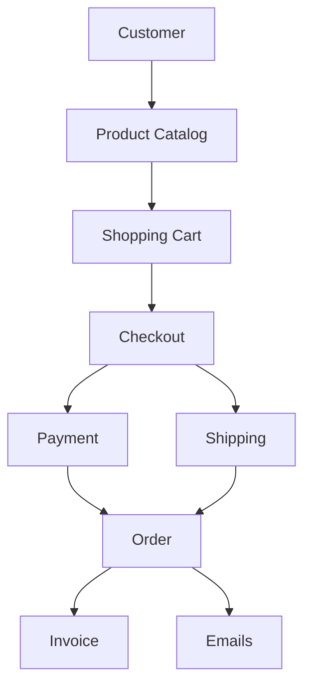
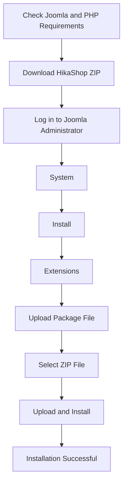
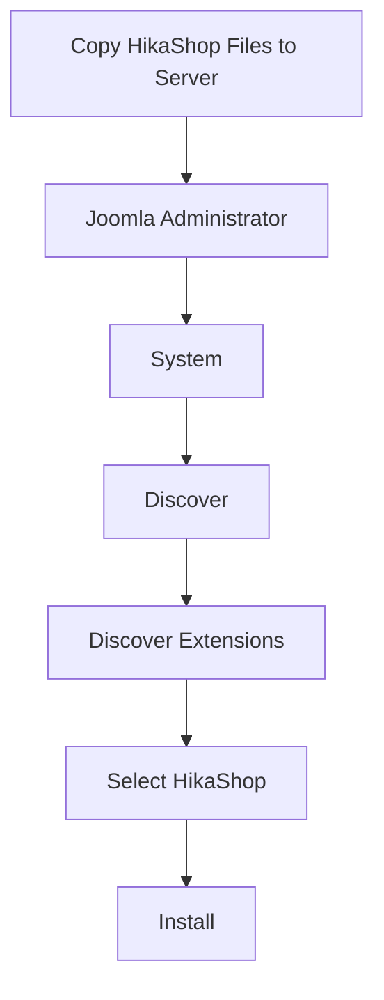
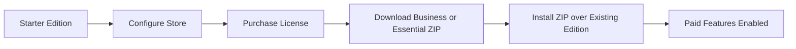
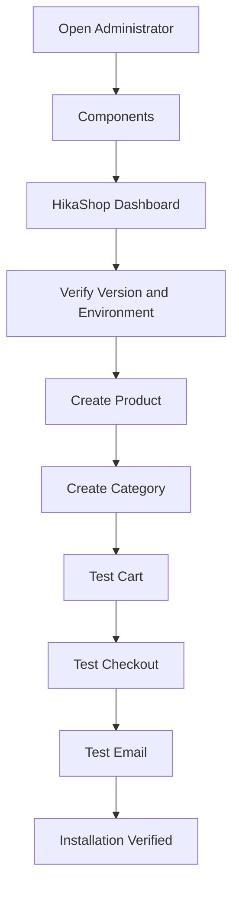
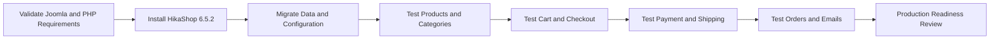

# HikaShop 6.5.2 Installation & Feature Guide (Joomla 6)

> **Version:** 6.5.2  
> **Supported Joomla versions:** Joomla 4 / 5 / 6  
> **Joomla 6 minimum PHP:** PHP 8.3  
> **Joomla 6 recommended PHP:** PHP 8.4  
> **Recommended for Migration:** ✅ Yes  
> **Official Website:** <https://www.hikashop.com>  
> **Download:** <https://www.hikashop.com/download.html>

---

## Table of Contents

- [1. Overview](#1-overview)
- [2. System Requirements](#2-system-requirements)
- [3. Core Features](#3-core-features)
- [4. Download HikaShop](#4-download-hikashop)
- [5. Install via Joomla Installer](#5-install-via-joomla-installer)
- [6. Install via Discover](#6-install-via-discover)
- [7. Upgrade Free to Business or Essential](#7-upgrade-free-to-business-or-essential)
- [8. Verify Installation](#8-verify-installation)
- [9. Feature Testing Guide](#9-feature-testing-guide)
- [10. Migration Checklist](#10-migration-checklist)
- [11. Recommended Installation Method](#11-recommended-installation-method)
- [12. Summary](#12-summary)

---

## 1. Overview

HikaShop is a complete eCommerce extension for Joomla. It provides product catalog, cart, checkout, payment, shipping, order, customer, email, tax, inventory, and reporting features.



---

## 2. System Requirements

HikaShop 6.5.2 supports Joomla 4, Joomla 5, and Joomla 6. The PHP requirement for a deployment must satisfy the Joomla version used by the target website.

### 2.1 Requirements for the Joomla 6 Target

| Requirement | Minimum / Supported | Recommended |
|---|---:|---:|
| HikaShop | 6.5.2 | 6.5.2 or a newer security release |
| Joomla | Joomla 6.x | Latest supported Joomla 6 release |
| PHP | 8.3.0 | 8.4 |
| MySQL | 8.0.13 | 8.4 |
| MariaDB | 10.4 | 12.0 |
| PHP memory limit | Project dependent | At least 256 MB |

> **Important:** PHP 8.3 is the minimum for the Joomla 6 target environment. PHP 8.4 is recommended. This is the effective PHP requirement when HikaShop 6.5.2 is installed on Joomla 6.

### 2.2 Required PHP Modules for Joomla 6

Verify that the target PHP installation provides:

- `json`
- `simplexml`
- `dom`
- `zlib`
- `gd`
- `mysqlnd` or `pdo_mysql` when MySQL or MariaDB is used
- `mbstring` is recommended

### 2.3 Pre-installation Environment Checklist

- [ ] Joomla version is Joomla 6.x.
- [ ] PHP version is 8.3 or later.
- [ ] PHP 8.4 is used when practical.
- [ ] Database version satisfies the Joomla 6 requirement.
- [ ] Required PHP modules are enabled.
- [ ] PHP memory limit is at least 256 MB or is sized appropriately for the store.
- [ ] HTTPS is enabled for checkout and administrator access.
- [ ] A full source-code and database backup exists.
- [ ] Installation and migration are first performed on staging.

### 2.4 Requirement Scope

The HikaShop vendor publishes compatibility with Joomla 4, 5, and 6. However, each Joomla major version has its own PHP requirement. Therefore:

- A Joomla 4 installation follows Joomla 4's PHP requirements.
- A Joomla 5 installation follows Joomla 5's PHP requirements.
- A Joomla 6 installation requires PHP 8.3 or later and recommends PHP 8.4.

For this migration guide, the deployment target is **Joomla 6**, so the accepted runtime is **PHP 8.3 minimum**, with **PHP 8.4 recommended**.

---

## 3. Core Features

| Feature | Purpose |
|---|---|
| Product Management | Create and manage physical, digital, and configurable products. |
| Categories | Organize products into catalog structures. |
| Shopping Cart | Add, remove, and update cart items. |
| Checkout | Collect billing, shipping, payment, and confirmation information. |
| Orders | Create, review, update, and track orders. |
| Customers | Manage customer profiles and order history. |
| Coupons | Apply discounts based on configured rules. |
| Taxes | Calculate tax based on configured zones and rules. |
| Shipping | Configure shipping methods, prices, and restrictions. |
| Payment Gateways | Integrate supported online and offline payment methods. |
| Inventory | Track stock and product availability. |
| Product Variants | Support attributes such as size, color, and other options. |
| Digital Downloads | Deliver downloadable products after purchase. |
| Multi-language | Support multilingual product and store content. |
| Multi-currency | Display and process supported currencies. |
| Reports | Review sales, orders, customers, and product data. |

---

## 4. Download HikaShop

### 4.1 Free Edition

Download from:

- Official website: <https://www.hikashop.com/download.html>
- Joomla Extension Directory: <https://extensions.joomla.org/extension/e-commerce/shopping-cart/hikashop/>

### 4.2 Business or Essential Edition

Log in to the licensed HikaShop account:

```text
My Account
→ Downloads
→ Business or Essential Package
```

---

## 5. Install via Joomla Installer

### 5.1 Installation Flow



### 5.2 Steps

1. Confirm that Joomla and PHP satisfy [System Requirements](#2-system-requirements).
2. Log in to Joomla Administrator:

```text
https://your-domain/administrator
```

3. Navigate to:

```text
System → Install → Extensions
```

4. Select **Upload Package File**.
5. Choose the HikaShop installation package, for example:

```text
com_hikashop_v6.5.2.zip
```

6. Click **Upload & Install**.
7. Wait for Joomla to report:

```text
Installation of the package was successful.
```

8. Clear Joomla cache if required.

---

## 6. Install via Discover

> Use this method only when the HikaShop source files have already been copied manually into the Joomla installation.

### 6.1 Discover Flow



### 6.2 Steps

1. Copy the extension files into the correct Joomla directories.
2. Open:

```text
System → Install → Discover
```

3. Click **Discover**.
4. Select HikaShop when it appears.
5. Click **Install**.
6. Verify that all required components, modules, and plugins are registered.

---

## 7. Upgrade Free to Business or Essential

HikaShop can normally be upgraded without uninstalling the Starter edition. Existing store data and configuration should remain intact.

### 7.1 Upgrade Flow



### 7.2 Upgrade Steps

1. Install and configure **HikaShop Starter**.
2. Purchase a Business or Essential license.
3. Download the licensed package.
4. Open:

```text
System → Install → Extensions
```

5. Upload the Business or Essential ZIP package.
6. Do not uninstall the Starter edition first.
7. Clear Joomla and browser cache if the new features do not appear immediately.

### 7.3 Expected Result

The following data should remain intact:

- Products.
- Categories.
- Product images.
- Customers.
- Orders.
- Coupons.
- Taxes.
- Shipping configuration.
- Payment configuration.
- Email templates.
- Store configuration.
- Database records.

Only the additional paid-edition features should be enabled.

---

## 8. Verify Installation

### 8.1 Verification Flow



### 8.2 Installation Checklist

#### Administrator

- [ ] **Components → HikaShop** exists.
- [ ] HikaShop dashboard opens successfully.
- [ ] No HTTP 500 error occurs.
- [ ] No PHP exception occurs.

#### Version and Environment

- [ ] HikaShop version is `6.5.2`.
- [ ] Joomla version is Joomla 6.x.
- [ ] PHP version is 8.3 or later.
- [ ] PHP 8.4 is used when selected for the target environment.
- [ ] Required PHP modules are loaded.

#### Core Data Screens

- [ ] Products page loads.
- [ ] Categories page loads.
- [ ] Customers page loads.
- [ ] Orders page loads.
- [ ] Configuration page loads and saves successfully.

#### PHP and Browser Checks

- [ ] No fatal PHP error.
- [ ] No deprecated warning affecting functionality.
- [ ] No blank or white page.
- [ ] No related error appears in Joomla logs.
- [ ] No blocking JavaScript error appears in the browser console.

---

## 9. Feature Testing Guide

Run these tests on a Joomla 6 staging environment before production deployment.

### 9.1 Product Management

- [ ] Create a simple product.
- [ ] Edit the product name, price, description, stock, and image.
- [ ] Publish and unpublish the product.
- [ ] Verify the product on the frontend.
- [ ] Delete a test product and confirm expected cleanup behavior.

### 9.2 Categories

- [ ] Create a product category.
- [ ] Create a child category.
- [ ] Assign products to the category.
- [ ] Verify category listing pages on the frontend.
- [ ] Verify menu items linked to HikaShop categories.

### 9.3 Product Variants and Inventory

- [ ] Create a product with variants such as size or color.
- [ ] Verify variant price and stock values.
- [ ] Confirm out-of-stock behavior.
- [ ] Confirm stock is reduced after a successful order when configured.

### 9.4 Shopping Cart

- [ ] Add a product to the cart.
- [ ] Add a product variant to the cart.
- [ ] Update quantity.
- [ ] Remove an item.
- [ ] Verify subtotal and total calculations.
- [ ] Verify cart persistence according to project requirements.

### 9.5 Checkout

- [ ] Enter billing information.
- [ ] Enter shipping information.
- [ ] Select a shipping method.
- [ ] Select a payment method.
- [ ] Apply tax correctly.
- [ ] Apply a coupon correctly.
- [ ] Submit the order.
- [ ] Display the order confirmation page.

### 9.6 Orders

- [ ] Verify order creation.
- [ ] Verify product, tax, shipping, discount, and total values.
- [ ] Change the order status.
- [ ] Verify order history.
- [ ] Verify invoice generation when used.

### 9.7 Customers

- [ ] Create a customer during checkout.
- [ ] Create or edit a customer from the administrator area.
- [ ] Verify the customer address.
- [ ] Verify customer order history.
- [ ] Verify guest checkout when enabled.

### 9.8 Coupons and Taxes

- [ ] Create and apply a valid coupon.
- [ ] Verify minimum-order, expiration, and usage-limit rules.
- [ ] Confirm invalid coupons are rejected.
- [ ] Verify tax rules for the configured location.
- [ ] Verify tax values in the order and invoice.

### 9.9 Shipping and Payment

- [ ] Verify all required shipping methods are available.
- [ ] Verify shipping prices and restrictions.
- [ ] Verify all required payment plugins are installed and enabled.
- [ ] Complete a test payment in sandbox or test mode.
- [ ] Verify successful, cancelled, and failed payment behavior.
- [ ] Verify callback, return URL, and webhook processing when used.

### 9.10 Emails

- [ ] Customer order confirmation is sent.
- [ ] Administrator notification is sent.
- [ ] Order-status email is sent when applicable.
- [ ] Email subject, content, totals, and links are correct.
- [ ] Migrated or customized email templates render correctly.

### 9.11 Digital Downloads

Run this section only when the project sells downloadable products.

- [ ] Digital product can be purchased.
- [ ] Download link is generated after the correct order status.
- [ ] Unauthorized users cannot access the file.
- [ ] Download limits and expiration rules work when configured.

### 9.12 Multi-language, Multi-currency, and Reports

- [ ] Product and category translations display correctly.
- [ ] Checkout labels display in the selected language.
- [ ] Currency switching works.
- [ ] Product, cart, and order totals remain consistent.
- [ ] Sales, order, and product reports load correctly.
- [ ] Date filters and exports work correctly.

### 9.13 Template Overrides and Custom Integrations

- [ ] HikaShop template overrides are compatible with Joomla 6.
- [ ] Custom CSS and JavaScript still work.
- [ ] Custom HikaShop plugins load correctly.
- [ ] Third-party payment and shipping plugins remain compatible.
- [ ] Custom fields display and save correctly.
- [ ] SEF URLs and menu routing behave correctly.
- [ ] Joomla cache does not produce stale cart or checkout data.

---

## 10. Migration Checklist

When migrating from **HikaShop 3.5.1** to **HikaShop 6.5.2**, verify the following.

### 10.1 Data Migration

- [ ] Products.
- [ ] Product variants.
- [ ] Categories.
- [ ] Product images.
- [ ] Customers and addresses.
- [ ] Orders and order history.
- [ ] Coupons and taxes.
- [ ] Inventory and stock values.
- [ ] Digital download files and permissions.

### 10.2 Configuration Migration

- [ ] Store configuration.
- [ ] Cart configuration.
- [ ] Checkout workflow.
- [ ] Shipping methods.
- [ ] Payment plugins.
- [ ] Email templates.
- [ ] Custom fields.
- [ ] Multi-language and multi-currency configuration.
- [ ] Reports and exports.

### 10.3 Code, Runtime, and Compatibility

- [ ] Template overrides.
- [ ] Custom HikaShop plugins.
- [ ] Third-party HikaShop integrations.
- [ ] Joomla 6 compatibility.
- [ ] PHP 8.3 minimum requirement is satisfied.
- [ ] PHP 8.4 compatibility is verified for the recommended target runtime.
- [ ] Required PHP modules are enabled.
- [ ] No deprecated APIs affect critical functions.
- [ ] No database migration errors occur.
- [ ] No PHP fatal errors occur.

### 10.4 End-to-End Migration Flow



---

## 11. Recommended Installation Method

| Method | Recommendation |
|---|---|
| Joomla Extension Installer | ⭐⭐⭐⭐⭐ Recommended for normal installation and upgrade. |
| Discover | ⭐⭐ Use only when source files already exist in the Joomla installation. |
| Starter → Business or Essential | ⭐⭐⭐⭐⭐ Recommended; install the paid package over the existing edition. |

---

## 12. Summary

```text
Validate Joomla 6 and PHP Requirements
        ↓
Install HikaShop 6.5.2
        ↓
Verify Administrator, Version, and Environment
        ↓
Configure Store
        ↓
Test Products and Categories
        ↓
Test Cart and Checkout
        ↓
Test Payment and Shipping
        ↓
Test Orders and Emails
        ↓
Complete Migration Checklist
        ↓
Ready for Production
```

---

## Official Requirement Sources

- HikaShop changelog and Joomla 6 compatibility: <https://www.hikashop.com/support/documentation/56-hikashop-changelog.html>
- Joomla 6 technical requirements: <https://manual.joomla.org/docs/next/get-started/technical-requirements/>
