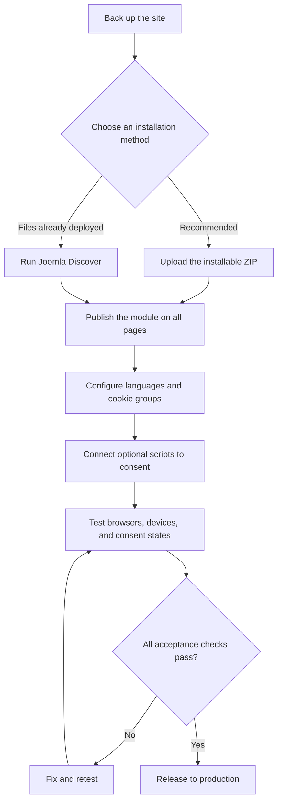
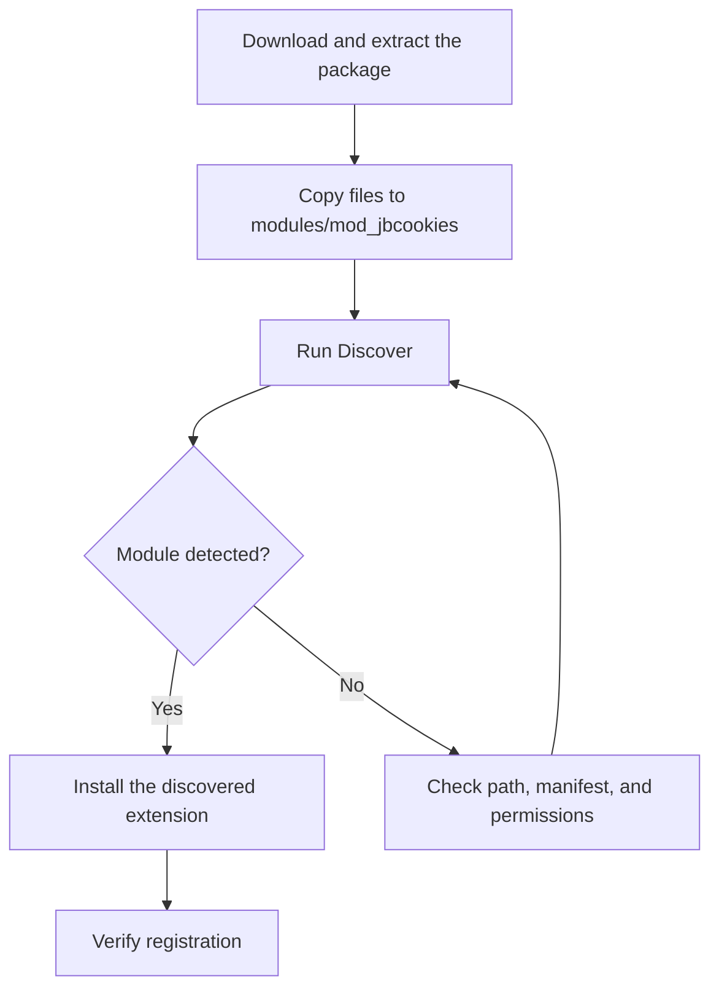
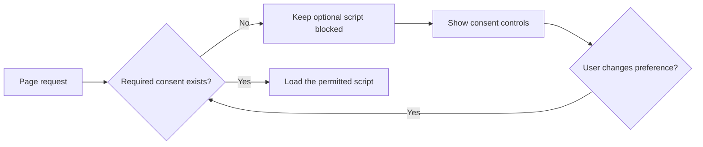

# JB Cookies 6.0.2 for Joomla 6

> Installation, configuration, migration, and verification guide

## Document overview

- [Scope and recommendation](#scope-and-recommendation)
- [Extension profile](#extension-profile)
- [Prerequisites](#prerequisites)
- [Installation](#installation)
  - [Method 1: Upload Package File](#method-1-upload-package-file)
  - [Method 2: Joomla Discover](#method-2-joomla-discover)
- [Initial configuration](#initial-configuration)
- [Cookie groups and consent controls](#cookie-groups-and-consent-controls)
- [Multilingual configuration](#multilingual-configuration)
- [Script-blocking integration](#script-blocking-integration)
- [Updates](#updates)
- [Verification](#verification)
- [Troubleshooting](#troubleshooting)
- [Production acceptance checklist](#production-acceptance-checklist)
- [Migration decision](#migration-decision)
- [Official resources](#official-resources)

---

## Scope and recommendation

JB Cookies is a lightweight Joomla site module for displaying a cookie notice and collecting cookie preferences. Version 6.0.2 is intended for Joomla 6 when the active frontend template is Bootstrap-compatible.

> [!IMPORTANT]
> A consent banner is not the same as technical cookie blocking. Analytics, advertising tags, embedded media, and other optional scripts must remain disabled until the user gives the appropriate consent. Verify this behavior independently before production release.

### End-to-end implementation flow



---

## Extension profile

| Field | Value |
|---|---|
| Extension | JoomBall Cookies / JB Cookies |
| Element | `mod_jbcookies` |
| Type | Site module |
| Developer | JoomBall Project |
| Version covered | `6.0.2` |
| Target platform | Joomla 6 |
| Distribution | Free |
| Pro edition | None identified |
| Template dependency | Bootstrap-compatible frontend template |
| Update method | Joomla Update System or manual package update |

Version 6.0.2 includes a modal-display fix relevant to Brave and improvements related to user-defined cookie-group presentation. Include Brave in acceptance testing.

---

## Prerequisites

Before installation, confirm that:

- [ ] Joomla 6 is installed and working.
- [ ] You can sign in as a Super User.
- [ ] The active site template supports Bootstrap.
- [ ] PHP ZIP support is enabled.
- [ ] Joomla temporary and log directories are writable.
- [ ] The database schema reports no errors.
- [ ] A complete file and database backup exists.
- [ ] Installation and validation will be performed in staging first.

Check the database schema at:

```text
System → Maintenance → Database
```

---

## Installation

### Method 1: Upload Package File

This is the recommended method because Joomla handles extension registration, media deployment, and installer scripts.

1. Open the [official GitHub Releases page](https://github.com/JoomBall/JBCookies/releases).
2. Download the developer-provided installable asset, expected to be named similarly to:

   ```text
   mod_jbcookies_6.0.2.zip
   ```

3. Do not use GitHub-generated **Source code (zip)** or **Source code (tar.gz)** archives as installer packages.
4. In Joomla Administrator, open:

   ```text
   System → Install → Extensions → Upload Package File
   ```

5. Upload the ZIP without extracting it.
6. Confirm that Joomla reports a successful module installation.
7. Open:

   ```text
   System → Manage → Extensions
   ```

8. Search for `JB Cookies` or `mod_jbcookies`.

Expected registration:

| Field | Expected value |
|---|---|
| Type | Module |
| Client | Site |
| Element | `mod_jbcookies` |
| Status | Enabled |
| Version | `6.0.2` |

### Method 2: Joomla Discover

Use Discover only when extension files have already been placed in the Joomla filesystem, such as during a Git-based deployment or when normal ZIP installation is unavailable.



The module directory must directly contain its manifest:

```text
<Joomla root>/
└── modules/
    └── mod_jbcookies/
        ├── mod_jbcookies.xml
        ├── script.php
        ├── services/
        ├── src/
        └── tmpl/
```

Example Docker copy command:

```bash
docker cp ./mod_jbcookies   <joomla-container>:/var/www/html/modules/mod_jbcookies
```

Typical Linux permissions:

```bash
chown -R www-data:www-data modules/mod_jbcookies
find modules/mod_jbcookies -type d -exec chmod 755 {} \;
find modules/mod_jbcookies -type f -exec chmod 644 {} \;
```

Do not guess where media files belong. Inspect `mod_jbcookies.xml` and `script.php` for the declared media destination and installer logic.

Then open:

```text
System → Install → Discover
```

Select JB Cookies, click **Install**, and verify it under **System → Manage → Extensions**.

Optional database verification:

```sql
SELECT
    extension_id,
    name,
    type,
    element,
    client_id,
    enabled,
    manifest_cache
FROM #__extensions
WHERE element = 'mod_jbcookies';
```

Expected core values:

```text
type      = module
element   = mod_jbcookies
client_id = 0
enabled   = 1
```

---

## Initial configuration

Open:

```text
Content → Site Modules
```

Open the existing JB Cookies instance. If none exists, select **New → JB Cookies**.

Recommended baseline:

| Setting | Recommended value |
|---|---|
| Title | Cookie Consent |
| Show Title | Hide |
| Status | Published |
| Access | Public |
| Language | All, unless separate instances are required |
| Position | `debug`, or another site-wide position |
| Menu Assignment | On all pages |
| Caching during migration | No caching |

If the template does not define `debug`, choose a position that:

- Exists on every page.
- Is rendered near the end of the document.
- Is not constrained by a narrow container.
- Is visible on mobile devices.
- Does not conflict with overlays or floating widgets.

To inspect template positions temporarily:

```text
System → Global Configuration → Templates
Preview Module Positions: Enabled
```

Then visit:

```text
https://your-domain.example/?tp=1
```

Disable position preview after testing.

### Recommended interface text

| Control | Suggested English label |
|---|---|
| Title | Cookie Settings |
| Accept | Accept all |
| Reject | Reject optional cookies |
| Settings | Cookie settings |
| Policy link | Read our Cookie Policy |

Suggested notice:

> We use essential cookies to operate this website and optional cookies to improve performance and your experience. You can accept, reject, or configure your cookie preferences.

### Visual configuration

Use Bootstrap classes supported by the active template, for example:

- Background: `bg-light`, `bg-dark`, `bg-primary`, or `bg-secondary`
- Primary action: `btn-primary` or `btn-success`
- Secondary action: `btn-secondary` or `btn-outline-secondary`

Check text contrast and keyboard focus states. Position the reopen-settings icon on the left or right so that it does not cover chat widgets, mobile navigation, accessibility controls, or back-to-top buttons.

---

## Cookie groups and consent controls

Define only groups that reflect the scripts and cookies actually used by the website.

| Group | Default state | Examples |
|---|---|---|
| Essential | Always enabled | Joomla session, authentication, CSRF, language, cart session |
| Functional | Disabled until consent, if optional | User preferences, optional embedded features |
| Analytics | Disabled until consent | Google Analytics, Matomo, Clarity, Hotjar |
| Marketing | Disabled until consent | Meta Pixel, Google Ads, LinkedIn Insight Tag, TikTok Pixel |

### Essential cookies

Use a description such as:

> These cookies are required for the website to operate and cannot be disabled through the cookie settings.

Confirm that users cannot disable this group and that login, forms, sessions, and cart behavior continue to work after optional cookies are rejected.

### Analytics cookies

Use a description such as:

> These cookies help us understand how visitors use the website and improve its performance.

Common names may include `_ga`, `_gid`, and `_ga_*`, but the real inventory must come from the deployed site. Confirm that analytics requests and cookies do not appear before analytics consent.

### Marketing cookies

Use a description such as:

> These cookies measure advertising performance and help provide more relevant marketing content.

Confirm that advertising scripts and network requests remain blocked until marketing consent is granted.

### Cookie discovery

A homepage scan is only a starting point. Also inspect:

- Login and registration
- Contact and other forms
- Search
- Product pages
- Cart and checkout
- Video or map embeds
- Pages containing custom HTML modules
- Pages that load analytics or advertising tags conditionally

Classify each detected cookie as Essential, Functional, Analytics, Marketing, or Unknown. Remove duplicates and add a clear purpose, provider, and duration where known.

---

## Multilingual configuration

For each active frontend language:

1. Confirm the language is installed:

   ```text
   System → Install → Languages
   ```

2. Confirm its content language is published:

   ```text
   System → Manage → Content Languages
   ```

3. Open JB Cookies and configure the language-specific:
   - Title and description
   - Accept, Reject, and Settings labels
   - Additional information
   - Cookie-group names and descriptions
   - Cookie Policy link
4. Switch the frontend to each language and test the full consent flow.
5. Confirm that no untranslated key such as `MOD_JBCOOKIES_ACCEPT` appears.

---

## Script-blocking integration

JB Cookies provides the consent interface. The website implementation must connect consent state to optional scripts.



Review every place that can load optional tracking:

- Template files and overrides
- Google Tag Manager containers
- Custom HTML modules
- Analytics plugins
- Marketing plugins
- Embedded YouTube, maps, or social content
- Page-builder custom-code blocks
- Third-party chat and personalization tools

> [!WARNING]
> If Google Analytics, Meta Pixel, or another optional service still runs after **Reject**, investigate the script integration before treating it as a JB Cookies defect.

---

## Updates

JB Cookies has no separate Pro package identified, so no Free-to-Pro upgrade process applies.

### Joomla Update System

Open:

```text
System → Update → Extensions
```

Select **Check for Updates**. Before applying an update:

- Create a backup.
- Review the target version and release notes.
- Apply the update in staging.
- Clear Joomla and browser caches.
- Retest all consent paths.

### Manual package update

If Joomla does not detect an available release:

1. Download the newer developer-provided installation ZIP.
2. Create a backup.
3. Upload the package through **System → Install → Extensions**.
4. Do not uninstall the current version unless the vendor explicitly requires it.
5. Confirm that module settings remain intact.
6. Repeat the full acceptance test.

---

## Verification

### Backend

- [ ] Exactly one expected `mod_jbcookies` extension record exists.
- [ ] Type is Module and client is Site.
- [ ] Version is `6.0.2`.
- [ ] The module instance is Published.
- [ ] The position exists in the active template.
- [ ] Menu assignment is On all pages.
- [ ] Every active language is configured.

### First visit

Use a private window or clear all site cookies.

- [ ] The notice appears.
- [ ] All controls are visible and readable.
- [ ] The layout works on desktop and mobile.
- [ ] The banner does not break page layout.
- [ ] The Settings modal opens correctly.

### Accept

- [ ] The notice closes.
- [ ] Consent is stored.
- [ ] The notice does not immediately reappear after reload.
- [ ] Only the allowed optional groups become active.
- [ ] Settings reflects the stored state.

### Reject

- [ ] The notice closes and rejection is stored.
- [ ] Essential Joomla cookies continue to work.
- [ ] Analytics and marketing cookies are not created.
- [ ] Optional tracking requests are absent.
- [ ] Login, forms, sessions, and CSRF protection remain functional.

### Custom preferences

- [ ] Optional groups can be enabled or disabled individually.
- [ ] Essential cookies remain locked.
- [ ] Preferences persist after reload.
- [ ] Reopening Settings displays the saved state.
- [ ] Changing consent changes actual script behavior.

### Browser and device matrix

Test at minimum:

- Chrome
- Edge
- Firefox
- Safari
- Brave
- Representative mobile viewport or physical device

### Developer Tools

In **Console** and **Network**, confirm:

- [ ] No JavaScript exceptions.
- [ ] No Bootstrap modal errors or duplicate initialization.
- [ ] No PHP warnings are rendered.
- [ ] No missing JS or CSS assets.
- [ ] JB Cookies assets return HTTP 200.
- [ ] No relevant Content Security Policy violations occur.

Useful Network filters:

```text
jbcookies
cookie
jbmedia
analytics
collect
pixel
```

---

## Troubleshooting

| Symptom | Checks |
|---|---|
| Module is not found | Confirm the package type, manifest location, Discover status, and extension record |
| Banner does not appear | Check Published status, module position, menu assignment, language, cache, and existing consent cookie |
| Modal is transparent or broken | Check Bootstrap compatibility, CSS overrides, duplicate Bootstrap assets, console errors, and Brave behavior |
| Preferences do not persist | Check browser storage, cookie domain/path/SameSite attributes, cache, and JavaScript errors |
| Reject still permits tracking | Inspect GTM, template code, plugins, custom modules, embeds, and consent-state integration |
| Wrong language appears | Check content languages, module language entries, menu language associations, and cache |
| Assets return 404 | Check media installation, manifest paths, deployment completeness, permissions, and cache |
| Discover finds nothing | Confirm files are in `modules/mod_jbcookies` and the manifest is directly inside that directory |

---

## Production acceptance checklist

### Installation and content

- [ ] Installation and update paths were tested in staging.
- [ ] Module is enabled, published, and assigned to all required pages.
- [ ] Cookie notice and Cookie Policy are complete and approved.
- [ ] All active languages are configured.
- [ ] Cookie groups match the website's real cookie inventory.

### Functional and technical behavior

- [ ] Accept, Reject, Settings, and reopen-settings controls work.
- [ ] Consent persists correctly.
- [ ] Essential functions remain available after rejection.
- [ ] Optional analytics and marketing remain blocked before consent.
- [ ] Changing preferences updates script behavior.
- [ ] No PHP, JavaScript, asset, or CSP errors remain.
- [ ] Desktop, mobile, and supported-browser tests pass.
- [ ] Cache was enabled only after uncached behavior passed.

### Release controls

- [ ] A rollback backup is available.
- [ ] Test evidence is recorded.
- [ ] Known limitations are documented.
- [ ] A responsible owner is assigned for future release and policy reviews.

---

## Migration decision

| Decision area | Assessment |
|---|---|
| Joomla 6 suitability | Suitable after template and functional validation |
| Installation risk | Low with the official installable ZIP |
| Migration complexity | Low to moderate, depending on script-blocking integration |
| Main technical risk | Optional scripts may run before consent if not integrated correctly |
| Recommended action | Install in staging, configure from a verified cookie inventory, integrate blocking, and complete the acceptance checklist |
| Production status | Approve only after all consent states and browsers pass |

JB Cookies is a practical choice for a small or medium Joomla site that needs a lightweight, free, Bootstrap-based consent interface. It should not be treated as a complete Consent Management Platform unless the project's implementation and tests prove that all optional scripts are controlled correctly.

---

## Official resources

- [JB Cookies releases](https://github.com/JoomBall/JBCookies/releases)
- [JB Cookies source repository](https://github.com/JoomBall/JBCookies)
- [Joomla Extensions Directory listing](https://extensions.joomla.org/extension/joomball-cookies/)

---

_Last reviewed for the Joomla 6 migration guide: July 29, 2026._
