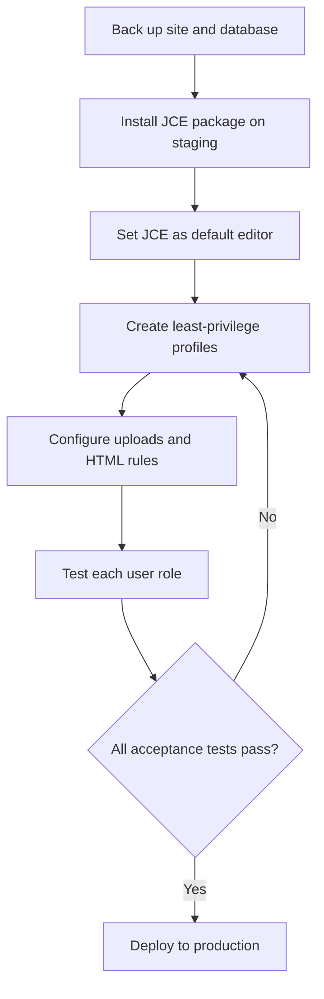
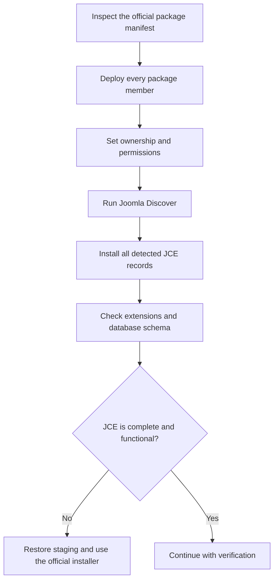

# JCE Editor for Joomla 6

> Installation, Core-to-Pro upgrade, configuration, security, and verification guide

This guide explains how to install JCE Editor, upgrade from JCE Core to JCE Pro, configure role-based editor profiles, and verify the extension on Joomla 6.

> [!IMPORTANT]
> Test installation, migration, profile imports, and edition changes in a staging environment before applying them to production.

## Document overview

- [1. Extension overview](#extension-overview)
- [2. Recommended implementation flow](#recommended-implementation-flow)
- [3. Official resources](#official-resources)
- [4. Pre-installation checklist](#pre-installation-checklist)
- [5. Install JCE Core](#install-jce-core)
- [6. Alternative installation methods](#alternative-installation-methods)
- [7. Upgrade from Core to Pro](#upgrade-from-core-to-pro)
- [8. Downgrade from Pro to Core](#downgrade-from-pro-to-core)
- [9. Configure JCE for Joomla 6](#configure-jce-for-joomla-6)
- [10. Recommended editor profiles](#recommended-editor-profiles)
- [11. Feature configuration](#feature-configuration)
- [12. Verification and acceptance tests](#verification-and-acceptance-tests)
- [13. Security hardening](#security-hardening)
- [14. Troubleshooting](#troubleshooting)
- [15. Migration checklist](#migration-checklist)
- [16. Final assessment](#final-assessment)

<a id="extension-overview"></a>
## 1. Extension overview

| Field | Value |
|---|---|
| Extension | JCE — Joomla Content Editor |
| Vendor | Widget Factory Limited |
| Package type | Component, editor plugin, and supporting plugins |
| Core edition | Free |
| Pro edition | Paid subscription |
| Version documented | `2.9.99.9` or later |
| Joomla compatibility documented by vendor | Joomla 3.9+, 4, 5, and 6 |
| Recommended installation method | Upload Package File |
| Primary purpose | WYSIWYG content editing and controlled image, file, link, and media management |

JCE is more than a single editor plugin. Its package can install the JCE component, the editor plugin, integration plugins, media assets, language files, database records, and update-site records.

### Core and Pro comparison

| Capability | Core | Pro |
|---|:---:|:---:|
| Rich-text editing | ✓ | ✓ |
| Editor Profiles | ✓ | ✓ |
| Basic image management | ✓ | ✓ |
| Links, tables, and source editing | ✓ | ✓ |
| Image Manager Extended | — | ✓ |
| File Manager | — | ✓ |
| Media Manager | — | ✓ |
| Template Manager | — | ✓ |
| Captions and advanced media tools | — | ✓ |
| IFrame tools | — | ✓ |

<a id="recommended-implementation-flow"></a>
## 2. Recommended implementation flow



For most projects, use **Upload Package File**. Use **Install from Folder** when PHP upload limits prevent a normal upload. Treat **Discover** as a recovery or advanced deployment method, not the default.

<a id="official-resources"></a>
## 3. Official resources

| Resource | URL |
|---|---|
| JCE Core download | https://www.joomlacontenteditor.net/downloads/editor/core |
| Latest JCE Core package | https://www.joomlacontenteditor.net/downloads/editor/core/latest |
| JCE Pro product page | https://www.joomlacontenteditor.net/products/jce-pro |
| JCE Pro subscription | https://www.joomlacontenteditor.net/component/subscriptions/purchase |
| Latest JCE Pro package | https://www.joomlacontenteditor.net/downloads/editor/pro/latest |
| Official installation guide | https://www.joomlacontenteditor.net/support/installation/editor |

> [!NOTE]
> JCE Core can be downloaded without a Pro subscription. A valid subscription is required to download and receive updates for JCE Pro.

<a id="pre-installation-checklist"></a>
## 4. Pre-installation checklist

- [ ] Back up the database.
- [ ] Back up the Joomla source files.
- [ ] Confirm that Joomla 6 is stable.
- [ ] Use a Super User account for installation.
- [ ] Confirm that Joomla's `tmp` and log paths are writable.
- [ ] Confirm that the PHP ZIP extension is enabled.
- [ ] Review any failed or partial JCE installation.
- [ ] Identify the currently installed JCE version and edition.
- [ ] Export or document existing Editor Profiles.
- [ ] Review old JCE installations for security and upload-policy risks.
- [ ] Test the change on staging.

Do not uninstall an existing JCE installation before an in-place update of the same edition unless vendor support specifically instructs you to do so.

<a id="install-jce-core"></a>
## 5. Install JCE Core

### Step 1 — Download the package

Download the latest Core installation ZIP from the official JCE website. Do not extract it.

An example filename is:

```text
com_jce_29999.zip
```

The actual filename varies by release.

### Step 2 — Open the Joomla installer

Sign in to:

```text
https://your-domain.example/administrator
```

Then navigate to:

```text
System → Install → Extensions → Upload Package File
```

### Step 3 — Upload and install

1. Select **Browse for file**.
2. Choose the JCE ZIP package.
3. Wait for Joomla to complete the installation.
4. Do not close the browser during installation.

Expected result:

```text
Installation of the package was successful.
```

### Step 4 — Verify extension registration

Navigate to:

```text
System → Manage → Extensions
```

Search for `JCE`, `com_jce`, and `plg_editors_jce`. Confirm that:

- The JCE component exists.
- The JCE editor plugin is enabled.
- The installed version is correct.
- No duplicate or partial package is present.

### Step 5 — Open the JCE Control Panel

Navigate to:

```text
Components → JCE Editor
```

Confirm that the Control Panel and Editor Profiles pages open without PHP, JavaScript, or database errors.

### Step 6 — Set JCE as the default editor

Navigate to:

```text
System → Global Configuration → Site
```

Set:

```text
Default Editor: Editor - JCE
```

Save the configuration.

### Step 7 — Check user-specific overrides

A user can override the global editor. Navigate to:

```text
Users → Manage → Select user → Basic Settings
```

Set the editor to **Use Default** or **Editor - JCE**. A user explicitly assigned to TinyMCE will not automatically inherit the global JCE setting.

<a id="alternative-installation-methods"></a>
## 6. Alternative installation methods

### 6.1 Install from Folder

This is the preferred alternative when the package exceeds the PHP upload limit.

1. Upload and extract the package into a temporary directory.
2. Ensure that the web-server user can read it.
3. Open **System → Install → Extensions → Install from Folder**.
4. Enter the extracted package path.
5. Run the installation.

Example:

```bash
mkdir -p /var/www/html/tmp/jce-install
unzip com_jce_package.zip -d /var/www/html/tmp/jce-install
chown -R www-data:www-data /var/www/html/tmp/jce-install
```

Unlike a manual Discover workflow, this method still lets Joomla execute the complete package installer and installation script.

### 6.2 Discover

Use Discover only when files have already been deployed to their correct Joomla locations, such as through Git, Docker, CI/CD, or a controlled recovery procedure.

> [!WARNING]
> Discover does not upload, extract, or correctly distribute a package automatically. Copying only `administrator/components/com_jce` is incomplete and may omit plugins, media assets, languages, database changes, update sites, and installer-script actions.



Do not use a generic GitHub source archive unless it is an installation package built and supported by the vendor.

<a id="upgrade-from-core-to-pro"></a>
## 7. Upgrade from Core to Pro

> [!IMPORTANT]
> A Subscription Key does not convert JCE Core into JCE Pro. Install the JCE Pro package over the existing Core installation.

### Upgrade procedure

1. Back up the database, Joomla files, JCE configuration, Editor Profiles, and custom editor CSS.
2. Purchase a JCE Pro subscription.
3. Sign in to the JCE website and obtain the Subscription Key.
4. Download the latest JCE Pro installation package.
5. Do **not** uninstall JCE Core.
6. Install the Pro ZIP through **Upload Package File**.
7. Enter the Subscription Key in the JCE update settings or the relevant Joomla update-site field.
8. Rebuild Joomla Update Sites if old Core/Pro records conflict.
9. Confirm that the Control Panel identifies the edition as **JCE Pro**.
10. Add the required Pro buttons to each Editor Profile.
11. Run **System → Update → Extensions → Check for Updates**.
12. Execute the Pro feature tests in this guide.

Keep the Subscription Key out of GitHub, public documentation, screenshots, public support tickets, and example environment files.

### Add Pro buttons to a profile

Navigate to:

```text
Components → JCE Editor → Editor Profiles → Select profile → Features & Layout
```

Move the required buttons from **Available Buttons** to **Current Editor Layout**. Existing profiles may be preserved during the upgrade, so Pro buttons do not necessarily appear automatically.

<a id="downgrade-from-pro-to-core"></a>
## 8. Downgrade from Pro to Core

JCE Core should not be installed directly over JCE Pro.

1. Back up the database and export the Editor Profiles.
2. Identify content and workflows that depend on Pro plugins.
3. Test the downgrade on staging.
4. Uninstall JCE Pro.
5. Install JCE Core.
6. Rebuild Update Sites.
7. Remove or replace Pro-only buttons and workflows.
8. Verify articles containing media, files, templates, captions, or Pro-specific markup.

<a id="configure-jce-for-joomla-6"></a>
## 9. Configure JCE for Joomla 6

JCE Editor Profiles are the primary control layer. A profile can assign different toolbars, filesystem roots, upload permissions, HTML rules, and plugin settings based on the Joomla area, component, device, user group, or user.

### Recommended configuration sequence

1. Audit existing profiles.
2. Create separate profiles for administrators, editors, and authors.
3. Order profiles from the most specific to the most general.
4. Configure the toolbar for each role.
5. Restrict filesystem roots.
6. Allow only required file extensions.
7. Configure HTML validation and cleanup.
8. Configure editor typography or a dedicated `editor.css`.
9. Apply Joomla ACL restrictions.
10. Test with real accounts from every assigned group.

<a id="recommended-editor-profiles"></a>
## 10. Recommended editor profiles

| Setting | Super User | Editor/Publisher | Author |
|---|---|---|---|
| Area | Administrator | Administrator | Site and/or Administrator |
| Toolbar | Full | Content editing | Basic |
| Source Code | Enabled | Optional | Disabled |
| IFrames | Allowlisted | Usually disabled | Disabled |
| Image management | Extended when Pro | Enabled | Basic |
| File Manager | Enabled when required | Optional | Disabled |
| Filesystem root | `images` | `images/content` | Role/user-specific folder |
| Upload | Enabled | Restricted | Images only |
| Delete/Rename | Enabled | Limited | Disabled |
| Executable files | Blocked | Blocked | Blocked |

### Profile-order rule

Place specific role or component profiles above general fallback profiles. After importing Joomla 3 profiles, review their groups, component assignments, paths, extensions, toolbar buttons, and permissions before publishing them.

<a id="feature-configuration"></a>
## 11. Feature configuration

### 11.1 Toolbar

Keep only the tools required by the assigned role. A practical content-editor toolbar is:

```text
Undo | Redo
Bold | Italic | Paragraph Format
Bulleted List | Numbered List
Link | Unlink | Image Manager
Table
Source Code — trusted users only
```

### 11.2 Image Manager

- Set a narrow file directory such as `images/content`.
- Allow only required formats such as `jpg,jpeg,png,gif,webp`.
- Set an appropriate upload-size limit.
- Grant create, rename, delete, copy, and move operations only when required.
- Block executable formats, including `php`, `phtml`, `phar`, `pl`, and `cgi`.
- Require meaningful alternative text where applicable.

### 11.3 Image Manager Extended — Pro

Configure maximum dimensions, upload resizing, thumbnails, image quality, watermarking, and image-editor permissions. Verify resized dimensions, orientation, quality, destination folders, and overwrite behavior.

### 11.4 File Manager — Pro

Allow only business-required formats, for example:

```text
pdf,doc,docx,xls,xlsx,ppt,pptx,zip
```

Use a dedicated folder and block executable files. Test upload, links, download behavior, visibility boundaries, rename, and delete permissions.

### 11.5 Media Manager — Pro

Allow only required media formats, such as `mp4`, `webm`, `mp3`, and `ogg`. Configure dimensions, controls, preload, looping, responsive behavior, and approved external-media sources.

Avoid autoplay with sound. Do not allow unrestricted embedding from arbitrary domains.

### 11.6 Links

Test links to articles, categories, menu items, documents, email addresses, and external URLs. Prefer relative URLs for normal site content. Newsletter integrations may require absolute URLs.

Block JavaScript URLs. When opening external links in a new tab, apply the project's required `rel` policy.

### 11.7 HTML cleanup and output

Recommended baseline:

```text
Validate HTML: Yes
Cleanup on Save: Yes
Relative URLs: Yes
```

Restrict `script`, `object`, `embed`, and unsafe attributes unless a narrowly scoped trusted-developer profile requires them.

### 11.8 Content CSS and typography

Use a dedicated editor stylesheet when possible:

```text
media/templates/site/<template>/css/editor.css
```

Keep it small and aligned with frontend typography. Verify headings, tables, lists, buttons, spacing, and fonts in both the editor and frontend.

### 11.9 Tables

JCE creates HTML tables; responsive behavior depends on the site template. Test table classes, header rows, keyboard navigation, and mobile rendering.

### 11.10 Template Manager — Pro

Store reviewed snippets in a controlled directory. Use templates for repeatable structures such as product descriptions, news articles, campaign blocks, staff profiles, FAQs, and calls to action.

### 11.11 IFrames — Pro

Enable IFrames only for trusted profiles. Maintain an explicit domain allowlist, apply suitable `sandbox`, `allow`, and lazy-loading attributes, and verify compatibility with the site's Content Security Policy.

### 11.12 JCE administration permissions

Navigate to:

```text
Components → JCE Editor → Options → Permissions
```

Recommended baseline:

- **Configure:** Super Users only.
- **Manage Profiles:** Administrators and Super Users.
- **Manage Plugins:** Super Users only.
- **Access Component:** Selected administrative groups.
- Do not give ordinary Authors or Editors permission to manage profiles.

### 11.13 Export and import profiles

Export profiles before migration or major configuration changes. After import, review every user group, directory, extension allowlist, toolbar, component assignment, and permission. Test with a dedicated non-privileged account before publishing the profile.

<a id="verification-and-acceptance-tests"></a>
## 12. Verification and acceptance tests

### 12.1 Installation and editor

- [ ] The JCE component is registered.
- [ ] The JCE editor plugin is enabled.
- [ ] The expected version and edition are installed.
- [ ] The Control Panel and Editor Profiles open without errors.
- [ ] JCE is the global default editor.
- [ ] User-specific editor overrides are correct.
- [ ] An article can be created, saved, reopened, and edited.
- [ ] Bold, italic, headings, lists, links, and tables work.
- [ ] Visual/source-mode switching preserves expected markup.
- [ ] Copying from Word or Google Docs does not leave unacceptable markup.

### 12.2 Images and files

- [ ] JPG, PNG, and WebP uploads succeed when allowed.
- [ ] Alternative text is saved.
- [ ] Resize, crop, rotate, and thumbnails work when using Pro.
- [ ] Users see only their permitted directories.
- [ ] PDF uploads and links work when allowed.
- [ ] PHP, PHTML, PHAR, and other executable formats are blocked.
- [ ] Rename, delete, copy, and move follow profile permissions.
- [ ] Path traversal and disguised executable uploads are rejected.

### 12.3 Media and embeds

- [ ] Video and audio render on supported browsers and mobile devices.
- [ ] Media remains responsive.
- [ ] There are no unexpected console errors.
- [ ] External embeds are limited to approved domains.
- [ ] IFrames comply with the Content Security Policy.

### 12.4 Profiles and ACL

- [ ] Super Users receive the correct profile.
- [ ] Editors and Publishers receive the correct profile.
- [ ] Authors receive the restricted profile.
- [ ] Profile ordering produces the intended match.
- [ ] No profile permits executable uploads.
- [ ] Non-administrators cannot manage JCE profiles or plugins.
- [ ] Joomla Articles, Custom HTML Modules, category descriptions, frontend editing, and required third-party editor fields work.

### 12.5 Sample content test

Insert, save, reopen, and inspect:

```html
<h2>JCE Test Heading</h2>
<p>This is a <strong>JCE editor test</strong>.</p>
<ul>
  <li>Item one</li>
  <li>Item two</li>
</ul>
```

Pass when JCE preserves the permitted markup and the frontend renders it correctly.

<a id="security-hardening"></a>
## 13. Security hardening

JCE has a meaningful attack surface because it can manage uploads, folders, HTML source, IFrames, media, editor profiles, and user permissions.

Apply these controls:

- Keep JCE on a vendor-supported, current release.
- Use least-privilege profiles for every user group.
- Restrict filesystem roots to the smallest required directory.
- Permit only explicitly required file extensions.
- Block executable files at JCE, Joomla, web-server, and operating-system levels.
- Disable Source Code and IFrames for untrusted users.
- Use an allowlist for external embeds.
- Separate administrator, editor, and author profiles.
- Review profile ordering after every import or migration.
- Limit profile and plugin administration to trusted administrators.
- Review writable directories and server logs.
- Retest uploads after every JCE, Joomla, PHP, or web-server change.
- Never expose the JCE Subscription Key.

> [!CAUTION]
> Old JCE releases have had serious profile and file-upload vulnerabilities. Treat profile permissions, allowed extensions, path restrictions, and negative upload tests as mandatory controls.

<a id="troubleshooting"></a>
## 14. Troubleshooting

| Problem | Likely cause | Recommended action |
|---|---|---|
| JCE does not appear in article editing | Global editor or user override points elsewhere | Set JCE globally and review the user's Basic Settings |
| Pro buttons are missing | Existing profile was preserved | Add Pro buttons under **Features & Layout** |
| Joomla still shows Core updates | Stale or conflicting update-site records | Enter the correct key and rebuild Update Sites |
| Upload fails | PHP limit, permissions, MIME policy, or profile restriction | Check PHP limits, directories, allowlists, and JCE profile settings |
| Discover finds only part of JCE | Incomplete manual deployment | Restore staging and install the official package |
| Control Panel reports database errors | Incomplete installation or schema mismatch | Check **System → Maintenance → Database** and reinstall safely |
| Editor content differs from frontend | Missing or conflicting editor CSS | Configure a dedicated `editor.css` and retest |
| A role receives the wrong profile | Profile matching or ordering conflict | Make conditions specific and reorder profiles |
| Update authentication fails | Missing, expired, or incorrect Subscription Key | Verify the subscription and update-site configuration |

<a id="migration-checklist"></a>
## 15. Migration checklist

### Before migration

- [ ] Record the current JCE version and edition.
- [ ] Export all Editor Profiles.
- [ ] Document plugins, toolbar layouts, paths, and upload policies.
- [ ] Identify Pro-only dependencies.
- [ ] Inventory user groups and profile matching.
- [ ] Back up the Joomla 3 site and database.
- [ ] Obtain a Joomla 6-compatible JCE package.

### On Joomla 6 staging

- [ ] Install the supported JCE package.
- [ ] Import profiles without publishing them immediately.
- [ ] Review group IDs, component assignments, paths, and permissions.
- [ ] Replace obsolete or missing plugins.
- [ ] Configure strict upload allowlists.
- [ ] Verify editor CSS and frontend output.
- [ ] Test every user role and integration.
- [ ] Run negative security tests.
- [ ] Record evidence and unresolved issues.

### Before production acceptance

- [ ] All critical workflows pass.
- [ ] No unexpected PHP or JavaScript errors remain.
- [ ] No role has excessive editor or filesystem permissions.
- [ ] Executable and disguised uploads are blocked.
- [ ] Backups and rollback steps are verified.
- [ ] Update authentication works for the installed edition.
- [ ] The final configuration is documented.

<a id="final-assessment"></a>
## 16. Final assessment

JCE is suitable for Joomla 6 projects that need more control than Joomla's default editor, especially when different roles require different toolbars, filesystem roots, upload permissions, and HTML rules.

JCE Core is appropriate for general content editing, profiles, links, tables, source editing, and basic image management. JCE Pro is appropriate when the project requires advanced image editing, file downloads, video or audio workflows, reusable templates, captions, IFrames, or other advanced media features.

The extension should be accepted for production only after role-based profiles, strict file-upload restrictions, HTML rules, ACL, integrations, and negative security tests have been verified.
