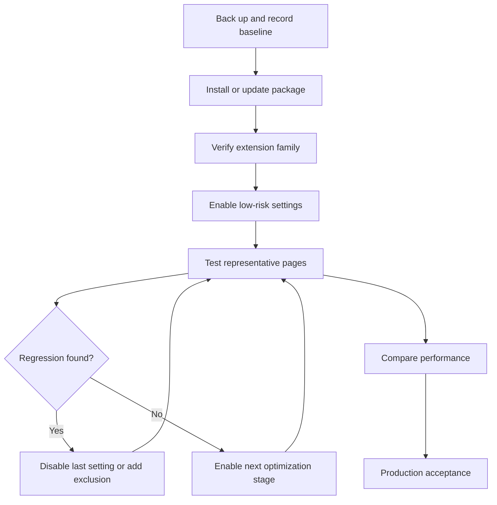
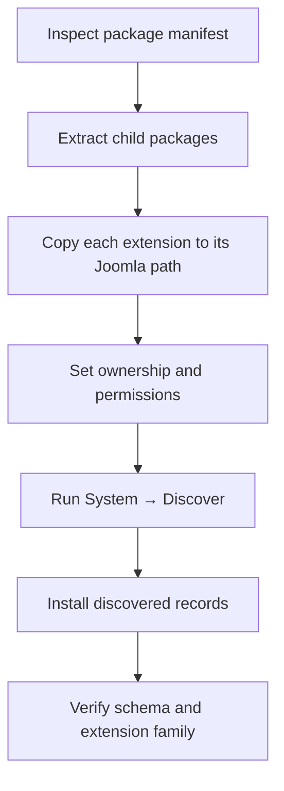

# JCH Optimize 9.3.0 for Joomla 6

> Installation, Core-to-Pro upgrade, configuration, verification, and production guide

<a id="document-overview"></a>

## Document overview

- [1. Purpose and scope](#purpose-and-scope)
- [2. Package information](#package-information)
- [3. Official resources](#official-resources)
- [4. Capabilities and limitations](#capabilities-and-limitations)
- [5. Deployment workflow](#deployment-workflow)
- [6. Pre-installation checklist](#pre-installation-checklist)
- [7. Install with Upload Package File](#install-with-upload-package-file)
- [8. Alternative installation methods](#alternative-installation-methods)
- [9. Upgrade from Core to Pro](#upgrade-from-core-to-pro)
- [10. Update an existing installation](#update-an-existing-installation)
- [11. Safe configuration strategy](#safe-configuration-strategy)
- [12. Feature configuration](#feature-configuration)
- [13. Exclusions](#exclusions)
- [14. Verification plan](#verification-plan)
- [15. Troubleshooting](#troubleshooting)
- [16. Production acceptance checklist](#production-acceptance-checklist)
- [17. Migration guidance](#migration-guidance)

---

<a id="purpose-and-scope"></a>

## 1. Purpose and scope

JCH Optimize is a Joomla frontend performance extension. It processes Joomla's generated HTML before the response reaches the browser and can optimize HTML, CSS, JavaScript, images, fonts, caching, and asset delivery.

This guide covers:

- Installing JCH Optimize Core on Joomla 6.
- Upgrading an existing Core installation to Pro.
- Applying performance settings incrementally.
- Configuring exclusions for incompatible assets and URLs.
- Verifying frontend behavior, sessions, e-commerce flows, and performance.
- Preparing the extension for production use.

JCH Optimize creates optimized assets in its cache. It does not directly rewrite the original CSS and JavaScript files belonging to Joomla, the template, or third-party extensions.

> [!IMPORTANT]
> Performance optimization is site-specific. A setting that works on one Joomla site may break another site because templates, page builders, extensions, and third-party scripts load assets differently.

[Back to overview](#document-overview)

---

<a id="package-information"></a>

## 2. Package information

| Field | Value |
|---|---|
| Extension | JCH Optimize |
| Vendor | JCH Optimize |
| Version covered | `9.3.0` or later compatible release |
| Core package example | `pkg_jchoptimize-9.3.0-core.zip` |
| Joomla compatibility stated by the package | Joomla 4.4, 5.x, 6.0, and 6.1 |
| Editions | Core and Pro |
| Pro requirement | Active subscription |
| Recommended installation method | Upload Package File |
| Alternative method | Install from Folder |
| Discover installation | Manual deployments only |

Package names and bundled child extensions can change between releases. Always confirm the manifest and compatibility information in the package you intend to deploy.

[Back to overview](#document-overview)

---

<a id="official-resources"></a>

## 3. Official resources

| Resource | URL |
|---|---|
| Download page | <https://www.jch-optimize.net/download.html> |
| Joomla releases | <https://www.jch-optimize.net/downloads/joomla-releases.html> |
| JCH Optimize 9.3.0 release | <https://www.jch-optimize.net/component/ars/?format=html&release_id=1517&view=Items> |
| Pro subscription | <https://www.jch-optimize.net/subscribe.html> |
| Documentation | <https://www.jch-optimize.net/documentation.html> |
| Installation and updates | <https://www.jch-optimize.net/documentation/installation-upgrades-updates-and-support.html> |
| Automatic updates | <https://www.jch-optimize.net/documentation/automatic-updates.html> |

For an Upload Package File installation, download the Joomla package and keep it compressed.

[Back to overview](#document-overview)

---

<a id="capabilities-and-limitations"></a>

## 4. Capabilities and limitations

### 4.1 Main capabilities

| Area | Typical capabilities | Primary risk |
|---|---|---|
| HTML | Minification and response cleanup | Invalid markup from unusual output |
| CSS | Minification, bundling, delivery optimization, Critical CSS | Missing styles or flash of unstyled content |
| JavaScript | Minification, bundling, defer, delayed execution | Broken menus, forms, sliders, or consent tools |
| Images | Lazy loading, dimensions, responsive images, conversion | Poor LCP or incorrect image selection |
| Fonts | Google Fonts optimization and preloading | Duplicate downloads or delayed text |
| Cache | Full-page cache and cache management | Stale or user-specific content |
| Delivery | CDN URL rewriting and Cloudflare integration | Incorrect URLs or double caching |
| Automation | CLI recache support | Resource usage during large crawls |

### 4.2 Important limitations

JCH Optimize:

- Cannot repair inefficient PHP, database queries, hosting, or third-party APIs.
- Cannot guarantee that every asset can be combined, deferred, or delayed safely.
- Requires exclusions for some dynamic scripts and styles.
- Must not cache private, personalized, cart, checkout, or authenticated responses.
- May conflict with another extension or platform layer performing the same optimization.
- Requires new regression tests after template, extension, or content changes.
- Cannot guarantee a specific PageSpeed Insights score.

Avoid overlapping optimization for:

- CSS or JavaScript aggregation.
- HTML minification.
- Full-page caching.
- Image lazy loading.
- CDN URL rewriting.
- Cloudflare cache behavior.

> [!CAUTION]
> Two systems modifying the same HTML, assets, or cache layer can produce nested caches, stale output, duplicate processing, and difficult-to-diagnose frontend failures.

[Back to overview](#document-overview)

---

<a id="deployment-workflow"></a>

## 5. Deployment workflow



Apply only one optimization group at a time. Clear all relevant caches and rerun the same regression set after each change.

[Back to overview](#document-overview)

---

<a id="pre-installation-checklist"></a>

## 6. Pre-installation checklist

- [ ] Back up the Joomla database.
- [ ] Back up the complete Joomla source and configuration.
- [ ] Test the change in staging before production.
- [ ] Confirm that the site works correctly without optimization.
- [ ] Capture Lighthouse or PageSpeed Insights baseline results.
- [ ] Use a Joomla Super User account.
- [ ] Confirm that `tmp`, `cache`, and `media` are writable.
- [ ] Confirm that the PHP ZIP extension is enabled.
- [ ] Record any existing CDN or Cloudflare configuration.
- [ ] Record current optimization and cache extensions.
- [ ] Identify login, logout, account, search, form, cart, checkout, and API URLs.
- [ ] Select representative desktop and mobile pages for regression testing.

Recommended representative pages:

- Home page.
- Article or blog page.
- Contact or registration form.
- Search results.
- Login and account pages.
- A page containing a menu, slider, modal, tabs, or accordion.
- Product, cart, and checkout pages when e-commerce is present.

[Back to overview](#document-overview)

---

<a id="install-with-upload-package-file"></a>

## 7. Install with Upload Package File

This is the recommended installation method.

1. Download the Joomla package, for example:

   ```text
   pkg_jchoptimize-9.3.0-core.zip
   ```

2. Do not extract the ZIP file.
3. Sign in to Joomla Administrator as a Super User:

   ```text
   https://your-domain.example/administrator
   ```

4. Go to:

   ```text
   System → Install → Extensions → Upload Package File
   ```

5. Select the ZIP package and wait for Joomla to complete the installation.
6. Confirm that Joomla reports a successful package installation.
7. Go to:

   ```text
   System → Manage → Extensions
   ```

8. Search for `JCH Optimize` and verify the installed extension family.
9. Go to:

   ```text
   System → Manage → Plugins
   ```

10. Confirm that the required JCH Optimize plugins are enabled.
11. Open the JCH Optimize component and confirm that its dashboard loads without PHP or JavaScript errors.
12. Leave aggressive optimization disabled until the baseline and functional tests are ready.

The package may install a component, system plugin, page-cache plugin, console plugin, supporting plugins, and a package manifest. Exact names vary by edition and release.

[Back to overview](#document-overview)

---

<a id="alternative-installation-methods"></a>

## 8. Alternative installation methods

### 8.1 Install from Folder

Use this method when browser upload limits prevent a normal package upload.

1. Copy the ZIP file to a temporary server directory.
2. Extract it into a dedicated directory.
3. In Joomla Administrator, go to:

   ```text
   System → Install → Extensions → Install from Folder
   ```

4. Enter the absolute path to the extracted package directory.
5. Select **Check and Install**.
6. Verify the complete extension family after installation.
7. Remove temporary installation files when they are no longer required.

### 8.2 Discover installation

Discover is intended for cases where extension files were manually copied into the Joomla directory structure. It is not the preferred method for a multi-extension package such as JCH Optimize.



Use Discover only if you understand the package structure and can confirm that every component, plugin, media directory, language file, and database migration has been handled.

> [!WARNING]
> Copying only the component or system plugin can leave an incomplete installation. Prefer Upload Package File or Install from Folder whenever possible.

[Back to overview](#document-overview)

---

<a id="upgrade-from-core-to-pro"></a>

## 9. Upgrade from Core to Pro

Install the Pro package over the existing Core installation. Do not uninstall Core first unless the vendor explicitly instructs you to do so for the release being used.

1. Create a fresh backup.
2. Export or capture the current Core settings.
3. Purchase an active JCH Optimize Pro subscription.
4. Sign in to the vendor account and download the Joomla Pro package.
5. Install the Pro ZIP with **Upload Package File**.
6. Open JCH Optimize and verify that the Pro edition and Pro features are available.
7. Obtain the account Download ID.
8. Enter the Download ID in the extension's update or download configuration.
9. Go to:

   ```text
   System → Update → Extensions
   ```

10. Check for updates and confirm that authenticated Pro updates work.
11. Recheck the edition after an update to ensure that Core was not accidentally installed over Pro.
12. Clear Joomla, JCH Optimize, CDN, reverse-proxy, and browser caches.
13. Rerun the functional regression suite.

> [!IMPORTANT]
> Installing Core over Pro may remove or hide Pro functionality. Keep the correct Pro package and authenticated update configuration in deployment documentation.

[Back to overview](#document-overview)

---

<a id="update-an-existing-installation"></a>

## 10. Update an existing installation

### Automatic update

1. Confirm the configured update channel and Download ID when Pro is used.
2. Create a backup.
3. Open `System → Update → Extensions`.
4. Install the available update.
5. Clear all cache layers.
6. Verify the edition, extension family, dashboard, and frontend.

### Manual update

1. Download the correct Core or Pro Joomla package.
2. Install it over the existing version with **Upload Package File**.
3. Do not uninstall the previous version unless required by vendor release notes.
4. Verify configuration retention and database schema state.
5. Clear caches and execute the verification plan.

[Back to overview](#document-overview)

---

<a id="safe-configuration-strategy"></a>

## 11. Safe configuration strategy

### Stage 1 — Low risk

- HTML minification.
- CSS minification.
- JavaScript minification, after basic script testing.
- Add image `width` and `height`.
- Lazy loading below-the-fold images and iframes.

### Stage 2 — Medium risk

- Smart Combine or optimized bundling.
- JavaScript defer.
- Responsive images.
- Image optimization.
- Google Fonts optimization.
- Carefully selected preloads.
- CDN rewriting.

### Stage 3 — High risk

- Optimize CSS Delivery and Critical CSS.
- Reduce Unused CSS.
- Reduce Unused JavaScript.
- Reduce DOM.
- Full-page cache.
- Cloudflare cache integration.

For every stage:

1. Enable one feature group.
2. Clear all caches.
3. Test desktop and mobile.
4. Test guest and authenticated sessions.
5. Test dynamic and e-commerce flows.
6. Record exclusions and reasons.
7. Compare performance with the baseline.
8. Proceed only after the current stage passes.

[Back to overview](#document-overview)

---

<a id="feature-configuration"></a>

## 12. Feature configuration

### 12.1 HTML, CSS, and JavaScript minification

Enable minification separately for each asset type. After each change:

- Inspect the browser console.
- Inspect failed network requests.
- Check layout and responsive breakpoints.
- Test menus, forms, modals, tabs, accordions, sliders, and consent tools.

JavaScript is sensitive to execution order. If a function fails, disable the most recent JavaScript option and identify the responsible file or inline script before adding a narrow exclusion.

### 12.2 Smart Combine and optimized bundling

Bundling can reduce HTTP requests, but combining every asset is not automatically faster on HTTP/2 or HTTP/3.

- Prefer Smart Combine or optimized bundling over a single oversized bundle.
- Preserve the order of dependent scripts.
- Exclude only the asset that causes a confirmed regression.
- Recheck cache URLs after deployments.

### 12.3 JavaScript defer and delayed execution

Defer non-critical scripts so that initial content can render first. Delay interaction-dependent scripts only after verifying:

- Navigation and mobile menus.
- Form validation and submission.
- Analytics and consent behavior.
- Search autocomplete.
- Cart and checkout updates.
- Captcha and payment scripts.

Scripts required above the fold or before user interaction may need an exclusion.

### 12.4 Lazy loading

Lazy-load below-the-fold images, videos, and iframes. Exclude:

- Logo.
- Hero image.
- Likely Largest Contentful Paint image.
- Immediately visible slider images.
- Any image whose delayed loading causes layout or usability issues.

### 12.5 Image dimensions and responsive images

Adding `width` and `height` attributes helps the browser reserve space and can reduce Cumulative Layout Shift.

For responsive images:

- Define widths that match real layout breakpoints.
- Avoid generating unnecessary variants.
- Check image sharpness on mobile, tablet, and desktop.
- Confirm that the browser selects an appropriate `srcset` candidate.

### 12.6 Image optimization

- Keep backups of original images.
- Start with conservative quality settings.
- Verify transparency, animation, metadata requirements, and visual quality.
- Do not repeatedly recompress already optimized source images.
- Confirm fallback behavior when modern image formats are used.

### 12.7 Google Fonts and preload

Optimize only fonts actually used by the site. Preload a small number of critical resources, such as:

- The primary above-the-fold font.
- The verified LCP image.
- A critical stylesheet when measurement supports it.

Do not preload large numbers of assets. Excessive preload competes for bandwidth and can make performance worse.

### 12.8 Optimize CSS Delivery

This feature identifies above-the-fold CSS, inlines Critical CSS, and loads the remaining CSS without blocking the initial render.

Test for:

- Flash of unstyled content.
- Missing menu, modal, popup, or responsive styles.
- Dynamic classes not included in Critical CSS.
- Incorrect layout at different breakpoints.

If a regression occurs, disable the feature to restore the site, clear cache, and then configure targeted CSS exclusions.

### 12.9 Reduce Unused CSS

This option defers CSS that is not required for the initial render. It is particularly sensitive to UI revealed after interaction:

- Mobile menus.
- Modals.
- Accordions and tabs.
- Validation messages.
- Dynamically generated elements.
- Cart and checkout widgets.

Enable it only after Optimize CSS Delivery works reliably.

### 12.10 Reduce Unused JavaScript

This feature delays scripts until an interaction such as a click, scroll, touch, mouse movement, or input. Exclude scripts required for initial rendering, consent, tracking initialization, security controls, or essential navigation.

### 12.11 Reduce DOM

Reduce DOM can defer below-the-fold markup. Do not enable it when deferred content:

- Is SEO-critical.
- Is required by a script during page initialization.
- Contains interactive or personalized elements.
- Causes accessibility or navigation problems.

### 12.12 Page Cache

Page Cache is generally safest for public guest pages. Exclude:

- Login and logout.
- Registration and password reset.
- User profiles and account areas.
- Forms with session-specific tokens.
- Cart and checkout.
- Order confirmation.
- Personalized content.
- API, webhook, and asynchronous endpoints.
- Pages containing private data.

Test separate guest and authenticated browser sessions. No user's personalized response may be served to another user.

### 12.13 CDN and Cloudflare

For CDN rewriting:

- Confirm which asset types and paths are eligible.
- Verify HTTPS URLs and the correct CDN hostname.
- Check CSS font and image references.
- Confirm cache invalidation after deployment.

For Cloudflare:

- Avoid duplicate minification, image optimization, and page caching.
- Document which platform owns each optimization.
- Verify purge behavior at both JCH Optimize and Cloudflare.
- Test bypass rules for private and dynamic URLs.

### 12.14 CLI recache

Before automation, list the Joomla CLI commands and open command-specific help. Use the exact command and options exposed by the installed JCH Optimize version.

CLI recache can be useful after:

- A production deployment.
- A template or asset change.
- A full cache purge.
- Scheduled maintenance.

Monitor resource consumption when crawling a large site.

[Back to overview](#document-overview)

---

<a id="exclusions"></a>

## 13. Exclusions

Use exclusions as targeted compatibility controls, not as a substitute for diagnosis.

| Exclusion type | Use when | Examples |
|---|---|---|
| JavaScript | Execution order, defer, delay, or bundling breaks behavior | Menu, payment, captcha, consent, validation |
| CSS | Bundling or delivery optimization removes required styling | Dynamic component or page-builder CSS |
| Image | Lazy loading harms LCP or immediate visibility | Logo, hero, first slider image |
| URL | A response must remain dynamic or private | Login, account, cart, checkout, API |

Recommended troubleshooting sequence:

1. Reproduce the issue consistently.
2. Disable the last feature enabled.
3. Clear all cache layers.
4. Confirm that the issue disappears.
5. Identify the smallest responsible asset or URL.
6. Add the narrowest possible exclusion.
7. Re-enable the feature and retest.
8. Document the exclusion, reason, date, and related extension.

[Back to overview](#document-overview)

---

<a id="verification-plan"></a>

## 14. Verification plan

### 14.1 Installation and registration

- [ ] The package installation completes successfully.
- [ ] The expected component, plugins, and package record exist.
- [ ] Required plugins are enabled.
- [ ] The JCH Optimize dashboard opens without errors.
- [ ] Core or Pro edition is identified correctly.
- [ ] Pro authenticated updates work when applicable.

### 14.2 Frontend and responsive layout

- [ ] Home page.
- [ ] Article and category pages.
- [ ] Search results.
- [ ] Contact and registration forms.
- [ ] Desktop, tablet, and mobile breakpoints.
- [ ] Header, navigation, footer, and breadcrumbs.
- [ ] Modals, sliders, tabs, accordions, and popups.

### 14.3 JavaScript

- [ ] No new browser-console errors.
- [ ] No failed optimized asset requests.
- [ ] Mobile menu and navigation work.
- [ ] Form validation and submission work.
- [ ] Captcha and consent tools work.
- [ ] Analytics behavior matches the consent policy.
- [ ] Third-party widgets initialize correctly.

### 14.4 Images and fonts

- [ ] Above-the-fold images are not incorrectly lazy-loaded.
- [ ] LCP image loads at the correct priority.
- [ ] Below-the-fold images lazy-load.
- [ ] Image dimensions prevent layout shifts.
- [ ] Responsive images are sharp and appropriately sized.
- [ ] Fonts load without duplicate downloads or long invisible-text periods.

### 14.5 Sessions and private content

- [ ] Login and logout work.
- [ ] Authenticated content remains user-specific.
- [ ] CSRF-protected forms submit successfully.
- [ ] Password reset and registration work.
- [ ] Private responses never appear in a guest cache.

### 14.6 E-commerce

- [ ] Product variants and pricing update correctly.
- [ ] Add-to-cart and cart quantity updates work.
- [ ] Checkout validation and payment scripts work.
- [ ] Customer and order data remain private.
- [ ] Cart, checkout, and confirmation URLs bypass page cache.

### 14.7 Cache, CDN, and Cloudflare

- [ ] JCH Optimize cache can be purged.
- [ ] Joomla cache can be purged.
- [ ] New assets are generated after a purge.
- [ ] CDN URLs use HTTPS and return successful responses.
- [ ] Cloudflare purge and bypass rules work.
- [ ] Deployment invalidation is documented and repeatable.

### 14.8 Performance comparison

Compare before and after using the same:

- Page and test location.
- Device profile and network conditions.
- Warm-cache or cold-cache state.
- Authentication state.
- Test tool and number of runs.

Review median results for:

- Largest Contentful Paint.
- First Contentful Paint.
- Cumulative Layout Shift.
- Total Blocking Time or Interaction to Next Paint.
- Transferred bytes.
- Request count.
- Server response time.

Treat a configuration as successful only when performance improves without functional, accessibility, SEO, privacy, or session regressions.

[Back to overview](#document-overview)

---

<a id="troubleshooting"></a>

## 15. Troubleshooting

| Symptom | Immediate action | Likely investigation |
|---|---|---|
| Site layout is broken | Disable the latest CSS feature and clear cache | CSS combine, Critical CSS, unused CSS, CDN path |
| Menu or slider fails | Disable the latest JavaScript feature | Script order, defer, delayed execution, inline dependency |
| Page shows stale content | Purge all cache layers | Page Cache, CDN, Cloudflare, browser cache |
| Cache grows rapidly | Review cache policy and variants | Query strings, user agents, cookies, dynamic URLs |
| Pro update returns `403` | Verify subscription and Download ID | Account entitlement, expired ID, wrong edition |
| Pro appears as Core after update | Verify installed package | Core package installed over Pro |
| Images load late above the fold | Exclude the affected image | Lazy loading or incorrect LCP detection |
| Authenticated content leaks | Disable Page Cache immediately | Missing URL, cookie, or session exclusions |

### Emergency rollback

1. Disable JCH Optimize or the last enabled feature.
2. Purge JCH Optimize, Joomla, CDN, Cloudflare, and browser caches.
3. Confirm that original assets and unoptimized HTML are being served.
4. Restore the previous configuration or backup if disabling is insufficient.
5. Preserve logs and reproduction details for diagnosis.

[Back to overview](#document-overview)

---

<a id="production-acceptance-checklist"></a>

## 16. Production acceptance checklist

### Installation

- [ ] Correct Joomla package and edition installed.
- [ ] Extension family is complete and enabled.
- [ ] Dashboard and update source work.
- [ ] Current configuration has been exported or documented.

### Functionality

- [ ] Representative public pages pass.
- [ ] Desktop and mobile layouts pass.
- [ ] JavaScript interactions pass.
- [ ] Forms and captcha pass.
- [ ] Login, logout, registration, and account flows pass.
- [ ] E-commerce flows pass when applicable.

### Assets and optimization

- [ ] No new console errors or failed requests.
- [ ] Critical CSS and deferred CSS render correctly.
- [ ] Image and font behavior pass.
- [ ] Exclusions are minimal and documented.

### Cache and delivery

- [ ] Private and dynamic URLs bypass Page Cache.
- [ ] Purge procedures work across all cache layers.
- [ ] CDN and Cloudflare behavior is verified.
- [ ] Post-deployment recache or warm-up is documented.

### Measurement and operations

- [ ] Before-and-after results are recorded.
- [ ] Performance improved without regressions.
- [ ] Rollback steps are tested or verified.
- [ ] Monitoring is in place for frontend errors and availability.
- [ ] The change has been approved for production.

[Back to overview](#document-overview)

---

<a id="migration-guidance"></a>

## 17. Migration guidance

For a Joomla 3-to-6 migration, treat JCH Optimize as a fresh Joomla 6 deployment rather than copying old extension files.

Recommended approach:

1. Inventory the old JCH Optimize edition, version, settings, and exclusions.
2. Record CDN, Cloudflare, cache, cron, and CLI behavior.
3. Install a Joomla 6-compatible release from its official package.
4. Recreate settings gradually instead of importing assumptions from the Joomla 3 environment.
5. Revalidate every exclusion against the new template and extension stack.
6. Create a new Joomla 6 performance baseline.
7. Complete the full verification and production acceptance checklists.

Old exclusions can become unnecessary, and new exclusions may be required because Joomla 6, its templates, and replacement extensions generate different assets and markup.

---

**Result:** JCH Optimize is ready for production only after the complete extension family is installed, optimization is enabled incrementally, private and dynamic routes are excluded from page caching, and both functional and performance regression tests pass.

[Back to overview](#document-overview)
