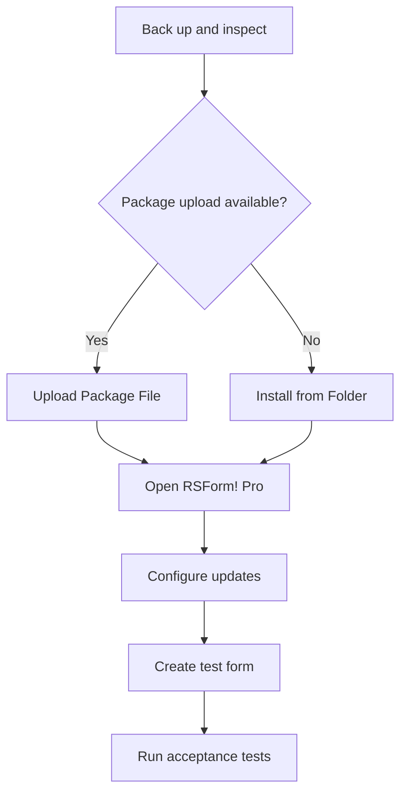
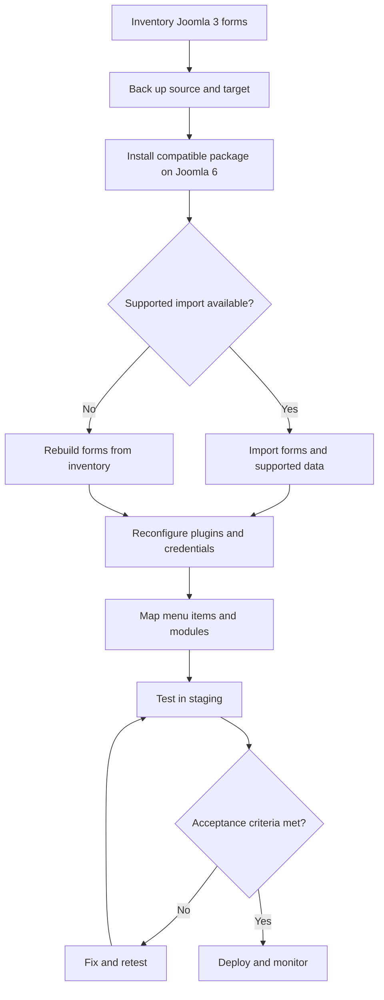

# RSForm! Pro — Joomla 6 Installation, Migration, Configuration, and Verification Guide

> A practical guide for installing RSForm! Pro on Joomla 6, migrating forms from Joomla 3, configuring production-ready forms, and validating the result.

<a id="document-overview"></a>
## Document overview

- [1. Scope and key facts](#scope-and-key-facts)
- [2. Official resources](#official-resources)
- [3. Pre-installation checklist](#pre-installation-checklist)
- [4. Installation](#installation)
- [5. Joomla 3 to Joomla 6 migration](#migration)
- [6. Core concepts](#core-concepts)
- [7. Form configuration](#form-configuration)
- [8. Email notifications](#email-notifications)
- [9. Validation, anti-spam, and security](#security)
- [10. File uploads](#file-uploads)
- [11. Conditional fields and calculations](#advanced-logic)
- [12. Multi-page and multilingual forms](#complex-forms)
- [13. Integrations and plugins](#integrations)
- [14. Verification and acceptance testing](#verification)
- [15. Troubleshooting](#troubleshooting)
- [16. Production checklist](#production-checklist)
- [17. Migration report template](#report-template)

<a id="scope-and-key-facts"></a>
## 1. Scope and key facts

| Field | Value |
|---|---|
| Extension | RSForm! Pro |
| Vendor | RSJoomla! |
| Main component | `com_rsform` |
| Recommended version | `3.4.9` or later |
| Joomla support | Joomla 3, 4, 5, and 6, subject to the vendor's current release notes |
| License | Commercial subscription |
| Modern free edition for Joomla 6 | Not identified |
| Recommended installation method | Upload Package File |
| Alternative method | Install from Folder |
| Discover installation | Use only after a complete manual deployment |
| Migration strategy | Reinstall a Joomla 6-compatible package, then migrate and validate form data |

RSForm! Pro is a form builder and submission-management extension. Typical use cases include contact forms, quotations, surveys, job applications, event registration, support requests, file uploads, multi-page forms, calculations, user registration, payments, and CRM or newsletter subscriptions.

> [!IMPORTANT]
> Confirm the latest compatible version in the vendor's release notes before production deployment. A version number in this guide is a baseline, not a substitute for a current compatibility check.

<a id="official-resources"></a>
## 2. Official resources

- [RSForm! Pro product page](https://www.rsjoomla.com/joomla-extensions/joomla-form.html)
- [RSForm! Pro subscriptions](https://www.rsjoomla.com/joomla-extensions/joomla-form/subscriptions.html)
- [RSForm! Pro documentation](https://www.rsjoomla.com/support/documentation/rsform-pro.html)
- [RSJoomla downloads](https://www.rsjoomla.com/downloads.html)
- [Joomla extension installation documentation](https://docs.joomla.org/Installing_an_extension)

Download the package only from the vendor account associated with an active subscription. Do not copy a package or update key from another organization without confirming its license terms.

<a id="pre-installation-checklist"></a>
## 3. Pre-installation checklist

- [ ] Confirm the target site is running Joomla 6.
- [ ] Confirm the server satisfies Joomla 6 requirements.
- [ ] Back up the files and database.
- [ ] Test the backup restoration procedure.
- [ ] Record the current RSForm! Pro version on the source site.
- [ ] Inventory forms, fields, emails, scripts, mappings, plugins, and menu items.
- [ ] Identify forms that store personal or sensitive data.
- [ ] Confirm the RSJoomla subscription and update credentials.
- [ ] Download a Joomla 6-compatible RSForm! Pro package.
- [ ] Prepare a staging environment.
- [ ] Define expected retention, privacy, and deletion rules.
- [ ] Ensure outbound email is configured and testable.

<a id="installation"></a>
## 4. Installation

### 4.1 Recommended method: Upload Package File

1. Sign in to the Joomla administrator.
2. Go to **System → Install → Extensions**.
3. Select **Upload Package File**.
4. Upload the RSForm! Pro ZIP package without extracting it.
5. Wait for Joomla to report a successful installation.
6. Open **Components → RSForm! Pro**.
7. Confirm the dashboard loads without PHP errors.
8. Review the extension update configuration and enter the required subscription credentials.

### 4.2 Alternative method: Install from Folder

Use this method when the upload limit prevents a normal package upload.

1. Extract the package into a temporary directory readable by Joomla.
2. Open **System → Install → Extensions → Install from Folder**.
3. Enter the absolute server path.
4. Select **Check and Install**.
5. Remove the temporary extracted files after installation.

### 4.3 Discover installation

Discover is intended for files that were manually deployed to their correct Joomla locations.

1. Deploy every component, module, plugin, language, and media file.
2. Open **System → Discover**.
3. Select **Discover**.
4. Select the detected RSForm! Pro extensions.
5. Select **Install**.
6. Verify database schema and extension state.

> [!WARNING]
> Discover does not repair an incomplete upload. Missing files can produce a partially installed extension.

### 4.4 Installation flow



<a id="migration"></a>
## 5. Joomla 3 to Joomla 6 migration

Do not copy the Joomla 3 extension files directly into Joomla 6. Install a compatible package on the Joomla 6 site first, then migrate supported data and configuration.

### 5.1 Inventory the Joomla 3 implementation

Capture at least:

| Area | Items to record |
|---|---|
| Forms | Name, ID, status, language, menu links |
| Fields | Type, name, label, validation, default value |
| Layout | Form layout, CSS classes, page breaks |
| Emails | Admin and user recipients, sender, reply-to, subject, body |
| Logic | Conditions, calculations, scripts, mappings |
| Data | Submission count, retention needs, sensitive fields |
| Add-ons | Payment, CAPTCHA, CRM, newsletter, PDF, registration plugins |
| Overrides | Template overrides and custom CSS/JavaScript |
| Automation | Webhooks, scheduled exports, external database writes |

### 5.2 Migration decision

| Method | Use when | Main risk |
|---|---|---|
| Vendor-supported backup/restore | Compatible source and target releases support it | Version-specific limitations |
| Database migration | Data volume is large and schema mapping is understood | Schema differences and broken relations |
| Manual rebuild | Forms are few or legacy configuration is unreliable | More implementation and testing time |
| Hybrid migration | Forms can be imported but integrations require rebuilding | Mixed ownership and missed dependencies |

### 5.3 Recommended migration flow



### 5.4 Data migration rules

- Preserve source IDs only when the supported migration method requires them.
- Do not import obsolete Joomla 3 extension rows blindly.
- Compare source and target database schemas before any SQL migration.
- Export a copy of submissions before transforming data.
- Verify timestamps, character encoding, file paths, and user references.
- Treat uploaded files separately from submission records.
- Recreate secrets, API tokens, payment credentials, and CAPTCHA keys.
- Verify privacy consent and retention settings against current requirements.

<a id="core-concepts"></a>
## 6. Core concepts

| Concept | Purpose |
|---|---|
| Form | Container for fields, layout, emails, scripts, and processing rules |
| Component | An input or display element inside a form |
| Submission | Stored data generated after a successful form submission |
| Directory | Optional frontend listing of selected submission data |
| Mapping | Writes submitted values to another database table |
| Condition | Shows, hides, requires, or processes fields based on rules |
| Placeholder | Token replaced by a field value or system value |
| Script | Custom PHP logic executed at supported processing stages |
| Plugin | Adds integrations such as payments, CAPTCHA, CRM, or registration |

Keep field names stable after launch because templates, emails, calculations, integrations, and reports may reference them.

<a id="form-configuration"></a>
## 7. Form configuration

### 7.1 Create a form

1. Open **Components → RSForm! Pro → Manage Forms**.
2. Create a blank form or use an appropriate starter layout.
3. Set a clear internal name and frontend title.
4. Add fields with unique, descriptive names.
5. Configure required fields and validation rules.
6. Add the submit button.
7. Configure the success message or redirect.
8. Save and preview the form.
9. Publish it through a menu item or supported content integration.

### 7.2 Recommended naming

Use predictable names such as:

```text
full_name
email
phone
company
request_type
message
privacy_consent
attachment
```

Avoid spaces, ambiguous abbreviations, and names tied to temporary visual positions.

### 7.3 Layout and accessibility

- Associate every input with a visible label.
- Provide concise help text for unfamiliar fields.
- Do not use placeholder text as the only label.
- Preserve keyboard navigation and visible focus states.
- Use semantic headings and fieldsets where appropriate.
- Place validation messages near the affected field.
- Test at mobile, tablet, and desktop widths.
- Avoid custom CSS that depends on unstable generated markup.

<a id="email-notifications"></a>
## 8. Email notifications

Configure separate messages for administrators and submitters when required.

### 8.1 Administrator email

- Use a verified site-domain address as **From**.
- Put the submitter's validated email in **Reply-To**.
- Use placeholders carefully in the subject and body.
- Include a submission identifier where possible.
- Avoid attaching uploaded files unless operationally required.

### 8.2 User confirmation

- Send only after a successful and valid submission.
- Do not expose internal notes, IP addresses, or administrator-only values.
- Explain what happens next and provide a contact channel.
- Avoid echoing sensitive fields such as passwords or identity documents.

### 8.3 Deliverability checks

- Confirm Joomla mail configuration.
- Test SPF, DKIM, and DMARC alignment for the sending domain.
- Test plain-text and HTML rendering.
- Check spam folders and provider logs.
- Verify that failed submissions do not trigger confirmation emails.

<a id="security"></a>
## 9. Validation, anti-spam, and security

### 9.1 Validation

Use server-side validation for every security-relevant rule. Browser validation improves usability but can be bypassed.

Validate:

- Required values.
- Email and URL formats.
- Numeric ranges.
- Allowed selections.
- Maximum lengths.
- File type and size.
- Cross-field rules.
- Business-specific constraints.

### 9.2 Anti-spam

Choose measures proportional to the site's risk:

- Joomla session and CSRF protection.
- CAPTCHA or a supported anti-spam plugin.
- Honeypot fields.
- Submission throttling.
- IP or pattern-based blocking where lawful.
- Email verification for high-risk workflows.
- Monitoring for unusual submission volume.

### 9.3 Custom PHP and scripts

> [!CAUTION]
> Custom scripts execute application logic and can create security, upgrade, and maintenance risks.

- Keep custom code minimal and documented.
- Never concatenate untrusted input into SQL.
- Escape output for its HTML, URL, or JavaScript context.
- Do not log passwords, tokens, or sensitive form content.
- Restrict configuration access through Joomla ACL.
- Retest scripts after every extension or PHP upgrade.

### 9.4 Privacy

- Collect only necessary data.
- Show a clear privacy notice.
- Use explicit consent when legally required.
- Define retention and deletion procedures.
- Limit backend access to authorized roles.
- Avoid exposing submission directories publicly.
- Confirm that exports and backups receive equivalent protection.

<a id="file-uploads"></a>
## 10. File uploads

- Allow only required extensions.
- Validate MIME type and content where possible.
- Set a conservative size limit.
- Use generated server-side filenames.
- Prevent script execution in upload directories.
- Store sensitive uploads outside the public web root when supported.
- Restrict download access.
- Add malware scanning for high-risk workflows.
- Define cleanup and retention rules.
- Test double extensions, uppercase extensions, and unexpected MIME types.

Never rely on the filename extension alone.

<a id="advanced-logic"></a>
## 11. Conditional fields and calculations

### 11.1 Conditional fields

Use conditions for progressive disclosure, such as showing company fields only for business enquiries.

Test:

- Every condition branch.
- Required fields that become hidden.
- Default values after a branch changes.
- Server-side processing of hidden fields.
- Email output for each branch.

### 11.2 Calculations

For pricing or scoring forms:

- Define numeric defaults.
- Specify rounding and currency rules.
- Recalculate on the server before using a value for payment or approval.
- Test empty, negative, minimum, maximum, and decimal inputs.
- Do not treat a browser-calculated total as authoritative.

<a id="complex-forms"></a>
## 12. Multi-page and multilingual forms

### 12.1 Multi-page forms

- Group fields by user task rather than arbitrary length.
- Show clear progress.
- Preserve values when users move backward.
- Validate each page and the final submission.
- Test session expiration and duplicate submission behavior.

### 12.2 Multilingual forms

- Translate labels, descriptions, validation messages, buttons, and emails.
- Verify menu item language assignments.
- Test placeholders in every language.
- Keep field names stable across translations.
- Confirm the success page uses the active language.

<a id="integrations"></a>
## 13. Integrations and plugins

Optional plugins can support payments, user registration, newsletter platforms, CRM systems, PDFs, CAPTCHA, and other workflows.

For every integration, record:

| Field | Example |
|---|---|
| Plugin name and version | Payment integration version |
| License owner | Organization account |
| Credentials location | Joomla configuration or secret store |
| Trigger | Successful submission |
| Data mapping | `email → subscriber_email` |
| Failure behavior | Retry, queue, or administrator alert |
| Test evidence | Transaction or API reference |
| Rollback | Disable plugin and restore previous configuration |

Confirm each plugin explicitly supports both the installed RSForm! Pro release and Joomla 6.

<a id="verification"></a>
## 14. Verification and acceptance testing

### 14.1 Smoke test

- [ ] RSForm! Pro opens in the administrator.
- [ ] No PHP warning or fatal error is shown.
- [ ] Forms can be created, edited, copied, and saved.
- [ ] A frontend form renders correctly.
- [ ] A valid submission succeeds.
- [ ] An invalid submission is rejected.
- [ ] The submission appears in the backend when storage is enabled.
- [ ] Administrator email is delivered.
- [ ] User confirmation email is delivered.
- [ ] The success message or redirect works.

### 14.2 Migration regression test

For every migrated production form:

- [ ] Compare field count and field names.
- [ ] Compare labels, descriptions, defaults, and required rules.
- [ ] Compare conditions and calculations.
- [ ] Compare email recipients, subjects, and bodies.
- [ ] Compare scripts and database mappings.
- [ ] Compare menu items, modules, and article embeds.
- [ ] Test all add-ons and external integrations.
- [ ] Verify historical submissions if they were migrated.
- [ ] Verify uploaded files and access permissions.
- [ ] Record screenshots and test evidence.

### 14.3 Negative and edge cases

Test:

- Missing required values.
- Invalid email and phone formats.
- Overlong text.
- Unsupported and oversized files.
- CAPTCHA failure.
- Duplicate submission.
- Expired session.
- Mobile layout.
- Keyboard-only navigation.
- Email delivery failure.
- External API timeout.
- Payment cancellation and failure, when applicable.

<a id="troubleshooting"></a>
## 15. Troubleshooting

| Symptom | Likely cause | Recommended action |
|---|---|---|
| Package will not upload | PHP upload or post-size limit | Use Install from Folder or adjust server limits |
| Component is missing | Partial installation | Reinstall the complete package and check extension records |
| Form does not appear | Menu, module, language, or access configuration | Verify publication, assignment, language, and ACL |
| Submission is not stored | Storage disabled, validation failure, or script error | Review form properties and logs |
| Email is not delivered | Joomla mail or sender-domain issue | Test global mail settings and provider logs |
| Conditional field is wrong | Rule order or mismatched field value | Inspect exact stored values and test every branch |
| Upload fails | Size, extension, MIME, permission, or server limit | Review both RSForm and PHP/web-server limits |
| Imported form is incomplete | Unsupported import or missing add-on | Reinstall dependencies and rebuild unsupported settings |
| Update is unavailable | Missing or invalid subscription credentials | Verify the vendor account and update key |
| Frontend styling is broken | Framework mismatch or template CSS conflict | Inspect rendered markup and test with minimal custom CSS |

Enable detailed error reporting only in a controlled staging environment, then restore production-safe settings.

<a id="production-checklist"></a>
## 16. Production checklist

- [ ] Current compatible RSForm! Pro package installed.
- [ ] Subscription and update configuration verified.
- [ ] Full backup created and restoration tested.
- [ ] All forms reviewed by an owner.
- [ ] Server-side validation confirmed.
- [ ] Anti-spam protection tested.
- [ ] Email sender and reply-to configuration validated.
- [ ] Upload restrictions and storage permissions reviewed.
- [ ] Privacy notice, consent, retention, and deletion rules approved.
- [ ] Joomla ACL limits administrative access.
- [ ] Payment and external integrations tested with production-safe procedures.
- [ ] Mobile, accessibility, and browser tests completed.
- [ ] Logs and monitoring prepared.
- [ ] Rollback plan documented.
- [ ] Post-deployment smoke test assigned.

<a id="report-template"></a>
## 17. Migration report template

```markdown
# RSForm! Pro Migration Report

## Environment
- Source Joomla:
- Source RSForm! Pro:
- Target Joomla:
- Target RSForm! Pro:
- Migration date:
- Owner:

## Inventory
| Form | Source ID | Fields | Submissions | Add-ons | Sensitive data | Decision |
|---|---:|---:|---:|---|---|---|

## Migration result
| Form | Method | Target ID | Result | Evidence | Notes |
|---|---|---:|---|---|---|

## Integrations
| Integration | Version | Credentials restored | Test result | Evidence |
|---|---|---|---|---|

## Defects
| ID | Severity | Description | Owner | Status |
|---|---|---|---|---|

## Approval
- Technical approval:
- Business approval:
- Privacy/security approval:
- Production deployment:
```

---

[Back to document overview](#document-overview)
