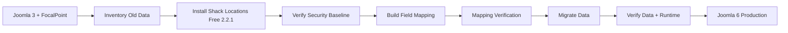
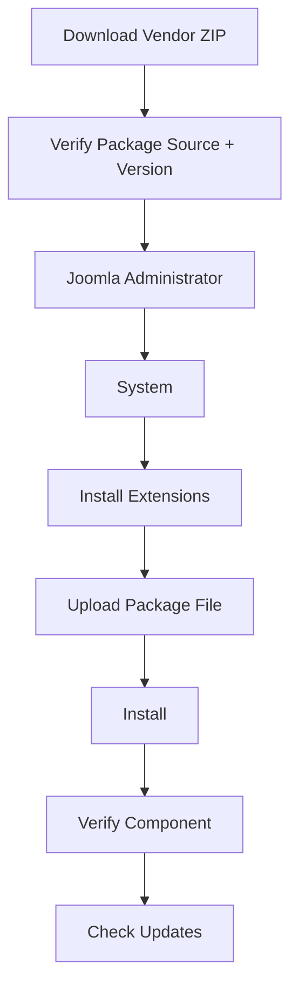
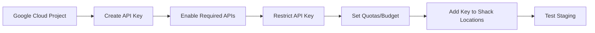
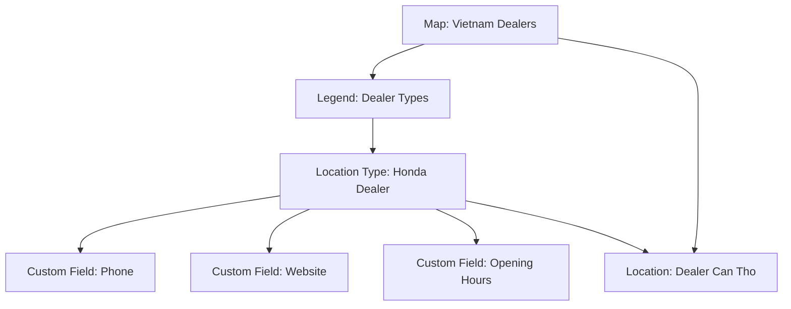
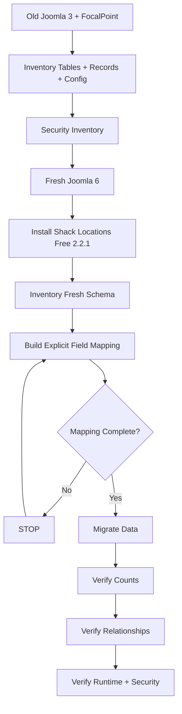
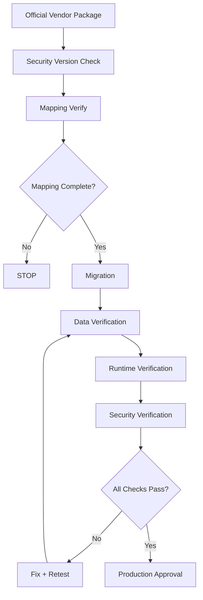

# Shack Locations Free 2.2.1 — Joomla 6 Installation, Security, Compatibility & Backend Guide

> **Edition:** Free  
> **Version:** 2.2.1  
> **Developer:** Joomlashack  
> **Extension type:** Joomla component  
> **License:** GNU GPL  
> **Joomla target:** Joomla 6.x  
> **Effective Joomla 6 PHP minimum:** PHP 8.3  
> **Recommended target runtime:** PHP 8.4  
> **Migration recommendation:** ✅ Install fresh and migrate data; do not clone the old FocalPoint source into Joomla 6  
> **Security status reviewed:** 2026-08-10

> [!IMPORTANT]
> Shack Locations is the maintained successor to **FocalPoint**. Joomlashack states that Shack Locations is based on FocalPoint and that security issues left in the old FocalPoint project were fixed when Shack Locations was taken over.

---

<a id="top"></a>

## Table of Contents

- [1. Quick Verdict](#1-quick-verdict)
- [2. What Is Shack Locations?](#2-what-is-shack-locations)
- [3. Shack Locations Free Features](#3-shack-locations-free-features)
- [4. Free vs Pro](#4-free-vs-pro)
- [5. Download Shack Locations Free](#5-download-shack-locations-free)
- [6. Joomla 6 and PHP 8.4 Compatibility](#6-joomla-6-and-php-84-compatibility)
- [7. Security Assessment and Unsafe Versions](#7-security-assessment-and-unsafe-versions)
- [8. Technical Requirements](#8-technical-requirements)
- [9. Install on Joomla 6](#9-install-on-joomla-6)
- [10. Google Maps API Configuration and Security](#10-google-maps-api-configuration-and-security)
- [11. Backend Administration Guide](#11-backend-administration-guide)
- [12. Create Your First Map Directory](#12-create-your-first-map-directory)
- [13. Custom Fields, Search and Menu Integration](#13-custom-fields-search-and-menu-integration)
- [14. FocalPoint Migration Notes](#14-focalpoint-migration-notes)
- [15. Verification Checklist](#15-verification-checklist)
- [16. Troubleshooting](#16-troubleshooting)
- [17. Official and Security Sources](#17-official-and-security-sources)
- [18. Final Summary](#18-final-summary)

---

## 1. Quick Verdict

**Shack Locations Free 2.2.1 is the recommended migration target for a legacy FocalPoint installation when the required functionality is available in the Free edition.**

As of **August 10, 2026**:

| Item | Assessment |
|---|---|
| Shack Locations Free 2.2.1 | ✅ Current verified Free release |
| Joomla 6 support | ✅ Vendor/JED-supported |
| PHP 8.4 target | ✅ Appropriate for Joomla 6 |
| Publicly known Shack Locations 2.2.1 CVE | 🟢 None identified in the reviewed public sources |
| Legacy FocalPoint 1.2.3 | 🔴 **Confirmed vulnerable — do not use** |
| Old FocalPoint source on Joomla 6 | 🔴 **Do not use** |
| Fresh install + controlled data migration | ✅ Recommended |

> [!CAUTION]
> **“No known public CVE found” does not mean “guaranteed secure.”** It only means that no confirmed public vulnerability for Shack Locations 2.2.1 was identified in the sources reviewed for this guide as of the review date.

### Recommended migration direction



[Back to top](#top)

---

## 2. What Is Shack Locations?

Shack Locations is a Joomla extension for building map-based location directories.

Typical use cases include:

- Dealer or branch directories.
- Store locators.
- Office locations.
- Restaurants and hotels.
- Hospitals and emergency services.
- Tourist attractions.
- Museums and public facilities.
- Business directories.

It supports structured location records instead of only embedding a single Google Map.

### Main data relationship


Joomlashack's public repository states that Shack Locations is a fork of FocalPoint created with the original author's approval and maintained by Joomlashack.

[Back to top](#top)

---

## 3. Shack Locations Free Features

The Free edition contains the main Shack Locations component.

### 3.1 Core Free features

| Feature | Free | Purpose |
|---|:---:|---|
| Multiple locations on one map | ✅ | Display many markers on a Google Map. |
| Maps | ✅ | Create independent map directories. |
| Locations | ✅ | Store geographic location records. |
| Legends | ✅ | Group location types. |
| Location Types | ✅ | Categorize locations and control marker/field behavior. |
| Custom markers | ✅ | Visually distinguish location types. |
| Location list view | ✅ | Show locations as a list. |
| Location filtering | ✅ | Filter displayed location types. |
| Map search | ✅ | Search around an address or location. |
| Latitude / longitude | ✅ | Store geographic coordinates. |
| Custom fields | ✅ | Add structured location-specific data. |
| Custom tabs/content | ✅ | Add additional location information. |
| Location metadata | ✅ | Configure metadata for location pages. |
| SEF-friendly location URLs | ✅ | Improve crawlable location URLs. |
| Responsive map output | ✅ | Work across screen sizes. |
| Joomla template overrides | ✅ | Customize frontend rendering. |
| Joomla menu integration | ✅ | Publish a map through menu items. |

### 3.2 Example location schema

```text
Location Type: Dealer

Custom Fields:
- Dealer Code
- Telephone
- Email
- Website
- Opening Hours
- Service Center
- Sales Center
```

[Back to top](#top)

---

## 4. Free vs Pro

Joomlashack documents the Free edition as the main component and the Pro package as the same component plus additional modules/plugins/features.

| Capability | Free | Pro |
|---|:---:|:---:|
| Main Shack Locations component | ✅ | ✅ |
| Maps / locations / legends / types | ✅ | ✅ |
| Custom fields | ✅ | ✅ |
| Standard map/list/search features | ✅ | ✅ |
| Marker clustering | ❌ | ✅ |
| Fit markers into bounds | ❌ | ✅ |
| Additional map styles | ❌ | ✅ |
| Full-screen map view | ❌ | ✅ |
| Detect/display visitor location | ❌ | ✅ |
| Location Map module | ❌ | ✅ |
| Joomla search plugin for locations | ❌ | ✅ |

### Recommendation

Start with **Shack Locations Free** unless the old FocalPoint installation depends on Pro-only features.

Before buying Pro, inventory the old site's modules and plugins so that the edition decision is based on actual usage.

[Back to top](#top)

---

## 5. Download Shack Locations Free

### 5.1 Official product/download page

Use the official Joomlashack page:

<https://www.joomlashack.com/joomla-extensions/shack-locations/>

The Free download flow is provided under the **Get your download** area and may require:

1. Entering an email address.
2. Accepting the Terms and Conditions.
3. Completing the download prompt shown by Joomlashack.
4. Downloading the Joomla installation package.

> [!NOTE]
> Do not document or reuse a temporary generated ZIP URL. Use the stable official product/download page above.

### 5.2 Joomla Extensions Directory

<https://extensions.joomla.org/extension/shack-locations/>

The JED listing identifies Shack Locations as a Free download and lists Joomla 3, 4, 5 and 6 compatibility.

### 5.3 Public source repository

<https://github.com/joomlashack/ShackLocations>

The current public component manifest identifies:

```text
Version:      2.2.1
CreationDate: April 23 2026
Variant:      FREE
```

### 5.4 Download safety checklist

- [ ] Download only from Joomlashack, JED, or another vendor-controlled official source.
- [ ] Confirm the package version before installation.
- [ ] Prefer **2.2.1 or a newer approved supported release**.
- [ ] Do not download “nulled”, repacked or password-protected packages from third-party extension sites.
- [ ] Do not install an old FocalPoint 1.x ZIP on Joomla 6.
- [ ] Store the original vendor ZIP in the migration evidence/archive.
- [ ] Record package version and checksum where your deployment process supports it.

[Back to top](#top)

---

## 6. Joomla 6 and PHP 8.4 Compatibility

### 6.1 Joomla 6 support

Joomlashack provides Shack Locations documentation for Joomla 6, and the Joomla Extensions Directory lists Shack Locations as Joomla 6 compatible.

```text
Shack Locations Free 2.2.1
        +
Joomla 6.x
        =
Supported target combination
```

### 6.2 PHP requirement

Joomlashack's Shack Locations technical-requirements page currently lists:

| Shack Locations requirement | Value |
|---|---:|
| PHP minimum | 8.1.0 |
| PHP recommended | 8.3 |

Joomla 6 has a stricter runtime requirement:

| Joomla 6 runtime | Value |
|---|---:|
| PHP minimum | 8.3.0 |
| PHP recommended | 8.4 |

Therefore, for this project:

```text
Effective PHP minimum
= max(Shack Locations minimum, Joomla 6 minimum)
= max(PHP 8.1, PHP 8.3)
= PHP 8.3
```

**Recommended target: PHP 8.4.**

### 6.3 Compatibility confidence

| Layer | Assessment | Confidence |
|---|---|---:|
| Joomla 6 extension support | ✅ Compatible | High |
| PHP 8.3 | ✅ Effective minimum | High |
| PHP 8.4 | ✅ Recommended Joomla 6 target | High |
| Legacy FocalPoint custom overrides | ⚠️ Must test | Medium |
| Custom PHP/JavaScript integrations | ⚠️ Must review separately | Medium |
| Migrated database modifications | ⚠️ Must validate | Medium |

> [!WARNING]
> Extension compatibility does not prove that old **custom FocalPoint overrides, custom JavaScript, custom PHP code or hand-modified database structures** are PHP 8.4 compatible.

[Back to top](#top)

---

## 7. Security Assessment and Unsafe Versions

<a id="security"></a>

### 7.1 Security conclusion as of 2026-08-10

**Recommended security position:**

```text
Legacy FocalPoint source
        ↓
DO NOT DEPLOY
        ↓
Fresh Shack Locations Free 2.2.1
        ↓
Latest supported Joomla 6 security release
        ↓
PHP 8.4 supported patch release
        ↓
Restricted Google Maps API key
        ↓
Staging security/runtime verification
```

The important distinction is:

- **FocalPoint** is the legacy project.
- **Shack Locations** is the maintained successor.
- A vulnerability in FocalPoint must not automatically be claimed to affect Shack Locations 2.2.1 unless an advisory says so.

### 7.2 Confirmed vulnerability — FocalPoint 1.2.3

**CVE-2017-20263** affects **FocalPoint Pro/Free 1.2.3**.

| Field | Value |
|---|---|
| CVE | **CVE-2017-20263** |
| Product | FocalPoint Pro / Free |
| Confirmed affected version | **1.2.3** |
| Vulnerability | SQL Injection |
| CWE | CWE-89 |
| Authentication required | **No** |
| Attack vector | Remote HTTP request |
| CNA CVSS v4 severity | **HIGH (8.8)** |
| Production recommendation | 🔴 **Do not use** |

The published advisory describes an unauthenticated SQL injection through the FocalPoint location `id` parameter. An attacker can inject SQL into requests handled by `com_focalpoint` and potentially extract sensitive database information.

**Security rule:**

```text
FocalPoint 1.2.3
= Confirmed vulnerable
= DO NOT deploy
= DO NOT clone into Joomla 6
```

Official vulnerability record:

<https://nvd.nist.gov/vuln/detail/CVE-2017-20263>

### 7.3 What about other FocalPoint 1.x versions?

Do **not** incorrectly claim that every FocalPoint 1.x release has CVE-2017-20263. The public CVE record specifically identifies **1.2.3** as affected.

However, for this migration project, all legacy FocalPoint 1.x packages should still be treated as **unsupported/high-risk legacy software** because:

- The original FocalPoint project is no longer the maintained target.
- It was designed for old Joomla/PHP generations.
- Joomlashack stated when launching Shack Locations that it fixed multiple security issues and bugs that had remained in FocalPoint.
- Old source may contain deprecated Joomla APIs and outdated dependencies.
- Joomla 3 itself is not the target production platform for this project.

Therefore:

```text
FocalPoint 1.2.3
→ CONFIRMED VULNERABLE

Other FocalPoint 1.x
→ NOT ALL CVE-CONFIRMED
→ BUT DO NOT DEPLOY ON JOOMLA 6
→ MIGRATION SOURCE DATA ONLY
```

### 7.4 Shack Locations 2.2.1 security status

During the security review for this guide, no public CVE or Joomla security advisory specifically confirming a vulnerability in **Shack Locations Free 2.2.1** was identified.

This means:

```text
Known public vulnerability found for Shack Locations 2.2.1: NO
Guaranteed vulnerability-free: NO
Recommended current migration target: YES
```

> [!IMPORTANT]
> Absence of a public advisory is not proof of complete security. Production approval still requires keeping the extension updated, running the latest supported Joomla security release, restricting API credentials and testing the site-specific integration.

### 7.5 Version safety classification

| Version / family | Security classification | Production recommendation |
|---|---|---|
| **FocalPoint 1.2.3** | 🔴 Confirmed vulnerable — CVE-2017-20263 | **DO NOT USE** |
| Other FocalPoint 1.x | 🔴 Legacy / unsupported / security status incomplete | **DO NOT USE on Joomla 6** |
| Early Shack Locations 1.x | 🟠 Old and outdated | Upgrade; do not choose for a new Joomla 6 deployment |
| Older Shack Locations 2.x below current approved release | 🟡 Not automatically vulnerable, but outdated | Upgrade unless compatibility testing requires a temporary staging version |
| **Shack Locations Free 2.2.1** | 🟢 No confirmed public vulnerability identified in reviewed sources | **Recommended current target**, with staging verification |
| Newer vendor security/maintenance release | 🟢 Preferred after validation | Upgrade after release review/testing |

### 7.6 Do not call an old version “vulnerable” without evidence

Use these terms consistently:

| Term | Meaning |
|---|---|
| **Confirmed vulnerable** | A CVE/vendor/security advisory identifies the version as affected. |
| **Outdated** | A newer supported release exists. This alone does not prove a vulnerability. |
| **Unsupported / legacy** | The version is no longer a reasonable production target. |
| **No known public vulnerability found** | No confirmed advisory was identified during the review; this is not a security guarantee. |

This distinction is important for migration reports because it prevents unsupported claims.

### 7.7 Joomla core security matters too

Shack Locations runs inside Joomla, so extension security alone is not enough.

As of **August 10, 2026**, Joomla's official download site identifies **Joomla 6.1.2** as the latest Joomla 6 release. It was released on **July 7, 2026** as a **Security & Bugfix Release** and fixed multiple Joomla core security issues.

For example, **CVE-2026-48956** identifies an incorrect access-control issue affecting Joomla **6.0.0 through 6.1.1** and fixed in the newer security release.

Therefore:

```text
Shack Locations 2.2.1
+ vulnerable/outdated Joomla core
= NOT an acceptable production security baseline
```

**Current project rule:**

- Do not build a new production deployment on Joomla 6.0.x or 6.1.0/6.1.1.
- Use the latest supported Joomla 6 security release after staging validation.
- At the time of this review, that release is **Joomla 6.1.2**.

> [!NOTE]
> Joomla 6.1.2 has a documented article-parameter regression with an official hotfix. That is a functional regression, not a reason to stay on an older Joomla version that misses security fixes.

### 7.8 PHP security baseline

For Joomla 6:

- Use PHP **8.3 minimum**.
- Prefer PHP **8.4** for this project.
- Use a currently supported PHP 8.4 patch release from your distribution/container provider.
- Do not pin an old PHP patch indefinitely.
- Rebuild/update Docker images when security updates are released.

### 7.9 Google Maps API key security

The Google Maps key is a credential and must not be treated as an unrestricted generic key.

Required controls:

- Restrict browser keys by HTTP referrer/domain.
- Enable only APIs actually required by Shack Locations.
- Separate staging and production keys/projects where practical.
- Configure usage quotas/budgets.
- Monitor unexpected API usage.
- Rotate a key if it is exposed in an unsafe context.

### 7.10 Security checklist before production

#### Package provenance

- [ ] Package downloaded from Joomlashack/JED/vendor-controlled source.
- [ ] No “nulled” or repacked package is used.
- [ ] Installed Shack Locations version is recorded.
- [ ] Latest vendor changelog has been reviewed.

#### Known vulnerabilities

- [ ] No FocalPoint 1.2.3 code is deployed.
- [ ] CVE-2017-20263 is recorded in the legacy migration risk inventory.
- [ ] NVD/Joomla/vendor advisories have been checked before go-live.
- [ ] “No known CVE” is not treated as a 100% security guarantee.

#### Joomla/PHP

- [ ] Joomla is on the latest approved security release.
- [ ] PHP is on a supported 8.4 patch release.
- [ ] Joomla Update System shows no pending security-critical update.
- [ ] PHP/Joomla error logs contain no extension failures.

#### Credentials

- [ ] Google Maps API key is restricted.
- [ ] Production and staging credentials are separated where possible.
- [ ] No secret key is committed to Git.

#### Runtime tests

- [ ] Anonymous frontend requests cannot modify administrator data.
- [ ] Backend CRUD requires the expected Joomla permissions.
- [ ] Location/map input is tested with unexpected characters and malformed values.
- [ ] No SQL/PHP error details are exposed to anonymous users.
- [ ] Browser console shows no credential or sensitive-data leakage.

[Back to top](#top)

---

## 8. Technical Requirements

### 8.1 Recommended Joomla 6 target

| Requirement | Minimum for this project | Recommended |
|---|---:|---:|
| Shack Locations Free | 2.2.1 | Latest approved maintenance/security release |
| Joomla | 6.x supported release | Latest Joomla 6 security release |
| PHP | 8.3.0 | **8.4 supported patch release** |
| MySQL | 8.0.13 | Current supported version compatible with Joomla |
| Apache | 2.4 | Current supported 2.4 release |
| Nginx | Vendor/Joomla requirement | Current supported release |
| HTTPS | Required for production baseline | Required |

### 8.2 PHP modules

Verify the Joomla runtime provides required modules such as:

- `json`
- `simplexml`
- `dom`
- `zlib`
- `gd`
- `mysqlnd` or `pdo_mysql`
- `mbstring` recommended

### 8.3 Environment check

From Joomla Administrator:

```text
System
→ System Information
```

Verify:

- Joomla version.
- PHP version.
- Database version.
- Web server.
- Loaded PHP extensions.

[Back to top](#top)

---

## 9. Install on Joomla 6

### 9.1 Standard installation flow



### 9.2 Installation steps

1. Download Shack Locations Free from the official vendor page.
2. Log in to Joomla Administrator.
3. Navigate to:

```text
System → Install → Extensions
```

4. Open **Upload Package File**.
5. Select the vendor ZIP.
6. Complete installation.
7. Open:

```text
Components → Shack Locations Free
```

8. Confirm these sections are available:

```text
Maps
Legends
Location Types
Locations
```

### 9.3 Post-installation checks

- [ ] Component opens without HTTP 500.
- [ ] No PHP fatal error occurs.
- [ ] No blocking PHP 8.4 incompatibility is logged.
- [ ] Maps loads.
- [ ] Legends loads.
- [ ] Location Types loads.
- [ ] Locations loads.
- [ ] Options can be saved.
- [ ] Joomla extension update information is available where applicable.

[Back to top](#top)

---

## 10. Google Maps API Configuration and Security

Shack Locations integrates with Google Maps.

Joomlashack documentation references APIs including:

- **Maps JavaScript API**
- **Geocoding API**
- **Directions API**

### 10.1 Configuration flow



### 10.2 Backend configuration

Navigate to:

```text
Components
→ Shack Locations Free
→ Maps
→ Options
```

Set the Google Maps API key and save.

### 10.3 Production security requirements

- Restrict the API key to approved website domains/referrers.
- Enable only required Google APIs.
- Use separate staging and production credentials where practical.
- Do not commit secrets or unrestricted server keys to Git.
- Monitor usage and billing alerts.

[Back to top](#top)

---

## 11. Backend Administration Guide

Shack Locations is primarily managed from:

```text
Joomla Administrator
→ Components
→ Shack Locations Free
```

### 11.1 Backend sections

| Section | Purpose |
|---|---|
| **Maps** | Define map directories and map-level behavior. |
| **Legends** | Group related location types. |
| **Location Types** | Define categories/types, markers and custom-field schemas. |
| **Locations** | Create and maintain geographic records. |
| **Options** | Configure global settings such as Google Maps API key. |

### 11.2 Recommended configuration order

```text
1. Global Options / API Key
2. Map
3. Legend
4. Location Type
5. Custom Fields
6. Location
7. Menu Item
8. Frontend Verification
```

This order keeps parent entities available before dependent location records are created.

[Back to top](#top)

---

## 12. Create Your First Map Directory

### Step 1 — Configure the API key

```text
Components
→ Shack Locations Free
→ Maps
→ Options
```

Add the restricted Google Maps API key and save.

### Step 2 — Create a Map

```text
Components
→ Shack Locations Free
→ Maps
→ New
```

Configure at minimum:

- Title.
- Description if required.
- Latitude.
- Longitude.

### Step 3 — Create a Legend

```text
Components
→ Shack Locations Free
→ Legends
→ New
```

Configure the title and optional subtitle.

### Step 4 — Create a Location Type

```text
Components
→ Shack Locations Free
→ Location Types
→ New
```

Configure:

- Title.
- Legend assignment.
- Marker.
- Custom fields.

Example:

```text
Title: Honda Dealer
Legend: Dealers
Marker: dealer-pin.png
```

### Step 5 — Create a Location

```text
Components
→ Shack Locations Free
→ Locations
→ New
```

Configure:

- Location title.
- Parent Map.
- Primary Location Type.
- Latitude.
- Longitude.
- Optional image/description/custom fields/metadata.

### Example relationship



[Back to top](#top)

---

## 13. Custom Fields, Search and Menu Integration

### 13.1 Custom Fields

Navigate to:

```text
Components
→ Shack Locations Free
→ Location Types
→ <Location Type>
→ Custom Fields
```

Common field types include:

- Link.
- Email.
- Image.
- Select List.
- Multi Select.

Example:

| Field | Example |
|---|---|
| Dealer Website | `https://example.com` |
| Contact Email | `dealer@example.com` |
| Telephone | Business phone number |
| Main Image | Dealer image |
| Dealer Category | Sales / Service / Parts |
| Opening Hours | Business hours |

### 13.2 Search and filtering

Navigate to the map options and enable map search when required.

Verify:

- [ ] Search box appears.
- [ ] Address/postal-code search works.
- [ ] Radius behavior matches configuration.
- [ ] Location-type filters work.
- [ ] List and map views return consistent results.

### 13.3 Joomla Menu Integration

To publish a map:

1. Open Joomla **Menus**.
2. Select the required menu.
3. Click **New**.
4. Select the Shack Locations menu-item type.
5. Choose **Single Map**.
6. Select the required map.
7. Configure title, alias, access and publication status.
8. Save.
9. Verify the frontend.

[Back to top](#top)

---

## 14. FocalPoint Migration Notes

A Joomla 3 → Joomla 6 migration should treat FocalPoint → Shack Locations as a **controlled data migration**, not a source-code copy.

### 14.1 Do not clone legacy source

Avoid:

```text
Joomla 3 /components/com_focalpoint
            ↓ copy
Joomla 6 /components/com_focalpoint
```

This can carry:

- Legacy security issues.
- Old Joomla APIs.
- Deprecated PHP behavior.
- Outdated JavaScript.
- Obsolete dependencies.
- Site-specific overrides that were never validated for Joomla 6.

### 14.2 Preferred migration flow



### 14.3 Minimum migration inventory

Capture:

- [ ] All FocalPoint/Shack Locations tables.
- [ ] Column names and data types.
- [ ] Primary keys.
- [ ] Indexes.
- [ ] Row counts.
- [ ] Maps.
- [ ] Legends.
- [ ] Location Types.
- [ ] Locations.
- [ ] Custom fields.
- [ ] Location-to-type relationships.
- [ ] Configuration values.
- [ ] Joomla menu items pointing to FocalPoint.
- [ ] Related modules/plugins.
- [ ] Marker images and other media.
- [ ] Template overrides.
- [ ] Custom PHP/JavaScript integrations.
- [ ] Legacy version/security evidence.

### 14.4 Security migration rule

```text
Legacy FocalPoint code = DO NOT MIGRATE
Legacy FocalPoint data = INVENTORY + MAP + VALIDATE + MIGRATE
```

This is particularly important because the legacy FocalPoint line has a confirmed historical SQL injection vulnerability.

[Back to top](#top)

---

## 15. Verification Checklist

### 15.1 Environment

- [ ] Joomla is on the latest approved Joomla 6 security release.
- [ ] PHP 8.4 supported patch release is active.
- [ ] Database satisfies Joomla requirements.
- [ ] HTTPS works.
- [ ] Required PHP extensions are loaded.

### 15.2 Extension installation

- [ ] Shack Locations Free is installed from an official package.
- [ ] Version is 2.2.1 or an approved newer release.
- [ ] No old FocalPoint package is deployed.
- [ ] Component opens without errors.

### 15.3 Backend CRUD

- [ ] Create/edit/delete a test Map.
- [ ] Create/edit/delete a test Legend.
- [ ] Create/edit/delete a test Location Type.
- [ ] Create/edit/delete a test Location.
- [ ] Custom fields save correctly.
- [ ] Relationships save correctly.
- [ ] Options save correctly.

### 15.4 Google Maps

- [ ] Maps JavaScript API works.
- [ ] Geocoding works.
- [ ] Directions work if required.
- [ ] API key is restricted.
- [ ] Billing/quota configuration is valid.

### 15.5 Frontend

- [ ] Map loads.
- [ ] Expected markers appear.
- [ ] Marker icons are correct.
- [ ] Infobox content is correct.
- [ ] Location pages work.
- [ ] Custom fields render.
- [ ] Search works.
- [ ] Filters work.
- [ ] List view works.
- [ ] Menu links work.
- [ ] Mobile layout works.

### 15.6 PHP 8.4 runtime

- [ ] No fatal errors.
- [ ] No unhandled exceptions.
- [ ] No warnings affecting output.
- [ ] No deprecation messages affecting functionality.
- [ ] Joomla logs contain no Shack Locations failures.
- [ ] Browser console has no blocking JavaScript errors.

### 15.7 Migration verification

For every migrated entity:

```text
Source Count
    ↓
Mapping Validation
    ↓
Target Count
    ↓
Relationship Validation
    ↓
Functional Validation
    ↓
Security/Runtime Validation
```

**Never approve migration based only on row-count equality.**

[Back to top](#top)

---

## 16. Troubleshooting

### Map does not render

Check:

1. API key exists.
2. Required Google APIs are enabled.
3. API restrictions allow the current domain.
4. Billing/project configuration is valid.
5. Browser console contains no Google Maps errors.

### Backend works but frontend is empty

Check:

- Location is published.
- Correct Map is assigned.
- Latitude/longitude are valid.
- Location Type is valid.
- Menu item points to the correct Map.
- CSP/optimization plugins are not blocking Google Maps JavaScript.

### Migrated markers are missing

Check:

- Location-to-map relationship.
- Location-to-type relationship.
- Marker/media files.
- Database IDs after migration.
- Source → target ID mapping.

### PHP 8.4 errors

Use this order:

```text
1. Confirm latest approved Shack Locations version
2. Reproduce on staging
3. Capture exact stack trace
4. Determine extension vs custom override
5. Check vendor changelog/advisory
6. Patch only after root cause is confirmed
7. Retest full workflow
```

### Suspected security issue

Do not immediately modify vendor code in production.

1. Reproduce safely on staging.
2. Record the exact version.
3. Capture the request/stack trace/log evidence.
4. Check NVD, Joomla Security Centre and Joomlashack releases.
5. Upgrade to an available fixed release when one exists.
6. Rotate exposed credentials if required.
7. Retest before production deployment.

[Back to top](#top)

---

## 17. Official and Security Sources

### Joomlashack

- Shack Locations product / Free download  
  <https://www.joomlashack.com/joomla-extensions/shack-locations/>

- Shack Locations documentation  
  <https://www.joomlashack.com/docs/shack-locations/>

- Technical requirements  
  <https://www.joomlashack.com/docs/shack-locations/technical-requirements/>

- Getting started  
  <https://www.joomlashack.com/docs/shack-locations/getting-started-with-shack-locations/>

- Free vs Pro  
  <https://www.joomlashack.com/docs/shack-locations/free-vs-pro/>

- Free changelog  
  <https://www.joomlashack.com/changelog/shack-locations-free/>

- Google Maps API setup  
  <https://www.joomlashack.com/docs/shack-locations/getting-google-maps-javascript-api-key/>

- FocalPoint takeover / Shack Locations launch and legacy security-fix statement  
  <https://www.joomlashack.com/blog/joomlashack/shack-locations-launch/>

### Joomla

- Joomla Extensions Directory — Shack Locations  
  <https://extensions.joomla.org/extension/shack-locations/>

- Joomla 6 technical requirements  
  <https://manual.joomla.org/docs/next/get-started/technical-requirements/>

- Latest Joomla release  
  <https://downloads.joomla.org/latest>

- Joomla 6.1.2 Security & Bugfix Release  
  <https://www.joomla.org/announcements/release-news/joomla-6-1-2-5-4-7-security-bugfix-release.html>

- Joomla 6.1.2 known issue / official hotfix information  
  <https://manual.joomla.org/updates/60-61/known-issues/6.1.2/>

### Vulnerability databases

- **CVE-2017-20263 — FocalPoint Pro/Free 1.2.3 SQL Injection**  
  <https://nvd.nist.gov/vuln/detail/CVE-2017-20263>

- **CVE-2026-48956 — Joomla core access-control issue affecting Joomla 6.0.0–6.1.1**  
  <https://nvd.nist.gov/vuln/detail/CVE-2026-48956>

### Source code

- Joomlashack Shack Locations GitHub repository  
  <https://github.com/joomlashack/ShackLocations>

- Version 2.2.1 component manifest  
  <https://github.com/joomlashack/ShackLocations/blob/main/src/focalpoint.xml>

[Back to top](#top)

---

## 18. Final Summary

| Question | Answer |
|---|---|
| Is Shack Locations Free available? | ✅ Yes |
| Current verified Free version | **2.2.1** |
| Joomla 6 supported? | ✅ Yes |
| PHP 8.4 appropriate? | ✅ Yes — recommended target for Joomla 6 |
| Public CVE confirmed for Shack Locations 2.2.1? | 🟢 None identified in the reviewed public sources as of 2026-08-10 |
| Is that a guarantee of zero vulnerabilities? | ❌ No |
| Confirmed unsafe legacy version? | 🔴 **FocalPoint Pro/Free 1.2.3 — CVE-2017-20263 SQL Injection** |
| Should other FocalPoint 1.x source be deployed on Joomla 6? | ❌ No — treat as legacy migration source only |
| Should older Shack Locations releases be chosen for a new deployment? | ❌ Prefer the latest approved supported release |
| Joomla security baseline at review date | **Joomla 6.1.2**, released July 7, 2026 as a Security & Bugfix Release |
| Google Maps key unrestricted in production? | ❌ No |
| Clone old FocalPoint code into Joomla 6? | ❌ No |
| Recommended migration | Fresh install → security baseline → mapping verify → migrate data → verify data/runtime/security |

> **Recommended target at the time of this review:**  
> `Latest approved Joomla 6 security release + PHP 8.4 supported patch + Shack Locations Free 2.2.1 (or newer approved release)`

### Final production gate



[Back to top](#top)
