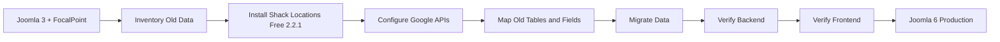
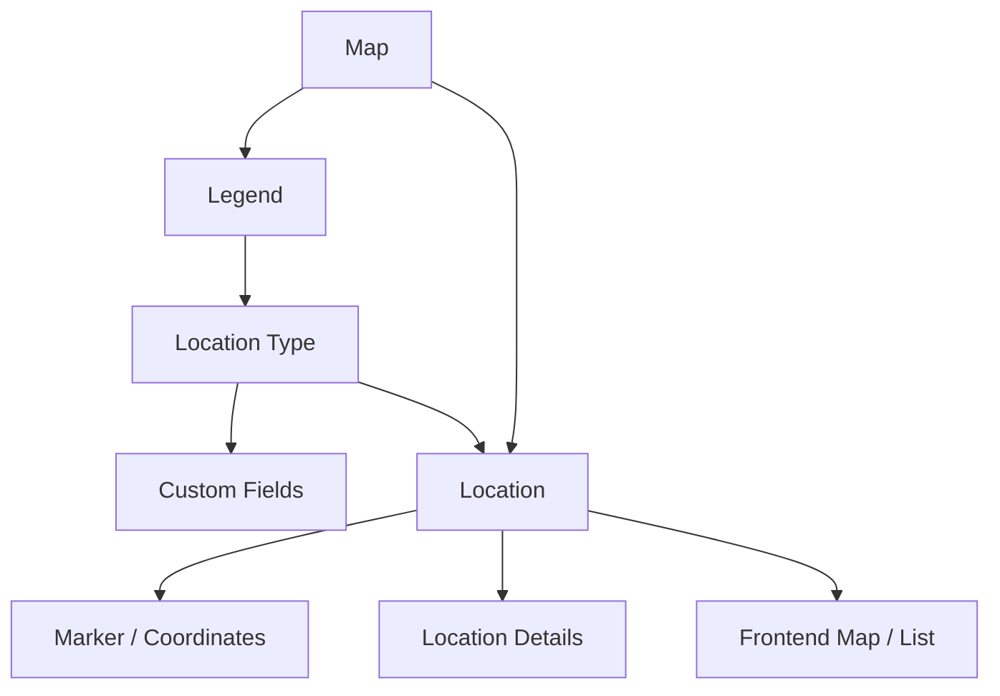
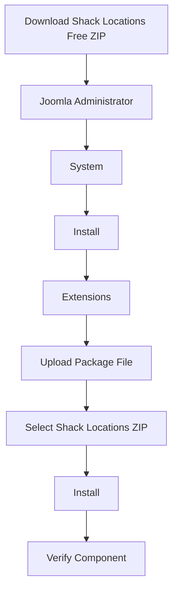
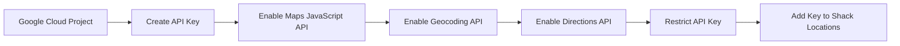
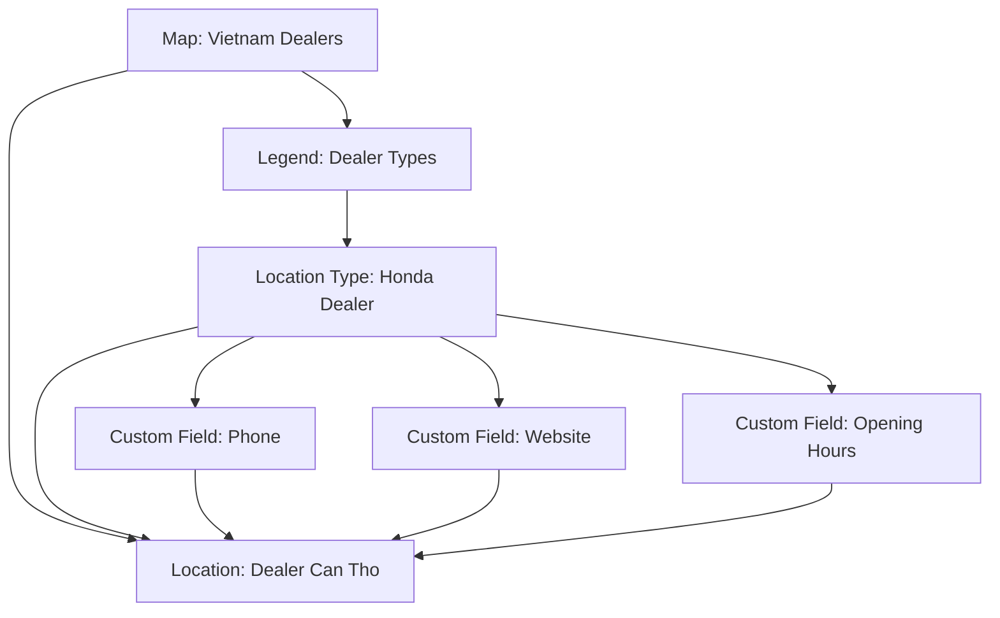
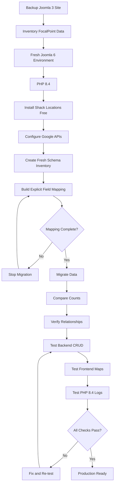

# Shack Locations Free 2.2.1 — Joomla 6 Installation, Compatibility & Backend Guide

> **Edition:** Free  
> **Version:** 2.2.1  
> **Developer:** Joomlashack  
> **Extension type:** Joomla component  
> **License:** GPL  
> **Joomla target:** Joomla 6.x  
> **Effective Joomla 6 PHP minimum:** PHP 8.3  
> **Recommended target runtime:** PHP 8.4  
> **Migration recommendation:** ✅ Install fresh and migrate/configure data; do not clone the old FocalPoint source into Joomla 6  
> **Last verified:** 2026-08-10

> [!IMPORTANT]
> Shack Locations is the maintained successor to **FocalPoint**. Joomlashack's public repository states that Shack Locations is a fork of FocalPoint created with the original author's approval and is actively maintained.

---

<a id="top"></a>

## Table of Contents

- [1. Quick Verdict](#1-quick-verdict)
- [2. What Is Shack Locations?](#2-what-is-shack-locations)
- [3. What Shack Locations Free Supports](#3-what-shack-locations-free-supports)
- [4. Free vs Pro](#4-free-vs-pro)
- [5. Download Shack Locations Free](#5-download-shack-locations-free)
- [6. Joomla 6 and PHP 8.4 Compatibility](#6-joomla-6-and-php-84-compatibility)
- [7. Technical Requirements](#7-technical-requirements)
- [8. Install on Joomla 6](#8-install-on-joomla-6)
- [9. Required Google Maps APIs](#9-required-google-maps-apis)
- [10. Backend Administration Guide](#10-backend-administration-guide)
- [11. Create Your First Map Directory](#11-create-your-first-map-directory)
- [12. Enable Search and Filtering](#12-enable-search-and-filtering)
- [13. Custom Fields](#13-custom-fields)
- [14. Joomla Menu Integration](#14-joomla-menu-integration)
- [15. FocalPoint Migration Notes](#15-focalpoint-migration-notes)
- [16. Verification Checklist](#16-verification-checklist)
- [17. Troubleshooting](#17-troubleshooting)
- [18. Recommended Deployment Flow](#18-recommended-deployment-flow)
- [19. Official Sources](#19-official-sources)
- [20. Final Summary](#20-final-summary)

---

## 1. Quick Verdict

**Shack Locations Free 2.2.1 is a reasonable replacement for legacy FocalPoint on a Joomla 6 site.**

The Joomla Extensions Directory currently lists version **2.2.1**, updated on **April 23, 2026**, as a **Free download** compatible with **Joomla 3, 4, 5, and 6**.

For a Joomla 6 migration, use the following policy:

| Decision | Recommendation |
|---|---|
| Clone old FocalPoint PHP source | ❌ No |
| Install Shack Locations Free fresh | ✅ Yes |
| Reuse old database records without mapping | ❌ No |
| Inventory old FocalPoint data | ✅ Yes |
| Map old tables/fields to the new installation | ✅ Yes |
| Run on PHP 8.4 | ✅ Recommended target for Joomla 6, with staging verification |
| Test Google Maps integration | ✅ Required |
| Test frontend map/menu output | ✅ Required |

### Recommended migration direction



[Back to top](#top)

---

## 2. What Is Shack Locations?

Shack Locations is a Joomla mapping and location-directory component from Joomlashack.

It is designed for sites that need to manage many physical locations and display them using Google Maps.

Typical use cases include:

- Store locators.
- Dealer or branch directories.
- Office locations.
- Tourist attractions.
- Restaurants and hotels.
- Hospitals and emergency services.
- Museums and public facilities.
- Business directories.
- Location-based search pages.

The extension supports structured location data rather than simply embedding a single Google Map.

### Main data relationship



Shack Locations was previously called **FocalPoint**. The Joomlashack source repository explicitly states that Shack Locations is a fork of FocalPoint and is actively maintained by Joomlashack.

[Back to top](#top)

---

## 3. What Shack Locations Free Supports

The **Free edition contains the full Shack Locations component**. Joomlashack describes it as a fully fledged component; the Pro package adds extra modules/plugins and advanced mapping features.

### 3.1 Core Free features

| Feature | Supported in Free | Purpose |
|---|:---:|---|
| Multiple locations on one map | ✅ | Display many location markers on a Google Map. |
| Maps | ✅ | Create independent map directories. |
| Locations | ✅ | Store individual geographic locations. |
| Legends | ✅ | Group related location types. |
| Location Types | ✅ | Categorize locations and control markers/fields. |
| Custom markers | ✅ | Visually distinguish location types. |
| Location list view | ✅ | Display locations as a list in addition to the map. |
| Location filtering | ✅ | Let users filter displayed location types. |
| Map search | ✅ | Search for locations from the map directory. |
| Address/geolocation workflow | ✅ | Work with address and latitude/longitude data. |
| Custom fields | ✅ | Add structured data such as URL, email, image and select fields. |
| Custom tabs/content areas | ✅ | Organize additional location information. |
| Location metadata | ✅ | Add metadata for individual locations. |
| Search-engine-friendly URLs | ✅ | Provide cleaner URLs for location pages. |
| Street View controls | ✅ | Enable Street View when configured. |
| Multi-categorisation | ✅ | Assign multiple types to locations where required. |
| Responsive map output | ✅ | Adapt map output to different screen sizes. |
| Joomla template overrides | ✅ | Customize frontend layouts using Joomla overrides. |
| Menu item for a single map | ✅ | Publish a map through Joomla menu management. |

### 3.2 Useful examples

A **Location Type** can represent characteristics such as:

- Restaurant.
- Dealer.
- Hospital.
- Fire station.
- Cafe.
- Museum.
- Hotel.
- Office.

A location can then be assigned the appropriate type and receive type-specific custom fields.

For example:

```text
Location Type: Dealer

Custom Fields:
- Dealer Code
- Telephone
- Email
- Website
- Opening Hours
- Service Center
- Sales Center
```

[Back to top](#top)

---

## 4. Free vs Pro

Joomlashack states that the Free edition includes the Shack Locations component, while Pro adds seven additional capabilities.

| Capability | Free | Pro |
|---|:---:|:---:|
| Main Shack Locations component | ✅ | ✅ |
| Maps / locations / legends / location types | ✅ | ✅ |
| Custom fields | ✅ | ✅ |
| Standard map/list/search features | ✅ | ✅ |
| Marker clustering | ❌ | ✅ |
| Automatically fit markers into map bounds | ❌ | ✅ |
| Additional map styles | ❌ | ✅ |
| Full-screen map view | ❌ | ✅ |
| Detect/display visitor's current location | ❌ | ✅ |
| Location Map module | ❌ | ✅ |
| Joomla search plugin for locations | ❌ | ✅ |

### Recommendation

Start the Joomla 6 migration with **Shack Locations Free** when the old site does not depend on Pro-only behavior.

Upgrade to Pro only if the current FocalPoint implementation requires one or more Pro-only features.

> [!TIP]
> Before purchasing Pro, inventory the existing FocalPoint plugins/modules. This prevents paying for features the website does not actually use.

[Back to top](#top)

---

## 5. Download Shack Locations Free

### 5.1 Official download page

Use the official Joomlashack product page:

**Download page:**  
<https://www.joomlashack.com/joomla-extensions/shack-locations/>

The page contains the **Get your download** area for the Free package.

Current download flow may require:

1. Entering an email address.
2. Accepting Joomlashack Terms and Conditions.
3. Completing any additional download prompt shown by the site.
4. Downloading the generated Joomla installation package.

> [!NOTE]
> Do not rely on a copied temporary ZIP URL. Joomlashack's Free download is delivered through its website flow, so the stable link to document is the official product/download page above.

### 5.2 Joomla Extensions Directory

Official Joomla Extensions Directory listing:

<https://extensions.joomla.org/extension/shack-locations/>

The JED listing currently identifies Shack Locations as:

```text
Version:       2.2.1
Developer:     Joomlashack
Last updated:  April 23, 2026
Type:          Free download
Compatibility: Joomla 3 / 4 / 5 / 6
```

### 5.3 Public source repository

Source repository:

<https://github.com/joomlashack/ShackLocations>

The current public manifest identifies:

```text
Version:      2.2.1
CreationDate: April 23 2026
Variant:      FREE
```

### 5.4 Download checklist

- [ ] Download only from Joomlashack or an official JED redirect.
- [ ] Confirm the package is **Shack Locations Free 2.2.1** or a newer supported maintenance/security release.
- [ ] Do not install an old FocalPoint 1.x ZIP on Joomla 6.
- [ ] Keep the original downloaded ZIP for repeatable staging deployments.
- [ ] Record the package version in the migration inventory.

[Back to top](#top)

---

## 6. Joomla 6 and PHP 8.4 Compatibility

### 6.1 Joomla 6 support

**Verified:** Joomlashack documents Shack Locations for Joomla 6, and the Joomla Extensions Directory lists version 2.2.1 as Joomla 6 compatible.

Therefore:

```text
Shack Locations Free 2.2.1
        +
Joomla 6.x
        =
Vendor/JED-supported combination
```

### 6.2 PHP requirement: an important distinction

The Joomlashack Shack Locations technical-requirements page currently states for its Joomla 6 documentation:

| Joomlashack Shack Locations requirement | Value |
|---|---:|
| PHP minimum | 8.1.0 |
| PHP recommended | 8.3 |

However, **Joomla 6 itself has a stricter runtime requirement**:

| Joomla 6 runtime | Value |
|---|---:|
| PHP supported/minimum | 8.3.0 |
| PHP recommended | 8.4 |

The effective requirement is therefore the stricter requirement:

```text
Effective PHP minimum for Shack Locations on Joomla 6
= max(Shack Locations minimum, Joomla 6 minimum)
= max(PHP 8.1, PHP 8.3)
= PHP 8.3
```

### 6.3 PHP 8.4 assessment

**Conclusion: PHP 8.4 is the recommended target runtime for this Joomla 6 deployment.**

Why:

1. Joomla 6 officially recommends PHP 8.4.
2. Shack Locations is explicitly listed as Joomla 6 compatible.
3. Shack Locations' documented PHP minimum does not impose an upper PHP limit below 8.4.
4. Version 2.2.1 was released in April 2026 and is the current maintained Free release verified for this guide.

### 6.4 Compatibility confidence

| Layer | Assessment | Confidence |
|---|---|---:|
| Joomla 6 extension listing | ✅ Compatible | High |
| Joomla 6 vendor documentation | ✅ Available | High |
| PHP 8.3 | ✅ Effective minimum | High |
| PHP 8.4 as Joomla runtime | ✅ Recommended target | High |
| Every legacy/custom FocalPoint behavior on PHP 8.4 | ⚠️ Must test | Medium |
| Old FocalPoint template overrides/custom code | ⚠️ Must review separately | Medium |

> [!WARNING]
> Do not interpret extension-level compatibility as proof that old **custom FocalPoint overrides**, custom JavaScript, custom PHP integrations or migrated database modifications are automatically PHP 8.4 compatible. Those are site-specific and must be tested separately.

### 6.5 Source-manifest note

The public 2.2.1 source manifest still contains legacy-oriented metadata such as a lower `phpminimum` and older target-platform value. For deployment decisions, use the current Joomlashack Joomla 6 technical requirements plus Joomla's own Joomla 6 requirements, not the older compatibility values embedded in legacy package metadata.

[Back to top](#top)

---

## 7. Technical Requirements

### 7.1 Recommended Joomla 6 target

| Requirement | Minimum for this project | Recommended |
|---|---:|---:|
| Shack Locations Free | 2.2.1 | Latest compatible maintenance/security release |
| Joomla | 6.x | Latest supported Joomla 6 release |
| PHP | 8.3.0 | **8.4** |
| MySQL | 8.0.13 | 8.4 where compatible with the project |
| Apache | 2.4 | Current supported 2.4 release |
| Nginx | Joomla/vendor requirement | Current supported release |
| HTTPS | Strongly recommended | Required for production best practice |

### 7.2 Joomla PHP modules

For Joomla 6, verify the runtime has the required PHP extensions, including:

- `json`
- `simplexml`
- `dom`
- `zlib`
- `gd`
- `mysqlnd` or `pdo_mysql` when MySQL/MariaDB is used
- `mbstring` recommended

### 7.3 Environment check

From Joomla Administrator:

```text
System
→ System Information
```

Verify:

- Joomla version.
- PHP version.
- Database version.
- Web server.
- PHP extensions.

[Back to top](#top)

---

## 8. Install on Joomla 6

### 8.1 Standard installation



### 8.2 Steps

1. Download the Free package from the [official download page](#51-official-download-page).
2. Log in to Joomla Administrator.
3. Navigate to:

```text
System → Install → Extensions
```

4. Open **Upload Package File**.
5. Select the Shack Locations ZIP package.
6. Wait for Joomla to complete installation.
7. Open:

```text
Components → Shack Locations Free
```

8. Confirm these backend sections are available:

```text
Maps
Legends
Location Types
Locations
```

### 8.3 Post-installation verification

- [ ] Component opens without HTTP 500.
- [ ] No PHP fatal error occurs.
- [ ] No PHP 8.4 compatibility warning blocks execution.
- [ ] Maps screen loads.
- [ ] Legends screen loads.
- [ ] Location Types screen loads.
- [ ] Locations screen loads.
- [ ] Options can be opened and saved.

[Back to top](#top)

---

## 9. Required Google Maps APIs

Shack Locations integrates with Google Maps and requires a Google Maps API key.

Joomlashack's documentation specifically instructs users to enable the required Google APIs, including:

- **Maps JavaScript API**
- **Geocoding API**
- **Directions API**

### 9.1 Configuration flow



### 9.2 Backend API-key configuration

Navigate to:

```text
Components
→ Shack Locations Free
→ Maps
→ Options
```

Set:

```text
Google Maps API Key = <your-api-key>
```

Then click:

```text
Save & Close
```

### 9.3 Security recommendation

Do not leave the Google API key unrestricted in production.

Recommended controls:

- Restrict the key to the production/staging website domains.
- Enable only the APIs required by the site.
- Use separate keys/projects for production and development if practical.
- Monitor Google Maps API usage and billing.

[Back to top](#top)

---

## 10. Backend Administration Guide

Shack Locations is primarily managed from:

```text
Joomla Administrator
→ Components
→ Shack Locations Free
```

### 10.1 Backend sections

| Backend section | Purpose |
|---|---|
| **Maps** | Define map directories and map-level display/search configuration. |
| **Legends** | Group location types into logical filter groups. |
| **Location Types** | Define categories/types, marker icons and custom-field schemas. |
| **Locations** | Create and maintain individual geographic records. |
| **Options** | Configure global settings such as Google Maps API key and map search behavior. |

### 10.2 Recommended configuration order

Always configure in this order:

```text
1. Global Options / Google Maps API Key
2. Map
3. Legend
4. Location Type
5. Custom Fields
6. Location
7. Menu Item
8. Frontend Verification
```

This order avoids creating locations before the required parent structures exist.

[Back to top](#top)

---

## 11. Create Your First Map Directory

### 11.1 Step 1 — Configure the API key

```text
Components
→ Shack Locations Free
→ Maps
→ Options
```

Add the Google Maps JavaScript API key and save.

### 11.2 Step 2 — Create a Map

Navigate to:

```text
Components
→ Shack Locations Free
→ Maps
→ New
```

Configure at minimum:

- **Title** — map name.
- **Description** — optional map description.
- **Latitude** — center latitude.
- **Longitude** — center longitude.

Then click **Save & Close**.

### 11.3 Step 3 — Create a Legend

A legend acts as a container/group for location types.

Navigate to:

```text
Components
→ Shack Locations Free
→ Legends
→ New
```

Configure:

- Title.
- Optional subtitle.

Save the legend.

### 11.4 Step 4 — Create a Location Type

Navigate to:

```text
Components
→ Shack Locations Free
→ Location Types
→ New
```

Configure:

- **Title**.
- **Display in legend**.
- **Marker**.
- Optional custom fields.

Example:

```text
Title: Honda Dealer
Display in legend: Dealers
Marker: dealer-pin.png
```

### 11.5 Step 5 — Create a Location

Navigate to:

```text
Components
→ Shack Locations Free
→ Locations
→ New
```

Configure at minimum:

- Location title.
- Parent Map.
- Primary Location Type.
- Latitude.
- Longitude.

Optional information includes:

- Location image.
- Description.
- Additional location types.
- Custom fields.
- Metadata.

Click **Save & Close**.

### 11.6 Data relationship example



[Back to top](#top)

---

## 12. Enable Search and Filtering

Shack Locations can display a map search interface.

Navigate to:

```text
Components
→ Shack Locations Free
→ Maps
→ Options
→ Map Search
```

Find:

```text
Enable map search? = Yes
```

Then save the configuration.

### Verify

- [ ] Search box appears on the frontend map page.
- [ ] Address/postal-code search returns expected results.
- [ ] Radius behavior matches configuration.
- [ ] Location-type filters correctly hide/show markers.
- [ ] List view and map view return consistent location data.

[Back to top](#top)

---

## 13. Custom Fields

Custom fields allow each location type to have its own structured business data.

### 13.1 Create custom fields

Navigate to:

```text
Components
→ Shack Locations Free
→ Location Types
→ <Location Type>
→ Custom Fields
```

Joomlashack documentation demonstrates field types such as:

- Link.
- Email.
- Image.
- Select List.
- Multi Select.

### 13.2 Example dealer schema

| Field | Example |
|---|---|
| Dealer Website | `https://example.com` |
| Contact Email | `dealer@example.com` |
| Telephone | Business phone number |
| Main Image | Dealer image |
| Dealer Category | Sales / Service / Parts |
| Opening Hours | Business hours |

### 13.3 Fill values for a location

Navigate to:

```text
Components
→ Shack Locations Free
→ Locations
→ <Location>
→ Custom Fields
```

Enter the values and save.

### Migration importance

When migrating from FocalPoint, custom fields must be included in the database/data inventory. Migrating only map and location records can result in apparently correct markers while losing business-specific location details.

[Back to top](#top)

---

## 14. Joomla Menu Integration

To publish a Shack Locations map on the frontend:

1. Open Joomla **Menus**.
2. Select the required menu.
3. Click **New**.
4. Choose the Shack Locations menu-item type.
5. Select **Single Map**.
6. Select the required map under its required settings.
7. Configure title, alias, access and publication status.
8. Save the menu item.
9. Open the frontend URL and verify the map.

### Menu verification

- [ ] Menu item is published.
- [ ] Correct map is selected.
- [ ] URL is SEF-compatible when Joomla SEF is enabled.
- [ ] Map renders.
- [ ] Markers render.
- [ ] Infobox opens.
- [ ] Location links work.
- [ ] Search works when enabled.
- [ ] Filters work.
- [ ] Mobile layout is usable.

[Back to top](#top)

---

## 15. FocalPoint Migration Notes

Shack Locations is directly related to the old FocalPoint extension, but a Joomla 3 → Joomla 6 project should still treat the migration as a controlled data migration rather than copying the old extension directory.

### 15.1 Do not clone the legacy source

Avoid this:

```text
Joomla 3 /components/com_focalpoint
            ↓ copy
Joomla 6 /components/com_focalpoint
```

This can carry old Joomla APIs, deprecated PHP behavior, old JavaScript and obsolete dependencies into the Joomla 6 codebase.

### 15.2 Preferred approach

```text
Old Joomla 3
    │
    ├── FocalPoint schema inventory
    ├── FocalPoint record counts
    ├── custom fields
    ├── maps
    ├── legends
    ├── location types
    ├── locations
    └── media / custom markers
           │
           ▼
Fresh Joomla 6
    │
    ├── Install Shack Locations Free 2.2.1
    ├── Inventory fresh Shack Locations schema
    ├── Build field mapping
    ├── Validate mapping
    ├── Migrate data
    └── Verify data + runtime
```

### 15.3 Vendor migration information

Joomlashack's current migration documentation identifies **five Shack Locations-related database tables** for migration between Joomla sites and also warns that custom images/media must be transferred separately when used.

For a legacy FocalPoint migration, do not assume the old schema exactly matches the fresh 2.2.1 schema. Compare both structures before importing.

### 15.4 Minimum migration inventory

Capture:

- [ ] All FocalPoint/Shack Locations tables.
- [ ] Column names and data types.
- [ ] Primary keys.
- [ ] Indexes.
- [ ] Row counts.
- [ ] Maps.
- [ ] Legends.
- [ ] Location Types.
- [ ] Locations.
- [ ] Custom fields.
- [ ] Location-to-type relationships.
- [ ] Configuration values.
- [ ] Joomla menu items pointing to FocalPoint.
- [ ] Modules/plugins related to FocalPoint.
- [ ] Custom marker images.
- [ ] Other media used by locations.
- [ ] Template overrides.
- [ ] Custom PHP/JavaScript integrations.

[Back to top](#top)

---

## 16. Verification Checklist

### 16.1 Environment

- [ ] Joomla 6.x is running.
- [ ] PHP 8.4 is active on the target environment.
- [ ] Database version satisfies Joomla 6 requirements.
- [ ] Required PHP extensions are loaded.
- [ ] HTTPS works.

### 16.2 Installation

- [ ] Shack Locations Free is installed.
- [ ] Installed version is 2.2.1 or the approved newer version.
- [ ] Joomla Update System recognizes the extension where applicable.
- [ ] Component opens without errors.

### 16.3 Backend CRUD

- [ ] Create/edit/delete a test Map.
- [ ] Create/edit/delete a test Legend.
- [ ] Create/edit/delete a test Location Type.
- [ ] Create/edit/delete a test Location.
- [ ] Custom fields save correctly.
- [ ] Location-type relationships save correctly.
- [ ] Options save correctly.

### 16.4 Google Maps

- [ ] Maps JavaScript API works.
- [ ] Geocoding works.
- [ ] Directions work.
- [ ] API key restrictions are correct.
- [ ] No Google Maps billing/API error appears.

### 16.5 Frontend

- [ ] Map loads.
- [ ] Map center is correct.
- [ ] All expected markers appear.
- [ ] Marker icons are correct.
- [ ] Infobox content is correct.
- [ ] Location details page works.
- [ ] Custom fields render.
- [ ] Search works.
- [ ] Filters work.
- [ ] List view works.
- [ ] Menu links work.
- [ ] Mobile layout works.

### 16.6 PHP 8.4 runtime

- [ ] No fatal errors.
- [ ] No unhandled exceptions.
- [ ] No PHP warnings affecting output.
- [ ] No deprecation messages affecting functionality.
- [ ] Joomla error log contains no Shack Locations failures.
- [ ] Browser console contains no blocking JavaScript errors.

### 16.7 Migration verification

For every migrated table/entity compare:

```text
Source record count
        ↓
Mapping validation
        ↓
Target record count
        ↓
Relationship validation
        ↓
Frontend functional validation
```

Never approve migration based only on matching row counts.

[Back to top](#top)

---

## 17. Troubleshooting

### Map does not render

Check:

1. Google Maps API key exists.
2. Maps JavaScript API is enabled.
3. Geocoding API is enabled.
4. Directions API is enabled.
5. Billing/project configuration is valid.
6. HTTP-referrer restrictions include the current domain.
7. Browser console for Google Maps errors.

### Backend works but frontend map is empty

Check:

- Location is published.
- Location is assigned to the correct Map.
- Location has valid latitude/longitude.
- Location Type is valid.
- Menu item points to the correct map.
- Google Maps JavaScript has not been blocked by CSP or another optimization extension.

### Migrated markers are missing

Check:

- Location-to-map relationship.
- Location-to-type relationship.
- Custom marker files.
- Media paths.
- Database IDs after migration.
- Whether source and target IDs were remapped.

### PHP 8.4 errors

Do not immediately patch vendor code in production.

Use this order:

```text
1. Confirm latest Shack Locations version
2. Reproduce on staging
3. Capture exact PHP stack trace
4. Check whether error comes from Shack Locations or custom override
5. Check Joomlashack update/changelog
6. Patch only when root cause is confirmed
7. Retest full map workflow
```

[Back to top](#top)

---

## 18. Recommended Deployment Flow

For a Joomla 3/FocalPoint → Joomla 6/Shack Locations migration:



### Production rule

**Mapping verification should be a prerequisite for data migration.**

```text
Mapping Verify
      ↓ PASS
Migration Start
      ↓
Data Verification
      ↓
Runtime Verification
      ↓
Production Approval
```

[Back to top](#top)

---

## 19. Official Sources

The following sources were used to verify this guide.

### Joomlashack

- Shack Locations product/download page  
  <https://www.joomlashack.com/joomla-extensions/shack-locations/>

- Shack Locations documentation index  
  <https://www.joomlashack.com/docs/shack-locations/>

- Technical requirements  
  <https://www.joomlashack.com/docs/shack-locations/technical-requirements/>

- Getting started / Joomla 6 backend workflow  
  <https://www.joomlashack.com/docs/shack-locations/getting-started-with-shack-locations/>

- Free vs Pro  
  <https://www.joomlashack.com/docs/shack-locations/free-vs-pro/>

- Google Maps JavaScript, Geocoding and Directions APIs  
  <https://www.joomlashack.com/docs/shack-locations/getting-google-maps-javascript-api-key/>

- Custom fields  
  <https://www.joomlashack.com/docs/shack-locations/use-custom-fields/>

- Enable location searches  
  <https://www.joomlashack.com/docs/shack-locations/enable-location-searches/>

- Migration guide  
  <https://www.joomlashack.com/docs/shack-locations/how-to-migrate/>

### Joomla

- Joomla Extensions Directory — Shack Locations  
  <https://extensions.joomla.org/extension/shack-locations/>

- Joomla 6 technical requirements  
  <https://manual.joomla.org/docs/next/get-started/technical-requirements/>

### Source code

- Joomlashack Shack Locations GitHub repository  
  <https://github.com/joomlashack/ShackLocations>

- Version 2.2.1 component manifest  
  <https://github.com/joomlashack/ShackLocations/blob/main/src/focalpoint.xml>

[Back to top](#top)

---

## 20. Final Summary

| Question | Answer |
|---|---|
| Is Shack Locations Free available? | ✅ Yes |
| Current verified Free version | **2.2.1** |
| Joomla 6 supported? | ✅ Yes |
| PHP 8.4 target appropriate? | ✅ Yes — PHP 8.4 is Joomla 6's recommended runtime; test the extension and site-specific customizations on staging |
| Free edition useful by itself? | ✅ Yes — it contains the full core component |
| Google Maps API required? | ✅ Yes |
| Can it replace legacy FocalPoint? | ✅ It is the maintained successor/fork, but migration still requires schema/data verification |
| Clone old FocalPoint source into Joomla 6? | ❌ No |
| Recommended approach | Fresh install → mapping verification → data migration → runtime verification |

> **Recommended target:** `Joomla 6 + PHP 8.4 + Shack Locations Free 2.2.1 (or newer approved release)`.

[Back to top](#top)
