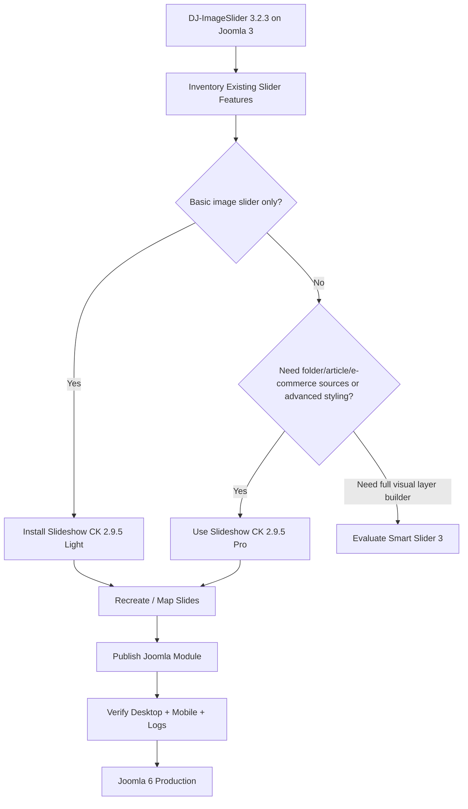
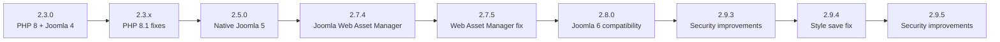
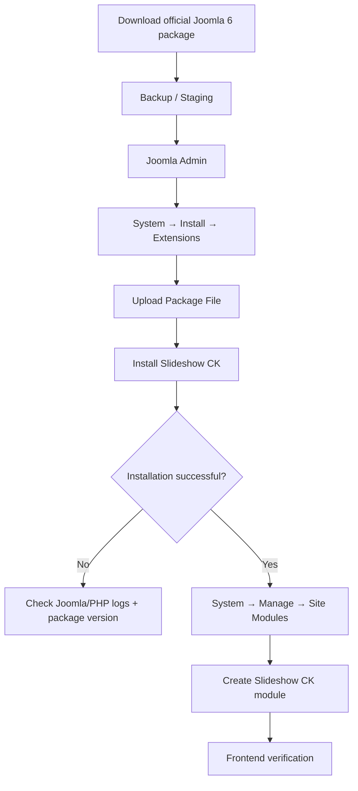
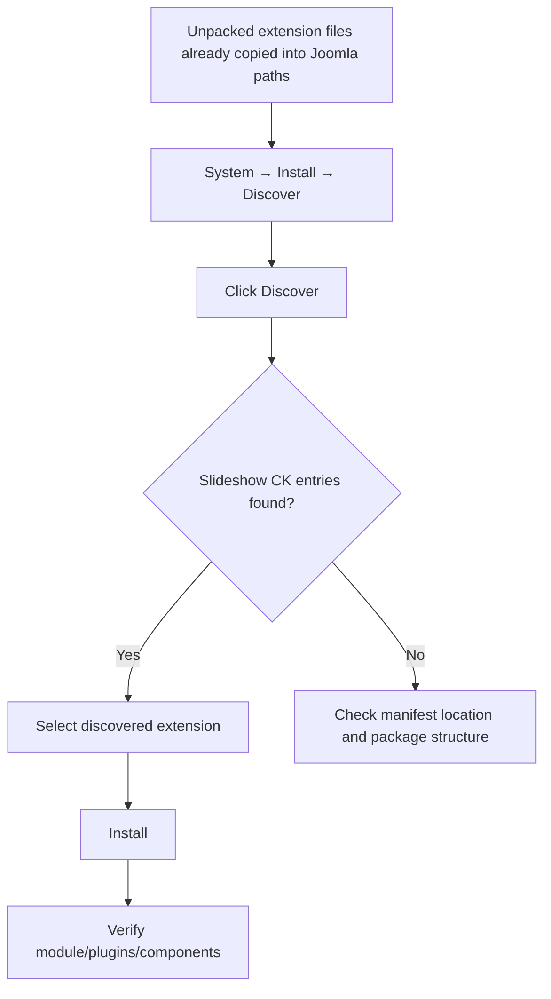
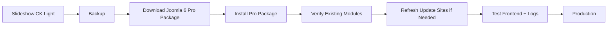
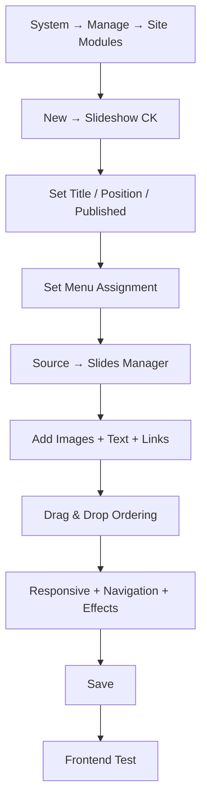
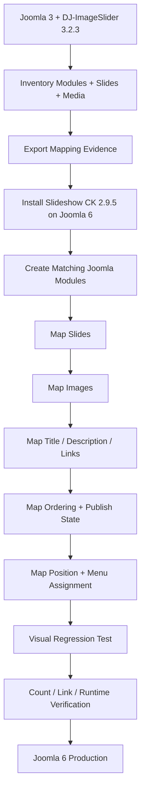
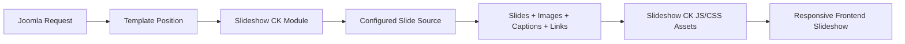
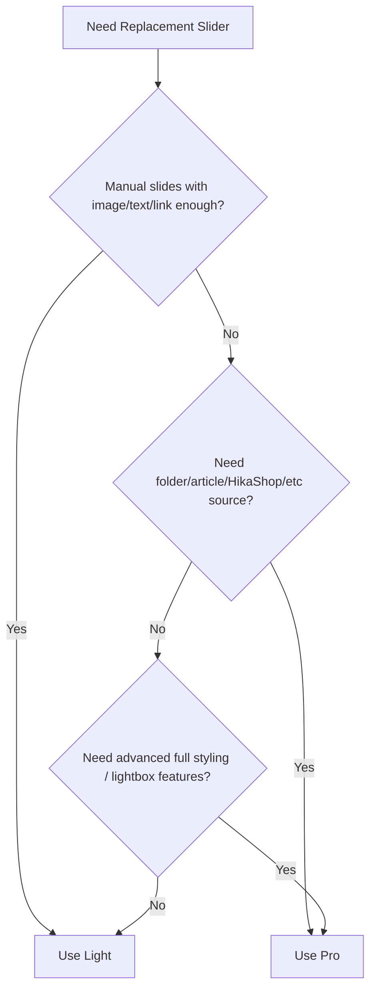

# Slideshow CK 2.9.5 — Joomla 6 Installation, Usage & DJ-ImageSlider Replacement Guide

> **Edition:** Light / Pro  
> **Latest vendor release reviewed:** 2.9.5  
> **Release date:** 2026-07-22  
> **Developer:** JoomlaCK / Cédric KEIFLIN  
> **Primary extension type:** Joomla site module  
> **Joomla target:** Joomla 6.x  
> **Target runtime for this project:** PHP 8.4  
> **Legacy extension being replaced:** DJ-ImageSlider 3.2.3  
> **Migration recommendation:** Fresh Slideshow CK installation + controlled recreation/mapping of legacy slides  
> **Guide reviewed:** 2026-08-11

> [!IMPORTANT]
> **Slideshow CK 2.9.5 is the current release shown by the vendor release notes at the time of this review.** The Joomla Extensions Directory may still display an older package/version because JED metadata can lag behind the vendor release page. For installation, prefer the official JoomlaCK Joomla 6 download page and verify the package version before deployment.

> [!NOTE]
> JoomlaCK explicitly lists Joomla 6 compatibility. The changelog added Joomla 6 compatibility in version 2.8.0, PHP 8 compatibility in version 2.3.0, and PHP 8.1 fixes in later 2.3.x releases. The vendor does **not** currently publish a separate statement that says “PHP 8.4 certified.” Therefore Joomla 6 + PHP 8.4 should still be validated on staging before production.

---

<a id="top"></a>
<a id="summary"></a>

## Table of Contents

- [1. Quick Summary](#1-quick-summary)
- [2. Why Slideshow CK Was Selected](#2-why-slideshow-ck-was-selected)
- [3. Compatibility and Version Baseline](#3-compatibility-and-version-baseline)
- [4. DJ-ImageSlider 3.2.3 Replacement Options](#4-dj-imageslider-323-replacement-options)
- [5. Download](#5-download)
- [6. Install on Joomla 6](#6-install-on-joomla-6)
- [7. Discover Installation](#7-discover-installation)
- [8. Upgrade from Light to Pro](#8-upgrade-from-light-to-pro)
- [9. Feature Support Matrix](#9-feature-support-matrix)
- [10. Step-by-Step Usage Guide](#10-step-by-step-usage-guide)
- [11. DJ-ImageSlider to Slideshow CK Mapping](#11-dj-imageslider-to-slideshow-ck-mapping)
- [12. Migration and Runtime Flows](#12-migration-and-runtime-flows)
- [13. Production and Security Notes](#13-production-and-security-notes)
- [14. Verification Checklist](#14-verification-checklist)
- [15. Troubleshooting](#15-troubleshooting)
- [16. Official Documentation and Tutorials](#16-official-documentation-and-tutorials)
- [17. Final Recommendation](#17-final-recommendation)

---

## 1. Quick Summary

**Recommended replacement for a simple DJ-ImageSlider 3.2.3 workload: Slideshow CK 2.9.5 Light first, then Pro only if required.**

| Item | Assessment |
|---|---|
| Slideshow CK 2.9.5 | ✅ Current vendor release reviewed |
| Joomla 6 support | ✅ Official vendor support |
| Joomla 6 compatibility introduced | ✅ Version 2.8.0 |
| PHP 8 support | ✅ Explicitly added in version 2.3.0 |
| PHP 8.4 explicit vendor certification | ⚠️ Not stated separately; staging verification required |
| Free / Light edition | ✅ Available |
| Pro edition | ✅ Available |
| Drag & Drop slides manager | ✅ Available |
| Images and videos | ✅ Supported |
| Title / description / link | ✅ Supported |
| Responsive / touch navigation | ✅ Supported |
| Joomla module position publishing | ✅ Native module workflow |
| Direct DJ-ImageSlider importer | ⚠️ No official importer verified |
| Migration approach | ✅ Fresh install + recreate/map legacy slides |
| Complexity compared with Smart Slider | 🟢 Lower for a basic slideshow use case |
| Production recommendation | ✅ Good candidate after Joomla 6 + PHP 8.4 staging test |

### Recommended decision flow



[Back to Summary](#summary)

---

## 2. Why Slideshow CK Was Selected

DJ-ImageSlider 3.2.3 is fundamentally a simple slideshow system: images, titles, descriptions, links, ordering, responsive display and module publishing.

Slideshow CK follows a very similar operational model:

```text
Joomla Site Module
    └── Slideshow CK
        └── Slides Manager
            ├── Image
            ├── Title / Caption
            ├── Description
            ├── Link
            ├── Duration
            ├── Publish dates
            └── Enabled / Disabled
```

This is closer to DJ-ImageSlider than a full visual slider/page-builder architecture.

### Main reasons for choosing Slideshow CK

1. **Official Joomla 6 support.**
2. **Current maintenance** with releases through 2.9.5 in July 2026.
3. **Light edition available**, so a basic replacement does not require Pro.
4. **Simple Joomla module workflow**, which is close to the old DJ-ImageSlider publishing model.
5. **Drag & Drop slide management** without requiring a large visual-builder workflow.
6. **Responsive and mobile touch support**.
7. **Images, videos, links and captions** are supported.
8. **Pro is optional** and mainly adds richer sources, advanced styling and integrations.
9. Version 2.9.5 includes additional **security improvements**, including stronger authorization usage in the media upload workflow.

### Why not automatically choose Smart Slider 3?

Smart Slider 3 is a strong Joomla 6 option, but it is designed as a more advanced visual slider framework with layers, richer design tools and a larger editing model. That is useful when the site needs hero compositions or sophisticated animations, but it can be unnecessary complexity when replacing a basic DJ-ImageSlider implementation.

[Back to Summary](#summary)

---

## 3. Compatibility and Version Baseline

### 3.1 Vendor compatibility history



### 3.2 Current project compatibility assessment

| Layer | Status | Evidence / Notes |
|---|---|---|
| Joomla 6 | ✅ Official | Vendor product page lists Joomla 6; compatibility added in 2.8.0 |
| Joomla 5 | ✅ Official | Native support added in 2.5.0 |
| Joomla 4 | ✅ Official | Supported since 2.3.0 |
| PHP 8 | ✅ Official | Compatibility added in 2.3.0 |
| PHP 8.1 | ✅ Explicit fixes | 2.3.x changelog includes PHP 8.1 compatibility/fixes |
| PHP 8.4 | 🟡 High-confidence target, test required | No separate vendor “PHP 8.4 certified” statement found |
| Joomla Web Asset Manager | ✅ | Implemented in 2.7.4; follow-up compatibility fix in 2.7.5 |
| Joomla Update System | ✅ | Listed by JED |
| Responsive mobile output | ✅ | Vendor feature |
| Keyboard navigation/accessibility | ✅ | Added in 2.7.1 |

### Baseline rule

For a new Joomla 6 installation, use **2.9.5 or newer**, not the first Joomla 6-compatible release 2.8.0.

Why:

- 2.9.3 added security improvements.
- 2.9.4 fixed a style-saving regression introduced around 2.9.3.
- 2.9.5 added further security improvements and strengthened media manager upload authorization.

[Back to Summary](#summary)

---

## 4. DJ-ImageSlider 3.2.3 Replacement Options

The purpose of this comparison is not to find the most powerful extension. It is to find the best **replacement fit** for a simple legacy DJ-ImageSlider workload on Joomla 6.

| Option | Joomla 6 | PHP 8.4 evidence | Free option | Similarity to DJ-ImageSlider | Complexity | Best use case | Decision |
|---|:---:|---|:---:|:---:|:---:|---|---|
| **Slideshow CK 2.9.5** | ✅ Official | PHP 8 official; PHP 8.4 not separately stated | ✅ | ⭐⭐⭐⭐⭐ | 🟢 Low–Medium | Simple image/video slideshow in Joomla module positions | **🥇 Recommended** |
| **Smart Slider 3** | ✅ Official | PHP 8 supported by vendor | ✅ | ⭐⭐⭐⭐ | 🟡 Medium–High | Advanced visual sliders, layers, hero banners | 🥈 Strong alternative |
| **SP Page Builder 6.x Carousel / Slideshow** | ✅ Official | Vendor lists PHP 8.2/8.3/8.4 | ✅ Lite available | ⭐⭐⭐ | 🔴 High if used only for slider | Best when the site already uses SPPB for page composition | Conditional |
| **BR Simple Slider 1.0** | ✅ J6-native listing | No detailed PHP 8.4 certification reviewed | ✅ | ⭐⭐⭐ | 🟢 Very low | Folder-based lightweight image rotation | Too limited for richer DJ slide metadata |
| **DJ-ImageSlider 4.6.6** | ❌ Vendor/JED line is J4/J5, not J6 | Not relevant for target decision | ✅ | ⭐⭐⭐⭐⭐ | 🟢 Low | Stay on supported Joomla 5 environments | **Do not choose for J6** |

### Why Slideshow CK wins for this migration

```text
Need: Image + Title + Description + Link + Autoplay + Responsive + Module Position
                              │
                              ▼
                    Slideshow CK Light
                              │
            ┌─────────────────┼──────────────────┐
            ▼                 ▼                  ▼
       Similar workflow   Joomla 6 support   Lower complexity
```

### When another option is better

- Choose **Smart Slider 3** if the new site needs layer-based visual composition, advanced hero sections or richer animation control.
- Choose **SP Page Builder** if the slideshow is part of a larger page-builder layout and there is no need for an independent slideshow module workflow.
- Choose a minimal folder slider only when the old DJ-ImageSlider data does **not** need per-slide title, description, URL or publishing control.

[Back to Summary](#summary)

---

## 5. Download

### 5.1 Official JoomlaCK product page

Use the vendor product page for release notes, compatibility and feature comparison:

<https://www.joomlack.fr/en/joomla-extensions/slideshow-ck>

### 5.2 Official Joomla 6 download page

Use the Joomla 6-specific download category:

<https://www.joomlack.fr/en/component/dms/?Itemid=169&category_id=101&task=view_category>

This page provides entries for:

- **Slideshow CK** — Light / free package.
- **Slideshow CK Pro** — paid package.

### 5.3 Joomla Extensions Directory

<https://extensions.joomla.org/extension/photos-a-images/slideshow/slideshow-ck/>

> [!NOTE]
> The JED version can lag behind JoomlaCK's current release notes. At the review date, the vendor release notes show **2.9.5**, while JED may still display **2.9.3**. Use the vendor package version as the primary release reference.

### 5.4 Documentation index

<https://www.joomlack.fr/en/documentation/slideshow-ck>

### Download recommendation

For production/staging:

1. Download only from JoomlaCK or JED.
2. Prefer the **Joomla 6** package category.
3. Verify that the package/version is **2.9.5 or newer**.
4. Keep the original downloaded ZIP as a deployment artifact.
5. Do not use packages from third-party mirrors, warez sites or old local archives unless their origin and version are verified.

[Back to Summary](#summary)

---

## 6. Install on Joomla 6

### Recommended method: Upload Package File

1. Back up the Joomla database and files.
2. Test the extension on local/staging first.
3. Log in to Joomla Administrator.
4. Open:

```text
System
  → Install
    → Extensions
```

5. Open **Upload Package File**.
6. Select the Slideshow CK Joomla 6 ZIP package.
7. Wait for Joomla to complete installation.
8. Confirm that installation finishes without an error.
9. Open the site modules list and verify the `Slideshow CK` module type exists.

Joomla's standard installer documentation:

<https://docs.joomla.org/Help5.x:Extensions:_Install>

### Install flow



### Alternative: Install from Folder

Use this when the server upload limit prevents ZIP upload.

1. Extract the vendor ZIP into a temporary directory accessible by Joomla.
2. Open:

```text
System → Install → Extensions → Install from Folder
```

3. Enter/select the extracted package directory.
4. Run the installer.
5. Verify the installed extensions and module type.

**Prefer Install from Folder over manually copying extension files** when possible because the Joomla installer can execute package installation logic correctly.

[Back to Summary](#summary)

---

## 7. Discover Installation

### Important: Discover is not the normal Slideshow CK installation method

Joomla Discover is intended for extension files that have already been placed manually in Joomla's extension directories but are not registered as installed.

Official Joomla Discover documentation:

<https://docs.joomla.org/Help5.x:Extensions:_Discover/en>

### Standard case

If you installed Slideshow CK using **Upload Package File** or **Install from Folder** successfully:

> **Do not run Discover as an additional installation step.**

The package is already installed.

### When Discover is useful

Use Discover only when your deployment workflow has already copied unpacked extension files into their correct Joomla locations, for example a Git-controlled/discover-based deployment.

General flow:



### Discover procedure

1. Inspect the Slideshow CK ZIP/package structure first.
2. Identify every extension manifest contained in the package.
3. Copy each extension to the correct Joomla directory **without changing the manifest structure**.
4. Open:

```text
System → Install → Discover
```

5. Click **Discover**.
6. Select the discovered Slideshow CK extension entries.
7. Click **Install**.
8. Verify all expected supporting extensions are registered.
9. Check Joomla/PHP logs.
10. Create a test Slideshow CK module and render it on the frontend.

> [!CAUTION]
> If the vendor package contains multiple extension types or installer scripts, manually copying only the module directory can produce an incomplete installation. For Slideshow CK, the normal Joomla package installer is safer unless the project's Discover workflow has already been validated against the exact package structure.

### Discover verification

After installation, verify through Joomla extension management that the expected Slideshow CK entries exist and are enabled where necessary.

[Back to Summary](#summary)

---

## 8. Upgrade from Light to Pro

Slideshow CK version 2 uses separate **Light** and **Pro** package lines. Pro provides the complete feature package instead of the older version-1 model that used multiple paid parameter/source plugins.

Vendor migration note:

<https://www.joomlack.fr/en/documentation/slideshow-ck/246-migration-from-slideshow-ck-version-1-to-version-2>

Official Joomla 6 download page:

<https://www.joomlack.fr/en/component/dms/?Itemid=169&category_id=101&task=view_category>

### Recommended Light → Pro upgrade procedure

1. **Back up first.**
2. Perform the upgrade on staging before production.
3. Purchase/download **Slideshow CK Pro for Joomla 6** from JoomlaCK.
4. Confirm the Pro package is the current supported release line.
5. In Joomla Administrator open:

```text
System → Install → Extensions
```

6. Install the **Pro package** using **Upload Package File**.
7. Do not install a Light package over an already installed Pro edition.
8. Open each existing Slideshow CK module.
9. Verify:
   - slide data,
   - source configuration,
   - styling,
   - module position,
   - menu assignments,
   - responsive behavior.
10. Clear Joomla/browser cache if frontend assets appear stale.
11. Review the Joomla extension update sites if Joomla still offers a stale Light update after switching to Pro.
12. Test the frontend and PHP/Joomla logs.

### Important Light/Pro update rule

JoomlaCK's update behavior explicitly prevents **Slideshow CK Light** from being installed over **Slideshow CK Pro**. If Joomla's update manager continues showing the Light update site after a Pro installation, rebuild/refresh the update sites before applying updates.

Vendor forum reference:

<https://forum.joomlack.fr/index.php/15-slideshow-ck/16651-joomla-extensions-update>

### Do not downgrade casually

If you intentionally want to go from Pro back to Light, treat it as a downgrade and validate data/configuration first. Do **not** attempt to install Light over Pro.

### Upgrade flow



[Back to Summary](#summary)

---

## 9. Feature Support Matrix

### 9.1 Core slideshow capabilities

| Feature | Light | Pro | Useful for DJ-ImageSlider replacement | Detail / Tutorial |
|---|:---:|:---:|:---:|---|
| Unlimited slides | ✅ | ✅ | ✅ | [Product page](https://www.joomlack.fr/en/joomla-extensions/slideshow-ck) |
| Drag & Drop slides manager | ✅ | ✅ | ✅ | [Slides Manager](https://www.joomlack.fr/en/documentation/slideshow-ck/241-use-the-slides-manager) |
| Image slides | ✅ | ✅ | ✅ | [First slideshow](https://www.joomlack.fr/documentation/slideshow-ck/240-how-to-create-your-first-slideshow) |
| Video slides | ✅ | ✅ | Optional | [Slides Manager](https://www.joomlack.fr/en/documentation/slideshow-ck/241-use-the-slides-manager) |
| Title / caption / description | ✅ | ✅ | ✅ | [Slides Manager](https://www.joomlack.fr/en/documentation/slideshow-ck/241-use-the-slides-manager) |
| Per-slide link | ✅ | ✅ | ✅ | [Slides Manager](https://www.joomlack.fr/en/documentation/slideshow-ck/241-use-the-slides-manager) |
| Per-slide duration | ✅ | ✅ | ✅ | [Slides Manager](https://www.joomlack.fr/en/documentation/slideshow-ck/241-use-the-slides-manager) |
| Enable / disable a slide | ✅ | ✅ | ✅ | [Slides Manager](https://www.joomlack.fr/en/documentation/slideshow-ck/241-use-the-slides-manager) |
| Start/end publication date | ✅ | ✅ | ✅ | [Slides Manager](https://www.joomlack.fr/en/documentation/slideshow-ck/241-use-the-slides-manager) |
| Drag & Drop ordering | ✅ | ✅ | ✅ | [Slides Manager](https://www.joomlack.fr/en/documentation/slideshow-ck/241-use-the-slides-manager) |
| Responsive layout | ✅ | ✅ | ✅ | [Responsive setup](https://www.joomlack.fr/en/documentation/slideshow-ck/418-setup-your-responsive-slideshow) |
| Touch/swipe navigation | ✅ | ✅ | ✅ | [Product page](https://www.joomlack.fr/en/joomla-extensions/slideshow-ck) |
| Pagination / thumbnails | ✅ | ✅ | ✅ | [Thumbnail tutorial](https://www.joomlack.fr/en/documentation/slideshow-ck/255-setup-a-slideshow-with-thumbs) |
| Ken Burns effect | ✅ | ✅ | Optional | [Product page](https://www.joomlack.fr/en/joomla-extensions/slideshow-ck) |
| Normal / random order | ✅ | ✅ | ✅ | [Product page](https://www.joomlack.fr/en/joomla-extensions/slideshow-ck) |
| Keyboard navigation/accessibility | ✅ | ✅ | ✅ | [Release notes](https://www.joomlack.fr/en/joomla-extensions/slideshow-ck) |
| Device-targeted slideshow loading | ✅ | ✅ | Optional | [Release notes](https://www.joomlack.fr/en/joomla-extensions/slideshow-ck) |
| Direct link/alias to a specific slide | ✅ | ✅ | Optional | [Documentation index](https://www.joomlack.fr/en/documentation/slideshow-ck) |

### 9.2 Pro-oriented capabilities

| Feature | Light | Pro | When Pro is needed |
|---|:---:|:---:|---|
| Load slides automatically from a folder | ❌ | ✅ | Large image sets managed by folders |
| Load from Joomla article categories | ❌ / limited manual use | ✅ | Article-driven slideshow |
| HikaShop source | ❌ | ✅ | Product slider from HikaShop |
| VirtueMart source | ❌ | ✅ | Product slider from VirtueMart |
| JoomGallery source | ❌ | ✅ | Gallery-driven slides |
| Flickr / Google Photos sources | ❌ | ✅ | External image source |
| K2 / Flexicontent source integrations | ❌ / depends on source | ✅ full package features | Legacy/third-party content sources |
| Advanced graphical styling interface | Limited | ✅ Full | Non-code visual styling |
| Design models/presets | Limited | ✅ | Faster visual design |
| Advanced Lightbox options | ❌ | ✅ | Image popup/gallery behavior |
| Tag-based slideshow loading in articles | ❌ | ✅ | Embed slideshow in article content |
| Premium support/update entitlement | ❌ | ✅ | Production support requirement |

> [!TIP]
> For a normal DJ-ImageSlider replacement using manually managed images, title, description, link and module position, **start with Light**. Upgrade only when a required legacy behavior maps to a Pro-only source or design feature.

[Back to Summary](#summary)

---

## 10. Step-by-Step Usage Guide

Official tutorial:

<https://www.joomlack.fr/documentation/slideshow-ck/240-how-to-create-your-first-slideshow>

### Step 1 — Open Site Modules

In Joomla Administrator open:

```text
System
  → Manage
    → Site Modules
```

Alternative dashboard route may also be available:

```text
Home Dashboard → Site → Modules
```

### Step 2 — Create the Slideshow CK module

1. Click **New**.
2. Select **Slideshow CK** as the module type.
3. Enter a clear title, for example:

```text
Homepage Hero Slideshow
```

4. Set **Status = Published**.
5. Usually set **Show Title = Hide** for a visual slideshow.

### Step 3 — Choose the Joomla module position

Select the template position that should render the slider.

Examples depend on the active template:

```text
banner
hero
main-top
top-a
```

Do not copy a Joomla 3 position name blindly. Confirm the target Joomla 6 template provides the same position.

### Step 4 — Configure Menu Assignment

Choose where the module should display:

- On all pages,
- No pages,
- Only on selected pages,
- On all pages except selected pages.

For initial testing, use a dedicated test page or controlled menu assignment instead of immediately publishing globally.

### Step 5 — Select the slide source

Open the **Source** section/tab.

For a DJ-ImageSlider-style migration, use the **Slides Manager** first.

This gives direct control over each slide and provides the closest workflow to DJ-ImageSlider.

### Step 6 — Add slides

For each legacy DJ-ImageSlider slide:

1. Click **Add a slide**.
2. Select the image.
3. Enter the title/caption.
4. Enter the description if required.
5. Add the destination URL/link.
6. Configure link target only if the old behavior requires it.
7. Configure slide duration if it differs from the global value.
8. Configure start/end publishing dates if needed.
9. Keep the slide enabled.

### Step 7 — Reorder slides

Use Drag & Drop in the Slides Manager to match the legacy DJ-ImageSlider order.

Do not rely only on creation order.

### Step 8 — Configure dimensions and responsive behavior

Slideshow CK is responsive by default, but image ratio and mobile behavior still need verification.

Recommended tutorial:

<https://www.joomlack.fr/en/documentation/slideshow-ck/418-setup-your-responsive-slideshow>

Important settings to review:

- width,
- height / image aspect ratio,
- small-screen breakpoint,
- minimum mobile height,
- optional mobile-specific images.

### Step 9 — Configure navigation

Choose the navigation behavior that matches the legacy site:

- arrows,
- pagination dots,
- thumbnails,
- touch/swipe,
- keyboard navigation where relevant.

Thumbnail tutorial:

<https://www.joomlack.fr/en/documentation/slideshow-ck/255-setup-a-slideshow-with-thumbs>

### Step 10 — Configure animation and timing

Verify:

- autoplay,
- transition/effect,
- slide duration,
- caption effect,
- pause/interaction behavior,
- random vs normal ordering.

Use the simplest effect that reproduces the old site unless there is an approved design change.

### Step 11 — Save and frontend test

After saving:

1. Open the assigned frontend page.
2. Confirm the module renders.
3. Check every image.
4. Check every link.
5. Check slide ordering.
6. Check captions.
7. Check autoplay.
8. Check arrows/pagination.
9. Test desktop.
10. Test tablet/mobile width.
11. Check browser console.
12. Check Joomla and PHP logs.

### Step 12 — Verify accessibility basics

At minimum:

- meaningful image alternative text where available,
- keyboard navigation behavior,
- readable captions,
- sufficient contrast,
- links that are understandable outside visual context,
- no autoplay behavior that makes content unusable.

### Basic administration flow



[Back to Summary](#summary)

---

## 11. DJ-ImageSlider to Slideshow CK Mapping

There is no official DJ-ImageSlider → Slideshow CK importer verified for this guide. Treat the migration as a controlled mapping/recreation task.

### Functional mapping

| DJ-ImageSlider 3.2.3 | Slideshow CK 2.9.5 | Mapping confidence | Notes |
|---|---|:---:|---|
| Slide | Slide | ✅ High | Direct concept |
| Slide image | Slide image | ✅ High | Direct concept |
| Title | Title / caption | ✅ High | Verify style/layout |
| Description | Description/caption text | ✅ High | HTML should be reviewed |
| URL / link | Slide link | ✅ High | Verify target behavior |
| Ordering | Drag & Drop order | ✅ High | Reproduce old order |
| Published state | Enabled / disabled | ✅ High | Direct concept |
| Publish dates | Start/end date | ✅ High | 2.9.2 adds date + time precision |
| Autoplay | Slideshow timing/effect settings | ✅ High | Verify exact timing |
| Navigation | Pagination/arrows/thumbnails | ✅ High | UI may differ |
| Responsive behavior | Responsive settings | ✅ High | Re-test image crop/ratio |
| Category/group | Separate Slideshow CK module/source grouping | 🟡 Medium | Architecture is not identical |
| Joomla module position | Joomla module position | ✅ High | Verify target template positions |
| Menu assignment | Joomla module Menu Assignment | ✅ High | Native Joomla workflow |
| Custom DJ-specific layout override | CK style/theme/override/custom CSS | 🟡 Medium | Requires visual comparison |

### Migration rule

Do not migrate legacy extension tables blindly into Slideshow CK tables/settings.

Use this sequence:

```text
Inventory DJ-ImageSlider
        ↓
Extract legacy slide values
        ↓
Map each field to Slideshow CK
        ↓
Recreate/import through supported structure
        ↓
Verify count + order + URLs + frontend output
```

### Minimum inventory before migration

Capture for every DJ slide:

```text
legacy_id
category/group
ordering
published
title
description
image path
link type
link URL / target
publish up/down
timing/effect dependencies
module assignment
menu assignment
```

[Back to Summary](#summary)

---

## 12. Migration and Runtime Flows

### 12.1 Migration flow



### 12.2 Frontend runtime flow



### 12.3 Light vs Pro decision flow



[Back to Summary](#summary)

---

## 13. Production and Security Notes

### 13.1 Use 2.9.5 or newer

Vendor release notes for 2.9.5 state:

- security improvements,
- improved media manager upload security,
- use of Joomla media manager authorization for file upload.

This makes 2.9.5 a better baseline than stopping at 2.9.3 or 2.9.4.

Official release notes:

<https://www.joomlack.fr/en/joomla-extensions/slideshow-ck>

If the English page cache has not yet exposed 2.9.5, use the vendor's current release listing/download package as the source of truth and verify the ZIP version before installation.

### 13.2 PHP 8.4 must still be tested

Verified facts from the vendor changelog:

- PHP 8 support was added in 2.3.0.
- PHP 8.1 support/fixes were added in the 2.3.x line.
- Joomla 6 compatibility was added in 2.8.0.

However, this is **not the same as a separate vendor statement certifying PHP 8.4**.

For the Joomla 6 + PHP 8.4 production target, run:

- backend module edit test,
- save test,
- media upload/select test,
- frontend render test,
- PHP error log inspection,
- Joomla log inspection,
- browser console inspection.

### 13.3 Asset loading

Slideshow CK moved script/style loading to the **Joomla Web Asset Manager** in version 2.7.4, followed by a compatibility fix in 2.7.5.

For production sites using CSS/JS optimization tools, test the slider again with optimization enabled. Do not assume that a slider working with optimization disabled will automatically work after aggregation/minification/defer settings are enabled.

### 13.4 Avoid unnecessary Pro dependencies

If Light reproduces the legacy slider, keep Light.

Do not enable external sources, third-party integrations, lightboxes or page-builder caption integrations unless the migrated site actually needs them.

### 13.5 Backups and rollback

Before installing/upgrading:

- database backup,
- filesystem backup or immutable deployment artifact,
- record current module IDs/positions,
- screenshot legacy frontend,
- preserve legacy media files,
- document rollback procedure.

[Back to Summary](#summary)

---

## 14. Verification Checklist

### Installation

- [ ] Official JoomlaCK package downloaded.
- [ ] Package version is 2.9.5 or newer.
- [ ] Joomla 6-specific download source used.
- [ ] Installation completes without error.
- [ ] `Slideshow CK` appears as a Joomla site module type.
- [ ] No unexpected extension installation errors in logs.

### Backend

- [ ] New Slideshow CK module can be created.
- [ ] Existing module can be saved.
- [ ] Slides Manager opens.
- [ ] Image selection works.
- [ ] Slide can be added.
- [ ] Slide can be removed.
- [ ] Slides can be reordered.
- [ ] Slide can be enabled/disabled.
- [ ] Title/caption saves.
- [ ] Description saves.
- [ ] Link saves.
- [ ] Publish dates save.
- [ ] Module position saves.
- [ ] Menu Assignment saves.

### Frontend

- [ ] Slider renders.
- [ ] All images return HTTP success and render correctly.
- [ ] Slide count matches migration inventory.
- [ ] Slide order matches legacy site.
- [ ] Titles match.
- [ ] Descriptions match.
- [ ] Links point to the correct destination.
- [ ] Autoplay works as intended.
- [ ] Navigation controls work.
- [ ] Touch/swipe works on mobile.
- [ ] Responsive image ratio/crop is acceptable.
- [ ] No duplicate JS/CSS errors.
- [ ] Browser console has no new relevant errors.

### Joomla 6 + PHP 8.4

- [ ] No PHP fatal error.
- [ ] No new relevant PHP warning/deprecation caused by Slideshow CK.
- [ ] No Joomla exception.
- [ ] Joomla logs reviewed.
- [ ] Media upload/select tested.
- [ ] Backend save tested.
- [ ] Cache/optimization enabled scenario tested.

### Migration completeness

- [ ] 100% legacy slider modules inventoried.
- [ ] 100% legacy slides inventoried.
- [ ] 100% required images present on Joomla 6.
- [ ] 100% required links checked.
- [ ] Ordering verified.
- [ ] Publish states verified.
- [ ] Module positions mapped.
- [ ] Menu assignments mapped.
- [ ] Visual comparison completed.

[Back to Summary](#summary)

---

## 15. Troubleshooting

### Slideshow CK module type does not appear

Check:

1. Installation actually completed.
2. Correct Joomla 6 package was used.
3. Joomla extension list contains Slideshow CK entries.
4. The package was not only copied partially.
5. If using a manual-copy deployment, run Joomla Discover and check manifests.
6. Review Joomla/PHP logs.

### Discover finds nothing

This usually means one of the following:

- files are not in Joomla's expected extension directory,
- manifest is not in the expected location,
- files were copied from the package incorrectly,
- the package installer should have been used instead,
- extension is already installed.

Do not force database rows into `#__extensions` manually.

### Images do not show

Check:

- migrated file exists,
- case-sensitive path,
- media path changed between Joomla 3 and Joomla 6,
- file permissions,
- URL encoding,
- browser Network tab,
- optimization/CDN rewrites.

### Slider works without optimization but breaks with optimization

Temporarily disable aggregation/minification/defer/async processing and compare behavior.

Then configure the optimization layer rather than editing Slideshow CK vendor code.

### Style changes do not save

Do not remain on 2.9.3. Version 2.9.4 specifically fixed an issue saving styles introduced around 2.9.3, and 2.9.5 includes the later security improvements.

### Joomla still offers a Light update after Pro installation

Refresh/rebuild Joomla extension update sites and verify that the active update source corresponds to Pro.

Reference:

<https://forum.joomlack.fr/index.php/15-slideshow-ck/16651-joomla-extensions-update>

### Legacy DJ layout is visually different

Do not immediately modify extension core files.

Use this order:

1. module options,
2. Slideshow CK styling options,
3. template/module class,
4. template override where supported,
5. scoped custom CSS,
6. custom vendor-code modification only as a last resort.

[Back to Summary](#summary)

---

## 16. Official Documentation and Tutorials

### JoomlaCK

| Resource | URL |
|---|---|
| Product / compatibility / release notes | <https://www.joomlack.fr/en/joomla-extensions/slideshow-ck> |
| Joomla 6 download page | <https://www.joomlack.fr/en/component/dms/?Itemid=169&category_id=101&task=view_category> |
| Documentation index | <https://www.joomlack.fr/en/documentation/slideshow-ck> |
| Create first slideshow | <https://www.joomlack.fr/documentation/slideshow-ck/240-how-to-create-your-first-slideshow> |
| Slides Manager | <https://www.joomlack.fr/en/documentation/slideshow-ck/241-use-the-slides-manager> |
| Responsive setup | <https://www.joomlack.fr/en/documentation/slideshow-ck/418-setup-your-responsive-slideshow> |
| Thumbnail setup | <https://www.joomlack.fr/en/documentation/slideshow-ck/255-setup-a-slideshow-with-thumbs> |
| Slideshow CK V1 → V2 migration | <https://www.joomlack.fr/en/documentation/slideshow-ck/246-migration-from-slideshow-ck-version-1-to-version-2> |
| Light/Pro update-site discussion | <https://forum.joomlack.fr/index.php/15-slideshow-ck/16651-joomla-extensions-update> |

### Joomla

| Resource | URL |
|---|---|
| Joomla Extensions Directory — Slideshow CK | <https://extensions.joomla.org/extension/photos-a-images/slideshow/slideshow-ck/> |
| Joomla extension installation | <https://docs.joomla.org/Help5.x:Extensions:_Install> |
| Joomla Discover installation | <https://docs.joomla.org/Help5.x:Extensions:_Discover/en> |
| Joomla Site Modules | <https://docs.joomla.org/Help5.x:Modules/en> |

### Alternative extension references

| Extension | URL |
|---|---|
| Smart Slider requirements | <https://smartslider.helpscoutdocs.com/article/1716-system-requirements> |
| SP Page Builder technical requirements | <https://www.joomshaper.com/documentation/sp-page-builder/technical-requirements> |
| BR Simple Slider JED listing | <https://extensions.joomla.org/extension/br-simple-slider/> |
| DJ-ImageSlider JED/category listing | <https://extensions.joomla.org/category/slideshow/> |

[Back to Summary](#summary)

---

## 17. Final Recommendation

### Recommended target

```text
Joomla 3
  + DJ-ImageSlider 3.2.3
            │
            │ inventory + mapping
            ▼
Joomla 6
  + PHP 8.4
  + Slideshow CK 2.9.5 Light
            │
            ├── If basic features are sufficient → keep Light
            │
            └── If advanced sources/styling are required → upgrade to Pro
```

### Final decision

**Use Slideshow CK 2.9.5 Light as the first replacement candidate for DJ-ImageSlider 3.2.3.**

It is a better fit than a full visual slider builder when the required behavior is mainly:

```text
Image
+ Title
+ Description
+ Link
+ Ordering
+ Autoplay
+ Responsive behavior
+ Joomla module position
+ Menu assignment
```

Use Pro only when the migration inventory proves that the site needs features such as automatic folder loading, article/e-commerce sources, advanced styling, Lightbox options or other Pro integrations.

Before production, complete the Joomla 6 + PHP 8.4 verification checklist and compare the migrated slideshow against the legacy site slide-by-slide.

---

[Back to Summary](#summary) · [Back to Top](#top)
