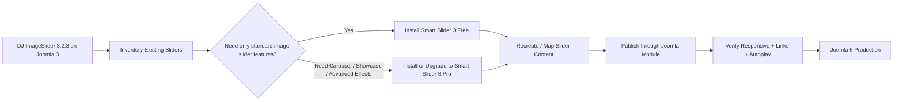
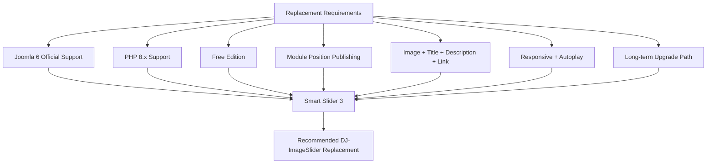
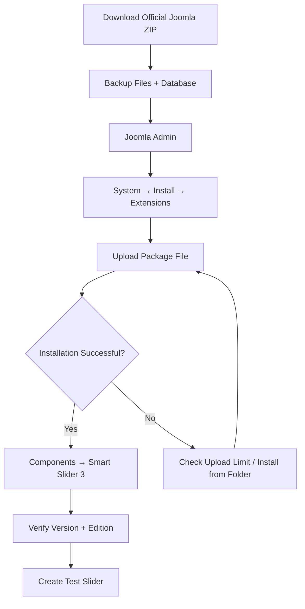
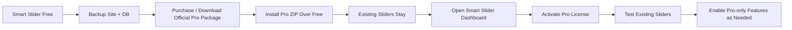
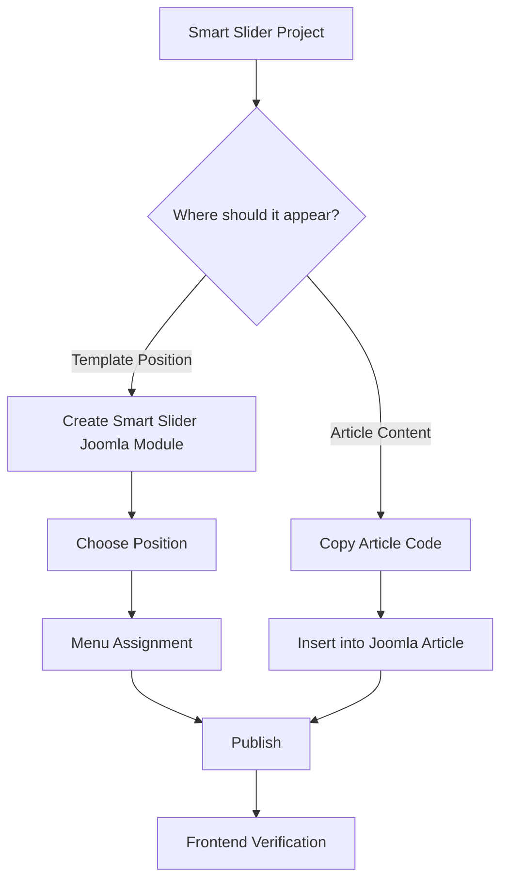
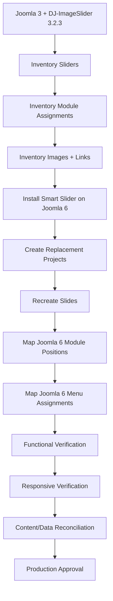
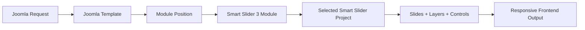
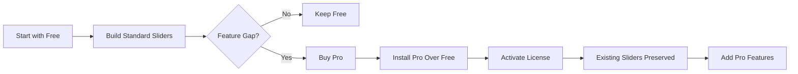
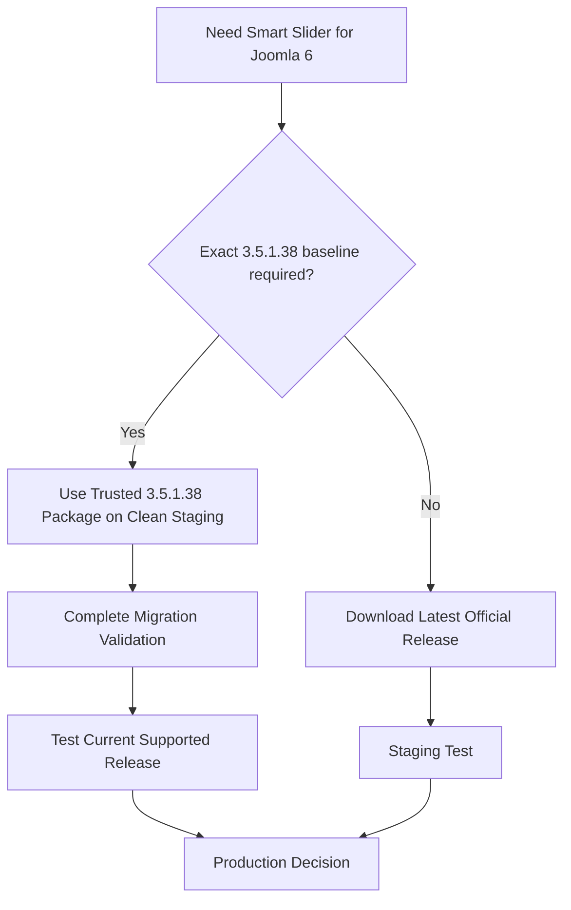

# Smart Slider 3 3.5.1.38 — Joomla 6 Installation, Usage & DJ-ImageSlider Replacement Guide

> **Edition:** Free / Pro  
> **Baseline version:** 3.5.1.38  
> **Developer:** Nextend / Smart Slider 3  
> **Extension type:** Joomla component + publishing integration/module  
> **Joomla target:** Joomla 6.x  
> **Target runtime:** PHP 8.4  
> **Legacy extension being replaced:** DJ-ImageSlider 3.2.3  
> **Recommended migration direction:** Fresh Smart Slider installation + controlled recreation/migration of slider content  
> **Guide reviewed:** 2026-08-11

> [!IMPORTANT]
> **Version 3.5.1.38 is the migration baseline documented in this guide, but it is no longer the newest release.** Smart Slider 3.5.1.39 was released on 2026-08-07 and includes additional security improvements. For a fresh production installation, prefer the latest supported release unless the project intentionally pins 3.5.1.38 for migration validation.

> [!CAUTION]
> Do not downgrade a newer Smart Slider installation to 3.5.1.38. The vendor warns that Smart Slider updates are not designed to be backwards compatible. If exact 3.5.1.38 validation is required, install a trusted 3.5.1.38 package on a clean staging environment instead of downgrading.

---

<a id="top"></a>
<a id="summary"></a>

## Table of Contents

- [1. Quick Summary](#1-quick-summary)
- [2. Why Smart Slider 3 Was Selected](#2-why-smart-slider-3-was-selected)
- [3. Compatibility and Version Baseline](#3-compatibility-and-version-baseline)
- [4. DJ-ImageSlider 3.2.3 Replacement Options](#4-dj-imageslider-323-replacement-options)
- [5. Download](#5-download)
- [6. Install on Joomla 6](#6-install-on-joomla-6)
- [7. Discover and Verify the Installation](#7-discover-and-verify-the-installation)
- [8. Upgrade from Free to Pro](#8-upgrade-from-free-to-pro)
- [9. Feature Support Matrix](#9-feature-support-matrix)
- [10. Step-by-Step Usage Guide](#10-step-by-step-usage-guide)
- [11. Publish a Slider in Joomla 6](#11-publish-a-slider-in-joomla-6)
- [12. DJ-ImageSlider to Smart Slider Mapping](#12-dj-imageslider-to-smart-slider-mapping)
- [13. Migration and Runtime Flows](#13-migration-and-runtime-flows)
- [14. Production and Security Notes](#14-production-and-security-notes)
- [15. Verification Checklist](#15-verification-checklist)
- [16. Troubleshooting](#16-troubleshooting)
- [17. Official Documentation and Tutorials](#17-official-documentation-and-tutorials)
- [18. Final Recommendation](#18-final-recommendation)

---

## 1. Quick Summary

**Recommended replacement:** Smart Slider 3.

For a Joomla 3 → Joomla 6 migration where the old site uses **DJ-ImageSlider 3.2.3**, Smart Slider 3 is the preferred replacement because it has official Joomla 6 support, a usable Free edition, Joomla module publishing, a modern responsive editor, active maintenance, and a direct Free → Pro upgrade path that preserves existing sliders.

| Item | Assessment |
|---|---|
| Smart Slider 3.5.1.38 | ✅ Valid Joomla 6-capable migration baseline |
| Joomla 6 support | ✅ Officially supported |
| PHP 8 | ✅ Officially supported; target PHP 8.4 is appropriate with Joomla 6 |
| Free edition | ✅ Available for Joomla |
| Joomla module publishing | ✅ Supported |
| Article publishing | ✅ Supported |
| Responsive sliders | ✅ Supported |
| Simple image/title/text/link slider | ✅ Covered by Free edition |
| Free → Pro upgrade | ✅ Install Pro over Free; existing sliders remain |
| Direct DJ-ImageSlider importer | ⚠️ No official direct importer verified |
| Recommended migration method | ✅ Fresh install + controlled recreation/data mapping |
| Production recommendation today | 🟢 Prefer the latest supported release; use 3.5.1.38 only when intentionally pinned |

### Recommended decision



**Jump to:** [Download](#5-download) · [Install](#6-install-on-joomla-6) · [Free → Pro](#8-upgrade-from-free-to-pro) · [Usage](#10-step-by-step-usage-guide) · [Replacement comparison](#4-dj-imageslider-323-replacement-options)

[Back to top](#top)

---

## 2. Why Smart Slider 3 Was Selected

Smart Slider 3 is not the only possible replacement for DJ-ImageSlider. It is selected because it provides a good balance between **compatibility, maintainability, feature coverage, migration safety, documentation, and future growth**.

### Main reasons

1. **Official Joomla 6 support**
   - Smart Slider documentation explicitly supports Joomla 3.9 or greater, including Joomla 4, Joomla 5, and Joomla 6.

2. **PHP 8 support**
   - The vendor requires PHP 7.4+ and explicitly supports PHP 8.
   - This fits a Joomla 6 / PHP 8.4 target environment.

3. **A real Free edition for Joomla**
   - The Free package is not only a trial.
   - It can create useful production sliders without immediately purchasing Pro.

4. **DJ-ImageSlider core use cases are covered**
   - Image/background.
   - Slide title.
   - Description/text.
   - Links/buttons.
   - Responsive behavior.
   - Autoplay.
   - Arrows and bullets.
   - Joomla module positions.

5. **Clean Free → Pro upgrade path**
   - The Pro package can be installed over Free on Joomla.
   - Existing sliders remain.

6. **Strong Joomla publishing options**
   - Joomla module.
   - Article embed.
   - PHP/template integration when necessary.

7. **Active maintenance**
   - Joomla 6 compatibility was added in the 3.5.1.x release line.
   - Recent releases continue to include security and compatibility improvements.

### Trade-off

Smart Slider is more feature-rich and therefore heavier than a very small slideshow module such as Slideshow CK. If the site only needs an extremely simple static image slideshow, Slideshow CK is a reasonable lighter alternative. Smart Slider is selected here because it provides more room for future Joomla 6 requirements without coupling the slider to a page builder.

[Back to summary](#summary)

---

## 3. Compatibility and Version Baseline

### 3.1 Smart Slider 3.5.1.38

Smart Slider 3.5.1.38 was released on **2026-06-25**.

The vendor changelog lists:

- A fix related to Events Manager recurring events.
- Security improvements.

Official changelog:

<https://smartslider.helpscoutdocs.com/article/1746-changelog>

### 3.2 Joomla and PHP requirements

Official requirements:

<https://smartslider.helpscoutdocs.com/article/1716-system-requirements>

| Requirement | Vendor status | Project assessment |
|---|---|---|
| Joomla 6 | Supported | ✅ Target-compatible |
| Joomla 5 | Supported | ✅ |
| Joomla 4 | Supported | ✅ |
| Joomla 3.9+ | Supported by Smart Slider | Legacy platform only |
| PHP 7.4+ | Minimum Smart Slider requirement | ✅ |
| PHP 8.x | Supported | ✅ |
| PHP 8.4 target | Compatible direction for Joomla 6 | ✅ Validate complete site on staging |
| GD extension | Required/recommended by Smart Slider | ✅ Verify enabled |
| Upload limit | Vendor recommends at least 8 MB | ✅ Verify before ZIP upload |
| Smart Slider memory baseline | 64 MB minimum stated by vendor | Prefer Joomla/site baseline of 256 MB+ |

> [!NOTE]
> Smart Slider compatibility does not prove that every Joomla template or third-party extension on the site supports PHP 8.4. Verify the complete Joomla 6 stack separately.

### 3.3 Current release note

As of this guide review date, the vendor changelog also lists:

- **3.5.1.39 — 2026-08-07**
- AVIF support.
- Update-checker caching.
- Security improvements.
- Animated WebP optimization fix.

Therefore:

- **Migration baseline requested by this project:** 3.5.1.38.
- **Fresh production installation:** prefer 3.5.1.39 or later after normal staging validation.

Do not install a newer version and then downgrade to 3.5.1.38.

[Back to summary](#summary)

---

## 4. DJ-ImageSlider 3.2.3 Replacement Options

The table below compares practical Joomla 6 replacement directions.

| Replacement | Joomla 6 | PHP 8.4 direction | Free option | DJ-ImageSlider feature fit | Main advantage | Main disadvantage | Recommendation |
|---|:---:|:---:|:---:|:---:|---|---|---|
| **Smart Slider 3 3.5.1.38+** | ✅ Official | ✅ PHP 8 supported | ✅ | **High** | Modern editor, module publishing, strong Free edition, Pro upgrade path, extensive docs | More features/code than a minimal slideshow | **✅ Selected** |
| **Slideshow CK 2.9.x** | ✅ Official | ⚠️ Validate exact runtime on staging | ✅ | **High for simple slideshows** | Lightweight, direct image/video slideshow concept, Joomla 6 support | Less powerful than Smart Slider for complex layouts and future expansion | ✅ Strong alternative |
| **SP Page Builder 6.7.1 Carousel** | ✅ Official | ✅ Vendor lists PHP 8.2/8.3/8.4 | ✅ Lite / Pro available | Medium–High | Excellent when the site already builds pages in SP Page Builder | Couples slider content to a page-builder workflow; heavier dependency for slider-only use | ⚠️ Use when slider belongs to SPPB pages |
| **DJ-ImageSlider 4.6.6** | ❌ No official Joomla 6 release verified | ✅ Code upgraded for PHP 8.x | ✅ | **Native continuation** | Closest continuation of the old extension | Vendor release is documented for Joomla 5, not Joomla 6 | ❌ Do not select as Joomla 6 production target |

### Why Smart Slider wins for this migration



### Alternative vendor references

**Slideshow CK**  
<https://www.joomlack.fr/en/joomla-extensions/slideshow-ck>

The vendor lists Joomla 6 compatibility and provides image/video slides, responsive behavior, drag-and-drop slide management, title, description, and links.

**SP Page Builder 6**  
<https://www.joomshaper.com/documentation/sp-page-builder/technical-requirements>  
<https://www.joomshaper.com/documentation/sp-page-builder/carousel>

The vendor lists Joomla 5/6 and PHP 8.2/8.3/8.4 support for current SP Page Builder 6.x.

**DJ-ImageSlider changelog**  
<https://panel.dj-extensions.com/knowledgebase/176/Changelog---DJ-ImageSlider.html>

DJ-ImageSlider 4.6.6 is documented as a Joomla 5 release.

[Back to summary](#summary)

---

## 5. Download

### 5.1 Smart Slider 3 Free — official Joomla page

Use the official Smart Slider website:

<https://smartslider3.com/free-joomla-slider/>

The page provides the Joomla Free download flow.

### 5.2 Smart Slider account / Pro downloads

For Pro purchases and licensed downloads:

<https://secure.nextendweb.com/>

### 5.3 Official installation documentation

<https://smartslider.helpscoutdocs.com/article/2043-joomla-4-installation>

The same documented installation flow applies to Joomla 4, Joomla 5, and Joomla 6.

### 5.4 Exact 3.5.1.38 package warning

The public Free download page normally serves the **current release**, not a permanently pinned historical 3.5.1.38 ZIP.

If the project must test **exactly 3.5.1.38**:

1. Use a package previously downloaded directly from Smart Slider/Nextend, or obtain the exact package through the official vendor account/support channel.
2. Verify that the package is really the Joomla package.
3. Keep its checksum internally if the migration project requires repeatable builds.
4. Do not obtain the package from unofficial “nulled”, warez, torrent, or mirror sites.
5. Do not install a newer release and then downgrade to 3.5.1.38.

> [!IMPORTANT]
> For a fresh production build today, use the newest supported Smart Slider package from the official source unless the migration test explicitly requires a 3.5.1.38 baseline.

[Back to summary](#summary)

---

## 6. Install on Joomla 6

### 6.1 Pre-install checklist

Before installation:

- [ ] Create a Joomla files backup.
- [ ] Create a full database backup.
- [ ] Confirm Joomla 6 is working before adding Smart Slider.
- [ ] Confirm PHP 8.4 is working with the current Joomla stack.
- [ ] Confirm PHP GD is enabled.
- [ ] Confirm PHP upload limit is at least 8 MB where possible.
- [ ] Download the Joomla Smart Slider package only from the official source.
- [ ] Record the package version.

### 6.2 Recommended installation method — Upload Package File

1. Log in to Joomla Administrator.
2. Go to:

```text
System
└── Install
    └── Extensions
```

3. Open **Upload Package File**.
4. Select the Smart Slider Joomla ZIP.

Typical package naming:

```text
Free:
smartslider3-joomla-3.x.x.x.zip

Pro:
smartslider3-joomla-3.x.x.x-pro.zip
```

5. Wait for Joomla to finish installing the package.
6. Confirm the installation success message.
7. Open:

```text
Components → Smart Slider 3
```

8. Open the Smart Slider information/version popup on its Dashboard.
9. Verify:
   - Installed version.
   - Free or Pro edition.
10. Clear Joomla/browser cache if the administrator UI appears stale.

### 6.3 Installation flow



### 6.4 Install from Folder fallback

If ZIP upload fails because of server upload limits:

1. Extract the official installer.
2. Upload the extracted package directory into the Joomla `tmp` directory.
3. Go to:

```text
System → Install → Extensions → Install from Folder
```

4. Enter the correct extracted directory path.
5. Select **Check & Install**.
6. Verify Smart Slider under `Components → Smart Slider 3`.

Refer to the official installation documentation for the exact current package structure:

<https://smartslider.helpscoutdocs.com/article/2043-joomla-4-installation>

[Back to summary](#summary)

---

## 7. Discover and Verify the Installation

### 7.1 Normal installation: Discover is not required

For the normal ZIP installation described above, Joomla's **Discover** function should not be the primary installation path.

After a successful installation, verify Smart Slider through:

```text
Components → Smart Slider 3
```

and:

```text
System → Manage → Extensions
```

Search for terms such as:

```text
Smart Slider
Nextend
```

Confirm that the expected Smart Slider entries are installed/enabled.

### 7.2 Joomla Discover — only for manually copied extension files

Joomla Discover is useful when extension files were manually copied to the filesystem but Joomla has not registered them in the extension database.

Use:

```text
System
└── Install
    └── Discover
```

Then:

1. Click **Discover** / **Discover extensions to install**.
2. Review the discovered entries carefully.
3. Select only the expected Smart Slider/related entries.
4. Click **Install**.
5. Return to `System → Manage → Extensions` and verify registration.

> [!CAUTION]
> Do not manually copy partial Smart Slider files and use Discover as a substitute for a normal package installation unless there is a controlled recovery reason. Smart Slider is a packaged extension with multiple integration pieces; the official installer is the preferred method.

### 7.3 Verification after install

- [ ] `Components → Smart Slider 3` opens without fatal errors.
- [ ] Version shown is the intended version.
- [ ] Edition shown is Free or Pro as expected.
- [ ] Joomla `System → Manage → Extensions` shows Smart Slider-related entries.
- [ ] No new PHP 8.4 fatal error appears.
- [ ] No new Joomla administrator JavaScript error appears.
- [ ] A blank test project can be created.

[Back to summary](#summary)

---

## 8. Upgrade from Free to Pro

Smart Slider officially supports upgrading Joomla from Free to Pro by **installing the Pro package over the Free package**.

Official guide:

<https://smartslider.helpscoutdocs.com/article/1918-upgrading-from-free-to-pro>

### 8.1 Upgrade flow



### 8.2 Step-by-step

1. Back up the Joomla files and database.
2. Purchase the appropriate Smart Slider Pro license if required.
3. Log in to the official Nextend account.
4. Download the official **Joomla Pro** package.
5. Do **not** uninstall the Free edition first.
6. Go to:

```text
System → Install → Extensions
```

7. Upload and install the Pro package over the Free package.
8. Open:

```text
Components → Smart Slider 3
```

9. Confirm the Dashboard reports the **Pro** edition.
10. Use the activation box on the Dashboard.
11. Log in with the Nextend account used for the purchase.
12. Select the correct package/license and activate it.
13. Re-test all existing sliders.

Official activation guide:

<https://smartslider.helpscoutdocs.com/article/1718-activation>

### 8.3 What remains after the upgrade?

According to Smart Slider's Joomla upgrade documentation:

- Existing sliders remain.
- The Pro package is installed over Free.
- Pro features become available after installation/activation.

### 8.4 When should this project buy Pro?

Keep **Free** if the legacy DJ-ImageSlider usage only needs:

```text
Image
+ title
+ description
+ link
+ standard navigation
+ autoplay
+ responsive output
+ Joomla module position
```

Consider **Pro** if the migrated design requires:

- Carousel slider type.
- Showcase slider type.
- Fullpage layout.
- Advanced animation effects.
- Advanced layers.
- Lightbox.
- More Joomla/third-party dynamic generators.
- WebP conversion/advanced optimization features.
- Scheduled slide publishing.

[Back to summary](#summary)

---

## 9. Feature Support Matrix

The following table focuses on features relevant to a DJ-ImageSlider replacement and common Joomla slider use cases.

| Feature | Free | Pro | Typical use | Official documentation / tutorial |
|---|:---:|:---:|---|---|
| Simple slider | ✅ | ✅ | Standard one-slide-at-a-time image slider | <https://smartslider.helpscoutdocs.com/article/1780-simple-slider-type> |
| Block / hero | ✅ | ✅ | One responsive hero/banner | <https://smartslider.helpscoutdocs.com/article/1800-block-type> |
| Carousel slider type | ❌ | ✅ | Multiple full slides visible at once | <https://smartslider.helpscoutdocs.com/article/1786-carousel-slider-type> |
| Showcase slider type | ❌ | ✅ | Center-active slider with surrounding slides | <https://smartslider.helpscoutdocs.com/article/1799-showcase-slider-type> |
| Boxed layout | ✅ | ✅ | Fit slider inside container | <https://smartslider.helpscoutdocs.com/article/1808-slider-settings> |
| Full-width layout | ✅ | ✅ | Site-width hero/slideshow | <https://smartslider.helpscoutdocs.com/article/1808-slider-settings> |
| Fullpage layout | ❌ | ✅ | Full browser width + height | <https://smartslider.helpscoutdocs.com/article/1777-fullpage-layout> |
| Drag-and-drop editor | ✅ | ✅ | Visual slide building | <https://smartslider3.com/free-joomla-slider/> |
| Heading layer | ✅ | ✅ | Slide title | <https://smartslider.helpscoutdocs.com/article/1814-heading-layer> |
| Text layer | ✅ | ✅ | Description/content | <https://smartslider.helpscoutdocs.com/article/1832-text-layer> |
| Image layer | ✅ | ✅ | Additional images/logos | <https://smartslider.helpscoutdocs.com/article/1855-layers> |
| Button layer | ✅ | ✅ | CTA / link button | <https://smartslider.helpscoutdocs.com/article/1834-button-layer> |
| YouTube / Vimeo layers | ✅ | ✅ | Video content | <https://smartslider.helpscoutdocs.com/article/1855-layers> |
| Advanced layers | Limited | ✅ | Icon, caption, animated heading, iframe, audio, counters, etc. | <https://smartslider.helpscoutdocs.com/article/1855-layers> |
| Responsive behavior | ✅ | ✅ | Desktop/tablet/mobile | <https://smartslider3.com/free-joomla-slider/> |
| Autoplay configuration | ✅ | ✅ | Automatic slide switching | <https://smartslider.helpscoutdocs.com/article/1808-slider-settings> |
| Navigation controls | ✅ | ✅ | Arrows/bullets/thumbnails depending on configuration | <https://smartslider.helpscoutdocs.com/article/1808-slider-settings> |
| Joomla module publishing | ✅ | ✅ | Place slider in Joomla template positions | <https://smartslider.helpscoutdocs.com/article/2088-publishing-on-joomla-4> |
| Joomla article publishing | ✅ | ✅ | Embed slider in article content | <https://smartslider.helpscoutdocs.com/article/2088-publishing-on-joomla-4> |
| Joomla Articles dynamic generator | ✅ | ✅ | Generate slides from Joomla articles | <https://smartslider.helpscoutdocs.com/article/1864-joomla-articles-generator> |
| Third-party Joomla generators | Limited | ✅ broader set | VirtueMart, EasyBlog, RSEvents and others | <https://smartslider.helpscoutdocs.com/article/1923-free-vs-pro> |
| Lightbox | ❌ / limited by feature context | ✅ | Open media in overlay | <https://smartslider.helpscoutdocs.com/article/1923-free-vs-pro> |
| Advanced image optimization / WebP tooling | Limited | ✅ | Delivery optimization | <https://smartslider.helpscoutdocs.com/article/1923-free-vs-pro> |
| Scheduled slide publish/unpublish | ❌ | ✅ | Campaign/time-based slides | <https://smartslider.helpscoutdocs.com/article/1923-free-vs-pro> |
| Import Free templates | ✅ | ✅ | Start from sample sliders | <https://smartslider.helpscoutdocs.com/article/1827-add-sample-slider> |

> [!NOTE]
> Smart Slider evolves continuously. If an option is critical to production, verify it in the exact package installed on staging rather than relying only on a generic Free/Pro assumption.

### Full documentation index

<https://smartslider.helpscoutdocs.com/>

This documentation includes:

- Installation & Update.
- Publishing.
- Tutorials.
- Slider Settings.
- Layer Options.
- Dynamic Slides.
- Animations.
- Global Settings.
- Developer documentation.
- Troubleshooting.

[Back to summary](#summary)

---

## 10. Step-by-Step Usage Guide

This section creates a simple slider equivalent to a common DJ-ImageSlider setup.

### Target example

```text
Slide 1
├── Background image
├── Title
├── Description
└── CTA link

Slide 2
├── Background image
├── Title
├── Description
└── CTA link

Behavior
├── Responsive
├── Autoplay
├── Arrows
└── Bullets
```

### Step 1 — Open Smart Slider

From Joomla Administrator:

```text
Components → Smart Slider 3
```

You should reach the Smart Slider Dashboard.

### Step 2 — Create a new project

1. Click **New Project**.
2. Select **Create a New Project**.
3. Choose **Slider**.
4. For the Free edition, select **Simple**.
5. Enter a clear project name, for example:

```text
Homepage Hero Slider
```

6. Configure the initial size according to the old site's design.
7. Select the intended responsive layout:
   - Boxed, or
   - Full width.
8. Create the project.

Official New Project guide:

<https://smartslider.helpscoutdocs.com/article/1784-new-project>

### Step 3 — Create the first slide

1. Add a new blank slide.
2. Select/upload the background image.
3. Add meaningful image alternative text where available.
4. Add a **Heading** layer for the title.
5. Add a **Text** layer for the description.
6. Add a **Button** layer if the old slide has a CTA.
7. Configure the slide or button link.
8. Save the slide.

### Step 4 — Recreate the remaining DJ-ImageSlider slides

For each old DJ-ImageSlider slide:

1. Record the old slide order.
2. Copy/reuse the original image from the controlled media migration.
3. Recreate the title.
4. Recreate the description.
5. Recreate the link.
6. Confirm the target URL is still valid in Joomla 6.
7. Match the required ordering.
8. Save.

Do not blindly copy legacy HTML if the old description contains obsolete Joomla 3 classes or scripts. Recreate the visual content with Smart Slider layers when practical.

### Step 5 — Configure size and responsiveness

Open the slider settings and review the **Size** options.

Test at minimum:

- Desktop.
- Tablet.
- Mobile.

Verify that:

- Text does not overflow.
- Buttons remain clickable.
- Important image areas are not cropped incorrectly.
- Slider height is reasonable.
- There is no unexpected horizontal scrollbar.

### Step 6 — Configure controls

Open:

```text
Slider Settings → Controls
```

Enable/configure the controls required by the legacy design, for example:

- Arrows.
- Bullets.
- Thumbnails if required and available in the desired configuration.

Keep controls simple if the objective is a close DJ-ImageSlider replacement rather than a redesign.

### Step 7 — Configure autoplay

Open:

```text
Slider Settings → Autoplay
```

Configure autoplay to match the old site behavior.

Verify:

- Delay/duration feels correct.
- Manual navigation still works.
- Autoplay does not make content unreadable.
- Mobile behavior is acceptable.

### Step 8 — Preview before publishing

Use Smart Slider's preview tools.

Verify each slide:

- Correct image.
- Correct title.
- Correct description.
- Correct link.
- Correct order.
- Correct responsive behavior.

### Step 9 — Save and publish

Use the Joomla module publishing method described in the next section.

[Back to summary](#summary)

---

## 11. Publish a Slider in Joomla 6

Official publishing guide:

<https://smartslider.helpscoutdocs.com/article/2088-publishing-on-joomla-4>

The Joomla 4, 5, and 6 publishing workflow is documented together by Smart Slider.

### 11.1 Recommended method — Joomla module

This is the closest replacement for a DJ-ImageSlider module assigned to a Joomla template position.

#### Method A — Create module from Smart Slider

1. Open the target slider.
2. Go to:

```text
Slider Settings → General
```

3. Find the **Publish** section.
4. Click **Create module**.
5. Joomla creates a Smart Slider module.
6. Open the created module.
7. Select the correct Joomla template position.
8. Set:

```text
Status: Published
Access: Public
Language: All
```

or use the exact access/language rules required by the site.

9. Open **Menu Assignment**.
10. Assign the slider to the required pages.
11. Save.
12. Open the frontend and verify the result.

#### Method B — Create Joomla module manually

Go to:

```text
Content → Site Modules → New
```

Then:

1. Select **Smart Slider 3**.
2. Select the slider from the dropdown.
3. Choose the template position.
4. Configure status/access/language.
5. Configure Menu Assignment.
6. Save and verify.

### 11.2 Publish inside a Joomla article

Smart Slider also supports article publishing.

1. Open the target slider.
2. Copy the generated article code shown by Smart Slider.
3. Edit the Joomla article.
4. Insert the code at the required location.
5. Save.
6. Verify the article frontend output.

### 11.3 Publishing flow



### 11.4 Module-position verification

If the desired template position is unknown:

1. Go to Joomla template settings.
2. Enable **Preview Module Positions**.
3. Preview the active site template.
4. Identify the required position.
5. Assign the Smart Slider module to that position.

[Back to summary](#summary)

---

## 12. DJ-ImageSlider to Smart Slider Mapping

There is no official direct DJ-ImageSlider → Smart Slider importer verified for this guide.

Treat the migration as a controlled mapping/recreation task.

| DJ-ImageSlider concept | Smart Slider equivalent | Migration note |
|---|---|---|
| Slider/category grouping | Smart Slider project / project organization | Recreate intentionally; data model is not identical |
| Slide title | Heading layer / slide name | Preserve visible title and semantic heading level |
| Slide description | Text layer | Review legacy HTML before copying |
| Slide image | Slide background or Image layer | Use background for hero-style slides; Image layer for positioned content |
| Slide URL/link | Slide link or Button link | Re-test routes after Joomla 3 → 6 migration |
| Slide ordering | Smart Slider slide order | Preserve legacy order unless redesign is approved |
| Published item | Active/available slide configuration | Verify exact edition/version options |
| Autoplay | Slider Settings → Autoplay | Match legacy delay only if UX is still acceptable |
| Navigation arrows | Controls | Recreate visually |
| Navigation bullets | Controls | Recreate visually |
| Joomla module | Smart Slider 3 Joomla module | Preferred publishing mapping |
| Module position | Joomla module position | Map old template position to Joomla 6 template position |
| Menu assignment | Joomla module Menu Assignment | Rebuild against Joomla 6 menu items |

### Migration rule

Do **not** assume that the two extensions have compatible database schemas.

Avoid direct SQL inserts into Smart Slider tables until all of the following are known:

- Smart Slider table inventory.
- Field semantics.
- Serialized/JSON structures.
- Internal IDs and relationships.
- Version-specific schema.
- Media paths.
- Generated/cache data that should not be migrated.

For a small or medium number of sliders, controlled recreation through the Smart Slider UI is usually safer than reverse-engineering and directly writing into Smart Slider's internal tables.

### Suggested migration inventory

For each DJ-ImageSlider slide record, capture:

| Field | Required |
|---|:---:|
| Legacy slide ID | ✅ |
| Legacy slider/category | ✅ |
| Title | ✅ |
| Description | ✅ |
| Image path | ✅ |
| Link URL | ✅ |
| Link target | ✅ |
| Ordering | ✅ |
| Published state | ✅ |
| Start/end publication dates if used | ✅ |
| Module instance using the slider | ✅ |
| Joomla module position | ✅ |
| Menu assignment | ✅ |
| Language | ✅ |
| Access level | ✅ |

[Back to summary](#summary)

---

## 13. Migration and Runtime Flows

### 13.1 Migration flow



### 13.2 Runtime flow



### 13.3 Free → Pro lifecycle



[Back to summary](#summary)

---

## 14. Production and Security Notes

### 14.1 Important 2026 supply-chain incident

Smart Slider 3 Pro **3.5.1.35** installers were compromised after the vendor's server was hacked.

The vendor released **3.5.1.36** to remove the malicious code and published a Joomla-specific remediation advisory.

Official Joomla security advisory:

<https://smartslider.helpscoutdocs.com/article/2143-joomla-security-advisory-smart-slider-3-pro-3-5-1-35-compromise>

### 14.2 What this means for 3.5.1.38

3.5.1.38 is newer than the repaired 3.5.1.36 release and its changelog includes additional security improvements.

However:

- A server that previously installed compromised **3.5.1.35 Pro** must not be considered clean just because it was later updated.
- Follow the vendor remediation guide if 3.5.1.35 was ever installed.
- Use fresh official packages.

### 14.3 Production baseline recommendation

For production:

1. Do not use 3.5.1.35.
2. Do not use unofficial/nulled Smart Slider packages.
3. Keep a backup before updates.
4. Test updates on staging.
5. Use the newest supported Smart Slider version unless a documented compatibility lock requires otherwise.
6. If the migration plan must validate 3.5.1.38 specifically, complete validation on 3.5.1.38 and then separately test the current release before go-live.
7. Do not downgrade Smart Slider after upgrading.

### 14.4 Current-version decision flow



[Back to summary](#summary)

---

## 15. Verification Checklist

### Installation

- [ ] Official Joomla package used.
- [ ] Joomla installation completed successfully.
- [ ] `Components → Smart Slider 3` opens.
- [ ] Intended version confirmed.
- [ ] Free/Pro edition confirmed.
- [ ] No PHP 8.4 fatal errors.

### Functional

- [ ] New project can be created.
- [ ] New slide can be created.
- [ ] Image can be selected/uploaded.
- [ ] Heading renders correctly.
- [ ] Text renders correctly.
- [ ] Button/link works.
- [ ] Slide ordering works.
- [ ] Autoplay works if enabled.
- [ ] Arrows work.
- [ ] Bullets work if enabled.

### Joomla integration

- [ ] Smart Slider module can be created.
- [ ] Slider can be selected in module settings.
- [ ] Correct Joomla 6 template position is used.
- [ ] Module status is correct.
- [ ] Access is correct.
- [ ] Language is correct.
- [ ] Menu Assignment is correct.
- [ ] Slider appears only on intended pages.

### Responsive

- [ ] Desktop layout checked.
- [ ] Tablet layout checked.
- [ ] Mobile layout checked.
- [ ] Text does not overflow.
- [ ] Image crop is acceptable.
- [ ] Buttons remain usable.
- [ ] No horizontal overflow is introduced.

### DJ-ImageSlider migration reconciliation

For each migrated slider:

- [ ] Legacy slide count recorded.
- [ ] New slide count matches expected count.
- [ ] Titles reconciled.
- [ ] Descriptions reconciled.
- [ ] Images reconciled.
- [ ] Links reconciled.
- [ ] Ordering reconciled.
- [ ] Module position mapped.
- [ ] Menu assignment mapped.
- [ ] Language/access rules mapped.

### Production

- [ ] No compromised 3.5.1.35 Pro package was installed on this environment, or vendor remediation was completed.
- [ ] Backup completed.
- [ ] Joomla cache cleared after update/install where required.
- [ ] Browser console reviewed.
- [ ] Joomla logs reviewed.
- [ ] Staging verification passed.
- [ ] Current Smart Slider release evaluated before final production approval.

[Back to summary](#summary)

---

## 16. Troubleshooting

### Problem: package upload fails

Possible cause:

```text
upload_max_filesize
post_max_size
```

Actions:

1. Check Joomla's displayed maximum upload size.
2. Increase PHP upload limits if appropriate.
3. Use the official **Install from Folder** method if upload cannot be increased.

Official installation troubleshooting:

<https://smartslider.helpscoutdocs.com/article/2043-joomla-4-installation>

### Problem: Smart Slider is installed but not visible

Check:

```text
Components → Smart Slider 3
```

Then:

```text
System → Manage → Extensions
```

Search for:

```text
Smart Slider
Nextend
```

If files were manually copied but not registered, review Joomla **System → Install → Discover**.

### Problem: slider exists but is not visible on frontend

Check:

1. Module status = Published.
2. Correct slider selected.
3. Correct Joomla template position.
4. Correct Menu Assignment.
5. Correct Access level.
6. Correct Language.
7. Template actually renders the selected module position.
8. Joomla/template/cache state.
9. Browser JavaScript console.

### Problem: slider appears on wrong pages

Review:

```text
Content → Site Modules → [Smart Slider module] → Menu Assignment
```

The slider is controlled by Joomla module assignment when published through a module.

### Problem: Free package does not provide required layout

Check whether the requirement is Pro-only.

Examples:

- Carousel → Pro.
- Showcase → Pro.
- Fullpage layout → Pro.
- Many advanced layers/effects → Pro.

Do not buy Pro automatically. Confirm the feature is actually required by the legacy site or approved redesign first.

### Problem: version is newer than 3.5.1.38

Do **not** downgrade.

If 3.5.1.38 must be validated:

1. Create a clean staging environment.
2. Install a trusted official 3.5.1.38 package there.
3. Run the migration validation independently.

[Back to summary](#summary)

---

## 17. Official Documentation and Tutorials

### Smart Slider official resources

| Resource | URL |
|---|---|
| Free Joomla download page | <https://smartslider3.com/free-joomla-slider/> |
| Documentation home | <https://smartslider.helpscoutdocs.com/> |
| Joomla 4/5/6 installation | <https://smartslider.helpscoutdocs.com/article/2043-joomla-4-installation> |
| System requirements | <https://smartslider.helpscoutdocs.com/article/1716-system-requirements> |
| Changelog | <https://smartslider.helpscoutdocs.com/article/1746-changelog> |
| Getting started | <https://smartslider.helpscoutdocs.com/article/2081-getting-started> |
| New project | <https://smartslider.helpscoutdocs.com/article/1784-new-project> |
| Slider settings | <https://smartslider.helpscoutdocs.com/article/1808-slider-settings> |
| Layers | <https://smartslider.helpscoutdocs.com/article/1855-layers> |
| Publishing on Joomla 4/5/6 | <https://smartslider.helpscoutdocs.com/article/2088-publishing-on-joomla-4> |
| Free vs Pro | <https://smartslider.helpscoutdocs.com/article/1923-free-vs-pro> |
| Upgrade Free → Pro | <https://smartslider.helpscoutdocs.com/article/1918-upgrading-from-free-to-pro> |
| Pro activation | <https://smartslider.helpscoutdocs.com/article/1718-activation> |
| Joomla Articles generator | <https://smartslider.helpscoutdocs.com/article/1864-joomla-articles-generator> |
| Import sample slider | <https://smartslider.helpscoutdocs.com/article/1827-add-sample-slider> |
| Joomla 3.5.1.35 security advisory | <https://smartslider.helpscoutdocs.com/article/2143-joomla-security-advisory-smart-slider-3-pro-3-5-1-35-compromise> |

### Alternative replacement resources

| Extension | URL |
|---|---|
| Slideshow CK | <https://www.joomlack.fr/en/joomla-extensions/slideshow-ck> |
| SP Page Builder requirements | <https://www.joomshaper.com/documentation/sp-page-builder/technical-requirements> |
| SP Page Builder Carousel | <https://www.joomshaper.com/documentation/sp-page-builder/carousel> |
| DJ-ImageSlider changelog | <https://panel.dj-extensions.com/knowledgebase/176/Changelog---DJ-ImageSlider.html> |

[Back to summary](#summary)

---

## 18. Final Recommendation

### Recommended migration target

```text
Joomla 3
+ DJ-ImageSlider 3.2.3
        ↓
Inventory legacy sliders/modules
        ↓
Joomla 6
+ Smart Slider 3 Free
        ↓
Recreate/map image + title + description + link
        ↓
Publish through Smart Slider Joomla module
        ↓
Verify data + layout + responsive + navigation
        ↓
Upgrade to Pro only if a verified feature gap exists
```

### Final decision table

| Question | Recommendation |
|---|---|
| Can Smart Slider replace normal DJ-ImageSlider usage? | ✅ Yes |
| Start with Free or Pro? | **Start with Free** |
| Buy Pro immediately? | ❌ No; only when a required feature is Pro-only |
| Use Smart Slider 3.5.1.38 for migration validation? | ✅ Yes, if intentionally pinned and package is trusted |
| Is 3.5.1.38 the newest production release as of 2026-08-11? | ❌ No; 3.5.1.39 is newer |
| Fresh production install today | Prefer latest official supported release after staging validation |
| Direct SQL migrate DJ-ImageSlider tables into Smart Slider? | ❌ Not without a separate schema/mapping analysis |
| Preferred content migration | Controlled recreation/mapping + reconciliation |
| Preferred Joomla publishing method | Smart Slider Joomla module |

**Project recommendation:** Use **Smart Slider 3 Free** as the initial replacement for DJ-ImageSlider 3.2.3. Validate all old slider requirements against the Free edition. Upgrade to Pro only if the actual migrated site requires Carousel, Showcase, Fullpage, advanced layers/effects, scheduling, or Pro-only integrations.

[Back to summary](#summary) · [Back to top](#top)
