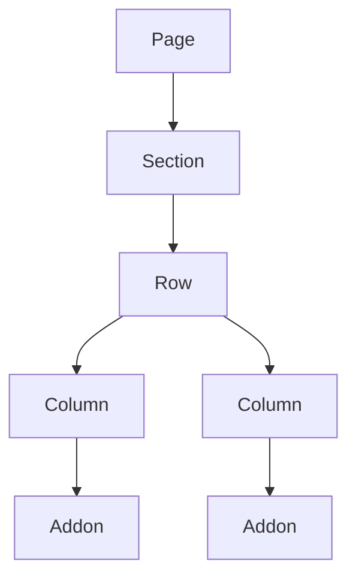
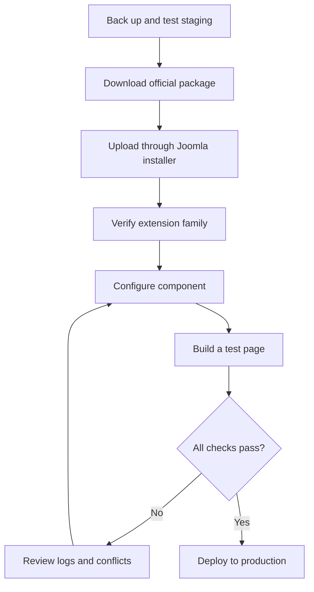
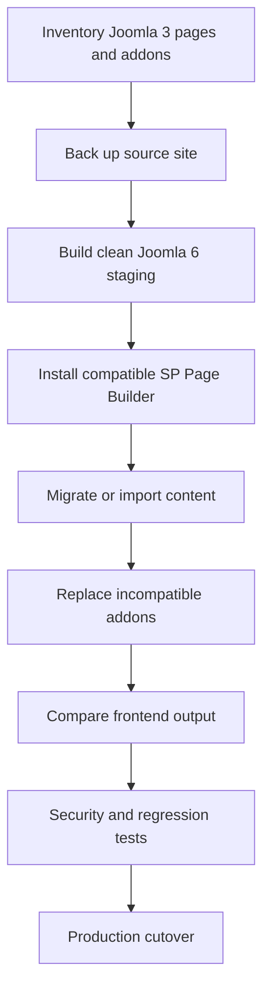

# SP Page Builder for Joomla 6

> Installation, Lite-to-Pro upgrade, configuration, migration, testing, and production-readiness guide.

<a id="document-overview"></a>

## Document overview

- [1. Scope and product overview](#scope)
- [2. Editions and official resources](#editions-and-resources)
- [3. Architecture and feature map](#architecture-and-features)
- [4. Pre-installation checklist](#pre-installation)
- [5. Recommended installation](#recommended-installation)
- [6. Alternative installation methods](#alternative-installation)
- [7. Upgrade from Lite to Pro](#lite-to-pro)
- [8. Initial configuration](#initial-configuration)
- [9. Build and publish a page](#build-a-page)
- [10. Advanced features](#advanced-features)
- [11. Joomla 3 to Joomla 6 migration](#migration)
- [12. Updates and subscription expiry](#updates)
- [13. Verification and security testing](#verification)
- [14. Troubleshooting](#troubleshooting)
- [15. Production acceptance checklist](#production-checklist)
- [16. Final recommendation](#final-recommendation)

---

<a id="scope"></a>

## 1. Scope and product overview

SP Page Builder is a visual page-building extension developed by JoomShaper. It lets administrators and content editors create Joomla pages with sections, rows, columns, and reusable addons instead of writing every layout in HTML, CSS, and JavaScript.

| Field | Value |
|---|---|
| Extension | SP Page Builder |
| Vendor | JoomShaper |
| Main component | `com_sppagebuilder` |
| Editions | Lite and Pro |
| Target platform | Joomla 6 |
| Recommended installer | Upload Package File |
| Alternative installer | Install from Folder |
| Discover | Recovery or advanced manual installation only |
| Lite-to-Pro path | Install the Pro package over Lite |
| Uninstall Lite first | No |

Typical use cases include:

- Home and landing pages
- Service, product, campaign, and contact pages
- Advanced Joomla Article layouts
- Reusable module content
- Popups and forms
- Dynamic index and detail pages
- Portfolios, directories, projects, recipes, and property listings

> [!IMPORTANT]
> Feature availability varies by edition and release. Confirm the current Lite/Pro comparison and Joomla compatibility on JoomShaper's official website before deployment.

---

<a id="editions-and-resources"></a>

## 2. Editions and official resources

### 2.1 Lite and Pro

| Capability | Lite | Pro |
|---|---:|---:|
| Visual page building | Yes | Yes |
| Basic addons | Yes | Yes |
| Advanced addons and options | Limited | Yes |
| Premium layouts and blocks | Limited | Yes |
| Vendor updates | Yes | Requires an active entitlement for Pro updates |
| Vendor support | Community/basic | Subscription-dependent |

Official resources:

- [SP Page Builder Lite product page](https://www.joomshaper.com/joomla-extensions/sp-page-builder-lite-next)
- [SP Page Builder Lite download](https://www.joomshaper.com/downloads/extension/sp-page-builder-lite-next)
- [SP Page Builder product page](https://www.joomshaper.com/page-builder)
- [JoomShaper pricing](https://www.joomshaper.com/pricing)
- [SP Page Builder Pro download](https://www.joomshaper.com/downloads/extension/sp-page-builder-pro-next)
- [Official documentation](https://www.joomshaper.com/documentation/sp-page-builder)
- [Installation and update guide](https://www.joomshaper.com/documentation/sp-page-builder/installation-update)
- [Installation notes](https://www.joomshaper.com/documentation/sp-page-builder/installation-notes)

Download packages only from JoomShaper. Before installation, verify:

- Package version and release date
- Joomla compatibility
- Changelog and known issues
- Correct Joomla installation package
- Valid subscription access for Pro

---

<a id="architecture-and-features"></a>

## 3. Architecture and feature map

### 3.1 Page hierarchy



This structure supports responsive grids, nested layouts, boxed or full-width sections, gaps, backgrounds, overlays, shape dividers, and device-specific controls.

### 3.2 Core capabilities

| Area | Main capabilities |
|---|---|
| Page management | Create, publish, duplicate, trash, categorize, import, and export pages |
| Editors | Frontend visual editor and backend structure editor |
| Layout | Sections, rows, columns, nested columns, responsive grid |
| Content | Heading, text, image, button, icon, divider, HTML, tabs, accordion, carousel |
| Design system | Global colors, typography, Font Book, reusable sections |
| Responsive design | Device visibility, spacing, alignment, column widths, and ordering |
| Media | Upload, browse, organize, and reuse images and other supported assets |
| Joomla integration | Menu items, articles, modules, language assignment, and ACL |
| Advanced content | Dynamic collections, index/detail pages, popups, and forms |
| Portability | Page import/export and versioning where supported |

### 3.3 Editor choice

Use the frontend editor when visual feedback is important. Use the backend editor when you need a clearer structural hierarchy, faster bulk changes, or isolation from template, cache, or optimization conflicts.

---

<a id="pre-installation"></a>

## 4. Pre-installation checklist

Before installing or upgrading:

- [ ] Back up the Joomla files and database.
- [ ] Restore the backup on staging and confirm that it works.
- [ ] Confirm Joomla 6 and the active PHP version meet the package requirements.
- [ ] Sign in as a Super User.
- [ ] Confirm PHP ZIP support is enabled.
- [ ] Confirm Joomla's `tmp` and log paths are valid and writable.
- [ ] Record the active template and all template overrides.
- [ ] Inventory third-party SP Page Builder addons and integrations.
- [ ] Temporarily disable or document page cache, CDN, and asset optimization.
- [ ] Check upload and execution limits.

Example PHP baseline for package installation:

```ini
upload_max_filesize = 32M
post_max_size = 32M
memory_limit = 256M
max_execution_time = 120
```

These values are examples, not universal requirements. Adjust them to the package size, hosting policy, and workload.

---

<a id="recommended-installation"></a>

## 5. Recommended installation

The safest normal path is Joomla's **Upload Package File** installer.



### Installation steps

1. Download the current Lite or Pro Joomla package from JoomShaper.
2. Do not extract the ZIP file.
3. Sign in to Joomla Administrator.
4. Open **System → Install → Extensions**.
5. Select **Upload Package File**.
6. Upload the ZIP and wait for Joomla's success message.
7. Open **System → Manage → Extensions**.
8. Search for `SP Page Builder` or `com_sppagebuilder`.
9. Confirm the component and its required plugins, modules, libraries, and media assets are installed and enabled.
10. Open **Components → SP Page Builder**.
11. Clear Joomla and browser caches.

Create a small test page containing a heading, text block, image, and button. Save it in both the backend and frontend editors before starting production work.

---

<a id="alternative-installation"></a>

## 6. Alternative installation methods

### 6.1 Install from Folder

Use this method when browser upload limits prevent a normal package upload.

1. Upload the official ZIP to a temporary directory on the server.
2. Extract it into a dedicated folder.
3. Ensure the web-server user can read the extracted files.
4. Open **System → Install → Extensions → Install from Folder**.
5. Enter the absolute extracted-package path.
6. Run the installation and verify the complete extension family.
7. Remove the temporary extracted package after validation.

Do not point the installer at Joomla's root directory or a broad shared directory.

### 6.2 Discover

Discover scans Joomla's expected extension directories for files that exist without matching database records. It is not the preferred installation method for a complex package such as SP Page Builder.

Use Discover only when:

- A documented recovery procedure requires it.
- Files were copied into their exact Joomla destinations.
- The manifest and package structure have been reviewed.
- A complete backup is available.

Manual copying can omit media, language files, plugins, database changes, or package scripts. If any of these are missing, the component may appear installed while remaining incomplete.

---

<a id="lite-to-pro"></a>

## 7. Upgrade from Lite to Pro

Do not uninstall Lite before installing Pro. Uninstallation can remove files or data needed by existing pages.

### Upgrade procedure

1. Create and validate a fresh backup.
2. Purchase a subscription that includes SP Page Builder Pro.
3. Download the current Pro Joomla package from your JoomShaper account.
4. Record the installed Lite version and confirm the Pro package supports an in-place upgrade.
5. Open **System → Install → Extensions**.
6. Upload the Pro package directly over Lite.
7. Open SP Page Builder and confirm the Pro edition and features are available.
8. Enter or connect the update/license credentials in the location documented for the installed release.
9. Clear Joomla, browser, CDN, and optimization caches.
10. Re-test existing pages, editors, media, forms, and responsive layouts.

> [!WARNING]
> Never replace Lite with Pro by manually deleting component directories. Let Joomla and the vendor package manage the upgrade.

---

<a id="initial-configuration"></a>

## 8. Initial configuration

Review the component's options after installation. Exact labels can change between releases.

### Recommended baseline

- Enable only the editors and features the project uses.
- Set appropriate media types and upload limits.
- Restrict editing and asset-management permissions through Joomla ACL.
- Configure revision or version history where available.
- Define global colors and typography before building many pages.
- Confirm the active template's content width and breakpoints.
- Keep custom CSS in a documented, maintainable location.
- Configure forms with a verified sender, recipient, and anti-spam protection.
- Disable unused integrations and third-party addons.

### Media and file safety

- Allow only required file extensions.
- Do not allow executable files.
- Use least-privilege filesystem permissions.
- Validate SVG handling before allowing SVG uploads.
- Confirm uploaded files cannot execute server-side code.
- Review who can upload, delete, or replace media.

---

<a id="build-a-page"></a>

## 9. Build and publish a page

### 9.1 Create the page

1. Open **Components → SP Page Builder → Pages**.
2. Select **New** or **Add**.
3. Enter a clear title and alias.
4. Assign status, category, language, and access level.
5. Add a section, row, and columns.
6. Add a Heading, Text Block, Image, and Button.
7. Configure spacing and alignment through builder controls.
8. Set responsive behavior for desktop, tablet, and mobile.
9. Add metadata and page-level CSS only when necessary.
10. Save and preview the page.

### 9.2 Create a menu item

1. Open **Menus** and select the target menu.
2. Create a new menu item.
3. Select the SP Page Builder page menu-item type.
4. Choose the page.
5. Set access, language, parent item, and publication status.
6. Save and open the frontend URL.

### 9.3 Content and SEO rules

- Use one meaningful `H1` per page.
- Preserve a logical heading hierarchy.
- Add descriptive image alternative text.
- Avoid placing essential content only in sliders, tabs, or popups.
- Give buttons descriptive labels.
- Set a unique title, alias, and metadata.
- Check keyboard navigation and color contrast.

---

<a id="advanced-features"></a>

## 10. Advanced features

### 10.1 Responsive design

For every important section:

1. Review desktop, tablet, and mobile previews.
2. Adjust column width and stacking order.
3. Tune padding, margin, font size, and alignment.
4. Hide content by device only when justified.
5. Test on real devices and common viewport widths.

### 10.2 Global colors and typography

Create named design tokens for brand colors and typography. Prefer global values to duplicated one-off settings so future redesigns remain manageable.

### 10.3 Joomla Articles and Modules

SP Page Builder can participate in article and module workflows, depending on the installed edition and plugins. Verify:

- Editor integration does not overwrite existing article markup.
- Article category, language, access, and metadata remain correct.
- Modules render in the expected positions and pages.
- Joomla content plugins run in the expected order.

### 10.4 Dynamic content

For a directory such as Team Members:

1. Define the content structure and required fields.
2. Create or connect the collection.
3. Create an index-page layout.
4. Create a detail-page layout.
5. Bind fields to the relevant addons.
6. Configure filtering, ordering, URLs, access, and language.
7. Test empty values, missing images, and unpublished records.

### 10.5 Forms and popups

For forms:

- Validate required fields on both client and server.
- Configure anti-spam protection.
- Avoid exposing secrets in page source or JavaScript.
- Confirm email delivery and failure handling.
- Publish a privacy notice and retention policy.
- Test success, validation, duplicate-submit, and error states.

For popups:

- Use clear triggers and frequency rules.
- Provide a keyboard-accessible close control.
- Do not block critical navigation or consent choices.
- Test on mobile and with cache/optimization enabled.

### 10.6 Import, export, and versioning

Treat exported layouts as configuration artifacts:

- Record the source and target extension versions.
- Import on staging first.
- Review custom CSS, media references, fonts, addons, and dynamic bindings.
- Do not assume imports include every external dependency.
- Keep a rollback point before restoring an older page version.

---

<a id="migration"></a>

## 11. Joomla 3 to Joomla 6 migration

Do not copy an old Joomla 3 SP Page Builder package directly into Joomla 6. Migrate data and layouts through supported extension versions and documented export/import paths.



### Migration checklist

- [ ] Record SP Page Builder version and edition on Joomla 3.
- [ ] Inventory pages, modules, article integrations, saved sections, forms, popups, and dynamic content.
- [ ] Inventory third-party addons and custom code.
- [ ] Identify template dependencies and overrides.
- [ ] Confirm a supported migration path with current vendor documentation.
- [ ] Install a Joomla 6-compatible release on clean staging.
- [ ] Export/import supported content or run the supported upgrade path.
- [ ] Rebuild unsupported layouts and replace abandoned addons.
- [ ] Preserve aliases, menu routes, metadata, access levels, and languages.
- [ ] Compare representative pages at multiple breakpoints.
- [ ] Test forms, email, media, ACL, caching, and performance.
- [ ] Keep the Joomla 3 site unchanged until acceptance is complete.

---

<a id="updates"></a>

## 12. Updates and subscription expiry

### Automatic update

1. Confirm the site's update/license credentials are valid.
2. Back up the site.
3. Review the changelog and compatibility notes.
4. Update on staging.
5. Run the verification checklist.
6. Deploy the tested release to production.

### Manual update

Download the current official package and install it over the existing version through Joomla's installer. Do not uninstall first unless JoomShaper explicitly requires it for that release.

When a Pro subscription expires, installed Pro functionality commonly remains present, but access to new Pro packages, updates, layouts, or support may be restricted by the vendor's current terms. Confirm the exact policy in your JoomShaper account before relying on this behavior.

---

<a id="verification"></a>

## 13. Verification and security testing

### 13.1 Functional tests

- [ ] Component dashboard opens without errors.
- [ ] Frontend and backend editors load.
- [ ] A test page saves and publishes.
- [ ] Menu item resolves to the correct page.
- [ ] Headings, text, images, buttons, tabs, accordion, and carousel work.
- [ ] Desktop, tablet, and mobile layouts are correct.
- [ ] Media upload, selection, replacement, and deletion follow permissions.
- [ ] Import/export works with a representative page.
- [ ] Page versioning or rollback works where enabled.
- [ ] Joomla Article and Module integrations work.
- [ ] Dynamic index/detail pages use correct data and URLs.
- [ ] Forms validate, submit once, and deliver email.
- [ ] Popups trigger and close correctly.
- [ ] Custom CSS loads without breaking the administrator.
- [ ] Third-party addons remain compatible.

### 13.2 Technical tests

- [ ] Browser console has no unexpected errors.
- [ ] Network requests have no unexpected `4xx` or `5xx` responses.
- [ ] Joomla logs have no new SP Page Builder errors.
- [ ] Cache, CDN, minification, and deferred scripts do not break editors or output.
- [ ] Core Web Vitals and page weight are acceptable for the project.
- [ ] Structured data and metadata remain valid.

### 13.3 Security tests

- [ ] Only trusted roles can create or edit pages.
- [ ] ACL blocks unauthorized editing, publishing, import, export, and media actions.
- [ ] Upload types and sizes are restricted.
- [ ] Temporary and writable directories use least privilege.
- [ ] Form inputs are validated and protected against spam.
- [ ] Raw HTML and custom code access is restricted.
- [ ] No license key, API token, or credential appears in public HTML.
- [ ] Administrator and web-server logs are reviewed after testing.

---

<a id="troubleshooting"></a>

## 14. Troubleshooting

| Symptom | Likely causes | Actions |
|---|---|---|
| Blank editor | JavaScript conflict, stale cache, optimization, template conflict | Check console/network, disable optimization on staging, clear caches, test a default template |
| Save returns `403` | WAF, security extension, session/CSRF issue, request-size limit | Review server/security logs, confirm session, test with security rules isolated |
| Media upload fails | File type/size restriction, permissions, PHP limits | Check MIME/extension policy, Joomla media options, directory ownership, PHP logs |
| Pro features missing | Lite package still active, incomplete upgrade, stale cache, entitlement issue | Verify installed package/edition, reinstall official Pro package, reconnect entitlement, clear caches |
| Site appears to revert to Lite | Lite package installed over Pro or update-source issue | Restore backup if needed, install the correct Pro package, verify update credentials |
| Page breaks after update | Addon, template, CSS, or cache incompatibility | Compare changelog, disable third-party addons, test default template, rebuild caches |
| Form sends no email | Mail configuration, recipient/sender policy, spam filtering | Test Joomla mail, inspect logs, use an authorized sender, confirm SMTP and spam folders |
| Frontend differs from editor | Template CSS, responsive settings, cached assets | Inspect computed styles, purge all cache layers, verify breakpoints and overrides |

Always reproduce the issue on staging before changing production security, cache, or filesystem settings.

---

<a id="production-checklist"></a>

## 15. Production acceptance checklist

### Installation and licensing

- [ ] Correct Joomla 6-compatible package installed
- [ ] Required extension family enabled
- [ ] Pro entitlement/update access verified where applicable
- [ ] No old Lite or duplicate update source can overwrite Pro unexpectedly

### Content and UX

- [ ] Representative pages approved against the design
- [ ] Mobile, tablet, and desktop layouts approved
- [ ] Navigation, links, forms, popups, and interactive addons tested
- [ ] Accessibility and SEO checks completed

### Integration and performance

- [ ] Template and override compatibility confirmed
- [ ] Joomla Articles, Modules, multilingual routing, and ACL confirmed
- [ ] Third-party addons documented and tested
- [ ] Cache, CDN, and optimization enabled and re-tested
- [ ] Performance baseline recorded

### Security and operations

- [ ] Backups and rollback procedure verified
- [ ] Upload policy and role permissions reviewed
- [ ] Logs reviewed with no unexplained errors
- [ ] Update owner and maintenance process assigned
- [ ] Staging and production versions recorded

---

<a id="final-recommendation"></a>

## 16. Final recommendation

For a Joomla 6 deployment, install the current official package through **Upload Package File**, configure the design system and ACL before building production pages, and validate all editor, media, form, responsive, integration, security, and performance behavior on staging.

For Lite-to-Pro upgrades, install Pro directly over Lite and do not uninstall Lite first. For Joomla 3 migrations, inventory every page-builder dependency and use a supported migration or export/import path rather than copying legacy extension files into Joomla 6.

Return to the [document overview](#document-overview).
