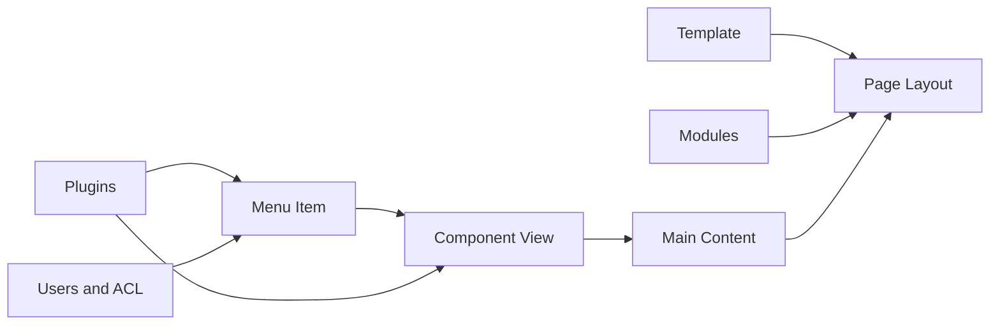
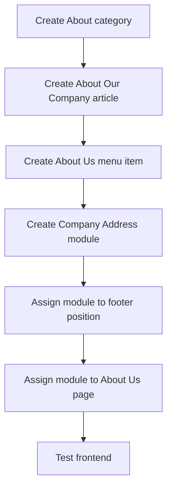

# Joomla Backend Configuration Guide

A practical guide to the main backend areas in Joomla 3 and Joomla 6.

> Learn Joomla by **function**, not by memorizing menu locations. Menu positions may change between versions, but the main concepts remain similar.

## Backend Configuration Summary

| No. | Area | What it controls | Joomla 3 location | Joomla 6 location | Where the result appears |
|---:|---|---|---|---|---|
| 1 | Global Configuration | Site name, SEO, cache, sessions, mail and server settings | `System → Global Configuration` | `System → Global Configuration` | Entire website, browser title, URLs, email and system behaviour |
| 2 | Content | Articles, categories, tags, media and custom fields | `Content` | `Content` | Main content area of frontend pages |
| 3 | Menus | Page URLs, page types, navigation and active page settings | `Menus` | `Menus` | Header, sidebar, footer or mobile navigation |
| 4 | Modules | Small blocks around the main page content | `Extensions → Modules` | `Content → Site Modules` | Header, footer, sidebar, banner and template positions |
| 5 | Templates | Page layout, styles, module positions and overrides | `Extensions → Templates` | `System → Site Templates` | Overall frontend design and page structure |
| 6 | Extensions | Additional website features | `Extensions → Manage` | `System → Install / Manage / Update` | Depends on the installed extension |
| 7 | Plugins | Event-based processing and background behaviour | `Extensions → Plugins` | `System → Manage → Plugins` | Login, editor, forms, articles, search and system processing |
| 8 | Users and ACL | User accounts, groups, access levels and permissions | `Users` | `Users` | Login access, visible content and backend permissions |
| 9 | Languages | Site languages and multilingual content | `Extensions → Languages` | `System → Languages` | Language switcher, translated menus and translated pages |
| 10 | Maintenance | Updates, cache, logs, check-in and system checks | `System / Extensions` | `System` | Website performance, stability and administration status |

## How a Joomla Page Is Built



A typical frontend page contains:

- One active menu item
- One main component view
- One active template style
- Zero or more modules
- Plugins that process the request or content
- Access rules that decide who may view the page

---

# 1. Global Configuration

Global Configuration controls settings that affect the entire website.

## Example: Change the site name

### Backend path

```text
Joomla 3: System → Global Configuration → Site
Joomla 6: System → Global Configuration → Site
```

### Steps

1. Open **Global Configuration**.
2. Find **Site Name**.
3. Change it to `Honda Corporate Website`.
4. Click **Save**.

### Where it appears

The site name may appear in:

- Browser page titles
- Template header, depending on the template
- Metadata
- System-generated emails
- Offline page

### Example result

```text
Before: Home
After: Home - Honda Corporate Website
```

The exact result depends on the template and SEO configuration.

## Example: Enable URL rewriting

### Steps

1. Rename `htaccess.txt` to `.htaccess` when using Apache.
2. Open **Global Configuration → Site**.
3. Enable **Search Engine Friendly URLs**.
4. Enable **Use URL Rewriting**.
5. Save and test the frontend.

### Frontend result

```text
Before:
/index.php?option=com_content&view=article&id=10

After:
/about-us
```

### Risk

Incorrect web-server rewriting configuration can cause `404 Not Found` errors.

---

# 2. Content

Content management controls articles and the information shown inside the main component area.

## Example: Create an article

### Backend path

```text
Content → Articles → New
```

### Steps

1. Enter the title `About Our Company`.
2. Add article content.
3. Select the category `About`.
4. Set **Status** to `Published`.
5. Set **Access** to `Public`.
6. Save the article.

### Where it appears

An article does not always appear automatically. It normally appears when:

- A menu item links directly to it
- A Category Blog displays its category
- A module displays latest or popular articles
- Another article contains a link to it

### Frontend example

```text
Main Menu
└── About Us
    └── About Our Company article
```

## Example: Create a custom field

### Backend path

```text
Content → Fields → New
```

### Example configuration

```text
Title: Subtitle
Type: Text
Category: About
Status: Published
```

### Frontend result

The field may appear above or below article content, depending on:

- Field display settings
- Article layout
- Template override
- Field position

Example:

```text
About Our Company
Building mobility solutions since 1996

[Article content starts here]
```

---

# 3. Menus

A menu item creates a frontend route and decides which component view Joomla should display.

## Example: Create a Single Article menu item

### Backend path

```text
Menus → Main Menu → New
```

### Steps

1. Enter the title `About Us`.
2. Select **Menu Item Type**.
3. Choose `Articles → Single Article`.
4. Select the article `About Our Company`.
5. Set **Status** to `Published`.
6. Save the menu item.

### Where it appears

The menu item appears inside a Menu module assigned to the current template.

Example:

```text
Website Header
Home | About Us | Products | Contact
```

The resulting URL may be:

```text
/about-us
```

## Example: Create a Category Blog page

```text
Menu Item Type: Articles → Category Blog
Category: News
```

### Frontend result

```text
News
├── Article 1
├── Article 2
└── Article 3
```

The number of leading articles, columns and links can be configured in the menu item options.

---

# 4. Modules

Modules are small content blocks displayed in positions provided by the active template.

## Example: Add a custom module to the footer

### Backend path

```text
Joomla 3: Extensions → Modules → New → Custom
Joomla 6: Content → Site Modules → New → Custom
```

### Example configuration

```text
Title: Company Address
Position: footer
Status: Published
Access: Public
Language: All
Menu Assignment: On all pages
Content: 123 Example Street, Ho Chi Minh City
```

### Where it appears

```text
Frontend Page
├── Header
├── Main Content
└── Footer
    └── 123 Example Street, Ho Chi Minh City
```

The module appears only when the active template contains the selected `footer` position.

## Example: Display a module only on the Contact page

Set:

```text
Menu Assignment: Only on the pages selected
Selected menu item: Contact
```

### Result

| Page | Module visible? |
|---|---:|
| Home | No |
| About Us | No |
| Contact | Yes |

## Missing module checklist

1. The module is published.
2. The selected position exists in the active template.
3. The module is assigned to the current menu item.
4. The current user has the required access level.
5. The module language matches the page language.
6. Publishing start and finish dates are valid.
7. Joomla and extension caches have been cleared.

---

# 5. Templates

A template controls the overall layout and available module positions.

## Example: Change the default site template

### Backend path

```text
Joomla 3: Extensions → Templates → Styles
Joomla 6: System → Site Templates → Styles
```

### Steps

1. Open the list of site template styles.
2. Select a template style.
3. Set it as default.
4. Open the frontend in a new tab.

### Where it appears

The whole frontend may change:

- Header layout
- Fonts
- Colours
- Module positions
- Content width
- Footer layout

## Example: Assign another template style to one page

1. Duplicate a template style.
2. Change its logo or colour settings.
3. Open **Menu Assignment**.
4. Assign it only to `Products`.

### Result

| Page | Template style |
|---|---|
| Home | Default style |
| About Us | Default style |
| Products | Product style |

---

# 6. Extensions

Extensions add features that are not provided by Joomla core.

## Common extension types

| Type | Example | Frontend result |
|---|---|---|
| Component | HikaShop | Product catalogue and checkout pages |
| Module | DJ Image Slider | Image slider in a template position |
| Plugin | JCE Editor plugin | Editor or content-processing behaviour |
| Template | Cassiopeia child template | Overall site appearance |
| Package | Extension suite | Installs several related extensions |

## Example: Install an extension

### Backend path

```text
Joomla 3: Extensions → Manage → Install
Joomla 6: System → Install → Extensions
```

### Steps

1. Back up the website.
2. Download the package from the official developer.
3. Upload the ZIP package.
4. Confirm the installation result.
5. Enable related plugins or modules if required.
6. Create the required menu item or module.

### Important point

Installing an extension does not guarantee that anything appears on the frontend.

For example, after installing DJ Image Slider, you may still need to:

1. Create an image category.
2. Create slider items.
3. Create a DJ Image Slider module.
4. Select a template position.
5. Assign it to menu pages.
6. Publish it.

---

# 7. Plugins

Plugins react to Joomla events and may not have a visible page of their own.

## Example: Content plugin

A content plugin may transform text inside an article.

Example article content:

```text
{loadposition product-banner}
```

After the relevant content plugin processes the article, a module position may be rendered inside the article.

### Where the result appears

```text
Article title
Article introduction
[Product banner module]
Remaining article content
```

## Example: Editor plugin

Disabling an editor plugin may change the article editing screen from a visual editor to a plain text area.

### Safety warning

Do not disable authentication, user or system plugins on production without confirming their purpose. They can block login or break request processing.

---

# 8. Users and ACL

ACL controls what a user can view and what actions the user can perform.

## Main concepts

| Concept | Purpose |
|---|---|
| User | Individual account |
| User Group | Role membership |
| Access Level | Controls what content is visible |
| Permission | Controls what actions are allowed |

## Example: Registered-only article

### Steps

1. Create or edit an article.
2. Set **Access** to `Registered`.
3. Publish the article.
4. Create a menu item linking to it.

### Frontend result

| Visitor | Result |
|---|---|
| Guest | Cannot view the article or receives a login/access message |
| Logged-in registered user | Can view the article |

## Example: Limited backend editor

1. Create a user group under an appropriate parent group.
2. Allow backend login.
3. Allow article creation and editing.
4. Do not allow extension or global configuration access.
5. Create a test user in that group.
6. Log in with the test account and verify each menu.

### Expected backend result

The user may see:

```text
Content
└── Articles
```

The user should not see or access sensitive areas such as:

```text
Global Configuration
Extensions
Templates
User permissions
```

---

# 9. Languages

Language configuration controls both the interface language and multilingual content.

## Example: Add English and Vietnamese content

### Basic structure

```text
English
├── English Main Menu
├── English Home menu item
└── English articles

Vietnamese
├── Vietnamese Main Menu
├── Vietnamese Home menu item
└── Vietnamese articles
```

### Required items

1. Install the language package.
2. Create a Content Language.
3. Enable the Language Filter plugin.
4. Create a menu for each language.
5. Create one Home menu item for each language.
6. Assign articles and modules to the correct language.
7. Publish a Language Switcher module.

### Frontend result

```text
[English] [Tiếng Việt]
```

When the user changes language, Joomla loads the matching menu, modules and content.

---

# 10. Maintenance

Maintenance tools help keep Joomla stable, secure and fast.

## Example: Clear cache

### Backend path

```text
Joomla 3: System → Clear Cache
Joomla 6: System → Maintenance → Clear Cache
```

### When to use it

- A module change does not appear
- Template CSS appears outdated
- Menu changes are not reflected
- An extension still shows old output

### Frontend result

The next request regenerates cached content and displays the latest configuration.

## Example: Global Check-in

Use Global Check-in when an item remains locked because another administrator closed the browser without properly closing the edit screen.

### Result

Before:

```text
Article locked by another user
```

After check-in:

```text
Article can be edited again
```

## Example: Extension update

Before updating:

- Read the extension changelog
- Confirm Joomla and PHP compatibility
- Back up source code and database
- Test on staging
- Record the previous version

After updating:

- Check frontend pages
- Check backend configuration
- Check logs
- Clear cache
- Verify database changes

---

# Practical End-to-End Example

The following example creates an `About Us` page with a footer address module.



## Expected frontend structure

```text
Header
└── Main Menu
    ├── Home
    └── About Us

Main Content
├── About Our Company
└── Article content

Footer
└── 123 Example Street, Ho Chi Minh City
```

## Test checklist

- [ ] `About Us` appears in the main menu.
- [ ] Clicking it opens the correct article.
- [ ] The URL alias is correct.
- [ ] The article is visible to guests.
- [ ] The footer module appears on the selected page.
- [ ] The module does not appear on unassigned pages.
- [ ] The active template contains the selected position.
- [ ] Mobile and desktop layouts are both checked.

---

# Configuration Test Template

Use this template whenever testing a backend setting.

```markdown
## Configuration name

### Joomla version
Joomla 3 / Joomla 6

### Backend path
Menu → Submenu → Screen

### Original value
Value before changing

### New value
Value after changing

### Expected frontend result
Describe where and how the result should appear.

### Actual result
Passed / Failed

### Affected file or database area
Example: configuration.php, #__modules or #__menu

### Risk
Describe possible side effects.

### Rollback
Explain how to restore the original value.
```

## Important Rule

Do not test risky configuration changes directly on production. Use a local or staging copy and keep a database and source-code backup before changing ACL, plugins, templates, URL rewriting, sessions or database settings.
