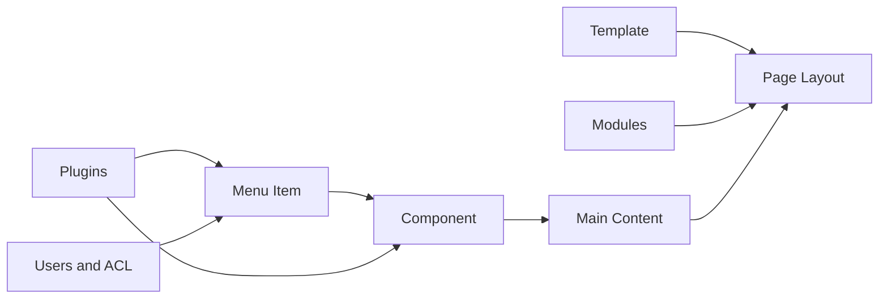

# Joomla Backend Overview

A short guide to the main backend areas in Joomla 3 and Joomla 6.

> Learn Joomla by **function**, not by memorizing menu locations. Menu positions may change between versions, but the main concepts remain similar.

## Backend Configuration Summary

| No. | Area | What it manages | Joomla 3 location | Joomla 6 location | What to practise |
|---:|---|---|---|---|---|
| 1 | Global Configuration | Site name, SEO, cache, sessions, mail, server and permissions | `System → Global Configuration` | `System → Global Configuration` | Change one setting at a time and check its effect |
| 2 | Content | Articles, categories, tags, media, fields and publishing | `Content` | `Content` | Create a category, article, tag and custom field |
| 3 | Menus | Page routes, component views, aliases, access and metadata | `Menus` | `Menus` | Create Single Article and Category Blog menu items |
| 4 | Modules | Small content blocks displayed in template positions | `Extensions → Modules` | `Content → Site Modules` | Test position, status, access and menu assignment |
| 5 | Templates | Layout, styles, module positions and overrides | `Extensions → Templates` | `System → Site Templates` | Duplicate a style and assign it to selected menus |
| 6 | Extensions | Install, update, enable, disable and remove extensions | `Extensions → Manage` | `System → Install / Manage / Update` | Install and remove an extension on a test site |
| 7 | Plugins | Event-based behaviour such as login, content and system processing | `Extensions → Plugins` | `System → Manage → Plugins` | Identify plugin groups and test safe plugins locally |
| 8 | Users and ACL | Users, groups, access levels and permissions | `Users` | `Users` | Create a limited backend user and verify permissions |
| 9 | Languages | Site languages, content languages, associations and language menus | `Extensions / Languages` | `System → Languages` | Build a simple English and Vietnamese setup |
| 10 | Maintenance | Updates, cache, check-in, logs, database checks and system information | `System / Extensions` | `System` | Clear cache, inspect logs and test backup restoration |

## How a Joomla Page Is Built

## Recommended Learning Order

| Step | Focus | Expected result |
|---:|---|---|
| 1 | Architecture | Understand components, modules, plugins, templates and menus |
| 2 | Content and Menus | Build pages and control their URLs and layouts |
| 3 | Modules and Templates | Control what appears around the main content |
| 4 | Extensions and Plugins | Safely install and configure additional features |
| 5 | Users and ACL | Control who can view or manage each area |
| 6 | Maintenance | Update, debug, back up and restore the website |

## Configuration Test Checklist

For every setting you test, record:

- [ ] Backend menu path
- [ ] Original value
- [ ] New value
- [ ] Expected result
- [ ] Actual result
- [ ] Frontend impact
- [ ] Database or file affected
- [ ] Possible risk
- [ ] Rollback method

## Troubleshooting a Missing Module

Check in this order:

1. The module is published.
2. The selected position exists in the active template.
3. Menu Assignment includes the current page.
4. Access level allows the current user.
5. Language matches the page language.
6. Publishing dates are valid.
7. Joomla and extension caches have been cleared.

## Important Rule

Do not test risky configuration changes directly on production. Use a local or staging copy and keep a database and source-code backup before changing ACL, plugins, templates, URL rewriting, sessions or database settings.
