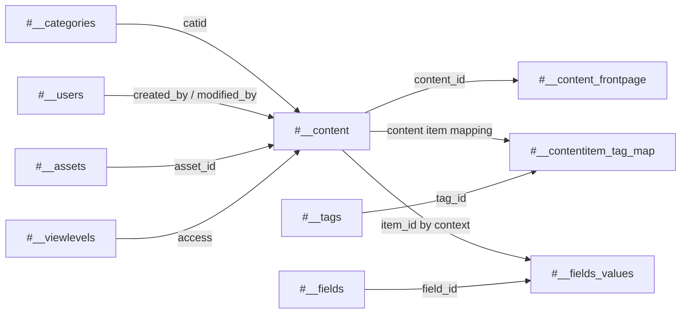
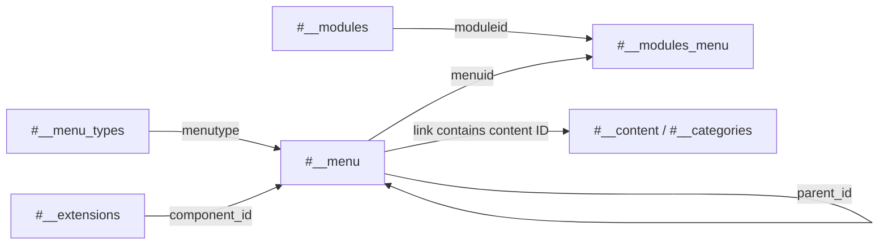
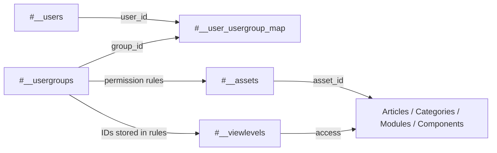
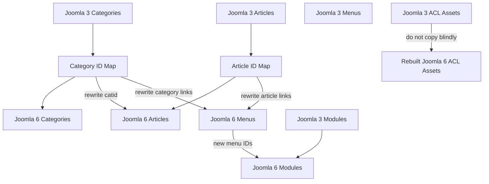

# Joomla 3 Database Structure and ERD

This document provides a complete logical overview of the Joomla 3 core database, including table groups, important columns, relationships, Mermaid ER diagrams, and migration considerations for Joomla 6.

## Table of Contents

- [1. Purpose and Scope](#1-purpose-and-scope)
- [2. Database Prefix](#2-database-prefix)
- [3. Database Directory View](#3-database-directory-view)
- [4. Main Table Groups](#4-main-table-groups)
- [5. Content and Categories](#5-content-and-categories)
  - [5.1 `#__content`](#51-content)
  - [5.2 `#__categories`](#52-categories)
  - [5.3 Featured Articles](#53-featured-articles)
- [6. Menus](#6-menus)
  - [6.1 `#__menu_types`](#61-menu_types)
  - [6.2 `#__menu`](#62-menu)
- [7. Modules](#7-modules)
  - [7.1 `#__modules`](#71-modules)
  - [7.2 `#__modules_menu`](#72-modules_menu)
- [8. Users and Access Control](#8-users-and-access-control)
- [9. Extensions](#9-extensions)
- [10. Tags and Custom Fields](#10-tags-and-custom-fields)
- [11. Languages and Sessions](#11-languages-and-sessions)
- [12. Nested-Set Trees](#12-nested-set-trees)
- [13. High-Level ERD](#13-high-level-erd)
- [14. Content Relationship View](#14-content-relationship-view)
- [15. Menu and Module Relationship View](#15-menu-and-module-relationship-view)
- [16. User and ACL Relationship View](#16-user-and-acl-relationship-view)
- [17. Joomla 3 to Joomla 6 Migration View](#17-joomla-3-to-joomla-6-migration-view)
- [18. Migration-Sensitive Tables](#18-migration-sensitive-tables)
- [19. Recommended Migration Order](#19-recommended-migration-order)
- [20. Migration Checklist](#20-migration-checklist)
- [21. Important Notes](#21-important-notes)

## 1. Purpose and Scope

The goal of this document is to help developers:

- understand the main Joomla 3 core tables;
- identify relationships between content, categories, menus, modules, users, ACL, tags, fields, and extensions;
- prepare source-to-target mappings for Joomla 3 to Joomla 6 migration work;
- avoid copying version-dependent system tables without validation;
- understand the database at a logical level before writing SQL or migration scripts.

The diagrams describe logical relationships used by Joomla application code. Joomla does not enforce every relationship with database-level foreign keys.

Third-party extensions and custom components may add independent tables that are outside this core overview.

## 2. Database Prefix

Joomla uses a configurable table prefix. Documentation and extension SQL normally use `#__` as a placeholder.

```sql
SELECT *
FROM `#__content`;
```

At runtime, Joomla replaces `#__` with the configured prefix, for example:

```sql
SELECT *
FROM `abc_content`;
```

The prefix is stored in `configuration.php`:

```php
public $dbprefix = 'abc_';
```

## 3. Database Directory View

```text
Joomla 3 Database
├── Content
│   ├── #__content
│   ├── #__categories
│   ├── #__content_frontpage
│   ├── #__tags
│   ├── #__contentitem_tag_map
│   ├── #__fields_groups
│   ├── #__fields
│   └── #__fields_values
├── Navigation
│   ├── #__menu_types
│   └── #__menu
├── Modules
│   ├── #__modules
│   └── #__modules_menu
├── Users and Access Control
│   ├── #__users
│   ├── #__usergroups
│   ├── #__user_usergroup_map
│   ├── #__viewlevels
│   └── #__assets
├── Extensions
│   └── #__extensions
├── Languages
│   └── #__languages
└── Runtime Data
    └── #__session
```

## 4. Main Table Groups

| Area | Main Tables | Purpose |
|---|---|---|
| Content | `#__content`, `#__categories`, `#__content_frontpage` | Articles, categories, and featured ordering |
| Menus | `#__menu_types`, `#__menu` | Menu containers and menu items |
| Modules | `#__modules`, `#__modules_menu` | Module configuration and menu assignments |
| Users | `#__users`, `#__usergroups`, `#__user_usergroup_map` | Accounts and group membership |
| Access Control | `#__viewlevels`, `#__assets` | View access and action permissions |
| Extensions | `#__extensions` | Components, modules, plugins, templates, libraries, packages, and languages |
| Tags | `#__tags`, `#__contentitem_tag_map` | Tag definitions and content-to-tag mapping |
| Custom Fields | `#__fields_groups`, `#__fields`, `#__fields_values` | Field groups, definitions, and values |
| Languages | `#__languages` | Configured content languages |
| Runtime | `#__session` | Active frontend and administrator sessions |

## 5. Content and Categories

### 5.1 `#__content`

`#__content` stores Joomla articles.

| Column | Purpose |
|---|---|
| `id` | Article primary key |
| `asset_id` | ACL asset reference |
| `title` | Article title |
| `alias` | URL-friendly alias |
| `introtext` | Introductory article content |
| `fulltext` | Remaining content after the read-more split |
| `state` | Published, unpublished, archived, or trashed state |
| `catid` | Category ID |
| `created`, `modified` | Creation and modification dates |
| `created_by`, `modified_by` | Creator and last editor user IDs |
| `publish_up`, `publish_down` | Publishing date range |
| `images` | JSON image configuration |
| `urls` | JSON link configuration |
| `attribs` | JSON article display parameters |
| `access` | View level ID |
| `language` | Language code or `*` |
| `metadata` | JSON metadata configuration |
| `metakey`, `metadesc` | Search metadata |
| `featured` | Featured status flag |
| `ordering` | Ordering inside a category |

Primary logical relationships:

```text
#__categories.id  → #__content.catid
#__users.id       → #__content.created_by
#__users.id       → #__content.modified_by
#__assets.id      → #__content.asset_id
#__viewlevels.id  → #__content.access
```

### 5.2 `#__categories`

Joomla uses one shared category table for multiple components. The `extension` column identifies the owning component.

```text
extension = com_content
```

This value identifies an article category.

| Column | Purpose |
|---|---|
| `id` | Category primary key |
| `asset_id` | ACL asset ID |
| `parent_id` | Parent category ID |
| `lft`, `rgt` | Nested-set boundaries |
| `level` | Tree depth |
| `path` | Hierarchical category path |
| `extension` | Owning component |
| `title`, `alias` | Category name and URL alias |
| `description` | Category description |
| `published` | Publication state |
| `access` | View level ID |
| `params`, `metadata` | JSON configuration |
| `language` | Content language |

### 5.3 Featured Articles

`#__content_frontpage` stores featured article ordering.

| Column | Purpose |
|---|---|
| `content_id` | Article ID |
| `ordering` | Featured ordering value |

The `featured` flag in `#__content` and the record in `#__content_frontpage` should be validated together during migration.

## 6. Menus

### 6.1 `#__menu_types`

This table defines menu containers such as Main Menu or Footer Menu.

| Column | Purpose |
|---|---|
| `id` | Primary key |
| `menutype` | Unique machine name, such as `mainmenu` |
| `title` | Display title |
| `description` | Menu description |

### 6.2 `#__menu`

This table stores frontend and administrator menu items.

| Column | Purpose |
|---|---|
| `id` | Menu item ID |
| `menutype` | Menu container key |
| `title`, `alias` | Menu title and URL alias |
| `path` | Hierarchical menu path |
| `link` | Internal or external link |
| `type` | Component, URL, alias, separator, or heading |
| `component_id` | Related extension ID |
| `parent_id` | Parent menu item |
| `lft`, `rgt`, `level` | Nested-set tree values |
| `published` | Publication state |
| `access` | View level ID |
| `params` | JSON menu configuration |
| `language` | Menu language |

Single Article example:

```text
index.php?option=com_content&view=article&id=25
```

Category Blog example:

```text
index.php?option=com_content&view=category&layout=blog&id=8
```

These links contain source database IDs and must be rewritten when target IDs differ.

## 7. Modules

### 7.1 `#__modules`

`#__modules` stores module instances and configuration.

| Column | Purpose |
|---|---|
| `id` | Module instance ID |
| `asset_id` | ACL asset ID |
| `title` | Module title |
| `content` | Content for modules such as `mod_custom` |
| `ordering` | Ordering in a template position |
| `position` | Template position name |
| `published` | Publication state |
| `module` | Module type, such as `mod_custom` |
| `access` | View level ID |
| `showtitle` | Title visibility flag |
| `params` | JSON module configuration |
| `client_id` | `0` for site and `1` for administrator |
| `language` | Module language |

### 7.2 `#__modules_menu`

This bridge table maps modules to menu items.

| Column | Purpose |
|---|---|
| `moduleid` | Module ID |
| `menuid` | Menu assignment value |

| Value | Meaning |
|---|---|
| `0` | Display on all pages |
| Positive menu ID | Display on the selected menu item |
| Negative menu ID | Exclude the selected menu item |

## 8. Users and Access Control

| Table | Purpose |
|---|---|
| `#__users` | User accounts |
| `#__usergroups` | Hierarchical user groups |
| `#__user_usergroup_map` | Many-to-many mapping between users and groups |
| `#__viewlevels` | Defines which groups may view an object |
| `#__assets` | Defines create, edit, delete, configure, and publish permissions |

Typical user-group relationship:

```text
#__users.id
    ↓
#__user_usergroup_map.user_id
#__user_usergroup_map.group_id
    ↓
#__usergroups.id
```

Example asset names:

```text
root.1
com_content
com_content.category.10
com_content.article.25
com_users
com_modules
```

`#__viewlevels` answers:

> Which user groups may view this object?

`#__assets` answers:

> Which user groups may create, edit, delete, configure, or publish this object?

These systems are related but are not interchangeable.

## 9. Extensions

`#__extensions` records installed Joomla extensions.

| Column | Purpose |
|---|---|
| `extension_id` | Extension primary key |
| `package_id` | Parent package ID |
| `name` | Extension name |
| `type` | Component, module, plugin, template, library, package, file, or language |
| `element` | Extension element, such as `com_content` |
| `folder` | Plugin group |
| `client_id` | Site or administrator client |
| `enabled` | Enabled state |
| `access` | Access level |
| `manifest_cache` | JSON manifest information |
| `params` | JSON extension parameters |
| `schema_version` | Installed schema version |

Extension IDs are installation-specific. A `component_id` stored in `#__menu` cannot be assumed to remain valid after migration.

## 10. Tags and Custom Fields

Tags use:

```text
#__tags
#__contentitem_tag_map
```

Custom fields use:

```text
#__fields_groups
#__fields
#__fields_values
```

`#__fields_values.item_id` references an item in the configured field context. Migration scripts must validate the context before remapping IDs.

## 11. Languages and Sessions

`#__languages` stores configured content languages.

`#__session` stores temporary active sessions. Session data should not be migrated between Joomla installations.

## 12. Nested-Set Trees

The following tables use hierarchical tree data:

```text
#__assets
#__categories
#__menu
#__usergroups
#__tags
```

Important columns include:

```text
parent_id
lft
rgt
level
path
```

A valid `parent_id` alone is not enough. Incorrect `lft` or `rgt` values can break backend lists, ACL inheritance, category navigation, menu ordering, and routing.

## 13. High-Level ERD

```mermaid
erDiagram
    ASSETS {
        int id PK
        int parent_id
        int lft
        int rgt
        int level
        varchar name
        varchar title
        text rules
    }

    CATEGORIES {
        int id PK
        int asset_id
        int parent_id
        int lft
        int rgt
        int level
        varchar path
        varchar extension
        varchar title
        varchar alias
        tinyint published
        int access
        varchar language
    }

    CONTENT {
        int id PK
        int asset_id
        varchar title
        varchar alias
        mediumtext introtext
        mediumtext fulltext
        tinyint state
        int catid
        int created_by
        datetime created
        int modified_by
        datetime modified
        int access
        tinyint featured
        varchar language
    }

    CONTENT_FRONTPAGE {
        int content_id PK
        int ordering
    }

    MENU_TYPES {
        int id PK
        varchar menutype UK
        varchar title
        text description
    }

    MENU {
        int id PK
        varchar menutype
        varchar title
        varchar alias
        varchar path
        text link
        varchar type
        int component_id
        int parent_id
        int lft
        int rgt
        int level
        tinyint published
        int access
        varchar language
    }

    MODULES {
        int id PK
        int asset_id
        varchar title
        text content
        int ordering
        varchar position
        tinyint published
        varchar module
        int access
        tinyint showtitle
        text params
        tinyint client_id
        varchar language
    }

    MODULES_MENU {
        int moduleid PK
        int menuid PK
    }

    USERS {
        int id PK
        varchar name
        varchar username
        varchar email
        varchar password
        tinyint block
        datetime registerDate
        datetime lastvisitDate
        text params
    }

    USERGROUPS {
        int id PK
        int parent_id
        int lft
        int rgt
        varchar title
    }

    USER_USERGROUP_MAP {
        int user_id PK
        int group_id PK
    }

    VIEWLEVELS {
        int id PK
        varchar title
        text rules
        int ordering
    }

    EXTENSIONS {
        int extension_id PK
        int package_id
        varchar name
        varchar type
        varchar element
        varchar folder
        tinyint client_id
        tinyint enabled
        int access
        text manifest_cache
        text params
        varchar schema_version
    }

    TAGS {
        int id PK
        int parent_id
        int lft
        int rgt
        int level
        varchar path
        varchar title
        varchar alias
        tinyint published
        int access
        varchar language
    }

    CONTENTITEM_TAG_MAP {
        varchar type_alias PK
        int core_content_id PK
        int content_item_id
        int tag_id PK
    }

    FIELDS_GROUPS {
        int id PK
        int asset_id
        varchar context
        varchar title
        tinyint state
        int access
        varchar language
    }

    FIELDS {
        int id PK
        int asset_id
        int group_id
        varchar context
        varchar title
        varchar name
        varchar type
        tinyint state
        int access
        varchar language
    }

    FIELDS_VALUES {
        int field_id PK
        int item_id PK
        text value
    }

    LANGUAGES {
        int lang_id PK
        varchar lang_code UK
        varchar title
        varchar sef
        tinyint published
        int access
    }

    SESSION {
        varchar session_id PK
        int client_id
        int guest
        int time
        int userid
        varchar username
    }

    ASSETS ||--o{ ASSETS : parent
    ASSETS ||--o| CATEGORIES : controls
    ASSETS ||--o| CONTENT : controls
    ASSETS ||--o| MODULES : controls
    ASSETS ||--o| FIELDS_GROUPS : controls
    ASSETS ||--o| FIELDS : controls

    CATEGORIES ||--o{ CATEGORIES : parent
    CATEGORIES ||--o{ CONTENT : contains

    USERS ||--o{ CONTENT : creates
    USERS ||--o{ CONTENT : modifies
    USERS ||--o{ SESSION : owns

    CONTENT ||--o| CONTENT_FRONTPAGE : featured_as

    MENU_TYPES ||--o{ MENU : contains
    MENU ||--o{ MENU : parent
    EXTENSIONS ||--o{ MENU : handles

    MODULES ||--o{ MODULES_MENU : assigned_by
    MENU ||--o{ MODULES_MENU : receives

    USERS ||--o{ USER_USERGROUP_MAP : belongs_through
    USERGROUPS ||--o{ USER_USERGROUP_MAP : contains
    USERGROUPS ||--o{ USERGROUPS : parent

    VIEWLEVELS ||--o{ CONTENT : restricts
    VIEWLEVELS ||--o{ CATEGORIES : restricts
    VIEWLEVELS ||--o{ MENU : restricts
    VIEWLEVELS ||--o{ MODULES : restricts
    VIEWLEVELS ||--o{ EXTENSIONS : restricts
    VIEWLEVELS ||--o{ TAGS : restricts
    VIEWLEVELS ||--o{ FIELDS_GROUPS : restricts
    VIEWLEVELS ||--o{ FIELDS : restricts

    TAGS ||--o{ TAGS : parent
    CONTENT ||--o{ CONTENTITEM_TAG_MAP : tagged_through
    TAGS ||--o{ CONTENTITEM_TAG_MAP : maps

    FIELDS_GROUPS ||--o{ FIELDS : groups
    FIELDS ||--o{ FIELDS_VALUES : stores
```



## 14. Content Relationship View



An article normally depends on a category, creator, ACL asset, view level, and optional featured ordering, tags, and custom field values.

## 15. Menu and Module Relationship View



Module assignment behavior:

```text
menuid = 0      → all pages
menuid = 123    → only menu item 123
menuid = -123   → all pages except menu item 123
```

## 16. User and ACL Relationship View



## 17. Joomla 3 to Joomla 6 Migration View



A safe migration flow is:

```text
Joomla 3 Database
        ↓
Extract and validate source records
        ↓
Map IDs and transform incompatible fields
        ↓
Insert records into a fresh Joomla 6 database
        ↓
Rebuild trees, ACL assets, and extension-dependent references
        ↓
Validate frontend and backend behavior
```

## 18. Migration-Sensitive Tables

Do not directly overwrite Joomla 6 versions of these tables without a verified transformation plan:

```text
#__assets
#__extensions
#__schemas
#__update_sites
#__updates
#__session
```

Records that commonly require ID mapping include:

```text
#__content.catid
#__content.asset_id
#__menu.component_id
#__menu.parent_id
#__modules.asset_id
#__modules_menu.menuid
#__contentitem_tag_map.content_item_id
#__fields_values.item_id
```

## 19. Recommended Migration Order

```text
1. Categories
2. Articles
3. Menu types
4. Menu items
5. Modules
6. Module-menu assignments
7. Tags and custom field values
8. ACL rebuild and validation
9. Routing and frontend validation
```

## 20. Migration Checklist

- [ ] Start with a fresh and validated Joomla 6 database.
- [ ] Back up both source and target databases.
- [ ] Identify the real table prefix in both systems.
- [ ] Export only the required Joomla 3 records.
- [ ] Build source-to-target ID mapping tables.
- [ ] Migrate categories before articles.
- [ ] Rebuild or validate nested-set trees.
- [ ] Migrate articles and rewrite category, user, and asset references.
- [ ] Migrate menu types before menu items.
- [ ] Rewrite menu links containing article or category IDs.
- [ ] Install compatible module and component code before migrating their instances.
- [ ] Migrate modules and then module-menu assignments.
- [ ] Recreate or validate ACL assets instead of blindly copying them.
- [ ] Validate JSON fields against Joomla 6 expectations.
- [ ] Exclude sessions, updates, cache, and temporary runtime data.
- [ ] Test backend editing, frontend routing, permissions, languages, header, footer, and module visibility.

## 21. Important Notes

1. Joomla logical relationships are not always implemented as database foreign-key constraints.
2. Nested-set tables require valid `parent_id`, `lft`, `rgt`, `level`, and `path` values.
3. Extension IDs are installation-specific and must be mapped.
4. JSON fields may require transformation between Joomla versions.
5. Menu links may contain article or category IDs that require rewriting.
6. Third-party extensions such as RSForm Pro, HikaShop, AcyMailing, and custom components add separate schemas.
7. Session, update, cache, and temporary data should not be migrated.
8. A Joomla 3 database must not be copied directly over a fresh Joomla 6 database.

[Back to Joomla Database Documentation](../README.md)
