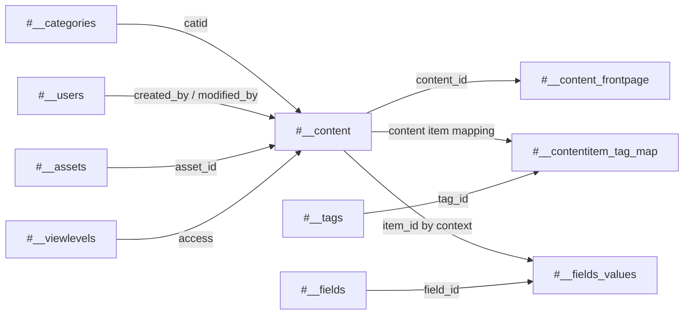
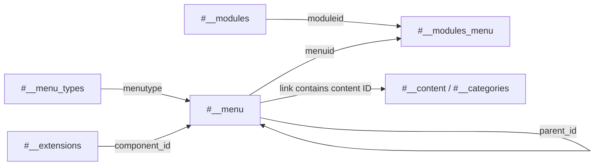
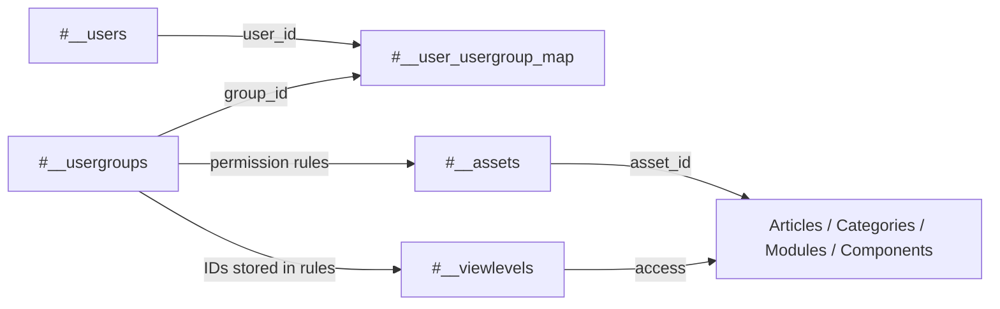
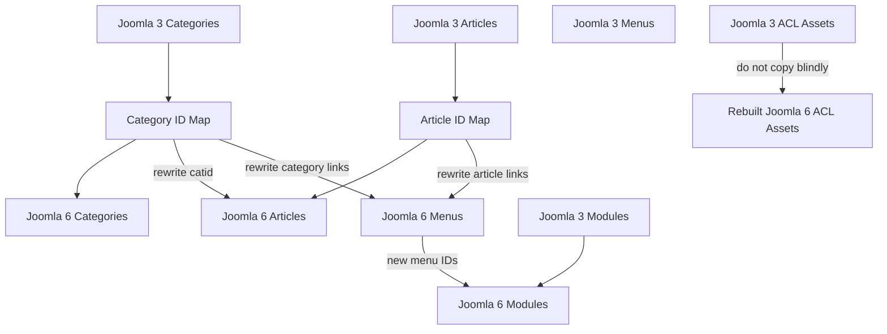

# Joomla 3 Database ERD

This document provides a logical Entity Relationship Diagram for the most important Joomla 3 core database tables.

## Table of Contents

- [1. Scope](#1-scope)
- [2. High-Level ERD](#2-high-level-erd)
- [3. Content Relationship View](#3-content-relationship-view)
- [4. Menu and Module Relationship View](#4-menu-and-module-relationship-view)
- [5. User and ACL Relationship View](#5-user-and-acl-relationship-view)
- [6. Migration Relationship View](#6-migration-relationship-view)
- [7. Important Notes](#7-important-notes)

## 1. Scope

The ERD focuses on these Joomla 3 core areas:

```text
Content and Categories
Menus and Modules
Users and Access Control
Extensions
Tags and Custom Fields
Languages and Sessions
```

It is a logical overview rather than a complete physical schema. Joomla does not enforce every relationship with a database-level foreign key, but the application code still depends on these relationships.

## 2. High-Level ERD

```mermaid
erDiagram
    ASSETS {
        int id PK
        int parent_id
        int lft
        int rgt
        int level
        varchar name
        varchar title
        text rules
    }

    CATEGORIES {
        int id PK
        int asset_id
        int parent_id
        int lft
        int rgt
        int level
        varchar path
        varchar extension
        varchar title
        varchar alias
        tinyint published
        int access
        varchar language
    }

    CONTENT {
        int id PK
        int asset_id
        varchar title
        varchar alias
        mediumtext introtext
        mediumtext fulltext
        tinyint state
        int catid
        int created_by
        datetime created
        int modified_by
        datetime modified
        int access
        tinyint featured
        varchar language
    }

    CONTENT_FRONTPAGE {
        int content_id PK
        int ordering
    }

    MENU_TYPES {
        int id PK
        varchar menutype UK
        varchar title
        text description
    }

    MENU {
        int id PK
        varchar menutype
        varchar title
        varchar alias
        varchar path
        text link
        varchar type
        int component_id
        int parent_id
        int lft
        int rgt
        int level
        tinyint published
        int access
        varchar language
    }

    MODULES {
        int id PK
        int asset_id
        varchar title
        text content
        int ordering
        varchar position
        tinyint published
        varchar module
        int access
        tinyint showtitle
        text params
        tinyint client_id
        varchar language
    }

    MODULES_MENU {
        int moduleid PK
        int menuid PK
    }

    USERS {
        int id PK
        varchar name
        varchar username
        varchar email
        varchar password
        tinyint block
        datetime registerDate
        datetime lastvisitDate
        text params
    }

    USERGROUPS {
        int id PK
        int parent_id
        int lft
        int rgt
        varchar title
    }

    USER_USERGROUP_MAP {
        int user_id PK
        int group_id PK
    }

    VIEWLEVELS {
        int id PK
        varchar title
        text rules
        int ordering
    }

    EXTENSIONS {
        int extension_id PK
        int package_id
        varchar name
        varchar type
        varchar element
        varchar folder
        tinyint client_id
        tinyint enabled
        int access
        text manifest_cache
        text params
        varchar schema_version
    }

    TAGS {
        int id PK
        int parent_id
        int lft
        int rgt
        int level
        varchar path
        varchar title
        varchar alias
        tinyint published
        int access
        varchar language
    }

    CONTENTITEM_TAG_MAP {
        varchar type_alias PK
        int core_content_id PK
        int content_item_id
        int tag_id PK
    }

    FIELDS_GROUPS {
        int id PK
        int asset_id
        varchar context
        varchar title
        tinyint state
        int access
        varchar language
    }

    FIELDS {
        int id PK
        int asset_id
        int group_id
        varchar context
        varchar title
        varchar name
        varchar type
        tinyint state
        int access
        varchar language
    }

    FIELDS_VALUES {
        int field_id PK
        int item_id PK
        text value
    }

    LANGUAGES {
        int lang_id PK
        varchar lang_code UK
        varchar title
        varchar sef
        tinyint published
        int access
    }

    SESSION {
        varchar session_id PK
        int client_id
        int guest
        int time
        int userid
        varchar username
    }

    ASSETS ||--o{ ASSETS : parent
    ASSETS ||--o| CATEGORIES : controls
    ASSETS ||--o| CONTENT : controls
    ASSETS ||--o| MODULES : controls
    ASSETS ||--o| FIELDS_GROUPS : controls
    ASSETS ||--o| FIELDS : controls

    CATEGORIES ||--o{ CATEGORIES : parent
    CATEGORIES ||--o{ CONTENT : contains

    USERS ||--o{ CONTENT : creates
    USERS ||--o{ CONTENT : modifies
    USERS ||--o{ SESSION : owns

    CONTENT ||--o| CONTENT_FRONTPAGE : featured_as

    MENU_TYPES ||--o{ MENU : contains
    MENU ||--o{ MENU : parent
    EXTENSIONS ||--o{ MENU : handles

    MODULES ||--o{ MODULES_MENU : assigned_by
    MENU ||--o{ MODULES_MENU : receives

    USERS ||--o{ USER_USERGROUP_MAP : belongs_through
    USERGROUPS ||--o{ USER_USERGROUP_MAP : contains
    USERGROUPS ||--o{ USERGROUPS : parent

    VIEWLEVELS ||--o{ CONTENT : restricts
    VIEWLEVELS ||--o{ CATEGORIES : restricts
    VIEWLEVELS ||--o{ MENU : restricts
    VIEWLEVELS ||--o{ MODULES : restricts
    VIEWLEVELS ||--o{ EXTENSIONS : restricts
    VIEWLEVELS ||--o{ TAGS : restricts
    VIEWLEVELS ||--o{ FIELDS_GROUPS : restricts
    VIEWLEVELS ||--o{ FIELDS : restricts

    TAGS ||--o{ TAGS : parent
    CONTENT ||--o{ CONTENTITEM_TAG_MAP : tagged_through
    TAGS ||--o{ CONTENTITEM_TAG_MAP : maps

    FIELDS_GROUPS ||--o{ FIELDS : groups
    FIELDS ||--o{ FIELDS_VALUES : stores
```



## 3. Content Relationship View



An article normally depends on:

- a category;
- a creator and optional last editor;
- an ACL asset;
- a view level;
- optional featured ordering;
- optional tags;
- optional custom field values.

## 4. Menu and Module Relationship View



Important migration behavior:

```text
#__menu.link
```

may contain an article or category ID. Therefore, menu links must be rewritten when source IDs and target IDs differ.

Module assignment behavior:

```text
menuid = 0      → all pages
menuid = 123    → only menu item 123
menuid = -123   → all pages except menu item 123
```

## 5. User and ACL Relationship View



`#__viewlevels` answers this question:

> Which user groups may view this object?

`#__assets` answers this question:

> Which user groups may create, edit, delete, configure, or publish this object?

These systems are related but not interchangeable.

## 6. Migration Relationship View



Recommended order:

```text
1. Categories
2. Articles
3. Menu types
4. Menu items
5. Modules
6. Module-menu assignments
7. Tags and custom field values
8. ACL rebuild and validation
9. Routing and frontend validation
```

## 7. Important Notes

1. Joomla logical relationships are not always implemented as database foreign-key constraints.
2. The diagrams show the relationships expected by Joomla application logic.
3. Nested-set tables require valid `parent_id`, `lft`, `rgt`, `level`, and `path` values.
4. Extension IDs are installation-specific and must be mapped.
5. JSON fields may require transformation between Joomla versions.
6. Third-party extensions such as RSForm Pro, HikaShop, AcyMailing, and custom components add separate schemas that are not included here.
7. Session, update, and temporary cache data should not be migrated.

[Back to Joomla 3 Database Overview](./README.md) · [Read the Database Structure](./database-structure.md)
