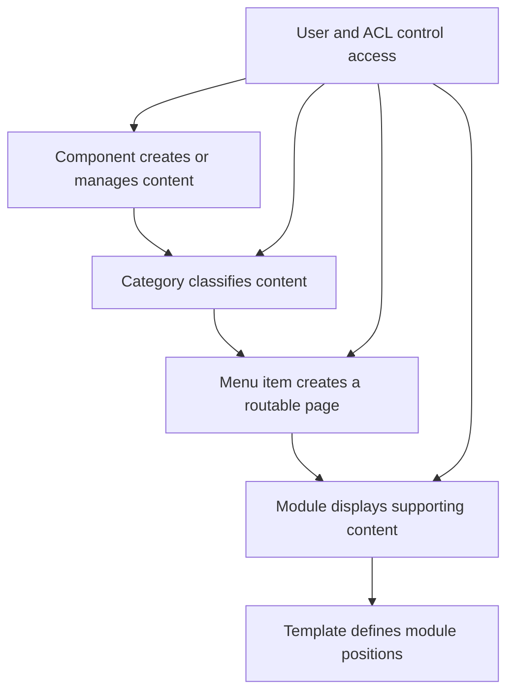
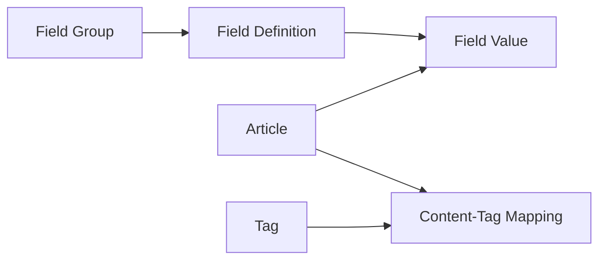
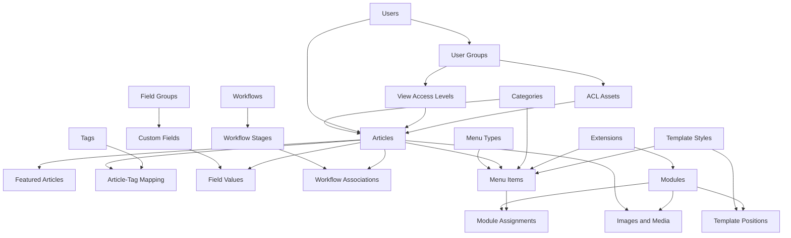
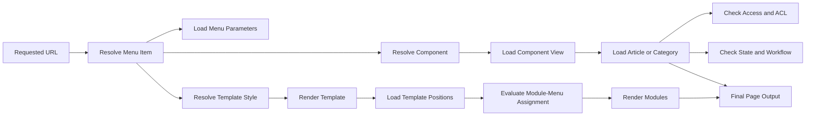
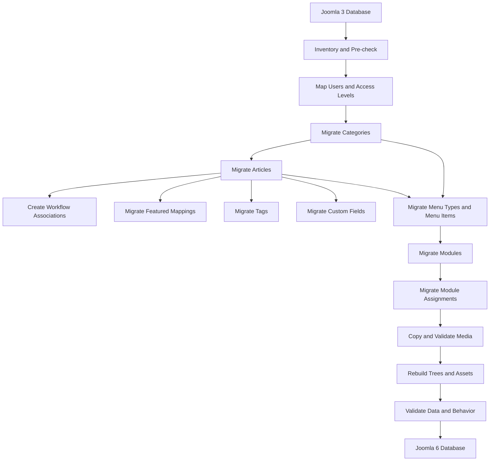

# Joomla Database Business and Migration Guide

A practical guide to understanding Joomla database behavior and planning a complete, verifiable migration from Joomla 3 to Joomla 6.

> **Primary goal:** understand Joomla business relationships before writing migration SQL, preserve data integrity, and validate both database structure and application behavior after migration.

---

## Table of Contents

- [1. Recommended Learning Approach](#1-recommended-learning-approach)
- [2. Joomla Business Flow](#2-joomla-business-flow)
- [3. Business Domain and Database Table Map](#3-business-domain-and-database-table-map)
  - [3.1 Content and Categories](#31-content-and-categories)
  - [3.2 Users, Access Levels, and ACL](#32-users-access-levels-and-acl)
  - [3.3 Menus and Routing](#33-menus-and-routing)
  - [3.4 Modules and Template Positions](#34-modules-and-template-positions)
  - [3.5 Tags and Custom Fields](#35-tags-and-custom-fields)
  - [3.6 Languages and Associations](#36-languages-and-associations)
  - [3.7 Workflows](#37-workflows)
  - [3.8 Extensions and Templates](#38-extensions-and-templates)
  - [3.9 Media and Environment Configuration](#39-media-and-environment-configuration)
- [4. Overall Entity Relationship Flow](#4-overall-entity-relationship-flow)
- [5. Joomla Page Rendering Flow](#5-joomla-page-rendering-flow)
- [6. Recommended Migration Flow](#6-recommended-migration-flow)
- [7. Recommended Analysis Order](#7-recommended-analysis-order)
- [8. Data Dictionary Template](#8-data-dictionary-template)
- [9. Data Integrity Validation](#9-data-integrity-validation)
  - [9.1 Record Reconciliation](#91-record-reconciliation)
  - [9.2 Referential Integrity](#92-referential-integrity)
  - [9.3 Behavioral Validation](#93-behavioral-validation)
- [10. Tables That Must Not Be Copied Directly](#10-tables-that-must-not-be-copied-directly)
- [11. Recommended Migration Project Structure](#11-recommended-migration-project-structure)
- [12. Definition of Migration Success](#12-definition-of-migration-success)
- [13. Final Checklist](#13-final-checklist)

---

## 1. Recommended Learning Approach

Do not learn the Joomla database as an isolated list of tables. Learn it by business domain and dependency:

```text
Content
  -> Categories
  -> Users
  -> Access and ACL
  -> Menus and Routing
  -> Modules and Template Positions
  -> Tags and Custom Fields
  -> Languages and Associations
  -> Workflows
  -> Extensions
```

The correct migration objective is not only to copy records. A successful migration must preserve:

1. Record completeness.
2. Referential integrity.
3. Tree structures.
4. Access behavior.
5. Frontend routing.
6. Backend editing behavior.
7. Module visibility.
8. Media references.
9. Extension compatibility.
10. Repeatability and rollback capability.

---

## 2. Joomla Business Flow



A Joomla article is not an isolated record. It may depend on:

```text
Article
  |- Category
  |- Author and modifier
  |- Access level
  |- ACL asset
  |- Menu item
  |- Featured mapping
  |- Tags
  |- Custom fields
  |- Workflow stage
  |- Language association
  |- Images and media
  `- Modules that display it
```

---

## 3. Business Domain and Database Table Map

| Business domain | Primary tables | Related tables | Migration checks |
|---|---|---|---|
| Articles | `#__content` | `#__categories`, `#__users`, `#__assets` | Content, state, alias, category, author, access, dates, JSON fields |
| Categories | `#__categories` | `#__assets`, component tables | Parent-child hierarchy, `lft`, `rgt`, `level`, `path`, access |
| Featured articles | `#__content_frontpage` | `#__content` | Article existence and ordering |
| Users | `#__users` | `#__user_usergroup_map`, `#__content` | Author and modifier mapping |
| User groups | `#__usergroups` | `#__user_usergroup_map` | Group hierarchy and membership |
| View access levels | `#__viewlevels` | Content, categories, menu, modules | Map by business meaning or title, not only by ID |
| ACL assets | `#__assets` | Content, categories, groups | Asset tree, inherited rules, orphan assets |
| Menu types | `#__menu_types` | `#__menu` | Menu type existence and client scope |
| Menu items | `#__menu` | `#__extensions`, content, categories | Links, target IDs, component mapping, tree, home item |
| Modules | `#__modules` | `#__extensions`, `#__modules_menu` | Module type, position, params, state, language |
| Module assignments | `#__modules_menu` | `#__modules`, `#__menu` | Valid module and menu references |
| Template styles | `#__template_styles` | `#__extensions`, `#__menu` | Installed template, style mapping, menu overrides |
| Extensions | `#__extensions` | Schema and update tables | Component, module, plugin, template availability |
| Tags | `#__tags` | `#__contentitem_tag_map`, `#__content_types` | Tag tree and content mappings |
| Field groups | `#__fields_groups` | `#__fields` | Context and access |
| Custom fields | `#__fields` | `#__fields_values`, field plugins | Supported field type and configuration |
| Field values | `#__fields_values` | `#__fields`, content items | Valid field ID and item ID |
| Languages | `#__languages` | Content, menu, associations | Language tag and publication state |
| Associations | `#__associations` | Content, categories, menu | Context and remapped item IDs |
| Workflows | `#__workflows` | Workflow stages, transitions, associations | Default workflow and valid stages |
| Workflow stages | `#__workflow_stages` | `#__workflow_associations` | Stage existence and publication behavior |
| Workflow assignments | `#__workflow_associations` | `#__content`, workflow stages | Each imported article has a valid stage |
| Version history | `#__ucm_history` | `#__content_types` | Optional; migrate only when required |
| Redirects | `#__redirect_links` | Routing and old URLs | Preserve important legacy URLs |
| Media | Filesystem and JSON columns | `/images`, module and article content | File existence and correct paths |
| Global configuration | `configuration.php` | Environment settings | Reconfigure per environment; do not copy blindly |
| Third-party extensions | Extension-specific tables | Extensions, menus, modules, assets | Analyze separately for schema and compatibility |

### 3.1 Content and Categories

**Primary tables**

```text
#__content
#__categories
#__content_frontpage
```

Important article fields:

| Column | Business meaning |
|---|---|
| `id` | Article identifier |
| `catid` | Category reference |
| `asset_id` | ACL asset reference |
| `created_by` | Author reference |
| `modified_by` | Last modifier reference |
| `state` | Published, unpublished, archived, or trashed state |
| `alias` | URL alias |
| `access` | View access level |
| `language` | Language assignment |
| `images` | Image configuration stored as JSON |
| `urls` | Link configuration stored as JSON |
| `attribs` | Article options stored as JSON |
| `metadata` | Metadata stored as JSON |
| `ordering` | Relative ordering |

Key questions:

- Does every article reference an existing category?
- Does every article reference an existing author or a documented fallback user?
- Are aliases unique within Joomla routing rules?
- Are JSON columns valid?
- Are zero dates converted to valid Joomla 6 values?
- Are trashed records intentionally included or excluded?

### 3.2 Users, Access Levels, and ACL

**Primary tables**

```text
#__users
#__user_usergroup_map
#__usergroups
#__viewlevels
#__assets
```

Two concepts must be separated:

- **View access level:** determines who can view an item.
- **ACL permission:** determines who can create, edit, publish, delete, or administer an item.

Do not assume that Joomla 3 access-level IDs and Joomla 6 access-level IDs have the same meaning. Map them by title and verified business intent.

Do not copy Joomla 3 `asset_id` values directly. Joomla 6 assets should normally be created or rebuilt in the target system, then linked back to categories and articles.

### 3.3 Menus and Routing

**Primary tables**

```text
#__menu_types
#__menu
#__extensions
```

Important menu fields:

| Column | Business meaning |
|---|---|
| `menutype` | Parent menu collection |
| `type` | Component, URL, alias, separator, or heading |
| `link` | Internal Joomla route or external URL |
| `component_id` | Installed component reference |
| `parent_id` | Parent menu item |
| `home` | Default homepage marker |
| `template_style_id` | Menu-specific template style |
| `params` | Menu options stored as JSON |
| `client_id` | Site or Administrator client |

Never assume that `component_id` is identical between Joomla 3 and Joomla 6. Resolve the Joomla 6 extension record by stable properties such as component element and client.

### 3.4 Modules and Template Positions

**Primary tables**

```text
#__modules
#__modules_menu
#__menu
#__template_styles
#__extensions
```

The business relationship is:

```text
Module
  -> Module type must exist
  -> Template position must exist
  -> Menu assignment controls visibility
  -> Access and language control eligibility
```

Migration checks:

- Is the module type installed in Joomla 6?
- Does the target template contain the old position?
- Does the module require position mapping?
- Are its JSON parameters still supported?
- Are all module-menu assignments valid?
- Is the module assigned to all pages, selected pages, or excluded pages?

### 3.5 Tags and Custom Fields

**Primary tables**

```text
#__tags
#__contentitem_tag_map
#__content_types
#__fields_groups
#__fields
#__fields_values
```

Tags and fields are relationship-based data, not simple article columns.



Check that Joomla 6 has the required field plugin for every migrated field type.

### 3.6 Languages and Associations

**Primary tables**

```text
#__languages
#__associations
#__content
#__categories
#__menu
```

Validation requirements:

- Every language tag exists in Joomla 6.
- Associated records are migrated before associations are created.
- Association context is still valid.
- All old IDs are replaced with mapped Joomla 6 IDs when IDs change.

### 3.7 Workflows

**Primary Joomla 6 tables**

```text
#__workflows
#__workflow_stages
#__workflow_transitions
#__workflow_associations
```

Joomla 3 content state alone may not be sufficient for Joomla 6. Imported articles should have valid workflow-stage associations when required by the target configuration.

### 3.8 Extensions and Templates

**Primary tables**

```text
#__extensions
#__template_styles
```

Do not migrate the complete Joomla 3 extension registry into Joomla 6. Install compatible Joomla 6 extensions first, then map menu items, modules, plugins, and template styles to the target extension records.

### 3.9 Media and Environment Configuration

Media is not stored entirely in the database. It may appear in:

- `/images`
- Article HTML
- Module HTML
- `#__content.images`
- `#__content.urls`
- Extension-specific JSON parameters

`configuration.php` is environment-specific and should not be copied blindly from Joomla 3 to Joomla 6.

---

## 4. Overall Entity Relationship Flow



---

## 5. Joomla Page Rendering Flow



A typical article request follows this path:

```text
URL
  -> Menu item
  -> Component and view
  -> Article or category
  -> Access and workflow validation
  -> Template style
  -> Module assignments
  -> Header, content, and footer output
```

---

## 6. Recommended Migration Flow



Recommended dependency order:

1. Access-level mapping.
2. Required users and user-group mappings.
3. Categories.
4. Articles.
5. Workflow associations.
6. Featured mappings.
7. Tags and tag mappings.
8. Field groups, fields, and field values.
9. Menu types.
10. Menu items.
11. Modules.
12. Module-menu assignments.
13. ACL asset creation or rebuilding.
14. Media files.
15. Integrity and behavior validation.

---

## 7. Recommended Analysis Order

| Order | Business area | Start with these tables | Expected result |
|---:|---|---|---|
| 1 | High-level inventory | `#__content`, `#__categories`, `#__menu`, `#__modules` | Understand scope and record counts |
| 2 | Content relationships | `#__content`, `#__categories`, `#__users` | Detect orphan categories and authors |
| 3 | Tree structures | `#__categories`, `#__menu`, `#__assets`, `#__tags` | Understand hierarchy and rebuild requirements |
| 4 | Access and ACL | `#__viewlevels`, `#__usergroups`, `#__assets` | Define access and permission mappings |
| 5 | Menus and routing | `#__menu_types`, `#__menu`, `#__extensions` | Resolve target components and page routes |
| 6 | Module rendering | `#__modules`, `#__modules_menu`, `#__menu` | Preserve header, footer, and page visibility |
| 7 | Extended content | Tags, fields, associations | Cover non-basic article data |
| 8 | Joomla 6 workflow | Workflow tables | Ensure articles work correctly in the backend |
| 9 | Templates | `#__template_styles`, `#__extensions` | Map styles and module positions |
| 10 | Validation | All migrated tables | Prove completeness and correctness |

---

## 8. Data Dictionary Template

Create one mapping row for every migrated column.

| Source column | Business meaning | Target column | Relationship | Migration action | Validation rule |
|---|---|---|---|---|---|
| `#__content.id` | Article ID | `#__content.id` | Referenced by menus, fields, and tags | Preserve or map | Unique and present |
| `#__content.catid` | Category ID | `#__content.catid` | References category | Map category ID | Target category exists |
| `#__content.asset_id` | ACL asset | `#__content.asset_id` | References target asset | Recreate or rebuild | Asset exists and name matches |
| `#__content.created_by` | Author | `#__content.created_by` | References user | Map user or fallback | Target user exists |
| `#__content.access` | View level | `#__content.access` | References view level | Map by verified title | Target view level exists |
| `#__content.attribs` | Article options | `#__content.attribs` | JSON configuration | Normalize and filter | Valid JSON |

For every field, decide explicitly whether to:

- Preserve.
- Map.
- Transform.
- Recreate.
- Exclude.
- Replace with a documented fallback.

---

## 9. Data Integrity Validation

### 9.1 Record Reconciliation

Compare more than total record counts. Reconcile by:

- Publication state.
- Category.
- Language.
- Access level.
- Featured status.
- Module position.
- Menu type.

Example:

```sql
SELECT state, COUNT(*) AS total
FROM j3_content
GROUP BY state;
```

Run the equivalent query on Joomla 6 and compare the expected in-scope totals.

### 9.2 Referential Integrity

Article without a valid category:

```sql
SELECT c.id, c.title, c.catid
FROM j6_content AS c
LEFT JOIN j6_categories AS cat
    ON cat.id = c.catid
WHERE cat.id IS NULL;
```

Article without a valid author:

```sql
SELECT c.id, c.title, c.created_by
FROM j6_content AS c
LEFT JOIN j6_users AS u
    ON u.id = c.created_by
WHERE c.created_by > 0
  AND u.id IS NULL;
```

Module assignment without a module:

```sql
SELECT mm.moduleid, mm.menuid
FROM j6_modules_menu AS mm
LEFT JOIN j6_modules AS m
    ON m.id = mm.moduleid
WHERE m.id IS NULL;
```

Module assignment without a menu item:

```sql
SELECT mm.moduleid, mm.menuid
FROM j6_modules_menu AS mm
LEFT JOIN j6_menu AS menu
    ON menu.id = mm.menuid
WHERE mm.menuid > 0
  AND menu.id IS NULL;
```

Tree validation should also check:

- Missing parents.
- `lft >= rgt`.
- Duplicate or invalid paths.
- Incorrect levels.
- Cycles in parent relationships.

### 9.3 Behavioral Validation

Database correctness is necessary but not sufficient. Validate that:

- Articles open in the Administrator interface.
- Articles can be saved without errors.
- Frontend routes return the correct content.
- Menu items resolve to the correct component and item.
- Modules appear on the intended pages.
- Header and footer positions render correctly.
- ACL rules allow the expected users to view and edit content.
- Featured articles appear correctly.
- Tags and fields display expected values.
- Images and media load successfully.
- Multilingual associations work.
- Workflow state is valid.

---

## 10. Tables That Must Not Be Copied Directly

Do not copy these Joomla 3 tables wholesale into Joomla 6:

```text
#__assets
#__extensions
#__schemas
#__update_sites
#__update_sites_extensions
#__session
Administrator menu records
Administrator module records
```

Reasons:

- System IDs differ between installations and versions.
- Joomla 6 contains required core records.
- Extension registries represent installed Joomla 6 code, not Joomla 3 code.
- ACL assets require a valid target hierarchy.
- Administrator menus and modules are version-specific.

Use Joomla 6 records as the source of truth, then map imported business data to them.

---

## 11. Recommended Migration Project Structure

```text
migration/
├── README.md
├── config/
│   ├── database.example.php
│   └── mapping.sql
├── inventory/
│   ├── content-inventory.sql
│   ├── category-inventory.sql
│   ├── menu-inventory.sql
│   ├── module-inventory.sql
│   └── extension-inventory.sql
├── precheck/
│   ├── orphan-checks.sql
│   ├── duplicate-alias-checks.sql
│   ├── invalid-json-checks.sql
│   ├── zero-date-checks.sql
│   └── tree-checks.sql
├── migrate/
│   ├── users.sql
│   ├── categories.sql
│   ├── content.sql
│   ├── workflows.sql
│   ├── tags.sql
│   ├── fields.sql
│   ├── menus.sql
│   └── modules.sql
├── rebuild/
│   └── rebuild.php
├── validate/
│   ├── counts.sql
│   ├── relationships.sql
│   ├── checksums.sql
│   └── behavior-checklist.md
├── rollback/
│   └── rollback.sql
└── reports/
    └── migration-report.md
```

Each migration step should be:

- Idempotent when practical.
- Logged.
- Re-runnable after rollback.
- Limited to a documented scope.
- Followed by validation.

---

## 12. Definition of Migration Success

Do not define success as only "the import completed without SQL errors."

A stronger definition is:

```text
100% of in-scope articles migrated
100% of migrated articles reference valid categories
100% of migrated articles reference valid authors or documented fallback users
100% of in-scope menu items resolve to the intended target
100% of in-scope modules have compatible Joomla 6 module types
100% of migrated JSON values are valid
0 unintended orphan relationships
0 unintended duplicate aliases
0 missing in-scope media files
100% of sampled articles open and save in the backend
100% of sampled legacy URLs resolve to the expected content or redirect
```

The exact percentages should be defined before implementation and included in the migration report.

---

## 13. Final Checklist

### Analysis

- [ ] Define migration scope.
- [ ] Inventory all relevant Joomla 3 records.
- [ ] Identify third-party dependencies.
- [ ] Document Joomla 3 to Joomla 6 schema gaps.
- [ ] Build a column-level data dictionary.
- [ ] Build old-ID to new-ID mapping rules.
- [ ] Define exclusions and fallback behavior.

### Implementation

- [ ] Use an installed and fresh Joomla 6 database.
- [ ] Preserve Joomla 6 core system records.
- [ ] Install compatible extensions before mapping extension-dependent data.
- [ ] Import data in dependency order.
- [ ] Recreate or rebuild ACL assets.
- [ ] Rebuild nested tree structures where required.
- [ ] Copy and validate media separately.
- [ ] Record every transformed or skipped item.

### Validation

- [ ] Reconcile record counts by business grouping.
- [ ] Check all foreign-key-like relationships.
- [ ] Check category, menu, asset, and tag trees.
- [ ] Validate JSON fields.
- [ ] Validate aliases and routing.
- [ ] Test backend open and save behavior.
- [ ] Test frontend routes.
- [ ] Test header, footer, and module assignments.
- [ ] Test ACL and access levels.
- [ ] Produce a migration report with unresolved exceptions.

---

## Summary

The correct way to understand the Joomla database is to follow business behavior, not memorize tables. Start with content and categories, then trace users, ACL, routing, modules, fields, workflows, extensions, and media.

A reliable Joomla 3 to Joomla 6 migration requires three validation layers:

1. **Record completeness** — all expected records are present.
2. **Relational integrity** — all dependencies and hierarchies are valid.
3. **Behavior preservation** — Joomla can route, render, authorize, edit, and save the migrated data correctly.
