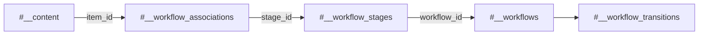
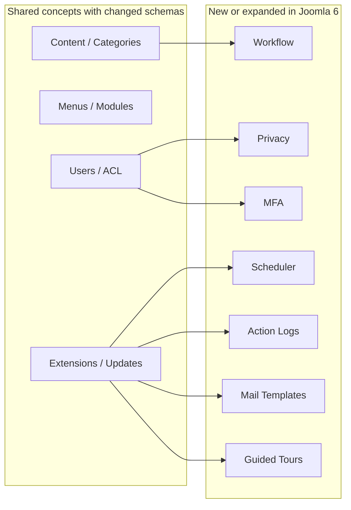

# Joomla 3 vs Joomla 6 Database Gap Analysis

> A migration-focused comparison of Joomla 3.10.x and Joomla 6.x database structures.

## Quick Summary

Joomla 6 keeps many familiar Joomla 3 tables, but **matching table names do not mean the rows can be copied directly**.

| Area | Overall result | Default migration decision |
|---|---|---|
| Content, categories, tags, fields | Mostly the same concepts, changed schemas and references | Transform and migrate |
| Menus, modules, template styles | Same concepts, target IDs and configuration differ | Transform after target extensions/templates exist |
| Users and ACL | Same core model, security and ACL behavior changed | Selectively migrate and rebuild ACL assets |
| Extensions and updates | Same registry purpose, installation-owned records differ | Reinstall and map by extension identity |
| Workflow | New in Joomla 6 | Create target workflow records and associations |
| Scheduler, privacy, logs, MFA, mail templates | New or substantially expanded in Joomla 6 | Keep Joomla 6 defaults or configure explicitly |
| Sessions, search indexes, update cache, logs | Generated or runtime data | Rebuild; do not copy |

> [!IMPORTANT]
> The tables below describe common logical differences. Before implementing migration SQL, compare the exact schemas from both installed projects using `SHOW CREATE TABLE` or `information_schema`.

---

## Table of Contents

- [1. Status Legend](#1-status-legend)
- [2. Detailed Column Change Legend](#2-detailed-column-change-legend)
- [3. Comparison Matrix](#3-comparison-matrix)
  - [3.1 Content, Tags, and Fields](#31-content-tags-and-fields)
  - [3.2 Workflow](#32-workflow)
  - [3.3 Menus, Modules, and Templates](#33-menus-modules-and-templates)
  - [3.4 Users and ACL](#34-users-and-acl)
  - [3.5 Extensions and Updates](#35-extensions-and-updates)
  - [3.6 Search, Languages, and Supporting Components](#36-search-languages-and-supporting-components)
  - [3.7 New Joomla 6 Subsystems](#37-new-joomla-6-subsystems)
  - [3.8 Runtime and Generated Data](#38-runtime-and-generated-data)
- [4. Main ERD Gaps](#4-main-erd-gaps)
- [5. Column-Level Migration Risks](#5-column-level-migration-risks)
- [6. Tables That Must Not Be Copied Directly](#6-tables-that-must-not-be-copied-directly)
- [7. Validation Checklist](#7-validation-checklist)
- [8. Related Documentation](#8-related-documentation)

---

## 1. Status Legend

These statuses describe the **table-level relationship** between Joomla 3 and Joomla 6.

| Status | Meaning | Default handling |
|---|---|---|
| **Same** | The table and its main responsibility remain effectively the same | Validate the physical schema before copying |
| **Changed** | The table exists in both versions, but columns, references, defaults, or behavior differ | Transform rows and remap references |
| **New in Joomla 6** | Joomla 6 introduces a new table or subsystem | Keep target defaults or create valid target records |
| **Rebuild** | The data is generated, runtime, security-sensitive, or installation-owned | Do not migrate rows; regenerate in Joomla 6 |
| **Conditional** | Migration depends on feature usage, legal retention, or business requirements | Migrate only after explicit approval |
| **Legacy / Review** | Joomla 3 storage is obsolete or no longer the preferred Joomla 6 model | Review replacement and retention strategy |

## 2. Detailed Column Change Legend

These labels describe **what to do with individual columns or relationships**.

| Label | Meaning | Typical action |
|---|---|---|
| **Keep** | The business value remains useful and has the same meaning | Copy after checking type, length, nullability, charset, and default |
| **Remap** | The value points to another record whose target ID may differ | Replace it through a source-to-target mapping table |
| **Transform** | The value or structure is not directly compatible | Convert JSON, enum/state, dates, paths, URLs, or serialized data |
| **Verify** | Compatibility cannot be confirmed from the column name alone | Compare the exact Joomla 3 and Joomla 6 schemas and behavior |
| **Rebuild** | Joomla 6 should regenerate the value or relationship | Rebuild trees, assets, indexes, workflow links, or derived data |
| **Reset** | Keep the parent record, but clear temporary source values | Set to `NULL`, `0`, or the Joomla 6 default |
| **Skip** | The value should not be migrated | Exclude runtime, cache, temporary, or sensitive data |
| **Target-owned** | Joomla 6 or an installed extension owns the record/value | Preserve the Joomla 6 value instead of importing the source value |
| **Add relationship** | Joomla 6 requires a relationship that Joomla 3 did not have | Create target workflow, MFA, scheduler, or other required links |

### Reading example

```text
Keep: title, alias
Remap: catid, access, asset_id
Transform: params, images, state
Rebuild: lft, rgt, level, path
Reset: checked_out, checked_out_time
Add relationship: workflow association
```

> [!NOTE]
> A single column may need more than one action. For example, `images` may be **Keep + Transform + Verify** because the image paths are retained, the JSON may need conversion, and the target media path must be checked.

---

## 3. Comparison Matrix

### 3.1 Content, Tags, and Fields

| Joomla 3 table | Joomla 6 table | Status | Detailed column changes | Recommended action |
|---|---|---|---|---|
| `#__content` | `#__content` | **Changed** | **Keep:** `title`, `alias`, `introtext`, `fulltext`, `created`, `modified`, `metakey`, `metadesc`, `hits`, `language`. **Remap:** `catid`, `created_by`, `modified_by`, `access`, `asset_id`. **Transform/Verify:** `state`, `featured`, `images`, `urls`, `attribs`, `metadata`, `publish_up`, `publish_down`, `version`, `note`. **Reset:** `checked_out`, `checked_out_time`. **Add relationship:** workflow association | Transform articles, map all references, validate JSON/dates, then create workflow associations |
| `#__categories` | `#__categories` | **Changed** | **Keep:** `extension`, `title`, `alias`, `description`, `language`. **Remap:** `parent_id`, `asset_id`, `access`, creator/modifier IDs. **Transform:** `params`, `metadata`, states and dates. **Rebuild:** `lft`, `rgt`, `level`, `path`. **Reset:** checkout fields | Import parent-first and rebuild the category tree |
| `#__content_frontpage` | `#__content_frontpage` | **Changed** | **Remap:** `content_id`. **Keep/Verify:** `ordering`. **Verify:** target featured scheduling columns and defaults | Insert after articles and keep `#__content.featured` consistent |
| `#__content_rating` | `#__content_rating` | **Conditional** | **Remap:** `content_id`. **Keep/Verify:** rating totals and counts. **Review:** IP or audit fields | Migrate only when rating history is required |
| `#__tags` | `#__tags` | **Changed** | **Keep:** `title`, `alias`, `description`, `language`. **Remap:** `parent_id`, `asset_id`, `access`, creator/modifier IDs. **Transform:** `params`, `metadata`, publication dates. **Rebuild:** `lft`, `rgt`, `level`, `path` | Import parent-first and rebuild the tag tree |
| `#__contentitem_tag_map` | `#__contentitem_tag_map` | **Changed** | **Remap:** `content_item_id`, `core_content_id`, `tag_id`, content-type IDs. **Transform/Verify:** `type_alias`. **Rebuild:** derived ordering/index values when present | Recreate after content, tags, and content types exist |
| `#__fields_groups` | `#__fields_groups` | **Changed** | **Keep:** `title`, `context`, `language`, `note`. **Remap:** `asset_id`, `access`, creator/modifier IDs. **Transform:** `params`. **Verify:** state, ordering, checkout columns | Create groups before fields |
| `#__fields` | `#__fields` | **Changed** | **Keep:** `title`, `name`, `label`, `description`, `type`, `context`, `language`. **Remap:** `group_id`, `asset_id`, `access`, creator/modifier IDs. **Transform:** `params`, `fieldparams`, defaults. **Verify:** required flags, ordering, target field plugin availability | Install field plugins, then transform definitions |
| `#__fields_values` | `#__fields_values` | **Changed** | **Remap:** `field_id`, `item_id`. **Keep/Transform:** `value`, especially multi-value or serialized formats | Insert after fields and target items exist |
| `#__fields_categories` | `#__fields_categories` | **Changed** | **Remap:** `field_id`, `category_id` | Recreate using mapping tables |
| `#__associations` | `#__associations` | **Changed** | **Remap:** associated item IDs. **Keep/Verify:** association `key`, `context`. **Rebuild:** incomplete groups | Recreate after all multilingual target items exist |
| `#__content_types` | `#__content_types` | **Rebuild** | **Target-owned:** raw IDs and registry rows. **Map by:** `type_alias`, component identity, table identity. **Keep target:** routers, field mappings, history configuration | Keep Joomla 6 registry records and map by alias |
| `#__ucm_base` | Joomla 6 content integration | **Legacy / Review** | **Skip raw IDs. Verify:** UCM item/type/language references. **Rebuild:** target integration records when required | Rebuild only if a target extension still depends on UCM |
| `#__ucm_content` | Joomla 6 content integration | **Legacy / Review** | **Remap:** content item, type, category, author, access IDs. **Transform:** JSON and metadata. **Prefer Rebuild** | Let Joomla 6 generate records when supported |
| `#__ucm_history` | `#__contenthistory` or current history storage | **Legacy / Review** | **Remap:** item/type/editor IDs. **Transform:** `version_data`, metadata JSON. **Verify:** dates, notes, retention flags | Migrate only when history retention is required |
| `#__contact_details` | `#__contact_details` | **Changed** | **Keep:** identity and contact text. **Remap:** category, user, access, asset, creator/modifier IDs. **Transform:** params, metadata, image paths, dates | Use a component-specific migration |
| `#__newsfeeds` | `#__newsfeeds` | **Changed** | **Keep:** name/title, alias, URL, description, language. **Remap:** category, access, creator/modifier IDs. **Transform:** params, metadata, publication fields | Migrate only when the component is used |
| `#__banners` | `#__banners` | **Changed** | **Keep:** name, alias, click URL, image/custom code, required statistics. **Remap:** category, client, creator/modifier IDs. **Transform:** params, metadata, dates | Migrate with clients and categories |
| `#__banner_clients` | `#__banner_clients` | **Changed** | **Keep:** name, contact information, notes. **Remap:** creator/modifier IDs. **Transform:** tracking configuration | Import before banners |
| `#__banner_tracks` | `#__banner_tracks` | **Conditional** | **Remap:** banner/client IDs. **Keep/Verify:** type, count, date. **Review:** reporting retention | Migrate only when historical reports are required |

### 3.2 Workflow

Joomla 6 adds a formal content workflow model that has no direct Joomla 3 equivalent.

| Joomla 3 table | Joomla 6 table | Status | Detailed column changes | Recommended action |
|---|---|---|---|---|
| No core equivalent | `#__workflows` | **New in Joomla 6** | **Target-owned:** `id`, `asset_id`. **Configure:** title, description, extension, default, state, ordering, params | Keep the Basic Workflow or create an approved target workflow |
| No core equivalent | `#__workflow_stages` | **New in Joomla 6** | **Target-owned/Remap:** stage ID, asset ID, workflow ID. **Configure:** title, description, state, default, ordering | Map Joomla 3 article states to target stage IDs |
| No core equivalent | `#__workflow_transitions` | **New in Joomla 6** | **Target-owned/Remap:** IDs, workflow, from/to stages. **Configure:** title, state, ordering, options | Keep or configure Joomla 6 transitions |
| No core equivalent | `#__workflow_associations` | **New in Joomla 6** | **Add relationship:** target `item_id`, mapped `stage_id`, extension context | Create one valid association per migrated article when workflow is active |



### 3.3 Menus, Modules, and Templates

| Joomla 3 table | Joomla 6 table | Status | Detailed column changes | Recommended action |
|---|---|---|---|---|
| `#__menu_types` | `#__menu_types` | **Changed** | **Keep:** `menutype`, `title`, `description`. **Verify:** `client_id` and target permission fields. **Skip:** Joomla 3 administrator menu types | Migrate approved frontend menu containers only |
| `#__menu` | `#__menu` | **Changed** | **Keep:** title, alias, type, menutype, language, browser navigation. **Remap:** parent, component, access, template style IDs. **Transform:** params and images. **Rewrite:** `link` IDs/component/view/task values. **Rebuild:** `lft`, `rgt`, `level`, `path`. **Reset:** checkout fields. **Verify:** home, client, published state | Import frontend items parent-first, rewrite links, rebuild the tree |
| `#__modules` | `#__modules` | **Changed** | **Keep:** title, content, showtitle, language, dates. **Remap:** asset, access, creator IDs. **Map:** module type and template position. **Transform:** params. **Reset:** checkout fields. **Skip:** incompatible administrator modules | Install compatible module code first, then migrate frontend instances |
| `#__modules_menu` | `#__modules_menu` | **Changed** | **Remap:** `moduleid`, absolute `menuid`. **Keep:** `0`, positive include, and negative exclude semantics | Recreate after modules and menu items exist |
| `#__template_styles` | `#__template_styles` | **Changed** | **Keep selectively:** style title. **Map:** template name. **Transform:** params. **Verify:** client, default/home, inheritance fields. **Skip:** incompatible template-specific options | Install the Joomla 6 template and recreate approved styles |

### 3.4 Users and ACL

| Joomla 3 table | Joomla 6 table | Status | Detailed column changes | Recommended action |
|---|---|---|---|---|
| `#__users` | `#__users` | **Changed** | **Keep:** identity, email, compatible password hash, status, mail preference, registration/visit dates. **Transform/Verify:** params, activation, reset state. **Reset/Skip:** temporary reset tokens, OTP secrets, emergency codes. **Verify target-only:** security and reset fields | Selectively migrate approved users and force resets when needed |
| `#__usergroups` | `#__usergroups` | **Changed** | **Keep:** custom group title. **Remap:** parent ID. **Rebuild:** nested-set values. **Target-owned:** Joomla 6 core groups | Map core groups by meaning; create custom groups parent-first |
| `#__user_usergroup_map` | `#__user_usergroup_map` | **Changed** | **Remap:** user and group IDs. **Verify:** duplicate composite mappings | Insert after users and groups exist |
| `#__viewlevels` | `#__viewlevels` | **Changed** | **Keep:** title, ordering. **Transform:** `rules` JSON by replacing source group IDs | Map by meaning and transformed rules |
| `#__assets` | `#__assets` | **Changed / Rebuild** | **Target-owned:** core asset IDs and tree. **Rebuild:** parent, `lft`, `rgt`, level, names and rules for migrated objects. **Remap:** resulting asset IDs back to content/categories/modules | Keep Joomla 6 core assets and rebuild migrated object assets |
| `#__user_profiles` | `#__user_profiles` | **Conditional** | **Remap:** user ID. **Keep selectively:** profile key/value/order. **Skip:** obsolete plugin namespaces | Migrate approved profile namespaces only |
| `#__user_notes` | `#__user_notes` | **Conditional** | **Keep:** approved note content/state/dates. **Remap:** user, category, creator/modifier IDs. **Transform:** metadata | Migrate only when business and privacy requirements justify it |
| `#__user_keys` | `#__user_keys` | **Rebuild** | **Skip:** all authentication/remember-me key fields | Never migrate |
| OTP fields in `#__users` | `#__user_mfa` | **New / Changed** | **Skip:** Joomla 3 OTP secrets and emergency codes. **Target-owned:** MFA method records and secrets | Require MFA re-enrollment |
| `#__session` | `#__session` | **Rebuild** | **Skip:** session ID, payload, user link, time, client, guest state | Start with an empty Joomla 6 session table |

### 3.5 Extensions and Updates

| Joomla 3 table | Joomla 6 table | Status | Detailed column changes | Recommended action |
|---|---|---|---|---|
| `#__extensions` | `#__extensions` | **Changed / Rebuild** | **Map identity by:** `type + element + folder + client_id`. **Target-owned:** extension/package IDs and core rows. **Verify/Transform:** params, manifest cache, enabled, access, protected, ordering. **Joomla 6 fields:** changelog URL, locked, custom data, state, note. **Reset:** checkout fields | Install compatible packages and build an extension ID map |
| `#__schemas` | `#__schemas` | **Rebuild** | **Target-owned:** extension ID and schema version | Let installers and update SQL create records |
| `#__update_sites` | `#__update_sites` | **Rebuild** | **Target-owned:** IDs and installer rows. **Verify:** name, type, URL, enabled, extra query, last check | Recreate through extension installation |
| `#__update_sites_extensions` | `#__update_sites_extensions` | **Rebuild** | **Rebuild:** update-site and extension IDs using target rows | Do not copy |
| `#__updates` | `#__updates` | **Rebuild** | **Skip:** all generated update-discovery rows | Clear and rediscover updates |
| `#__postinstall_messages` | `#__postinstall_messages` | **Rebuild** | **Target-owned:** version- and extension-specific messages | Keep Joomla 6 records |

### 3.6 Search, Languages, and Supporting Components

| Joomla 3 table | Joomla 6 table | Status | Detailed column changes | Recommended action |
|---|---|---|---|---|
| `#__finder_links` | `#__finder_links` | **Rebuild** | **Skip:** generated IDs, URLs, routes, index state/access/language copies, taxonomy mappings | Rebuild Smart Search |
| `#__finder_terms` | `#__finder_terms` | **Rebuild** | **Skip:** term IDs, stems, frequencies, weights | Re-index in Joomla 6 |
| `#__finder_taxonomy` | `#__finder_taxonomy` | **Rebuild** | **Skip/Rebuild:** parent/tree values, state, access, language, mappings | Re-index in Joomla 6 |
| `#__finder_tokens*` | Current Joomla 6 Finder storage | **Rebuild** | **Skip:** all token and temporary index data | Do not migrate |
| `#__finder_filters` | `#__finder_filters` | **Conditional** | **Keep selectively:** title, alias, state, language. **Remap/Transform:** taxonomy IDs, filter JSON, access, creator | Recreate approved filters after indexing |
| `#__languages` | `#__languages` | **Changed** | **Keep/Verify:** language code, titles, SEF code, image, description, metadata. **Remap:** access. **Verify:** default/home, ordering, published state. **Target-owned:** installed language packages | Install language packages first, then migrate configuration |
| `#__associations` | `#__associations` | **Changed** | **Remap:** associated item IDs. **Keep/Verify:** key and context | Rebuild after target items exist |
| `#__redirect_links` | `#__redirect_links` | **Changed** | **Keep selectively:** old URL, comment, state. **Transform/Generate:** new URL, dates, status code. **Verify:** duplicate chains and loops | Generate redirects from old-to-new URL mapping |
| `#__messages` | `#__messages` | **Conditional** | **Remap:** sender/recipient IDs. **Keep selectively:** subject, body, state, priority, dates. **Skip:** rows with missing users | Usually skip unless retention is required |
| `#__messages_cfg` | Current message configuration | **Legacy / Review** | **Remap:** user IDs. **Transform/Verify:** namespace and serialized/JSON settings | Review exact target schema |
| `#__core_log_searches` | No normal target requirement | **Legacy / Review** | **Archive only:** terms and counts when reporting requires them | Do not import into Joomla 6 core tables |
| `#__utf8_conversion` | No normal target requirement | **Legacy / Review** | **Skip:** conversion bookkeeping rows | Do not migrate |

### 3.7 New Joomla 6 Subsystems

| Joomla 3 table | Joomla 6 table | Status | Detailed column changes | Recommended action |
|---|---|---|---|---|
| No core equivalent | `#__scheduler_tasks` | **New in Joomla 6** | **Target-owned:** IDs, assets, task types, execution rules, state, priority, params, timestamps | Keep core tasks; recreate extension tasks through installers/configuration |
| No core equivalent | `#__scheduler_log` | **New / Rebuild** | **Skip/Start empty:** task/run IDs, results, output, duration, timestamps | Do not migrate historical rows |
| No core equivalent | `#__action_logs` | **New / Conditional** | **Target-generated:** message, context, user/record IDs, extension, date, IP. **Review:** legal retention | Start fresh unless retention is mandatory |
| No core equivalent | `#__action_logs_extensions` | **New in Joomla 6** | **Target-owned:** extension identifiers and enabled state | Keep Joomla 6 records |
| No core equivalent | `#__action_log_config` | **New in Joomla 6** | **Configure:** type alias/title, ID/title holders, table, text prefix | Configure in Joomla 6 |
| No core equivalent | `#__privacy_requests` | **New / Conditional** | **Review:** request type, email, status, dates, tokens/hashes. **Skip:** obsolete source tokens | Migrate only under an approved legal-retention plan |
| No core equivalent | `#__privacy_consents` | **New / Conditional** | **Remap:** user ID. **Keep/Verify:** subject, body, dates, state, IP. **Review:** privacy policy | Import only with legal approval |
| No core equivalent | `#__mail_templates` | **New in Joomla 6** | **Target-owned:** template ID and extension identity. **Configure:** language, subject, bodies, attachments, params | Keep defaults or recreate approved overrides |
| No core equivalent | `#__guidedtours` | **New in Joomla 6** | **Target-owned:** IDs and installer-created tour configuration | Keep Joomla 6 and extension records |
| No core equivalent | `#__guidedtour_steps` | **New in Joomla 6** | **Target-owned/Remap:** tour ID and step configuration | Keep installer-created records |

### 3.8 Runtime and Generated Data

| Joomla 3 data | Joomla 6 equivalent | Status | Detailed column changes | Recommended action |
|---|---|---|---|---|
| Active sessions | `#__session` | **Rebuild** | **Skip:** session IDs, payloads, user references, timestamps, client and guest flags | Start empty |
| Cache data | Joomla 6 cache storage | **Rebuild** | **Skip:** cache keys, blobs, expiry and group metadata | Clear and regenerate |
| Smart Search index | `#__finder_*` | **Rebuild** | **Skip:** all index, token, term, taxonomy and mapping rows | Re-index after migration |
| Update discovery | `#__updates` | **Rebuild** | **Skip:** discovered versions and update metadata | Rediscover in Joomla 6 |
| Scheduler history | `#__scheduler_log` | **New / Rebuild** | **Start empty:** no Joomla 3 mapping | Start fresh |
| Action logs | `#__action_logs` | **New / Conditional** | **Add relationship/Remap:** user, record, extension and date only when approved | Start fresh by default |
| Remember-me/auth keys | `#__user_keys` | **Rebuild** | **Skip:** tokens, series, handles, expiry and last-used values | Never migrate |
| MFA secrets | `#__user_mfa` | **New / Security-sensitive** | **Skip:** direct conversion of Joomla 3 OTP secrets | Require re-enrollment |

---

## 4. Main ERD Gaps



The main difference is not a complete replacement of Joomla 3 tables. Joomla 6:

```text
Keeps many core entities
+ changes schemas, defaults, and installation-owned IDs
+ adds new subsystems and relationships
+ requires generated and security data to be rebuilt
```

## 5. Column-Level Migration Risks

| Risk type | Common columns | Required handling |
|---|---|---|
| Primary IDs | `id`, `extension_id`, `asset_id` | Preserve only when proven safe; otherwise map |
| Logical references | `catid`, `parent_id`, `user_id`, `component_id`, `access`, `group_id`, `field_id`, `item_id`, `tag_id` | Remap to target IDs |
| Nested-set trees | `parent_id`, `lft`, `rgt`, `level`, `path` | Import parent-first and rebuild |
| JSON configuration | `params`, `attribs`, `metadata`, `images`, `urls`, `rules`, `manifest_cache`, `custom_data`, `fieldparams` | Decode, validate, transform, remap embedded values, re-encode |
| State values | `state`, `published`, `enabled`, `featured`, `home`, `default` | Map to target behavior and workflow stages |
| Dates | `created`, `modified`, `publish_up`, `publish_down`, zero dates | Normalize invalid values and target nullability |
| Runtime values | `checked_out`, `checked_out_time`, sessions, cache | Reset or skip |
| Authentication/security | Passwords, reset tokens, user keys, OTP/MFA secrets | Migrate only supported password hashes; skip temporary secrets |
| Installation-owned values | Extension IDs, assets, schemas, update sites, workflow IDs | Preserve target rows and map by identity |
| Routing values | `link`, `path`, `alias`, template style and component/view/task IDs | Rewrite and validate URLs |

## 6. Tables That Must Not Be Copied Directly

| Table or group | Reason |
|---|---|
| `#__assets` | Joomla 6 ACL tree and core assets differ |
| `#__extensions` | Registry IDs and installed extension rows are target-specific |
| `#__schemas` | Must reflect actual target schema versions |
| `#__update_sites` | Update sources belong to target extensions |
| `#__update_sites_extensions` | Depends on target extension IDs |
| `#__updates` | Generated discovery data |
| `#__session` | Runtime and security-sensitive |
| `#__user_keys` | Temporary authentication data |
| `#__user_mfa` | Security-sensitive target data |
| `#__finder_*` | Generated search index |
| `#__scheduler_tasks` | Core and extension tasks are installer-owned |
| `#__scheduler_log` | Generated execution history |
| `#__action_logs*` | Generated target audit records |
| `#__privacy_*` | Requires legal and business review |
| `#__postinstall_messages` | Version-specific records |
| Joomla 3 administrator menus/modules | Joomla 6 administrator UI is structurally different |

## 7. Validation Checklist

- [ ] Export `SHOW CREATE TABLE` for each compared table in both databases.
- [ ] Compare names, types, unsigned flags, nullability, defaults, comments, indexes, charset, and collation.
- [ ] Mark each source column as Keep, Remap, Transform, Verify, Rebuild, Reset, Skip, Target-owned, or Add relationship.
- [ ] Install Joomla 6-compatible extensions before mapping extension-owned data.
- [ ] Build mappings for users, groups, access levels, assets, categories, articles, tags, fields, extensions, menus, modules, and template styles.
- [ ] Rebuild category, tag, menu, user-group, and asset trees.
- [ ] Normalize invalid dates and validate every JSON value.
- [ ] Rewrite menu links and IDs embedded in configuration.
- [ ] Create valid Joomla 6 workflow associations.
- [ ] Start sessions, caches, search indexes, scheduler logs, action logs, and MFA data fresh unless an approved exception exists.
- [ ] Compare row counts, hashes, relationships, URLs, permissions, multilingual behavior, modules, and rendered output.

## 8. Related Documentation

- [Joomla 3 Database Overview](./joomla3/database-overview.md)
- [Joomla 3 Complete ERD](./joomla3/complete-erd.md)
- [Joomla 6 Database Overview](./joomla6/database-overview.md)
- [Joomla 6 Complete ERD](./joomla6/complete-erd.md)
- [Joomla 3 to Joomla 6 Database Migration Checklist](./joomla3-to-joomla6-database-migration-checklist.md)
