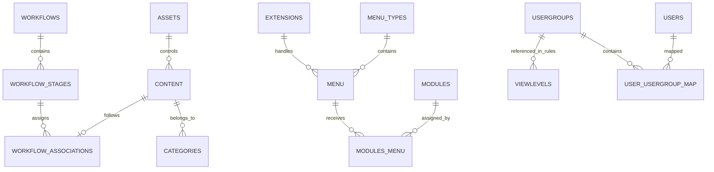

# Joomla 3 vs Joomla 6 Database Gap Analysis

A practical comparison of Joomla 3.10.x and Joomla 6.x database structures for migration planning.

> **Important:** The column details below describe the main logical and commonly encountered schema gaps. Always verify the exact physical schema from both installed projects because patch versions and extensions can add, remove, or alter columns.

## Table of Contents

- [1. Comparison Status](#1-comparison-status)
- [2. How to Read Column Changes](#2-how-to-read-column-changes)
- [3. Complete Comparison Matrix](#3-complete-comparison-matrix)
  - [3.1 Content, Tags, and Fields](#31-content-tags-and-fields)
  - [3.2 Workflow](#32-workflow)
  - [3.3 Menus, Modules, and Templates](#33-menus-modules-and-templates)
  - [3.4 Users and ACL](#34-users-and-acl)
  - [3.5 Extensions and Updates](#35-extensions-and-updates)
  - [3.6 Search, Language, and Supporting Components](#36-search-language-and-supporting-components)
  - [3.7 New Joomla 6 Subsystems](#37-new-joomla-6-subsystems)
  - [3.8 Runtime and Generated Data](#38-runtime-and-generated-data)
- [4. Main ERD Gaps](#4-main-erd-gaps)
- [5. Main Column-Level Migration Risks](#5-main-column-level-migration-risks)
- [6. Tables That Must Not Be Copied Directly](#6-tables-that-must-not-be-copied-directly)
- [7. Validation Checklist](#7-validation-checklist)

## 1. Comparison Status

| Status | Meaning | Migration implication |
|---|---|---|
| **Same** | The table and its main purpose exist in both versions | Validate columns, defaults, indexes, and data before copying |
| **Changed** | The table exists in both versions, but schema or behavior differs | Transform records and remap references |
| **New in Joomla 6** | Joomla 6 introduces a new table or subsystem | Keep target defaults or create valid Joomla 6 records |
| **Rebuild** | The table contains generated, runtime, security, or installation-owned data | Do not migrate rows; regenerate them |
| **Conditional** | Migration depends on actual project usage or retention rules | Migrate only after scope approval |
| **Legacy / Review** | Joomla 3 storage is no longer the preferred target model | Review replacement and retention requirements |

## 2. How to Read Column Changes

The **Detailed column changes** column uses these labels:

| Label | Meaning |
|---|---|
| **Keep** | The business value normally remains useful |
| **Remap** | The value references a target record whose ID may change |
| **Transform** | The value or JSON structure may require conversion |
| **Rebuild** | Joomla 6 should generate the value or record |
| **Drop / Skip** | The value should normally not be migrated |
| **Verify** | Compare the exact Joomla 3 and Joomla 6 physical schemas |

Example:

```text
Keep: title, alias
Remap: catid, access, asset_id
Transform: params, images
Rebuild: lft, rgt
Skip: checked_out runtime state
```

## 3. Complete Comparison Matrix

### 3.1 Content, Tags, and Fields

| Joomla 3 table | Joomla 6 table | Status | Main gap | Detailed column changes | Recommended action |
|---|---|---|---|---|---|
| `#__content` | `#__content` | **Changed** | Article purpose remains, but defaults, workflow integration, dates, JSON, and references differ | **Keep:** `title`, `alias`, `introtext`, `fulltext`, `created`, `modified`, `metakey`, `metadesc`, `hits`, `language`. **Remap:** `catid`, `created_by`, `modified_by`, `access`, `asset_id`. **Transform/verify:** `state`, `featured`, `images`, `urls`, `attribs`, `metadata`, `publish_up`, `publish_down`, `version`, `note`. **Reset:** `checked_out`, `checked_out_time`. **Add relationship:** target workflow association | Transform articles, map all references, validate JSON and dates, then create workflow associations |
| `#__categories` | `#__categories` | **Changed** | Same shared category and nested-set model, but assets, roots, defaults, and target extension records differ | **Keep:** `extension`, `title`, `alias`, `description`, `language`. **Remap:** `parent_id`, `asset_id`, `access`, `created_user_id`, `modified_user_id`. **Transform:** `params`, `metadata`, publication dates/state. **Rebuild:** `lft`, `rgt`, `level`, `path`. **Reset:** checkout fields | Import parent-first, map the owning component, and rebuild the category tree |
| `#__content_frontpage` | `#__content_frontpage` | **Changed** | Featured mapping remains; target schema may include additional scheduling fields | **Remap:** `content_id`. **Keep/verify:** `ordering`. **Verify target-only columns:** featured start/end dates or target defaults when present | Insert after articles and keep `#__content.featured` consistent |
| `#__content_rating` | `#__content_rating` | **Conditional** | Ratings remain optional; privacy and physical columns may differ | **Remap:** `content_id`. **Keep/verify:** rating totals and counts. **Review:** IP-related or audit fields | Migrate only when historical ratings are required |
| `#__tags` | `#__tags` | **Changed** | Same hierarchical taxonomy, but ACL, assets, defaults, and tree values differ | **Keep:** `title`, `alias`, `description`, `language`. **Remap:** `parent_id`, `asset_id`, `access`, creator/modifier IDs. **Transform:** `params`, `metadata`, publication dates. **Rebuild:** `lft`, `rgt`, `level`, `path` | Import parent-first and rebuild the tag tree |
| `#__contentitem_tag_map` | `#__contentitem_tag_map` | **Changed** | Same polymorphic mapping, but every referenced identifier may differ | **Remap:** `content_item_id`, `core_content_id`, `tag_id`, content type IDs. **Verify/transform:** `type_alias`. **Rebuild:** ordering/index-derived values if present | Recreate mappings only after content, tags, and content types exist |
| `#__fields_groups` | `#__fields_groups` | **Changed** | Group purpose remains, but contexts, assets, access, and options may differ | **Keep:** `title`, `context`, `language`, `note`. **Remap:** `asset_id`, `access`, creator/modifier IDs. **Transform:** `params`. **Verify:** state, ordering, checkout columns | Recreate groups before fields |
| `#__fields` | `#__fields` | **Changed** | Field definitions depend on Joomla 6 field plugins and accepted contexts | **Keep:** `title`, `name`, `label`, `description`, `type`, `context`, `language`. **Remap:** `group_id`, `asset_id`, `access`, creator/modifier IDs. **Transform:** `params`, `fieldparams`, default values. **Verify:** `required`, `only_use_in_subform`, state/order columns. **Dependency:** target field plugin must exist | Install field plugins, then transform field definitions |
| `#__fields_values` | `#__fields_values` | **Changed** | Same value mapping, but both IDs are target-specific | **Remap:** `field_id`, `item_id`. **Keep/transform:** `value`, especially multi-value or serialized formats | Insert only after fields and target items exist |
| `#__fields_categories` | `#__fields_categories` | **Changed** | Same field restriction mapping | **Remap:** `field_id`, `category_id` | Rebuild from field and category mapping tables |
| `#__associations` | `#__associations` | **Changed** | Same multilingual grouping, but item IDs and contexts change | **Remap:** item IDs contained in `id`. **Keep/verify:** `key`, `context`. **Rebuild:** groups when source members fail migration | Recreate after all multilingual content and menus exist |
| `#__content_types` | `#__content_types` | **Rebuild** | Registry rows are owned by Joomla 6 and installed extensions | **Do not preserve raw IDs.** **Map by:** `type_alias`, table identity, component identity. **Keep target:** `type_title`, `router`, `field_mappings`, `content_history_options` as created by installers | Keep Joomla 6 registry; map aliases instead of copying rows |
| `#__ucm_base` | Joomla 6 UCM/content integration | **Legacy / Review** | Usage differs across Joomla generations | **Do not copy IDs.** **Verify:** `ucm_item_id`, `ucm_type_id`, `ucm_language_id`. **Rebuild:** target integration records where required | Rebuild only when a target extension still requires UCM records |
| `#__ucm_content` | Joomla 6 UCM/content integration | **Legacy / Review** | Data is often derived from target content and content types | **Remap:** `core_content_item_id`, `core_type_id`, `core_catid`, `core_created_user_id`, `core_access`. **Transform:** JSON and metadata fields. Prefer rebuild | Let Joomla 6 generate records where supported |
| `#__ucm_history` | `#__contenthistory` or current history storage | **Legacy / Review** | History storage and payload formats changed | **Remap:** item and type IDs. **Transform:** `version_data`, metadata JSON, editor IDs. **Verify:** save date, version note, keep-forever flags | Migrate only under an explicit history-retention requirement |
| `#__contact_details` | `#__contact_details` | **Changed** | Contact purpose remains, but fields, routing, ACL, users, categories, and params differ | **Keep:** name, alias, address/contact text, metadata. **Remap:** `catid`, `user_id`, `access`, `asset_id`, creator/modifier IDs. **Transform:** `params`, `metadata`, image paths, publication dates. **Rebuild:** tree/order-related derived values where applicable | Use a component-specific migration |
| `#__newsfeeds` | `#__newsfeeds` | **Changed** | Same business purpose; schema and component behavior may differ | **Keep:** name/title, alias, link, description, language. **Remap:** `catid`, `access`, creator/modifier IDs. **Transform:** `params`, metadata, publication fields | Migrate only when the component is enabled and used |
| `#__banners` | `#__banners` | **Changed** | Same banner purpose, but supporting IDs, tracking rules, and params differ | **Keep:** name, alias, click URL, image/custom code, impressions/clicks when required. **Remap:** `catid`, `cid`, `created_by`, `modified_by`. **Transform:** `params`, metadata, date fields. **Verify:** tracking and purchase fields | Migrate with banner clients and categories |
| `#__banner_clients` | `#__banner_clients` | **Changed** | Same client ownership concept | **Keep:** name, contact details, notes. **Remap:** creator/modifier IDs where present. **Transform:** `metakey`, extra tracking configuration | Import before banners |
| `#__banner_tracks` | `#__banner_tracks` | **Conditional** | Historical statistics are optional and may be large | **Remap:** banner/client IDs. **Keep/verify:** track type, count, date. **Review:** retention and aggregation strategy | Migrate only when historical reporting is required |

### 3.2 Workflow

| Joomla 3 table | Joomla 6 table | Status | Main gap | Detailed column changes | Recommended action |
|---|---|---|---|---|---|
| No core equivalent | `#__workflows` | **New in Joomla 6** | Defines workflow containers | **Target-owned:** `id`, `asset_id`. **Configure:** `title`, `description`, `extension`, `default`, `published`, `ordering`, `params`. **Do not derive raw IDs from Joomla 3** | Keep the Basic Workflow or create an approved target workflow |
| No core equivalent | `#__workflow_stages` | **New in Joomla 6** | Defines stages inside workflows | **Target-owned/remap:** `id`, `asset_id`, `workflow_id`. **Configure:** `title`, `description`, `published`, `default`, `ordering` | Map Joomla 3 article states to target stage IDs |
| No core equivalent | `#__workflow_transitions` | **New in Joomla 6** | Defines allowed transitions between stages | **Target-owned/remap:** `id`, `asset_id`, `workflow_id`, `from_stage_id`, `to_stage_id`. **Configure:** `title`, `description`, `published`, `ordering`, `options` | Keep/configure Joomla 6 transitions rather than fabricating them from source rows |
| No core equivalent | `#__workflow_associations` | **New in Joomla 6** | Connects each article to its current stage | **Create:** `item_id` from target article ID, `stage_id` from state-to-stage mapping, `extension` such as `com_content.article` | Create one valid association for every migrated article when workflow is active |

### 3.3 Menus, Modules, and Templates

| Joomla 3 table | Joomla 6 table | Status | Main gap | Detailed column changes | Recommended action |
|---|---|---|---|---|---|
| `#__menu_types` | `#__menu_types` | **Changed** | Frontend menu concept remains; administrator menu records differ | **Keep:** `menutype`, `title`, `description`. **Verify:** `client_id` and target-only permission/asset references. **Skip:** Joomla 3 administrator menu types | Migrate approved frontend menu containers only |
| `#__menu` | `#__menu` | **Changed** | Routing purpose remains, but component IDs, links, params, trees, home flags, and admin items differ | **Keep:** `title`, `alias`, `type`, `menutype`, `language`, `browserNav`. **Remap:** `parent_id`, `component_id`, `access`, `template_style_id`. **Rewrite:** `link` IDs and component/view/task values. **Transform:** `params`, image values. **Rebuild:** `lft`, `rgt`, `level`, `path`. **Reset:** checkout fields. **Validate:** `home`, `client_id`, `published` | Import frontend items parent-first, rewrite links, and rebuild the menu tree |
| `#__modules` | `#__modules` | **Changed** | Module instances remain, but module code, positions, assets, params, and admin dashboards differ | **Keep:** `title`, `content`, `showtitle`, `language`, publication dates. **Remap:** `asset_id`, `access`, creator IDs. **Map:** `module` to an installed Joomla 6 module and `position` to the target template. **Transform:** `params`. **Reset:** checkout fields. **Skip:** incompatible administrator modules | Install compatible module code first, then migrate approved frontend instances |
| `#__modules_menu` | `#__modules_menu` | **Changed** | Same bridge table; both sides may receive new IDs | **Remap:** `moduleid`, absolute value of `menuid`. **Preserve:** `0`, positive include, and negative exclude semantics | Recreate after modules and menu items exist |
| `#__template_styles` | `#__template_styles` | **Changed** | Style concept remains, but Joomla 3 templates are usually incompatible | **Keep selectively:** style title/name. **Map:** `template` to compatible Joomla 6 template. **Transform:** `params`. **Verify:** `client_id`, `home`, inheritance/parent fields available in target. **Do not copy:** incompatible template-specific settings | Install target template and recreate styles from an approved parameter map |

### 3.4 Users and ACL

| Joomla 3 table | Joomla 6 table | Status | Main gap | Detailed column changes | Recommended action |
|---|---|---|---|---|---|
| `#__users` | `#__users` | **Changed** | Identity remains, while authentication, reset, token, and MFA behavior changed | **Keep:** `name`, `username`, `email`, `password` after compatibility test, `block`, `sendEmail`, registration/visit dates. **Transform/verify:** `params`, activation and reset state. **Reset/drop:** temporary reset tokens, OTP secrets, emergency codes, checkout/runtime data. **Verify target-only:** last reset, reset count, require-reset and security fields | Selectively migrate approved accounts and require resets where compatibility is uncertain |
| `#__usergroups` | `#__usergroups` | **Changed** | Same hierarchy, but target core groups and nested-set values are installation-owned | **Keep:** custom group `title`. **Remap:** `parent_id`. **Rebuild:** `lft`, `rgt`, optionally level/path. **Do not overwrite:** Joomla 6 core groups by raw ID | Map core groups by meaning and create custom groups parent-first |
| `#__user_usergroup_map` | `#__user_usergroup_map` | **Changed** | Same many-to-many mapping | **Remap:** `user_id`, `group_id`. **Deduplicate:** composite mappings | Insert after users and groups exist |
| `#__viewlevels` | `#__viewlevels` | **Changed** | Same visibility mechanism, but JSON group IDs differ | **Keep:** `title`, `ordering`. **Transform:** `rules` JSON by replacing source group IDs with target group IDs | Map by meaning and transformed rules, not raw IDs |
| `#__assets` | `#__assets` | **Changed / Rebuild** | Same ACL tree, but Joomla 6 has many additional core assets | **Do not copy raw:** `id`, `parent_id`, `lft`, `rgt`, `level`. **Recreate/map:** `name`, `title`, `rules`. **Assign new:** target `asset_id` values back to categories, articles, modules, workflows, and custom objects | Keep Joomla 6 core assets and rebuild assets for migrated objects |
| `#__user_profiles` | `#__user_profiles` | **Conditional** | Key/value profile storage remains; namespaces depend on plugins | **Remap:** `user_id`. **Keep selectively:** `profile_key`, `profile_value`, `ordering`. **Drop:** obsolete plugin namespaces | Migrate approved namespaces only |
| `#__user_notes` | `#__user_notes` | **Conditional** | Administrator notes remain optional | **Keep:** subject/body/state/review date where required. **Remap:** `user_id`, `catid`, creator/modifier IDs. **Transform:** metadata and dates | Migrate only when business and privacy requirements justify retention |
| `#__user_keys` | `#__user_keys` | **Rebuild** | Temporary authentication keys are invalid on the target | **Skip all columns:** user handle, series, token, expiry, last used | Never migrate |
| OTP columns in `#__users` | `#__user_mfa` | **New / Changed** | MFA data moved into a dedicated modern subsystem | **Do not map directly:** `otpKey`, emergency codes, encrypted secrets. **Target creates:** MFA method, title, records, secrets, timestamps | Require MFA re-enrollment |
| `#__session` | `#__session` | **Rebuild** | Runtime sessions are target-specific | **Skip all:** session ID, user ID session link, time, client, guest, data payload | Start with an empty Joomla 6 session table |

### 3.5 Extensions and Updates

| Joomla 3 table | Joomla 6 table | Status | Main gap | Detailed column changes | Recommended action |
|---|---|---|---|---|---|
| `#__extensions` | `#__extensions` | **Changed / Rebuild** | Same registry purpose, but target core rows, IDs, columns, manifests, and installed code differ | **Map identity by:** `type`, `element`, `folder`, `client_id`. **Do not preserve:** `extension_id`, `package_id`. **Joomla 6 adds/uses:** `changelogurl`, `locked`, `custom_data`, `state`, `note` and target manifest structures. **Verify/transform:** `params`, `manifest_cache`, `enabled`, `access`, `protected`, `ordering`. **Reset:** checkout fields | Install compatible packages and use the target registry; create an extension ID map |
| `#__schemas` | `#__schemas` | **Rebuild** | Schema versions must match installed packages | **Target-owned:** `extension_id`, `version_id`. IDs depend on the target registry | Let installers and update SQL create records |
| `#__update_sites` | `#__update_sites` | **Rebuild** | Update URLs and ownership are target-specific | **Target-owned:** IDs and installer-created rows. **Verify:** name, type, location, enabled, extra query, last check | Recreate during extension installation |
| `#__update_sites_extensions` | `#__update_sites_extensions` | **Rebuild** | Both referenced IDs change | **Rebuild:** `update_site_id`, `extension_id` from target records | Do not copy |
| `#__updates` | `#__updates` | **Rebuild** | Generated update-discovery cache | **Skip all source rows.** Joomla 6 rediscovers update IDs, element/type/folder/client/version/details URLs | Clear and rediscover updates |
| `#__postinstall_messages` | `#__postinstall_messages` | **Rebuild** | Messages are version- and extension-specific | **Keep target installer rows.** Do not map source message IDs or version ranges | Keep Joomla 6 records |

### 3.6 Search, Language, and Supporting Components

| Joomla 3 table | Joomla 6 table | Status | Main gap | Detailed column changes | Recommended action |
|---|---|---|---|---|---|
| `#__finder_links` | `#__finder_links` | **Rebuild** | Index rows depend on target plugins, content, routes, and tokenization | **Skip generated:** link IDs, URLs, routes, title index data, taxonomy maps, state/access/language index copies | Clear and rebuild Smart Search |
| `#__finder_terms` | `#__finder_terms` | **Rebuild** | Generated term dictionary differs | **Skip all term IDs, stems, frequencies, weights** | Re-index in Joomla 6 |
| `#__finder_taxonomy` | `#__finder_taxonomy` | **Rebuild** | Generated taxonomy tree uses target IDs | **Skip/rebuild:** parent, nested-set values, state, access, language, node mappings | Re-index in Joomla 6 |
| `#__finder_tokens*` | Current Joomla 6 Finder storage | **Rebuild** | Temporary/index implementation can differ | **Skip all token rows and temporary tables** | Do not migrate |
| `#__finder_filters` | `#__finder_filters` | **Conditional** | User-defined filters may remain useful but taxonomy references change | **Keep selectively:** title, alias, state, language. **Remap/transform:** filter JSON, taxonomy node IDs, access, created_by | Recreate only approved filters after indexing |
| `#__languages` | `#__languages` | **Changed** | Same content-language configuration, but installed packages and defaults must exist first | **Keep/verify:** `lang_code`, title, native title, `sef`, image, description, metadata. **Remap:** `access`. **Validate:** ordering, published, home/default relationships. **Do not replace installed language packages** | Install language packages first, then migrate configuration |
| `#__associations` | `#__associations` | **Changed** | Same multilingual mapping, but all item IDs change | **Remap:** item IDs. **Keep/verify:** association key and context | Rebuild after target items exist |
| `#__redirect_links` | `#__redirect_links` | **Changed** | Same redirect purpose, but target URLs and route behavior differ | **Keep selectively:** old URL, comment, state. **Generate/transform:** new URL, created/updated dates, header code, published state. **Deduplicate:** redirect chains and loops | Generate redirects from an old-to-new URL inventory |
| `#__messages` | `#__messages` | **Conditional** | Private administrator messages are not required for site operation | **Remap:** sender/recipient user IDs. **Keep selectively:** subject, message, state, priority, dates. **Drop:** messages without valid users | Usually skip unless retention is required |
| `#__messages_cfg` | Current Joomla 6 message configuration | **Legacy / Review** | Preference storage may differ | **Remap:** user IDs. **Verify/transform:** configuration namespace and serialized/JSON value | Review exact target schema before migration |
| `#__core_log_searches` | No normal target requirement | **Legacy / Review** | Historical search logs are not operational data | **Archive only:** search term and hit count if reporting requires it | Do not import into core Joomla 6 tables |
| `#__utf8_conversion` | No normal target requirement | **Legacy / Review** | Historical conversion bookkeeping is obsolete after clean utf8mb4 migration | **Skip all rows** | Do not migrate |

### 3.7 New Joomla 6 Subsystems

| Joomla 3 table | Joomla 6 table | Status | Main gap | Detailed column changes | Recommended action |
|---|---|---|---|---|---|
| No core equivalent | `#__scheduler_tasks` | **New in Joomla 6** | Stores scheduled task instances | **Target/installer creates:** `id`, `asset_id`, task `type`, execution rules, cron fields, state, priority, params, timestamps. **Do not fabricate IDs from Joomla 3** | Keep core tasks and recreate extension tasks through installers/configuration |
| No core equivalent | `#__scheduler_log` | **New / Rebuild** | Stores scheduler execution history | **Start empty:** task ID, run ID, result, duration, output, timestamps | Do not migrate historical rows |
| No core equivalent | `#__action_logs` | **New / Conditional** | Stores user action audit records | **Target generates:** IDs, message, message language key, context, user ID, record ID, extension, date, IP. Historical import requires legal review and user/record remapping | Start fresh unless retention is mandatory |
| No core equivalent | `#__action_logs_extensions` | **New in Joomla 6** | Registers extensions that support action logs | **Target-owned:** extension identifiers and enabled state | Keep Joomla 6 records |
| No core equivalent | `#__action_log_config` | **New in Joomla 6** | Stores action-log configuration | **Configure target:** type title, type alias, id holder, title holder, table name, text prefix | Configure in Joomla 6 |
| No core equivalent | `#__privacy_requests` | **New / Conditional** | Tracks data export/removal requests | **Target/legal data:** request type, email, status, requested/confirmed/completed dates, token/hash. Historical tokens should not be copied blindly | Migrate only under an approved legal-retention plan |
| No core equivalent | `#__privacy_consents` | **New / Conditional** | Stores user consent evidence | **Remap:** user ID. **Keep/verify:** subject, body, created/modified/invalidated dates, state, IP. **Review privacy rules** | Import only with legal approval |
| No core equivalent | `#__mail_templates` | **New in Joomla 6** | Stores configurable mail templates | **Target-owned identity:** template ID and extension. **Configure:** language, subject, body, HTML body, attachments, params | Keep defaults or recreate approved overrides |
| No core equivalent | `#__guidedtours` | **New in Joomla 6** | Defines administrator guided tours | **Installer-owned:** ID, title, description, URL, published, ordering, autostart, language, extension | Keep Joomla 6 and extension records |
| No core equivalent | `#__guidedtour_steps` | **New in Joomla 6** | Stores tour steps | **Installer-owned/remap:** tour ID, title, description, position, target, type, interactive type, URL, published, ordering, language | Keep installer-created records |

### 3.8 Runtime and Generated Data

| Joomla 3 data | Joomla 6 equivalent | Status | Detailed column changes | Recommended action |
|---|---|---|---|---|
| Active sessions | `#__session` | **Rebuild** | Skip session IDs, user-session references, timestamps, client flags, guest flags, and payloads | Start empty |
| Cache data | Joomla 6 cache storage | **Rebuild** | Skip cache IDs, blobs, expirations, and group metadata | Clear and regenerate |
| Smart Search index | `#__finder_*` | **Rebuild** | Skip all index IDs, terms, tokens, taxonomy and mapping rows | Re-index after migration |
| Update discovery | `#__updates` | **Rebuild** | Skip discovered version and update metadata | Rediscover in Joomla 6 |
| Scheduler history | `#__scheduler_log` | **New / Rebuild** | No Joomla 3 mapping; start with no run history | Start fresh |
| Action logs | `#__action_logs` | **New / Conditional** | No direct mapping; historical import requires user, record, extension, date, and privacy mapping | Start fresh by default |
| Remember-me/auth keys | `#__user_keys` | **Rebuild** | Skip token, series, user handle, expiry, and last-used values | Never migrate |
| MFA secrets | `#__user_mfa` | **New / Security-sensitive** | Never convert Joomla 3 OTP secrets into target MFA rows without a supported migration mechanism | Require re-enrollment |

## 4. Main ERD Gaps



The main architectural difference is:

```text
Joomla 3 core entities
+ similar Joomla 6 tables with changed columns and target-owned IDs
+ new workflow relationships
+ new scheduler, logging, privacy, MFA, mail, and guided-tour subsystems
+ generated and security data that must be rebuilt
```

## 5. Main Column-Level Migration Risks

| Risk type | Common columns | Required handling |
|---|---|---|
| Primary IDs | `id`, `extension_id`, `asset_id` | Preserve only when guaranteed safe; otherwise use mapping tables |
| Logical foreign keys | `catid`, `parent_id`, `user_id`, `created_by`, `component_id`, `moduleid`, `menuid`, `access`, `group_id`, `field_id`, `item_id`, `tag_id` | Remap to target IDs |
| Nested-set trees | `parent_id`, `lft`, `rgt`, `level`, `path` | Import parent-first and rebuild trees |
| JSON configuration | `params`, `attribs`, `metadata`, `images`, `urls`, `rules`, `manifest_cache`, `custom_data`, `fieldparams` | Decode, validate, remap embedded IDs/paths, and re-encode |
| State values | `state`, `published`, `enabled`, `featured`, `home`, `default` | Map values to target behavior and workflow stages |
| Date values | `created`, `modified`, `publish_up`, `publish_down`, zero dates | Normalize invalid zero dates and target nullability |
| Checkout/runtime | `checked_out`, `checked_out_time`, sessions, cache | Reset or skip |
| Authentication/security | passwords, reset tokens, remember-me keys, OTP/MFA secrets | Migrate only supported password hashes; reset/drop temporary secrets |
| Installation-owned values | extension IDs, assets, schemas, update sites, workflow IDs | Keep target records and build identity-based maps |
| Routing values | `link`, `path`, `alias`, `template_style_id`, component/view/task IDs | Rewrite and validate generated URLs |

## 6. Tables That Must Not Be Copied Directly

| Table or group | Why direct copying is unsafe |
|---|---|
| `#__assets` | Joomla 6 ACL tree and core assets differ |
| `#__extensions` | Registry IDs and installed extension records are target-specific |
| `#__schemas` | Must reflect the actual installed target schemas |
| `#__update_sites` | Update sources belong to target extensions |
| `#__update_sites_extensions` | Depends on target extension IDs |
| `#__updates` | Generated discovery data |
| `#__session` | Runtime and security-sensitive data |
| `#__user_keys` | Temporary authentication data |
| `#__user_mfa` | Security-sensitive target data |
| `#__finder_*` | Generated search index |
| `#__scheduler_tasks` | Core and extension tasks are installer-owned |
| `#__scheduler_log` | Generated execution history |
| `#__action_logs*` | Generated target audit records |
| `#__privacy_*` | Requires legal and business review |
| `#__postinstall_messages` | Version-specific records |
| Joomla 3 administrator menus/modules | Joomla 6 administrator UI structure is different |

## 7. Validation Checklist

- [ ] Export `SHOW CREATE TABLE` for every compared table in both databases.
- [ ] Compare column names, types, unsigned flags, nullability, defaults, comments, indexes, and collations.
- [ ] Mark each source column as Keep, Remap, Transform, Rebuild, Skip, or Verify.
- [ ] Install compatible Joomla 6 extensions before mapping extension-owned data.
- [ ] Build ID maps for users, groups, access levels, assets, categories, articles, tags, fields, extensions, menus, modules, and styles.
- [ ] Rebuild nested-set trees instead of trusting Joomla 3 boundaries.
- [ ] Normalize dates and reject invalid required values.
- [ ] Validate and transform every JSON field.
- [ ] Rewrite menu links and IDs embedded in configuration.
- [ ] Create valid workflow associations for migrated articles.
- [ ] Start sessions, caches, search indexes, scheduler logs, action logs, and MFA data fresh unless an approved exception exists.
- [ ] Compare row counts, hashes, relationships, URLs, permissions, multilingual behavior, modules, and rendered pages.

## Related Documentation

- [Joomla 3 Database Overview](./joomla3/database-overview.md)
- [Joomla 3 Complete ERD](./joomla3/complete-erd.md)
- [Joomla 6 Database Overview](./joomla6/database-overview.md)
- [Joomla 6 Complete ERD](./joomla6/complete-erd.md)
- [Joomla 3 to Joomla 6 Database Migration Checklist](./joomla3-to-joomla6-database-migration-checklist.md)
