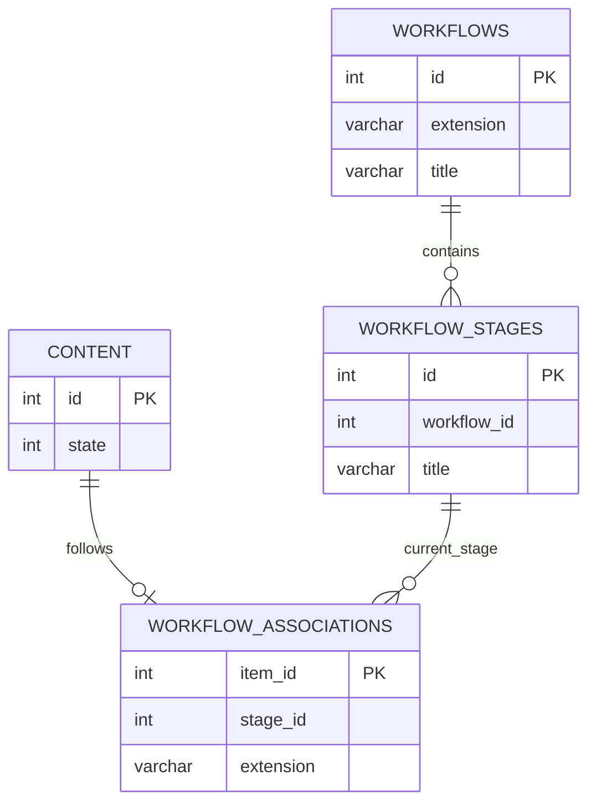
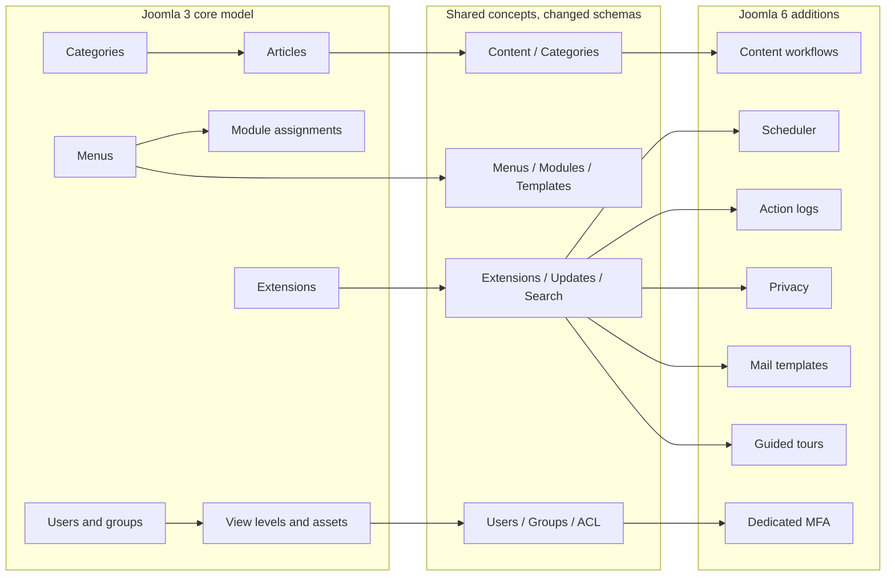

# Joomla 3 vs Joomla 6 Database Gap Analysis

A practical comparison of the Joomla 3 and Joomla 6 core database structures, focused on migration planning.

> **Baseline:** Joomla 3.10.x compared with Joomla 6.x.
>
> **Important:** This is a logical and migration-oriented comparison. The exact physical schema must still be verified against the SQL files of the exact installed versions and extensions.

## Table of Contents

- [1. Comparison Status](#1-comparison-status)
- [2. Executive Summary](#2-executive-summary)
- [3. Complete Comparison Matrix](#3-complete-comparison-matrix)
  - [3.1 Content, Tags, and Fields](#31-content-tags-and-fields)
  - [3.2 Workflow](#32-workflow)
  - [3.3 Menus, Modules, and Templates](#33-menus-modules-and-templates)
  - [3.4 Users and ACL](#34-users-and-acl)
  - [3.5 Extensions and Updates](#35-extensions-and-updates)
  - [3.6 Search, Language, and Supporting Components](#36-search-language-and-supporting-components)
  - [3.7 Scheduler, Logging, Privacy, Mail, and Guided Tours](#37-scheduler-logging-privacy-mail-and-guided-tours)
  - [3.8 Runtime and Generated Data](#38-runtime-and-generated-data)
- [4. Main ERD Gaps](#4-main-erd-gaps)
- [5. Tables That Are Similar but Still Require Transformation](#5-tables-that-are-similar-but-still-require-transformation)
- [6. Tables That Must Not Be Copied Directly](#6-tables-that-must-not-be-copied-directly)
- [7. Recommended Migration Decisions](#7-recommended-migration-decisions)
- [8. Validation Checklist](#8-validation-checklist)

## 1. Comparison Status

| Status | Meaning | Migration implication |
|---|---|---|
| **Same** | The table and its main responsibility exist in both versions | Data may be migratable, but columns and values must still be validated |
| **Changed** | The table exists in both versions, but its schema, references, or behavior changed | Transform data and remap IDs; do not use a blind copy |
| **New in Joomla 6** | Joomla 6 introduces a new core table or subsystem | Keep the Joomla 6 records or create valid target records |
| **Rebuild** | The table stores generated, installation-owned, runtime, or index data | Do not migrate rows; regenerate from Joomla 6 |
| **Conditional** | The table exists or is useful only when the related feature is used | Migrate only after confirming actual project usage |
| **Legacy / Review** | The Joomla 3 data model is no longer the preferred Joomla 6 model | Review retention requirements and use the Joomla 6 replacement |

## 2. Executive Summary

The Joomla 3 and Joomla 6 databases share the same core concepts for:

```text
Articles
Categories
Menus
Modules
Users
User groups
View levels
ACL assets
Extensions
Tags
Custom fields
Languages
Redirects
Smart Search
```

However, the following facts make a full database copy unsafe:

1. Joomla 6 adds content workflow tables.
2. Joomla 6 expands ACL assets for workflows, scheduler tasks, privacy, logs, and other components.
3. Extension IDs, asset IDs, menu IDs, module IDs, and template style IDs are installation-specific.
4. Joomla 6 adds scheduler, action log, privacy, mail template, MFA, and guided-tour subsystems.
5. Several system tables contain generated or version-owned data and must be rebuilt.
6. Matching table names do not guarantee matching columns, defaults, JSON structures, indexes, or business rules.

## 3. Complete Comparison Matrix

### 3.1 Content, Tags, and Fields

| Joomla 3 table | Joomla 6 table | Status | Main gap | Recommended action |
|---|---|---|---|---|
| `#__content` | `#__content` | **Changed** | Core article concept remains, but column definitions, defaults, state handling, JSON expectations, and workflow integration may differ | Transform records, map category/user/access/asset IDs, validate JSON, then create workflow associations |
| `#__categories` | `#__categories` | **Changed** | Same shared category model and nested-set tree; target component records, assets, defaults, and tree values may differ | Migrate parent-first and rebuild `lft`, `rgt`, `level`, and `path` |
| `#__content_frontpage` | `#__content_frontpage` | **Changed** | Same featured-content purpose, but supported scheduling columns and consistency rules may differ | Remap article IDs and validate featured state and ordering |
| `#__content_rating` | `#__content_rating` | **Conditional** | Same optional article-rating purpose | Migrate only when ratings must be retained; validate counts and privacy requirements |
| `#__tags` | `#__tags` | **Changed** | Same hierarchical tag concept; assets, access, language, and nested-set values require remapping | Migrate parent-first and rebuild the tag tree |
| `#__contentitem_tag_map` | `#__contentitem_tag_map` | **Changed** | Same polymorphic mapping concept; content IDs, tag IDs, type aliases, and content-type references may differ | Remap every referenced ID and validate `type_alias` |
| `#__fields_groups` | `#__fields_groups` | **Changed** | Same custom-field grouping concept; context, access, language, and parameters may differ | Recreate or transform groups before fields |
| `#__fields` | `#__fields` | **Changed** | Same field-definition concept; field plugins, contexts, parameters, categories, and defaults may differ | Confirm the Joomla 6 field plugin exists, then transform definitions |
| `#__fields_values` | `#__fields_values` | **Changed** | Same field-value mapping; both `field_id` and context-specific `item_id` may change | Remap field IDs and target item IDs |
| `#__fields_categories` | `#__fields_categories` | **Changed** | Same field-to-category restriction concept where used | Remap field and category IDs |
| `#__associations` | `#__associations` | **Changed** | Same multilingual association purpose; item IDs and contexts must match the Joomla 6 target | Rebuild association groups after all related items exist |
| `#__content_types` | `#__content_types` | **Rebuild** | Core content-type registry is installation- and extension-dependent | Keep Joomla 6 records; map by type alias instead of copying raw IDs |
| `#__ucm_base` | `#__ucm_base` or current Joomla 6 content integration | **Legacy / Review** | UCM implementation and usage differ across Joomla generations | Do not copy blindly; let Joomla 6 and installed extensions rebuild required records |
| `#__ucm_content` | `#__ucm_content` or current Joomla 6 content integration | **Legacy / Review** | Unified content records may be generated from target content and content types | Rebuild where supported; validate only if an extension depends on UCM data |
| `#__ucm_history` | `#__contenthistory` or current history storage | **Legacy / Review** | Content-history storage changed across Joomla generations | Migrate only when history retention is required and a verified mapping exists |
| `#__contact_details` | `#__contact_details` | **Changed** | Same contact component purpose; categories, users, fields, params, assets, and routing may differ | Migrate through a component-specific mapping |
| `#__newsfeeds` | `#__newsfeeds` | **Changed** | Same component purpose, but schema and extension behavior may differ | Migrate only when the component is enabled and required |
| `#__banners` | `#__banners` | **Changed** | Same banner purpose; supporting categories, clients, tracks, and parameters may differ | Use a component-specific migration and validate reporting data |
| `#__banner_clients` | `#__banner_clients` | **Changed** | Same client ownership concept | Remap client references before banners |
| `#__banner_tracks` | `#__banner_tracks` | **Conditional** | Historical tracking data may be large and not operationally required | Migrate only when reporting retention is required |

### 3.2 Workflow

| Joomla 3 table | Joomla 6 table | Status | Main gap | Recommended action |
|---|---|---|---|---|
| No core equivalent | `#__workflows` | **New in Joomla 6** | Defines content workflows by extension | Keep Joomla 6 defaults or create approved target workflows |
| No core equivalent | `#__workflow_stages` | **New in Joomla 6** | Defines stages inside a workflow | Map Joomla 3 publication states to valid target stages |
| No core equivalent | `#__workflow_transitions` | **New in Joomla 6** | Defines allowed state transitions and actions | Keep or configure Joomla 6 transitions; do not generate from Joomla 3 rows automatically |
| No core equivalent | `#__workflow_associations` | **New in Joomla 6** | Associates each content item with its current workflow stage | Create a valid association for every migrated article when workflow is active |

The most important new relationship is:



### 3.3 Menus, Modules, and Templates

| Joomla 3 table | Joomla 6 table | Status | Main gap | Recommended action |
|---|---|---|---|---|
| `#__menu_types` | `#__menu_types` | **Changed** | Same menu-container purpose; administrator menus and target defaults differ | Migrate approved frontend menu types only |
| `#__menu` | `#__menu` | **Changed** | Same menu and routing role; component IDs, internal links, parameters, template styles, trees, and administrator items differ | Import frontend items parent-first, map component IDs, rewrite links, and rebuild the menu tree |
| `#__modules` | `#__modules` | **Changed** | Same module-instance concept; module types, positions, parameters, administrator modules, and assets differ | Install compatible module code first; migrate approved frontend instances only |
| `#__modules_menu` | `#__modules_menu` | **Changed** | Same assignment table, but both module IDs and menu IDs may change | Remap both sides while preserving include/exclude/all-pages behavior |
| `#__template_styles` | `#__template_styles` | **Changed** | Same configured-style concept; Joomla 3 templates are normally incompatible with Joomla 6 | Install the target template and transform only approved compatible parameters |

Important stable relationships:

```text
#__menu_types.menutype → #__menu.menutype
#__extensions.extension_id → #__menu.component_id
#__modules.id → #__modules_menu.moduleid
#__menu.id → #__modules_menu.menuid
#__template_styles.id → #__menu.template_style_id
```

The relationship concepts are similar, but the IDs must not be assumed to match.

### 3.4 Users and ACL

| Joomla 3 table | Joomla 6 table | Status | Main gap | Recommended action |
|---|---|---|---|---|
| `#__users` | `#__users` | **Changed** | Same account purpose; authentication, reset, token, and MFA behavior changed | Migrate approved identity fields and password hashes only after compatibility testing |
| `#__usergroups` | `#__usergroups` | **Changed** | Same hierarchical group model; target core groups and tree values must remain valid | Map core groups by meaning, create custom groups parent-first, and rebuild the tree |
| `#__user_usergroup_map` | `#__user_usergroup_map` | **Changed** | Same many-to-many mapping; both IDs may change | Remap user and group IDs and remove duplicates |
| `#__viewlevels` | `#__viewlevels` | **Changed** | Same view-access purpose; `rules` contains target user-group IDs | Remap group IDs inside JSON rules |
| `#__assets` | `#__assets` | **Changed** | Same ACL tree, but Joomla 6 contains many additional component, workflow, task, and module assets | Keep Joomla 6 core assets and rebuild assets for migrated objects |
| `#__user_profiles` | `#__user_profiles` | **Conditional** | Same extensible profile storage; profile namespaces and plugins may differ | Migrate approved profile namespaces only |
| `#__user_notes` | `#__user_notes` | **Conditional** | Same administrator-note concept | Migrate only when business value and privacy rules require it |
| `#__user_keys` | `#__user_keys` | **Rebuild** | Authentication and remember-me keys are temporary and security-sensitive | Do not migrate |
| OTP-related columns in `#__users` | `#__user_mfa` and current MFA mechanisms | **New / Changed** | MFA storage moved to a dedicated modern subsystem | Require MFA re-enrollment; do not copy Joomla 3 OTP secrets blindly |
| `#__session` | `#__session` | **Rebuild** | Same runtime-session purpose but all source sessions are invalid on the target | Do not migrate; allow Joomla 6 to create sessions |

### 3.5 Extensions and Updates

| Joomla 3 table | Joomla 6 table | Status | Main gap | Recommended action |
|---|---|---|---|---|
| `#__extensions` | `#__extensions` | **Changed** | Same registry role; columns, protected/locked state, manifest data, IDs, plugins, modules, and core records differ | Install Joomla 6-compatible extensions and map by `type + element + folder + client_id` |
| `#__schemas` | `#__schemas` | **Rebuild** | Records must match the schema installed by Joomla 6 packages | Let installers and update SQL create records |
| `#__update_sites` | `#__update_sites` | **Rebuild** | Update URLs and target extension ownership may differ | Recreate during extension installation |
| `#__update_sites_extensions` | `#__update_sites_extensions` | **Rebuild** | Depends on new extension and update-site IDs | Recreate from Joomla 6 installation data |
| `#__updates` | `#__updates` | **Rebuild** | Generated update-discovery cache | Clear and rediscover in Joomla 6 |
| `#__postinstall_messages` | `#__postinstall_messages` | **Rebuild** | Version-specific post-installation instructions | Keep Joomla 6 records |

### 3.6 Search, Language, and Supporting Components

| Joomla 3 table | Joomla 6 table | Status | Main gap | Recommended action |
|---|---|---|---|---|
| `#__finder_links` | `#__finder_links` | **Rebuild** | Search index rows depend on target content, plugins, and tokenization | Do not migrate; rebuild Smart Search |
| `#__finder_terms` | `#__finder_terms` | **Rebuild** | Generated search terms | Re-index in Joomla 6 |
| `#__finder_taxonomy` | `#__finder_taxonomy` | **Rebuild** | Generated taxonomy tree | Re-index in Joomla 6 |
| `#__finder_tokens*` | `#__finder_tokens*` or current Finder storage | **Rebuild** | Generated temporary/index data and physical implementation may differ | Do not migrate |
| `#__finder_filters` | `#__finder_filters` | **Conditional** | Saved filters may have business value, but context and taxonomy IDs may change | Recreate or transform only required filters |
| `#__languages` | `#__languages` | **Changed** | Same content-language purpose; installed language packages and defaults must already exist | Install languages first, then transform content-language configuration |
| `#__associations` | `#__associations` | **Changed** | Same multilingual relationship concept; all associated item IDs change | Rebuild after target content and menus exist |
| `#__redirect_links` | `#__redirect_links` | **Changed** | Same redirect purpose, but URLs and target routing may change | Generate redirects from old-to-new URL comparison instead of copying blindly |
| `#__messages` | `#__messages` | **Conditional** | Same private administrator messaging purpose | Usually skip unless retention is explicitly required |
| `#__messages_cfg` | Current Joomla 6 message configuration | **Legacy / Review** | User messaging configuration may be stored or interpreted differently | Review exact target schema and migrate only required preferences |
| `#__core_log_searches` | No direct operational requirement | **Legacy / Review** | Historical search logging is not required for site operation | Archive if required; otherwise skip |
| `#__utf8_conversion` | No normal target migration requirement | **Legacy / Review** | Historical conversion support data | Do not migrate unless an exact target process requires it |

### 3.7 Scheduler, Logging, Privacy, Mail, and Guided Tours

| Joomla 3 table | Joomla 6 table | Status | Main gap | Recommended action |
|---|---|---|---|---|
| No core equivalent | `#__scheduler_tasks` | **New in Joomla 6** | Stores configured scheduled task instances | Keep Joomla 6 core tasks; recreate extension tasks through their installers |
| No core equivalent | `#__scheduler_log` | **New in Joomla 6** | Stores scheduler execution history | Start fresh; do not manufacture historical logs |
| No equivalent core subsystem | `#__action_logs` | **New in Joomla 6** | Stores user action audit records | Start fresh unless legal retention requires a controlled import |
| No equivalent core subsystem | `#__action_logs_extensions` | **New in Joomla 6** | Registers extensions that support action logging | Keep Joomla 6 records |
| No equivalent core subsystem | `#__action_log_config` | **New in Joomla 6** | Configures action-log behavior | Configure on Joomla 6 |
| No equivalent core subsystem | `#__privacy_requests` | **New in Joomla 6** | Tracks privacy export/removal requests | Keep target records; migrate historical requests only when legally required |
| No equivalent core subsystem | `#__privacy_consents` | **New in Joomla 6** | Stores consent records | Define a legal and business migration decision before importing |
| No core equivalent | `#__mail_templates` | **New in Joomla 6** | Stores configurable mail-template overrides | Keep defaults or create approved Joomla 6 templates |
| No core equivalent | `#__guidedtours` | **New in Joomla 6** | Defines administrator guided tours | Keep Joomla 6 and extension-provided records |
| No core equivalent | `#__guidedtour_steps` | **New in Joomla 6** | Stores ordered steps for guided tours | Keep Joomla 6 and extension-provided records |

### 3.8 Runtime and Generated Data

| Joomla 3 table or data | Joomla 6 equivalent | Status | Recommended action |
|---|---|---|---|
| `#__session` | `#__session` | **Rebuild** | Never migrate active sessions |
| Cache data | Joomla 6 cache storage | **Rebuild** | Clear and regenerate |
| Smart Search index | `#__finder_*` | **Rebuild** | Re-index after migration |
| Update discovery | `#__updates` | **Rebuild** | Rediscover from Joomla 6 |
| Scheduler execution log | `#__scheduler_log` | **New / Rebuild** | Start fresh |
| Action logs | `#__action_logs` | **New / Conditional** | Start fresh unless retention is required |
| Temporary authentication keys | `#__user_keys` and current token mechanisms | **Rebuild** | Never migrate |
| MFA secrets | `#__user_mfa` | **New / Security-sensitive** | Require re-enrollment |

## 4. Main ERD Gaps



The key structural gap is not that Joomla 6 replaces all Joomla 3 tables. Instead:

```text
Joomla 6 keeps many core entities
+ changes their schemas and installation-owned IDs
+ adds new subsystems and relationships
+ requires generated/system data to be rebuilt
```

## 5. Tables That Are Similar but Still Require Transformation

These tables exist in both versions and have similar responsibilities:

```text
#__content
#__categories
#__content_frontpage
#__tags
#__contentitem_tag_map
#__fields_groups
#__fields
#__fields_values
#__menu_types
#__menu
#__modules
#__modules_menu
#__template_styles
#__users
#__usergroups
#__user_usergroup_map
#__viewlevels
#__assets
#__extensions
#__languages
#__associations
#__redirect_links
```

They must still be transformed because one or more of these values can differ:

```text
Primary IDs
Parent IDs
Asset IDs
Extension IDs
Access-level IDs
User-group IDs inside JSON
Template style IDs
Menu links containing article/category IDs
JSON configuration structures
Default values and nullability
Nested-set boundaries
Workflow associations
Installed extension ownership
```

## 6. Tables That Must Not Be Copied Directly

| Table or group | Why direct copying is unsafe |
|---|---|
| `#__assets` | Joomla 6 has a different ACL tree and additional core assets |
| `#__extensions` | Registry IDs and installed extension records are target-specific |
| `#__schemas` | Must match the actual installed extension schema versions |
| `#__update_sites` | Update sources belong to target extensions |
| `#__update_sites_extensions` | Depends on target extension IDs |
| `#__updates` | Generated discovery data |
| `#__session` | Runtime and security-sensitive data |
| `#__user_keys` | Temporary authentication data |
| `#__user_mfa` | Security-sensitive target MFA data |
| `#__finder_*` | Generated search index |
| `#__scheduler_tasks` | Core and extension task instances are installer-owned |
| `#__scheduler_log` | Generated execution history |
| `#__action_logs*` | Generated target audit data |
| `#__privacy_*` | Requires legal and business review |
| `#__postinstall_messages` | Version-specific records |
| Joomla 3 administrator menu/module rows | Joomla 6 administrator UI structure is different |

## 7. Recommended Migration Decisions

| Entity group | Default decision | Reason |
|---|---|---|
| Articles and categories | **Transform and migrate** | Core business content |
| Tags and custom fields | **Transform and migrate when used** | Content relationships and metadata |
| Frontend menus | **Transform and migrate** | Required for routes and page context |
| Frontend modules | **Transform and migrate after code installation** | Instances depend on compatible module code and positions |
| Users | **Selective controlled migration** | Identity and security-sensitive data |
| User groups and view levels | **Map by meaning, not raw ID** | Target core IDs and JSON group references may differ |
| ACL assets | **Rebuild** | Target ACL tree is structurally different |
| Extensions | **Reinstall, then map** | Target installers own registry and schemas |
| Template styles | **Recreate/transform** | Joomla 3 templates are generally incompatible |
| Smart Search | **Rebuild** | Generated index data |
| Workflow | **Create target associations** | New Joomla 6 relationship |
| Scheduler, logging, guided tours | **Keep Joomla 6 defaults** | New target subsystems |
| Sessions, keys, MFA secrets | **Do not migrate** | Security risk |
| Custom and third-party tables | **Separate migration workstream** | Schema and business rules are extension-specific |

## 8. Validation Checklist

- [ ] Confirm the exact Joomla 3 and Joomla 6 versions.
- [ ] Export the actual table and column inventories from both databases.
- [ ] Classify every source table as core, third-party, custom, generated, temporary, or unknown.
- [ ] Compare physical column types, defaults, nullability, indexes, and collations.
- [ ] Install Joomla 6-compatible extensions before importing their data.
- [ ] Build mappings for users, groups, access levels, categories, articles, extensions, menus, modules, tags, fields, and template styles.
- [ ] Rebuild category, tag, menu, user-group, and asset trees.
- [ ] Rewrite IDs embedded in menu links and JSON configuration.
- [ ] Create valid Joomla 6 workflow associations.
- [ ] Rebuild Smart Search and runtime caches.
- [ ] Do not migrate sessions, authentication keys, or MFA secrets.
- [ ] Validate row counts, hashes, logical relationships, URLs, permissions, modules, languages, and rendered output.

## Related Documentation

- [Joomla 3 Database Overview](./joomla3/database-overview.md)
- [Joomla 3 Complete ERD](./joomla3/complete-erd.md)
- [Joomla 6 Database Overview](./joomla6/database-overview.md)
- [Joomla 6 Complete ERD](./joomla6/complete-erd.md)
- [Joomla 3 to Joomla 6 Database Migration Checklist](./joomla3-to-joomla6-database-migration-checklist.md)
