# Joomla 3 vs Joomla 6 ERD Gap Diagrams

> A visual migration specification for comparing Joomla 3.10.x and Joomla 6.x database structures.

This document complements the detailed [Joomla 3 vs Joomla 6 Database Gap Analysis](./joomla3-vs-joomla6-database-gap.md). It focuses on table-to-table mapping, relationship changes, new Joomla 6 dependencies, and the decisions required before writing migration SQL or PHP scripts.

> [!IMPORTANT]
> These diagrams describe logical relationships and common migration behavior. Always verify the exact physical schemas from both installed projects using `SHOW CREATE TABLE` or `information_schema`.

---

## Quick Summary

| Area | Joomla 3 → Joomla 6 result | Default decision |
|---|---|---|
| Content and categories | Same business concepts, changed references and workflow requirements | Transform and migrate |
| Tags and custom fields | Same relationship model, target IDs and contexts may differ | Remap and migrate when used |
| Menus and modules | Same core model, links, component IDs, positions, and styles differ | Rewrite, remap, and rebuild trees |
| Users and ACL | Same account/group model, expanded security and ACL assets | Selectively migrate; rebuild ACL |
| Extensions and updates | Same registry purpose, target installation owns IDs and schema records | Reinstall and map by identity |
| Workflow | No direct Joomla 3 equivalent | Create Joomla 6 workflow associations |
| Scheduler, privacy, logging, MFA, mail templates | New or substantially expanded in Joomla 6 | Keep target defaults or configure explicitly |
| Sessions, Finder, cache, update discovery | Runtime or generated data | Skip source rows and rebuild |

---

## Table of Contents

- [1. Diagram Legend](#1-diagram-legend)
- [2. Confidence Legend](#2-confidence-legend)
- [3. Table-to-Table Status Matrix](#3-table-to-table-status-matrix)
- [4. Whole-System Gap Overview](#4-whole-system-gap-overview)
- [5. Content and Category Gap](#5-content-and-category-gap)
- [6. Workflow Gap](#6-workflow-gap)
- [7. Tags and Custom Fields Gap](#7-tags-and-custom-fields-gap)
- [8. Menu, Module, and Template Gap](#8-menu-module-and-template-gap)
- [9. User and ACL Gap](#9-user-and-acl-gap)
- [10. Extension and System Gap](#10-extension-and-system-gap)
- [11. Search, Runtime, and Generated Data Gap](#11-search-runtime-and-generated-data-gap)
- [12. End-to-End Article Migration Example](#12-end-to-end-article-migration-example)
- [13. Migration Decision Flow](#13-migration-decision-flow)
- [14. Recommended Migration Dependency Order](#14-recommended-migration-dependency-order)
- [15. Validation Checklist](#15-validation-checklist)
- [16. Key Conclusions](#16-key-conclusions)

---

## 1. Diagram Legend

The statuses below are independent classifications. They are not sequential steps.

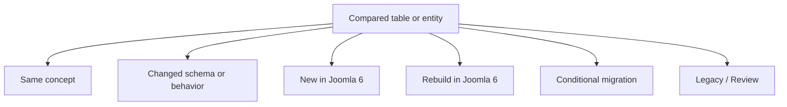

| Status | Meaning | Default handling |
|---|---|---|
| **Same concept** | The business purpose remains in Joomla 6 | Still verify physical columns and behavior |
| **Changed** | The table exists, but columns, IDs, defaults, JSON, indexes, or rules differ | Transform and remap |
| **New in Joomla 6** | Joomla 6 introduces a new table, relationship, or subsystem | Keep target defaults or create valid target records |
| **Rebuild** | Data is generated, runtime, security-sensitive, or installation-owned | Do not copy source rows |
| **Conditional** | Migration depends on project use, legal retention, or business value | Migrate only after approval |
| **Legacy / Review** | Joomla 3 storage is obsolete or no longer the preferred target model | Review replacement and retention strategy |

### Column-action labels

| Label | Meaning |
|---|---|
| **Keep** | Preserve the business value after schema validation |
| **Remap** | Replace a Joomla 3 ID with its Joomla 6 target ID |
| **Transform** | Convert a value, JSON structure, state, date, URL, path, or serialized format |
| **Verify** | Compare the exact source and target schemas before deciding |
| **Rebuild** | Generate the value or relationship in Joomla 6 |
| **Reset** | Keep the record but clear temporary values |
| **Skip** | Do not migrate the value or record |
| **Target-owned** | Preserve the Joomla 6 installer-created value |
| **Add relationship** | Create a relationship that did not exist in Joomla 3 |

---

## 2. Confidence Legend

| Confidence | Meaning |
|---|---|
| **Verified principle** | Stable Joomla migration rule, such as not migrating sessions or update cache |
| **Expected schema gap** | Common Joomla 3-to-6 behavior that still requires physical-schema verification |
| **Project-dependent** | Depends on the exact Joomla patch version, extension version, custom code, or business rule |

> [!NOTE]
> A table may be **Same concept** and **Changed schema** at the same time. In this document, `Same concept` never means safe for blind `INSERT ... SELECT` copying.

---

## 3. Table-to-Table Status Matrix

This matrix provides the fastest view of which Joomla 3 tables remain, change, or require rebuilding.

| Joomla 3 | Joomla 6 | Status | Main migration action | Confidence |
|---|---|---|---|---|
| `#__content` | `#__content` | **Changed** | Transform rows, remap references, add workflow association | Expected schema gap |
| `#__categories` | `#__categories` | **Changed** | Remap parents/assets/access and rebuild nested set | Expected schema gap |
| `#__content_frontpage` | `#__content_frontpage` | **Changed** | Remap article IDs and verify featured scheduling | Project-dependent |
| `#__tags` | `#__tags` | **Changed** | Remap IDs and rebuild tree | Expected schema gap |
| `#__contentitem_tag_map` | `#__contentitem_tag_map` | **Changed** | Remap content, tag, and type references | Expected schema gap |
| `#__fields*` | `#__fields*` | **Changed** | Validate field plugins and remap field/item/category IDs | Project-dependent |
| `#__menu_types` | `#__menu_types` | **Changed** | Migrate frontend menu types only | Expected schema gap |
| `#__menu` | `#__menu` | **Changed** | Rewrite links, map components/styles/access, rebuild tree | Expected schema gap |
| `#__modules` | `#__modules` | **Changed** | Install compatible code, map positions, transform params | Project-dependent |
| `#__modules_menu` | `#__modules_menu` | **Changed** | Remap module and menu IDs | Verified principle |
| `#__template_styles` | `#__template_styles` | **Changed** | Recreate styles on a Joomla 6-compatible template | Project-dependent |
| `#__users` | `#__users` | **Changed** | Selectively migrate identity and supported password hashes | Project-dependent |
| `#__usergroups` | `#__usergroups` | **Changed** | Map by meaning and rebuild hierarchy | Expected schema gap |
| `#__user_usergroup_map` | `#__user_usergroup_map` | **Changed** | Remap user and group IDs | Verified principle |
| `#__viewlevels` | `#__viewlevels` | **Changed** | Rewrite group IDs inside JSON rules | Verified principle |
| `#__assets` | `#__assets` | **Rebuild** | Keep Joomla 6 core tree and recreate migrated-object assets | Verified principle |
| `#__extensions` | `#__extensions` | **Rebuild** | Reinstall extensions; map by type, element, folder, client | Verified principle |
| `#__schemas` | `#__schemas` | **Rebuild** | Let installers create schema versions | Verified principle |
| `#__updates` | `#__updates` | **Rebuild** | Rediscover updates in Joomla 6 | Verified principle |
| `#__finder_*` | `#__finder_*` | **Rebuild** | Re-index Smart Search | Verified principle |
| `#__session` | `#__session` | **Rebuild** | Start empty | Verified principle |
| No direct equivalent | `#__workflows*` | **New in Joomla 6** | Keep/configure workflows and add associations | Verified principle |
| No direct equivalent | `#__scheduler_*` | **New in Joomla 6** | Keep installer-created tasks; start logs fresh | Verified principle |
| No direct equivalent | `#__action_logs*` | **New in Joomla 6** | Start fresh unless retention is required | Project-dependent |
| No direct equivalent | `#__privacy_*` | **New / Conditional** | Apply legal-retention decision | Project-dependent |
| Joomla 3 OTP fields | `#__user_mfa` | **New / Changed** | Require MFA re-enrollment | Verified principle |

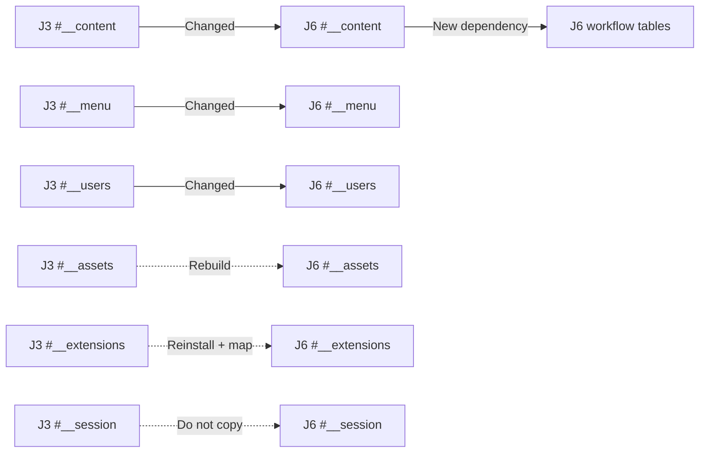

---

## 4. Whole-System Gap Overview

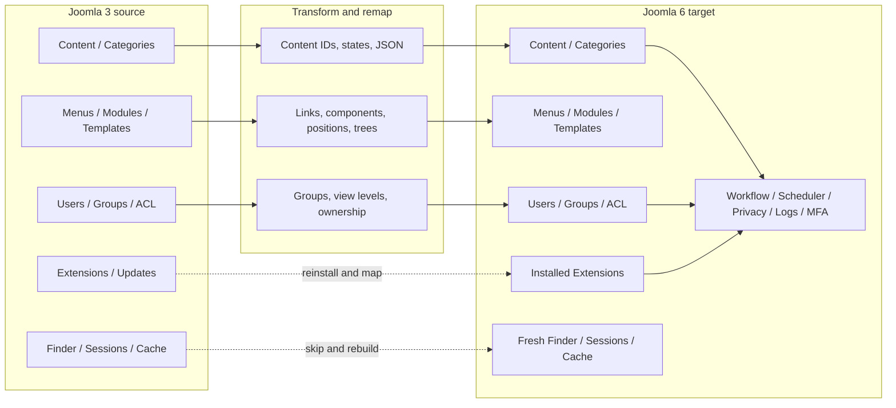

### Main message

```text
Joomla 6 keeps many Joomla 3 business entities,
but changes their physical schema, installation-owned IDs, and dependencies.
The migration must transform business data and rebuild target-owned structures.
```

---

## 5. Content and Category Gap

### 5.1 Logical relationship comparison

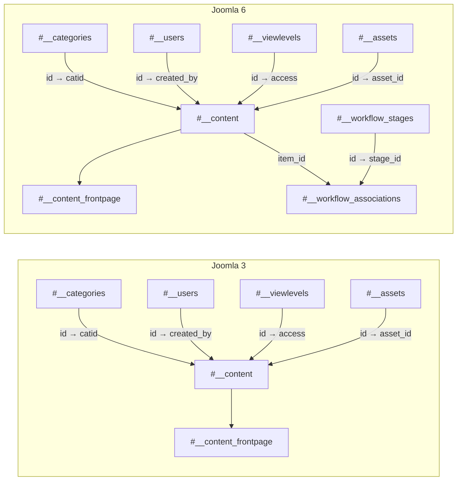

### 5.2 Article transformation flow

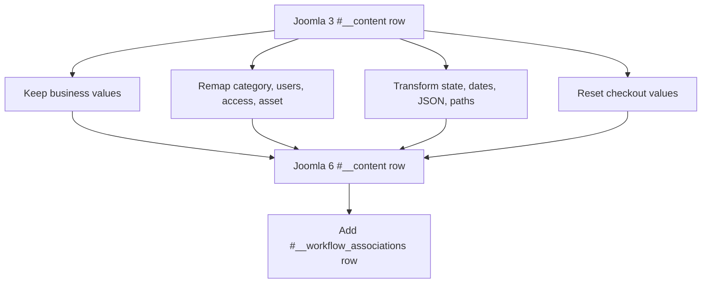

### 5.3 Article column mapping

| Joomla 3 column | Joomla 6 column/relation | Action | Notes |
|---|---|---|---|
| `id` | `id` | Keep or map | Preserve only when collision-free |
| `catid` | `catid` | Remap | Use category mapping table |
| `created_by`, `modified_by` | Same columns | Remap | Use user mapping table |
| `access` | `access` | Remap | Map view level by meaning/rules |
| `asset_id` | `asset_id` | Rebuild/remap | Assign the target-created asset ID |
| `state` | `state` | Transform/Verify | Confirm Joomla 6 state behavior |
| `state` | workflow stage association | Add relationship | Map source state to target stage |
| `featured` | `featured` and frontpage row | Transform/Verify | Keep both structures consistent |
| `images`, `urls`, `attribs`, `metadata` | Same logical fields | Transform/Verify | Validate JSON and embedded paths/IDs |
| `publish_up`, `publish_down` | Same logical fields | Transform | Normalize zero dates and nullability |
| `checked_out`, `checked_out_time` | Same logical fields | Reset | Do not retain stale edit locks |

### 5.4 Category tree gap

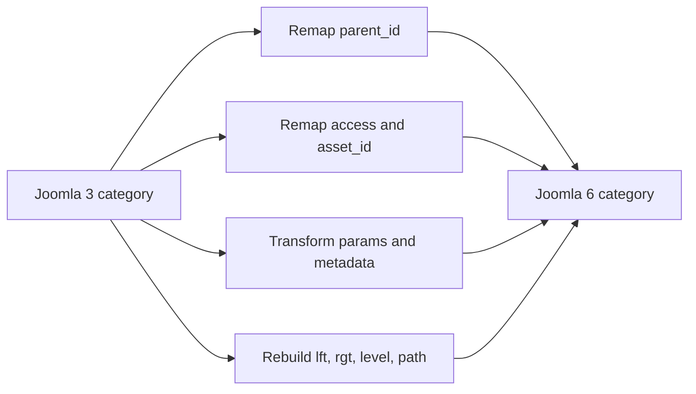

| Joomla 3 column | Joomla 6 handling |
|---|---|
| `parent_id` | Remap parent-first |
| `lft`, `rgt`, `level`, `path` | Rebuild or validate after insertion |
| `asset_id` | Assign recreated target asset |
| `access` | Remap target view level |
| `extension` | Verify owning component is installed |
| `params`, `metadata` | Transform and validate JSON |

---

## 6. Workflow Gap

Joomla 3 mainly stores article publication state in `#__content.state`. Joomla 6 can additionally require formal workflow records and an association between each article and its current stage.

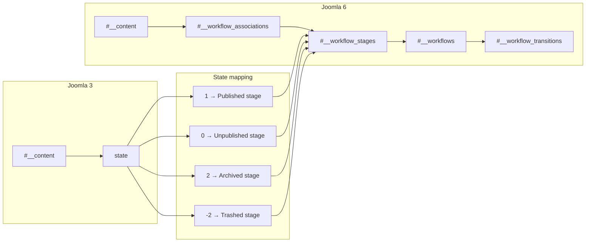

### Workflow mapping requirements

| Source value | Target value/relation | Action |
|---|---|---|
| `#__content.state` | `#__content.state` | Transform/Verify |
| `#__content.state` | `#__workflow_stages.id` | Map |
| Source article ID | `#__workflow_associations.item_id` | Use target article ID |
| No source equivalent | `#__workflow_associations.extension` | Create expected Joomla 6 context |
| No source equivalent | Workflow and transition IDs | Preserve target-owned records |

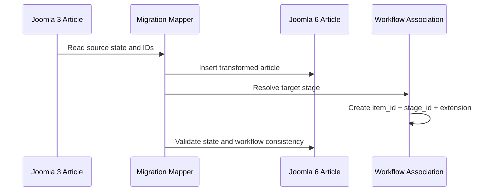

---

## 7. Tags and Custom Fields Gap

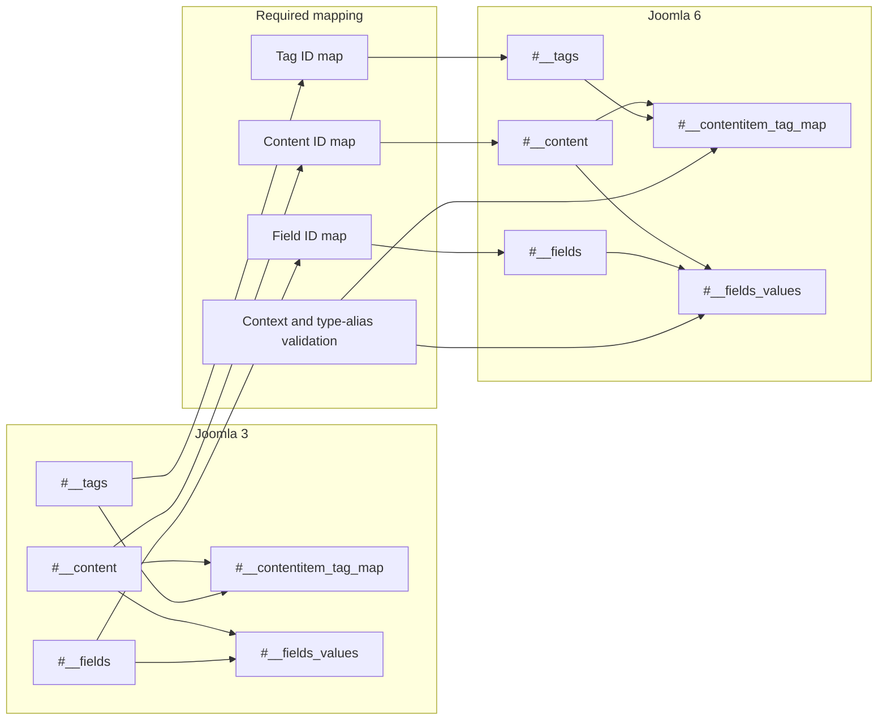

### Column and relationship mapping

| Source | Target | Action |
|---|---|---|
| Tag `parent_id` | Target tag parent | Remap parent-first |
| Tag `lft`, `rgt`, `level`, `path` | Target tree values | Rebuild |
| Tag map `content_item_id` | Target content ID | Remap |
| Tag map `tag_id` | Target tag ID | Remap |
| Tag map `type_alias` | Joomla 6 content context | Verify/Transform |
| Field `group_id` | Target group ID | Remap |
| Field `type` | Installed Joomla 6 field plugin | Verify dependency |
| Field value `field_id` | Target field ID | Remap |
| Field value `item_id` | Target context-specific item ID | Remap |
| Field value `value` | Target value | Keep/Transform |

> [!WARNING]
> `#__fields_values.item_id` is not self-describing. Its meaning depends on the field context, so a valid field mapping alone is not enough.

---

## 8. Menu, Module, and Template Gap

### 8.1 Stable logical relationships

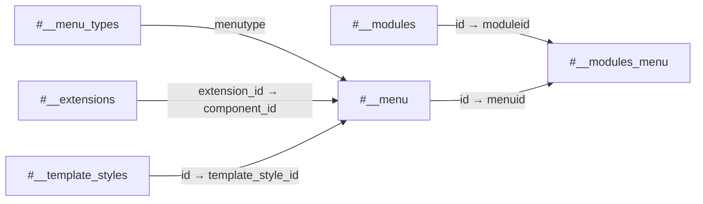

The relationship concepts remain, but the referenced IDs are installation-specific.

### 8.2 Menu transformation

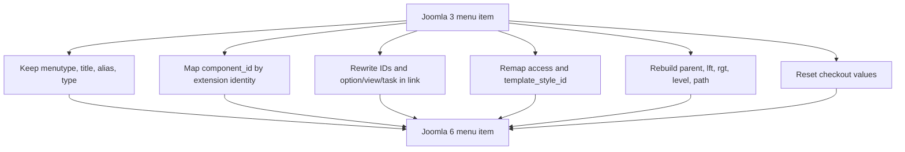

| Source column | Target handling |
|---|---|
| `component_id` | Map using `type + element + folder + client_id` identity |
| `link` | Rewrite article/category/custom IDs and renamed component values |
| `parent_id` | Remap parent-first |
| `lft`, `rgt`, `level`, `path` | Rebuild |
| `access` | Remap view level |
| `template_style_id` | Map to target style |
| `home` | Validate one default menu per required language |
| `client_id` | Migrate frontend records only unless explicitly required |

### 8.3 Module transformation

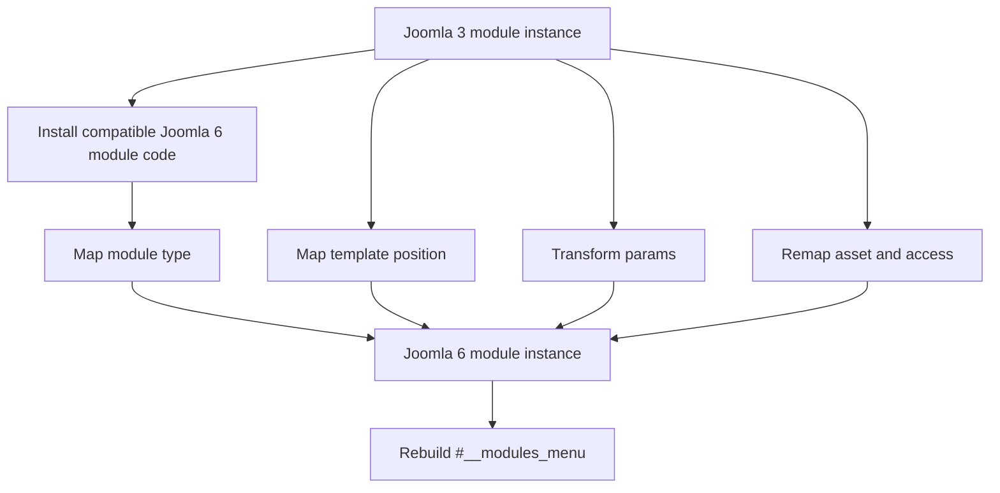

| Source | Target | Action |
|---|---|---|
| `module` | Installed Joomla 6 module element | Verify/Map |
| `position` | Joomla 6 template position | Map |
| `params` | Target module options | Transform |
| `asset_id`, `access` | Target ACL/view level | Rebuild/Remap |
| `moduleid` in bridge | Target module ID | Remap |
| Positive/negative `menuid` | Target menu ID while preserving sign | Remap |
| Administrator modules | Joomla 6 administrator modules | Skip by default |

---

## 9. User and ACL Gap

### 9.1 Shared relationship model

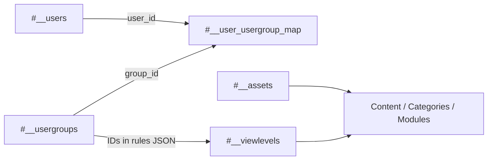

### 9.2 ACL migration handling

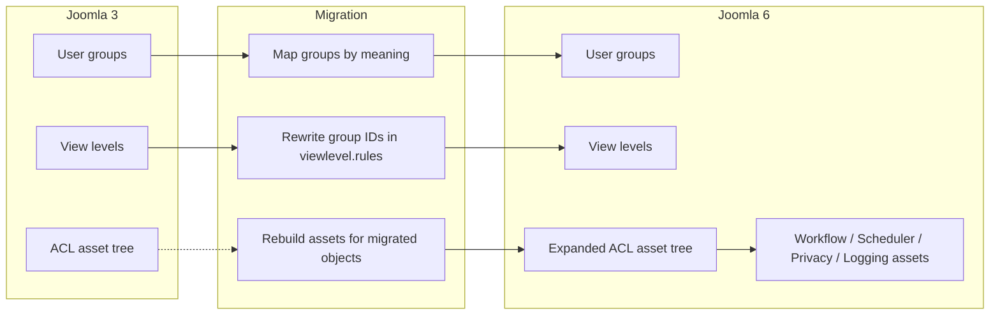

### 9.3 User and security mapping

| Source | Target | Action |
|---|---|---|
| `name`, `username`, `email` | Same logical fields | Keep/Verify uniqueness |
| `password` | Joomla 6 password field | Keep only after compatibility testing |
| `block`, registration/visit dates | Same logical fields | Keep/Transform |
| Reset/activation fields | Target security fields | Transform/Reset |
| `#__user_usergroup_map` IDs | Target user/group IDs | Remap |
| `#__viewlevels.rules` | Target group IDs in JSON | Transform |
| `#__assets` IDs/tree | Joomla 6 target asset tree | Rebuild |
| `#__user_keys` | Target authentication keys | Skip |
| Joomla 3 OTP data | `#__user_mfa` | Skip direct migration; re-enroll |
| `#__session` | Target session table | Skip all rows |

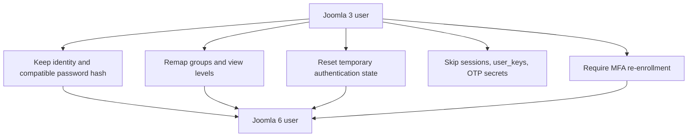

---

## 10. Extension and System Gap

### 10.1 Target ownership model

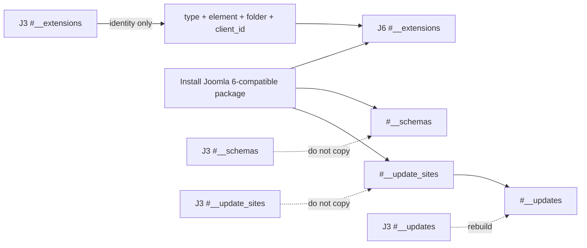

### 10.2 Extension mapping rules

| Joomla 3 value | Joomla 6 handling |
|---|---|
| `extension_id` | Do not preserve as identity |
| `type`, `element`, `folder`, `client_id` | Use as logical extension identity |
| `manifest_cache`, `params` | Preserve target installer values or selectively transform |
| `schema_version`/schema rows | Let installer/update SQL create them |
| Update-site IDs and links | Preserve target-created records |
| Plugin ordering/enabled/access | Verify and configure on target |

### 10.3 New Joomla 6 subsystem ownership

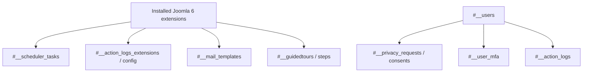

| Subsystem | Default decision |
|---|---|
| Scheduler tasks | Keep core tasks; recreate extension tasks through installers/configuration |
| Scheduler logs | Start empty |
| Action logs | Start fresh unless retention is required |
| Privacy records | Migrate only under approved legal rules |
| Mail templates | Keep defaults or recreate approved overrides |
| Guided tours | Keep installer-created records |
| MFA | Require re-enrollment |

---

## 11. Search, Runtime, and Generated Data Gap

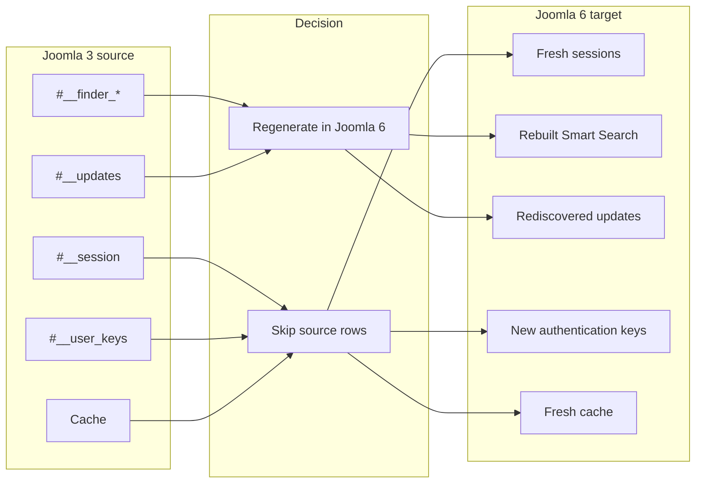

| Source data | Reason not to copy | Target action |
|---|---|---|
| Sessions | Runtime and security-sensitive | Start empty |
| Smart Search indexes | Generated from target content and plugins | Re-index |
| Updates | Generated discovery state | Rediscover |
| Authentication keys | Invalid and security-sensitive | Recreate through normal login flows |
| Cache | Temporary | Clear and regenerate |
| Scheduler/action logs | Target-generated history | Start fresh by default |

---

## 12. End-to-End Article Migration Example

### 12.1 Example source record

```text
Joomla 3 article ID:     25
Category ID:              8
Created-by user ID:      42
Access level ID:          1
Asset ID:               300
State:                    1
Featured:                 1
```

### 12.2 Example target mappings

```text
Article ID:      25 → 125
Category ID:      8 → 108
User ID:         42 → 242
Access ID:        1 → 1
Asset ID:       300 → 900
State:            1 → Published
Workflow stage:        → 1
```

### 12.3 Migration flow

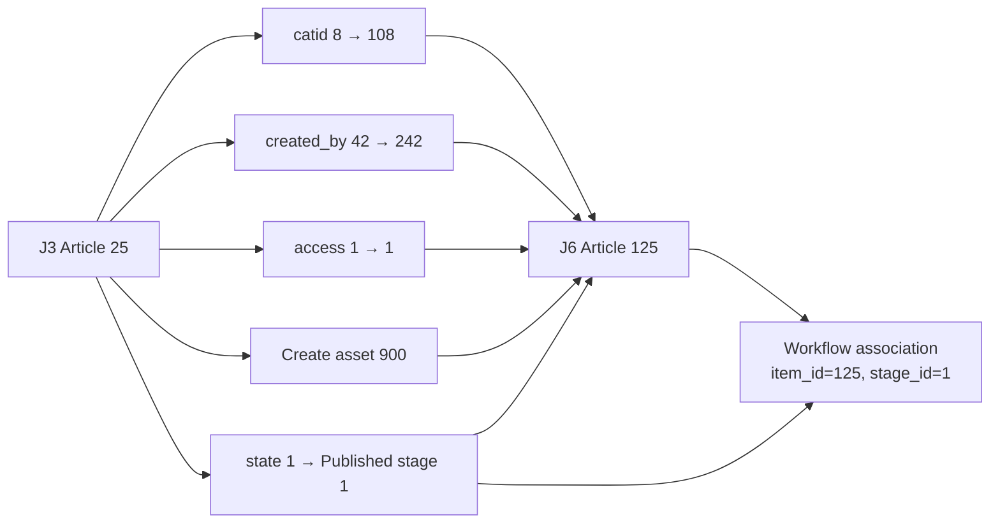

### 12.4 Expected records

| Target table | Example result |
|---|---|
| `#__content` | Article `125`, `catid=108`, `created_by=242`, `asset_id=900` |
| `#__assets` | New article asset with a valid parent and rules |
| `#__content_frontpage` | Target article `125` if featured |
| `#__workflow_associations` | `item_id=125`, mapped `stage_id=1`, valid extension context |
| Mapping table | Source `25` → target `125` |

> [!NOTE]
> The IDs above are illustrative. A production script must resolve every mapping from actual target records rather than hard-coding values.

---

## 13. Migration Decision Flow

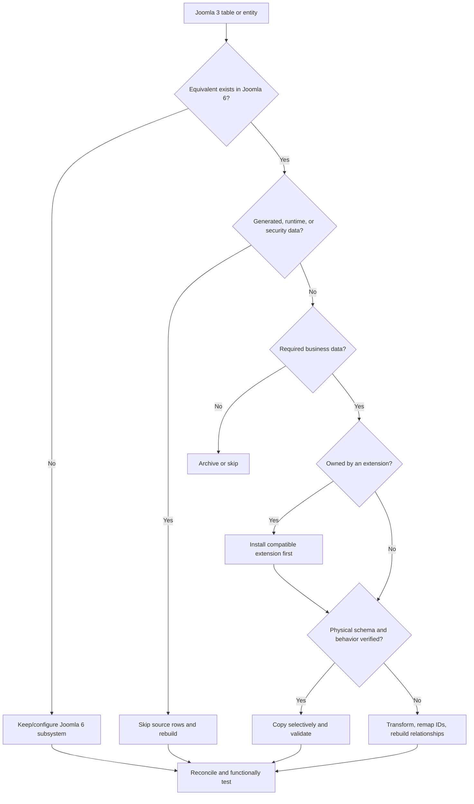

---

## 14. Recommended Migration Dependency Order

```mermaid
flowchart TD
    INSTALL["1. Install Joomla 6 and compatible extensions"]
    AUDIT["2. Audit source schema and business scope"]
    MAPS["3. Create source-to-target mapping tables"]
    USERS["4. Users, custom groups, view levels"]
    CATEGORIES["5. Categories and required component roots"]
    CONTENT["6. Articles and content assets"]
    WORKFLOW["7. Workflow associations"]
    TAGS["8. Tags and custom fields"]
    MENUS["9. Frontend menus and rewritten links"]
    STYLES["10. Template styles and position mapping"]
    MODULES["11. Frontend modules and assignments"]
    CUSTOM["12. Custom and third-party business data"]
    REBUILD["13. Rebuild trees, ACL, Finder, cache"]
    VALIDATE["14. Validate counts, hashes, URLs, permissions, rendering"]

    INSTALL --> AUDIT --> MAPS --> USERS --> CATEGORIES --> CONTENT --> WORKFLOW
    WORKFLOW --> TAGS --> MENUS --> STYLES --> MODULES --> CUSTOM --> REBUILD --> VALIDATE
```

> [!NOTE]
> The exact order is project-dependent. For example, categories may need users first for creator references, and custom components may require their Joomla 6 schema before any core menu items can point to them.

---

## 15. Validation Checklist

### Schema validation

- [ ] Export `SHOW CREATE TABLE` for every table included in the migration.
- [ ] Compare column names, types, unsigned flags, nullability, defaults, indexes, charset, and collation.
- [ ] Mark every source column as Keep, Remap, Transform, Verify, Rebuild, Reset, Skip, Target-owned, or Add relationship.

### Relationship validation

- [ ] Every migrated article references an existing target category, user, access level, and asset.
- [ ] Every migrated menu item references an installed component and valid target IDs.
- [ ] Every module assignment references valid target module and menu IDs.
- [ ] Every tag and custom-field mapping references valid target entities.
- [ ] Every required article has a valid Joomla 6 workflow association.

### Tree and ACL validation

- [ ] Category, menu, tag, user-group, and asset trees have valid parents and nested-set values.
- [ ] View-level JSON contains target user-group IDs.
- [ ] Joomla 6 core assets were not overwritten.
- [ ] Custom component and migrated-object assets inherit from correct parents.

### Generated-data validation

- [ ] Sessions, authentication keys, and MFA secrets were not imported.
- [ ] Finder indexes and update discovery were regenerated.
- [ ] Cache and temporary data were cleared.
- [ ] Scheduler and action logs started fresh unless an exception was approved.

### Functional validation

- [ ] Backend list, create, edit, publish, archive, trash, and delete actions work.
- [ ] Frontend routes and legacy redirects work.
- [ ] Modules appear on expected pages and template positions.
- [ ] User roles and access levels behave correctly.
- [ ] Multilingual associations, tags, fields, search, media, header, and footer render correctly.

---

## 16. Key Conclusions

1. **Most Joomla 3 business entities still exist in Joomla 6**, but the physical schemas and installation-owned IDs must be validated.
2. **A matching table name is not proof of direct-copy compatibility.**
3. **Nested-set structures require rebuild or strict validation** for categories, menus, tags, user groups, and assets.
4. **Joomla 6 workflow is a new relationship layer** that may require one association per migrated article.
5. **Extension registry, schema, update-site, and system records are target-owned.** Install extensions instead of copying registry rows.
6. **Sessions, cache, Finder indexes, update discovery, authentication keys, MFA secrets, and generated logs should normally start fresh.**
7. **Implementation requires both table-level and column-level mappings**, plus reconciliation and functional tests.

## Related Documentation

- [Joomla 3 vs Joomla 6 Database Gap Analysis](./joomla3-vs-joomla6-database-gap.md)
- [Joomla 3 Database Overview](./joomla3/database-overview.md)
- [Joomla 3 Complete ERD](./joomla3/complete-erd.md)
- [Joomla 6 Database Overview](./joomla6/database-overview.md)
- [Joomla 6 Complete ERD](./joomla6/complete-erd.md)
- [Joomla 3 to Joomla 6 Database Migration Checklist](./joomla3-to-joomla6-database-migration-checklist.md)
