# Joomla 3 vs Joomla 6 ERD Gap Diagrams

> A visual companion to the [Joomla 3 vs Joomla 6 Database Gap Analysis](./joomla3-vs-joomla6-database-gap.md).

This document uses Mermaid diagrams to show how Joomla 3 database entities map to Joomla 6, where relationships remain similar, where IDs must be remapped, and where Joomla 6 introduces new subsystems.

> [!IMPORTANT]
> These diagrams describe logical relationships used by Joomla application code. They are not a replacement for comparing the exact physical schemas with `SHOW CREATE TABLE` or `information_schema`.

---

## Table of Contents

- [1. Diagram Legend](#1-diagram-legend)
- [2. Whole-System Gap Overview](#2-whole-system-gap-overview)
- [3. Content and Category Gap](#3-content-and-category-gap)
- [4. Workflow Gap](#4-workflow-gap)
- [5. Tags and Custom Fields Gap](#5-tags-and-custom-fields-gap)
- [6. Menu, Module, and Template Gap](#6-menu-module-and-template-gap)
- [7. User and ACL Gap](#7-user-and-acl-gap)
- [8. Extension and System Gap](#8-extension-and-system-gap)
- [9. Search, Runtime, and Generated Data Gap](#9-search-runtime-and-generated-data-gap)
- [10. Migration Decision Flow](#10-migration-decision-flow)
- [11. Recommended Migration Dependency Order](#11-recommended-migration-dependency-order)
- [12. Key Conclusions](#12-key-conclusions)

---

## 1. Diagram Legend

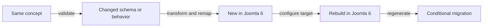

| Visual label | Meaning |
|---|---|
| **Same concept** | The business purpose still exists in Joomla 6 |
| **Changed schema or behavior** | The table exists, but IDs, columns, defaults, JSON, or rules differ |
| **New in Joomla 6** | Joomla 6 introduces a new table or relationship |
| **Rebuild** | The target should generate the data instead of importing source rows |
| **Conditional** | Migrate only when project usage or retention requirements justify it |

---

## 2. Whole-System Gap Overview

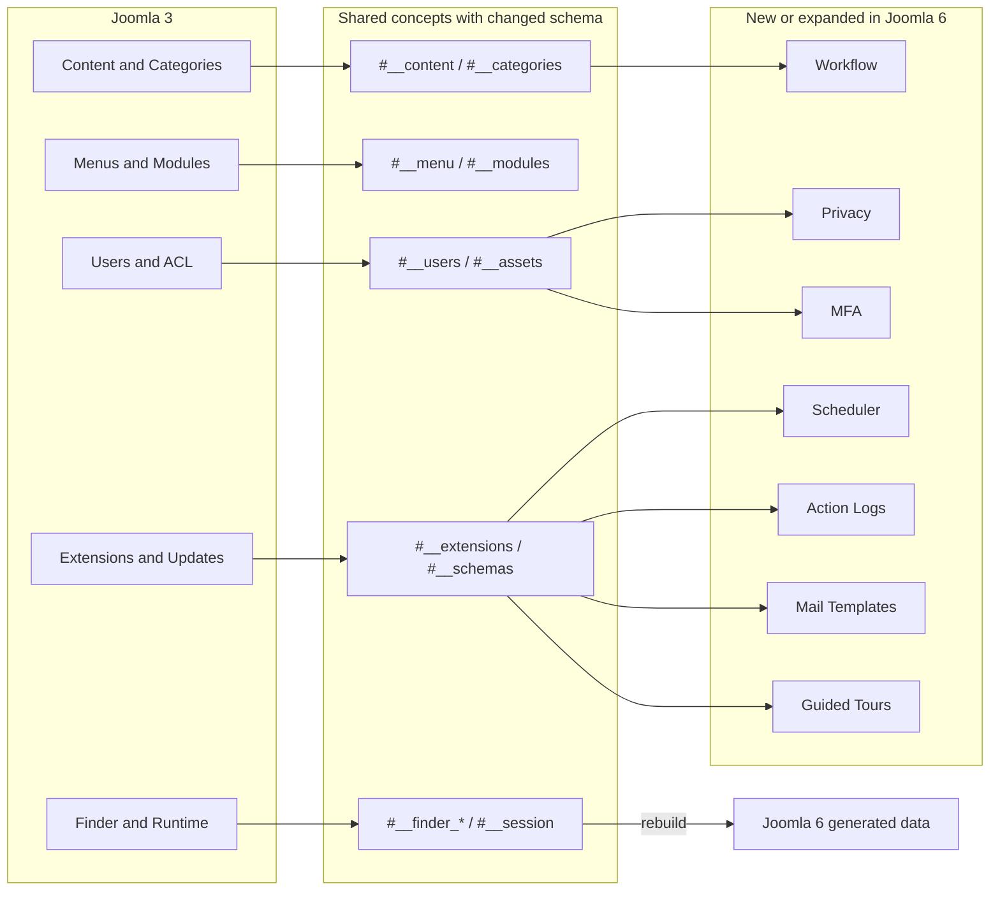

### Main message

```text
Joomla 6 does not replace every Joomla 3 table.
It keeps many core entities, changes their schemas and references,
and adds new subsystems that must be created in the target database.
```

---

## 3. Content and Category Gap

### 3.1 Joomla 3 logical model

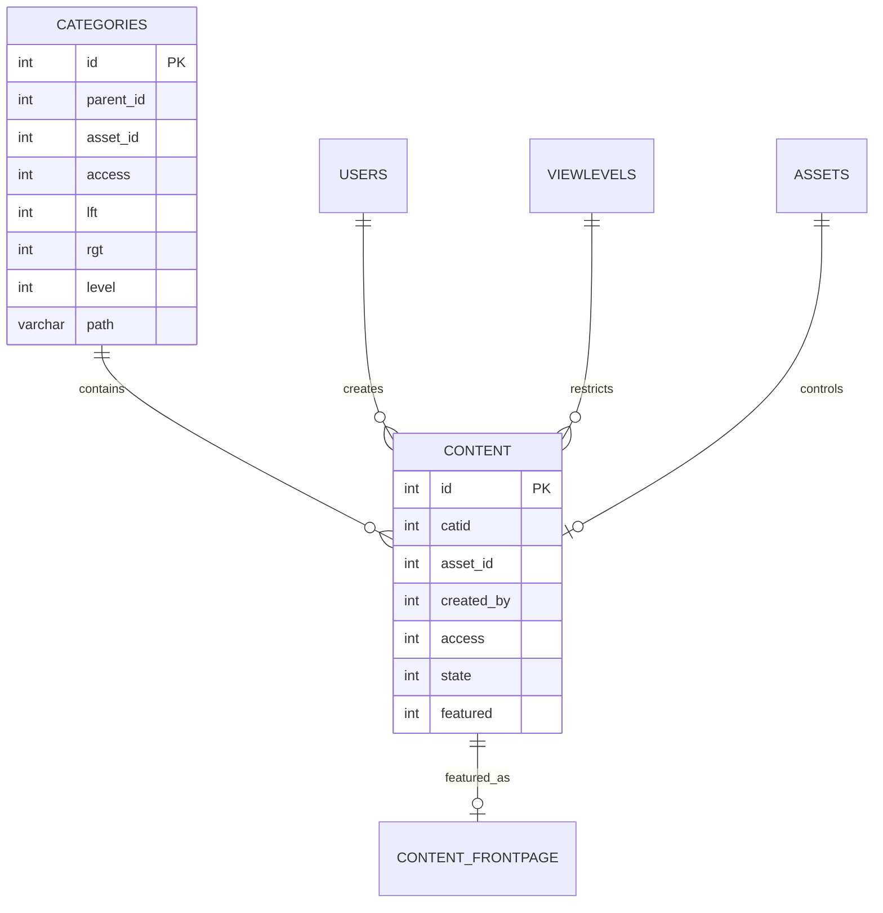

### 3.2 Joomla 6 target model

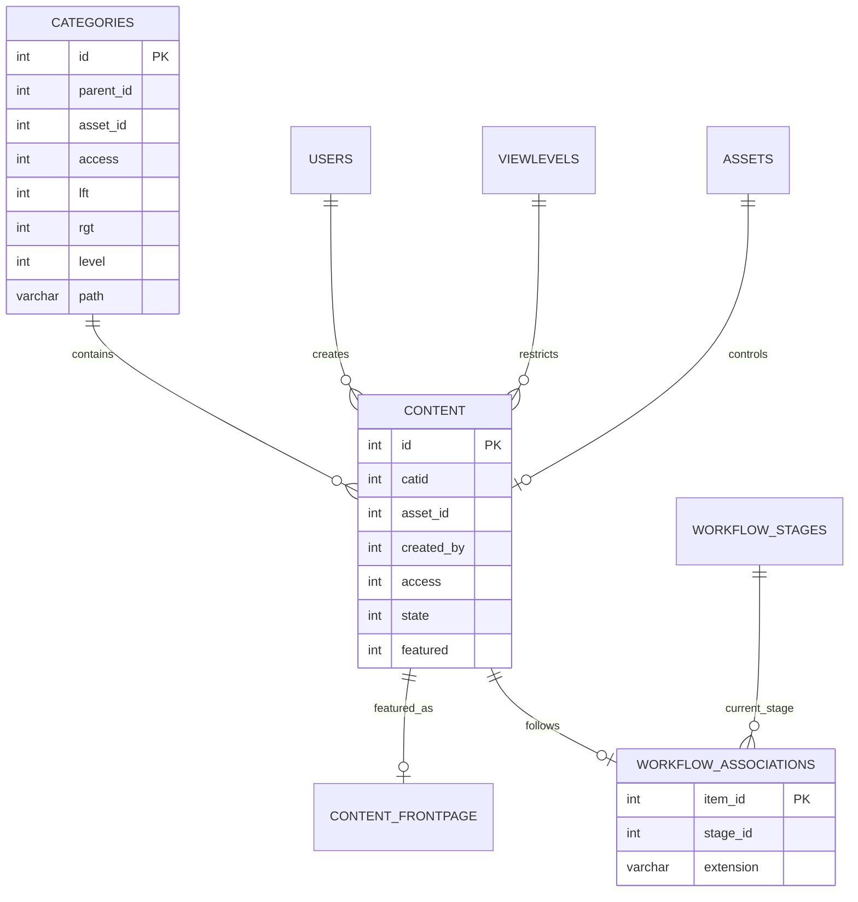

### 3.3 Column-level gap

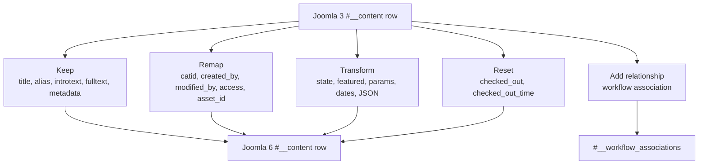

### Category tree gap

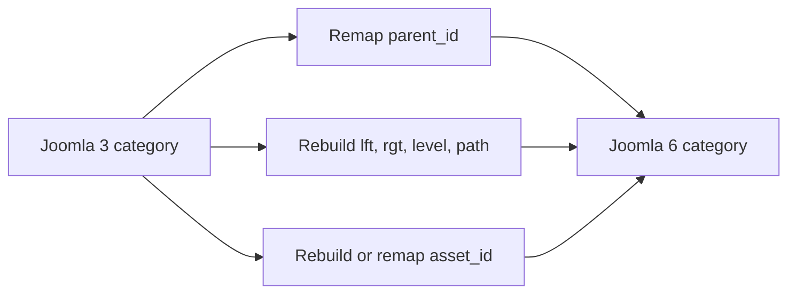

---

## 4. Workflow Gap

Joomla 3 article publication state is mainly represented by `#__content.state`. Joomla 6 keeps the state column but can additionally require a formal workflow association.

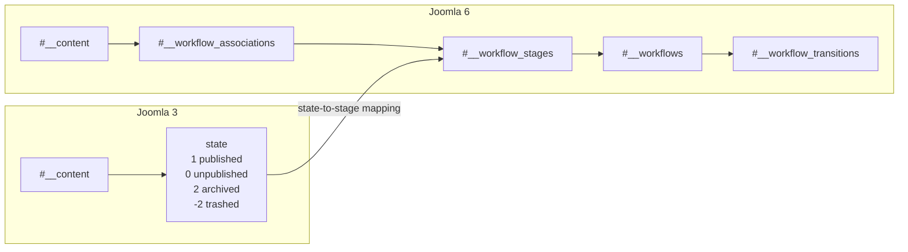

### Migration requirement

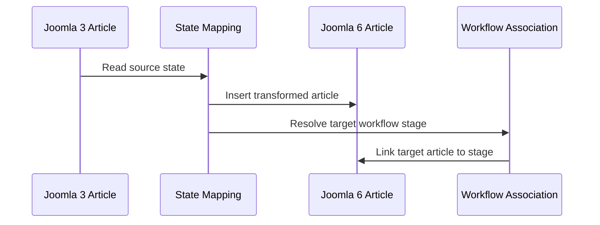

---

## 5. Tags and Custom Fields Gap

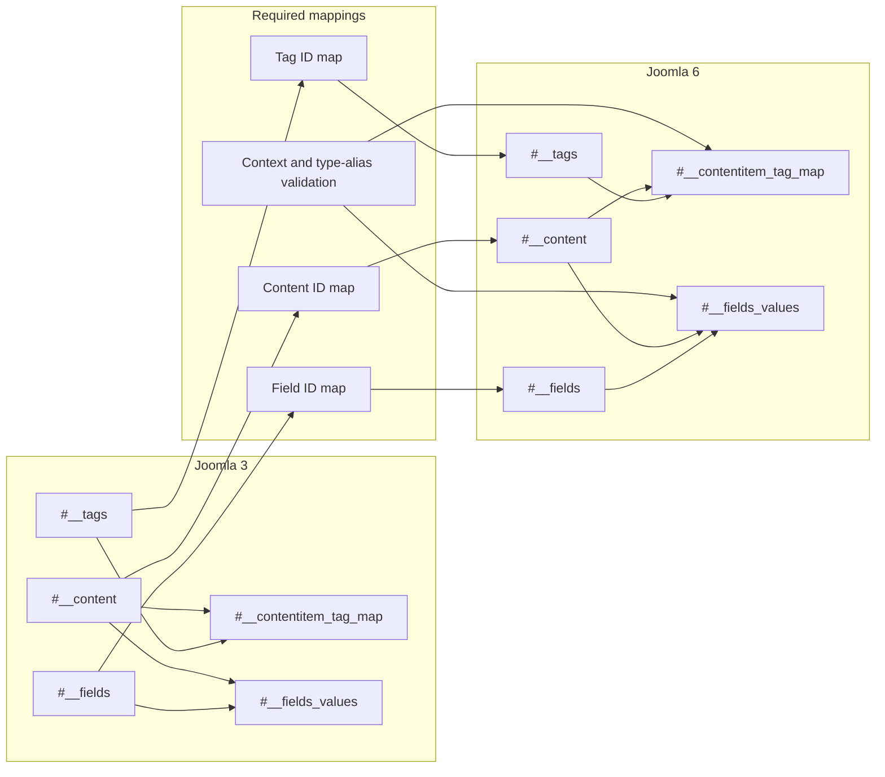

### Critical gap

```text
#__fields_values.item_id is not self-describing.
Its meaning depends on the field context, so both field IDs and item IDs must be remapped.
```

---

## 6. Menu, Module, and Template Gap

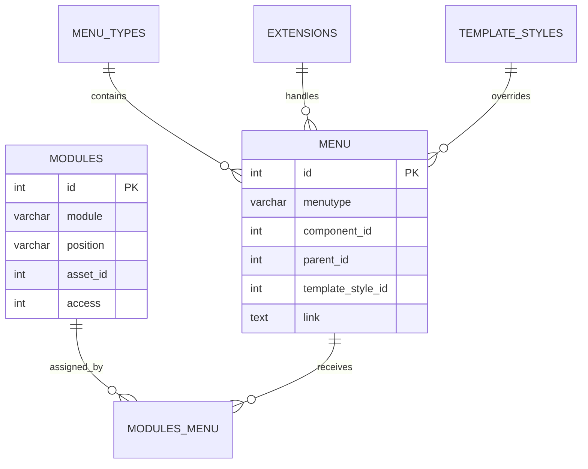

### Migration gaps

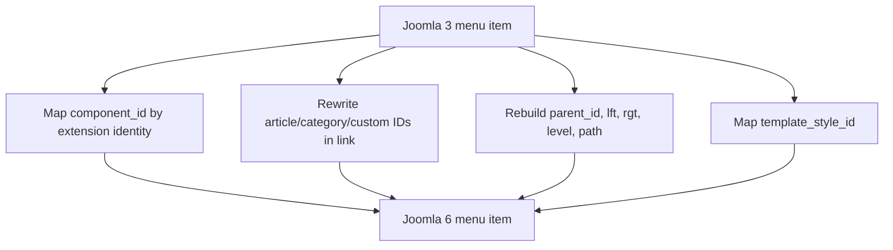

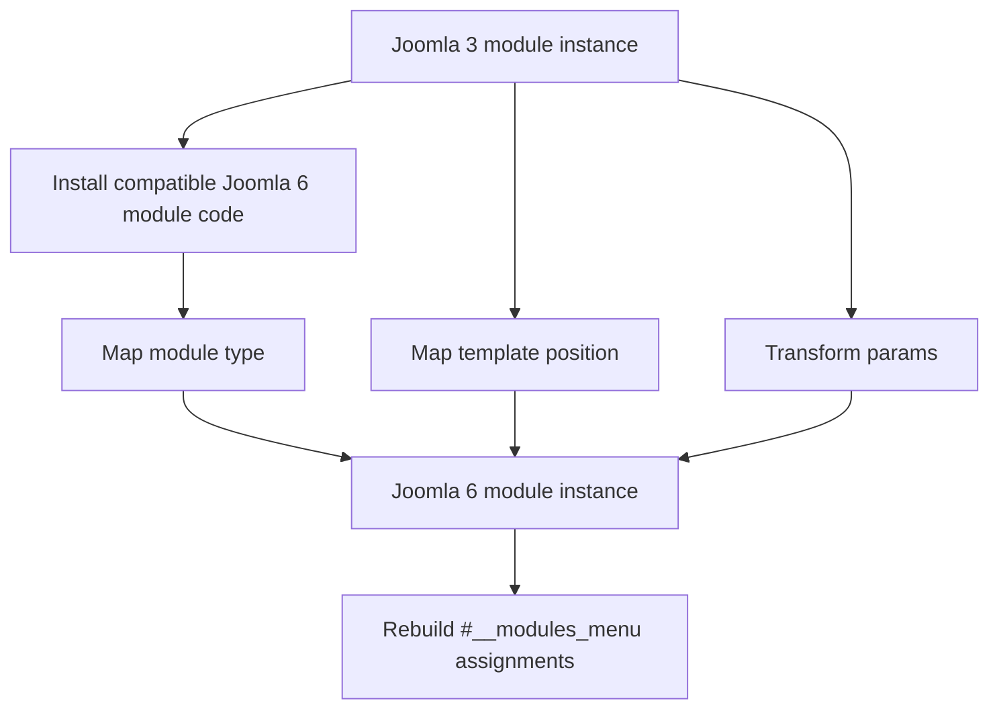

### Important relationship gap

```text
The bridge table still exists, but both IDs can change:

Joomla 3 moduleid/menuid
→ migration maps
→ Joomla 6 moduleid/menuid
```

---

## 7. User and ACL Gap

### Shared relationship model

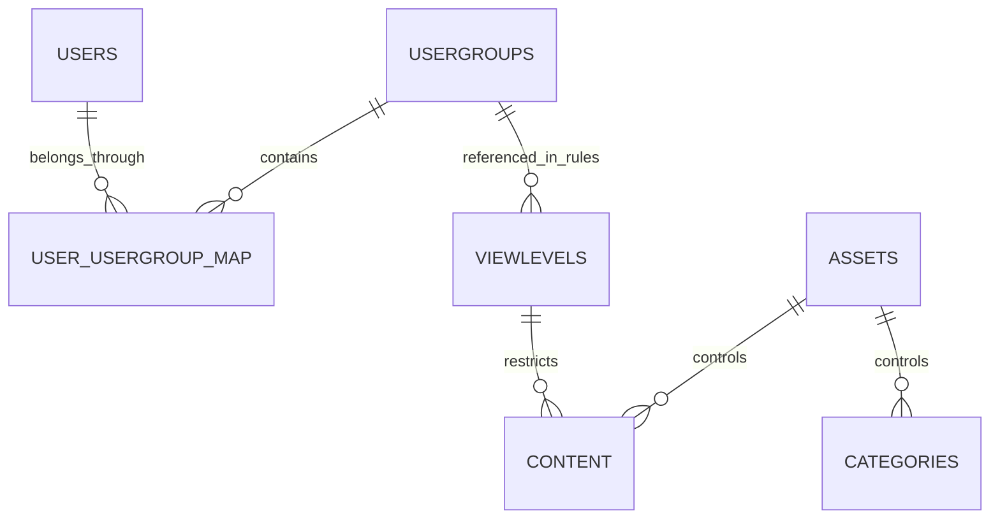

### Main ACL gap

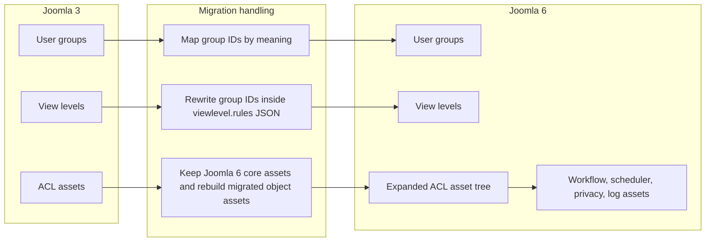

### Authentication gap

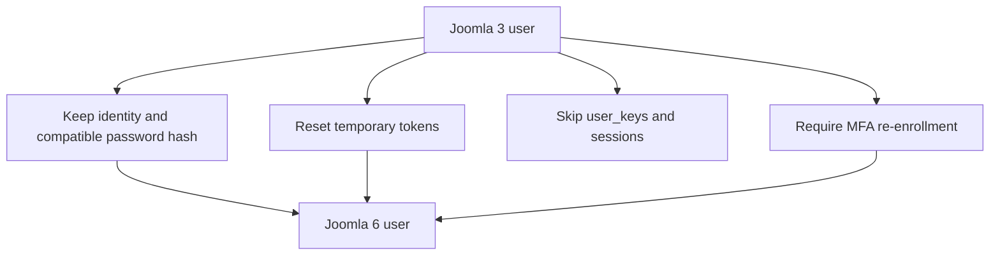

---

## 8. Extension and System Gap

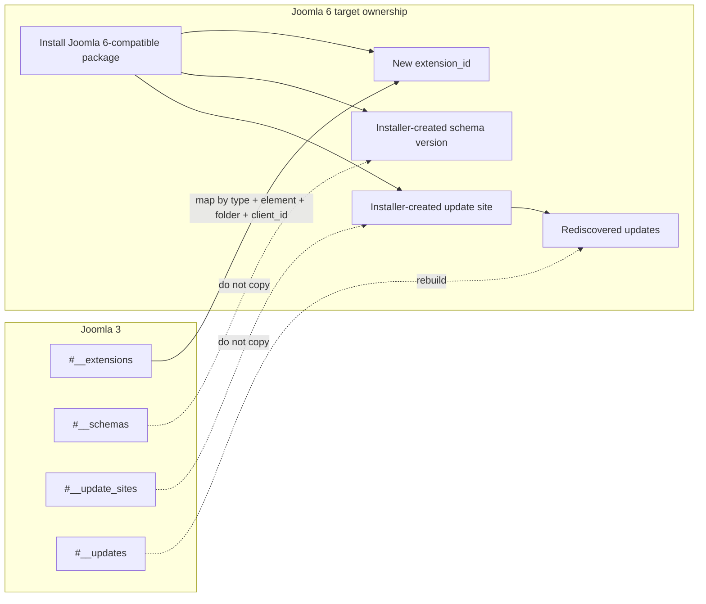

### New Joomla 6 subsystems

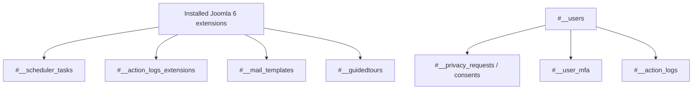

---

## 9. Search, Runtime, and Generated Data Gap

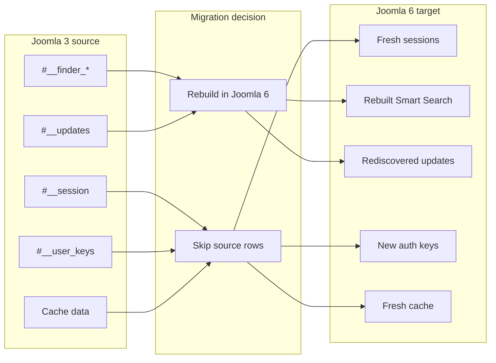

### Rule

```text
Generated, runtime, temporary, and security-sensitive data should normally start fresh in Joomla 6.
```

---

## 10. Migration Decision Flow

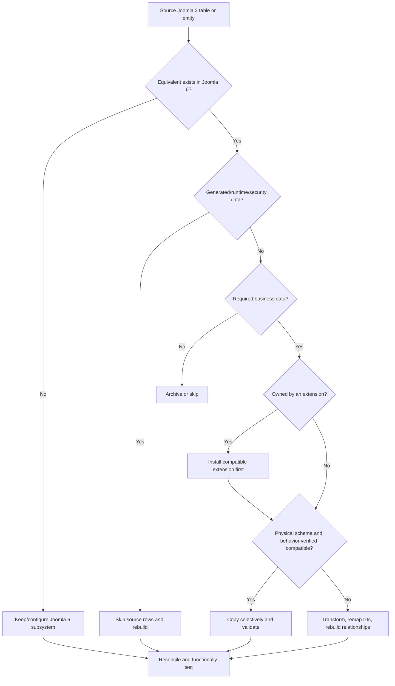

---

## 11. Recommended Migration Dependency Order

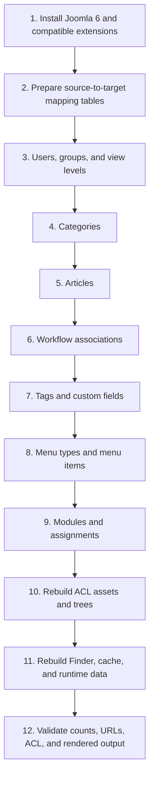

> [!NOTE]
> The exact order can vary by project. For example, categories may need users first for creator references, while custom components may require extension installation and custom schema preparation before their business data can be migrated.

---

## 12. Key Conclusions

1. **Most core business entities still exist**, but their IDs, defaults, JSON, and relationships must be validated.
2. **Nested-set trees must be rebuilt or validated** for categories, menus, tags, user groups, and assets.
3. **Joomla 6 workflow associations are a new dependency** for migrated content when workflows are active.
4. **Extension registry and schema tables are target-owned**; install extensions instead of copying registry rows.
5. **Sessions, cache, Finder indexes, update discovery, authentication keys, and logs should normally start fresh.**
6. **A table-level match is not enough**; column-level actions must be classified as Keep, Remap, Transform, Verify, Rebuild, Reset, Skip, Target-owned, or Add relationship.

## Related Documentation

- [Joomla 3 vs Joomla 6 Database Gap Analysis](./joomla3-vs-joomla6-database-gap.md)
- [Joomla 3 Database Overview](./joomla3/database-overview.md)
- [Joomla 3 Complete ERD](./joomla3/complete-erd.md)
- [Joomla 6 Database Overview](./joomla6/database-overview.md)
- [Joomla 6 Complete ERD](./joomla6/complete-erd.md)
- [Joomla 3 to Joomla 6 Database Migration Checklist](./joomla3-to-joomla6-database-migration-checklist.md)
