# Joomla 3 vs Joomla 6 ERD Gap Diagrams

> A visual migration specification for comparing Joomla 3.10.x and Joomla 6.x database structures.

This document shows Joomla 3 and Joomla 6 tables next to each other so that column names, data types, references, and migration actions can be compared directly.

> [!IMPORTANT]
> The diagrams describe common Joomla core structures. Before writing migration SQL, verify the exact schemas from both installed projects:
>
> ```sql
> SHOW CREATE TABLE `your_j3_prefix_content`;
> SHOW CREATE TABLE `your_j6_prefix_content`;
> ```

---

## Quick Summary

| Area | Result | Default action |
|---|---|---|
| Content and categories | Same business entities, changed references and workflow dependency | Transform, remap, and migrate |
| Menus and modules | Same core entities, changed links, extension IDs, template positions, and tree values | Rewrite and rebuild |
| Users and ACL | Same account/group model, expanded ACL and security model | Selectively migrate and rebuild ACL |
| Extensions and schemas | Same purpose, but target installation owns IDs and schema records | Reinstall and map by identity |
| Workflow, scheduler, privacy, logs, MFA | New or expanded in Joomla 6 | Keep target records or configure explicitly |
| Sessions, Finder, cache, updates | Runtime or generated data | Skip and rebuild |

---

## Table of Contents

- [1. Diagram and Column Legend](#1-diagram-and-column-legend)
- [2. Table-to-Table Status Matrix](#2-table-to-table-status-matrix)
- [3. Side-by-Side Article Table Comparison](#3-side-by-side-article-table-comparison)
- [4. Side-by-Side Menu Table Comparison](#4-side-by-side-menu-table-comparison)
- [5. Content and Category Relationships](#5-content-and-category-relationships)
- [6. Workflow Gap](#6-workflow-gap)
- [7. Tags and Custom Fields Gap](#7-tags-and-custom-fields-gap)
- [8. Module and Template Gap](#8-module-and-template-gap)
- [9. User and ACL Gap](#9-user-and-acl-gap)
- [10. Extension and System Gap](#10-extension-and-system-gap)
- [11. Runtime and Generated Data](#11-runtime-and-generated-data)
- [12. End-to-End Article Migration Example](#12-end-to-end-article-migration-example)
- [13. Migration Decision Flow](#13-migration-decision-flow)
- [14. Validation Checklist](#14-validation-checklist)

---

## 1. Diagram and Column Legend

### Table-level statuses

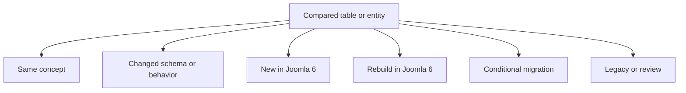

| Status | Meaning | Default handling |
|---|---|---|
| **Same concept** | The business purpose remains | Still compare the physical columns |
| **Changed** | Columns, types, IDs, defaults, JSON, indexes, or behavior differ | Transform and remap |
| **New in Joomla 6** | New table, relationship, or subsystem | Keep or create valid target records |
| **Rebuild** | Generated, runtime, security-sensitive, or installation-owned | Do not copy source rows |
| **Conditional** | Depends on project usage or retention requirements | Migrate only after approval |
| **Legacy / Review** | Joomla 3 storage is obsolete or replaced | Review the target model |

### Column annotations used inside table diagrams

| Annotation | Meaning | Typical handling |
|---|---|---|
| `KEEP` | Same business value | Copy after validating type and size |
| `REMAP` | Foreign/logical reference changes | Replace using an ID mapping table |
| `TRANSFORM` | Value or format changes | Convert JSON, state, date, URL, path, or enum |
| `VERIFY` | Exact compatibility is uncertain | Compare both physical schemas |
| `REBUILD` | Joomla 6 should generate the value | Rebuild trees, assets, indexes, or relationships |
| `RESET` | Keep the row but clear temporary state | Use `NULL`, `0`, or target default |
| `SKIP` | Do not migrate | Exclude runtime or sensitive data |
| `NEW` | Column or relationship is target-only | Populate according to Joomla 6 rules |
| `TARGET` | Installer or Joomla 6 owns the value | Preserve the target value |

> [!NOTE]
> A column can require more than one action. For example, `images` can be `KEEP + TRANSFORM + VERIFY`: retain the image meaning, normalize the JSON, and verify the path.

---

## 2. Table-to-Table Status Matrix

| Joomla 3 | Joomla 6 | Status | Main action |
|---|---|---|---|
| `#__content` | `#__content` | **Changed** | Transform rows, remap IDs, add workflow association |
| `#__categories` | `#__categories` | **Changed** | Remap parents/assets/access and rebuild tree |
| `#__content_frontpage` | `#__content_frontpage` | **Changed** | Remap article IDs and verify scheduling columns |
| `#__tags` | `#__tags` | **Changed** | Remap references and rebuild tree |
| `#__contentitem_tag_map` | Same | **Changed** | Remap content, tag, and type IDs |
| `#__fields*` | Same family | **Changed** | Verify field plugins and remap IDs/context |
| `#__menu_types` | `#__menu_types` | **Changed** | Migrate frontend menus only |
| `#__menu` | `#__menu` | **Changed** | Rewrite links and rebuild tree |
| `#__modules` | `#__modules` | **Changed** | Install compatible code and map positions |
| `#__modules_menu` | Same | **Changed** | Remap both IDs |
| `#__template_styles` | Same | **Changed** | Recreate on compatible Joomla 6 template |
| `#__users` | `#__users` | **Changed** | Selectively migrate identity/security fields |
| `#__usergroups` | Same | **Changed** | Map by meaning and rebuild hierarchy |
| `#__viewlevels` | Same | **Changed** | Rewrite group IDs in JSON rules |
| `#__assets` | `#__assets` | **Rebuild** | Preserve target core tree; recreate object assets |
| `#__extensions` | `#__extensions` | **Rebuild** | Reinstall and map by extension identity |
| `#__schemas` | `#__schemas` | **Rebuild** | Let installers create rows |
| `#__finder_*` | `#__finder_*` | **Rebuild** | Re-index |
| `#__session` | `#__session` | **Rebuild** | Start empty |
| No equivalent | `#__workflows*` | **New** | Configure workflows and create associations |
| No equivalent | `#__scheduler_*` | **New** | Keep installer-created tasks and fresh logs |
| Joomla 3 OTP fields | `#__user_mfa` | **New / Changed** | Require MFA re-enrollment |

---

## 3. Side-by-Side Article Table Comparison

The two entities below are intentionally connected by a comparison relationship so Mermaid normally renders them close together.

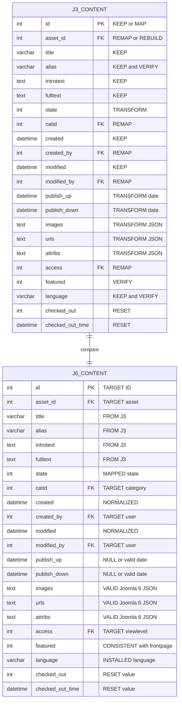

### Article differences requiring special attention

| Joomla 3 column | Joomla 6 target | Action | Warning |
|---|---|---|---|
| `id` | `id` | Keep or map | Do not preserve when it collides with target rows |
| `catid` | `catid` | Remap | Category IDs are installation-specific |
| `created_by`, `modified_by` | Same names | Remap | User IDs may differ |
| `access` | `access` | Remap | Map view levels by meaning, not only ID |
| `asset_id` | `asset_id` | Rebuild/remap | Do not copy Joomla 3 core asset IDs blindly |
| `state` | `state` | Transform/verify | Must agree with the selected Joomla 6 workflow stage |
| `state` | `#__workflow_associations.stage_id` | New relationship | Create after target article insertion |
| `images`, `urls`, `attribs`, `metadata` | Same logical fields | Transform | Validate JSON and embedded IDs/paths |
| `publish_up`, `publish_down` | Same logical fields | Transform | Convert invalid zero dates to valid target values |
| `checked_out*` | Same logical fields | Reset | Prevent stale edit locks |

### New Joomla 6 article dependency

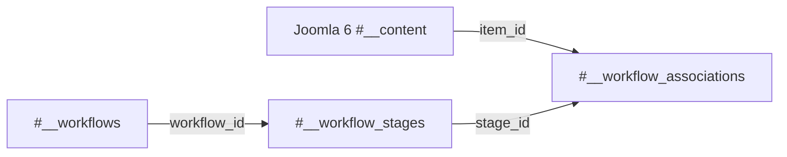

---

## 4. Side-by-Side Menu Table Comparison

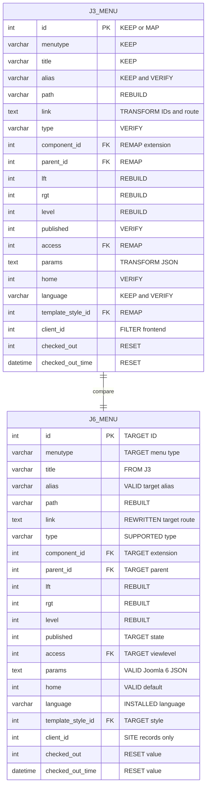

### Menu differences requiring special attention

| Column | Required handling | Example |
|---|---|---|
| `component_id` | Map using `type + element + folder + client_id` | Joomla 3 extension ID `100` may become Joomla 6 ID `250` |
| `link` | Rewrite embedded content/category/custom IDs | `view=article&id=25` → mapped article ID |
| `parent_id` | Remap parent first | Import menu tree parent-first |
| `lft`, `rgt`, `level`, `path` | Rebuild | Do not trust source nested-set boundaries |
| `template_style_id` | Map to compatible Joomla 6 style | Protostar style cannot be copied as Cassiopeia style |
| `params` | Transform and validate JSON | Remove obsolete template/component options |
| `client_id` | Filter | Do not migrate Joomla 3 administrator menu rows |
| `home` | Validate | Ensure one valid default menu per required language |

---

## 5. Content and Category Relationships

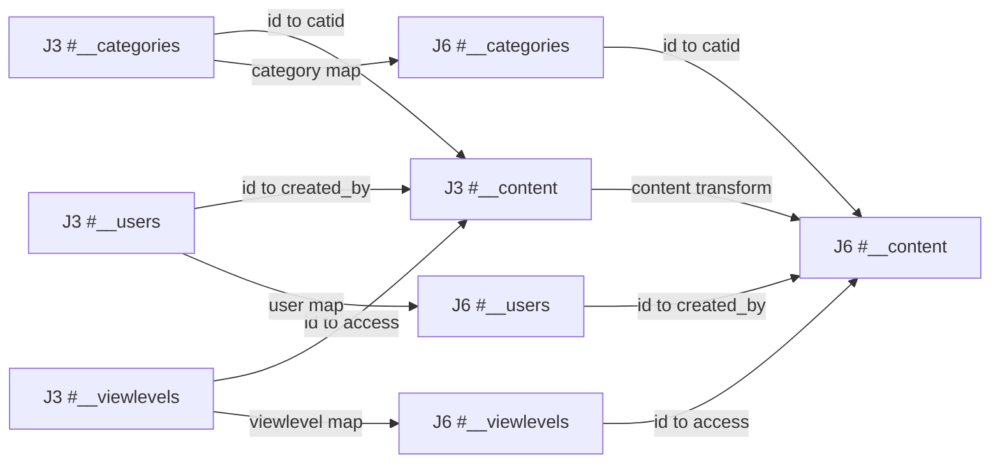

### Category tree handling

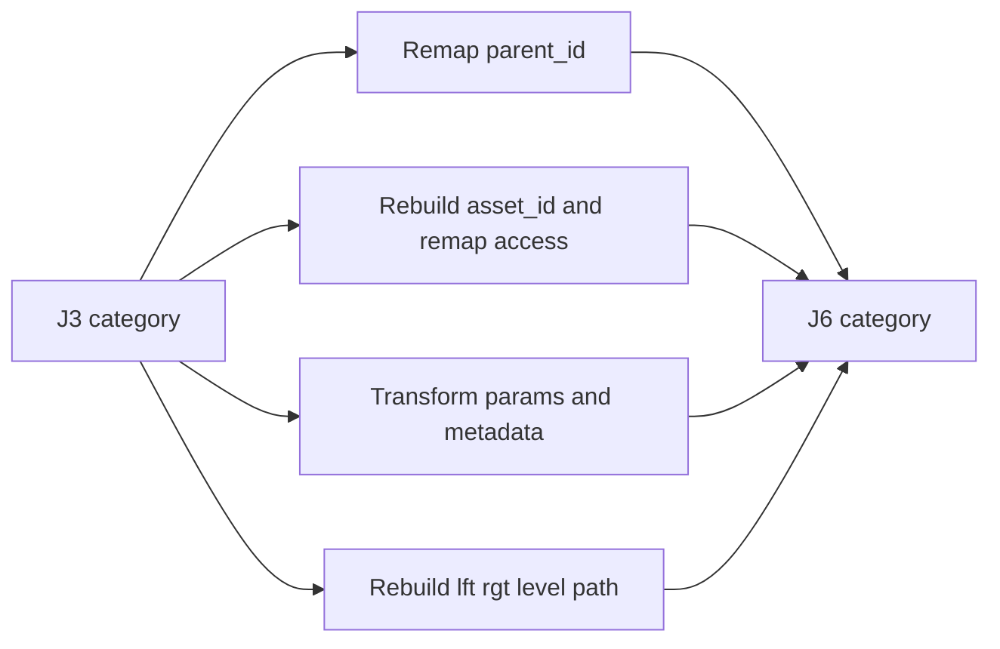

---

## 6. Workflow Gap

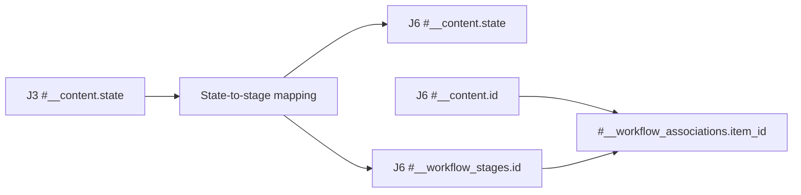

| Joomla 3 state | Typical Joomla 6 handling |
|---:|---|
| `1` | Published target state and published workflow stage |
| `0` | Unpublished target state and unpublished stage |
| `2` | Archived target state and archived stage |
| `-2` | Trashed target state and trashed stage |

> [!CAUTION]
> Do not hard-code workflow stage IDs. Resolve them from the target Joomla 6 workflow configuration.

---

## 7. Tags and Custom Fields Gap

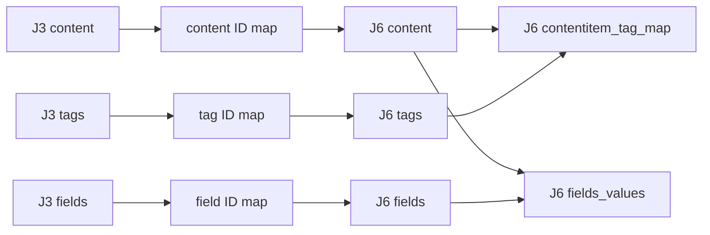

| Mapping table | Columns to remap |
|---|---|
| `#__contentitem_tag_map` | `content_item_id`, `core_content_id`, `tag_id`, content type reference |
| `#__fields_values` | `field_id`, `item_id` |
| `#__fields_categories` | `field_id`, `category_id` |

> [!IMPORTANT]
> `#__fields_values.item_id` is not self-describing. Its meaning depends on the field `context`.

---

## 8. Module and Template Gap

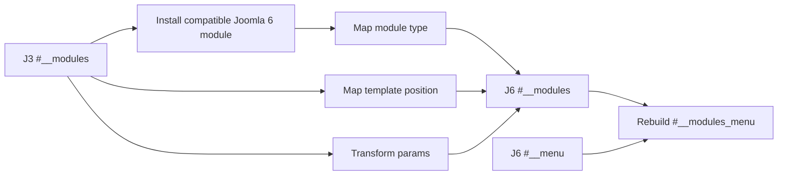

| Joomla 3 value | Joomla 6 handling |
|---|---|
| `module` | Target module extension must exist |
| `position` | Map old template position to target template position |
| `params` | Transform extension-specific JSON |
| `asset_id` | Assign target-created asset |
| `moduleid`, `menuid` | Remap both sides of `#__modules_menu` |

---

## 9. User and ACL Gap

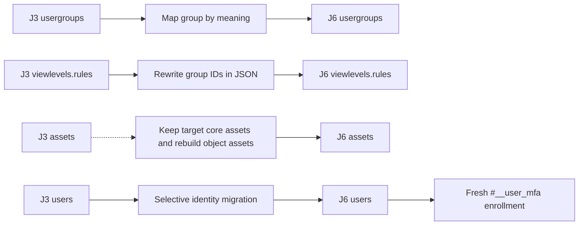

| Data | Decision |
|---|---|
| User identity and compatible password hash | Migrate selectively |
| User-group assignments | Remap both IDs |
| View-level JSON rules | Rewrite group IDs |
| ACL asset IDs and tree boundaries | Rebuild |
| Sessions and remember-me keys | Skip |
| OTP/MFA secrets | Do not copy directly; require re-enrollment |

---

## 10. Extension and System Gap

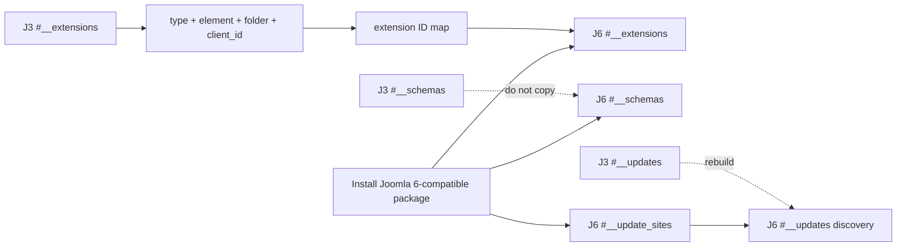

### New Joomla 6 subsystems

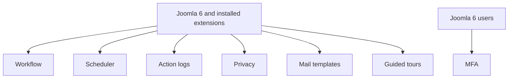

---

## 11. Runtime and Generated Data

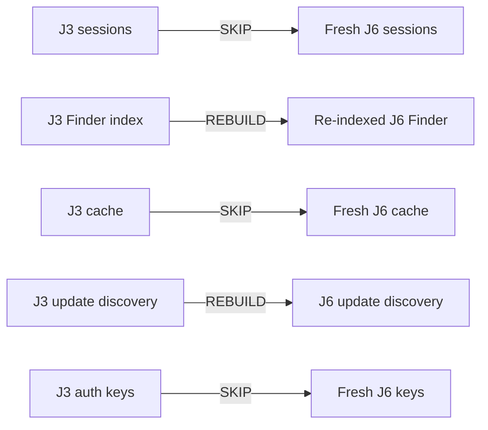

---

## 12. End-to-End Article Migration Example

### Example source and target IDs

| Reference | Joomla 3 | Joomla 6 |
|---|---:|---:|
| Article | `25` | `125` |
| Category | `8` | `108` |
| Author | `42` | `242` |
| View level | `1` | `1` after validation |
| Asset | `300` | `900` |
| Workflow stage | Not applicable | `1` resolved from target |

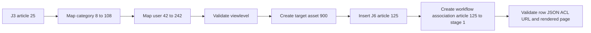

---

## 13. Migration Decision Flow

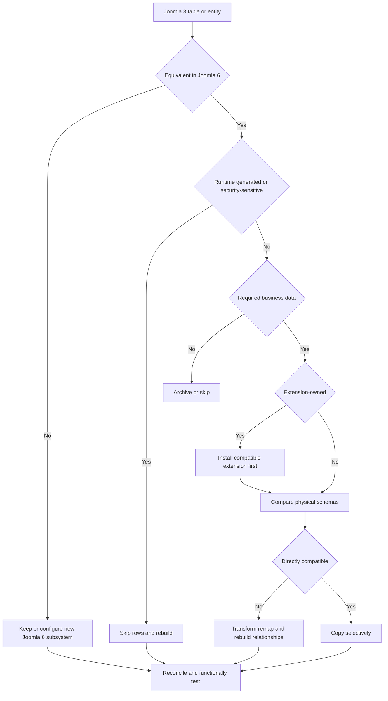

---

## 14. Validation Checklist

### Mermaid rendering

- [ ] Every Mermaid block renders on GitHub without a syntax error.
- [ ] ER entities use simple data types such as `int`, `varchar`, `text`, and `datetime`.
- [ ] Attribute annotations are enclosed in quotes.
- [ ] Table comparison diagrams contain exactly one Joomla 3 table and one Joomla 6 table connected by `compare`.
- [ ] Flowchart node IDs are unique within each block.

### Schema comparison

- [ ] Export `SHOW CREATE TABLE` for each compared table.
- [ ] Compare column names, types, lengths, unsigned flags, nullability, defaults, indexes, charset, and collation.
- [ ] Replace example annotations when the real project schema differs.

### Migration validation

- [ ] Build maps for users, groups, view levels, categories, content, assets, tags, fields, extensions, menus, modules, and styles.
- [ ] Rebuild category, tag, menu, user-group, and asset trees.
- [ ] Validate and transform all JSON fields.
- [ ] Rewrite IDs embedded in menu links and configuration.
- [ ] Create valid Joomla 6 workflow associations.
- [ ] Start sessions, cache, Finder, updates, scheduler logs, and MFA records fresh unless an approved exception exists.
- [ ] Compare row counts, content hashes, relationships, URLs, ACL behavior, and rendered pages.

---

## Related Documentation

- [Joomla 3 vs Joomla 6 Database Gap Analysis](./joomla3-vs-joomla6-database-gap.md)
- [Joomla 3 Database Overview](./joomla3/database-overview.md)
- [Joomla 3 Complete ERD](./joomla3/complete-erd.md)
- [Joomla 6 Database Overview](./joomla6/database-overview.md)
- [Joomla 6 Complete ERD](./joomla6/complete-erd.md)
- [Joomla 3 to Joomla 6 Database Migration Checklist](./joomla3-to-joomla6-database-migration-checklist.md)
