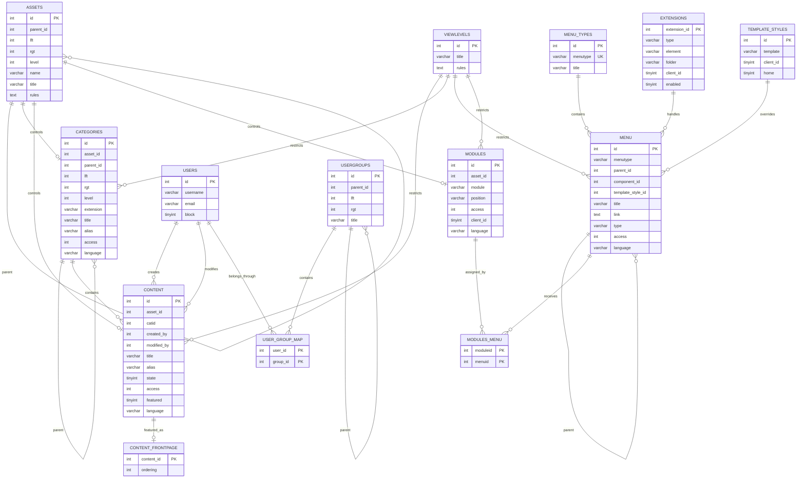
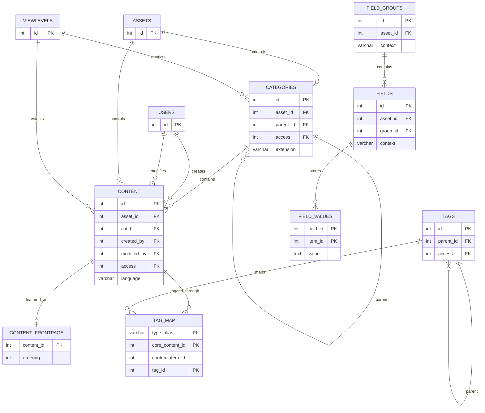
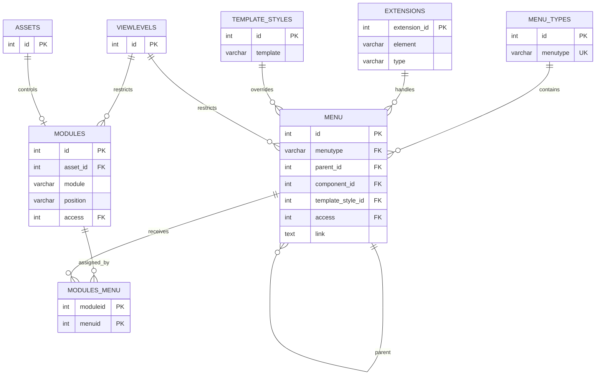
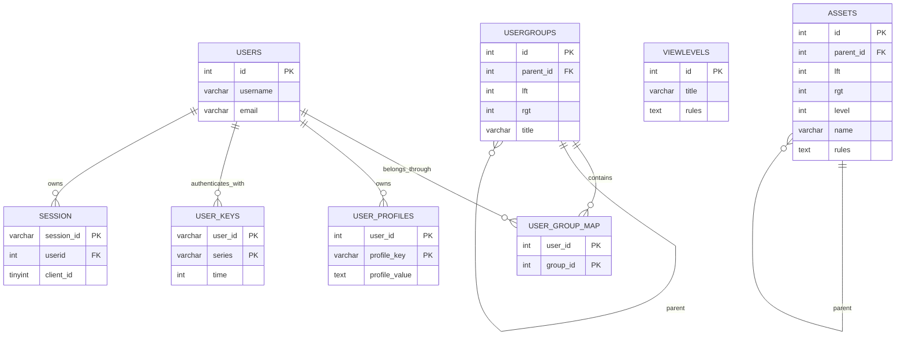
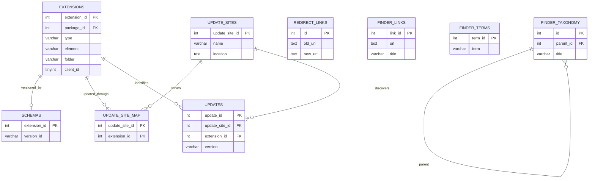
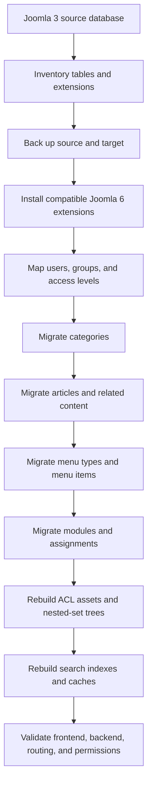

# Joomla 3 Complete Database ERD

This document provides logical Mermaid diagrams for the main Joomla 3 core database areas. Joomla does not enforce every relationship with physical MySQL foreign keys, so the diagrams describe application-level relationships.

## Table of Contents

- [1. Core ERD](#1-core-erd)
- [2. Content ERD](#2-content-erd)
- [3. Menu and Module ERD](#3-menu-and-module-erd)
- [4. User and ACL ERD](#4-user-and-acl-erd)
- [5. Extension and System ERD](#5-extension-and-system-erd)
- [6. Migration Flow](#6-migration-flow)
- [7. Diagram Limitations](#7-diagram-limitations)

## 1. Core ERD

## 2. Content ERD

Note: `#__fields_values.item_id` is context-dependent and is not a universal foreign key to `#__content.id`.

## 3. Menu and Module ERD

`MODULES_MENU.menuid` has special semantics: `0` means all pages and a negative value means exclusion.

## 4. User and ACL ERD

`VIEWLEVELS.rules` and `ASSETS.rules` contain user-group IDs inside JSON, so their relationship to `USERGROUPS` is logical rather than a direct SQL foreign key.

## 5. Extension and System ERD

Finder contains additional partitioned mapping and token tables that are intentionally simplified here because they are generated indexes.

## 6. Migration Flow

## 7. Diagram Limitations

1. The diagrams focus on core logical relationships, not every column.
2. Joomla 3 minor versions may contain schema differences.
3. Third-party extensions add independent tables and relationships.
4. JSON-based relationships cannot be shown as ordinary foreign keys.
5. Generated tables such as Finder indexes should normally be rebuilt rather than migrated.
6. Use `SHOW CREATE TABLE` and Joomla's installation SQL files to confirm the exact physical source schema.

[Database Overview](./database-overview.md) · [Content Tables](./content-tables.md) · [Menu and Module Tables](./menu-module-tables.md) · [User and ACL Tables](./user-acl-tables.md) · [Extension and System Tables](./extension-system-tables.md)