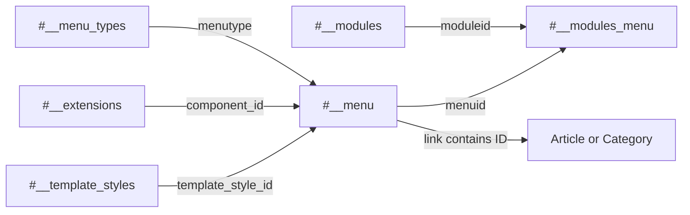

# Joomla 3 Menu and Module Tables

This document explains navigation, module placement, menu assignments, and template-style relationships in Joomla 3.

## Table of Contents

- [1. Relationship Summary](#1-relationship-summary)
- [2. `#__menu_types`](#2-menu_types)
- [3. `#__menu`](#3-menu)
- [4. `#__modules`](#4-modules)
- [5. `#__modules_menu`](#5-modules_menu)
- [6. `#__template_styles`](#6-template_styles)
- [7. Common Values](#7-common-values)
- [8. Routing and Assignment Examples](#8-routing-and-assignment-examples)
- [9. Migration Notes](#9-migration-notes)

## 1. Relationship Summary

```text
#__menu_types.menutype     → #__menu.menutype
#__menu.id                 → #__menu.parent_id
#__extensions.extension_id→ #__menu.component_id
#__modules.id              → #__modules_menu.moduleid
#__menu.id                 → #__modules_menu.menuid
#__template_styles.id      → #__menu.template_style_id
```

## 2. `#__menu_types`

Stores menu containers such as Main Menu and Footer Menu.

| Column | Meaning |
|---|---|
| `id` | Menu type primary key |
| `menutype` | Unique machine name, for example `mainmenu` |
| `title` | Administrator display title |
| `description` | Administrator description |

`menutype` is the logical key used by `#__menu`.

## 3. `#__menu`

Stores both site and administrator menu items.

| Column | Meaning |
|---|---|
| `id` | Menu item primary key |
| `menutype` | Menu container machine name |
| `title` | Menu item title |
| `alias` | URL-safe alias |
| `note` | Administrator note |
| `path` | Hierarchical menu path |
| `link` | Internal or external target |
| `type` | Item type |
| `published` | Publication state |
| `parent_id` | Parent menu item |
| `level` | Tree depth |
| `component_id` | Related extension ID |
| `checked_out` | User currently editing the item |
| `checked_out_time` | Checkout timestamp |
| `browserNav` | Browser target behavior |
| `access` | View level ID |
| `img` | Legacy menu image value |
| `template_style_id` | Optional template-style override |
| `params` | JSON menu and component-view settings |
| `lft`, `rgt` | Nested-set boundaries |
| `home` | Default home-page flag |
| `language` | Language code or `*` |
| `client_id` | Site or administrator client |

Common `type` values:

| Value | Meaning |
|---|---|
| `component` | Component view |
| `url` | Internal or external URL |
| `alias` | Alias of another menu item |
| `separator` | Visual separator |
| `heading` | Non-clickable heading |

Common `browserNav` values:

| Value | Meaning |
|---:|---|
| `0` | Open in the same window |
| `1` | Open in a new window with navigation |
| `2` | Open in a popup/new window without full navigation |

Common `client_id` values:

| Value | Meaning |
|---:|---|
| `0` | Site menu item |
| `1` | Administrator menu item |

Single Article example:

```text
index.php?option=com_content&view=article&id=25
```

Category Blog example:

```text
index.php?option=com_content&view=category&layout=blog&id=8
```

The IDs embedded in `link` must be remapped when target content IDs change.

### Menu Tree Rules

A menu tree depends on:

```text
parent_id
lft
rgt
level
path
```

All five values should be validated after migration.

## 4. `#__modules`

Stores module instances, not module extension definitions. The module code itself is represented in `#__extensions`.

| Column | Meaning |
|---|---|
| `id` | Module instance ID |
| `asset_id` | ACL asset ID |
| `title` | Module title |
| `note` | Administrator note |
| `content` | Module content, especially for `mod_custom` |
| `ordering` | Order inside a template position |
| `position` | Template position name |
| `checked_out` | User currently editing the module |
| `checked_out_time` | Checkout time |
| `publish_up` | Publishing start |
| `publish_down` | Publishing end |
| `published` | Publication state |
| `module` | Module type, for example `mod_custom` |
| `access` | View level ID |
| `showtitle` | Whether to display the module title |
| `params` | JSON module configuration |
| `client_id` | Site or administrator client |
| `language` | Language code or `*` |

Important distinction:

```text
#__extensions.element = mod_custom  → installed module type
#__modules.module      = mod_custom  → configured module instance
```

A site may have many `#__modules` rows using the same module type.

## 5. `#__modules_menu`

Bridge table controlling where modules appear.

| Column | Meaning |
|---|---|
| `moduleid` | Module instance ID |
| `menuid` | Menu assignment value |

Common assignment values:

| Value | Meaning |
|---:|---|
| `0` | Display on all pages |
| Positive ID | Display on that menu item |
| Negative ID | Exclude that menu item while using an all-pages assignment pattern |

Examples:

```text
moduleid = 45, menuid = 0
```

Module 45 appears on all pages.

```text
moduleid = 45, menuid = 123
```

Module 45 appears on menu item 123.

```text
moduleid = 45, menuid = -123
```

Module 45 is excluded from menu item 123.

Migration must use the new target menu IDs.

## 6. `#__template_styles`

Stores configurable template style instances.

| Column | Meaning |
|---|---|
| `id` | Template style ID |
| `template` | Template element name |
| `client_id` | Site or administrator client |
| `home` | Default style flag |
| `title` | Style title |
| `params` | JSON template configuration |

A template installation may have multiple styles with different parameters.

`#__menu.template_style_id` can override the default template style for a menu item.

## 7. Common Values

| Field | Values |
|---|---|
| `published` | `1` published, `0` unpublished, `-2` trashed; administrator records may use additional internal states |
| `home` | `1` default home item/style, `0` not default; multilingual setups may store language-specific behavior |
| `access` | ID from `#__viewlevels` |
| `language` | `*` or a content language code |
| `client_id` | `0` site, `1` administrator |
| `showtitle` | `1` show, `0` hide |

## 8. Routing and Assignment Examples



A frontend page is usually resolved through a menu item. The menu item defines the component view, parameters, access, language, template style, and module assignment context.

## 9. Migration Notes

- Create menu types before menu items.
- Preserve parent-child ordering or rebuild the menu tree.
- Map `component_id` to the target installation's extension ID.
- Rewrite IDs inside `link` and relevant `params` values.
- Install compatible module code before importing module instances.
- Map template positions from the Joomla 3 template to the Joomla 6 template.
- Import modules before `#__modules_menu` assignments.
- Remap positive and negative menu IDs.
- Validate home menu items per language.
- Test aliases, redirects, SEF URLs, active menu states, and module visibility.

[Database Overview](./database-overview.md) · [Extension and System Tables](./extension-system-tables.md) · [Complete ERD](./complete-erd.md)