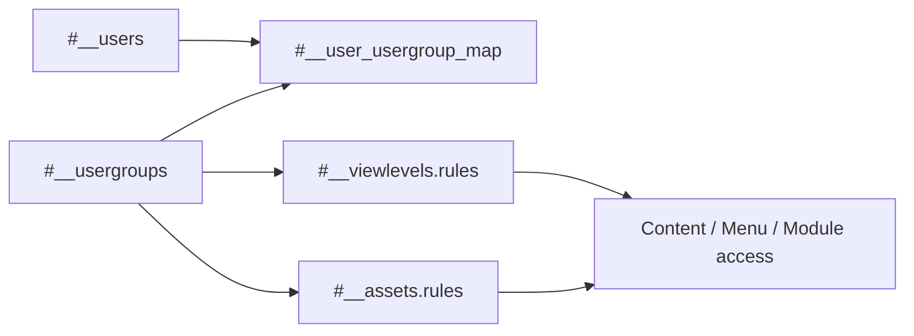

# Joomla 3 User and ACL Tables

This document explains Joomla 3 user accounts, groups, view levels, ACL assets, profiles, notes, authentication keys, and sessions.

## Table of Contents

- [1. Relationship Summary](#1-relationship-summary)
- [2. `#__users`](#2-users)
- [3. `#__usergroups`](#3-usergroups)
- [4. `#__user_usergroup_map`](#4-user_usergroup_map)
- [5. `#__viewlevels`](#5-viewlevels)
- [6. `#__assets`](#6-assets)
- [7. Profiles and Notes](#7-profiles-and-notes)
- [8. Authentication and Session Tables](#8-authentication-and-session-tables)
- [9. ACL Flow](#9-acl-flow)
- [10. Migration Notes](#10-migration-notes)

## 1. Relationship Summary

```text
#__users.id       → #__user_usergroup_map.user_id
#__usergroups.id  → #__user_usergroup_map.group_id
#__usergroups IDs → #__viewlevels.rules
#__usergroups IDs → #__assets.rules
#__assets.id      → content/module/category asset_id
#__users.id       → #__session.userid
```

## 2. `#__users`

Stores Joomla user accounts.

| Column | Meaning |
|---|---|
| `id` | User primary key |
| `name` | Display name |
| `username` | Login name |
| `email` | Email address |
| `password` | Password hash, sometimes including legacy migration markers |
| `block` | Account blocked flag |
| `sendEmail` | Receive system email flag |
| `registerDate` | Registration timestamp |
| `lastvisitDate` | Last successful visit timestamp |
| `activation` | Activation or reset token |
| `params` | JSON user preferences |
| `lastResetTime` | Last password reset timestamp |
| `resetCount` | Number of recent reset requests |
| `otpKey` | Encrypted/encoded two-factor configuration in supported releases |
| `otep` | One-time emergency passwords |
| `requireReset` | Force password reset flag |

Common boolean values:

| Value | Meaning |
|---:|---|
| `0` | False / disabled |
| `1` | True / enabled |

Security notes:

- Never document or export real password hashes in examples.
- Do not migrate active reset or activation tokens unless required and reviewed.
- Two-factor values are sensitive.
- Joomla 6 password handling must be validated against the target authentication stack.

## 3. `#__usergroups`

Stores hierarchical user groups.

| Column | Meaning |
|---|---|
| `id` | Group ID |
| `parent_id` | Parent group ID |
| `lft`, `rgt` | Nested-set boundaries |
| `title` | Group title |

Typical core groups include Public, Guest, Registered, Author, Editor, Publisher, Manager, Administrator, and Super Users. IDs should not be assumed to match across installations.

## 4. `#__user_usergroup_map`

Many-to-many bridge between users and groups.

| Column | Meaning |
|---|---|
| `user_id` | User ID |
| `group_id` | User group ID |

A user may belong to multiple groups. Permission evaluation uses the combined inherited permissions from all assigned groups.

## 5. `#__viewlevels`

Defines which groups may view an object.

| Column | Meaning |
|---|---|
| `id` | View level ID |
| `title` | Display title, such as Public or Registered |
| `ordering` | Display order |
| `rules` | JSON array of permitted user group IDs |

Example:

```json
[2, 8]
```

This means members of groups 2 or 8 may view records assigned to this access level.

Important distinction:

> View levels control visibility. They do not grant edit, delete, publish, or configuration permissions.

## 6. `#__assets`

Stores Joomla ACL objects and action rules.

| Column | Meaning |
|---|---|
| `id` | Asset primary key |
| `parent_id` | Parent asset ID |
| `lft`, `rgt` | Nested-set boundaries |
| `level` | Tree depth |
| `name` | Unique asset name |
| `title` | Human-readable title |
| `rules` | JSON action rules by group ID |

Example asset names:

```text
root.1
com_content
com_content.category.10
com_content.article.25
com_modules.module.45
com_users
```

Example rule shape:

```json
{
  "core.edit": {"6": 1, "7": 1},
  "core.delete": {"8": 1},
  "core.edit.state": {"7": 1}
}
```

Common rule values:

| Value | Meaning |
|---:|---|
| `1` | Allowed |
| `0` | Explicitly denied or not allowed depending on context |
| Missing | Inherit from parent |

ACL resolution considers:

1. The user's groups.
2. Group inheritance.
3. The asset tree.
4. Parent permissions.
5. Explicit allow and deny rules.

A deny usually overrides an allow at the relevant inheritance level.

## 7. Profiles and Notes

### `#__user_profiles`

Stores extensible user profile values.

| Column | Meaning |
|---|---|
| `user_id` | User ID |
| `profile_key` | Namespaced profile key |
| `profile_value` | Stored value, often JSON-encoded |
| `ordering` | Field order |

Example keys may look like `profile.address1` or plugin-specific names.

### `#__user_notes`

Stores administrator notes about users.

Important columns commonly include:

```text
id
user_id
catid
subject
body
state
checked_out
checked_out_time
created_user_id
created_time
modified_user_id
modified_time
review_time
publish_up
publish_down
```

### `#__user_notes_categories`

In some Joomla 3 schemas, notes use the shared `#__categories` table with an extension context rather than a separate physical category table. Confirm the exact source schema before migration.

## 8. Authentication and Session Tables

### `#__user_keys`

Stores persistent authentication keys, such as remember-me tokens.

Typical columns:

| Column | Meaning |
|---|---|
| `user_id` | User identifier or username context |
| `series` | Token series identifier |
| `uastring` | User-agent hash or value |
| `time` | Expiration timestamp |

Do not migrate active authentication keys.

### `#__session`

Stores active site and administrator sessions.

| Column | Meaning |
|---|---|
| `session_id` | Session identifier |
| `client_id` | Site or administrator client |
| `guest` | Guest flag |
| `time` | Last activity timestamp |
| `data` | Serialized session payload where present |
| `userid` | Logged-in user ID |
| `username` | Cached username |

Session data is runtime data and must not be migrated.

## 9. ACL Flow



Use this distinction:

```text
#__viewlevels → Who can see the item?
#__assets     → Who can perform actions on the item?
```

## 10. Migration Notes

- Do not assume core group IDs match between Joomla 3 and Joomla 6.
- Build mappings for users, groups, view levels, and assets.
- Preserve usernames and emails only after duplicate checks.
- Validate password hashes in a staging environment.
- Exclude active reset tokens, activation tokens, user keys, and sessions unless there is a specific reviewed requirement.
- Rebuild group and asset nested-set trees.
- Recreate ACL assets through Joomla APIs where practical.
- Remap group IDs inside `#__viewlevels.rules` and `#__assets.rules`.
- Test frontend visibility separately from backend action permissions.
- Verify Super User access before completing the migration.

[Database Overview](./database-overview.md) · [Complete ERD](./complete-erd.md)