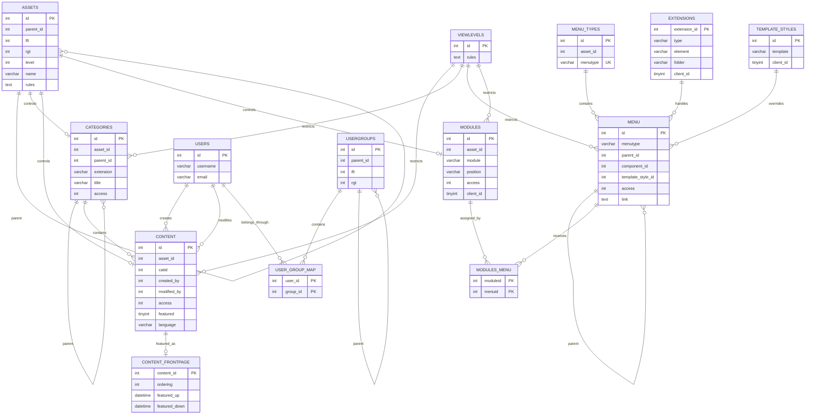
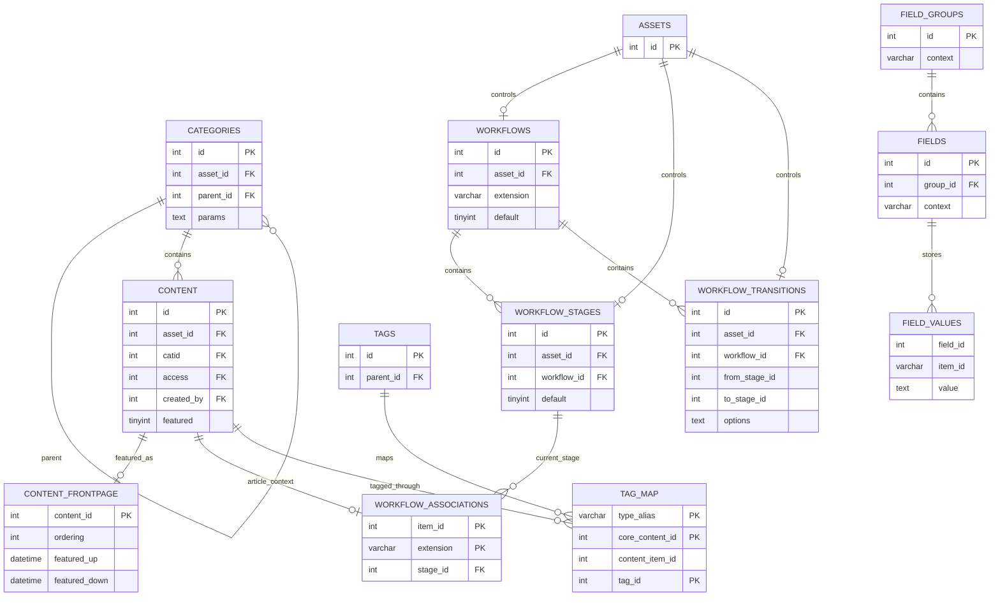
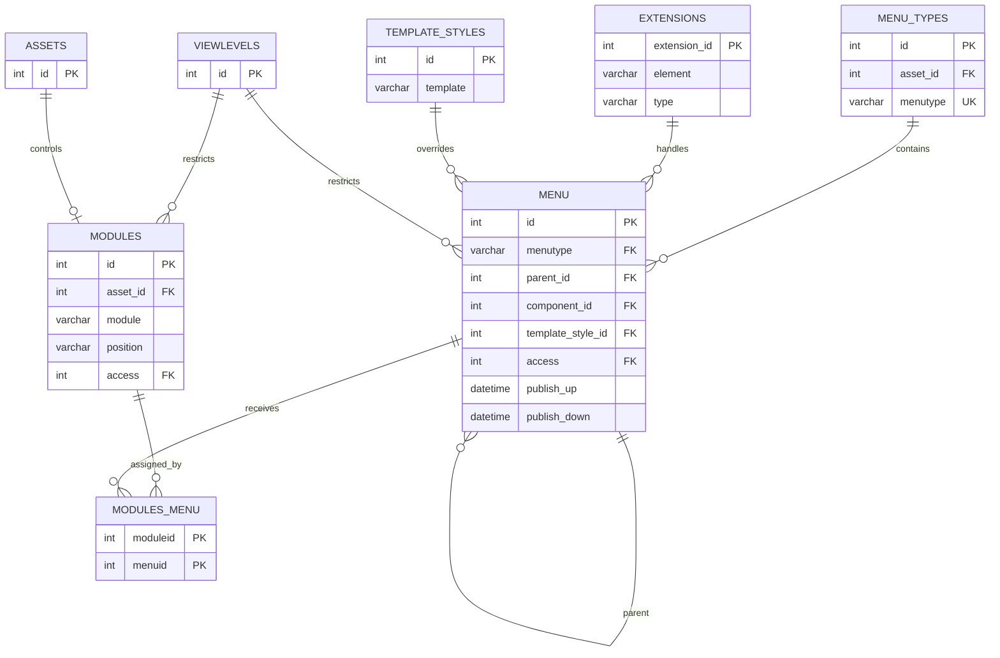
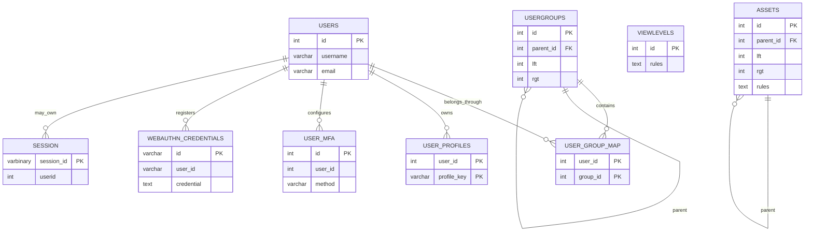
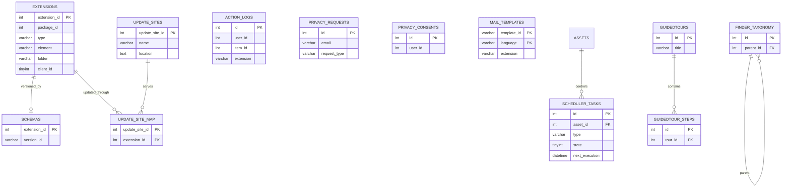
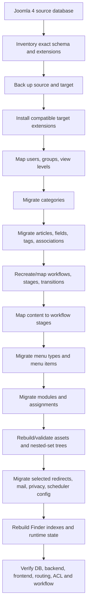

# Joomla 4 Complete Database ERD

This document provides logical Mermaid diagrams for the main Joomla 4.4 core database areas. Joomla does not enforce every relationship with physical MySQL foreign keys, so these diagrams intentionally include application-level relationships.

> **Schema baseline:** Joomla 4.4.14.

## Table of Contents

- [1. Core ERD](#1-core-erd)
- [2. Content and Workflow ERD](#2-content-and-workflow-erd)
- [3. Menu and Module ERD](#3-menu-and-module-erd)
- [4. User, ACL and Authentication ERD](#4-user-acl-and-authentication-erd)
- [5. Extension and System ERD](#5-extension-and-system-erd)
- [6. Migration Flow](#6-migration-flow)
- [7. Diagram Limitations](#7-diagram-limitations)

## 1. Core ERD

## 2. Content and Workflow ERD

`WORKFLOW_ASSOCIATIONS.item_id` and `FIELD_VALUES.item_id` are context-dependent. Their arrows to articles only apply when the context/extension identifies article content.

## 3. Menu and Module ERD

`MODULES_MENU.menuid = 0` means all pages; negative menu IDs represent exclusions and must preserve sign during remapping.

## 4. User, ACL and Authentication ERD

`VIEWLEVELS.rules` and `ASSETS.rules` embed group IDs in JSON, so the relationship to `USERGROUPS` is logical rather than a normal SQL FK.

## 5. Extension and System ERD

Generated Finder link/term/token relationships are intentionally simplified because the index should normally be rebuilt rather than copied.

## 6. Migration Flow

## 7. Diagram Limitations

1. Diagrams focus on core logical relationships rather than every physical column.
2. The baseline is Joomla 4.4.14; earlier Joomla 4 releases can differ.
3. Third-party/custom extensions add independent tables and relationships.
4. IDs embedded in JSON, links and serialized configuration cannot be fully represented as ERD foreign keys.
5. Context-dependent IDs such as custom-field values and workflow associations must be resolved by context.
6. Finder tokens/index tables are generated data and are intentionally simplified.
7. Authentication secrets are shown conceptually only; do not copy them merely because a relationship exists.
8. Use `SHOW CREATE TABLE` plus Joomla installation/update SQL to verify the exact physical schema before migration.

[Database Overview](./database-overview.md) · [Content Tables](./content-tables.md) · [Menu and Module Tables](./menu-module-tables.md) · [User and ACL Tables](./user-acl-tables.md) · [Extension and System Tables](./extension-system-tables.md)