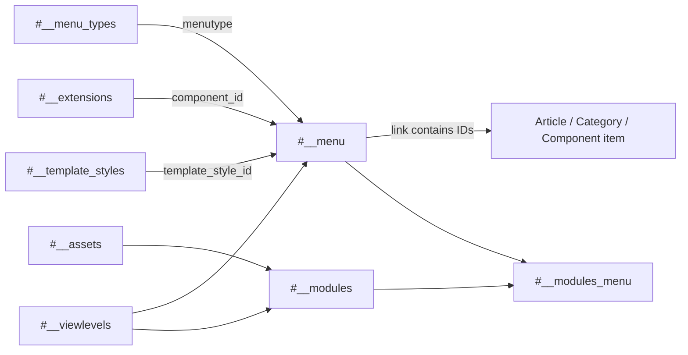

# Joomla 4 Menu and Module Tables

This document explains Joomla 4.4 navigation, module placement, menu assignments, template styles, and routing-sensitive database values.

> **Schema baseline:** Joomla 4.4.14.

## Table of Contents

- [1. Relationship Summary](#1-relationship-summary)
- [2. `#__menu_types`](#2-menu_types)
- [3. `#__menu`](#3-menu)
- [4. `#__modules`](#4-modules)
- [5. `#__modules_menu`](#5-modules_menu)
- [6. `#__template_styles`](#6-template_styles)
- [7. `#__template_overrides`](#7-template_overrides)
- [8. Routing and Assignment Flow](#8-routing-and-assignment-flow)
- [9. Migration Notes](#9-migration-notes)

## 1. Relationship Summary

```text
#__menu_types.menutype      → #__menu.menutype
#__menu.id                  → #__menu.parent_id
#__extensions.extension_id → #__menu.component_id
#__template_styles.id       → #__menu.template_style_id
#__modules.id               → #__modules_menu.moduleid
#__menu.id                  → #__modules_menu.menuid
#__assets.id                → #__modules.asset_id
#__viewlevels.id            → #__menu.access / #__modules.access
```

Joomla does not necessarily enforce these as physical foreign keys.

## 2. `#__menu_types`

Stores menu containers such as Main Menu.

Important columns in Joomla 4 include:

| Column | Meaning |
|---|---|
| `id` | Menu type primary key |
| `asset_id` | ACL asset related to the menu container |
| `menutype` | Unique machine name |
| `title` | Administrator title |
| `description` | Administrator description |
| `client_id` | Site/administrator client where present in the exact 4.x schema |

`menutype` is the logical value used by `#__menu`. Do not map menu items by `#__menu_types.id` alone.

## 3. `#__menu`

Stores site and administrator menu items.

Important fields:

| Column | Meaning |
|---|---|
| `id` | Menu item ID |
| `menutype` | Menu container machine name |
| `title`, `alias`, `note`, `path` | Menu identity/tree metadata |
| `link` | Component/internal/external target |
| `type` | `component`, `url`, `alias`, `separator`, `heading`, etc. |
| `published` | State |
| `parent_id` | Parent item |
| `level`, `lft`, `rgt` | Nested-set tree values |
| `component_id` | Related `#__extensions.extension_id` for component items |
| `checked_out`, `checked_out_time` | Editing lock |
| `browserNav` | Browser target behavior |
| `access` | View level |
| `img` | Menu image/icon value |
| `template_style_id` | Per-menu template style override |
| `params` | JSON menu/view configuration |
| `home` | Default/home flag |
| `language` | Language or `*` |
| `client_id` | Site or administrator client |
| `publish_up`, `publish_down` | Menu item publication window in Joomla 4 |

Example component links:

```text
index.php?option=com_content&view=article&id=25
index.php?option=com_content&view=category&layout=blog&id=8
```

Numeric IDs embedded in `link` must be remapped when target business IDs change.

### Menu Tree Integrity

Validate together:

```text
parent_id
lft
rgt
level
path
```

A correct parent ID with corrupt nested-set boundaries is still an invalid tree.

## 4. `#__modules`

Stores configured module instances. It does **not** define whether the module extension code is installed; that is represented in `#__extensions`.

| Column | Meaning |
|---|---|
| `id` | Module instance ID |
| `asset_id` | ACL asset ID |
| `title`, `note` | Administrator metadata |
| `content` | Module content, especially `mod_custom` |
| `ordering` | Ordering within position |
| `position` | Template position |
| `checked_out`, `checked_out_time` | Editing lock |
| `publish_up`, `publish_down` | Publication window |
| `published` | State |
| `module` | Module type, e.g. `mod_custom` |
| `access` | View level |
| `showtitle` | Show/hide module title |
| `params` | JSON module configuration |
| `client_id` | Site/administrator client |
| `language` | Language or `*` |

Important distinction:

```text
#__extensions.element = mod_custom  → installed module extension
#__modules.module      = mod_custom  → configured module instance
```

Joomla 4 administrator dashboards are also built from module instances, so `client_id = 1` records should not be confused with frontend modules.

## 5. `#__modules_menu`

Bridge table controlling frontend module assignments.

| Column | Meaning |
|---|---|
| `moduleid` | Module instance ID |
| `menuid` | Menu assignment value |

Common semantics:

| `menuid` | Meaning |
|---:|---|
| `0` | All pages |
| Positive ID | Include that menu item |
| Negative ID | Exclude that menu item in an all-pages/exclusion pattern |

Examples:

```text
45, 0     → module 45 on all pages
45, 123   → module 45 on menu item 123
45, -123  → module 45 excluded from menu item 123
```

When menu IDs change, remap both positive and negative assignment values while preserving the sign.

## 6. `#__template_styles`

Stores configured template style instances.

Typical fields include:

| Column | Meaning |
|---|---|
| `id` | Style ID |
| `template` | Template element name |
| `client_id` | Site/administrator client |
| `home` | Default style marker |
| `title` | Style title |
| `params` | JSON template configuration |

A template can have multiple styles. `#__menu.template_style_id` can select a style for a menu item.

Template style IDs are installation-specific. Install the target template first, then map styles by template identity and intended configuration.

## 7. `#__template_overrides`

Joomla 4 core schema includes `#__template_overrides` for template override state/metadata used by the template system.

This table is installation and filesystem sensitive. An override is not fully represented by its database row; the actual override files live under the template's HTML override paths.

Migration rule:

```text
Database override metadata + template files + target template compatibility
```

must be reviewed together. Do not treat `#__template_overrides` as standalone business data.

## 8. Routing and Assignment Flow



For a typical frontend request, the active menu item influences component routing, page parameters, template style, access, language, and which modules render.

## 9. Migration Notes

- Create/map menu types before menu items.
- Rebuild or validate the menu nested-set tree.
- Map `component_id` by extension identity (`type`, `element`, `folder`, `client_id`), not source extension ID.
- Rewrite article/category/component IDs inside `link` and relevant `params`.
- Preserve `publish_up` and `publish_down` where menu scheduling matters.
- Install compatible module code before importing module instances.
- Map template positions from the source template to the target template.
- Map template styles after the target template is installed.
- Import modules before `#__modules_menu`.
- Remap negative menu assignments using the target absolute menu ID and preserve the negative sign.
- Review administrator modules separately from frontend modules.
- Treat template override database metadata and filesystem override files as one migration unit.
- Validate home items per language, SEF routing, aliases, active menu state and module visibility.

[Database Overview](./database-overview.md) · [Extension and System Tables](./extension-system-tables.md) · [Complete ERD](./complete-erd.md)