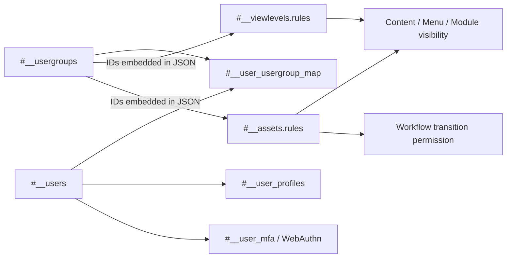

# Joomla 4 User and ACL Tables

This document explains Joomla 4.4 user accounts, user groups, view levels, ACL assets, profiles, notes, persistent authentication keys, multi-factor authentication, WebAuthn credentials, and sessions.

> **Schema baseline:** Joomla 4.4.14.

## Table of Contents

- [1. Relationship Summary](#1-relationship-summary)
- [2. `#__users`](#2-users)
- [3. User Groups](#3-user-groups)
- [4. View Levels](#4-view-levels)
- [5. ACL Assets](#5-acl-assets)
- [6. Profiles and User Notes](#6-profiles-and-user-notes)
- [7. Authentication and MFA](#7-authentication-and-mfa)
- [8. Sessions](#8-sessions)
- [9. ACL Flow](#9-acl-flow)
- [10. Migration Notes](#10-migration-notes)

## 1. Relationship Summary

```text
#__users.id       → #__user_usergroup_map.user_id
#__usergroups.id  → #__user_usergroup_map.group_id
#__usergroups IDs → #__viewlevels.rules (JSON)
#__usergroups IDs → #__assets.rules (JSON)
#__assets.id      → content/category/module/workflow asset_id
#__users.id       → #__user_profiles.user_id
#__users.id       → #__user_notes.user_id
#__users.id       → authentication/session data where applicable
```

View-level and ACL-rule relationships are embedded in JSON and therefore cannot be discovered solely from physical SQL foreign keys.

## 2. `#__users`

Stores Joomla user accounts.

Important fields include:

| Column | Meaning |
|---|---|
| `id` | User primary key |
| `name` | Display name |
| `username` | Login name |
| `email` | Email address |
| `password` | Password hash |
| `block` | Blocked account flag |
| `sendEmail` | Receive system mail flag |
| `registerDate` | Registration timestamp |
| `lastvisitDate` | Last visit timestamp |
| `activation` | Activation/reset workflow value |
| `params` | JSON user preferences |
| `lastResetTime` | Password reset throttling metadata |
| `resetCount` | Reset count metadata |
| `requireReset` | Force password reset flag |

Security rules:

- Never log or commit password hashes, reset tokens, or authentication secrets.
- Treat `activation` and password-reset state as sensitive and temporary.
- Preserve user identity only after checking duplicate usernames/emails on the target.
- Test migrated password hashes in staging rather than assuming compatibility.

## 3. User Groups

### `#__usergroups`

Stores the hierarchical ACL group tree.

Important columns:

```text
id
parent_id
lft
rgt
title
```

Typical built-in names include Public, Guest, Registered, Author, Editor, Publisher, Manager, Administrator and Super Users. Their numeric IDs must not be assumed to match another installation.

### `#__user_usergroup_map`

Many-to-many bridge between users and groups.

| Column | Meaning |
|---|---|
| `user_id` | User ID |
| `group_id` | Group ID |

A user can belong to multiple groups. Joomla combines inherited permissions from all memberships.

## 4. View Levels

### `#__viewlevels`

Defines which user groups are allowed to **view** records assigned to an access level.

| Column | Meaning |
|---|---|
| `id` | View level ID |
| `title` | Display title |
| `ordering` | Ordering |
| `rules` | JSON array of user-group IDs |

Example shape:

```json
[2, 8]
```

This is not an edit permission. It only participates in visibility/access filtering.

When group IDs change, the IDs embedded in `rules` must be remapped.

## 5. ACL Assets

### `#__assets`

Stores hierarchical ACL objects and action rules.

| Column | Meaning |
|---|---|
| `id` | Asset ID |
| `parent_id` | Parent asset |
| `lft`, `rgt`, `level` | Nested-set hierarchy |
| `name` | Unique asset name |
| `title` | Human-readable title |
| `rules` | JSON action rules keyed by user-group ID |

Examples of asset identities:

```text
root.1
com_content
com_content.category.10
com_content.article.25
com_content.workflow.1
com_content.stage.1
com_content.transition.2
com_modules.module.45
```

Joomla 4 workflow introduces ACL-controlled transition execution. The core Content component uses the `core.execute.transition` permission in addition to normal create/edit/edit-state actions.

### ACL Resolution

Permission resolution involves:

1. User-to-group memberships.
2. User-group inheritance.
3. Asset hierarchy.
4. Parent action rules.
5. Explicit allow/deny values.
6. The action being requested, including workflow transition actions.

A migration that copies content but not equivalent ACL structure can produce data that exists but cannot be edited or published correctly.

## 6. Profiles and User Notes

### `#__user_profiles`

Extensible key/value profile storage.

| Column | Meaning |
|---|---|
| `user_id` | Owner user ID |
| `profile_key` | Namespaced key |
| `profile_value` | Stored value, sometimes JSON-encoded |
| `ordering` | Ordering |

### `#__user_notes`

Stores administrator notes about users. Common fields include:

```text
id
user_id
catid
subject
body
state
checked_out
checked_out_time
created_user_id
created_time
modified_user_id
modified_time
review_time
publish_up
publish_down
```

User-note categories use the shared `#__categories` system with the relevant extension context.

## 7. Authentication and MFA

### `#__user_keys`

Stores persistent authentication/remember-me key state.

These records are runtime authentication material and should normally **not** be migrated to another Joomla installation.

### `#__user_mfa`

Joomla 4 core schema stores multi-factor authentication method records separately from the basic `#__users` row.

The table contains per-user MFA configuration and method-specific state. Exact method payloads are security-sensitive and plugin/version-dependent.

Migration rule: do not bulk-copy MFA secrets to a new installation unless there is a specific, tested security migration design.

### `#__webauthn_credentials`

Stores WebAuthn credential registrations.

Important fields include:

| Column | Meaning |
|---|---|
| `id` | Credential ID |
| `user_id` | User handle |
| `label` | Human-readable credential label |
| `credential` | JSON credential source data |

WebAuthn credential material is security-sensitive and tied to authentication implementation details. Re-enrollment on the target is generally safer than blind copying.

### Authentication Data Classification

| Data | Typical migration treatment |
|---|---|
| User identity/profile | Migrate with ID mapping |
| Password hash | Can be migrated only after compatibility testing |
| Group memberships | Migrate with group-ID mapping |
| Reset/activation state | Usually clear/recreate |
| `#__user_keys` | Do not migrate |
| `#__user_mfa` | Reconfigure/re-enroll unless explicitly supported |
| `#__webauthn_credentials` | Re-enroll unless explicitly supported |

## 8. Sessions

### `#__session`

Stores active site/administrator session state when database-backed session storage is used.

Typical fields include session ID, client ID, guest/login state, timestamps, serialized/data payload and user identity fields depending on the exact schema.

Session rows are runtime data. **Do not migrate them.** Users should establish new sessions on the target system.

## 9. ACL Flow



Use this distinction:

```text
#__viewlevels → Who can see the object?
#__assets     → Who can perform actions on the object?
```

## 10. Migration Notes

- Do not assume user, group, view-level or asset IDs match between installations.
- Build explicit ID maps for users, groups, view levels and ACL assets.
- Rebuild the user-group and asset nested-set trees.
- Remap group IDs inside `#__viewlevels.rules` and `#__assets.rules`.
- Include workflow/stage/transition assets in ACL validation.
- Check duplicate usernames/emails before inserting users.
- Validate password hashes with real login tests in staging.
- Clear active activation/reset state unless the migration explicitly requires it.
- Do not migrate sessions or persistent authentication keys.
- Re-enroll MFA/WebAuthn by default instead of blindly copying security secrets.
- Test frontend visibility separately from create/edit/delete/publish/transition permissions.
- Confirm at least one verified Super User account before cutover.

[Database Overview](./database-overview.md) · [Content Tables](./content-tables.md) · [Complete ERD](./complete-erd.md)