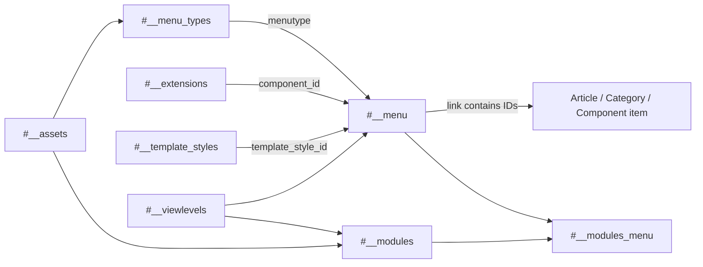

# Joomla 5 Menu and Module Tables

This document explains Joomla 5.4 navigation, menu containers, menu items, modules, module assignments, template styles, template override metadata, and routing-sensitive database values.

> **Schema baseline:** Joomla 5.4.7.

## Table of Contents

- [1. Relationship Summary](#1-relationship-summary)
- [2. `#__menu_types`](#2-menu_types)
- [3. `#__menu`](#3-menu)
- [4. `#__modules`](#4-modules)
- [5. `#__modules_menu`](#5-modules_menu)
- [6. `#__template_styles`](#6-template_styles)
- [7. `#__template_overrides`](#7-template_overrides)
- [8. Routing and Assignment Flow](#8-routing-and-assignment-flow)
- [9. Migration Notes](#9-migration-notes)

## 1. Relationship Summary

```text
#__assets.id                → #__menu_types.asset_id
#__menu_types.menutype      → #__menu.menutype
#__menu.id                  → #__menu.parent_id
#__extensions.extension_id → #__menu.component_id
#__template_styles.id       → #__menu.template_style_id
#__modules.id               → #__modules_menu.moduleid
#__menu.id                  → #__modules_menu.menuid
#__assets.id                → #__modules.asset_id
#__viewlevels.id            → #__menu.access / #__modules.access
```

## 2. `#__menu_types`

Joomla 5.4 stores more than the menu machine name/title in a menu-type row.

| Column | Meaning |
|---|---|
| `id` | Menu type primary key |
| `asset_id` | ACL asset ID |
| `menutype` | Unique machine name used by `#__menu` |
| `title` | Administrator title |
| `description` | Administrator description |
| `client_id` | Site/administrator client |
| `ordering` | Menu container ordering |

This makes menu-container migration dependent on both identity and ACL/configuration. The stable logical link to menu items remains `menutype`.

Do not assume `#__menu_types.id` can be used to remap `#__menu`; menu items store the string `menutype`.

## 3. `#__menu`

Stores site and administrator menu items.

Important fields:

| Column | Meaning |
|---|---|
| `id` | Menu item ID |
| `menutype` | Parent menu container machine name |
| `title`, `alias`, `note`, `path` | Identity/tree metadata |
| `link` | Component/internal/external target |
| `type` | Component, URL, alias, separator, heading, etc. |
| `published` | Publication state |
| `parent_id` | Parent menu item |
| `level`, `lft`, `rgt` | Nested-set tree values |
| `component_id` | Component extension ID |
| `checked_out`, `checked_out_time` | Editing lock |
| `browserNav` | Browser target behavior |
| `access` | View level |
| `img` | Icon/image value |
| `template_style_id` | Per-item style override |
| `params` | JSON item/view settings |
| `home` | Default/home flag |
| `language` | Language or `*` |
| `client_id` | Site/administrator client |
| `publish_up`, `publish_down` | Menu publication window |

Example links:

```text
index.php?option=com_content&view=article&id=25
index.php?option=com_content&view=category&layout=blog&id=8
```

IDs inside `link` and `params` are embedded relationships and must be remapped if business IDs change.

### Tree Integrity

Validate together:

```text
parent_id
lft
rgt
level
path
```

A menu can have correct rows but invalid nested-set boundaries after a manual migration.

## 4. `#__modules`

Stores configured module instances, including administrator dashboard modules.

| Column | Meaning |
|---|---|
| `id` | Module instance ID |
| `asset_id` | ACL asset ID |
| `title`, `note` | Administrator metadata |
| `content` | Module content, notably for custom modules |
| `ordering` | Order in position |
| `position` | Template position |
| `checked_out`, `checked_out_time` | Editing lock |
| `publish_up`, `publish_down` | Publication window |
| `published` | State |
| `module` | Module type/element |
| `access` | View level |
| `showtitle` | Show title flag |
| `params` | JSON module configuration |
| `client_id` | Site/administrator client |
| `language` | Language or `*` |

Keep this distinction:

```text
#__extensions.element → installed module code
#__modules.module      → configured instance
```

A single installed module extension can have many module instances.

## 5. `#__modules_menu`

Controls module-to-menu assignment.

| Column | Meaning |
|---|---|
| `moduleid` | Module instance ID |
| `menuid` | Assignment value |

Assignment semantics:

| Value | Meaning |
|---:|---|
| `0` | All pages |
| Positive menu ID | Include item |
| Negative menu ID | Exclude item in an exclusion assignment pattern |

When menu IDs are remapped, preserve the sign:

```text
source -123 → target menu 456 → target assignment -456
```

## 6. `#__template_styles`

Stores configurable template style instances. Important fields include `id`, template element, client ID, default/home marker, title and JSON `params`.

The target installation must contain the compatible template before style IDs can be mapped.

`#__menu.template_style_id` is installation-specific and should be rebuilt from the target style map.

## 7. `#__template_overrides`

Stores template override metadata/state used by Joomla's template override system.

Do not migrate this table independently from the filesystem. Real override behavior depends on:

```text
#__template_overrides metadata
+ template HTML override files
+ target template structure
+ Joomla 5/6 layout compatibility
```

Core target override state should not be overwritten by old metadata without checking the related files.

## 8. Routing and Assignment Flow



The active menu item influences component routing, page configuration, template style, access, language and module rendering context.

## 9. Migration Notes

- Map/create menu types before menu items.
- Map/rebuild menu-type ACL assets where needed.
- Preserve `client_id` and ordering for menu containers.
- Rebuild/validate the menu nested-set tree.
- Map `component_id` by extension identity, never by raw source ID.
- Rewrite IDs inside `link` and relevant JSON parameters.
- Preserve `publish_up`/`publish_down` if menu scheduling matters.
- Install compatible module code before module instances.
- Treat administrator and frontend modules separately.
- Map source template positions to target template positions.
- Install the target template before mapping template styles.
- Import modules before module-menu assignments.
- Preserve the sign of negative menu assignments.
- Review database override metadata together with override files.
- Verify home item per language, SEF URLs, aliases, active menu state, template style selection and module visibility.

[Database Overview](./database-overview.md) · [Extension and System Tables](./extension-system-tables.md) · [Complete ERD](./complete-erd.md)