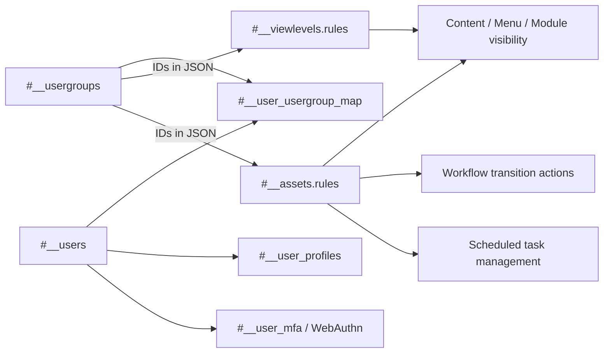

# Joomla 5 User and ACL Tables

This document explains Joomla 5.4 users, groups, view levels, ACL assets, profiles, user notes, persistent authentication keys, multi-factor authentication, WebAuthn credentials, and sessions.

> **Schema baseline:** Joomla 5.4.7.

## Table of Contents

- [1. Relationship Summary](#1-relationship-summary)
- [2. `#__users`](#2-users)
- [3. User Groups](#3-user-groups)
- [4. View Levels](#4-view-levels)
- [5. ACL Assets](#5-acl-assets)
- [6. Profiles and Notes](#6-profiles-and-notes)
- [7. Authentication, MFA and WebAuthn](#7-authentication-mfa-and-webauthn)
- [8. Sessions](#8-sessions)
- [9. ACL Flow](#9-acl-flow)
- [10. Migration Notes](#10-migration-notes)

## 1. Relationship Summary

```text
#__users.id       → #__user_usergroup_map.user_id
#__usergroups.id  → #__user_usergroup_map.group_id
#__usergroups IDs → #__viewlevels.rules (JSON)
#__usergroups IDs → #__assets.rules (JSON)
#__assets.id      → content/category/menu/module/workflow/scheduler asset IDs
#__users.id       → #__user_profiles.user_id
#__users.id       → #__user_notes.user_id
#__users identity → MFA/WebAuthn/session data where applicable
```

ACL in Joomla is an application-level graph. Group IDs are also embedded inside JSON rule documents, so a table-only FK scan will miss important dependencies.

## 2. `#__users`

Stores Joomla user accounts.

Important fields include:

| Column | Meaning |
|---|---|
| `id` | User primary key |
| `name` | Display name |
| `username` | Login name |
| `email` | Email |
| `password` | Password hash |
| `block` | Blocked flag |
| `sendEmail` | System email preference |
| `registerDate` | Registration time |
| `lastvisitDate` | Last visit |
| `activation` | Activation/reset workflow value |
| `params` | JSON user preferences |
| `lastResetTime`, `resetCount` | Password reset throttling metadata |
| `requireReset` | Force password reset flag |

Exact column types/lengths are version-sensitive. For migration logic, the important point is that user identity, login state, profile data, groups and security credentials are separate concerns.

Security requirements:

- Never expose or commit password hashes or reset/authentication secrets.
- Check duplicate usernames and emails on the target.
- Validate password hash compatibility with real staging logins.
- Do not treat active activation/reset state as durable business data by default.

## 3. User Groups

### `#__usergroups`

Hierarchical ACL groups using nested-set fields such as:

```text
id
parent_id
lft
rgt
title
```

Core group names may be similar between installations, but numeric IDs must not be assumed identical.

### `#__user_usergroup_map`

Many-to-many membership table:

| Column | Meaning |
|---|---|
| `user_id` | User ID |
| `group_id` | Group ID |

A user can belong to several groups and receives inherited permission effects from the complete membership graph.

## 4. View Levels

### `#__viewlevels`

Defines visibility groups.

| Column | Meaning |
|---|---|
| `id` | View level ID |
| `title` | Display title |
| `ordering` | Ordering |
| `rules` | JSON array of permitted user-group IDs |

Example:

```json
[2, 8]
```

View levels answer **who can see an object**. They do not directly grant create/edit/delete/publish permissions.

## 5. ACL Assets

### `#__assets`

Stores hierarchical ACL objects.

| Column | Meaning |
|---|---|
| `id` | Asset ID |
| `parent_id` | Parent asset |
| `lft`, `rgt`, `level` | Nested-set tree data |
| `name` | Unique asset identity |
| `title` | Human-readable title |
| `rules` | JSON action rules keyed by group ID |

Examples can include:

```text
root.1
com_content
com_content.category.10
com_content.article.25
com_content.workflow.1
com_content.stage.1
com_content.transition.2
com_modules.module.45
com_scheduler.task.1
```

The target Joomla 5 asset tree should be considered authoritative for target core components. Business record migrations should map or regenerate assets instead of copying arbitrary source asset IDs.

### Workflow and Scheduler Permissions

Joomla 5 continues workflow ACL actions such as `core.execute.transition`. Scheduled tasks also have ACL assets in the core asset hierarchy.

Validation must cover both normal CRUD permissions and special workflow/task management behavior.

## 6. Profiles and Notes

### `#__user_profiles`

Simple extensible profile key/value storage:

```text
user_id
profile_key
profile_value
ordering
```

### `#__user_notes`

Administrator notes about users. Fields include user/category IDs, subject/body, state, edit locks, creator/modifier metadata, review and publication dates.

User note categories use shared `#__categories` rows under the relevant users component context.

## 7. Authentication, MFA and WebAuthn

### `#__user_keys`

Persistent remember-me/authentication key material. This is runtime security data and normally should not move between installations.

### `#__user_mfa`

Stores per-user multi-factor authentication method records and method configuration/state.

MFA payloads are sensitive and method/plugin/version dependent. Default migration strategy: require re-enrollment unless an explicitly supported security migration path has been tested.

### `#__webauthn_credentials`

Stores registered WebAuthn credentials.

Important fields include:

| Column | Meaning |
|---|---|
| `id` | Credential ID |
| `user_id` | User handle |
| `label` | User-visible label |
| `credential` | JSON credential source data |

WebAuthn credentials should not be copied merely because the user account ID was migrated. Authentication behavior and credential validation must be tested end to end.

### Security Data Classification

| Data | Default treatment |
|---|---|
| User identity | Migrate with ID map |
| User profiles | Migrate selectively |
| Password hashes | Migrate only after compatibility testing |
| Group memberships | Migrate with group mapping |
| View-level/asset rules | Remap embedded group IDs |
| Activation/reset state | Usually clear/recreate |
| `#__user_keys` | Do not migrate |
| MFA/WebAuthn secrets | Re-enroll unless explicitly supported |
| Sessions | Do not migrate |

## 8. Sessions

### `#__session`

Stores active request/login sessions when the database session handler is in use. Session identifiers and payloads are ephemeral runtime data.

Do not migrate source sessions into Joomla 6. Force new authenticated sessions after cutover.

## 9. ACL Flow



Use this model:

```text
#__viewlevels → visibility
#__assets     → actions/permissions
```

## 10. Migration Notes

- Build explicit maps for users, groups, view levels and assets.
- Do not assume built-in group IDs match the target.
- Rebuild/validate `#__usergroups` and `#__assets` nested-set trees.
- Remap group IDs embedded inside view-level and ACL JSON rules.
- Include article/category/module/menu/workflow/stage/transition/scheduler asset dependencies.
- Check duplicate usernames/emails before insertion.
- Test password hashes with staging authentication.
- Clear/recreate temporary reset/activation state unless a requirement says otherwise.
- Do not migrate sessions or persistent authentication keys.
- Re-enroll MFA/WebAuthn by default.
- Test frontend visibility separately from backend create/edit/delete/state/transition permissions.
- Test scheduler administration permissions separately from scheduler runtime execution.
- Verify at least one working Super User before final cutover.

[Database Overview](./database-overview.md) · [Content Tables](./content-tables.md) · [Complete ERD](./complete-erd.md)