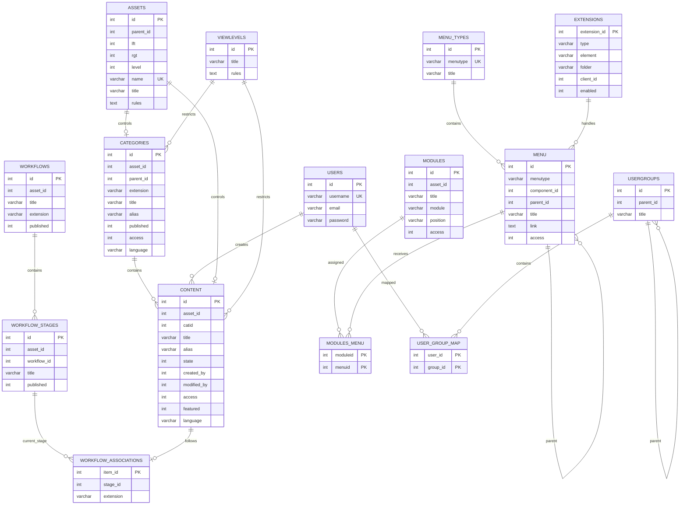
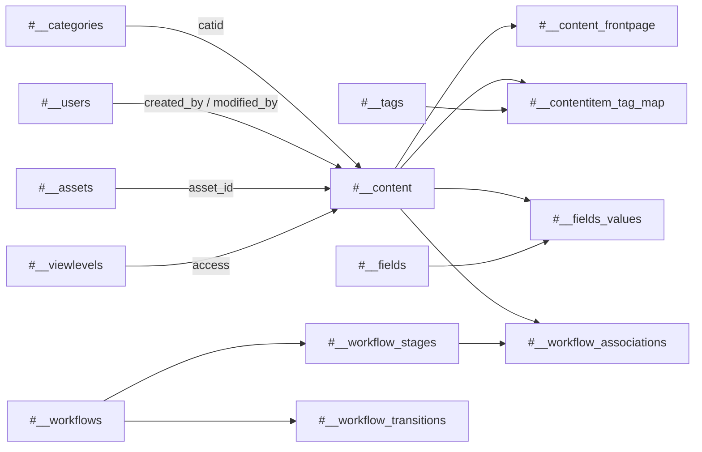
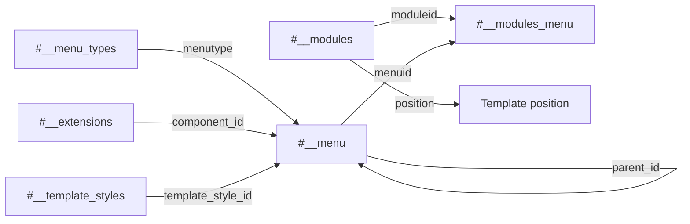
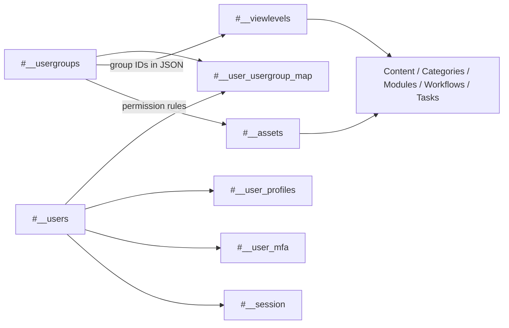
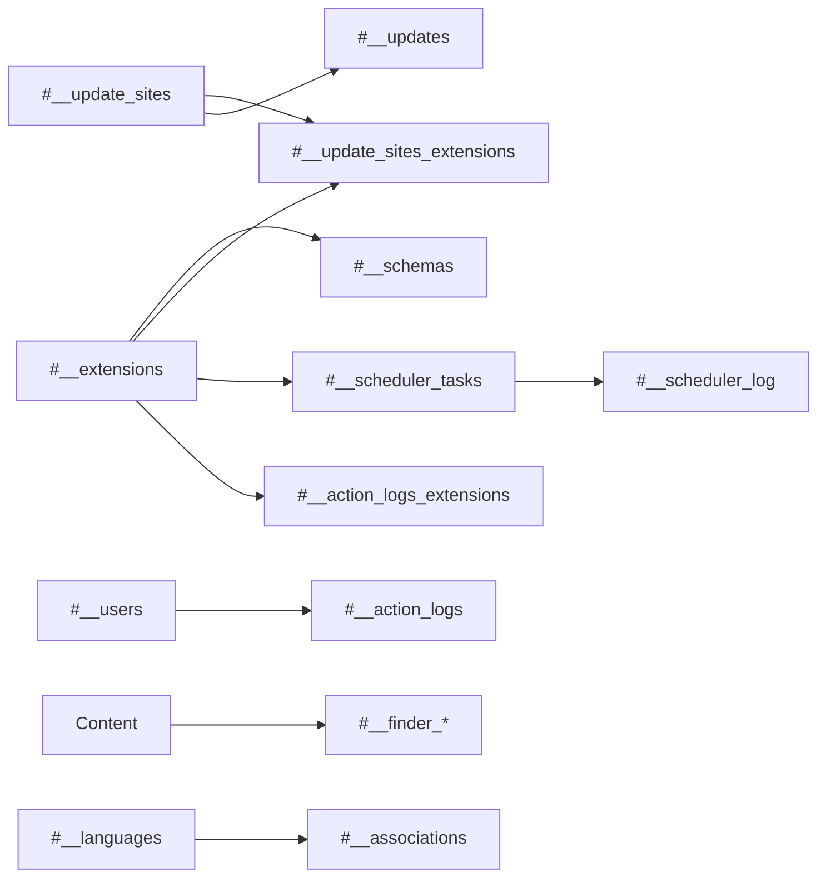
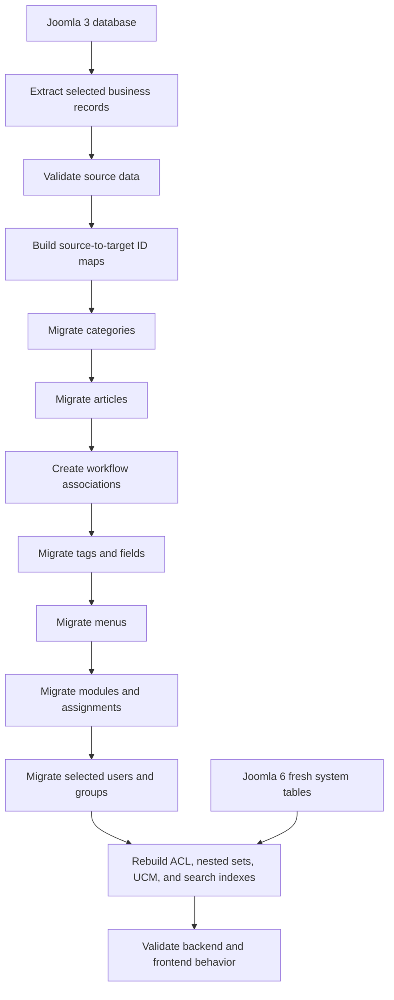

# Joomla 6 Complete Database ERD

These diagrams show logical relationships used by Joomla application code. Not every relationship is implemented as a physical MySQL foreign key.

## Table of Contents

- [1. Core ERD](#1-core-erd)
- [2. Content and Workflow](#2-content-and-workflow)
- [3. Menu and Module](#3-menu-and-module)
- [4. User and ACL](#4-user-and-acl)
- [5. Extension and System](#5-extension-and-system)
- [6. Joomla 3 to Joomla 6 Migration Flow](#6-joomla-3-to-joomla-6-migration-flow)

## 1. Core ERD

## 2. Content and Workflow

## 3. Menu and Module

## 4. User and ACL

## 5. Extension and System

## 6. Joomla 3 to Joomla 6 Migration Flow

## Key Rules

1. Treat the target Joomla 6 schema as authoritative.
2. Map IDs; do not assume equality between installations.
3. Preserve or rebuild nested-set trees.
4. Create valid workflow associations for migrated articles.
5. Install extension code before extension-owned data.
6. Do not copy sessions, search indexes, update cache, scheduler logs, action logs, or MFA secrets blindly.

[Back to Database Overview](./database-overview.md)
