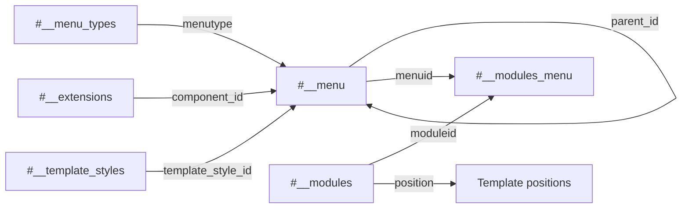

# Joomla 6 Menu and Module Tables

## Table of Contents

- [1. Overview](#1-overview)
- [2. `#__menu_types`](#2-menu_types)
- [3. `#__menu`](#3-menu)
- [4. `#__modules`](#4-modules)
- [5. `#__modules_menu`](#5-modules_menu)
- [6. `#__template_styles`](#6-template_styles)
- [7. Relationship Flow](#7-relationship-flow)
- [8. Migration Notes](#8-migration-notes)

## 1. Overview

```text
Menu type → Menu item → Component/content target
                       ↕
                 Module assignment
                       ↓
                 Template position
```

## 2. `#__menu_types`

Defines menu containers such as Main Menu or Footer Menu.

| Column | Meaning |
|---|---|
| `id` | Primary key |
| `menutype` | Unique machine name |
| `title` | Administrator display title |
| `description` | Optional description |
| `client_id` | Site or administrator client |

`menutype` is referenced logically by `#__menu.menutype`.

## 3. `#__menu`

Stores frontend and administrator menu items.

| Column | Meaning |
|---|---|
| `id` | Menu item ID |
| `menutype` | Parent menu container |
| `title`, `alias` | Display title and URL alias |
| `note` | Administrator note |
| `path` | Hierarchical alias path |
| `link` | Internal or external destination |
| `type` | `component`, `url`, `alias`, `separator`, or heading type |
| `published` | Publication state |
| `parent_id` | Parent menu item |
| `level`, `lft`, `rgt` | Nested-set tree values |
| `component_id` | Extension ID from `#__extensions` |
| `checked_out`, `checked_out_time` | Edit lock |
| `browserNav` | Open behavior, such as same or new window |
| `access` | View-level ID |
| `img` | Optional menu image |
| `template_style_id` | Optional template-style override |
| `params` | JSON menu options |
| `home` | Home/default-page flag |
| `language` | Language code or `*` |
| `client_id` | Site or administrator |

Examples:

```text
index.php?option=com_content&view=article&id=25
index.php?option=com_content&view=category&layout=blog&id=8
```

The IDs inside `link` are application data and must be rewritten when target IDs differ.

## 4. `#__modules`

Stores module instances, not module code.

| Column | Meaning |
|---|---|
| `id` | Module instance ID |
| `asset_id` | ACL asset |
| `title` | Module title |
| `note` | Administrator note |
| `content` | Content for modules such as `mod_custom` |
| `ordering` | Ordering in a position |
| `position` | Template position |
| `checked_out`, `checked_out_time` | Edit lock |
| `publish_up`, `publish_down` | Publication window |
| `published` | Enabled state |
| `module` | Module type, such as `mod_menu` |
| `access` | View-level ID |
| `showtitle` | Whether to display the title |
| `params` | JSON module configuration |
| `client_id` | `0` site, `1` administrator |
| `language` | Language code |

A row is valid only when the corresponding module extension/code is installed.

## 5. `#__modules_menu`

Bridge table between modules and menu items.

| Column | Meaning |
|---|---|
| `moduleid` | Module instance ID |
| `menuid` | Assignment value |

Common assignment values:

| Value | Meaning |
|---:|---|
| `0` | Display on all pages |
| Positive ID | Display on the selected menu item |
| Negative ID | Exclude the selected menu item |

Both module and menu IDs must be mapped during migration.

## 6. `#__template_styles`

Stores template style instances and parameters.

| Column | Meaning |
|---|---|
| `id` | Style ID |
| `template` | Template element name |
| `client_id` | Site or administrator |
| `home` | Default style flag; multilingual values may be used |
| `title` | Style title |
| `params` | JSON style configuration |

A menu item's `template_style_id` must reference an existing Joomla 6 style. Joomla 3 template styles should not be copied unless the template has been migrated and the parameters are compatible.

## 7. Relationship Flow



## 8. Migration Notes

- Create menu types before menu items.
- Preserve parent-child ordering or rebuild the menu tree.
- Map `component_id` using the target `#__extensions` table.
- Rewrite article/category IDs inside `link` and JSON `params`.
- Install compatible module and template code before migrating instances.
- Map `template_style_id`; do not assume style IDs match.
- Migrate modules before `#__modules_menu`.
- Test home page selection, aliases, routes, module visibility, language, header, and footer.

[Back to Database Overview](./database-overview.md)
