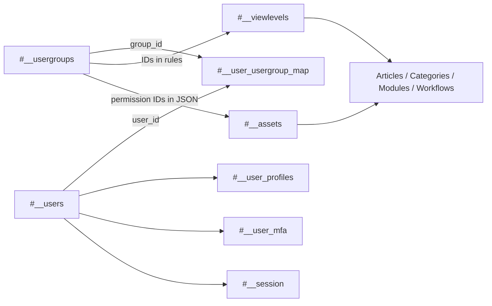

# Joomla 6 User and ACL Tables

## Table of Contents

- [1. Access Model](#1-access-model)
- [2. `#__users`](#2-users)
- [3. Groups and Membership](#3-groups-and-membership)
- [4. `#__viewlevels`](#4-viewlevels)
- [5. `#__assets`](#5-assets)
- [6. Profiles, Notes, Tokens, MFA, and Sessions](#6-profiles-notes-tokens-mfa-and-sessions)
- [7. Relationship Flow](#7-relationship-flow)
- [8. Migration Notes](#8-migration-notes)

## 1. Access Model

Joomla separates two questions:

```text
View level: Who may see this object?
ACL asset:  Who may create, edit, delete, configure, publish, or execute it?
```

## 2. `#__users`

Stores user accounts.

| Column | Meaning |
|---|---|
| `id` | User primary key |
| `name` | Display name |
| `username` | Login name |
| `email` | Email address |
| `password` | Password hash |
| `block` | Disabled/blocked flag |
| `sendEmail` | Receive system email flag |
| `registerDate` | Registration date |
| `lastvisitDate` | Last login date |
| `activation` | Activation/reset token data |
| `params` | JSON user preferences |
| `lastResetTime`, `resetCount` | Password-reset controls |
| `requireReset` | Force password reset flag |

Do not modify password hashes unless the authentication strategy is understood and tested.

## 3. Groups and Membership

### `#__usergroups`

Hierarchical user groups.

| Column | Meaning |
|---|---|
| `id` | Group ID |
| `parent_id` | Parent group |
| `lft`, `rgt` | Nested-set boundaries |
| `title` | Group title |

### `#__user_usergroup_map`

Many-to-many mapping between users and groups.

| Column | Meaning |
|---|---|
| `user_id` | User ID |
| `group_id` | Group ID |

Never assume Joomla 3 and Joomla 6 group IDs are identical.

## 4. `#__viewlevels`

Defines which groups may view an object.

| Column | Meaning |
|---|---|
| `id` | View-level ID |
| `title` | Display title |
| `ordering` | Display order |
| `rules` | JSON array of allowed group IDs |

Example concept:

```json
[1, 8]
```

When group IDs change, the values inside `rules` must be remapped.

## 5. `#__assets`

Stores ACL permissions in a nested-set tree.

| Column | Meaning |
|---|---|
| `id` | Asset ID |
| `parent_id` | Parent asset |
| `lft`, `rgt`, `level` | Tree structure |
| `name` | Unique logical identifier |
| `title` | Display title |
| `rules` | JSON-encoded permission rules |

Common asset names:

```text
root.1
com_content
com_content.category.12
com_content.article.45
com_content.workflow.1
com_content.stage.1
com_modules.module.120
com_scheduler.task.1
```

Typical rule names:

```text
core.admin
core.manage
core.create
core.edit
core.edit.own
core.edit.state
core.delete
core.execute.transition
core.login.site
core.login.admin
core.login.api
```

Asset IDs are installation-specific. Prefer creating content through Joomla APIs or rebuilding valid target assets rather than copying Joomla 3 assets.

## 6. Profiles, Notes, Tokens, MFA, and Sessions

| Table | Purpose | Migration guidance |
|---|---|---|
| `#__user_profiles` | Extra profile key/value data | Migrate selected profiles and remap user IDs |
| `#__user_notes` | Administrator notes about users | Optional; map category, asset, and user IDs |
| `#__user_keys` | Remember-me/authentication keys | Do not migrate |
| `#__user_mfa` | Multi-factor authentication methods | Re-enrol users instead of copying blindly |
| `#__session` | Active sessions | Never migrate |

`#__user_profiles` commonly uses:

```text
user_id, profile_key, profile_value, ordering
```

MFA records and authentication secrets are security-sensitive and may depend on Joomla 6 plugin formats.

## 7. Relationship Flow



## 8. Migration Notes

- Decide whether existing user IDs must be preserved.
- Map groups before user-group assignments.
- Remap group IDs inside `#__viewlevels.rules`.
- Validate password compatibility with active authentication plugins.
- Do not copy sessions, remember-me tokens, or MFA secrets blindly.
- Rebuild or validate ACL assets after content, categories, modules, and workflows exist.
- Test frontend login, administrator login, API login, editing, publishing, and ownership permissions.

[Back to Database Overview](./database-overview.md)
