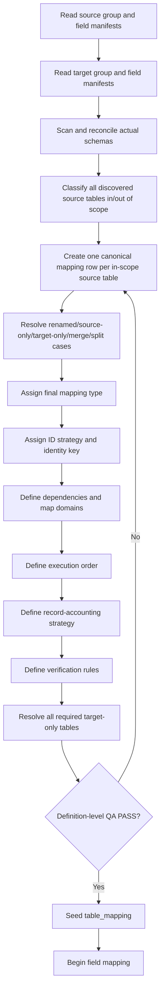

# {{SCOPE_NAME}} Table Mapping — {{SOURCE_SYSTEM}} {{SOURCE_VERSION}} → {{TARGET_SYSTEM}} {{TARGET_VERSION}}

## Template Role

> **Every in-scope source table must appear exactly once and resolve to exactly one final table-level migration decision.**
>
> **Every required target table must also have an explicit resolution strategy.**

Use this template to generate a project-specific `table-mapping-migration.md` for any database migration scope, including:

- CMS/core migrations;
- third-party extension migrations;
- custom component/module migrations;
- application database upgrades;
- version-to-version schema migrations;
- platform-to-platform migrations.

This template is intentionally database-agnostic. Do **not** hard-code Joomla-specific groups, table counts, or identifiers unless they actually apply to the migration being generated.

Typical generated file:

```text
{{scope}}-table-mapping-migration.md
```

Companion templates in this folder:

- [`database-migration-groups-template.md`](./database-migration-groups-template.md)
- [`database-migration-field-inventory-template.md`](./database-migration-field-inventory-template.md)
- [`database-migration-field-mapping-template.md`](./database-migration-field-mapping-template.md)
- [`database-migration-contract-template.md`](./database-migration-contract-template.md)

---

# 1. Purpose

This document materializes the **table-level migration contract** into seed-ready mapping rows.

It answers, for every source table:

```text
Where does this table go?
What final migration decision applies?
How is row/entity identity handled?
What must exist first?
What ID/value mappings does it produce or consume?
How is it accounted for?
How is it verified?
```

The objective is **100% table accounting**, not blind row-for-row copying.

Valid outcomes such as `REBUILD`, `REFERENCE_ONLY`, `ARCHIVE`, `IGNORE`, `TARGET_OWNED`, and `RECREATE` are explicit migration decisions and are not silent data loss when their accounting and verification rules pass.

---

# 2. Source of Truth

Do not build this mapping from memory or table-name similarity alone.

Required source artifacts:

| Artifact | Path / Source | Required | Verified |
|---|---|---|---|
| Source group/table inventory | `{{SOURCE_GROUP_MANIFEST}}` | YES | `YES/NO` |
| Source field/schema inventory | `{{SOURCE_FIELD_MANIFEST}}` | YES | `YES/NO` |
| Target group/table inventory | `{{TARGET_GROUP_MANIFEST}}` | YES | `YES/NO` |
| Target field/schema inventory | `{{TARGET_FIELD_MANIFEST}}` | YES | `YES/NO` |
| Migration contract / decision rules | `{{MIGRATION_CONTRACT}}` | YES | `YES/NO` |
| Actual source DB reconciliation | `{{SOURCE_PRODUCTION_SCAN}}` | Production | `YES/NO` |
| Actual target DB reconciliation | `{{TARGET_PRODUCTION_SCAN}}` | Production | `YES/NO` |

### Rule

Vendor/official schema manifests define the baseline, but **production mapping coverage must be calculated from the actual production inventory** after ownership and scope classification.

---

# 3. Baseline Summary

| Item | Source | Target |
|---|---|---|
| System | `{{SOURCE_SYSTEM}}` | `{{TARGET_SYSTEM}}` |
| Version | `{{SOURCE_VERSION}}` | `{{TARGET_VERSION}}` |
| Database / schema | `{{SOURCE_DATABASE}}` | `{{TARGET_DATABASE}}` |
| Database engine | `{{SOURCE_ENGINE}}` | `{{TARGET_ENGINE}}` |
| Baseline physical tables | `{{SOURCE_TABLE_COUNT}}` | `{{TARGET_TABLE_COUNT}}` |
| Baseline physical fields | `{{SOURCE_FIELD_COUNT}}` | `{{TARGET_FIELD_COUNT}}` |
| Actual production tables | `{{ACTUAL_SOURCE_TABLE_COUNT}}` | `{{ACTUAL_TARGET_TABLE_COUNT}}` |
| In-scope tables | `{{SOURCE_IN_SCOPE_COUNT}}` | `{{TARGET_REQUIRED_COUNT}}` |

Definition-level baseline gate:

```text
Source baseline tables              = {{SOURCE_TABLE_COUNT}}
Source mapping rows                 = {{SOURCE_TABLE_COUNT_OR_SCOPE_COUNT}}
Unique source mapping keys          = {{SOURCE_TABLE_COUNT_OR_SCOPE_COUNT}}
Missing baseline mappings           = 0
Duplicate mappings                  = 0
Wildcard-only mappings              = 0
Ambiguous final decisions           = 0
Definition-level table coverage     = 100%
```

Production gate must replace baseline counts with actual in-scope inventory counts.

---

# 4. Scope Classification Gate

Every discovered source table must first receive one scope classification:

```text
IN_SCOPE
OUT_OF_SCOPE_WITH_REASON
```

Never silently exclude a table because it is:

- third-party;
- custom;
- obsolete;
- runtime;
- generated;
- historical;
- system-owned;
- security-sensitive;
- empty;
- difficult to map.

For every `OUT_OF_SCOPE_WITH_REASON` table, record:

```text
owner
reason
business-data check
dependency check
retention/archive requirement
approval/evidence
```

Hard gate:

```text
actual_source_tables
= in_scope_tables
+ out_of_scope_with_reason_tables

unaccounted_discovered_tables = 0
```

---

# 5. Canonical Final Mapping Decisions

Allowed final `Mapping Type` values:

```text
DIRECT
TRANSFORM
LOOKUP
REBUILD
GENERATED
RECREATE
REFERENCE_ONLY
TARGET_OWNED
ARCHIVE
IGNORE
```

Meaning:

| Mapping Type | Meaning |
|---|---|
| `DIRECT` | Same logical table/entity and compatible structure; row identity/data can be copied under validated field rules. |
| `TRANSFORM` | Same business entity survives but target representation requires structural/semantic transformation. |
| `LOOKUP` | Source table/identity is used to resolve target-owned or pre-existing target identities. |
| `REBUILD` | Source data is accounted as input/evidence, but target structure is regenerated from migrated target state. |
| `GENERATED` | Target rows/state are generated deterministically from other migrated entities/state. |
| `RECREATE` | Configuration/state is intentionally recreated using target-version rules/code rather than copied. |
| `REFERENCE_ONLY` | Source rows are used only for semantic reconciliation with target-owned reference/system rows. |
| `TARGET_OWNED` | Target owns the active table/state; source does not overwrite it. |
| `ARCHIVE` | Source business/history data is preserved outside active target state. |
| `IGNORE` | Runtime/non-business/security/install-state data is intentionally not migrated into active target state. |

The final mapping must contain none of:

```text
UNKNOWN
PENDING
REVIEW
OPTIONAL
SELECTIVE
AMBIGUOUS
UNMAPPED
A / B
```

If a decision is not final, the mapping gate fails.

---

# 6. ID / Identity Strategies

Every source mapping row must choose exactly one identity strategy:

```text
PRESERVE
ID_MAP
SEMANTIC_LOOKUP
GENERATED
NONE
```

| Strategy | Meaning |
|---|---|
| `PRESERVE` | Source identity may be preserved only after collision/constraint checks prove it safe. |
| `ID_MAP` | Source ID may change; persist source → target identity in `value_mapping` or equivalent mapping store. |
| `SEMANTIC_LOOKUP` | Resolve target row using a stable semantic/natural identity. |
| `GENERATED` | Target identity is generated/rebuilt and must not assume source numeric equality. |
| `NONE` | Mapping does not produce a reusable entity identity. |

### Identity rules

- Never assume numeric source ID = numeric target ID unless explicitly proven and approved.
- Natural/semantic keys must be validated for uniqueness on both sides.
- Composite identities must list every required field.
- Target-generated IDs must be available to dependent migrations before consumers execute.
- Runtime ID pairs belong in `value_mapping` (or equivalent), not in this static contract.

---

# 7. Verification Codes

Use a stable set of verification codes. Add scope-specific codes when needed.

| Code | Required result |
|---|---|
| `V_DIRECT` | Expected source rows/identities exist in target; mismatches/duplicates = 0. |
| `V_XFORM` | All source rows are accounted and transformed target rows satisfy expected semantics. |
| `V_REF` | Every required source semantic identity resolves to exactly one target identity. |
| `V_REL` | Required mapped relationships resolve; forbidden orphans = 0. |
| `V_STRUCT` | Structured/config values parse/remap/reparse successfully; unresolved embedded references = 0. |
| `V_TREE` | Parent/root/cycle/path/nested-set/tree invariants pass. |
| `V_REBUILD` | Source rows are accounted as rebuild input and regenerated target structures pass integrity checks. |
| `V_GENERATED` | Required generated target rows/state exist and satisfy deterministic rules. |
| `V_RECREATE` | Recreated target configuration/state exists and matches approved target-version semantics. |
| `V_ARCHIVE` | Archived row count = expected source row count and archive evidence is traceable. |
| `V_IGNORE` | Ignored row count = expected source row count and explicit reason is recorded. |
| `V_CONSTRAINT` | PK/unique/FK/collision checks pass. |

No mapping row may have an empty verification strategy.

---

# 8. Mapping Case Classification

Before populating the final matrix, classify each source/target relationship into one of these structural cases.

## 8.1 One source → same-name target

Do not automatically choose `DIRECT`.

Check:

```text
business semantics
schema compatibility
identity behavior
constraints
runtime ownership
field changes
dependencies
```

## 8.2 One source → renamed/restructured target

Require explicit destination and usually `TRANSFORM`.

Example shape:

```text
old_history -> history
```

## 8.3 Source-only table

Must resolve to one of:

```text
TRANSFORM to another target structure
ARCHIVE
IGNORE
REBUILD input
REFERENCE_ONLY
```

Silent deletion is prohibited.

## 8.4 Target-only table

Must resolve to one of:

```text
TARGET_OWNED
GENERATED
RECREATE
REBUILD
```

Required target tables may not remain unexplained.

## 8.5 Many source tables → one target table

Require:

```text
all contributing sources listed
merge rule
identity/collision rule
ordering/deduplication rule
accounting rule
verification rule
```

## 8.6 One source table → many target tables

Require:

```text
all target destinations listed
split/generation condition
identity propagation
transaction/retry behavior
accounting rule per target
verification per target
```

## 8.7 Many-to-many restructuring

Use an explicit staging/intermediate identity model or a dedicated sub-contract. Do not hide many-to-many restructuring inside a single vague table row.

## 8.8 Reference/system table

Prefer `REFERENCE_ONLY`, `LOOKUP`, or `TARGET_OWNED` when target version/system owns canonical rows.

## 8.9 Runtime/generated/security table

Review explicitly for:

```text
session/cache
remember-me/auth tokens
MFA/WebAuthn enrollment
locks/queues
search indexes
scheduler logs
materialized/generated indexes
installation/update metadata
computed aggregates
```

Typical decisions: `IGNORE`, `REBUILD`, `RECREATE`, `TARGET_OWNED`, `ARCHIVE`.

## 8.10 Historical/compliance table

Determine whether records must remain active, be transformed, or be archived. Retention/legal/audit requirements must be explicit.

---

# 9. Source Table Mapping Matrix

> **Exactly one source mapping row must exist for every in-scope source table.**

Repeat the following group section for every migration group defined by the source group manifest.

## {{GROUP_ID}} — {{GROUP_NAME}}

**Source tables in group:** `{{GROUP_SOURCE_TABLE_COUNT}}`

| # | Source | Target / Destination | Mapping Type | ID Strategy | Identity Key | Depends On | Produces | Consumes | Exec | Verify | Reason |
|---:|---|---|---|---|---|---|---|---|---|---|---|
| 1 | `{{SOURCE_TABLE_1}}` | `{{TARGET_TABLE_OR_DESTINATION}}` | `{{MAPPING_TYPE}}` | `{{ID_STRATEGY}}` | `{{IDENTITY_KEY}}` | `{{DEPENDENCIES_OR_NONE}}` | `{{MAP_DOMAIN_OR_NONE}}` | `{{MAP_DOMAINS_OR_NONE}}` | `{{EXEC_ORDER}}` | `{{VERIFY_CODES}}` | {{FINAL_REASON}} |
| 2 | `{{SOURCE_TABLE_2}}` | `{{TARGET_TABLE_OR_DESTINATION}}` | `{{MAPPING_TYPE}}` | `{{ID_STRATEGY}}` | `{{IDENTITY_KEY}}` | `{{DEPENDENCIES_OR_NONE}}` | `{{MAP_DOMAIN_OR_NONE}}` | `{{MAP_DOMAINS_OR_NONE}}` | `{{EXEC_ORDER}}` | `{{VERIFY_CODES}}` | {{FINAL_REASON}} |
| N | `{{SOURCE_TABLE_N}}` | `{{TARGET_TABLE_OR_DESTINATION}}` | `{{MAPPING_TYPE}}` | `{{ID_STRATEGY}}` | `{{IDENTITY_KEY}}` | `{{DEPENDENCIES_OR_NONE}}` | `{{MAP_DOMAIN_OR_NONE}}` | `{{MAP_DOMAINS_OR_NONE}}` | `{{EXEC_ORDER}}` | `{{VERIFY_CODES}}` | {{FINAL_REASON}} |

### Group QA

```text
Inventory source tables in {{GROUP_ID}} = {{GROUP_SOURCE_TABLE_COUNT}}
Mapping rows in {{GROUP_ID}}            = {{GROUP_SOURCE_TABLE_COUNT}}
Unique source tables                    = {{GROUP_SOURCE_TABLE_COUNT}}
Missing                                 = 0
Duplicate                               = 0
Unresolved decision                     = 0
```

Repeat for all groups.

---

# 10. Target-Only / Target-Generated Table Resolution

These rows are **not** counted as extra source mapping rows. They prove that required target tables without a direct source table are still resolved.

| Group | Target Table | Resolution | Depends On | Verify | Reason |
|---|---|---|---|---|---|
| `{{GROUP}}` | `{{TARGET_ONLY_TABLE_1}}` | `TARGET_OWNED / GENERATED / RECREATE / REBUILD` | `{{DEPENDENCIES}}` | `{{VERIFY}}` | {{REASON}} |
| `{{GROUP}}` | `{{TARGET_ONLY_TABLE_2}}` | `{{FINAL_RESOLUTION}}` | `{{DEPENDENCIES}}` | `{{VERIFY}}` | {{REASON}} |

Final generated document must use **one** final resolution per row, not slash alternatives.

Target anti-join gate:

```text
required_target_tables
= target_tables_reached_from_source_mapping
+ target_only_resolved_tables

unclassified_required_target_tables = 0
```

---

# 11. Source-Only / Removed Table Resolution

List source tables that do not have a normal target table and make their destination/outcome reviewable.

| Source Table | Final Decision | Destination / Evidence | Business Data? | Retention Required? | Verify | Reason |
|---|---|---|---|---|---|---|
| `{{SOURCE_ONLY_TABLE_1}}` | `ARCHIVE / IGNORE / REBUILD / TRANSFORM` | `{{DESTINATION}}` | `YES/NO` | `YES/NO` | `{{VERIFY}}` | {{REASON}} |

Final generated document must use one final decision per row.

---

# 12. Merge / Split Resolution Matrix

Use this section only when the schema relationship is not one-to-one.

| Case | Sources | Targets | Identity Rule | Collision / Split Rule | Accounting Rule | Verify |
|---|---|---|---|---|---|---|
| `MANY_TO_ONE` | `{{SOURCE_TABLES}}` | `{{TARGET_TABLE}}` | `{{IDENTITY_RULE}}` | `{{COLLISION_RULE}}` | `{{ACCOUNTING_RULE}}` | `{{VERIFY}}` |
| `ONE_TO_MANY` | `{{SOURCE_TABLE}}` | `{{TARGET_TABLES}}` | `{{IDENTITY_RULE}}` | `{{SPLIT_RULE}}` | `{{ACCOUNTING_RULE}}` | `{{VERIFY}}` |
| `MANY_TO_MANY` | `{{SOURCE_TABLES}}` | `{{TARGET_TABLES}}` | `{{STAGING_IDENTITY_MODEL}}` | `{{RULE}}` | `{{ACCOUNTING_RULE}}` | `{{VERIFY}}` |

Hard gate:

```text
merge/split cases discovered          = {{COUNT}}
merge/split cases explicitly modeled = {{COUNT}}
unresolved merge/split cases          = 0
```

---

# 13. Dependency and Mapping-Domain Contract

## 13.1 Dependency rules

Each mapping row must declare enough dependency information to derive execution order.

Check both:

- physical FK dependencies;
- logical/application dependencies not expressed as physical FKs.

Dependency states may include:

```text
HARD_PREDECESSOR
PHASED
BACKFILL_AFTER_INSERT
REBUILD_AFTER_ENTITIES
TARGET_PREREQUISITE
NONE
```

Circular dependencies must be resolved explicitly with staging, deferred constraints, phased inserts, or backfill. `unresolved_cycles = 0` is mandatory.

## 13.2 Map producers / consumers

| Mapping Domain | Producer Table / Resolution | Main Consumers | Identity Strategy | Ready Before Consumer? |
|---|---|---|---|---|
| `{{DOMAIN_1}}` | `{{PRODUCER}}` | `{{CONSUMERS}}` | `{{ID_MAP / SEMANTIC_LOOKUP / GENERATED}}` | `YES/NO` |
| `{{DOMAIN_2}}` | `{{PRODUCER}}` | `{{CONSUMERS}}` | `{{STRATEGY}}` | `YES/NO` |

Hard gate:

```text
required mapping domains defined = 100%
map producers identified         = 100%
map consumers identified         = 100%
unresolved mapping domains       = 0
```

---

# 14. Execution Order

Do not copy group IDs from another migration unless their semantics are valid for this scope.

Recommended generic order:

```text
reference / target prerequisites
        ↓
identity / access / parent entities
        ↓
shared definitions / taxonomy
        ↓
primary business entities
        ↓
relationship tables
        ↓
presentation / configuration
        ↓
supporting business features
        ↓
generated / runtime / archive handling
        ↓
final rebuild / reconciliation / backfill
```

Project-specific execution plan:

| Exec | Group / Table | Prerequisites | Produces | Backfill/Rebuild After |
|---|---|---|---|---|
| `{{EXEC_1}}` | `{{TABLE_OR_GROUP}}` | `{{DEPENDENCIES}}` | `{{MAPS}}` | `{{POST_STEP}}` |
| `{{EXEC_2}}` | `{{TABLE_OR_GROUP}}` | `{{DEPENDENCIES}}` | `{{MAPS}}` | `{{POST_STEP}}` |

---

# 15. Record Accounting Rule

Every production source row must end in exactly one explicit accounting outcome compatible with its table mapping.

Generic invariant:

```text
source_rows
= direct_rows
+ transformed_rows
+ lookup/reference_rows
+ rebuild_source_rows
+ archived_rows
+ ignored_rows
+ error_rows
```

Adapt buckets if needed, but every source row must belong to exactly one final outcome.

Final production PASS requires:

```text
error_rows       = 0
unaccounted_rows = 0
duplicate_accounting_rows = 0
```

A source table is not considered safely mapped merely because it has a table-level decision; runtime row accounting must later prove that every row followed that decision.

---

# 16. Constraint / Collision Review

Before a mapping is marked executable, review:

```text
source primary keys
target primary keys
composite keys
unique keys
physical foreign keys
logical uniqueness
identity collisions
collation/case sensitivity
partitioning/sharding
cascade behavior
required child rows
engine/storage differences
```

Required outcomes:

```text
unresolved PK collisions       = 0
unresolved unique collisions   = 0
unresolved FK strategy         = 0
unresolved semantic collisions = 0
```

Do not solve collisions by silently renaming, dropping, or deduplicating records unless the rule is explicit and verified.

---

# 17. Database Seed Contract

The generated mapping table should be seed-ready for `table_mapping` or an equivalent normalized migration-metadata table.

Suggested logical schema:

```text
id
source_database
source_schema
source_version
source_group
source_table
source_owner

target_database
target_schema
target_version
target_table

mapping_type
id_strategy
identity_key
execution_order
verification_rule
reason
status
```

Dependencies may remain normalized in a dedicated dependency structure. Runtime source → target identities belong in `value_mapping` or an equivalent runtime mapping store.

Recommended unique key:

```text
(source_database, source_schema, source_version, source_table)
```

If one physical source table intentionally produces multiple target destinations, keep **one canonical source decision row** and represent the one-to-many destinations in a child/detail structure or explicit split-resolution matrix. Do not duplicate the canonical source row and break the 1-source-table/1-final-decision invariant.

---

# 18. Seed Validation Queries

## 18.1 Source coverage

```sql
SELECT
    COUNT(*) AS mapping_rows,
    COUNT(DISTINCT source_table) AS unique_source_tables
FROM table_mapping
WHERE source_version = :source_version
  AND status <> 'OUT_OF_SCOPE';
```

Expected:

```text
mapping_rows         = actual in-scope source table count
unique_source_tables = actual in-scope source table count
```

## 18.2 Duplicate source decisions

```sql
SELECT
    source_table,
    COUNT(*) AS mapping_count
FROM table_mapping
WHERE source_version = :source_version
  AND status <> 'OUT_OF_SCOPE'
GROUP BY source_table
HAVING COUNT(*) <> 1;
```

Expected: `0 rows`.

## 18.3 Unfinished decisions

```sql
SELECT *
FROM table_mapping
WHERE mapping_type IS NULL
   OR mapping_type IN (
       'UNKNOWN',
       'PENDING',
       'REVIEW',
       'OPTIONAL',
       'SELECTIVE',
       'AMBIGUOUS',
       'UNMAPPED'
   );
```

Expected: `0 rows`.

## 18.4 Missing ID strategy

```sql
SELECT *
FROM table_mapping
WHERE status <> 'OUT_OF_SCOPE'
  AND id_strategy IS NULL;
```

Expected: `0 rows`.

## 18.5 Missing verification rule

```sql
SELECT *
FROM table_mapping
WHERE status <> 'OUT_OF_SCOPE'
  AND (verification_rule IS NULL OR verification_rule = '');
```

Expected: `0 rows`.

---

# 19. Field-Mapping Handoff

Table mapping is the parent contract for field mapping.

Do not begin final field mapping until this table mapping passes its definition-level gate.

Field mapping inherits:

```text
source table identity
target destination/table relationship
table mapping type
ID strategy
identity key/dependency context
mapping-domain producers/consumers
execution group/order
archive/rebuild/ignore policy
```

Table mapping answers:

> Where and how does this source table belong in the target model?

Field mapping answers:

> How is every source field accounted for and every required target field populated or resolved?

---

# 20. 100% Table Mapping Checklist

## A. Actual Inventory

- [ ] Actual source database/schema scanned.
- [ ] Actual target database/schema scanned.
- [ ] Every physical source table discovered.
- [ ] Every physical target table discovered.
- [ ] Expected source baseline reconciled with actual source.
- [ ] Expected target baseline reconciled with actual target.
- [ ] Source extra/custom tables classified.
- [ ] Source missing baseline tables explained.
- [ ] Target extra/custom tables classified.
- [ ] Target missing baseline tables explained.
- [ ] Unexplained source tables = 0.
- [ ] Unexplained target tables = 0.

## B. Scope Accounting

- [ ] Every discovered source table classified `IN_SCOPE` or `OUT_OF_SCOPE_WITH_REASON`.
- [ ] Every out-of-scope table has owner/reason/dependency/business-data review.
- [ ] Retention/archive requirement checked for exclusions.
- [ ] Unaccounted discovered source tables = 0.

## C. Source Mapping Coverage

- [ ] Every in-scope source table appears exactly once in the canonical mapping matrix.
- [ ] Mapping row count = in-scope source table count.
- [ ] Unique source mapping keys = in-scope source table count.
- [ ] Missing source mappings = 0.
- [ ] Duplicate source mappings = 0.
- [ ] Wildcard-only mappings = 0.

## D. Structural Cases

- [ ] Same-name table cases reviewed semantically.
- [ ] Renamed/restructured tables explicit.
- [ ] Source-only tables explicit.
- [ ] Target-only tables explicit.
- [ ] Many-to-one mappings explicit.
- [ ] One-to-many mappings explicit.
- [ ] Many-to-many restructuring explicit.
- [ ] Reference/system tables explicit.
- [ ] Runtime/generated/security tables explicit.
- [ ] Historical/compliance tables explicit.
- [ ] Unresolved structural cases = 0.

## E. Decision Quality

- [ ] Exactly one final mapping decision per in-scope source table.
- [ ] `UNKNOWN = 0`.
- [ ] `PENDING = 0`.
- [ ] `REVIEW = 0`.
- [ ] `OPTIONAL = 0`.
- [ ] `SELECTIVE = 0`.
- [ ] `AMBIGUOUS = 0`.
- [ ] `UNMAPPED = 0`.
- [ ] Slash decisions `A / B = 0`.

## F. Target Resolution

- [ ] Every non-ignored source table has an explicit destination/outcome.
- [ ] Every required target table is reached from source mapping or target-only resolution.
- [ ] Target-only tables classified.
- [ ] Target-generated tables classified.
- [ ] Target-owned tables classified.
- [ ] Target recreation/rebuild requirements explicit.
- [ ] Unclassified required target tables = 0.

## G. Identity Strategy

- [ ] Every in-scope source mapping row has exactly one ID strategy.
- [ ] Numeric ID equality is never assumed without proof.
- [ ] Stable semantic identities documented where used.
- [ ] Composite identities documented where used.
- [ ] Collision strategy defined where IDs/natural keys may collide.
- [ ] Target-generated identity strategy defined.
- [ ] Runtime source → target IDs assigned to `value_mapping`/equivalent.

## H. Mapping Domains

- [ ] Required map domains named.
- [ ] Map producers identified.
- [ ] Map consumers identified.
- [ ] Producers execute before consumers or have explicit phased/backfill strategy.
- [ ] Polymorphic/context-dependent domains are deferred explicitly to field mapping.
- [ ] Missing required mapping domains = 0.

## I. Dependencies / Order

- [ ] Physical FK dependencies reviewed.
- [ ] Logical/application dependencies reviewed.
- [ ] Target prerequisites reviewed.
- [ ] Execution order derivable.
- [ ] Circular dependencies identified.
- [ ] Circular dependencies have staging/backfill/deferred strategy.
- [ ] Phased/rebuild-after-entities steps explicit.
- [ ] Unresolved dependencies = 0.
- [ ] Unresolved cycles = 0.

## J. Record Accounting

- [ ] Every source mapping has an accounting outcome.
- [ ] DIRECT rows accounted.
- [ ] TRANSFORM rows accounted.
- [ ] LOOKUP/REFERENCE rows accounted.
- [ ] REBUILD source rows accounted.
- [ ] ARCHIVE rows accounted.
- [ ] IGNORE rows accounted.
- [ ] Silent source-row drop is prohibited.
- [ ] Production PASS requires `unaccounted_rows = 0`.

## K. Verification

- [ ] Every mapping row has at least one verification rule/code.
- [ ] Direct verification defined where used.
- [ ] Transform verification defined where used.
- [ ] Reference/lookup verification defined where used.
- [ ] Relationship/orphan verification defined where needed.
- [ ] Rebuild verification defined where used.
- [ ] Generated verification defined where used.
- [ ] Recreate verification defined where used.
- [ ] Archive verification defined where used.
- [ ] Ignore verification defined where used.
- [ ] Tree/structured/constraint verification assigned where applicable.
- [ ] Unverifiable mappings = 0.

## L. Constraint / Collision Safety

- [ ] Source PK strategy reviewed.
- [ ] Target PK strategy reviewed.
- [ ] Composite keys reviewed.
- [ ] Unique-key collision risk reviewed.
- [ ] FK/cascade behavior reviewed.
- [ ] Collation/case-sensitive identity risk reviewed.
- [ ] Partition/merge implications reviewed.
- [ ] Silent deduplication is prohibited.
- [ ] Unresolved constraint collisions = 0.

## M. Database Seed Readiness

- [ ] Mapping row schema standardized.
- [ ] Canonical enums standardized.
- [ ] Unique source mapping key defined.
- [ ] Seed rows are deterministic.
- [ ] Seed is idempotent / rerunnable without duplicates.
- [ ] Dependencies are queryable.
- [ ] Mapping domains are queryable.
- [ ] Verification rules are queryable.
- [ ] Runtime IDs/values remain separate from static mapping contract.
- [ ] Seed QA queries documented.

## N. Field-Mapping Handoff

- [ ] Table mapping definition gate passes before final field mapping.
- [ ] Every source table has stable destination/decision.
- [ ] Field mapping can inherit ID strategy.
- [ ] Field mapping can inherit dependency context.
- [ ] Source-only field behavior cannot contradict table-level decision.
- [ ] Target-only field resolution cannot silently alter the table contract.

---

# 21. Final Definition-Level QA Gate

Declare the generated table-mapping document complete only when:

```text
INVENTORY
------------------------------------------------
Actual source tables discovered       = 100%
Actual target tables discovered       = 100%
Unexplained source tables             = 0
Unexplained target tables             = 0

SCOPE
------------------------------------------------
Discovered source tables accounted    = 100%
Unaccounted discovered source tables  = 0

SOURCE MAPPING
------------------------------------------------
In-scope source tables                = N
Source mapping rows                   = N
Unique source mapping keys            = N
Missing source mappings               = 0
Duplicate source mappings             = 0
Wildcard-only mappings                = 0

DECISIONS
------------------------------------------------
Final source decisions                = N / N
Unknown                               = 0
Review                                = 0
Pending                               = 0
Optional                              = 0
Selective                             = 0
Ambiguous                             = 0
Unmapped                              = 0
Slash decisions                       = 0

TARGET
------------------------------------------------
Required target tables                = M
Target tables classified/resolved     = M
Unclassified required targets         = 0

STRUCTURAL CASES
------------------------------------------------
Unresolved renamed cases              = 0
Unresolved source-only cases          = 0
Unresolved target-only cases          = 0
Unresolved merge/split cases          = 0

IDENTITY / DEPENDENCY
------------------------------------------------
ID strategies defined                = N / N
Required mapping domains defined      = 100%
Map producers identified              = 100%
Map consumers identified              = 100%
Unresolved dependencies               = 0
Unresolved cycles                     = 0

ACCOUNTING
------------------------------------------------
Record strategies defined             = N / N
Silent-drop table paths               = 0

VERIFICATION
------------------------------------------------
Verification rules defined            = N / N
Unverifiable mappings                 = 0

DATABASE SEED
------------------------------------------------
Seed-ready source rows                = N / N
Unique DB source keys                 = N / N
Invalid mapping enums                 = 0

================================================
TABLE MAPPING CONTRACT                = PASS
================================================
```

This is a **definition-level PASS** only.

---

# 22. Production Execution Gate

Production migration can only be marked `PASS` after actual execution proves:

```text
actual_schema_unknown_tables       = 0
actual_unmapped_tables             = 0
ambiguous_identity_resolutions     = 0
unresolved_dependencies            = 0
unresolved_cycles                  = 0
unaccounted_source_rows            = 0
duplicate_accounting_rows          = 0
migration_error_rows               = 0
missing_expected_target_records    = 0
unexpected_target_records          = 0
broken_relationships               = 0
constraint_violations              = 0
verification_failures              = 0
```

Definition-level `100%` must never be presented as proof that production data has already migrated successfully.

---

# 23. Generation Procedure

Use this template in the following order:



---

# 24. Template Completion Rules

Before a generated mapping document is accepted:

- replace every `{{PLACEHOLDER}}`;
- delete example-only rows/sections that do not apply;
- add scope-specific verification codes when generic ones are insufficient;
- do not leave slash decisions such as `ARCHIVE / IGNORE` in final rows;
- do not count target-only rows as source mapping rows;
- do not duplicate one source table merely because it feeds multiple target tables;
- do not infer `DIRECT` from same table name;
- do not infer ID preservation from equal numeric types;
- do not hide runtime/generated/system tables from inventory;
- do not begin final field mapping while table mapping still has unresolved decisions.

Placeholder gate:

```text
remaining template placeholders = 0
example-only rows                = 0
unfinished decisions             = 0
```

---

# 25. Final Reusable Invariant

```text
100% TABLE MAPPING
=
100% actual source-table accounting
+ 100% one-final-decision source mapping
+ 100% required target-table resolution
+ 100% identity strategy definition
+ 100% dependency/map-domain definition
+ 100% record-accounting strategy
+ 100% verification strategy
+ 0 unknown
+ 0 duplicate
+ 0 ambiguous
+ 0 unresolved merge/split
+ 0 silent drop
```

> **Never calculate 100% table-mapping coverage from a vendor/official table list alone. Reconcile the actual source and target databases before production execution.**
