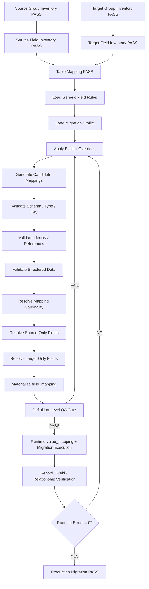

# Migration Field Mapping Generation Plan

## Purpose

> **Goal: generate a reusable, reviewable, database-ready field mapping that accounts for 100% of source physical fields and resolves 100% of required target physical fields.**

This plan is reusable for:

- Joomla core migrations;
- Joomla third-party extensions;
- custom Joomla extensions;
- version-to-version application migrations;
- database-platform migrations;
- subsystem or module migrations;
- any migration where a complete source and target field inventory can be produced.

Use the companion template:

- [`../templates/database-migration-field-mapping-template.md`](../templates/database-migration-field-mapping-template.md)

Required prerequisite tutorials:

- [`migration-group-generation-plan.md`](./migration-group-generation-plan.md)
- [`migration-field-generation-plan.md`](./migration-field-generation-plan.md)

Recommended companion contract:

- [`migration-contract-generation-plan.md`](./migration-contract-generation-plan.md)

The central guarantee is:

> **Every source physical field in the declared migration scope is explicitly accounted for, every required target physical field is explicitly resolved, and every mapping has enough schema, identity, reference, transformation, and verification metadata to be executed and audited.**

This is a **field-mapping guarantee**, not a production-migration-success guarantee. Production PASS additionally requires runtime value mapping, row accounting, execution, and verification.

---

# 1. Required Inputs and Hard Prerequisites

Do not generate field mapping from table names alone.

The following artifacts must exist first:

| Input | Requirement |
|---|---|
| Source group manifest | `PASS` |
| Source field inventory | `PASS` |
| Target group manifest | `PASS` |
| Target field inventory | `PASS` |
| Table mapping document | `PASS` |
| Migration contract | Recommended and normally required |
| Source schema authority | Explicit |
| Target schema authority | Explicit |
| Production reconciliation | Required before production execution |

Hard prerequisite gate:

```text
Source tables inventoried              = 100%
Source fields inventoried              = 100%
Target tables inventoried              = 100%
Target fields inventoried              = 100%
Source table mapping decisions         = 100%
Unknown source schema objects          = 0
Unknown target schema objects          = 0
Unclassified schema deviations         = 0
```

If the table-mapping gate is not complete, field mapping must not guess target tables independently.

---

# 2. Define the Correct Meaning of 100% Field Mapping

Do **not** define 100% as:

```text
mapping rows = source field count
```

That is only valid for a strict one-source-field-to-one-mapping-row design.

A reusable migration framework must support:

```text
ONE_TO_ONE
ONE_TO_MANY
MANY_TO_ONE
MANY_TO_MANY
ONE_TO_NONE
NONE_TO_ONE
```

Therefore the correct coverage definition is:

```text
SOURCE COVERAGE
Distinct source physical fields accounted = 100%
Unmapped source fields                     = 0
Silent source-field drops                  = 0

TARGET COVERAGE
Required target physical fields resolved   = 100%
Unresolved required target fields          = 0
Unknown target strategy                    = 0
```

Mapping action count may be greater than the source field count.

Example:

```text
source field: full_name

full_name → first_name
full_name → last_name

source fields covered = 1 / 1
mapping actions        = 2
coverage               = 100%
```

---

# 3. Separate Generic Mapping Rules From Platform Profiles

The reusable field-mapping engine must not embed Joomla-specific assumptions into its core logic.

Use two layers.

## 3.1 Generic core

The generic core understands:

```text
schema metadata
field identity
mapping cardinality
mapping decisions
key roles
references
structured payloads
source-only fields
target-only fields
verification
```

## 3.2 Migration profile

A migration profile contains platform/application-specific semantics.

Examples:

```text
Joomla profile
- Registry/JSON fields
- ACL structures
- nested-set trees
- menu sentinel IDs
- asset relationships
- UCM/Finder/workflow rules

Custom CRM profile
- UUID identities
- JSONB metadata
- customer polymorphic references
- legacy status translation
```

Recommended profile artifact:

```text
<scope>-field-mapping-profile.md
```

or a structured YAML/JSON equivalent.

The field-mapping template remains unchanged when the platform changes; only the profile and explicit overrides change.

---

# 4. Build Independent Source and Target Field Universes

Create two canonical sets before matching anything.

## Source field key

```text
(source_version, source_table, source_field)
```

## Target field key

```text
(target_version, target_table, target_field)
```

Required invariants:

```text
source_field_universe_count
=
COUNT(DISTINCT source field key)


target_field_universe_count
=
COUNT(DISTINCT target field key)
```

No wildcard entries are allowed in the final universe.

Invalid examples:

```text
all *_id fields
all params fields
other fields
...
```

Every physical field must be explicit.

---

# 5. Require Complete Physical Metadata for Every Field

Every source and target field must be queryable with physical schema facts.

Minimum metadata:

```text
database_side
database_dialect
table_name
column_name
ordinal_position
DATA_TYPE
COLUMN_TYPE
canonical_type_family
character_length
numeric_precision
numeric_scale
nullable
default
auto_increment / identity
generated
generated_expression
charset
collation
key_role
index_memberships
physical_fk_target
constraint metadata
comment
schema evidence/source
```

Recommended canonical type families:

```text
STRING
INTEGER
DECIMAL
FLOAT
BOOLEAN
TEMPORAL
BINARY
JSON
XML
UUID
ENUM
ARRAY
OTHER
```

Keep the original/raw database type as the authority. Canonical type family is only a comparison aid.

Example:

```text
MySQL BIGINT UNSIGNED
PostgreSQL bigint

raw types differ
canonical family = INTEGER
```

---

# 6. Join Every Source Field to the Table Mapping

For every source physical field:

```text
source field
    ↓
source table
    ↓
table_mapping
    ↓
target table / archive / ignore / rebuild destination
```

Hard invariant:

```text
Distinct source fields with table mapping
=
Distinct source fields in source universe
```

If a source field belongs to a table with no table-mapping decision:

```text
FIELD MAPPING = BLOCKED
```

Field mapping must inherit table-level decisions where appropriate:

```text
Table IGNORE  → field IGNORE unless explicit approved exception
Table ARCHIVE → field ARCHIVE unless explicit approved exception
Table REBUILD → field REBUILD unless explicit approved exception
```

---

# 7. Define Allowed Final Field Decisions

Use the canonical decisions from the field-mapping template:

```text
DIRECT
TRANSFORM
LOOKUP
STRUCTURED
GENERATED
REBUILD
REFERENCE_ONLY
ARCHIVE
IGNORE
DEFAULT
TARGET_OWNED
RECREATE
```

Invalid final decisions:

```text
UNKNOWN
PENDING
REVIEW
OPTIONAL
SELECTIVE
UNMAPPED
AMBIGUOUS
TBD
A / B
COPY?
```

Any invalid final decision blocks PASS.

---

# 8. Apply Deterministic Mapping Precedence

Apply the first matching rule:

```text
1. Explicit field override exists
   → use explicit override

2. Source table inherits IGNORE / ARCHIVE / REBUILD
   → apply inherited decision unless an approved exception exists

3. Field is an identity or reference requiring remap
   → LOOKUP

4. Field contains structured/embedded references
   → STRUCTURED

5. Target field is generated/derived/recreated
   → GENERATED / REBUILD / RECREATE

6. Explicit rename/semantic transform exists
   → TRANSFORM

7. Same-purpose scalar target exists and every compatibility check passes
   → DIRECT

8. Source field has no active target representation
   → explicit ARCHIVE / IGNORE / TRANSFORM / REFERENCE_ONLY

9. Nothing matches
   → CONTRACT ERROR
```

Hard rules:

```text
same name != DIRECT
same SQL type != DIRECT
same numeric ID != same identity
```

---

# 9. Generate Candidate Mappings, But Do Not Treat Candidates as Final

Candidate matching may use:

```text
same table + same field
mapped table + same field
known field rename
semantic identity
compatible type family
migration profile rule
explicit migration contract rule
```

Candidate mapping must then pass:

```text
semantic compatibility
schema compatibility
identity/reference analysis
constraint analysis
structured-data analysis
source-only/target-only analysis
```

Only after validation may a candidate become a final field decision.

Recommended metadata:

```text
rule_origin
```

Allowed origins:

```text
GENERIC
PROFILE
EXPLICIT
TABLE_INHERITED
```

Also preserve short evidence:

```text
evidence
```

Examples:

```text
same semantic + compatible type
official rename
logical dependency
migration profile rule
production data-range check
table contract
```

This prevents unexplained or AI-guessed final mappings.

---

# 10. Support Mapping Cardinality Explicitly

Every mapping action or mapping group must classify cardinality.

```text
ONE_TO_ONE
ONE_TO_MANY
MANY_TO_ONE
MANY_TO_MANY
ONE_TO_NONE
NONE_TO_ONE
```

## ONE_TO_ONE

```text
old.title → new.title
```

## ONE_TO_MANY

```text
old.full_name
→ new.first_name
→ new.last_name
```

## MANY_TO_ONE

```text
old.address_1
old.address_2
old.city
old.country
→ new.address_json
```

## ONE_TO_NONE

```text
old.runtime_token
→ IGNORE
```

## NONE_TO_ONE

```text
no source field
→ new.created_at = DEFAULT
```

## Mapping group

Use a stable grouping key when one transformation spans multiple source or target fields:

```text
mapping_group_key
```

Example:

```text
MG_CUSTOMER_DISPLAY_NAME
cardinality = MANY_TO_ONE
```

Do not flag multiple rows sharing a mapping group as duplicates merely because the transformation is multi-field.

---

# 11. Add Row Kind for Two-Way Coverage

Recommended row kinds:

```text
SOURCE_MAPPING
TARGET_RESOLUTION
```

`SOURCE_MAPPING` means a source field is being accounted for.

Example:

```text
old.title → new.title → DIRECT
```

`TARGET_RESOLUTION` means a target field has no direct source field but still requires a strategy.

Example:

```text
source = NULL
target = new.created_at
mapping = DEFAULT
```

This allows one field-mapping store to answer both questions:

```text
Have all source fields been accounted for?
Have all required target fields been resolved?
```

---

# 12. Key and Identity Analysis

Canonical key roles:

```text
PK
COMPOSITE_PK
UNIQUE
INDEX
NONE
```

For every entity identity determine:

```text
identity_role
identity_strategy
identity_domain
```

Recommended strategies:

```text
ID_MAP
SEMANTIC_LOOKUP
NATURAL_KEY_LOOKUP
GENERATED_ID
PRESERVE_ID_WITH_COLLISION_GATE
NONE
```

Hard rules:

- do not assume source PK equals target PK;
- primary-key preservation requires explicit approval and collision checks;
- composite identities are verified as tuples;
- unique constraints are tested after transformation/remapping;
- auto-increment does not prove identity equivalence;
- natural keys must be proven unique before use.

Gate:

```text
Required identity mappings              = 100%
Missing identity strategies             = 0
Ambiguous natural-key matches           = 0
PK collisions                           = 0
UNIQUE collisions                       = 0
Duplicate incompatible target identities = 0
```

Runtime source-value → target-value mappings belong in `value_mapping`, not in the static field mapping definition.

---

# 13. Reference / FK Analysis

Do not reduce relationships to `FK = YES/NO`.

Canonical reference types:

```text
PHYSICAL_FK
LOGICAL_FK
POLYMORPHIC
EMBEDDED_REFERENCE
SEMANTIC_REFERENCE
NONE
```

Rules:

```text
SQL-declared FK
→ PHYSICAL_FK

reference to another entity without SQL constraint
→ LOGICAL_FK

referenced entity determined by context/type/discriminator
→ POLYMORPHIC

reference inside JSON/XML/URL/HTML/serialized payload
→ EMBEDDED_REFERENCE

stable semantic key used to reconcile target-owned metadata
→ SEMANTIC_REFERENCE
```

Required metadata:

```text
reference_type
reference_domain
referenced_table when fixed
referenced_field when fixed
context/discriminator rule when polymorphic
```

Gate:

```text
Declared physical FKs inventoried       = 100%
Logical references classified           = 100%
Polymorphic references classified       = 100%
Embedded references classified          = 100%
Semantic references classified          = 100%
Missing required reference domains      = 0
Broken required relationships           = 0
Ambiguous polymorphic references        = 0
```

---

# 14. Structured Data Discovery and Mapping

Scan fields for structured representations such as:

```text
JSON
JSONB
XML
serialized PHP
serialized Java
CSV / delimited values
ARRAY
ACL payload
Registry/key-value payload
HTML
URL
query string
file/media path
custom encoded values
plugin/type-dependent values
```

Every structured field must have:

```text
parser_rule
serializer_rule
embedded_reference_rule
verification_rule
```

Required processing sequence:

```text
parse
→ validate
→ discover embedded references
→ resolve IDs/values
→ transform schema/keys
→ serialize
→ parse again
→ verify semantics
```

Forbidden:

```text
blind raw string replacement of IDs
silent parse failure
silent fallback to original invalid payload
```

Gate:

```text
Structured fields discovered            = 100%
Structured fields with parser/rule       = 100%
Invalid structured payloads              = 0
Unresolved embedded references           = 0
Serialization/reparse failures           = 0
```

---

# 15. Type Compatibility Analysis

A `DIRECT` decision must pass both schema-level and data-level compatibility.

Schema checks:

```text
canonical type family
raw DATA_TYPE
COLUMN_TYPE
signedness
length
precision
scale
nullable
default
charset
collation
generated/identity semantics
```

Examples of unsafe assumptions:

```text
VARCHAR(500) → VARCHAR(255)
INT → UNSIGNED INT
DECIMAL(18,6) → DECIMAL(10,2)
nullable → NOT NULL
case-insensitive collation → case-sensitive unique target
```

Actual data checks may prove a narrower target safe.

Example:

```sql
SELECT MAX(CHAR_LENGTH(source_field))
FROM source_table;
```

If target length is 255, `DIRECT` is permitted only if actual values and future migration contract safely fit the target.

Required gate:

```text
Unsafe DIRECT mappings                  = 0
Unresolved narrowing                    = 0
Unresolved precision/scale loss         = 0
Unresolved signedness mismatch          = 0
Unresolved charset/collation collision  = 0
Silent truncation/coercion paths         = 0
```

---

# 16. NULL, Default, Date, Enum, and Sentinel Rules

Every migration must explicitly review semantic special values.

Check:

```text
NULL
empty string
0
negative IDs
root/sentinel IDs
booleans
enums/states
legacy invalid dates
zero dates
default values
generated defaults
```

Never assume these values have the same meaning between versions.

Rules:

- target `NOT NULL` fields must have a valid source/default/generated value;
- invalid/legacy dates require an explicit transform rule;
- default substitution must preserve semantics;
- sentinel values are interpreted before ID lookup;
- enum/state changes require explicit value-domain mapping;
- negative/reference sentinel semantics must be preserved intentionally.

Gate:

```text
Unresolved NULL/default changes         = 0
Unresolved legacy-date rules            = 0
Unresolved enum/state mappings          = 0
Unknown sentinel semantics              = 0
```

---

# 17. Constraint Analysis

Check all applicable constraints:

```text
PRIMARY KEY
COMPOSITE PRIMARY KEY
UNIQUE
INDEX
FOREIGN KEY
CHECK
ENUM/domain
NOT NULL
DEFAULT
generated constraints
```

Validation must occur **after** mapping/transformation, because two distinct source values may become one target value.

Gate:

```text
PK collisions                           = 0
Composite-PK collisions                 = 0
UNIQUE collisions                       = 0
CHECK violations                        = 0
NOT NULL violations                     = 0
FK/reference violations                 = 0
```

Do not automatically rename or alter conflicting values unless the business/migration rule explicitly permits it.

---

# 18. Source-Only Field Anti-Join

Compute:

```text
SOURCE FIELD UNIVERSE
-
SOURCE FIELDS WITH ACTIVE TARGET REPRESENTATION
=
SOURCE-ONLY FIELD SET
```

Every source-only field must receive one explicit decision:

```text
ARCHIVE
IGNORE
TRANSFORM elsewhere
REFERENCE_ONLY
REBUILD
```

Required metadata:

```text
final decision
reason
destination/accounting rule
verification rule
```

Forbidden outcome:

```text
silent DROP
```

Gate:

```text
Source-only fields discovered           = 100%
Source-only fields resolved             = 100%
Silent source-only drops                = 0
```

---

# 19. Target-Only Field Anti-Join

Compute:

```text
TARGET FIELD UNIVERSE
-
TARGET FIELDS POPULATED/RESOLVED FROM SOURCE
=
TARGET-ONLY FIELD SET
```

Every target-only field must receive one explicit resolution:

```text
DEFAULT
GENERATED
TARGET_OWNED
RECREATE
LOOKUP
REBUILD
NOT_REQUIRED_BY_SCOPE
```

For every required target field:

```text
required source-derived value
OR
approved target resolution
```

must exist.

Gate:

```text
Target-only fields discovered           = 100%
Target-only fields classified           = 100%
Required target fields resolved         = 100%
Unresolved required target fields       = 0
Unknown target strategy                 = 0
```

This target anti-join is mandatory even when source coverage is already 100%.

---

# 20. Canonical Mapping Record Model

Recommended static mapping attributes:

```text
row_kind

source_version
source_table
source_field

target_version
target_table
target_field

mapping_group_key
mapping_cardinality

mapping_type
identity_strategy

reference_type
reference_domain

parser_rule
transform_rule
verification_rule

rule_origin
evidence
reason
execution_order
status
```

Physical schema facts remain in `field_inventory` and should normally be joined rather than copied manually into `field_mapping`.

Recommended logical separation:

```text
migration_inventory.field_inventory
    = physical schema facts

migration_mapping.field_mapping
    = mapping decisions

migration_mapping.value_mapping
    = runtime/design-time ID/value translations

migration_inventory.table_dependency
    = dependency graph
```

No additional contract table is required when these structures preserve all required facts.

---

# 21. Recommended Display Table

For reviewable Markdown, use:

| Source | S.Type | S.Key | Target | T.Type | T.Key | Card. | M | Ref | Domain | Rule | Verify |
|---|---|---|---|---|---|---|---|---|---|---|---|
| `{{SOURCE_FIELD}}` | `{{SOURCE_TYPE}}` | `{{SOURCE_KEY}}` | `{{TARGET_FIELD}}` | `{{TARGET_TYPE}}` | `{{TARGET_KEY}}` | `{{CARDINALITY}}` | `{{MAPPING_TYPE}}` | `{{REFERENCE_TYPE}}` | `{{DOMAIN}}` | `{{RULE}}` | `{{VERIFY}}` |

For large migrations, keep the Markdown readable but ensure the underlying mapping dataset also contains:

```text
nullable
default
charset/collation
identity strategy
mapping group
rule origin
evidence
reason
parser rule
execution order
```

The document may be a generated/readable representation of a structured mapping dataset.

---

# 22. Materialize Into the Mapping Database

Recommended sequence:

```text
source field inventory
      +
target field inventory
      +
table mapping
      +
generic rules
      +
migration profile
      +
explicit overrides
      ↓
candidate mappings
      ↓
validated final mappings
      ↓
field_mapping
      ↓
target anti-join
      ↓
target resolution rows
```

Use an idempotent seed process.

Do not rely on manual copy/paste for large mappings.

Recommended stable keys:

```text
SOURCE_MAPPING:
(source_version, source_table, source_field, mapping_group_key, target_table, target_field)

TARGET_RESOLUTION:
(target_version, target_table, target_field, row_kind)
```

Exact database constraints may vary with implementation, but rerunning the seed must not create duplicate logical mappings.

---

# 23. Source Coverage QA

Coverage must be based on distinct source-field identities, not total mapping action rows.

Conceptual query:

```sql
SELECT COUNT(DISTINCT CONCAT(source_table, '.', source_field)) AS covered_source_fields
FROM migration_mapping.field_mapping
WHERE migration_run_id = :migration_run_id
  AND row_kind = 'SOURCE_MAPPING';
```

Compare with:

```sql
SELECT COUNT(*) AS source_fields
FROM migration_inventory.field_inventory
WHERE migration_run_id = :migration_run_id
  AND database_side = 'SOURCE';
```

Required:

```text
covered_source_fields = source_fields
uncovered_source_fields = 0
```

### Detect source fields with no mapping

```sql
SELECT
    fi.table_name,
    fi.column_name
FROM migration_inventory.field_inventory AS fi
LEFT JOIN migration_mapping.field_mapping AS fm
  ON fm.migration_run_id = fi.migration_run_id
 AND fm.row_kind = 'SOURCE_MAPPING'
 AND fm.source_table = fi.table_name
 AND fm.source_field = fi.column_name
WHERE fi.migration_run_id = :migration_run_id
  AND fi.database_side = 'SOURCE'
  AND fm.source_field IS NULL
ORDER BY fi.table_name, fi.ordinal_position;
```

Expected result: **0 rows**.

---

# 24. Target Resolution QA

Every required target field must either receive source data or an explicit target resolution.

Conceptually:

```sql
SELECT
    tf.table_name,
    tf.column_name
FROM migration_inventory.field_inventory AS tf
LEFT JOIN migration_mapping.field_mapping AS fm
  ON fm.migration_run_id = tf.migration_run_id
 AND fm.target_table = tf.table_name
 AND fm.target_field = tf.column_name
WHERE tf.migration_run_id = :migration_run_id
  AND tf.database_side = 'TARGET'
  AND tf.required_for_scope = 1
  AND fm.target_field IS NULL
ORDER BY tf.table_name, tf.ordinal_position;
```

Expected result: **0 rows**.

If `required_for_scope` is not stored directly, derive it from the target contract/profile before running this gate.

---

# 25. Decision Quality QA

Reject unresolved decisions:

```sql
SELECT *
FROM migration_mapping.field_mapping
WHERE migration_run_id = :migration_run_id
  AND (
       mapping_type IS NULL
       OR UPPER(mapping_type) IN (
          'UNKNOWN','PENDING','REVIEW','OPTIONAL','SELECTIVE',
          'UNMAPPED','AMBIGUOUS','TBD'
       )
  );
```

Expected result: **0 rows**.

Additional gates:

```text
LOOKUP without reference domain         = 0
STRUCTURED without parser/rule          = 0
TRANSFORM without transform rule        = 0
ARCHIVE without destination/accounting  = 0
IGNORE without reason                   = 0
GENERATED without generation rule       = 0
RECREATE without recreation rule        = 0
```

---

# 26. Mapping-Group / Cardinality QA

For every non-`ONE_TO_ONE` mapping:

```text
mapping_group_key must exist
cardinality must be explicit
all group members must exist
group transform rule must be deterministic
verification rule must cover the whole group
```

Gate:

```text
Invalid mapping groups                  = 0
Orphan mapping-group members            = 0
Unknown cardinality                     = 0
Conflicting group transforms            = 0
```

Do not count legitimate multi-row mapping groups as duplicate field mappings.

---

# 27. Verification Rule Contract

Every final mapping must be verifiable.

Recommended minimum verification semantics:

```text
DIRECT
→ NULL-safe expected = actual

TRANSFORM
→ expected transform result = target

LOOKUP
→ target identity exists; missing/ambiguous = 0

STRUCTURED
→ parse/remap/reparse succeeds; unresolved refs = 0

GENERATED
→ deterministic generation + target constraint validation

REBUILD
→ target rebuild/integrity verification

REFERENCE_ONLY
→ semantic identity uniquely resolves

ARCHIVE
→ source field/value accounting and archive evidence

IGNORE
→ reason + source accounting

DEFAULT
→ approved target default verified

TARGET_OWNED
→ target value/state retained and validated

RECREATE
→ recreated target state verified
```

Gate:

```text
Mappings with verification rule         = 100%
Unverifiable final mappings             = 0
```

---

# 28. Reuse Strategy for Future Migrations

The reusable process should be:

```text
1. Generate source group inventory
2. Generate source field inventory
3. Generate target group inventory
4. Generate target field inventory
5. Generate table mapping
6. Select/create migration profile
7. Generate candidate field mappings
8. Apply explicit overrides
9. Validate schema/type/key/reference rules
10. Resolve source-only fields
11. Resolve target-only fields
12. Validate mapping cardinality
13. Materialize field_mapping
14. Materialize runtime value_mapping during migration
15. Run definition-level QA
16. Run production reconciliation
17. Execute migration
18. Run runtime verification
```

The reusable core should never contain hard-coded product-specific rules.

Use profiles and overrides for system-specific semantics.

---

# 29. Full 100% Field Mapping Checklist

## A. Prerequisites

- [ ] Source group manifest PASS
- [ ] Source field inventory PASS
- [ ] Target group manifest PASS
- [ ] Target field inventory PASS
- [ ] Table mapping PASS
- [ ] Migration scope explicit
- [ ] Source/target versions explicit
- [ ] Source/target schema authority explicit
- [ ] Production deviations classified before production execution

## B. Field universes

- [ ] Source field universe generated
- [ ] Target field universe generated
- [ ] Source field identities unique
- [ ] Target field identities unique
- [ ] Wildcard field entries = 0
- [ ] Missing inventory fields = 0

## C. Physical schema metadata

- [ ] Raw data type available
- [ ] Full column type available
- [ ] Canonical type family available
- [ ] Length available where applicable
- [ ] Precision/scale available where applicable
- [ ] Nullability available
- [ ] Default available
- [ ] Generated/identity semantics available
- [ ] Charset/collation available where applicable
- [ ] Key role available
- [ ] Index membership available
- [ ] Physical FK metadata available where declared

## D. Source coverage

- [ ] Every source physical field has >= 1 accounting/mapping decision
- [ ] Distinct source coverage = 100%
- [ ] Unmapped source fields = 0
- [ ] Silent source drops = 0
- [ ] Source-only field set processed = 100%

## E. Target coverage

- [ ] Target anti-join executed
- [ ] Target-only field set processed = 100%
- [ ] Every required target field has >= 1 resolution
- [ ] Required target resolution = 100%
- [ ] Unresolved required target fields = 0
- [ ] Unknown target strategy = 0

## F. Mapping decision quality

- [ ] Allowed final decisions only
- [ ] UNKNOWN = 0
- [ ] PENDING = 0
- [ ] REVIEW = 0
- [ ] OPTIONAL = 0
- [ ] UNMAPPED = 0
- [ ] AMBIGUOUS = 0
- [ ] Mapping reason/evidence exists where needed
- [ ] Rule origin recorded

## G. Cardinality

- [ ] ONE_TO_ONE supported
- [ ] ONE_TO_MANY supported
- [ ] MANY_TO_ONE supported
- [ ] MANY_TO_MANY supported
- [ ] ONE_TO_NONE supported
- [ ] NONE_TO_ONE supported
- [ ] Mapping group key used for grouped transforms
- [ ] Invalid mapping groups = 0
- [ ] Orphan group members = 0

## H. Type compatibility

- [ ] DIRECT schema compatibility checked
- [ ] Actual data-range/length checks performed where required
- [ ] Signed/unsigned changes checked
- [ ] Precision/scale changes checked
- [ ] Charset/encoding changes checked
- [ ] Collation/case changes checked
- [ ] Nullable changes checked
- [ ] Default changes checked
- [ ] Silent truncation/coercion forbidden
- [ ] Unsafe DIRECT mappings = 0

## I. Keys and identity

- [ ] PK classified
- [ ] Composite PK classified
- [ ] UNIQUE classified
- [ ] Indexes classified
- [ ] Identity strategy explicit
- [ ] Numeric ID equality never assumed without proof
- [ ] Natural-key uniqueness proven where used
- [ ] PK collisions = 0
- [ ] UNIQUE collisions = 0
- [ ] Ambiguous identities = 0

## J. Reference coverage

- [ ] Physical FKs inventoried
- [ ] Logical FKs classified
- [ ] Polymorphic references classified
- [ ] Embedded references classified
- [ ] Semantic references classified
- [ ] Required reference domains present
- [ ] Missing reference domains = 0
- [ ] Broken required references = 0
- [ ] Ambiguous polymorphic references = 0

## K. Structured data

- [ ] Structured fields discovered = 100%
- [ ] Parser rule exists for every structured field
- [ ] Serializer rule exists where required
- [ ] Embedded references explicitly handled
- [ ] Invalid payloads = 0
- [ ] Unresolved embedded refs = 0
- [ ] Reparse failures = 0
- [ ] Raw string ID replacement forbidden

## L. Special values

- [ ] NULL semantics checked
- [ ] Empty-string semantics checked
- [ ] Zero/sentinel semantics checked
- [ ] Negative-ID semantics checked where applicable
- [ ] Legacy/invalid dates checked
- [ ] Enum/state mappings checked
- [ ] Default semantics checked
- [ ] Generated values checked

## M. Constraints

- [ ] PK constraints checked after mapping
- [ ] Composite PK checked after mapping
- [ ] UNIQUE checked after mapping
- [ ] CHECK/domain constraints checked
- [ ] NOT NULL checked
- [ ] FK/reference integrity checked
- [ ] Constraint violations = 0

## N. Source-only fields

- [ ] Source-only discovery = 100%
- [ ] Every source-only field has final decision
- [ ] Archive rules explicit where used
- [ ] Ignore reason explicit where used
- [ ] Transform destination explicit where used
- [ ] Silent source-only drops = 0

## O. Target-only fields

- [ ] Target-only discovery = 100%
- [ ] Every target-only field classified
- [ ] DEFAULT validated
- [ ] GENERATED rule explicit
- [ ] TARGET_OWNED rule explicit
- [ ] RECREATE rule explicit
- [ ] NOT_REQUIRED_BY_SCOPE explicit where used
- [ ] Unresolved target-only required fields = 0

## P. Database materialization

- [ ] `field_inventory` remains physical schema source of truth
- [ ] `field_mapping` remains static mapping-decision source of truth
- [ ] `value_mapping` remains runtime/design-time value/ID translation store
- [ ] Row kind available
- [ ] Cardinality available
- [ ] Mapping group available
- [ ] Rule origin/evidence available
- [ ] Seed process idempotent
- [ ] Duplicate logical mappings = 0
- [ ] Enriched source→target mapping SELECT available

## Q. Verification readiness

- [ ] Every final mapping has verification rule
- [ ] DIRECT equality verification defined
- [ ] TRANSFORM expected-result verification defined
- [ ] LOOKUP orphan/ambiguity verification defined
- [ ] STRUCTURED parse/remap/reparse verification defined
- [ ] GENERATED/REBUILD integrity verification defined
- [ ] ARCHIVE accounting verification defined
- [ ] IGNORE accounting/reason verification defined
- [ ] DEFAULT/TARGET_OWNED/RECREATE verification defined
- [ ] Unverifiable mappings = 0

## R. Reuse / operational safety

- [ ] Generic rules separated from platform profile
- [ ] Profile rules versioned
- [ ] Explicit overrides versioned
- [ ] Mapping decisions version-scoped
- [ ] Mapping generation deterministic
- [ ] Production source remains immutable
- [ ] Errors never auto-converted to IGNORE
- [ ] Rerun does not create duplicate mappings
- [ ] Rerun does not create conflicting value mappings

---

# 30. Final Definition-Level Gate

The field mapping may claim definition-level PASS only when all following conditions are true:

```text
BASELINE / INVENTORY
--------------------------------------------------
Source tables inventoried                   = 100%
Source fields inventoried                   = 100%
Target tables inventoried                   = 100%
Target fields inventoried                   = 100%
Unknown schema objects                      = 0
Unclassified schema deviations              = 0

SOURCE COVERAGE
--------------------------------------------------
Distinct source fields accounted            = 100%
Unmapped source fields                      = 0
Silent source-field drops                   = 0
Source-only fields resolved                 = 100%

TARGET COVERAGE
--------------------------------------------------
Target anti-join processed                  = 100%
Target-only fields classified               = 100%
Required target fields resolved             = 100%
Unresolved required target fields           = 0
Unknown target strategy                     = 0

MAPPING QUALITY
--------------------------------------------------
Final mapping decisions                     = 100%
Invalid/unknown/pending decisions            = 0
Unknown cardinality                         = 0
Invalid mapping groups                      = 0
Missing rule origin/evidence where required = 0

SCHEMA COMPATIBILITY
--------------------------------------------------
Field metadata resolved                     = 100%
Unsafe DIRECT mappings                      = 0
Unresolved type conversions                 = 0
Unresolved narrowing/truncation             = 0
Unresolved NULL/default changes             = 0
Unresolved collation collisions             = 0

IDENTITY / CONSTRAINTS
--------------------------------------------------
Required identity strategies defined        = 100%
Ambiguous identity matches                  = 0
PK collisions                               = 0
UNIQUE collisions                           = 0
Constraint violations                       = 0

REFERENCES
--------------------------------------------------
Required reference classification           = 100%
Missing required reference domains          = 0
Broken required relationships               = 0
Ambiguous polymorphic references            = 0

STRUCTURED DATA
--------------------------------------------------
Structured fields discovered                = 100%
Structured fields with parser/rule          = 100%
Invalid structured payloads                 = 0
Unresolved embedded references              = 0

DATABASE MATERIALIZATION
--------------------------------------------------
Actual static field mappings materialized   = 100%
Duplicate logical mappings                  = 0
Missing materialized source coverage        = 0
Missing materialized target resolution      = 0

VERIFICATION READINESS
--------------------------------------------------
Mappings with verification rule             = 100%
Unverifiable final mappings                 = 0
Unresolved dependencies                     = 0

==================================================
FIELD MAPPING CONTRACT                       = PASS
==================================================
```

Required wording for a successful definition-level result:

> **100% of source physical fields in the declared migration scope are explicitly accounted for, and 100% of required target physical fields have an explicit resolution. No source field is silently dropped, no required target field remains unresolved, and every final mapping is supported by schema, identity/reference, rule, and verification metadata.**

---

# 31. Production Boundary

Definition-level PASS does **not** mean the production migration has already succeeded.

Production PASS additionally requires:

```text
actual source schema reconciliation       = PASS
actual target schema reconciliation       = PASS
runtime ID/value mapping                  = PASS
source record accounting                  = 100%
missing expected records                  = 0
unexpected records                        = 0
field value mismatches                    = 0
broken required relationships             = 0
constraint violations                     = 0
structured-data verification errors       = 0
migration execution errors                = 0
rerun/idempotency checks                  = PASS
```

Only after these runtime checks pass may the wider migration process claim that all database data in scope has been accounted for and verified.

---

# 32. End-to-End Reusable Flow



This flow is the recommended reusable standard for future field-mapping migrations.