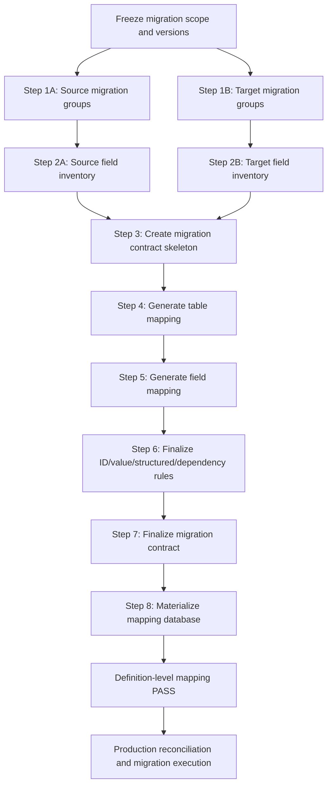

# Migration Mapping Plan Tutorial

## Purpose

> **Goal: build a reusable, evidence-backed migration mapping package that accounts for 100% of in-scope source tables and fields, resolves 100% of required target tables and fields, and is ready to materialize into the migration mapping database.**

This tutorial orchestrates the existing migration-plan tutorials and templates into one end-to-end workflow.

It is reusable for:

- Joomla core migrations;
- Joomla third-party extensions;
- custom Joomla extensions;
- version-to-version database migrations;
- subsystem migrations;
- other database-backed applications where complete source and target inventories can be produced.

The tutorial does **not** define 100% migration as “copy everything 1:1”. It defines 100% mapping as:

> **Every in-scope source table and field is explicitly accounted for, every required target table and field is explicitly resolved, and no mapping remains unknown, ambiguous, pending, or silently dropped.**

Production migration success still requires runtime value/ID mapping, record accounting, execution, and post-migration verification.

---

## Documents Used by This Tutorial

### Tutorials

- [`migration-group-generation-plan.md`](./migration-group-generation-plan.md)
- [`migration-field-generation-plan.md`](./migration-field-generation-plan.md)
- [`migration-field-mapping-generation-plan.md`](./migration-field-mapping-generation-plan.md)
- [`migration-contract-generation-plan.md`](./migration-contract-generation-plan.md)

### Templates

- [`../templates/database-migration-groups-template.md`](../templates/database-migration-groups-template.md)
- [`../templates/database-migration-field-inventory-template.md`](../templates/database-migration-field-inventory-template.md)
- [`../templates/database-migration-field-mapping-template.md`](../templates/database-migration-field-mapping-template.md)
- [`../templates/database-migration-contract-template.md`](../templates/database-migration-contract-template.md)

---

# End-to-End Flow



The output of each step is a hard prerequisite for the next step. Do not skip a failed gate.

---

# Step 0 — Freeze the Migration Scope

Before generating any mapping document, record the exact migration identity.

Required values:

```text
MIGRATION_SCOPE
SOURCE_SYSTEM
SOURCE_VERSION
TARGET_SYSTEM
TARGET_VERSION
SOURCE_DATABASE
TARGET_DATABASE
SOURCE_SCHEMA_AUTHORITY
TARGET_SCHEMA_AUTHORITY
```

Examples of schema authority:

```text
official installation SQL
official release package
official repository migration files
actual production CREATE TABLE metadata
ORM/database migration definitions
```

## Step 0 gate

```text
Migration scope explicit             = YES
Source system/version explicit       = YES
Target system/version explicit       = YES
Source schema authority explicit     = YES
Target schema authority explicit     = YES
```

Do not continue if the versions or migration scope are still ambiguous.

---

# Step 1 — Generate Migration Group Tables

Use:

- [`migration-group-generation-plan.md`](./migration-group-generation-plan.md)
- [`../templates/database-migration-groups-template.md`](../templates/database-migration-groups-template.md)

Generate a migration-group Markdown file for **both sides** of the migration.

Recommended outputs:

```text
<scope>-migration-groups-source.md
<scope>-migration-groups-target.md
```

For version-labelled projects, equivalent names are acceptable:

```text
<scope>-migration-groups-v1.md
<scope>-migration-groups-v2.md
```

The important requirement is that `SOURCE` and `TARGET` are unambiguous.

## Step 1A — Source migration groups

Run the migration-group generation plan against the source schema.

The generated file must explicitly classify every physical source table in scope.

Required result:

```text
Source physical tables discovered     = 100%
Source tables explicitly classified   = 100%
Missing source tables                 = 0
Duplicate source tables               = 0
Unknown ownership                     = 0
Wildcard final table entries          = 0
SOURCE MIGRATION GROUP                = PASS
```

## Step 1B — Target migration groups

Repeat the same process against the target schema.

Required result:

```text
Target physical tables discovered     = 100%
Target tables explicitly classified   = 100%
Missing target tables                 = 0
Duplicate target tables               = 0
Unknown ownership                     = 0
Wildcard final table entries          = 0
TARGET MIGRATION GROUP                = PASS
```

## Step 1 outputs

```text
SOURCE GROUP MANIFEST = PASS
TARGET GROUP MANIFEST = PASS
```

These two files define the table universes used by every later step.

---

# Step 2 — Generate Source and Target Field Inventories

Use:

- [`migration-field-generation-plan.md`](./migration-field-generation-plan.md)
- [`../templates/database-migration-field-inventory-template.md`](../templates/database-migration-field-inventory-template.md)

Generate one field-inventory file for each side.

Recommended outputs:

```text
<scope>-migration-fields-source.md
<scope>-migration-fields-target.md
```

Each field inventory must be derived from the effective table set that passed Step 1.

## Step 2A — Source field inventory

Every physical field in every in-scope source table must be explicit.

Preserve at minimum:

```text
table
field
ordinal position
DATA_TYPE
COLUMN_TYPE
length / precision / scale
nullable
default
charset / collation
extra / generated / identity state
PK / UNIQUE / INDEX metadata
physical FK metadata when declared
schema evidence
```

Required result:

```text
Source in-scope tables                = 100%
Source physical fields inventoried    = 100%
Unique source (table, field) pairs    = 100%
Missing source fields                 = 0
Duplicate source fields               = 0
Unexplained production deviations     = 0
SOURCE FIELD INVENTORY                = PASS
```

## Step 2B — Target field inventory

Repeat the same process against the target table universe.

Required result:

```text
Target in-scope tables                = 100%
Target physical fields inventoried    = 100%
Unique target (table, field) pairs    = 100%
Missing target fields                 = 0
Duplicate target fields               = 0
Unexplained production deviations     = 0
TARGET FIELD INVENTORY                = PASS
```

## Step 2 outputs

At this point the migration has four authoritative inventory artifacts:

```text
1. source migration groups
2. source field inventory
3. target migration groups
4. target field inventory
```

These four files are the fixed schema baseline for mapping.

---

# Step 3 — Create the Migration Contract Skeleton

Use:

- [`migration-contract-generation-plan.md`](./migration-contract-generation-plan.md)
- [`../templates/database-migration-contract-template.md`](../templates/database-migration-contract-template.md)

Create a **contract skeleton**, not a final PASS contract yet.

Recommended output:

```text
<scope>-migration-contract.md
```

At this stage fill only the parts that can already be proven:

```text
migration scope
source/target systems and versions
source/target table counts
source/target field counts
schema authorities
allowed final decisions
mapping precedence
production reconciliation rules
backup/recovery rules
final gate definitions
```

Do not mark table mapping, field mapping, target resolution, ID mapping, or runtime verification as PASS yet.

## Why the contract is created before mapping

The contract defines the vocabulary and rules used by both table and field mapping:

```text
DIRECT
TRANSFORM
LOOKUP
STRUCTURED
DEFAULT
GENERATED
REBUILD
REFERENCE_ONLY
ARCHIVE
IGNORE
TARGET_OWNED
RECREATE
```

Forbidden final states:

```text
UNKNOWN
PENDING
REVIEW
OPTIONAL
SELECTIVE
UNMAPPED
AMBIGUOUS
TBD
A / B
```

This prevents table mapping and field mapping from inventing different decision vocabularies.

## Step 3 gate

```text
Inventory baselines copied from PASS artifacts = YES
Canonical final decisions defined             = YES
Invalid final decisions forbidden             = YES
Final production gates defined                 = YES
Contract status                                = DRAFT / NOT YET PASS
```

---

# Step 4 — Generate the Table Mapping

Use the **table-mapping section** of:

- [`migration-contract-generation-plan.md`](./migration-contract-generation-plan.md)

and the four PASS inventory artifacts from Steps 1–2.

Recommended output:

```text
<scope>-table-mapping-migration.md
```

Until a dedicated reusable table-mapping template exists, use the canonical table matrix defined by the migration-contract generation plan.

Recommended mapping columns:

| # | Group | Source Table | Target / Destination | Mapping Type | ID Strategy | Identity Key | Depends On | Produces Map | Consumes Maps | Execution Order | Verify | Reason |
|---:|---|---|---|---|---|---|---|---|---|---|---|---|
| 1 | `Gx` | `<source_table>` | `<target / archive / none>` | `<decision>` | `<id strategy>` | `<identity>` | `<dependencies>` | `<map>` | `<maps>` | `<order>` | `<verify>` | `<reason>` |

## Required table cases

The mapping must explicitly handle:

```text
same-name table
renamed table
restructured table
one-to-one table mapping
one-to-many table mapping
many-to-one table mapping
source-only table
target-only table
generated/rebuilt table
runtime/security table
archive-only table
target-owned table
```

## Source table gate

Every source table must be accounted for exactly once at the table-decision level.

```text
Distinct source tables accounted      = 100%
Missing source table decisions        = 0
Duplicate final source decisions      = 0
Unknown table decisions               = 0
Ambiguous table decisions             = 0
Unverifiable table decisions          = 0
```

## Target table anti-join

After resolving source tables, compute target tables that have no source-table representation.

Every target-only table must receive one explicit resolution:

```text
TARGET_OWNED
GENERATED
RECREATE
DEFAULT
REFERENCE_ONLY
REBUILD
NOT_REQUIRED_BY_SCOPE
```

Required result:

```text
Target-only tables discovered         = 100%
Target-only tables classified         = 100%
Unresolved target-only tables         = 0
TABLE MAPPING                         = PASS
```

Field mapping must not begin until this gate passes.

---

# Step 5 — Generate the Field Mapping

Use:

- [`migration-field-mapping-generation-plan.md`](./migration-field-mapping-generation-plan.md)
- [`../templates/database-migration-field-mapping-template.md`](../templates/database-migration-field-mapping-template.md)

Recommended output:

```text
<scope>-field-mapping-migration.md
```

Inputs:

```text
source group manifest PASS
source field inventory PASS
target group manifest PASS
target field inventory PASS
table mapping PASS
migration contract skeleton
optional platform/application mapping profile
explicit overrides/evidence
```

## Do not use `mapping rows = source field count` as the generic 100% rule

A reusable migration must support:

```text
ONE_TO_ONE
ONE_TO_MANY
MANY_TO_ONE
MANY_TO_MANY
ONE_TO_NONE
NONE_TO_ONE
```

The correct source gate is:

```text
Distinct source physical fields accounted = 100%
Unmapped source fields                     = 0
Silent source-field drops                  = 0
```

The mapping action count may be larger than the number of source fields.

## Recommended mapping record

```text
row_kind
source_version
source_table
source_field
target_version
target_table
target_field
mapping_group_key
mapping_cardinality
mapping_type
identity_strategy
reference_type
reference_domain
parser_rule
transform_rule
verification_rule
rule_origin
evidence
reason
execution_order
status
```

Physical schema facts stay in the field inventory and are joined into the mapping view.

## Required field information

Every mapping must be able to resolve:

```text
source DATA_TYPE / COLUMN_TYPE
source nullable/default
source PK/COMPOSITE_PK/UNIQUE/INDEX role
source reference metadata

target DATA_TYPE / COLUMN_TYPE
target nullable/default
target PK/COMPOSITE_PK/UNIQUE/INDEX role
target reference metadata

mapping decision
identity strategy
reference type/domain
structured parser/transform rule
verification rule
```

## Required reference types

Do not use only `FK = YES/NO`.

Use:

```text
PHYSICAL_FK
LOGICAL_FK
POLYMORPHIC
EMBEDDED_REFERENCE
SEMANTIC_REFERENCE
NONE
```

## Required special cases

The field mapping process must cover:

```text
same-name fields with changed semantics
renamed fields
source-only fields
target-only fields
type narrowing/widening
signed/unsigned changes
precision/scale changes
NULL/default changes
legacy/invalid dates
enum/state changes
sentinel values
PK/composite PK/unique collisions
logical references
polymorphic references
structured JSON/XML/serialized/HTML/URL/query/path data
generated values
rebuilt values
archive/ignore/reference-only values
```

## Source-only anti-join

```text
SOURCE FIELD UNIVERSE
-
SOURCE FIELDS WITH ACTIVE TARGET REPRESENTATION
=
SOURCE-ONLY FIELD SET
```

Every source-only field must have an explicit final outcome.

Required result:

```text
Source-only fields discovered          = 100%
Source-only fields resolved            = 100%
Silent source-only drops               = 0
```

## Target-only anti-join

```text
TARGET FIELD UNIVERSE
-
TARGET FIELDS POPULATED/RESOLVED FROM SOURCE
=
TARGET-ONLY FIELD SET
```

Every required target-only field must resolve to one strategy such as:

```text
DEFAULT
GENERATED
TARGET_OWNED
RECREATE
LOOKUP
REBUILD
NOT_REQUIRED_BY_SCOPE
```

Required result:

```text
Target-only fields discovered          = 100%
Target-only fields classified          = 100%
Required target fields resolved        = 100%
Unresolved required target fields      = 0
Unknown target strategy                = 0
FIELD MAPPING                          = PASS
```

---

# Step 6 — Finalize ID, Value, Structured, and Dependency Rules

Use the mapping artifacts and the remaining sections of:

- [`migration-contract-generation-plan.md`](./migration-contract-generation-plan.md)

Define all runtime/design-time mapping domains required by table and field mappings.

## ID / identity mapping

Never assume source numeric IDs equal target numeric IDs.

Allowed strategies include:

```text
ID_MAP
SEMANTIC_LOOKUP
NATURAL_KEY_LOOKUP
GENERATED_ID
PRESERVE_ID_WITH_COLLISION_GATE
NONE
```

Required gate:

```text
Required identity domains defined     = 100%
Missing required identity mappings    = 0
Ambiguous identity matches            = 0
PK/UNIQUE collisions                  = 0
```

## Value mapping

Define deterministic translations for fields such as:

```text
state/status
enum values
language keys
type aliases
legacy constants
sentinel semantics
application-specific code values
```

Required gate:

```text
Required value domains defined        = 100%
Missing required value rules          = 0
Ambiguous value mappings              = 0
```

## Structured rules

Every structured field must define:

```text
format
parser
embedded references
transform rule
serializer
reparse validation
failure policy
```

Required gate:

```text
Structured fields classified          = 100%
Structured parser/rules defined       = 100%
Unresolved embedded references        = 0
Invalid structured values             = 0
```

## Dependencies

Inventory both physical and logical dependencies.

Possible types:

```text
PHYSICAL_FK
LOGICAL_REFERENCE
LOOKUP_REFERENCE
STRUCTURED_REFERENCE
FILE_REFERENCE
EXTENSION_REFERENCE
APPLICATION_ORDER
TARGET_PREREQUISITE
```

Required gate:

```text
Required dependencies resolved        = 100%
Unresolved hard dependencies          = 0
Forbidden orphans                     = 0
Unresolved hard cycles                = 0
Execution order derivable             = YES
```

---

# Step 7 — Finalize the Migration Contract

Return to:

- [`migration-contract-generation-plan.md`](./migration-contract-generation-plan.md)
- [`../templates/database-migration-contract-template.md`](../templates/database-migration-contract-template.md)

Replace the Step 3 skeleton with the actual mapping evidence from Steps 4–6.

The final contract must reference the real generated artifacts:

```text
source group manifest
target group manifest
source field inventory
target field inventory
table mapping
field mapping
identity/value mapping rules
structured rules
dependency rules
record accounting rules
verification rules
backup/recovery strategy
```

## Definition-level contract gate

```text
Source table coverage                 = 100%
Source field coverage                 = 100%
Required target table resolution      = 100%
Required target field resolution      = 100%
Unknown final decisions               = 0
Ambiguous final decisions             = 0
Missing identity/reference domains    = 0
Unresolved structured rules           = 0
Unresolved dependencies               = 0
Unverifiable mappings                 = 0
MIGRATION CONTRACT                    = PASS (definition-level)
```

Do not claim production PASS yet.

---

# Step 8 — Materialize the Mapping Database

Recommended logical separation:

```text
migration_inventory.table_list
migration_inventory.field_inventory
migration_inventory.table_dependency

migration_mapping.table_mapping
migration_mapping.field_mapping
migration_mapping.value_mapping
```

Recommended responsibility:

| Structure | Responsibility |
|---|---|
| `table_list` | Physical table inventory and ownership/scope facts. |
| `field_inventory` | Physical source/target schema facts. |
| `table_dependency` | Dependency graph. |
| `table_mapping` | Static source-table → target-table decisions. |
| `field_mapping` | Static field-level mapping/resolution decisions. |
| `value_mapping` | Runtime/design-time source value/ID → target value/ID translations. |

Do not duplicate authoritative DDL into mapping tables when it can be joined from inventory.

## Materialization rules

```text
seed process must be deterministic
seed process must be idempotent
mapping versions must be explicit
source and target versions must be explicit
mapping groups/cardinality must be preserved
rule origin/evidence must be preserved
errors must never be auto-converted to IGNORE
```

## Database gate

```text
Source tables materialized            = 100%
Source fields materialized            = 100%
Required target resolutions           = 100%
Duplicate logical mappings            = 0
Missing mapping decisions             = 0
Invalid mapping enums                 = 0
Missing required reference domains    = 0
Conflicting mapping groups            = 0
```

---

# Step 9 — Definition-Level Final Mapping Gate

The mapping package may be declared ready for implementation only when all of the following pass.

```text
INVENTORY
--------------------------------------------------
Source group manifest                       = PASS
Target group manifest                       = PASS
Source field inventory                      = PASS
Target field inventory                      = PASS
Unknown schema objects                      = 0
Unclassified schema deviations              = 0

TABLE MAPPING
--------------------------------------------------
Distinct source tables accounted            = 100%
Source table decisions                      = 100%
Target-only tables classified               = 100%
Unresolved target tables                    = 0
Unknown/ambiguous table decisions            = 0

FIELD MAPPING
--------------------------------------------------
Distinct source fields accounted            = 100%
Unmapped source fields                      = 0
Silent source-field drops                   = 0
Source-only fields resolved                 = 100%
Target-only fields classified               = 100%
Required target fields resolved             = 100%
Unresolved required target fields           = 0
Unknown target strategy                     = 0

SCHEMA / CONSTRAINTS
--------------------------------------------------
Required schema metadata resolved           = 100%
Unsafe DIRECT mappings                      = 0
Unresolved narrowing/truncation             = 0
Unresolved NULL/default changes             = 0
PK collisions                               = 0
UNIQUE collisions                           = 0
Constraint violations                       = 0

IDENTITY / REFERENCES
--------------------------------------------------
Required identity strategies defined        = 100%
Required reference classifications          = 100%
Missing required reference domains          = 0
Ambiguous identity matches                  = 0
Broken required references                  = 0

STRUCTURED / DEPENDENCY
--------------------------------------------------
Structured fields classified                = 100%
Structured fields with parser/rule          = 100%
Unresolved embedded references              = 0
Required dependencies resolved              = 100%
Unresolved hard dependencies                = 0

QUALITY
--------------------------------------------------
UNKNOWN                                     = 0
PENDING                                     = 0
REVIEW                                      = 0
UNMAPPED                                    = 0
AMBIGUOUS                                   = 0
Unverifiable final mappings                 = 0

DATABASE MATERIALIZATION
--------------------------------------------------
Table mapping materialized                  = 100%
Field mapping materialized                  = 100%
Duplicate logical mappings                  = 0
Conflicting mapping groups                  = 0

==================================================
MIGRATION MAPPING PACKAGE                   = PASS
==================================================
```

---

# Step 10 — Production Boundary

A definition-level mapping PASS does **not** prove that production data has migrated successfully.

Before claiming production migration PASS, additionally require:

```text
actual source schema reconciliation      = PASS
actual target schema reconciliation      = PASS
runtime ID/value mapping                 = PASS
source record accounting                 = 100%
unaccounted source records               = 0
migration execution errors               = 0
missing expected records                 = 0
unexpected records                       = 0
field value mismatches                   = 0
broken required relationships            = 0
structured verification errors           = 0
rerun/idempotency checks                 = PASS
backup/restore evidence                  = PASS
```

Only after those checks pass may the wider migration process claim that all in-scope database data has been accounted for and verified.

---

# Reusable Output Package

A complete migration mapping package should contain at least:

```text
<scope>-migration-groups-source.md
<scope>-migration-groups-target.md

<scope>-migration-fields-source.md
<scope>-migration-fields-target.md

<scope>-table-mapping-migration.md
<scope>-field-mapping-migration.md

<scope>-migration-contract.md

optional:
<scope>-field-mapping-profile.md
<scope>-mapping-overrides.md
<scope>-mapping-evidence.md
```

Recommended dependency order:

```text
Groups
  ↓
Fields
  ↓
Contract skeleton
  ↓
Table mapping
  ↓
Field mapping
  ↓
ID / value / structured / dependency rules
  ↓
Final migration contract
  ↓
Mapping database materialization
  ↓
Definition-level PASS
  ↓
Production execution + verification
```

---

# Master Checklist

## Scope

- [ ] Migration scope frozen
- [ ] Source version frozen
- [ ] Target version frozen
- [ ] Schema authorities documented

## Step 1 — Groups

- [ ] Source group file generated with `migration-group-generation-plan.md`
- [ ] Source group file uses `database-migration-groups-template.md`
- [ ] Target group file generated with the same plan/template
- [ ] Source table coverage = 100%
- [ ] Target table coverage = 100%
- [ ] Unknown ownership = 0

## Step 2 — Fields

- [ ] Source field inventory generated with `migration-field-generation-plan.md`
- [ ] Source field inventory uses `database-migration-field-inventory-template.md`
- [ ] Target field inventory generated with the same plan/template
- [ ] Source physical field coverage = 100%
- [ ] Target physical field coverage = 100%
- [ ] Duplicate/missing fields = 0

## Step 3 — Contract Skeleton

- [ ] Contract skeleton generated with `migration-contract-generation-plan.md`
- [ ] Contract uses `database-migration-contract-template.md`
- [ ] Canonical final decisions frozen
- [ ] Invalid final decisions forbidden
- [ ] Contract is not prematurely marked PASS

## Step 4 — Table Mapping

- [ ] Every source table accounted
- [ ] Source table decisions = 100%
- [ ] Target-only table anti-join complete
- [ ] Target-only tables classified = 100%
- [ ] Unknown/ambiguous table mapping = 0
- [ ] Table mapping PASS

## Step 5 — Field Mapping

- [ ] Generated with `migration-field-mapping-generation-plan.md`
- [ ] Uses `database-migration-field-mapping-template.md`
- [ ] Distinct source field coverage = 100%
- [ ] Source-only anti-join complete
- [ ] Target-only anti-join complete
- [ ] Required target field resolution = 100%
- [ ] Mapping cardinality handled
- [ ] Datatype/key/reference metadata resolved
- [ ] Unknown/ambiguous field mapping = 0
- [ ] Field mapping PASS

## Step 6 — Mapping Semantics

- [ ] Identity domains defined
- [ ] Value domains defined
- [ ] Structured parsers/rules defined
- [ ] Dependencies defined
- [ ] Missing lookup domains = 0
- [ ] Unresolved embedded references = 0
- [ ] Unresolved hard dependencies = 0

## Step 7 — Final Contract

- [ ] Actual table mapping referenced
- [ ] Actual field mapping referenced
- [ ] ID/value/structured/dependency rules referenced
- [ ] Record accounting contract defined
- [ ] Verification contract defined
- [ ] Recovery/rollback contract defined
- [ ] Definition-level contract PASS

## Step 8 — Database

- [ ] Inventory materialized
- [ ] Table mapping materialized
- [ ] Field mapping materialized
- [ ] Value mapping strategy ready
- [ ] Seed idempotency verified
- [ ] Duplicate logical mappings = 0

## Final

- [ ] Source table coverage = 100%
- [ ] Source field coverage = 100%
- [ ] Required target table resolution = 100%
- [ ] Required target field resolution = 100%
- [ ] UNKNOWN = 0
- [ ] PENDING = 0
- [ ] REVIEW = 0
- [ ] UNMAPPED = 0
- [ ] AMBIGUOUS = 0
- [ ] Unverifiable mapping = 0
- [ ] `MIGRATION MAPPING PACKAGE = PASS`

---

## Final Rule

> **Never advance to the next mapping stage because a document merely looks complete. Advance only when the previous stage proves its denominator, reaches 100% coverage of that denominator, and has zero unresolved/unknown objects.**
