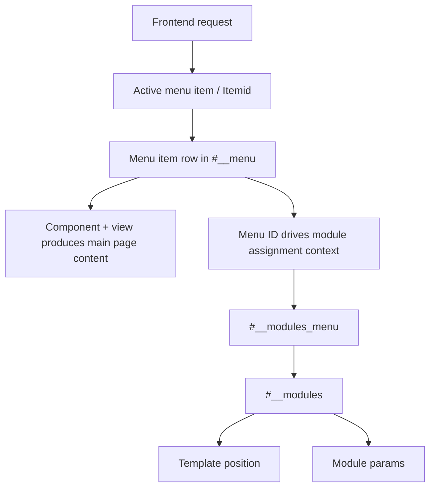
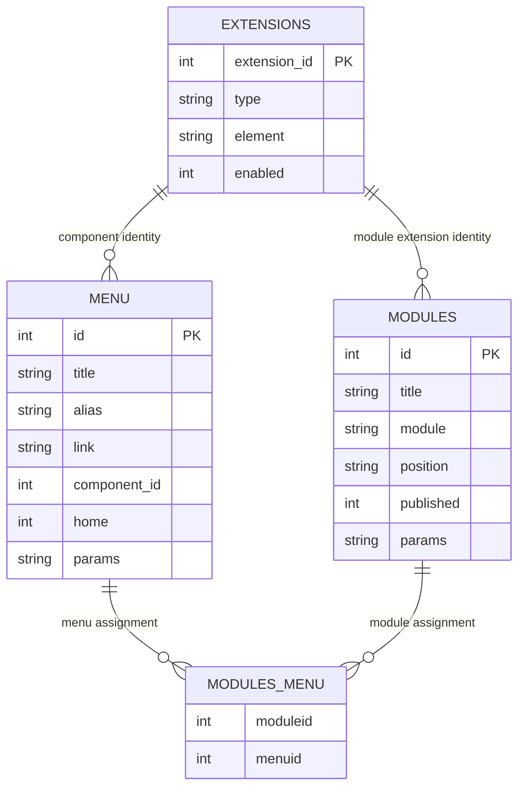
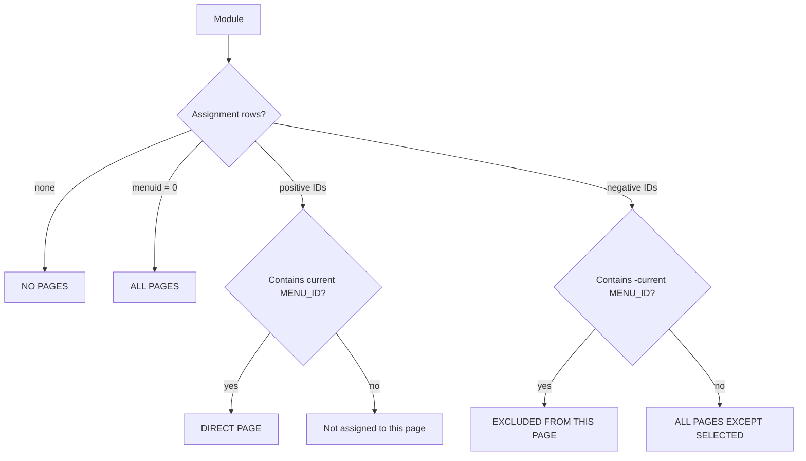
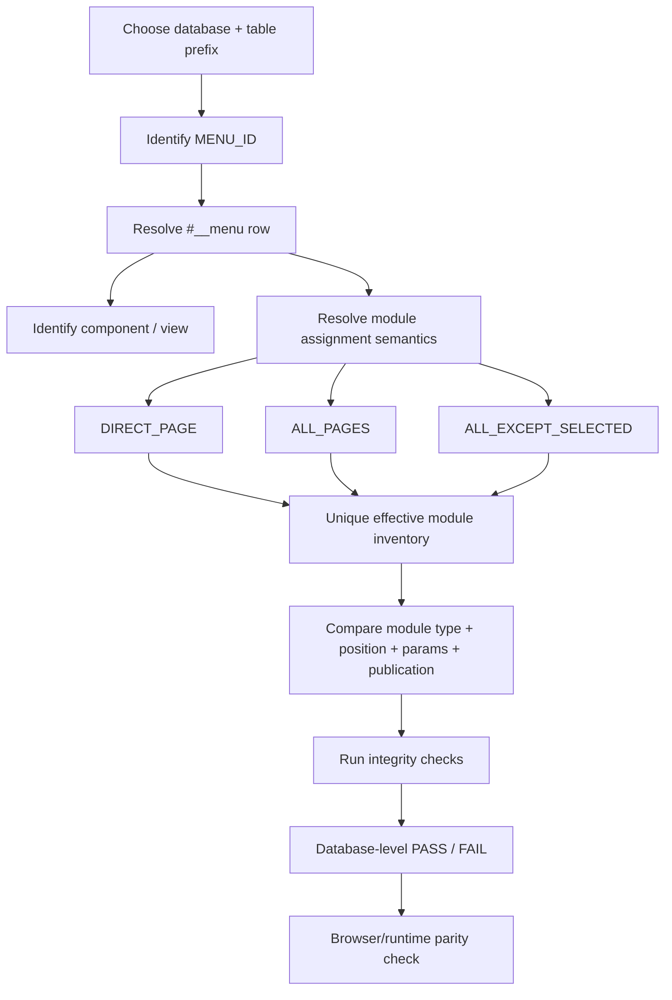

# Joomla Menu Item → Page Context → Module Query Guide

> A read-only MySQL guide for identifying a Joomla page context from a menu item ID and determining which modules are configured for that page.

<a id="overview"></a>

## Overview

In Joomla, a frontend page is **not a module**. A menu item provides a page/navigation context (`Itemid`), normally points to a component/view, and modules can be assigned to that menu item.

For database analysis, the core relationship is:

```text
menu item ID
    ↓
#__menu.id
    ↓
#__modules_menu.menuid
    ↓
#__modules_menu.moduleid
    ↓
#__modules.id
```

This relationship is extremely useful for migration verification because it lets you answer questions such as:

- Which page/menu item does `menu_id = 101` represent?
- Which component/view is the main content area of that page?
- Which modules are assigned directly to that page?
- Which modules are assigned to all pages and therefore also apply to it?
- Which modules use an "all pages except selected pages" rule?
- How many unique modules are configured for that page?
- Which module positions and parameters must be preserved during migration?
- Are there broken or suspicious menu/module assignments?

> [!IMPORTANT]
> A Joomla menu item is a strong **page-context key**, but it is not a guarantee that every possible frontend URL has its own menu item. Components and routers can produce URLs/views without a dedicated menu item.

> [!IMPORTANT]
> Database assignment does **not** prove final browser rendering. Template positions, access levels, publication state, plugins, extension logic, PHP, JavaScript, CSS, language, and runtime conditions can still affect whether a module is actually visible.

### Table of contents

- [Overview](#overview)
- [1. Core Concept: Menu Item vs Page vs Module](#core-concept)
- [2. Database Relationship](#database-relationship)
- [3. Query Placeholders](#query-placeholders)
- [4. Find Menu IDs and Page Identities](#find-menu-ids)
- [5. Resolve One Menu ID to Its Page Context](#resolve-page)
- [6. Resolve the Page Component and View](#resolve-component)
- [7. Understand Module Assignment Modes](#assignment-modes)
- [8. Inspect Raw Module Assignments](#raw-assignments)
- [9. Find the Effective Modules for One Page](#effective-modules)
- [10. Count Modules for One Page](#count-modules)
- [11. Count Modules by Assignment Type](#count-by-assignment)
- [12. Group Effective Modules by Position](#modules-by-position)
- [13. Inspect Module Configuration](#module-configuration)
- [14. Verify Module Extension Availability](#extension-availability)
- [15. Integrity and Orphan Checks](#integrity-checks)
- [16. Migration Verification Workflow](#migration-workflow)
- [17. Practical Copy-and-Run Query Set](#copy-run)
- [18. Interpretation and PASS Criteria](#pass-criteria)
- [19. Limitations](#limitations)
- [20. References](#references)

---

<a id="core-concept"></a>

## 1. Core Concept: Menu Item vs Page vs Module

The three concepts should not be treated as the same thing.

| Concept | Main database source | Meaning |
|---|---|---|
| Menu item | `#__menu` | Navigation item and page context; its ID commonly becomes the frontend `Itemid`. |
| Component/view | `#__menu.component_id`, `#__menu.link`, `#__extensions` | Produces the main component output for the page. |
| Module | `#__modules` | Reusable content/functionality rendered in a template module position. |
| Module assignment | `#__modules_menu` | Defines where a module is associated with menu items. |

A useful mental model is:



Therefore, when this document says **"modules for a page"**, it means:

> modules whose Joomla menu-assignment configuration makes them applicable to the selected menu item/page context.

It does **not** mean the modules are physically stored inside a page row.

---

<a id="database-relationship"></a>

## 2. Database Relationship

The main relationship is:



The most important joins are:

```text
#__menu.id
    = #__modules_menu.menuid            -- direct positive assignment

#__modules.id
    = #__modules_menu.moduleid

#__menu.component_id
    = #__extensions.extension_id        -- page component identity
```

However, direct equality alone is **not sufficient** to calculate every module that applies to a page. Joomla also supports all-pages and exclusion-style assignments.

---

<a id="query-placeholders"></a>

## 3. Query Placeholders

All queries in this guide are database-version neutral and use these placeholders:

| Placeholder | Meaning | Example |
|---|---|---|
| `<DB_NAME>` | Database/schema name | `joomla_site` |
| `<PREFIX>` | Physical Joomla table prefix, including trailing `_` | `abc_` |
| `<MENU_ID>` | Menu item ID being inspected | `101` |
| `<MODULE_ID>` | Optional module ID being inspected | `55` |

Example replacement:

```text
<DB_NAME>.<PREFIX>menu
```

becomes:

```text
joomla_site.abc_menu
```

> [!WARNING]
> `#__` is a Joomla application-level prefix placeholder. Raw MySQL clients do not automatically replace it. When running SQL directly in MySQL/phpMyAdmin/Adminer, use the **real physical prefix**.

So this Joomla API-style table name:

```text
#__modules
```

must become something like:

```text
joomla_site.abc_modules
```

before execution in raw MySQL.

---

<a id="find-menu-ids"></a>

## 4. Find Menu IDs and Page Identities

### 4.1 List frontend menu items

Use this when you know the page/menu name but do not yet know its menu ID.

```sql
SELECT
    mi.id          AS menu_id,
    mi.title       AS menu_title,
    mi.alias,
    mi.menutype,
    mi.type,
    mi.link,
    mi.parent_id,
    mi.level,
    mi.home,
    mi.published,
    mi.access,
    mi.language
FROM <DB_NAME>.<PREFIX>menu AS mi
WHERE mi.client_id = 0
ORDER BY
    mi.menutype,
    mi.lft,
    mi.id;
```

Example interpretation:

```text
menu_id | menu_title | alias | home
101     | Home       | home  | 1
205     | Products   | products | 0
```

The reliable database statement is:

```text
menu_id 101 is the menu item titled "Home"
```

The menu title is **not necessarily identical** to the browser document title or page heading because page display settings may override those values.

### 4.2 Find menu items by title or alias

```sql
SELECT
    mi.id AS menu_id,
    mi.title,
    mi.alias,
    mi.menutype,
    mi.link,
    mi.home,
    mi.published,
    mi.language
FROM <DB_NAME>.<PREFIX>menu AS mi
WHERE mi.client_id = 0
  AND (
      mi.title LIKE '%<SEARCH_TEXT>%'
      OR mi.alias LIKE '%<SEARCH_TEXT>%'
  )
ORDER BY mi.id;
```

### 4.3 Find configured Home menu items

```sql
SELECT
    mi.id AS menu_id,
    mi.title,
    mi.alias,
    mi.menutype,
    mi.link,
    mi.home,
    mi.published,
    mi.language
FROM <DB_NAME>.<PREFIX>menu AS mi
WHERE mi.client_id = 0
  AND mi.home = 1
ORDER BY mi.language, mi.id;
```

> [!NOTE]
> Do not assume there is always exactly one Home row. Multilingual Joomla sites can have different default menu items by language/context.

---

<a id="resolve-page"></a>

## 5. Resolve One Menu ID to Its Page Context

Use this as the primary **menu ID → page identity** query.

```sql
SELECT
    mi.id                AS menu_id,
    mi.title             AS menu_title,
    mi.alias,
    mi.menutype,
    mi.type,
    mi.link,
    mi.component_id,
    mi.parent_id,
    mi.level,
    mi.home,
    mi.published,
    mi.access,
    mi.language,
    mi.template_style_id,
    mi.params
FROM <DB_NAME>.<PREFIX>menu AS mi
WHERE mi.id = <MENU_ID>
  AND mi.client_id = 0;
```

This query answers:

> **What Joomla menu item/page context does `<MENU_ID>` represent?**

If it returns zero rows, do not continue assuming the menu ID is valid. First verify the database, prefix, site/admin client, and menu ID.

### Optional: read common page-display values from `params`

On MySQL versions with JSON functions, this can help inspect page title overrides when `params` contains valid JSON:

```sql
SELECT
    mi.id AS menu_id,
    mi.title AS menu_title,
    CASE
        WHEN JSON_VALID(mi.params)
        THEN JSON_UNQUOTE(JSON_EXTRACT(mi.params, '$.page_title'))
        ELSE NULL
    END AS configured_page_title,
    CASE
        WHEN JSON_VALID(mi.params)
        THEN JSON_UNQUOTE(JSON_EXTRACT(mi.params, '$.page_heading'))
        ELSE NULL
    END AS configured_page_heading,
    mi.params
FROM <DB_NAME>.<PREFIX>menu AS mi
WHERE mi.id = <MENU_ID>
  AND mi.client_id = 0;
```

Treat these JSON keys as configuration inspection, not as a universal guarantee that every Joomla version/menu type uses them identically.

---

<a id="resolve-component"></a>

## 6. Resolve the Page Component and View

A menu item normally points to a component/view through `component_id` and/or its `link`.

### 6.1 Resolve component identity

```sql
SELECT
    mi.id                AS menu_id,
    mi.title             AS menu_title,
    mi.alias,
    mi.link,
    mi.component_id,
    e.extension_id,
    e.name               AS extension_name,
    e.element            AS component_element,
    e.type               AS extension_type,
    e.enabled            AS component_enabled
FROM <DB_NAME>.<PREFIX>menu AS mi
LEFT JOIN <DB_NAME>.<PREFIX>extensions AS e
    ON e.extension_id = mi.component_id
WHERE mi.id = <MENU_ID>
  AND mi.client_id = 0;
```

Typical component elements may look like:

```text
com_content
com_contact
com_tags
com_users
```

Third-party components can add their own values.

### 6.2 Extract `option`, `view`, and `layout` from the menu link

This is useful when `link` contains a normal internal Joomla URL such as:

```text
index.php?option=com_example&view=list&layout=default
```

```sql
SELECT
    mi.id AS menu_id,
    mi.title AS menu_title,
    mi.link,
    CASE
        WHEN LOCATE('option=', mi.link) > 0
        THEN SUBSTRING_INDEX(SUBSTRING_INDEX(mi.link, 'option=', -1), '&', 1)
        ELSE NULL
    END AS link_option,
    CASE
        WHEN LOCATE('view=', mi.link) > 0
        THEN SUBSTRING_INDEX(SUBSTRING_INDEX(mi.link, 'view=', -1), '&', 1)
        ELSE NULL
    END AS link_view,
    CASE
        WHEN LOCATE('layout=', mi.link) > 0
        THEN SUBSTRING_INDEX(SUBSTRING_INDEX(mi.link, 'layout=', -1), '&', 1)
        ELSE NULL
    END AS link_layout
FROM <DB_NAME>.<PREFIX>menu AS mi
WHERE mi.id = <MENU_ID>
  AND mi.client_id = 0;
```

> [!NOTE]
> Not every menu item type stores the same URL pattern. Keep `#__menu.type`, `link`, `component_id`, and `params` together when interpreting the page.

---

<a id="assignment-modes"></a>

## 7. Understand Module Assignment Modes

A query that only checks:

```sql
WHERE mm.menuid = <MENU_ID>
```

finds only **direct positive assignments**. It can miss modules that still apply to the page.

Joomla's module assignment model can be represented as:

| Stored `#__modules_menu.menuid` | Meaning for analysis |
|---:|---|
| `> 0` | Module is assigned to specific selected menu item(s). |
| `0` | Module is assigned to **All Pages**. |
| `< 0` | Negative menu IDs represent exclusions for **All Pages Except Selected** behavior. |
| no mapping rows | Module is effectively assigned to **No Pages**. |

For a requested page `<MENU_ID>`:

```text
 menu_id =  <MENU_ID>   → direct inclusion
 menu_id =  0           → all-pages inclusion
 menu_id = -<MENU_ID>   → explicit exclusion from this page
```

The runtime idea is:



> [!IMPORTANT]
> This is why migration verification should compare **assignment semantics**, not only raw `moduleid` or a single `menuid` equality.

---

<a id="raw-assignments"></a>

## 8. Inspect Raw Module Assignments

### 8.1 Raw assignment rows for all frontend modules

```sql
SELECT
    m.id            AS module_id,
    m.title         AS module_title,
    m.module        AS module_type,
    m.position,
    m.published,
    mm.menuid
FROM <DB_NAME>.<PREFIX>modules AS m
LEFT JOIN <DB_NAME>.<PREFIX>modules_menu AS mm
    ON mm.moduleid = m.id
WHERE m.client_id = 0
ORDER BY
    m.id,
    mm.menuid;
```

### 8.2 All assignment rows for one module

```sql
SELECT
    m.id            AS module_id,
    m.title         AS module_title,
    m.module        AS module_type,
    m.position,
    mm.menuid
FROM <DB_NAME>.<PREFIX>modules AS m
LEFT JOIN <DB_NAME>.<PREFIX>modules_menu AS mm
    ON mm.moduleid = m.id
WHERE m.id = <MODULE_ID>
  AND m.client_id = 0
ORDER BY mm.menuid;
```

### 8.3 Direct assignments to one menu item only

This is the corrected form of the basic example query:

```sql
SELECT
    m.id,
    m.title,
    m.module,
    m.position,
    m.ordering,
    m.published,
    m.showtitle,
    m.access,
    m.language,
    mm.menuid,
    m.params
FROM <DB_NAME>.<PREFIX>modules AS m
INNER JOIN <DB_NAME>.<PREFIX>modules_menu AS mm
    ON mm.moduleid = m.id
WHERE m.client_id = 0
  AND mm.menuid = <MENU_ID>
ORDER BY
    m.position,
    m.ordering,
    m.id;
```

This query is useful, but it means:

> **modules directly assigned to this menu ID**

not:

> **all modules applicable to this page**.

---

<a id="effective-modules"></a>

## 9. Find the Effective Modules for One Page

For migration verification, this is the more useful query because it accounts for direct, all-pages, and negative exclusion assignments.

### 9.1 Complete configured module inventory for one page

```sql
SELECT
    m.id            AS module_id,
    m.title         AS module_title,
    m.module        AS module_type,
    m.position,
    m.ordering,
    m.published,
    m.showtitle,
    m.access,
    m.language,
    CASE
        WHEN EXISTS (
            SELECT 1
            FROM <DB_NAME>.<PREFIX>modules_menu AS mm0
            WHERE mm0.moduleid = m.id
              AND mm0.menuid = 0
        ) THEN 'ALL_PAGES'

        WHEN EXISTS (
            SELECT 1
            FROM <DB_NAME>.<PREFIX>modules_menu AS mmd
            WHERE mmd.moduleid = m.id
              AND mmd.menuid = <MENU_ID>
        ) THEN 'DIRECT_PAGE'

        WHEN EXISTS (
            SELECT 1
            FROM <DB_NAME>.<PREFIX>modules_menu AS mmn
            WHERE mmn.moduleid = m.id
              AND mmn.menuid < 0
        )
        AND NOT EXISTS (
            SELECT 1
            FROM <DB_NAME>.<PREFIX>modules_menu AS mmx
            WHERE mmx.moduleid = m.id
              AND mmx.menuid = -<MENU_ID>
        ) THEN 'ALL_EXCEPT_SELECTED'

        ELSE 'NOT_APPLICABLE'
    END AS assignment_type,
    m.params
FROM <DB_NAME>.<PREFIX>modules AS m
WHERE m.client_id = 0
  AND (
      EXISTS (
          SELECT 1
          FROM <DB_NAME>.<PREFIX>modules_menu AS mm0
          WHERE mm0.moduleid = m.id
            AND mm0.menuid = 0
      )
      OR EXISTS (
          SELECT 1
          FROM <DB_NAME>.<PREFIX>modules_menu AS mmd
          WHERE mmd.moduleid = m.id
            AND mmd.menuid = <MENU_ID>
      )
      OR (
          EXISTS (
              SELECT 1
              FROM <DB_NAME>.<PREFIX>modules_menu AS mmn
              WHERE mmn.moduleid = m.id
                AND mmn.menuid < 0
          )
          AND NOT EXISTS (
              SELECT 1
              FROM <DB_NAME>.<PREFIX>modules_menu AS mmx
              WHERE mmx.moduleid = m.id
                AND mmx.menuid = -<MENU_ID>
          )
      )
  )
ORDER BY
    m.position,
    m.ordering,
    m.id;
```

### 9.2 Published configured modules only

For a narrower inventory, add:

```sql
AND m.published = 1
```

to the outer `WHERE` clause.

> [!WARNING]
> `published = 1` is still not a complete browser-runtime test. Access level, language, publish-up/down dates, extension enabled state, template positions, and runtime logic may also affect rendering.

---

<a id="count-modules"></a>

## 10. Count Modules for One Page

### 10.1 Count all configured modules applicable to the menu item

```sql
SELECT
    <MENU_ID> AS menu_id,
    COUNT(*) AS configured_module_count
FROM <DB_NAME>.<PREFIX>modules AS m
WHERE m.client_id = 0
  AND (
      EXISTS (
          SELECT 1
          FROM <DB_NAME>.<PREFIX>modules_menu AS mm0
          WHERE mm0.moduleid = m.id
            AND mm0.menuid = 0
      )
      OR EXISTS (
          SELECT 1
          FROM <DB_NAME>.<PREFIX>modules_menu AS mmd
          WHERE mmd.moduleid = m.id
            AND mmd.menuid = <MENU_ID>
      )
      OR (
          EXISTS (
              SELECT 1
              FROM <DB_NAME>.<PREFIX>modules_menu AS mmn
              WHERE mmn.moduleid = m.id
                AND mmn.menuid < 0
          )
          AND NOT EXISTS (
              SELECT 1
              FROM <DB_NAME>.<PREFIX>modules_menu AS mmx
              WHERE mmx.moduleid = m.id
                AND mmx.menuid = -<MENU_ID>
          )
      )
  );
```

Because the outer query reads one row per `#__modules.id`, a module is counted only once even if its assignment table contains multiple rows.

### 10.2 Count published configured modules

```sql
SELECT
    <MENU_ID> AS menu_id,
    COUNT(*) AS published_configured_module_count
FROM <DB_NAME>.<PREFIX>modules AS m
WHERE m.client_id = 0
  AND m.published = 1
  AND (
      EXISTS (
          SELECT 1
          FROM <DB_NAME>.<PREFIX>modules_menu AS mm0
          WHERE mm0.moduleid = m.id
            AND mm0.menuid = 0
      )
      OR EXISTS (
          SELECT 1
          FROM <DB_NAME>.<PREFIX>modules_menu AS mmd
          WHERE mmd.moduleid = m.id
            AND mmd.menuid = <MENU_ID>
      )
      OR (
          EXISTS (
              SELECT 1
              FROM <DB_NAME>.<PREFIX>modules_menu AS mmn
              WHERE mmn.moduleid = m.id
                AND mmn.menuid < 0
          )
          AND NOT EXISTS (
              SELECT 1
              FROM <DB_NAME>.<PREFIX>modules_menu AS mmx
              WHERE mmx.moduleid = m.id
                AND mmx.menuid = -<MENU_ID>
          )
      )
  );
```

---

<a id="count-by-assignment"></a>

## 11. Count Modules by Assignment Type

This query is useful in migration reports because it separates direct page modules from globally applicable modules.

```sql
SELECT
    assignment_type,
    COUNT(*) AS module_count
FROM (
    SELECT
        m.id AS module_id,
        CASE
            WHEN EXISTS (
                SELECT 1
                FROM <DB_NAME>.<PREFIX>modules_menu AS mm0
                WHERE mm0.moduleid = m.id
                  AND mm0.menuid = 0
            ) THEN 'ALL_PAGES'

            WHEN EXISTS (
                SELECT 1
                FROM <DB_NAME>.<PREFIX>modules_menu AS mmd
                WHERE mmd.moduleid = m.id
                  AND mmd.menuid = <MENU_ID>
            ) THEN 'DIRECT_PAGE'

            WHEN EXISTS (
                SELECT 1
                FROM <DB_NAME>.<PREFIX>modules_menu AS mmn
                WHERE mmn.moduleid = m.id
                  AND mmn.menuid < 0
            )
            AND NOT EXISTS (
                SELECT 1
                FROM <DB_NAME>.<PREFIX>modules_menu AS mmx
                WHERE mmx.moduleid = m.id
                  AND mmx.menuid = -<MENU_ID>
            ) THEN 'ALL_EXCEPT_SELECTED'

            ELSE NULL
        END AS assignment_type
    FROM <DB_NAME>.<PREFIX>modules AS m
    WHERE m.client_id = 0
) AS x
WHERE x.assignment_type IS NOT NULL
GROUP BY x.assignment_type
ORDER BY x.assignment_type;
```

Possible result:

```text
assignment_type       | module_count
----------------------|-------------
ALL_EXCEPT_SELECTED   | 2
ALL_PAGES             | 5
DIRECT_PAGE           | 8
```

The total unique configured modules would be `15` in this example.

---

<a id="modules-by-position"></a>

## 12. Group Effective Modules by Position

Module count alone is insufficient for page migration. Position placement also matters.

```sql
SELECT
    m.position,
    COUNT(*) AS module_count
FROM <DB_NAME>.<PREFIX>modules AS m
WHERE m.client_id = 0
  AND (
      EXISTS (
          SELECT 1
          FROM <DB_NAME>.<PREFIX>modules_menu AS mm0
          WHERE mm0.moduleid = m.id
            AND mm0.menuid = 0
      )
      OR EXISTS (
          SELECT 1
          FROM <DB_NAME>.<PREFIX>modules_menu AS mmd
          WHERE mmd.moduleid = m.id
            AND mmd.menuid = <MENU_ID>
      )
      OR (
          EXISTS (
              SELECT 1
              FROM <DB_NAME>.<PREFIX>modules_menu AS mmn
              WHERE mmn.moduleid = m.id
                AND mmn.menuid < 0
          )
          AND NOT EXISTS (
              SELECT 1
              FROM <DB_NAME>.<PREFIX>modules_menu AS mmx
              WHERE mmx.moduleid = m.id
                AND mmx.menuid = -<MENU_ID>
          )
      )
  )
GROUP BY m.position
ORDER BY m.position;
```

For migration parity, compare both:

```text
module identity/configuration
+
module position
```

Do not assume that a position name from the old template exists in the new template.

---

<a id="module-configuration"></a>

## 13. Inspect Module Configuration

### 13.1 Full configuration for one module

```sql
SELECT
    m.*
FROM <DB_NAME>.<PREFIX>modules AS m
WHERE m.id = <MODULE_ID>;
```

### 13.2 Migration-friendly module identity fields

```sql
SELECT
    m.id,
    m.title,
    m.note,
    m.module,
    m.position,
    m.ordering,
    m.published,
    m.publish_up,
    m.publish_down,
    m.showtitle,
    m.access,
    m.client_id,
    m.language,
    m.params
FROM <DB_NAME>.<PREFIX>modules AS m
WHERE m.id = <MODULE_ID>;
```

Important migration fields normally include:

| Field | Why it matters |
|---|---|
| `id` | Source-local identity; do not assume it stays identical after migration. |
| `title` | Administrative identity clue. |
| `module` | Module type, e.g. `mod_menu`, `mod_custom`. |
| `position` | Template placement. |
| `ordering` | Order within a position. |
| `published` | Publication state. |
| `showtitle` | Whether module title is rendered. |
| `access` | Access-level dependency. |
| `language` | Language applicability. |
| `params` | Module-specific configuration. |

> [!IMPORTANT]
> Do not use `title LIKE '%Home%'` to decide whether a module belongs to Home. Module titles are administrative labels. Use menu assignment semantics.

---

<a id="extension-availability"></a>

## 14. Verify Module Extension Availability

A migrated `#__modules` row is not sufficient if the corresponding module extension is missing or disabled.

```sql
SELECT
    m.id                AS module_id,
    m.title             AS module_title,
    m.module            AS module_type,
    m.position,
    m.published,
    e.extension_id,
    e.enabled           AS extension_enabled,
    e.name              AS extension_name,
    CASE
        WHEN e.extension_id IS NULL THEN 'MISSING_EXTENSION'
        WHEN e.enabled <> 1 THEN 'EXTENSION_DISABLED'
        ELSE 'EXTENSION_AVAILABLE'
    END AS extension_status
FROM <DB_NAME>.<PREFIX>modules AS m
LEFT JOIN <DB_NAME>.<PREFIX>extensions AS e
    ON e.type = 'module'
   AND e.element = m.module
   AND e.client_id = m.client_id
WHERE m.client_id = 0
ORDER BY
    m.module,
    m.id;
```

This is particularly important during migrations where business data may exist but the frontend module instance or extension itself was never recreated.

---

<a id="integrity-checks"></a>

## 15. Integrity and Orphan Checks

### 15.1 `modules_menu` rows referencing missing modules

```sql
SELECT
    mm.moduleid,
    mm.menuid
FROM <DB_NAME>.<PREFIX>modules_menu AS mm
LEFT JOIN <DB_NAME>.<PREFIX>modules AS m
    ON m.id = mm.moduleid
WHERE m.id IS NULL
ORDER BY mm.moduleid, mm.menuid;
```

Expected migration-verification result:

```text
0 rows
```

### 15.2 Assignment rows referencing missing menu items

`menuid = 0` is special, and negative IDs are exclusion references, so use `ABS(menuid)` for non-zero mappings.

```sql
SELECT
    mm.moduleid,
    mm.menuid,
    ABS(mm.menuid) AS referenced_menu_id
FROM <DB_NAME>.<PREFIX>modules_menu AS mm
LEFT JOIN <DB_NAME>.<PREFIX>menu AS mi
    ON mi.id = ABS(mm.menuid)
WHERE mm.menuid <> 0
  AND mi.id IS NULL
ORDER BY mm.moduleid, mm.menuid;
```

Expected result:

```text
0 rows
```

### 15.3 Modules with no menu-assignment rows

```sql
SELECT
    m.id,
    m.title,
    m.module,
    m.position,
    m.published
FROM <DB_NAME>.<PREFIX>modules AS m
LEFT JOIN <DB_NAME>.<PREFIX>modules_menu AS mm
    ON mm.moduleid = m.id
WHERE m.client_id = 0
  AND mm.moduleid IS NULL
ORDER BY m.id;
```

These modules are candidates for **No Pages** assignment or incomplete data and should be interpreted intentionally.

### 15.4 Duplicate raw assignment rows

```sql
SELECT
    mm.moduleid,
    mm.menuid,
    COUNT(*) AS duplicate_count
FROM <DB_NAME>.<PREFIX>modules_menu AS mm
GROUP BY
    mm.moduleid,
    mm.menuid
HAVING COUNT(*) > 1
ORDER BY
    duplicate_count DESC,
    mm.moduleid,
    mm.menuid;
```

Normally the table key/schema should prevent duplicates, but this check is useful when validating imported or manually manipulated data.

### 15.5 Suspicious "All Pages + additional assignments" combinations

```sql
SELECT
    mm.moduleid,
    GROUP_CONCAT(mm.menuid ORDER BY mm.menuid) AS menu_assignments,
    COUNT(*) AS assignment_rows
FROM <DB_NAME>.<PREFIX>modules_menu AS mm
GROUP BY mm.moduleid
HAVING SUM(CASE WHEN mm.menuid = 0 THEN 1 ELSE 0 END) > 0
   AND COUNT(*) > 1
ORDER BY mm.moduleid;
```

A normal Joomla save operation avoids combining `All Pages` with additional menu assignment rows. Any result should be reviewed.

### 15.6 Suspicious mixed positive and negative assignments

```sql
SELECT
    mm.moduleid,
    GROUP_CONCAT(mm.menuid ORDER BY mm.menuid) AS menu_assignments
FROM <DB_NAME>.<PREFIX>modules_menu AS mm
GROUP BY mm.moduleid
HAVING SUM(CASE WHEN mm.menuid > 0 THEN 1 ELSE 0 END) > 0
   AND SUM(CASE WHEN mm.menuid < 0 THEN 1 ELSE 0 END) > 0
ORDER BY mm.moduleid;
```

A result can indicate non-standard or manually altered assignment data and should be reviewed before migration approval.

---

<a id="migration-workflow"></a>

## 16. Migration Verification Workflow

A strong page-level migration workflow is:



For migration comparison, run the same report independently against each database.

Do **not** require module IDs to remain identical across databases unless the migration contract explicitly guarantees ID preservation.

Prefer semantic comparison using fields such as:

```text
module type
module title or approved business identity
position mapping
menu/page relationship
important params
publication state
language/access rules
```

---

<a id="copy-run"></a>

## 17. Practical Copy-and-Run Query Set

The following compact set covers the most common page/module investigation.

### Query A — Identify the page/menu item

```sql
SELECT
    mi.id AS menu_id,
    mi.title AS menu_title,
    mi.alias,
    mi.menutype,
    mi.type,
    mi.link,
    mi.component_id,
    mi.home,
    mi.published,
    mi.language,
    mi.params
FROM <DB_NAME>.<PREFIX>menu AS mi
WHERE mi.id = <MENU_ID>
  AND mi.client_id = 0;
```

### Query B — Identify the component

```sql
SELECT
    mi.id AS menu_id,
    mi.title AS menu_title,
    mi.link,
    e.extension_id,
    e.name AS component_name,
    e.element AS component_element,
    e.enabled AS component_enabled
FROM <DB_NAME>.<PREFIX>menu AS mi
LEFT JOIN <DB_NAME>.<PREFIX>extensions AS e
    ON e.extension_id = mi.component_id
WHERE mi.id = <MENU_ID>
  AND mi.client_id = 0;
```

### Query C — Count unique configured modules for the page

```sql
SELECT
    <MENU_ID> AS menu_id,
    COUNT(*) AS configured_module_count
FROM <DB_NAME>.<PREFIX>modules AS m
WHERE m.client_id = 0
  AND (
      EXISTS (
          SELECT 1
          FROM <DB_NAME>.<PREFIX>modules_menu AS mm0
          WHERE mm0.moduleid = m.id
            AND mm0.menuid = 0
      )
      OR EXISTS (
          SELECT 1
          FROM <DB_NAME>.<PREFIX>modules_menu AS mmd
          WHERE mmd.moduleid = m.id
            AND mmd.menuid = <MENU_ID>
      )
      OR (
          EXISTS (
              SELECT 1
              FROM <DB_NAME>.<PREFIX>modules_menu AS mmn
              WHERE mmn.moduleid = m.id
                AND mmn.menuid < 0
          )
          AND NOT EXISTS (
              SELECT 1
              FROM <DB_NAME>.<PREFIX>modules_menu AS mmx
              WHERE mmx.moduleid = m.id
                AND mmx.menuid = -<MENU_ID>
          )
      )
  );
```

### Query D — List unique configured modules for the page

```sql
SELECT
    m.id AS module_id,
    m.title AS module_title,
    m.module AS module_type,
    m.position,
    m.ordering,
    m.published,
    m.showtitle,
    m.access,
    m.language,
    CASE
        WHEN EXISTS (
            SELECT 1
            FROM <DB_NAME>.<PREFIX>modules_menu AS mm0
            WHERE mm0.moduleid = m.id
              AND mm0.menuid = 0
        ) THEN 'ALL_PAGES'
        WHEN EXISTS (
            SELECT 1
            FROM <DB_NAME>.<PREFIX>modules_menu AS mmd
            WHERE mmd.moduleid = m.id
              AND mmd.menuid = <MENU_ID>
        ) THEN 'DIRECT_PAGE'
        WHEN EXISTS (
            SELECT 1
            FROM <DB_NAME>.<PREFIX>modules_menu AS mmn
            WHERE mmn.moduleid = m.id
              AND mmn.menuid < 0
        )
        AND NOT EXISTS (
            SELECT 1
            FROM <DB_NAME>.<PREFIX>modules_menu AS mmx
            WHERE mmx.moduleid = m.id
              AND mmx.menuid = -<MENU_ID>
        ) THEN 'ALL_EXCEPT_SELECTED'
        ELSE 'NOT_APPLICABLE'
    END AS assignment_type,
    m.params
FROM <DB_NAME>.<PREFIX>modules AS m
WHERE m.client_id = 0
  AND (
      EXISTS (
          SELECT 1
          FROM <DB_NAME>.<PREFIX>modules_menu AS mm0
          WHERE mm0.moduleid = m.id
            AND mm0.menuid = 0
      )
      OR EXISTS (
          SELECT 1
          FROM <DB_NAME>.<PREFIX>modules_menu AS mmd
          WHERE mmd.moduleid = m.id
            AND mmd.menuid = <MENU_ID>
      )
      OR (
          EXISTS (
              SELECT 1
              FROM <DB_NAME>.<PREFIX>modules_menu AS mmn
              WHERE mmn.moduleid = m.id
                AND mmn.menuid < 0
          )
          AND NOT EXISTS (
              SELECT 1
              FROM <DB_NAME>.<PREFIX>modules_menu AS mmx
              WHERE mmx.moduleid = m.id
                AND mmx.menuid = -<MENU_ID>
          )
      )
  )
ORDER BY
    m.position,
    m.ordering,
    m.id;
```

### Query E — Check broken module/menu references

```sql
-- Missing module rows
SELECT
    mm.moduleid,
    mm.menuid
FROM <DB_NAME>.<PREFIX>modules_menu AS mm
LEFT JOIN <DB_NAME>.<PREFIX>modules AS m
    ON m.id = mm.moduleid
WHERE m.id IS NULL;

-- Missing menu rows, including negative exclusion references
SELECT
    mm.moduleid,
    mm.menuid,
    ABS(mm.menuid) AS referenced_menu_id
FROM <DB_NAME>.<PREFIX>modules_menu AS mm
LEFT JOIN <DB_NAME>.<PREFIX>menu AS mi
    ON mi.id = ABS(mm.menuid)
WHERE mm.menuid <> 0
  AND mi.id IS NULL;
```

---

<a id="pass-criteria"></a>

## 18. Interpretation and PASS Criteria

A page-level database migration should not be approved using row counts alone.

### Recommended verification summary

```text
Database: <DB_NAME>
Menu ID: <MENU_ID>

Page Context
------------
Menu title: <value>
Alias: <value>
Home: <0|1>
Component: <value>
View/link: <value>

Module Configuration
--------------------
Direct modules: <count>
All-pages modules: <count>
All-except-selected modules applicable here: <count>
Unique configured modules for page: <count>

Integrity
---------
Broken module references: <count>
Broken menu references: <count>
Suspicious assignment combinations: <count>

Database status: PASS / FAIL
Runtime/UI status: NOT CHECKED / PASS / FAIL
```

### Database-level PASS

A page can be considered database-level `PASS` when all applicable requirements are satisfied:

- the expected menu item exists;
- its page/component identity is understood;
- all expected module instances are accounted for;
- direct assignments are accounted for;
- all-pages assignments are accounted for;
- negative exclusion assignments are interpreted correctly;
- expected module types exist;
- module positions are mapped intentionally;
- important module params/configuration are migrated or explicitly transformed;
- expected publication/access/language settings are accounted for;
- required module extensions exist and are enabled where appropriate;
- broken assignment references are zero or explicitly resolved;
- every missing/different module has an approved migration rule.

### What module count can prove

If source and target both return:

```text
configured_module_count = 15
```

that is useful evidence, but it does **not** prove the same 15 modules exist.

Always pair the COUNT query with the LIST query.

Recommended rule:

```text
COUNT = fast completeness signal
LIST  = identity/configuration evidence
UI    = rendered parity evidence
```

---

<a id="limitations"></a>

## 19. Limitations

### 19.1 Menu ID is not a universal page ID

A Joomla menu item provides a strong navigation/page context, but components and routers can generate pages without a dedicated menu item.

### 19.2 Main component output is not a module

The page's primary component output is separate from modules. A page may have:

```text
component output
+
0..N modules
```

### 19.3 Database assignment is not final rendering proof

A module can be correctly assigned in the database and still not appear in the browser because of:

- unpublished state;
- publish-up/publish-down windows;
- access level;
- language filtering;
- missing/disabled extension;
- missing template position;
- template overrides;
- plugin logic;
- module-specific runtime conditions;
- PHP errors;
- JavaScript/CSS behavior;
- responsive/device-specific behavior.

### 19.4 IDs may change during migration

Do not automatically compare source and target by raw module ID or menu ID unless ID preservation is part of the migration contract.

For cross-database reconciliation, prefer stable semantic/business identity and an explicit mapping contract.

---

<a id="references"></a>

## 20. References

Authoritative Joomla references used for the concepts in this guide:

- Joomla Programmer Documentation — **Menus and Menuitems**: explains menu/menu-item concepts and active `Itemid` context.
- Joomla Programmer Documentation — **Basic Module tutorial**: shows publishing a module, selecting a template position, and assigning pages through Menu Assignment.
- Joomla Administrator Help — **Site Modules: Menu / Menu Assignment**: documents `On All Pages`, `No Pages`, `Only on the pages selected`, and `On all pages except those selected` behavior.
- Joomla CMS source — `administrator/components/com_modules/src/Model/ModuleModel.php`: stores and interprets module/menu assignment rows, including positive, zero, and negative assignment modes.
- Joomla CMS source — `libraries/src/Helper/ModuleHelper.php`: loads modules for the active `Itemid`, considers zero/negative menu assignments, removes explicit negative exclusions, and eliminates duplicates before rendering.

---

## Final Takeaway

For a Joomla page represented by an active menu item, the safest database verification flow is:

```text
MENU_ID
   ↓
#__menu
   ↓
page/component identity
   ↓
#__modules_menu assignment semantics
   ↓
#__modules
   ↓
module type + position + params + state
   ↓
COUNT + LIST + integrity checks
   ↓
database migration verdict
   ↓
runtime/browser parity check
```

The key migration rule is:

> **Do not use module names to determine page ownership, and do not use only `modules_menu.menuid = <MENU_ID>` to calculate the complete module inventory. Resolve Joomla's full menu-assignment semantics first.**
