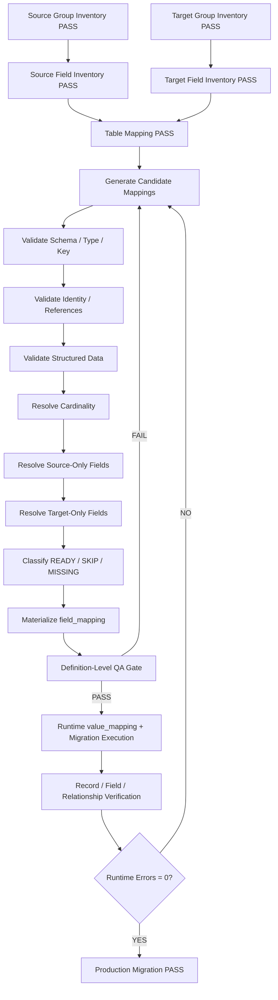

# Migration Field Mapping Generation Plan

## Purpose

> **Goal: generate a reusable, reviewable, database-ready field mapping that accounts for 100% of source physical fields, resolves 100% of required target physical fields, and classifies every mapping row as `READY`, `SKIP`, or `MISSING`.**

Use the companion template:

- [`../templates/database-migration-field-mapping-template.md`](../templates/database-migration-field-mapping-template.md)

Required prerequisite tutorials:

- [`migration-group-generation-plan.md`](./migration-group-generation-plan.md)
- [`migration-field-generation-plan.md`](./migration-field-generation-plan.md)

Recommended companion contract:

- [`migration-contract-generation-plan.md`](./migration-contract-generation-plan.md)

This is a **definition-level field-mapping guarantee**. Production PASS still requires runtime ID/value mapping, record accounting, execution, and verification.

---

# 1. Required Inputs

The following must exist before field mapping is generated:

| Input | Requirement |
|---|---|
| Source group manifest | `PASS` |
| Source field inventory | `PASS` |
| Target group manifest | `PASS` |
| Target field inventory | `PASS` |
| Table mapping document | `PASS` |
| Migration contract | Recommended / normally required |
| Source schema authority | Explicit |
| Target schema authority | Explicit |

Hard prerequisite gate:

```text
Source tables inventoried              = 100%
Source fields inventoried              = 100%
Target tables inventoried              = 100%
Target fields inventoried              = 100%
Source table mapping decisions         = 100%
Unknown source schema objects          = 0
Unknown target schema objects          = 0
Unclassified schema deviations         = 0
```

Do not generate field mapping from field-name similarity alone.

---

# 2. Correct Meaning of 100% Field Mapping

Coverage is based on distinct physical field identities, not raw mapping-row count.

```text
SOURCE COVERAGE
Distinct source physical fields accounted = 100%
Unmapped source fields                     = 0
Silent source-field drops                  = 0

TARGET COVERAGE
Required target physical fields resolved   = 100%
Unresolved required target fields          = 0
Unknown target strategy                    = 0

FIELD STATUS
Rows classified                            = 100%
Allowed values                              = READY / SKIP / MISSING
Invalid/null field status                  = 0
```

Reusable mapping must support:

```text
ONE_TO_ONE
ONE_TO_MANY
MANY_TO_ONE
MANY_TO_MANY
ONE_TO_NONE
NONE_TO_ONE
```

---

# 3. Build Source and Target Field Universes

Canonical identities:

```text
SOURCE_FIELD_KEY = (source_version, source_table, source_field)
TARGET_FIELD_KEY = (target_version, target_table, target_field)
```

Every physical field must be explicit. Wildcards such as `all *_id fields`, `other fields`, or `...` are forbidden in final mapping output.

Physical schema metadata remains authoritative in `migration_inventory.field_inventory`.

At minimum preserve/query:

```text
table_name
column_name
ordinal_position
DATA_TYPE
COLUMN_TYPE
length / precision / scale
nullable
default
generated / identity semantics
charset / collation
key role
index memberships
physical FK metadata
schema evidence/source
```

---

# 4. Join Source Fields to Table Mapping

For every source physical field:

```text
source field
    ↓
source table
    ↓
table_mapping
    ↓
target table / archive / ignore / rebuild destination
```

Hard invariant:

```text
Distinct source fields with table mapping
=
Distinct source fields in source universe
```

Table-level inheritance applies where appropriate:

```text
Table IGNORE  → field IGNORE unless approved exception
Table ARCHIVE → field ARCHIVE unless approved exception
Table REBUILD → field REBUILD unless approved exception
```

---

# 5. Allowed Final Field Decisions

Canonical decisions:

```text
DIRECT
TRANSFORM
LOOKUP
STRUCTURED
GENERATED
REBUILD
REFERENCE_ONLY
ARCHIVE
IGNORE
DEFAULT
TARGET_OWNED
RECREATE
```

Invalid final decisions:

```text
UNKNOWN
PENDING
REVIEW
OPTIONAL
SELECTIVE
UNMAPPED
AMBIGUOUS
TBD
A / B
COPY?
```

Any invalid final decision blocks PASS.

---

# 6. Deterministic Mapping Precedence

Apply the first valid rule:

```text
1. Explicit evidence-backed field override
2. Parent-table IGNORE / ARCHIVE / REBUILD inheritance
3. Identity/reference requiring remap → LOOKUP
4. Structured/embedded references → STRUCTURED
5. Generated/derived/recreated target state → GENERATED / REBUILD / RECREATE
6. Explicit rename/semantic transform → TRANSFORM
7. Same-purpose scalar + all compatibility checks PASS → DIRECT
8. Source field has no active target representation → ARCHIVE / IGNORE / TRANSFORM elsewhere / REFERENCE_ONLY / REBUILD
9. Nothing matches → CONTRACT ERROR
```

Hard rules:

```text
same name != DIRECT proof
same SQL type != semantic compatibility proof
same numeric ID != identity equivalence proof
```

---

# 7. Mapping Cardinality

Supported cardinalities:

```text
ONE_TO_ONE
ONE_TO_MANY
MANY_TO_ONE
MANY_TO_MANY
ONE_TO_NONE
NONE_TO_ONE
```

Use a stable `mapping_group_key` for grouped transformations.

Example:

```text
mapping_group_key = MG_CUSTOMER_DISPLAY_NAME
mapping_cardinality = MANY_TO_ONE
```

Legitimate grouped rows are not duplicate mapping errors.

---

# 8. Row Kind

Recommended row kinds:

```text
SOURCE_MAPPING
TARGET_RESOLUTION
```

`SOURCE_MAPPING` accounts for a physical source field.

`TARGET_RESOLUTION` resolves a target-only field without inventing a fake source field.

Examples:

```text
old.title → new.title → SOURCE_MAPPING
no source → new.created_at DEFAULT → TARGET_RESOLUTION
```

---

# 9. Field Readiness Status

Every generated row must contain exactly one:

```text
field_status
```

Allowed values are exactly:

```text
READY
SKIP
MISSING
```

`field_status` is separate from:

```text
mapping_type
row_kind
mapping_cardinality
lifecycle status such as DRAFT / FINAL
coverage_status
```

## 9.1 READY

Use `READY` only when:

```text
source physical field exists
AND target physical field exists
AND final mapping decision exists
AND required transform/reference/parser rules exist
AND verification rule exists
```

Examples:

```text
title    → title    | READY | DIRECT
asset_id → asset_id | READY | LOOKUP
params   → params   | READY | STRUCTURED
```

`READY` does not mean `DIRECT`; transformed, lookup, and structured mappings can also be READY.

## 9.2 SKIP

Use `SKIP` when migration intentionally performs no active mapping/copy for a known field pair.

Required:

```text
explicit reason
explicit accounting behavior
approved final mapping decision
```

Typical case:

```text
mapping_type = IGNORE
```

Example:

```text
legacy_cache → legacy_cache | SKIP | IGNORE
```

Never use `SKIP` to hide:

```text
unknown mapping
missing field
failed lookup
missing transform rule
```

## 9.3 MISSING

Use `MISSING` when exactly one physical side does not exist.

```text
source exists + target absent = MISSING
source absent + target exists = MISSING
```

`MISSING` is a physical-presence classification. It does **not** automatically mean failed or unresolved.

Source-only examples:

```text
otpKey → — | MISSING | ARCHIVE
legacy_state → — | MISSING | TRANSFORM elsewhere
runtime_token → — | MISSING | IGNORE
```

Target-only examples:

```text
— → created_at  | MISSING | DEFAULT
— → workflow_id | MISSING | GENERATED
— → new_config  | MISSING | TARGET_OWNED
```

Every MISSING row still requires an explicit outcome and reason.

## 9.4 Deterministic status precedence

Generate `field_status` in this order:

```text
1. Exactly one physical side is absent
   → MISSING

2. Both sides exist and approved rule intentionally skips active mapping/copy
   → SKIP

3. Both sides exist and mapping is executable + verifiable
   → READY

4. Otherwise
   → CONTRACT ERROR
```

Do not generate a fourth persisted status such as `UNKNOWN` or `PENDING`.

Consistency gate:

```text
field_status classified                  = 100%
invalid/null field_status                = 0
READY with missing physical side         = 0
MISSING with both physical sides present = 0
MISSING with both physical sides absent  = 0
SKIP without explicit reason             = 0
SKIP used to hide unresolved mapping     = 0
```

---

# 10. Source-Only Field Anti-Join

Compute:

```text
SOURCE FIELD UNIVERSE
-
SOURCE FIELDS WITH ACTIVE TARGET REPRESENTATION
=
SOURCE-ONLY FIELD SET
```

Every source-only field must use:

```text
field_status = MISSING
```

and one explicit outcome:

```text
ARCHIVE
IGNORE
TRANSFORM elsewhere
REFERENCE_ONLY
REBUILD
```

Required metadata:

```text
final decision
reason
destination/accounting rule
verification rule
```

Forbidden:

```text
silent DROP
```

Gate:

```text
Source-only fields discovered           = 100%
Source-only fields resolved             = 100%
Source-only fields marked MISSING       = 100%
Silent source-only drops                = 0
```

---

# 11. Target-Only Field Anti-Join

Compute:

```text
TARGET FIELD UNIVERSE
-
TARGET FIELDS POPULATED/RESOLVED FROM SOURCE
=
TARGET-ONLY FIELD SET
```

Every target-only field must use:

```text
field_status = MISSING
```

and one explicit resolution:

```text
DEFAULT
GENERATED
TARGET_OWNED
RECREATE
LOOKUP
REBUILD
NOT_REQUIRED_BY_SCOPE
```

Gate:

```text
Target-only fields discovered           = 100%
Target-only fields classified           = 100%
Target-only fields marked MISSING       = 100%
Required target fields resolved         = 100%
Unresolved required target fields       = 0
Unknown target strategy                 = 0
```

---

# 12. Identity, References, and Structured Data

For identities, determine:

```text
identity_strategy
identity_domain
```

Recommended strategies:

```text
ID_MAP
SEMANTIC_LOOKUP
NATURAL_KEY_LOOKUP
GENERATED_ID
PRESERVE_ID_WITH_COLLISION_GATE
NONE
```

Never assume source numeric IDs equal target numeric IDs.

Reference types:

```text
PHYSICAL_FK
LOGICAL_FK
POLYMORPHIC
EMBEDDED_REFERENCE
SEMANTIC_REFERENCE
NONE
```

Structured fields must define parser/serializer/reference/verification rules. Blind raw-string ID replacement and silent parse failure are forbidden.

---

# 13. Type and Constraint Compatibility

A `DIRECT` mapping is permitted only after validating:

```text
semantic purpose
raw/full SQL type
length
precision / scale
signedness
NULLability
default behavior
charset / collation
generated/identity semantics
PK / UNIQUE / FK / CHECK constraints
```

Examples requiring review:

```text
VARCHAR(500) → VARCHAR(255)
INT → UNSIGNED INT
DECIMAL(18,6) → DECIMAL(10,2)
nullable → NOT NULL
case-insensitive → case-sensitive unique target
```

Required gate:

```text
Unsafe DIRECT mappings                 = 0
Silent truncation/coercion paths       = 0
PK collisions                          = 0
UNIQUE collisions                      = 0
Constraint violations                  = 0
```

---

# 14. Canonical Mapping Record

Recommended attributes:

```text
row_kind
source_version
source_table
source_field
target_version
target_table
target_field
mapping_group_key
mapping_cardinality
mapping_type
field_status
identity_strategy
reference_type
reference_domain
parser_rule
transform_rule
verification_rule
rule_origin
evidence
reason
execution_order
status
```

Recommended logical separation:

```text
migration_inventory.field_inventory
    = physical schema facts

migration_mapping.field_mapping
    = mapping decisions + field_status

migration_mapping.value_mapping
    = runtime/design-time ID/value translations

migration_inventory.table_dependency
    = dependency graph
```

---

# 15. Recommended Display Table

Generated Markdown should expose `Field Status` directly:

| Source | S.Type | S.Key | Target | T.Type | T.Key | Field Status | Card. | M | Ref | Domain | Rule | Verify |
|---|---|---|---|---|---|---|---|---|---|---|---|---|
| `{{SOURCE_FIELD}}` | `{{SOURCE_TYPE}}` | `{{SOURCE_KEY}}` | `{{TARGET_FIELD}}` | `{{TARGET_TYPE}}` | `{{TARGET_KEY}}` | `{{FIELD_STATUS}}` | `{{CARDINALITY}}` | `{{MAPPING_TYPE}}` | `{{REFERENCE_TYPE}}` | `{{DOMAIN}}` | `{{RULE}}` | `{{VERIFY}}` |

For compact generated documents it is acceptable to use:

```text
Source | Target | Status | M | X
```

where `Status` is always one of `READY`, `SKIP`, `MISSING`.

---

# 16. Generation and Materialization Sequence

```text
source field inventory
      +
target field inventory
      +
table mapping
      +
generic rules
      +
migration profile
      +
explicit overrides
      ↓
candidate mappings
      ↓
validate schema / type / key / references / structured data
      ↓
resolve cardinality
      ↓
resolve source-only fields
      ↓
resolve target-only fields
      ↓
classify READY / SKIP / MISSING
      ↓
materialize field_mapping
      ↓
definition-level QA
```

Use an idempotent seed/materialization process.

---

# 17. Field Status QA

Allowed-value query:

```sql
SELECT
    field_status,
    COUNT(*) AS mapping_rows
FROM migration_mapping.field_mapping
WHERE migration_run_id = :migration_run_id
GROUP BY field_status
ORDER BY field_status;
```

Invalid/null query:

```sql
SELECT *
FROM migration_mapping.field_mapping
WHERE migration_run_id = :migration_run_id
  AND (
      field_status IS NULL
      OR field_status NOT IN ('READY', 'SKIP', 'MISSING')
  );
```

Expected result: **0 rows**.

Required semantic QA:

```text
READY + missing source/target side      = 0
MISSING + both sides present            = 0
MISSING + both sides absent             = 0
SKIP + missing reason                   = 0
MISSING + missing resolution/reason     = 0
```

---

# 18. Decision Quality QA

Reject unresolved mapping decisions:

```sql
SELECT *
FROM migration_mapping.field_mapping
WHERE migration_run_id = :migration_run_id
  AND (
       mapping_type IS NULL
       OR UPPER(mapping_type) IN (
          'UNKNOWN','PENDING','REVIEW','OPTIONAL','SELECTIVE',
          'UNMAPPED','AMBIGUOUS','TBD'
       )
  );
```

Expected result: **0 rows**.

Additional gates:

```text
LOOKUP without reference domain         = 0
STRUCTURED without parser/rule          = 0
TRANSFORM without transform rule        = 0
ARCHIVE without destination/accounting  = 0
IGNORE without reason                   = 0
GENERATED without generation rule       = 0
RECREATE without recreation rule        = 0
```

---

# 19. Verification Rule Contract

Every final mapping must be verifiable.

```text
DIRECT
→ NULL-safe expected = actual

TRANSFORM
→ expected transform result = target

LOOKUP
→ target identity exists; missing/ambiguous = 0

STRUCTURED
→ parse/remap/reparse succeeds; unresolved refs = 0

GENERATED
→ deterministic generation + target validation

REBUILD
→ target rebuild/integrity verification

REFERENCE_ONLY
→ semantic identity uniquely resolves

ARCHIVE
→ source value accounting + archive evidence

IGNORE
→ reason + source accounting

DEFAULT
→ approved target default verified

TARGET_OWNED
→ target-owned value/state validated

RECREATE
→ recreated target state verified
```

---

# 20. Definition-Level Checklist

## Coverage

- [ ] Source fields inventoried = 100%
- [ ] Target fields inventoried = 100%
- [ ] Source field mapping/accounting = 100%
- [ ] Required target field resolution = 100%
- [ ] Silent source drops = 0

## Field status

- [ ] Every row has exactly one `field_status`
- [ ] Allowed values only: READY / SKIP / MISSING
- [ ] READY rows have both physical sides present
- [ ] READY rows have complete executable + verification rules
- [ ] SKIP rows have explicit reasons
- [ ] MISSING rows have exactly one physical side absent
- [ ] MISSING rows have explicit mapping/accounting outcomes
- [ ] MISSING is not automatically treated as failure
- [ ] Invalid/null field status = 0

## Mapping quality

- [ ] Invalid mapping decisions = 0
- [ ] Unknown cardinality = 0
- [ ] Invalid mapping groups = 0
- [ ] Missing required rule evidence = 0

## Schema / identity / relationships

- [ ] Unsafe DIRECT = 0
- [ ] Ambiguous identity matches = 0
- [ ] PK/UNIQUE collisions = 0
- [ ] Missing required reference domains = 0
- [ ] Broken required relationships = 0
- [ ] Structured fields without parser/rule = 0

## Materialization

- [ ] `field_mapping` includes `field_status`
- [ ] `field_inventory` remains physical schema source of truth
- [ ] `value_mapping` remains ID/value mapping store
- [ ] Seed/materialization is idempotent

---

# 21. Final Definition-Level Gate

```text
BASELINE / INVENTORY
--------------------------------------------------
Source tables inventoried                   = 100%
Source fields inventoried                   = 100%
Target tables inventoried                   = 100%
Target fields inventoried                   = 100%
Unknown schema objects                      = 0

SOURCE / TARGET COVERAGE
--------------------------------------------------
Distinct source fields accounted            = 100%
Unmapped source fields                      = 0
Silent source-field drops                   = 0
Required target fields resolved             = 100%
Unresolved required target fields           = 0

FIELD STATUS
--------------------------------------------------
Field status classified                     = 100%
Invalid/null field status                   = 0
READY with missing physical side            = 0
MISSING with both physical sides present    = 0
MISSING with both physical sides absent     = 0
SKIP without explicit reason                = 0

MAPPING QUALITY
--------------------------------------------------
Final mapping decisions                     = 100%
Invalid/unknown/pending decisions            = 0
Unknown cardinality                         = 0
Invalid mapping groups                      = 0

SCHEMA / IDENTITY / REFERENCES
--------------------------------------------------
Unsafe DIRECT mappings                      = 0
Ambiguous identity matches                  = 0
PK/UNIQUE collisions                        = 0
Missing required reference domains          = 0
Broken required relationships               = 0
Unresolved embedded references              = 0

VERIFICATION / MATERIALIZATION
--------------------------------------------------
Mappings with verification rule             = 100%
Unverifiable final mappings                 = 0
Missing materialized source coverage        = 0
Missing materialized target resolution      = 0

==================================================
FIELD MAPPING CONTRACT                       = PASS
==================================================
```

Required successful wording:

> **100% of source physical fields are explicitly accounted for, 100% of required target physical fields have an explicit resolution, and every mapping row is classified as READY, SKIP, or MISSING. MISSING identifies a physical source/target asymmetry and does not itself imply failure when an explicit resolution exists.**

---

# 22. Production Boundary

Definition-level PASS does not mean production migration has already succeeded.

Production PASS additionally requires:

```text
actual source schema reconciliation       = PASS
actual target schema reconciliation       = PASS
runtime ID/value mapping                  = PASS
source record accounting                  = 100%
missing expected records                  = 0
unexpected records                        = 0
field value mismatches                    = 0
broken required relationships             = 0
constraint violations                     = 0
structured-data verification errors       = 0
migration execution errors                = 0
rerun/idempotency checks                  = PASS
```

---

# 23. End-to-End Reusable Flow



This is the reusable standard for future field-mapping migrations.