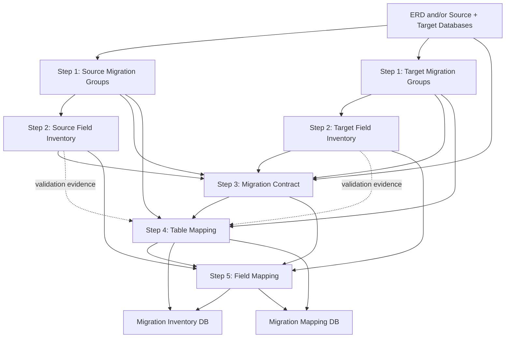

# Migration Mapping Plan Tutorial

> Build a complete, reusable migration-mapping package from an **ERD and/or database schema**, then materialize table and field mappings for the migration inventory and mapping database.

## Overview

- [Input Data](#input-data)
- [End-to-End Flow](#end-to-end-flow)
- [Step 1 — Generate Migration Group Tables](#step-1--generate-migration-group-tables)
- [Step 2 — Generate Migration Field Inventories](#step-2--generate-migration-field-inventories)
- [Step 3 — Generate the Migration Contract](#step-3--generate-the-migration-contract)
- [Step 4 — Generate the Table Mapping](#step-4--generate-the-table-mapping)
- [Step 5 — Generate the Field Mapping](#step-5--generate-the-field-mapping)
- [Required Naming Convention](#required-naming-convention)
- [Final Artifact Set](#final-artifact-set)
- [Final Mapping Gate](#final-mapping-gate)

---

## Input Data

The workflow can start from either of these inputs:

```text
ERD
or
Database / schema
or
ERD + Database / schema
```

### Recommended priority

```text
Actual database/schema metadata
        ↓
Authoritative installation / migration DDL
        ↓
ERD
        ↓
Documentation / notes
```

An ERD is useful for understanding relationships and migration scope, but it may omit physical columns, indexes, defaults, generated columns, logical references, or production-only schema changes.

For a production claim of **100% inventory and mapping coverage**, reconcile the generated artifacts against the actual source and target databases before execution.

Useful database evidence includes:

```text
information_schema.TABLES
information_schema.COLUMNS
information_schema.STATISTICS
information_schema.KEY_COLUMN_USAGE
SHOW CREATE TABLE
```

---

## End-to-End Flow



### Workflow rule

Each step produces an artifact that becomes input to the next step.

```text
GROUP INVENTORY PASS
        ↓
FIELD INVENTORY PASS
        ↓
MIGRATION CONTRACT
        ↓
TABLE MAPPING PASS
        ↓
FIELD MAPPING PASS
```

Do not generate final mappings from guessed table or field sets.

---

# Step 1 — Generate Migration Group Tables

## Goal

Generate a complete migration-group/table manifest for both the **source** and **target** schemas.

### Use this plan

[`migration-group-generation-plan.md`](./migration-group-generation-plan.md)

### Use this template

[`database-migration-groups-template.md`](../templates/database-migration-groups-template.md)

## Input

```text
ERD and/or database schema
source or target system/version
migration scope
schema authority / DDL when available
```

Run the process twice:

```text
SOURCE → migration group manifest
TARGET → migration group manifest
```

## Recommended outputs

```text
<scope>-migration-groups-<source-version>.md
<scope>-migration-groups-<target-version>.md
```

Example:

```text
joomla-core-migration-groups-v3.md
joomla-core-migration-groups-v6.md
```

## Reference examples

- [Joomla 3 core migration groups](../01-joomla-core-migration-groups-v3.md)
- [Joomla 6 core migration groups](../02-joomla-core-migration-groups-v6.md)

## Required coverage

The generated files must explicitly classify every physical table in the declared scope.

```text
Source tables discovered/classified = 100%
Target tables discovered/classified = 100%
Missing tables                      = 0
Duplicate tables                    = 0
Unknown ownership                   = 0
Wildcard final table entries        = 0
```

### Step 1 PASS

```text
SOURCE MIGRATION GROUP = PASS
TARGET MIGRATION GROUP = PASS
```

These files become the authoritative table universes used by the following steps.

---

# Step 2 — Generate Migration Field Inventories

## Goal

Generate complete physical field inventories for every table that passed Step 1.

### Use this plan

[`migration-field-generation-plan.md`](./migration-field-generation-plan.md)

### Use this template

[`database-migration-field-inventory-template.md`](../templates/database-migration-field-inventory-template.md)

## Input

```text
Step 1 source migration-group manifest
Step 1 target migration-group manifest
ERD and/or database schema
schema DDL / authoritative schema evidence
```

Run the process twice:

```text
SOURCE groups → SOURCE field inventory
TARGET groups → TARGET field inventory
```

## Recommended outputs

```text
<scope>-migration-fields-<source-version>.md
<scope>-migration-fields-<target-version>.md
```

Example:

```text
joomla-core-migration-fields-v3.md
joomla-core-migration-fields-v6.md
```

## Reference examples

- [Joomla 3 core migration fields](../03-joomla-core-migration-fields-v3.md)
- [Joomla 6 core migration fields](../04-joomla-core-migration-fields-v6.md)

## Required field information

For each physical field preserve enough schema metadata to validate migration compatibility:

```text
table
field
ordinal position
DATA_TYPE
COLUMN_TYPE
length / precision / scale
nullable
default
generated / identity / auto-increment state
charset / collation
PK / COMPOSITE_PK / UNIQUE / INDEX information
physical FK metadata when declared
schema evidence
```

Logical and embedded references may be annotated here when known, but their final migration decision belongs in the field-mapping step.

## Required coverage

```text
Source physical fields inventoried       = 100%
Target physical fields inventoried       = 100%
Unique source (table, field) pairs       = 100%
Unique target (table, field) pairs       = 100%
Missing fields                           = 0
Duplicate fields                         = 0
Unexplained schema deviations            = 0
```

### Step 2 PASS

```text
SOURCE FIELD INVENTORY = PASS
TARGET FIELD INVENTORY = PASS
```

At this point, the migration has four schema artifacts:

```text
1. Source migration groups
2. Target migration groups
3. Source field inventory
4. Target field inventory
```

---

# Step 3 — Generate the Migration Contract

## Goal

Create the migration decision contract that defines how source and target schema/data are allowed to be handled.

### Use this plan

[`migration-contract-generation-plan.md`](./migration-contract-generation-plan.md)

### Use this template

[`database-migration-contract-template.md`](../templates/database-migration-contract-template.md)

## Input

```text
Source migration-group manifest
Target migration-group manifest
Source migration-field inventory
Target migration-field inventory
ERD and/or source + target databases
business / application migration rules
```

The ERD/database evidence is still relevant here because schema identity alone does not prove migration semantics.

The contract must define the controlled decisions used later by table and field mappings, for example:

```text
DIRECT
TRANSFORM
LOOKUP
STRUCTURED
DEFAULT
GENERATED
REBUILD
REFERENCE_ONLY
ARCHIVE
IGNORE
TARGET_OWNED
RECREATE
```

Unresolved final decisions such as the following are forbidden:

```text
UNKNOWN
PENDING
REVIEW
OPTIONAL
UNMAPPED
AMBIGUOUS
TBD
A / B
```

## Recommended output

```text
<scope>-migration-contract.md
```

Example:

```text
joomla-core-j3-j6-migration-contract.md
```

## Reference example

- [Joomla 3 → Joomla 6 core migration contract](../05-joomla-core-j3-j6-migration-contract.md)

## Required contract coverage

The contract must establish rules for at least:

```text
source table accounting
source field accounting
target-only structures
target-only fields
ID / identity mapping
value mapping
physical + logical references
structured values
source-only data
runtime / generated / security data
dependencies
record accounting
verification / error handling
```

### Step 3 PASS condition

The contract is ready to drive mapping when:

```text
Schema baseline established             = YES
Allowed final decisions defined         = YES
Invalid final states forbidden          = YES
Table/field accounting rules defined    = YES
ID/value/reference rules defined        = YES
Verification gates defined              = YES
```

> The migration contract defines the rules. Steps 4 and 5 materialize those rules into explicit table and field mappings.

---

# Step 4 — Generate the Table Mapping

## Goal

Generate the table-level mapping file used to populate or validate the **migration inventory** and **migration mapping database**.

## Input

Primary inputs:

```text
Source migration-group manifest
Target migration-group manifest
Migration contract
```

Validation evidence already available from Step 2:

```text
Source field inventory
Target field inventory
ERD and/or database schema
```

The field inventories are useful for confirming that two same-name tables are genuinely compatible and for detecting structural changes that require `TRANSFORM`, `REBUILD`, or another explicit decision.

## Use this tutorial

Use the rules in **Step 4 of this file**:

[`migration-mapping-plan-tutorial.md`](#step-4--generate-the-table-mapping)

## Use this template

The repository template name is:

[`database-migration-table-mapping-template.md`](../templates/database-migration-table-mapping-template.md)

> This is the canonical table-mapping template. Use this repository filename instead of informal names such as `table-mapping-migration-templace.md`.

## Required output filename

The generated mapping file **must use the migration scope as a prefix**:

```text
<scope>-table-mapping-migration.md
```

Examples:

```text
hikashop-table-mapping-migration.md
acymailing-table-mapping-migration.md
joomla-core-table-mapping-migration.md
```

Do not generate generic filenames such as:

```text
table-mapping-migration.md
```

when multiple migration scopes may coexist in the repository or mapping database.

## Reference example

- [Joomla core table mapping](../06-joomla-core-table-mapping-migration.md)

The Joomla core file predates the scope-prefix convention; new generated mapping files should follow the scoped filename rule above.

## Required table mapping cases

Account for all relevant structural cases:

```text
ONE_TO_ONE
ONE_TO_MANY
MANY_TO_ONE
source-only table
target-only table
renamed table
restructured table
DIRECT
TRANSFORM
LOOKUP
REBUILD
GENERATED
RECREATE
REFERENCE_ONLY
TARGET_OWNED
ARCHIVE
IGNORE
```

## Table mapping gate

```text
Distinct source tables accounted        = 100%
Missing source table decisions          = 0
Ambiguous source table decisions        = 0
Invalid final decisions                 = 0
Target-only tables discovered           = 100%
Target-only tables classified           = 100%
Unresolved required target tables       = 0
Unverifiable mappings                   = 0
```

### Step 4 PASS

```text
TABLE MAPPING = PASS
```

The generated file now becomes a required dependency for field mapping.

---

# Step 5 — Generate the Field Mapping

## Goal

Generate the field-level mapping file used to populate or validate the **migration inventory** and **migration mapping database**.

## Input

Primary inputs requested by this workflow:

```text
Source migration-field inventory
Target migration-field inventory
Migration contract
```

Mandatory dependency from Step 4:

```text
Table mapping = PASS
```

The table mapping is mandatory because field mapping must not guess the target table independently.

## Use this plan

[`migration-field-mapping-generation-plan.md`](./migration-field-mapping-generation-plan.md)

## Use this template

[`database-migration-field-mapping-template.md`](../templates/database-migration-field-mapping-template.md)

## Required output filename

The generated mapping file **must use the migration scope as a prefix**:

```text
<scope>-field-mapping-migration.md
```

Examples:

```text
hikashop-field-mapping-migration.md
acymailing-field-mapping-migration.md
joomla-core-field-mapping-migration.md
```

Do not use an unscoped generic filename when multiple migrations may exist:

```text
field-mapping-migration.md
```

## Reference example

- [Joomla core field mapping](../09-joomla-core-field-mapping-migration.md)

The Joomla core example predates the scope-prefix convention; new generated files should use the scoped filename rule.

## 100% source coverage rule

For a reusable migration framework, do not define coverage only as:

```text
mapping row count = source field count
```

The mapper must support:

```text
ONE_TO_ONE
ONE_TO_MANY
MANY_TO_ONE
MANY_TO_MANY
ONE_TO_NONE
NONE_TO_ONE
```

The correct source gate is:

```text
Distinct source physical fields accounted = 100%
Unmapped source fields                     = 0
Silent source-field drops                  = 0
```

## Required field mapping information

Every mapping must be able to resolve or validate:

```text
source table / field
source DATA_TYPE / COLUMN_TYPE
source null/default
source PK / COMPOSITE_PK / UNIQUE / INDEX role
source identity/reference semantics

target table / field
target DATA_TYPE / COLUMN_TYPE
target null/default
target PK / COMPOSITE_PK / UNIQUE / INDEX role
target identity/reference semantics

mapping cardinality
mapping decision
identity strategy
reference type
reference domain
parser / structured rule
transform rule
verification rule
reason / evidence
```

## Reference classifications

Do not use only `FK = YES/NO`.

Use explicit reference types:

```text
PHYSICAL_FK
LOGICAL_FK
POLYMORPHIC
EMBEDDED_REFERENCE
SEMANTIC_REFERENCE
NONE
```

## Source-only anti-join

```text
SOURCE FIELD UNIVERSE
-
SOURCE FIELDS WITH ACTIVE TARGET REPRESENTATION
=
SOURCE-ONLY FIELDS
```

Required:

```text
Source-only fields discovered = 100%
Source-only fields resolved   = 100%
Silent source-only drops      = 0
```

Every source-only field must explicitly resolve to an approved outcome such as:

```text
TRANSFORM elsewhere
ARCHIVE
IGNORE
REFERENCE_ONLY
REBUILD
```

## Target-only anti-join

```text
TARGET FIELD UNIVERSE
-
TARGET FIELDS POPULATED/RESOLVED FROM SOURCE
=
TARGET-ONLY FIELDS
```

Every required target-only field must have an explicit strategy such as:

```text
DEFAULT
GENERATED
TARGET_OWNED
RECREATE
LOOKUP
REBUILD
NOT_REQUIRED_BY_SCOPE
```

## Field mapping gate

```text
Distinct source fields accounted       = 100%
Unmapped source fields                 = 0
Silent source-field drops              = 0

Required target fields resolved        = 100%
Unresolved required target fields      = 0
Unknown target strategy                = 0

Unsafe DIRECT mappings                 = 0
Missing required reference domains     = 0
Invalid mapping cardinality/groups     = 0
Unresolved PK/UNIQUE collisions        = 0
Structured mappings missing rules      = 0
Unverifiable final mappings            = 0
```

### Step 5 PASS

```text
FIELD MAPPING = PASS
```

---

# Required Naming Convention

The migration scope name must prefix both generated mapping files.

| Migration scope | Table mapping | Field mapping |
|---|---|---|
| HikaShop | `hikashop-table-mapping-migration.md` | `hikashop-field-mapping-migration.md` |
| AcyMailing | `acymailing-table-mapping-migration.md` | `acymailing-field-mapping-migration.md` |
| Joomla Core | `joomla-core-table-mapping-migration.md` | `joomla-core-field-mapping-migration.md` |
| Custom component `cars` | `cars-table-mapping-migration.md` | `cars-field-mapping-migration.md` |

Recommended filename normalization:

```text
lowercase
kebab-case
no spaces
stable scope name
```

Pattern:

```text
<scope>-table-mapping-migration.md
<scope>-field-mapping-migration.md
```

This prevents collisions when several extension/core migration mappings are stored in the same folder or loaded into the same mapping database.

---

# Final Artifact Set

After all five steps, a complete migration mapping package should contain at least:

```text
<scope>-migration-groups-<source-version>.md
<scope>-migration-groups-<target-version>.md

<scope>-migration-fields-<source-version>.md
<scope>-migration-fields-<target-version>.md

<scope>-migration-contract.md

<scope>-table-mapping-migration.md
<scope>-field-mapping-migration.md
```

Example for HikaShop:

```text
hikashop-migration-groups-source.md
hikashop-migration-groups-target.md

hikashop-migration-fields-source.md
hikashop-migration-fields-target.md

hikashop-migration-contract.md

hikashop-table-mapping-migration.md
hikashop-field-mapping-migration.md
```

The two mapping files are the primary static specifications used to materialize or validate the migration mapping database. Runtime ID/value translations are still produced during migration and belong in `value_mapping` or the equivalent runtime mapping store.

---

# Final Mapping Gate

Do not declare the mapping package complete until all of the following are true:

```text
GROUP INVENTORY
--------------------------------------------------
Source tables inventoried/classified       = 100%
Target tables inventoried/classified       = 100%
Missing/unknown tables                     = 0

FIELD INVENTORY
--------------------------------------------------
Source physical fields inventoried         = 100%
Target physical fields inventoried         = 100%
Missing/duplicate field inventory rows     = 0

MIGRATION CONTRACT
--------------------------------------------------
Canonical decisions defined                = YES
Unknown/pending/ambiguous final states      = 0
ID/value/reference rules defined           = 100%
Verification gates defined                 = YES

TABLE MAPPING
--------------------------------------------------
Distinct source tables accounted           = 100%
Target-only tables resolved                = 100%
Missing/ambiguous/unverifiable mappings     = 0

FIELD MAPPING
--------------------------------------------------
Distinct source fields accounted           = 100%
Source-only fields resolved                = 100%
Required target fields resolved            = 100%
Target-only required fields resolved       = 100%
Silent field drops                         = 0
Unsafe DIRECT                              = 0
Missing reference domains                  = 0
Invalid mapping groups/cardinality         = 0
Unresolved constraint collisions           = 0
Unverifiable field mappings                = 0

==================================================
MIGRATION MAPPING PACKAGE                  = PASS
==================================================
```

> **Definition-level PASS means the complete declared source and target schema scope is explicitly inventoried and mapped. Production migration success still requires actual database reconciliation, runtime `value_mapping`, record accounting, execution, and post-migration verification.**
