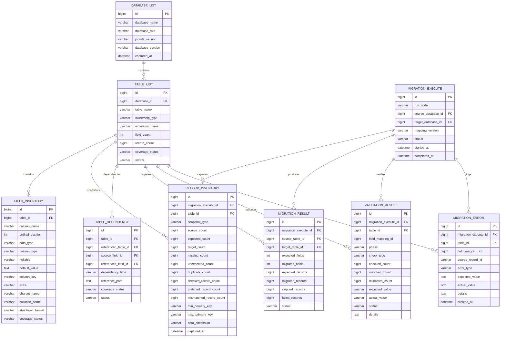
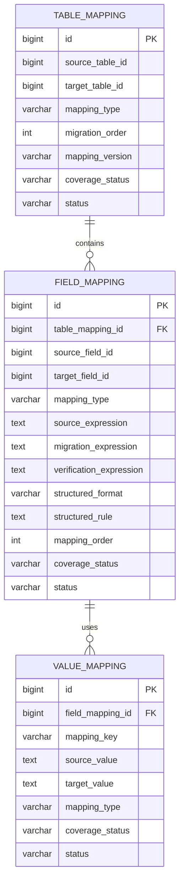

# End-to-End Database Migration Workflow Tutorial

> Build a controlled migration from an **old/source database** to a **new/target database** by first creating inventory and mapping artifacts, then materialize those artifacts into migration metadata databases, validate them, execute migration scripts, and finally prove that every in-scope table, field, record, dependency, and mapping decision is accounted for.

---

## Overview

- [Migration Model](#migration-model)
- [Core Databases](#core-databases)
- [Migration Control Database ERDs](#migration-control-database-erds)
- [End-to-End Flow](#end-to-end-flow)
- [Step 1 — Create Inventory and Mapping Markdown Artifacts](#step-1--create-inventory-and-mapping-markdown-artifacts)
- [Step 2 — Define and Create the Inventory and Mapping Databases](#step-2--define-and-create-the-inventory-and-mapping-databases)
- [Step 3 — Seed Inventory and Mapping Data from the Markdown Artifacts](#step-3--seed-inventory-and-mapping-data-from-the-markdown-artifacts)
- [Step 3A — Run the Pre-Migration Verification Gate](#step-3a--run-the-pre-migration-verification-gate)
- [Step 4 — Generate and Execute Migration Scripts](#step-4--generate-and-execute-migration-scripts)
- [Step 5 — Verify the Completed Migration](#step-5--verify-the-completed-migration)
- [Reference Artifact Set](#reference-artifact-set)
- [Recommended Repository Layout](#recommended-repository-layout)
- [Final 100% Accounting Gate](#final-100-accounting-gate)
- [Master Checklist](#master-checklist)

---

# Migration Model

This workflow always has two application databases:

| Role | Meaning |
|---|---|
| **Source database** | The old/current database that contains the data to migrate. |
| **Target database** | The new database/schema/version that should receive or rebuild the migrated data. |

Two additional migration-control databases are used:

| Database | Purpose |
|---|---|
| `migration_inventory` | Stores discovered database/table/field metadata, dependency metadata, record snapshots, execution results, validation results, and errors. |
| `migration_mapping` | Stores the executable table, field, and value/ID mapping contract used by migration scripts. |

The application data remains in the source and target databases. The migration-control databases store **metadata, decisions, mappings, execution evidence, and verification evidence**.

---

# Core Databases

```text
SOURCE DATABASE
(old/current data)

TARGET DATABASE
(new/destination data)

migration_inventory
- database_list
- table_list
- field_inventory
- record_inventory
- table_dependency
- migration_execute
- migration_result
- validation_result
- migration_error

migration_mapping
- table_mapping
- field_mapping
- value_mapping
```

### Responsibility rule

```text
Source / Target DB
    = business/application data

migration_inventory
    = what exists + what happened + what was verified

migration_mapping
    = how source identities/schema/values resolve into target identities/schema/values
```

Do not duplicate the entire source or target application data into `migration_mapping`.

---

# Migration Control Database ERDs

These two logical ERDs show how the migration metadata is stored and connected. They are the database form of the inventory, mapping, execution, and verification workflow.

## `migration_inventory` ERD



### What this ERD proves

`migration_inventory` is the audit and evidence database:

```text
what exists
+ what was captured
+ what was executed
+ what was validated
+ what failed
```

It does not define how a source table or field should transform. That belongs to `migration_mapping`.

## `migration_mapping` ERD



### What this ERD proves

`migration_mapping` is the executable mapping contract:

```text
table_mapping
    = source table -> target table decision

field_mapping
    = source field -> target field transformation rule

value_mapping
    = source identity/value -> target identity/value resolution
```

The migration runner reads these mappings only after the inventory and mapping coverage gates pass.

---

# End-to-End Flow


The central rule is simple:

```text
NO VERIFIED INVENTORY + MAPPING
            ↓
NO MIGRATION EXECUTION
```

---

# Step 1 — Create Inventory and Mapping Markdown Artifacts

## Goal

Create a complete, human-reviewable migration specification before inserting anything into the migration-control databases.

Use the repository migration framework under:

```text
docs/joomla/learning/database/migration/
```

The main tutorial that explains how to generate the inventory and mapping package is:

- [`migration-mapping-plan-tutorial.md`](./migration-mapping-plan-tutorial.md)

## Required artifact sequence

```text
SOURCE DB / schema
    ↓
Source migration groups
    ↓
Source field inventory

TARGET DB / schema
    ↓
Target migration groups
    ↓
Target field inventory

Source + Target inventories
    ↓
Migration contract
    ↓
Table mapping
    ↓
Field mapping
```

## Required Markdown artifacts

Recommended names:

```text
<scope>-migration-groups-<source-version>.md
<scope>-migration-fields-<source-version>.md

<scope>-migration-groups-<target-version>.md
<scope>-migration-fields-<target-version>.md

<scope>-migration-contract.md
<scope>-table-mapping-migration.md
<scope>-field-mapping-migration.md
```

## Repository examples

The Joomla core migration folder already contains complete examples that can be used as references:

- [`joomla-core-migration-groups-v3.md`](../01-joomla-core-migration-groups-v3.md)
- [`joomla-core-migration-fields-v3.md`](../03-joomla-core-migration-fields-v3.md)
- [`joomla-core-migration-groups-v6.md`](../02-joomla-core-migration-groups-v6.md)
- [`joomla-core-migration-fields-v6.md`](../04-joomla-core-migration-fields-v6.md)
- [`joomla-core-j3-j6-migration-contract.md`](../05-joomla-core-j3-j6-migration-contract.md)
- [`06-joomla-core-table-mapping-migration.md`](../06-joomla-core-table-mapping-migration.md)
- [`09-joomla-core-field-mapping-migration.md`](../09-joomla-core-field-mapping-migration.md)

Reusable templates are available under:

```text
../templates/
```

Important templates:

- [`database-migration-groups-template.md`](../templates/database-migration-groups-template.md)
- [`database-migration-field-inventory-template.md`](../templates/database-migration-field-inventory-template.md)
- [`database-migration-contract-template.md`](../templates/database-migration-contract-template.md)
- [`database-migration-table-mapping-template.md`](../templates/database-migration-table-mapping-template.md)
- [`database-migration-field-mapping-template.md`](../templates/database-migration-field-mapping-template.md)

## Step 1 coverage gate

Before Step 2:

```text
Actual source tables discovered          = 100%
Actual target tables discovered          = 100%
Source tables inventoried                = 100%
Target tables inventoried                = 100%
Source fields inventoried                = 100%
Target fields inventoried                = 100%
Source table mapping decisions           = 100%
Source field mapping decisions           = 100%
Required target tables resolved          = 100%
Required target fields resolved          = 100%

Missing source tables                    = 0
Missing source fields                    = 0
Duplicate inventory entries              = 0
Unknown mapping decisions                = 0
Ambiguous mapping decisions              = 0
Silent source drops                      = 0
```

> Step 1 is a **definition-level** specification. Production execution still requires the remaining gates in this tutorial.

---

# Step 2 — Define and Create the Inventory and Mapping Databases

## Goal

Create the two migration-control databases that will materialize the Markdown specification into queryable, executable data.

The schema itself should first be documented in Markdown and reviewed before DDL is executed.

## 2.1 `migration_inventory`

Recommended logical structure:

```text
migration_inventory
├── database_list
├── table_list
├── field_inventory
├── record_inventory
├── table_dependency
├── migration_execute
├── migration_result
├── validation_result
└── migration_error
```

### Main responsibilities

| Table | Responsibility |
|---|---|
| `database_list` | Registers source/target database identity, role, version, engine, capture time. |
| `table_list` | Stores every discovered physical table and ownership/scope metadata. |
| `field_inventory` | Stores every physical field and schema metadata such as type, nullability, key role, charset/collation. |
| `record_inventory` | Stores source/target record snapshots, counts, checksums, missing/unexpected/duplicate counts. |
| `table_dependency` | Stores physical, logical, polymorphic, embedded, and semantic dependencies. |
| `migration_execute` | Identifies one migration execution/run and mapping version. |
| `migration_result` | Stores per-table execution totals and migration results. |
| `validation_result` | Stores verification checks and pass/fail evidence. |
| `migration_error` | Stores migration/verification errors with source identity and details. |

## 2.2 `migration_mapping`

Recommended logical structure:

```text
migration_mapping
├── table_mapping
├── field_mapping
└── value_mapping
```

### Main responsibilities

| Table | Responsibility |
|---|---|
| `table_mapping` | One canonical table-level decision per source table, including target, strategy, order, status, and mapping version. |
| `field_mapping` | Field-level source → target rules, expressions, structured rules, verification rules, and ordering. |
| `value_mapping` | Runtime/design-time semantic values and source ID → target ID/value resolutions. |

## Important architecture rule

Do not create parallel mapping stores unless they solve a real normalization problem.

```text
Table contract  -> table_mapping
Field contract  -> field_mapping
ID/value map    -> value_mapping
```

Dependencies remain in the inventory/dependency model and execution evidence remains in the inventory/result model.

## Step 2 gate

```text
migration_inventory schema created       = YES
migration_mapping schema created         = YES
PKs defined                              = 100%
Required unique keys defined             = 100%
Required FKs/relationships defined       = 100%
Mapping version support                  = YES
Execution/run identity support           = YES
Result/validation/error storage          = YES
```

---

# Step 3 — Seed Inventory and Mapping Data from the Markdown Artifacts

## Goal

Convert the reviewed Markdown artifacts from Step 1 into deterministic SQL/data inserts for the migration-control databases.

The seed process should be repeatable and idempotent.

## 3.1 Seed the inventory database

Populate at minimum:

```text
database_list
    ↓
table_list
    ↓
field_inventory
    ↓
table_dependency
    ↓
record_inventory baseline
```

Source data should be derived from:

```text
actual source information_schema / SHOW CREATE TABLE
+
source inventory Markdown
```

Target data should be derived from:

```text
actual target information_schema / SHOW CREATE TABLE
+
target inventory Markdown
```

The actual database scan is the production authority. Markdown is the reviewed specification and evidence layer.

## 3.2 Seed the mapping database

Populate:

```text
table_mapping
    ← <scope>-table-mapping-migration.md

field_mapping
    ← <scope>-field-mapping-migration.md

value_mapping
    ← static semantic mappings at seed time
      + runtime ID/value mappings during migration
```

Do not preload every source business value into `value_mapping` unless required by the mapping design.

## Example seed order

```text
1. database_list
2. table_list
3. field_inventory
4. table_dependency
5. table_mapping
6. field_mapping
7. static value_mapping
8. source record_inventory snapshot
```

## Recommended deterministic behavior

Every seed operation should support either:

```text
INSERT ... ON DUPLICATE KEY UPDATE
```

or an equivalent controlled upsert strategy.

The important invariant is:

```text
same artifact + same mapping version
→ same database state
```

---

# Step 3A — Run the Pre-Migration Verification Gate

## Goal

Prove that the metadata and mapping databases contain everything required to generate migration scripts safely.

**Step 4 must not run until this gate passes.**

## 3A.1 Inventory coverage query

Example:

```sql
SELECT
    COUNT(*) AS inventory_tables,
    SUM(CASE WHEN coverage_status <> 'PASS' THEN 1 ELSE 0 END) AS not_covered
FROM migration_inventory.table_list
WHERE database_id = :source_database_id;
```

Expected:

```text
inventory_tables = actual in-scope source table count
not_covered      = 0
```

## 3A.2 Table mapping coverage query

```sql
SELECT
    COUNT(*) AS mapping_rows,
    COUNT(DISTINCT source_table_id) AS unique_source_tables
FROM migration_mapping.table_mapping
WHERE mapping_version = :mapping_version;
```

Expected:

```text
mapping_rows         = in-scope source table count
unique_source_tables = in-scope source table count
```

## 3A.3 Missing table mappings

```sql
SELECT t.id, t.table_name
FROM migration_inventory.table_list t
LEFT JOIN migration_mapping.table_mapping tm
       ON tm.source_table_id = t.id
      AND tm.mapping_version = :mapping_version
WHERE t.database_id = :source_database_id
  AND t.status = 'IN_SCOPE'
  AND tm.id IS NULL;
```

Expected: `0 rows`.

## 3A.4 Field mapping coverage

```sql
SELECT
    COUNT(*) AS source_fields,
    SUM(CASE WHEN fm.id IS NULL THEN 1 ELSE 0 END) AS unmapped_fields
FROM migration_inventory.field_inventory fi
JOIN migration_inventory.table_list t
     ON t.id = fi.table_id
LEFT JOIN migration_mapping.table_mapping tm
       ON tm.source_table_id = t.id
      AND tm.mapping_version = :mapping_version
LEFT JOIN migration_mapping.field_mapping fm
       ON fm.table_mapping_id = tm.id
      AND fm.source_field_id = fi.id
WHERE t.database_id = :source_database_id
  AND t.status = 'IN_SCOPE';
```

Expected:

```text
unmapped_fields = 0
```

A table-level `IGNORE`, `ARCHIVE`, `REBUILD`, or `REFERENCE_ONLY` policy may be inherited by fields only when the contract explicitly allows it. It must never be an accidental omission.

## 3A.5 Invalid mapping decisions

```sql
SELECT *
FROM migration_mapping.table_mapping
WHERE mapping_version = :mapping_version
  AND (
      mapping_type IS NULL
      OR mapping_type IN ('UNKNOWN', 'REVIEW', 'PENDING', 'AMBIGUOUS', 'UNMAPPED')
  );
```

Expected: `0 rows`.

Run the equivalent check for `field_mapping`.

## 3A.6 Dependency gate

Check:

```text
unresolved physical dependencies      = 0
unresolved logical dependencies       = 0
unresolved polymorphic dependencies   = 0
unresolved embedded references        = 0
unresolved semantic references        = 0
unresolved dependency cycles          = 0
```

Cycles that are intentionally solved by phased insert/backfill must be explicitly documented as resolved strategy, not left unknown.

## 3A.7 Pre-migration gate

```text
INVENTORY
---------------------------------------
Source tables accounted              = 100%
Source fields accounted              = 100%
Target tables accounted              = 100%
Target fields accounted              = 100%

MAPPING
---------------------------------------
Source table mappings                = 100%
Source field mappings                = 100%
Required target resolutions          = 100%
Unknown mappings                     = 0
Ambiguous mappings                   = 0

DEPENDENCIES
---------------------------------------
Unresolved dependencies              = 0
Unresolved cycles                    = 0

DATABASE SEED
---------------------------------------
Duplicate inventory rows             = 0
Duplicate mapping keys               = 0
Invalid mapping enum values          = 0
Missing required expressions/rules   = 0

=======================================
PRE-MIGRATION GATE                  PASS
=======================================
```

---

# Step 4 — Generate and Execute Migration Scripts

## Goal

Generate migration scripts from the **validated mapping database**, not from manually reinterpreting the Markdown files during execution.

The Markdown artifacts remain the reviewed specification; the mapping database is the runtime contract.

## Runtime input

```text
migration_inventory
    - source/target metadata
    - dependencies
    - baseline record counts

migration_mapping
    - table_mapping
    - field_mapping
    - value_mapping
```

## Script generation flow


## Per-table execution pattern

For each `table_mapping` row:

```text
1. Load table mapping decision.
2. Check dependencies are PASS/resolved.
3. Load all related field mappings.
4. Load required value_mapping domains.
5. Build source SELECT.
6. Apply DIRECT / TRANSFORM / LOOKUP / STRUCTURED rules.
7. INSERT / UPDATE / REBUILD / RECREATE / ARCHIVE / IGNORE as defined.
8. Persist newly generated source ID → target ID mappings.
9. Store migration_result.
10. Store migration_error when any row fails.
```

## Mapping-type behavior

| Mapping Type | Execution behavior |
|---|---|
| `DIRECT` | Copy only after field compatibility checks pass. |
| `TRANSFORM` | Apply explicit transform expressions/rules. |
| `LOOKUP` | Resolve existing target identity instead of blindly inserting. |
| `REBUILD` | Account source data, then regenerate target structure from migrated target state. |
| `GENERATED` | Generate target data deterministically from other migrated entities. |
| `RECREATE` | Recreate configuration using target-version semantics/code. |
| `REFERENCE_ONLY` | Use source identity as lookup/reference evidence; target owns active row. |
| `ARCHIVE` | Preserve source data outside active target state. |
| `IGNORE` | Do not populate target; still account source rows with explicit reason. |

## Execution ordering

Do not use table name order.

Use:

```text
mapping order
+
table dependency graph
+
map producer/consumer relationships
+
phased backfill rules
```

## Execution evidence

Each migration run should create one `migration_execute` row and then write:

```text
migration_result
validation_result
migration_error
record_inventory snapshots
runtime value_mapping
```

The run should be traceable by:

```text
run_code
mapping_version
source_database_id
target_database_id
started_at
completed_at
status
```

---

# Step 5 — Verify the Completed Migration

## Goal

Prove that the migration scripts covered the planned schema and data, and that the actual target result matches the inventory/mapping contract.

Verification must use the migration-control databases rather than relying only on application UI testing.

UI/runtime testing is still useful, but it is an additional layer after data verification.

## 5.1 Record accounting

For every source table:

```text
source_rows
=
migrated/transformed_rows
+ rebuilt_source_rows
+ reference_only_rows
+ archived_rows
+ ignored_rows
+ error_rows
```

Final PASS requires:

```text
error_rows       = 0
unaccounted_rows = 0
```

## 5.2 Record identity verification

Counts alone are not sufficient because missing and duplicate rows can offset each other.

Verify where applicable:

```text
expected identity set
vs
actual target identity set
```

Required metrics:

```text
missing_count    = 0
unexpected_count = 0
duplicate_count  = 0
```

## 5.3 Field verification

For every active field mapping:

```text
checked_count
matched_count
mismatch_count
```

Required:

```text
mismatch_count = 0
```

Verification depends on mapping type:

```text
DIRECT       -> expected value equality
TRANSFORM    -> expected transformed value
LOOKUP       -> target identity exists and is unambiguous
STRUCTURED   -> parse/remap/reparse succeeds
GENERATED    -> generated output exists and satisfies invariants
REBUILD      -> rebuilt structure passes integrity checks
ARCHIVE      -> source value/row preserved in archive evidence
IGNORE       -> source value/row explicitly accounted with reason
```

## 5.4 Dependency / relationship verification

Check:

```text
broken physical FK references      = 0
broken logical references          = 0
broken polymorphic references      = 0
unresolved embedded IDs            = 0
unresolved semantic identities     = 0
forbidden orphan rows              = 0
```

## 5.5 Schema verification

Compare actual target metadata against the target inventory:

```text
table presence
field presence
data type / column type
nullability/defaults
PK / composite PK
unique indexes
required FKs
charset/collation when relevant
```

The target application may own additional runtime/generated schema state; such differences must already be classified in the mapping contract.

## 5.6 Migration-script coverage

Verify every executable source mapping was actually processed by the migration run:

```sql
SELECT tm.id, tm.mapping_type
FROM migration_mapping.table_mapping tm
LEFT JOIN migration_inventory.migration_result mr
       ON mr.source_table_id = tm.source_table_id
      AND mr.migration_execute_id = :run_id
WHERE tm.mapping_version = :mapping_version
  AND tm.status = 'ACTIVE'
  AND mr.id IS NULL;
```

Expected: `0 rows` for mappings that require an execution/accounting result.

## 5.7 Final verification gate

```text
SCHEMA
---------------------------------------
Unknown source tables                 = 0
Unknown target tables                 = 0
Unmapped source tables                = 0
Unmapped source fields                = 0

EXECUTION
---------------------------------------
Unexecuted required table mappings    = 0
Unexecuted required field mappings    = 0
Migration error rows                  = 0

RECORDS
---------------------------------------
Unaccounted source rows               = 0
Missing expected target records       = 0
Unexpected target records             = 0
Duplicate target records              = 0

FIELDS
---------------------------------------
Field mismatches                      = 0
Invalid structured values             = 0
Unresolved target required values     = 0

RELATIONSHIPS
---------------------------------------
Broken references                     = 0
Forbidden orphan rows                 = 0
Unresolved embedded IDs               = 0

CONSTRAINTS
---------------------------------------
PK/UNIQUE collisions                  = 0
Constraint violations                 = 0
Data truncation/range errors           = 0

=======================================
FINAL MIGRATION                      PASS
100% IN-SCOPE DATA ACCOUNTED          YES
=======================================
```

---

# Reference Artifact Set

A complete migration scope should eventually have this chain:

```text
SOURCE
├── <scope>-migration-groups-<source>.md
└── <scope>-migration-fields-<source>.md

TARGET
├── <scope>-migration-groups-<target>.md
└── <scope>-migration-fields-<target>.md

MAPPING CONTRACT
├── <scope>-migration-contract.md
├── <scope>-table-mapping-migration.md
└── <scope>-field-mapping-migration.md

DATABASE MATERIALIZATION
├── migration_inventory schema/DDL
├── migration_mapping schema/DDL
├── inventory seed SQL/script
├── mapping seed SQL/script
└── pre-migration verification SQL

EXECUTION
├── migration runner / scripts
├── migration_result
├── runtime value_mapping
├── validation_result
└── migration_error

FINAL VERIFICATION
├── record verification
├── field verification
├── dependency verification
├── schema verification
└── final PASS / FAIL report
```

---

# Recommended Repository Layout

Example:

```text
migration/
├── <scope>-migration-groups-source.md
├── <scope>-migration-fields-source.md
├── <scope>-migration-groups-target.md
├── <scope>-migration-fields-target.md
├── <scope>-migration-contract.md
├── <scope>-table-mapping-migration.md
├── <scope>-field-mapping-migration.md
│
├── templates/
│   ├── database-migration-groups-template.md
│   ├── database-migration-field-inventory-template.md
│   ├── database-migration-contract-template.md
│   ├── database-migration-table-mapping-template.md
│   └── database-migration-field-mapping-template.md
│
├── tutorial/
│   ├── migration-group-generation-plan.md
│   ├── migration-field-generation-plan.md
│   ├── migration-contract-generation-plan.md
│   ├── migration-field-mapping-generation-plan.md
│   ├── migration-mapping-plan-tutorial.md
│   └── migration-workflow.md
│
├── sql/
│   ├── create-migration-inventory.sql
│   ├── create-migration-mapping.sql
│   ├── seed-inventory.sql
│   ├── seed-mapping.sql
│   ├── verify-pre-migration.sql
│   └── verify-post-migration.sql
│
└── scripts/
    └── migration-runner.*
```

The exact language and SQL file organization may vary; the important point is to keep **definition**, **materialization**, **execution**, and **verification** distinct.

---

# Final 100% Accounting Gate

The framework may claim **100% in-scope migration accounting** only when all of the following hold:

```text
100% actual source-table accounting
+ 100% actual source-field accounting
+ 100% required target-table resolution
+ 100% required target-field resolution
+ 100% final mapping decisions
+ 100% dependency/reference classification
+ 100% executable mapping coverage
+ 100% source-record accounting
+ 100% required field verification
+ 0 unknown
+ 0 unmapped
+ 0 duplicate accounting
+ 0 ambiguous mappings
+ 0 unaccounted rows
+ 0 migration errors
+ 0 missing target records
+ 0 unexpected target records
+ 0 field mismatches
+ 0 broken references
+ 0 unresolved embedded IDs
+ 0 constraint violations
```

> **100% means accounted and verified, not necessarily copied.** A table or row may validly end as `REBUILD`, `REFERENCE_ONLY`, `ARCHIVE`, or `IGNORE` when that outcome is explicitly defined and successfully verified.

---

# Master Checklist

## Step 1 — Markdown inventory and mapping

- [ ] Source database/version identified.
- [ ] Target database/version identified.
- [ ] Actual source schema scanned.
- [ ] Actual target schema scanned.
- [ ] Source group/table inventory complete.
- [ ] Target group/table inventory complete.
- [ ] Source field inventory complete.
- [ ] Target field inventory complete.
- [ ] Migration contract complete.
- [ ] Table mapping complete.
- [ ] Field mapping complete.
- [ ] Source-only cases classified.
- [ ] Target-only cases classified.
- [ ] Rename/merge/split/rebuild cases classified.
- [ ] Runtime/generated/security cases classified.
- [ ] Unknown mapping decisions = 0.
- [ ] Silent drops = 0.

## Step 2 — Migration-control databases

- [ ] `migration_inventory` schema documented.
- [ ] `migration_mapping` schema documented.
- [ ] `migration_inventory` created.
- [ ] `migration_mapping` created.
- [ ] Required PK/unique constraints created.
- [ ] Required relationships created.
- [ ] Mapping-version support present.
- [ ] Execution-history support present.
- [ ] Result/validation/error tables present.

## Step 3 — Seed

- [ ] Source database row inserted into `database_list`.
- [ ] Target database row inserted into `database_list`.
- [ ] All in-scope source tables inserted.
- [ ] All required target tables inserted.
- [ ] All physical fields inserted.
- [ ] Dependencies inserted.
- [ ] Table mappings inserted.
- [ ] Field mappings inserted.
- [ ] Static value mappings inserted where required.
- [ ] Baseline record snapshots captured.
- [ ] Seed can be rerun idempotently.

## Step 3A — Pre-migration verification

- [ ] Inventory table coverage = 100%.
- [ ] Inventory field coverage = 100%.
- [ ] Table mapping coverage = 100%.
- [ ] Field mapping coverage = 100%.
- [ ] Required target resolution = 100%.
- [ ] Missing table mappings = 0.
- [ ] Missing field mappings = 0.
- [ ] Duplicate mapping keys = 0.
- [ ] Invalid mapping states = 0.
- [ ] Unresolved dependencies = 0.
- [ ] Unresolved cycles = 0.
- [ ] Pre-migration gate = PASS.

## Step 4 — Migration execution

- [ ] New `migration_execute` run created.
- [ ] Mapping version locked for the run.
- [ ] Execution follows dependency order.
- [ ] Field rules loaded from `field_mapping`.
- [ ] Required value maps resolved.
- [ ] New runtime IDs written to `value_mapping`.
- [ ] Every table execution writes `migration_result`.
- [ ] Every failure writes `migration_error`.
- [ ] Rebuild/recreate/archive/ignore outcomes are accounted.
- [ ] No script bypasses the pre-migration gate.

## Step 5 — Final verification

- [ ] Source-row accounting complete.
- [ ] Missing target records = 0.
- [ ] Unexpected target records = 0.
- [ ] Duplicate target records = 0.
- [ ] Field mismatches = 0.
- [ ] Invalid structured values = 0.
- [ ] Broken relationships = 0.
- [ ] Forbidden orphan records = 0.
- [ ] Unresolved embedded IDs = 0.
- [ ] PK/UNIQUE collisions = 0.
- [ ] Constraint violations = 0.
- [ ] Required migration mappings all executed/accounted.
- [ ] Migration errors = 0.
- [ ] Final migration gate = PASS.

---

# Final Rule

```text
Step 1 defines what must happen.
Step 2 creates where migration metadata is stored.
Step 3 materializes the reviewed definition into the databases.
Step 3A proves the migration contract is complete.
Step 4 executes only from the validated contract.
Step 5 proves that the execution matched the contract.
```

The migration is complete only when both are true:

```text
DEFINITION / MAPPING COVERAGE = PASS
AND
PRODUCTION EXECUTION / VERIFICATION = PASS
```
