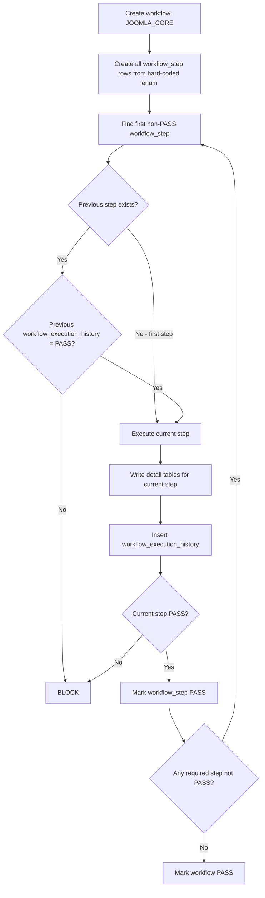
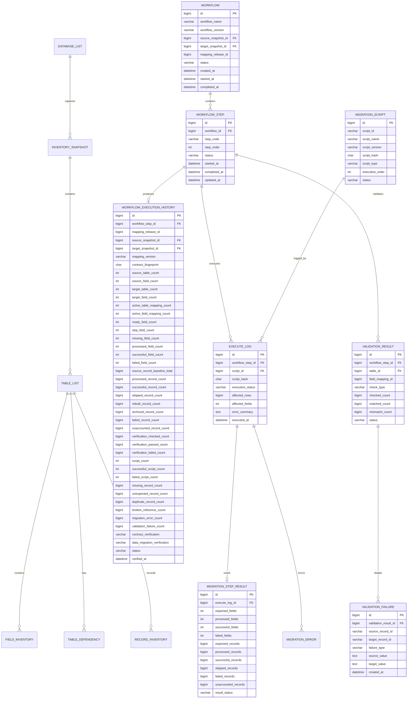
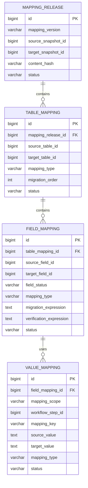

# End-to-End Database Migration Workflow Tutorial

> Controlled top-down database migration for Joomla core and extension waves using preserved inventory detail, hard-coded workflow steps, one row per workflow step, centralized execution history, one-time script execution, mapping definitions, and validation evidence.

---

## Contents

1. [Final Architecture](#1-final-architecture)
2. [Core Responsibility](#2-core-responsibility)
3. [Hard-Coded Workflow Enum](#3-hard-coded-workflow-enum)
4. [Workflow](#4-workflow)
5. [Workflow Step](#5-workflow-step)
6. [Workflow Execution History](#6-workflow-execution-history)
7. [Inventory Detail Tables](#7-inventory-detail-tables)
8. [Mapping Tables](#8-mapping-tables)
9. [Execution and Validation Detail](#9-execution-and-validation-detail)
10. [Top-Down Step Gate](#10-top-down-step-gate)
11. [Insert / Update Flow](#11-insert--update-flow)
12. [JOOMLA_CORE Seed Example](#12-joomla_core-seed-example)
13. [ERD](#13-erd)
14. [Recommended MySQL DDL](#14-recommended-mysql-ddl)
15. [Codex Prompts Per Workflow Step](#15-codex-prompts-per-workflow-step)
16. [Final Verification Rules](#16-final-verification-rules)

---

# 1. Final Architecture

The workflow is one top-down flow:

```text
workflow_enum                       hard-coded step definition/order
        ↓
workflow                            one named migration flow, e.g. JOOMLA_CORE
        ↓
workflow_step                       one row for every step in that workflow
        ↓
workflow_execution_history          one final evidence row for every workflow_step
```

The canonical step order is:

```text
INVENTORY
    ↓ PASS
INVENTORY_VERIFY
    ↓ PASS
MAPPING
    ↓ PASS
MAPPING_VERIFY
    ↓ PASS
MIGRATION
    ↓ PASS
VALIDATION
    ↓ PASS
FINAL_VERIFY
    ↓ PASS
WORKFLOW PASS
```

Inventory detail remains preserved:

```text
SOURCE DB + TARGET DB
        ↓
inventory_snapshot
        ↓
table_list
        ↓
field_inventory
        ↓
table_dependency
        ↓
record_inventory
```

Mapping remains definition-only:

```text
mapping_release
      ↓
table_mapping
      ↓
field_mapping
      ↓
value_mapping
```

Execution detail remains available for drill-down:

```text
migration_script
      ↓
execute_log
      ↓
migration_step_result
      ↓
migration_error
```

Validation detail remains available for drill-down:

```text
validation_result
      ↓
validation_failure
```

The complete control flow is:



Core rule:

```text
A step may run only when:
1. it is the current allowed step;
2. its previous step is proven PASS by workflow_execution_history;
3. the current workflow_step has no existing execution history;
4. all step-specific preconditions pass.
```

---

# 2. Core Responsibility

## `migration_inventory`

`migration_inventory` is the migration control/audit database.

It stores:

```text
WHAT EXISTS
+ WORKFLOW STATE
+ WHAT WAS EXECUTED
+ WHAT WAS VERIFIED
+ REUSABLE SUMMARY HISTORY
+ DETAIL ERRORS / VALIDATION EVIDENCE
```

Recommended structure:

```text
migration_inventory
│
├── INVENTORY DETAIL
│   ├── database_list
│   ├── inventory_snapshot
│   ├── table_list
│   ├── field_inventory
│   ├── table_dependency
│   └── record_inventory
│
├── WORKFLOW CONTROL
│   ├── workflow
│   ├── workflow_step
│   └── workflow_execution_history
│
├── EXECUTION DETAIL
│   ├── migration_script
│   ├── execute_log
│   ├── migration_step_result
│   └── migration_error
│
└── VALIDATION DETAIL
    ├── validation_result
    └── validation_failure
```

## `migration_mapping`

`migration_mapping` stores mapping definitions only:

```text
migration_mapping
├── mapping_release
├── table_mapping
├── field_mapping
└── value_mapping
```

No separate inventory/mapping/migration workflow-history tables are required. Workflow-level results are centralized in:

```text
migration_inventory.workflow_execution_history
```

---

# 3. Hard-Coded Workflow Enum

`workflow_enum` is hard-coded in source code. It is **not** a database table, so there is no SQL `INSERT` into `workflow_enum`.

Canonical order:

```text
10 INVENTORY
20 INVENTORY_VERIFY
30 MAPPING
40 MAPPING_VERIFY
50 MIGRATION
60 VALIDATION
70 FINAL_VERIFY
```

Recommended PHP enum:

```php
enum MigrationWorkflowStep: string
{
    case INVENTORY = 'INVENTORY';
    case INVENTORY_VERIFY = 'INVENTORY_VERIFY';
    case MAPPING = 'MAPPING';
    case MAPPING_VERIFY = 'MAPPING_VERIFY';
    case MIGRATION = 'MIGRATION';
    case VALIDATION = 'VALIDATION';
    case FINAL_VERIFY = 'FINAL_VERIFY';

    public function order(): int
    {
        return match ($this) {
            self::INVENTORY => 10,
            self::INVENTORY_VERIFY => 20,
            self::MAPPING => 30,
            self::MAPPING_VERIFY => 40,
            self::MIGRATION => 50,
            self::VALIDATION => 60,
            self::FINAL_VERIFY => 70,
        };
    }

    public function previous(): ?self
    {
        return match ($this) {
            self::INVENTORY => null,
            self::INVENTORY_VERIFY => self::INVENTORY,
            self::MAPPING => self::INVENTORY_VERIFY,
            self::MAPPING_VERIFY => self::MAPPING,
            self::MIGRATION => self::MAPPING_VERIFY,
            self::VALIDATION => self::MIGRATION,
            self::FINAL_VERIFY => self::VALIDATION,
        };
    }

    public function next(): ?self
    {
        return match ($this) {
            self::INVENTORY => self::INVENTORY_VERIFY,
            self::INVENTORY_VERIFY => self::MAPPING,
            self::MAPPING => self::MAPPING_VERIFY,
            self::MAPPING_VERIFY => self::MIGRATION,
            self::MIGRATION => self::VALIDATION,
            self::VALIDATION => self::FINAL_VERIFY,
            self::FINAL_VERIFY => null,
        };
    }
}
```

The enum answers only:

```text
What steps exist?
What is their order?
What is the previous step?
What is the next step?
```

Runtime state is stored in `workflow_step` and execution proof is stored in `workflow_execution_history`.

---

# 4. Workflow

One `workflow` row represents one complete named migration flow.

`workflow_name` identifies the migration scope.

Examples:

```text
JOOMLA_CORE
HIKASHOP
ACYMAILING
JCE
SP_PAGE_BUILDER
CUSTOM_COMPONENT_CARS
```

Recommended fields:

| Column | Type | Purpose |
|---|---|---|
| `id` | bigint UN AI PK | Workflow ID. |
| `workflow_name` | varchar(128) | Scope/name such as `JOOMLA_CORE`. |
| `workflow_version` | varchar(64) | Version of this workflow. |
| `source_snapshot_id` | bigint UN NULL | Filled when INVENTORY produces the source snapshot. |
| `target_snapshot_id` | bigint UN NULL | Filled when INVENTORY produces the target snapshot. |
| `mapping_release_id` | bigint UN NULL | Filled when MAPPING creates the release. |
| `status` | varchar(16) | `PENDING/RUNNING/PASS/FAIL/LOCKED`. |
| `created_at` | datetime(6) | Created time. |
| `started_at` | datetime(6) NULL | Started time. |
| `completed_at` | datetime(6) NULL | Completed time. |

Example:

```text
id                 = 1
workflow_name      = JOOMLA_CORE
workflow_version   = V1
status             = PENDING
```

`source_snapshot_id`, `target_snapshot_id`, and `mapping_release_id` are nullable initially because they are produced by later workflow steps.

Recommended unique key:

```text
UNIQUE (workflow_name, workflow_version)
```

---

# 5. Workflow Step

Each enum step is a **separate row** in `workflow_step`.

For `JOOMLA_CORE V1` there are seven rows:

| step_order | step_code | Initial status |
|---:|---|---|
| 10 | `INVENTORY` | `PENDING` |
| 20 | `INVENTORY_VERIFY` | `PENDING` |
| 30 | `MAPPING` | `PENDING` |
| 40 | `MAPPING_VERIFY` | `PENDING` |
| 50 | `MIGRATION` | `PENDING` |
| 60 | `VALIDATION` | `PENDING` |
| 70 | `FINAL_VERIFY` | `PENDING` |

Recommended fields:

| Column | Type | Purpose |
|---|---|---|
| `id` | bigint UN AI PK | Workflow-step ID. |
| `workflow_id` | bigint UN | Parent workflow. |
| `step_code` | varchar(64) | Hard-coded enum value. |
| `step_order` | int UN | Hard-coded enum order. |
| `status` | varchar(16) | `PENDING/RUNNING/PASS/FAIL/BLOCKED`. |
| `started_at` | datetime(6) NULL | Start time. |
| `completed_at` | datetime(6) NULL | Completion time. |
| `updated_at` | datetime(6) | Last update time. |

Recommended unique key:

```text
UNIQUE (workflow_id, step_code)
```

Current step is derived as:

```text
1. RUNNING step, if one exists;
2. otherwise the lowest step_order whose status is not PASS.
```

Example:

```text
INVENTORY          PASS
INVENTORY_VERIFY   PASS
MAPPING            PASS
MAPPING_VERIFY     PASS
MIGRATION          PENDING
VALIDATION         PENDING
FINAL_VERIFY       PENDING
```

Therefore:

```text
CURRENT STEP = MIGRATION
NEXT STEP    = VALIDATION
```

`next step` is derived from the hard-coded enum/order. It does not need to be duplicated in the table.

---

# 6. Workflow Execution History

`workflow_execution_history` is the single workflow-level result/evidence table.

Every `workflow_step` produces exactly one final history row.

Relationship:

```text
workflow
   1
   │
   N
workflow_step
   1
   │
   0..1
workflow_execution_history
```

Therefore history only needs:

```text
workflow_step_id
```

It does **not** need a duplicated `workflow_id` or `step_code`, because both are available through `workflow_step`.

Recommended uniqueness:

```text
UNIQUE (workflow_step_id)
```

## 6.1 Base fields retained from the original verification structure

```text
mapping_release_id
source_snapshot_id
target_snapshot_id
mapping_version
contract_fingerprint
source_table_count
source_field_count
target_table_count
target_field_count
active_table_mapping_count
active_field_mapping_count
source_record_baseline_total
contract_verification
data_migration_verification
verified_at
```

These fields remain useful evidence, especially for `MAPPING`, `MAPPING_VERIFY`, `MIGRATION`, `VALIDATION`, and `FINAL_VERIFY`.

## 6.2 Additional field accounting

```text
ready_field_count
skip_field_count
missing_field_count
processed_field_count
successful_field_count
failed_field_count
```

## 6.3 Additional record accounting

```text
processed_record_count
successful_record_count
skipped_record_count
rebuilt_record_count
archived_record_count
failed_record_count
unaccounted_record_count
```

## 6.4 Verification accounting

```text
verification_checked_count
verification_passed_count
verification_failed_count
```

## 6.5 Script accounting

```text
script_count
successful_script_count
failed_script_count
```

Script-level evidence remains in `execute_log`.

## 6.6 Integrity/failure summary

```text
missing_record_count
unexpected_record_count
duplicate_record_count
broken_reference_count
migration_error_count
validation_failure_count
```

## 6.7 Canonical result

```text
status = PASS / FAIL
```

`status` is the authoritative gate field used by the next workflow step.

`contract_verification` and `data_migration_verification` remain step-specific supporting evidence.

## Final recommended columns

| Column | Type | Purpose |
|---|---|---|
| `id` | bigint UN AI PK | History ID. |
| `workflow_step_id` | bigint UN | Exact step that produced this result. |
| `mapping_release_id` | bigint UN NULL | Mapping release when applicable. |
| `source_snapshot_id` | bigint UN NULL | Source snapshot evidence. |
| `target_snapshot_id` | bigint UN NULL | Target snapshot evidence. |
| `mapping_version` | varchar(64) NULL | Mapping version when applicable. |
| `contract_fingerprint` | char(64) NULL | Mapping contract fingerprint. |
| `source_table_count` | int UN | Source table count. |
| `source_field_count` | int UN | Source field count. |
| `target_table_count` | int UN | Target table count. |
| `target_field_count` | int UN | Target field count. |
| `active_table_mapping_count` | int UN | Active table mappings. |
| `active_field_mapping_count` | int UN | Active field mappings. |
| `ready_field_count` | int UN | READY fields. |
| `skip_field_count` | int UN | SKIP fields. |
| `missing_field_count` | int UN | MISSING fields. |
| `processed_field_count` | int UN | Fields processed. |
| `successful_field_count` | int UN | Successful fields. |
| `failed_field_count` | int UN | Failed fields. |
| `source_record_baseline_total` | bigint UN | Source baseline total. |
| `processed_record_count` | bigint UN | Records processed. |
| `successful_record_count` | bigint UN | Successfully accounted records. |
| `skipped_record_count` | bigint UN | Explicitly skipped records. |
| `rebuilt_record_count` | bigint UN | Rebuilt records. |
| `archived_record_count` | bigint UN | Archived records. |
| `failed_record_count` | bigint UN | Failed records. |
| `unaccounted_record_count` | bigint UN | Unaccounted records. |
| `verification_checked_count` | bigint UN | Verification checks/items executed. |
| `verification_passed_count` | bigint UN | Verification PASS items. |
| `verification_failed_count` | bigint UN | Verification FAIL items. |
| `script_count` | int UN | Scripts expected/used. |
| `successful_script_count` | int UN | Successful scripts. |
| `failed_script_count` | int UN | Failed scripts. |
| `missing_record_count` | bigint UN | Missing expected records. |
| `unexpected_record_count` | bigint UN | Unexpected records. |
| `duplicate_record_count` | bigint UN | Duplicate records. |
| `broken_reference_count` | bigint UN | Broken references. |
| `migration_error_count` | bigint UN | Runtime migration errors. |
| `validation_failure_count` | bigint UN | Validation failures. |
| `contract_verification` | varchar(16) NULL | Mapping/contract result. |
| `data_migration_verification` | varchar(16) NULL | Data migration result. |
| `status` | varchar(16) | Canonical `PASS/FAIL`. |
| `verified_at` | datetime(6) | Finalized verification time. |

No workflow behavior is added by these columns. They only store results already produced by the existing steps so later steps/waves can verify previous work without reconstructing it.

---

# 7. Inventory Detail Tables

Keep all inventory detail tables:

```text
database_list
inventory_snapshot
table_list
field_inventory
table_dependency
record_inventory
```

Responsibility:

```text
inventory detail
= exact source/target facts

workflow_execution_history
= summarized step result / reusable checkpoint
```

Example:

```text
workflow_execution_history.source_field_count = 711
```

To identify those 711 fields:

```text
field_inventory
```

To identify their tables:

```text
table_list
```

To identify dependencies:

```text
table_dependency
```

The history table never replaces detailed inventory evidence.

---

# 8. Mapping Tables

Keep mapping definitions unchanged:

```text
mapping_release
      ↓
table_mapping
      ↓
field_mapping
      ↓
value_mapping
```

`field_mapping.field_status` uses:

```text
READY
SKIP
MISSING
```

Mapping definitions belong in `migration_mapping`.

Mapping verification summary belongs in the history row linked to the `MAPPING_VERIFY` workflow step.

---

# 9. Execution and Validation Detail

## 9.1 Script execution

Every migration script has a stable identity in:

```text
migration_script
```

Example:

```text
script_id      = JCORE-G3-CONTENT-001
script_name    = migrate_content.sql
script_version = V1
script_hash    = SHA256(file contents)
```

Every script execution is written to:

```text
execute_log
```

A script can run only once for a workflow step:

```text
UNIQUE (workflow_step_id, script_id)
```

Before execution:

```sql
SELECT id
FROM migration_inventory.execute_log
WHERE workflow_step_id = :workflow_step_id
  AND script_id = :script_id
LIMIT 1;
```

If a row exists:

```text
BLOCK
SCRIPT_ALREADY_EXECUTED
```

This applies even when the previous execution failed. The same script is not rerun in the same workflow step.

Execution totals are stored in:

```text
migration_step_result
```

Runtime errors are stored in:

```text
migration_error
```

## 9.2 Validation

Aggregate/detail verification results are stored in:

```text
validation_result
```

Concrete mismatches are stored in:

```text
validation_failure
```

The workflow-level totals are summarized into the history row for `VALIDATION` and later checked again by `FINAL_VERIFY`.

---

# 10. Top-Down Step Gate

For requested step `X`:

```text
1. Load workflow.
2. Load all workflow_step rows ordered by step_order.
3. Determine current allowed step:
   - RUNNING step if one exists;
   - otherwise first non-PASS step.
4. Requested step must equal current allowed step.
5. Resolve previous step from workflow_enum.
6. If previous step exists, its workflow_execution_history.status must be PASS.
7. Current workflow_step must not already have workflow_execution_history.
8. Execute X.
9. Write step-specific detail tables.
10. Insert workflow_execution_history for X.
11. Mark workflow_step PASS only when history.status = PASS.
12. The next enum step becomes current automatically.
13. After FINAL_VERIFY PASS, mark workflow PASS.
```

Find current step:

```sql
SELECT ws.*
FROM migration_inventory.workflow_step ws
WHERE ws.workflow_id = :workflow_id
  AND ws.status <> 'PASS'
ORDER BY
    CASE WHEN ws.status = 'RUNNING' THEN 0 ELSE 1 END,
    ws.step_order
LIMIT 1;
```

Previous-step PASS check:

```sql
SELECT weh.id, weh.status
FROM migration_inventory.workflow_step previous_ws
JOIN migration_inventory.workflow_execution_history weh
  ON weh.workflow_step_id = previous_ws.id
WHERE previous_ws.workflow_id = :workflow_id
  AND previous_ws.step_code = :previous_step_code
LIMIT 1;
```

Required:

```text
row exists
status = PASS
```

Current-step duplicate guard:

```sql
SELECT weh.id
FROM migration_inventory.workflow_execution_history weh
WHERE weh.workflow_step_id = :current_workflow_step_id
LIMIT 1;
```

If a row exists:

```text
BLOCK
STEP_ALREADY_EXECUTED
```

---

# 11. Insert / Update Flow

## Step 0 — Create workflow and step rows

Create `workflow` first:

```text
workflow_name = JOOMLA_CORE
workflow_version = V1
status = PENDING
```

Then create seven `workflow_step` rows from the hard-coded enum.

No inventory, mapping, migration, or validation execution starts before these control rows exist.

## Step 1 — INVENTORY

Pre-check:

```text
INVENTORY is current allowed step
INVENTORY history does not exist
```

Write detailed facts:

```text
inventory_snapshot
table_list
field_inventory
table_dependency
record_inventory
```

Update workflow:

```text
source_snapshot_id
target_snapshot_id
```

Insert history for the INVENTORY `workflow_step_id`.

Typical evidence:

```text
source_table_count
source_field_count
target_table_count
target_field_count
source_record_baseline_total
processed counts
status
```

## Step 2 — INVENTORY_VERIFY

Pre-check:

```text
INVENTORY_VERIFY is current allowed step
INVENTORY history exists and status = PASS
INVENTORY_VERIFY history does not exist
```

Read:

```text
inventory_snapshot
table_list
field_inventory
table_dependency
record_inventory
```

Verify completeness and insert one `workflow_execution_history` row linked to INVENTORY_VERIFY.

## Step 3 — MAPPING

Pre-check:

```text
MAPPING is current allowed step
INVENTORY_VERIFY history = PASS
MAPPING history does not exist
```

Insert definitions into:

```text
migration_mapping.mapping_release
migration_mapping.table_mapping
migration_mapping.field_mapping
migration_mapping.value_mapping
```

Update:

```text
workflow.mapping_release_id
```

Insert MAPPING history with mapping counts and fingerprint.

## Step 4 — MAPPING_VERIFY

Pre-check:

```text
MAPPING_VERIFY is current allowed step
MAPPING history = PASS
MAPPING_VERIFY history does not exist
```

Verify inventory + mapping contract.

Insert history:

```text
contract_verification = PASS/FAIL
status = PASS/FAIL
```

## Step 5 — MIGRATION

Pre-check:

```text
MIGRATION is current allowed step
MAPPING_VERIFY history = PASS
MIGRATION history does not exist
```

For every required script:

```text
migration_script
      ↓
execute_log
      ↓
migration_step_result
      ↓
migration_error when required
```

Before every script, verify `(workflow_step_id, script_id)` does not already exist in `execute_log`.

After all required scripts finish, insert one MIGRATION history summary containing script/field/record totals.

## Step 6 — VALIDATION

Pre-check:

```text
VALIDATION is current allowed step
MIGRATION history = PASS
VALIDATION history does not exist
```

Write detail:

```text
validation_result
validation_failure
```

Insert one VALIDATION history summary.

## Step 7 — FINAL_VERIFY

Pre-check:

```text
FINAL_VERIFY is current allowed step
VALIDATION history = PASS
FINAL_VERIFY history does not exist
```

Read all six previous workflow-step history rows plus detail evidence.

Insert FINAL_VERIFY history.

If PASS:

```text
FINAL_VERIFY workflow_step.status = PASS
workflow.status = PASS
workflow.completed_at = current timestamp
```

---

# 12. JOOMLA_CORE Seed Example

Because `workflow_enum` is hard-coded, there is no database insert for the enum itself. The enum values are materialized into `workflow_step` when a workflow is created.

## 12.1 Create JOOMLA_CORE workflow

```sql
INSERT INTO migration_inventory.workflow (
    workflow_name,
    workflow_version,
    status
) VALUES (
    'JOOMLA_CORE',
    'V1',
    'PENDING'
);

SET @workflow_id = LAST_INSERT_ID();
```

## 12.2 Materialize the hard-coded enum into workflow steps

```sql
INSERT INTO migration_inventory.workflow_step (
    workflow_id,
    step_code,
    step_order,
    status
) VALUES
    (@workflow_id, 'INVENTORY',        10, 'PENDING'),
    (@workflow_id, 'INVENTORY_VERIFY', 20, 'PENDING'),
    (@workflow_id, 'MAPPING',          30, 'PENDING'),
    (@workflow_id, 'MAPPING_VERIFY',   40, 'PENDING'),
    (@workflow_id, 'MIGRATION',        50, 'PENDING'),
    (@workflow_id, 'VALIDATION',       60, 'PENDING'),
    (@workflow_id, 'FINAL_VERIFY',     70, 'PENDING');
```

Verification:

```sql
SELECT
    w.id AS workflow_id,
    w.workflow_name,
    w.workflow_version,
    ws.id AS workflow_step_id,
    ws.step_code,
    ws.step_order,
    ws.status
FROM migration_inventory.workflow w
JOIN migration_inventory.workflow_step ws
  ON ws.workflow_id = w.id
WHERE w.id = @workflow_id
ORDER BY ws.step_order;
```

Expected:

```text
JOOMLA_CORE V1
10 INVENTORY          PENDING
20 INVENTORY_VERIFY   PENDING
30 MAPPING            PENDING
40 MAPPING_VERIFY     PENDING
50 MIGRATION          PENDING
60 VALIDATION         PENDING
70 FINAL_VERIFY       PENDING
```

---

# 13. ERD

## `migration_inventory`



## `migration_mapping`



---

# 14. Recommended MySQL DDL

The following DDL covers the workflow-control structures. Existing inventory, mapping, execution-detail, and validation-detail tables remain conceptually unchanged.

```sql
CREATE TABLE migration_inventory.workflow (
    id BIGINT UNSIGNED NOT NULL AUTO_INCREMENT,
    workflow_name VARCHAR(128) NOT NULL,
    workflow_version VARCHAR(64) NOT NULL,
    source_snapshot_id BIGINT UNSIGNED NULL,
    target_snapshot_id BIGINT UNSIGNED NULL,
    mapping_release_id BIGINT UNSIGNED NULL,
    status VARCHAR(16) NOT NULL DEFAULT 'PENDING',
    created_at DATETIME(6) NOT NULL DEFAULT CURRENT_TIMESTAMP(6),
    started_at DATETIME(6) NULL,
    completed_at DATETIME(6) NULL,

    PRIMARY KEY (id),
    UNIQUE KEY uk_workflow_name_version (workflow_name, workflow_version),
    CHECK (status IN ('PENDING','RUNNING','PASS','FAIL','LOCKED'))
);

CREATE TABLE migration_inventory.workflow_step (
    id BIGINT UNSIGNED NOT NULL AUTO_INCREMENT,
    workflow_id BIGINT UNSIGNED NOT NULL,
    step_code VARCHAR(64) NOT NULL,
    step_order INT UNSIGNED NOT NULL,
    status VARCHAR(16) NOT NULL DEFAULT 'PENDING',
    started_at DATETIME(6) NULL,
    completed_at DATETIME(6) NULL,
    updated_at DATETIME(6) NOT NULL DEFAULT CURRENT_TIMESTAMP(6)
        ON UPDATE CURRENT_TIMESTAMP(6),

    PRIMARY KEY (id),
    UNIQUE KEY uk_workflow_step_code (workflow_id, step_code),
    UNIQUE KEY uk_workflow_step_order (workflow_id, step_order),
    CHECK (status IN ('PENDING','RUNNING','PASS','FAIL','BLOCKED'))
);

CREATE TABLE migration_inventory.workflow_execution_history (
    id BIGINT UNSIGNED NOT NULL AUTO_INCREMENT,
    workflow_step_id BIGINT UNSIGNED NOT NULL,

    mapping_release_id BIGINT UNSIGNED NULL,
    source_snapshot_id BIGINT UNSIGNED NULL,
    target_snapshot_id BIGINT UNSIGNED NULL,
    mapping_version VARCHAR(64) NULL,
    contract_fingerprint CHAR(64) NULL,

    source_table_count INT UNSIGNED NOT NULL DEFAULT 0,
    source_field_count INT UNSIGNED NOT NULL DEFAULT 0,
    target_table_count INT UNSIGNED NOT NULL DEFAULT 0,
    target_field_count INT UNSIGNED NOT NULL DEFAULT 0,
    active_table_mapping_count INT UNSIGNED NOT NULL DEFAULT 0,
    active_field_mapping_count INT UNSIGNED NOT NULL DEFAULT 0,

    ready_field_count INT UNSIGNED NOT NULL DEFAULT 0,
    skip_field_count INT UNSIGNED NOT NULL DEFAULT 0,
    missing_field_count INT UNSIGNED NOT NULL DEFAULT 0,
    processed_field_count INT UNSIGNED NOT NULL DEFAULT 0,
    successful_field_count INT UNSIGNED NOT NULL DEFAULT 0,
    failed_field_count INT UNSIGNED NOT NULL DEFAULT 0,

    source_record_baseline_total BIGINT UNSIGNED NOT NULL DEFAULT 0,
    processed_record_count BIGINT UNSIGNED NOT NULL DEFAULT 0,
    successful_record_count BIGINT UNSIGNED NOT NULL DEFAULT 0,
    skipped_record_count BIGINT UNSIGNED NOT NULL DEFAULT 0,
    rebuilt_record_count BIGINT UNSIGNED NOT NULL DEFAULT 0,
    archived_record_count BIGINT UNSIGNED NOT NULL DEFAULT 0,
    failed_record_count BIGINT UNSIGNED NOT NULL DEFAULT 0,
    unaccounted_record_count BIGINT UNSIGNED NOT NULL DEFAULT 0,

    verification_checked_count BIGINT UNSIGNED NOT NULL DEFAULT 0,
    verification_passed_count BIGINT UNSIGNED NOT NULL DEFAULT 0,
    verification_failed_count BIGINT UNSIGNED NOT NULL DEFAULT 0,

    script_count INT UNSIGNED NOT NULL DEFAULT 0,
    successful_script_count INT UNSIGNED NOT NULL DEFAULT 0,
    failed_script_count INT UNSIGNED NOT NULL DEFAULT 0,

    missing_record_count BIGINT UNSIGNED NOT NULL DEFAULT 0,
    unexpected_record_count BIGINT UNSIGNED NOT NULL DEFAULT 0,
    duplicate_record_count BIGINT UNSIGNED NOT NULL DEFAULT 0,
    broken_reference_count BIGINT UNSIGNED NOT NULL DEFAULT 0,
    migration_error_count BIGINT UNSIGNED NOT NULL DEFAULT 0,
    validation_failure_count BIGINT UNSIGNED NOT NULL DEFAULT 0,

    contract_verification VARCHAR(16) NULL,
    data_migration_verification VARCHAR(16) NULL,
    status VARCHAR(16) NOT NULL,
    verified_at DATETIME(6) NOT NULL DEFAULT CURRENT_TIMESTAMP(6),

    PRIMARY KEY (id),
    UNIQUE KEY uk_workflow_history_step (workflow_step_id),
    CHECK (status IN ('PASS','FAIL')),
    CHECK (contract_verification IS NULL OR contract_verification IN ('PASS','FAIL')),
    CHECK (data_migration_verification IS NULL OR data_migration_verification IN ('PASS','FAIL'))
);
```

One-time script execution rule:

```sql
CREATE UNIQUE INDEX uk_execute_log_step_script
ON migration_inventory.execute_log (workflow_step_id, script_id);
```

This implements:

```text
script already has execute_log for this workflow_step
→ BLOCK
→ never run that script a second time in the same workflow step
```

---

# 15. Codex Prompts Per Workflow Step

The prompts below are intentionally short. Each prompt tells Codex to first enforce the workflow gate, then generate only the script/code for the requested step.

Replace placeholders such as `<WORKFLOW_ID>`, `<SOURCE_DB>`, `<TARGET_DB>`, and `<OUTPUT_PATH>` before use.

## 15.1 INVENTORY

```text
Implement the INVENTORY step for workflow <WORKFLOW_ID>.
First verify INVENTORY is the current allowed workflow_step and no history exists for it. Do not run any later step.
Generate MySQL scripts that inventory <SOURCE_DB> and <TARGET_DB> into inventory_snapshot, table_list, field_inventory, table_dependency, and record_inventory with complete table/field/count coverage.
Update workflow.source_snapshot_id and target_snapshot_id, then generate the INSERT for workflow_execution_history with the actual inventory totals and PASS/FAIL result.
Do not change migration logic or mapping data. Save scripts under <OUTPUT_PATH>.
```

## 15.2 INVENTORY_VERIFY

```text
Implement the INVENTORY_VERIFY step for workflow <WORKFLOW_ID>.
Block unless INVENTORY has workflow_execution_history.status = PASS and INVENTORY_VERIFY has no history row.
Generate MySQL verification scripts for source/target table coverage, field coverage, record baseline, duplicate inventory entries, and unresolved dependencies using the existing inventory tables.
Generate the workflow_execution_history INSERT with verification counts and PASS only when all required inventory checks pass.
Do not execute MAPPING. Save scripts under <OUTPUT_PATH>.
```

## 15.3 MAPPING

```text
Implement the MAPPING step for workflow <WORKFLOW_ID>.
Block unless INVENTORY_VERIFY history is PASS and MAPPING has no history row.
Using the verified inventory and approved mapping documents, generate MySQL inserts for migration_mapping.mapping_release, table_mapping, field_mapping, and STATIC value_mapping. Preserve READY/SKIP/MISSING field_status and existing mapping decisions exactly.
Update workflow.mapping_release_id and generate the MAPPING workflow_execution_history INSERT with mapping version, fingerprint, table/field mapping counts, and PASS/FAIL.
Do not execute migration scripts. Save scripts under <OUTPUT_PATH>.
```

## 15.4 MAPPING_VERIFY

```text
Implement the MAPPING_VERIFY step for workflow <WORKFLOW_ID>.
Block unless MAPPING history is PASS and MAPPING_VERIFY has no history row.
Generate MySQL verification queries proving all required source/target tables and fields are accounted, field_status is valid, unmapped/ambiguous mappings are zero, required migration_expression and verification_expression rules exist, and the contract fingerprint matches the mapping release.
Generate one workflow_execution_history INSERT with contract_verification and status = PASS only when every required check passes.
Do not run migration. Save scripts under <OUTPUT_PATH>.
```

## 15.5 MIGRATION

```text
Implement the MIGRATION step for workflow <WORKFLOW_ID>.
Block unless MAPPING_VERIFY history is PASS and MIGRATION has no history row.
Generate migration MySQL scripts from the frozen mapping release in dependency/migration_order. Every script must have a stable migration_script ID/hash. Before each script, block if execute_log already contains the same workflow_step_id + script_id; every script may run only once.
Generate execute_log writes, migration_step_result accounting, runtime value_mapping where required, and migration_error writes for failures. After all scripts, generate the MIGRATION workflow_execution_history INSERT with script, field, record, error, and unaccounted counts. PASS requires zero failed scripts, failed fields, failed records, unaccounted records, and migration errors.
Save scripts under <OUTPUT_PATH>.
```

## 15.6 VALIDATION

```text
Implement the VALIDATION step for workflow <WORKFLOW_ID>.
Block unless MIGRATION history is PASS and VALIDATION has no history row.
Generate MySQL validation scripts that verify expected vs actual record identities/counts, field values, required runtime ID mappings, duplicates, missing/unexpected records, structured values, dependencies/references, and constraints.
Write validation_result and validation_failure detail, then generate one VALIDATION workflow_execution_history INSERT. PASS requires verification_failed_count, missing_record_count, unexpected_record_count, duplicate_record_count, broken_reference_count, and validation_failure_count all equal zero.
Do not run FINAL_VERIFY. Save scripts under <OUTPUT_PATH>.
```

## 15.7 FINAL_VERIFY

```text
Implement the FINAL_VERIFY step for workflow <WORKFLOW_ID>.
Block unless VALIDATION history is PASS and FINAL_VERIFY has no history row.
Generate MySQL queries that read the six previous workflow_step history rows and supporting inventory/mapping/execution/validation detail. Verify every previous required step is PASS, hashes/snapshots/mapping release still match, all required scripts ran exactly once, and all failed/unaccounted/error/validation counts are zero.
Generate the FINAL_VERIFY workflow_execution_history INSERT and update workflow.status = PASS only when every final gate passes; otherwise record FAIL and do not advance anything.
Save scripts under <OUTPUT_PATH>.
```

## 15.8 Common Codex rule for every prompt

Append this rule when stronger enforcement is desired:

```text
Do not bypass workflow_step ordering. Do not create a history PASS without SQL evidence from the current database state. Do not modify previous PASS history rows. Do not rerun a script that already has execute_log. Generate deterministic, idempotent setup/verification SQL where possible, but migration execution itself must obey the one-time script rule.
```

---

# 16. Final Verification Rules

## Workflow-level current step

The workflow is at the first required `workflow_step` that is not PASS, except an existing RUNNING row takes precedence.

No other step may run.

## Previous-step gate

For current step `X`:

```text
previous enum step = P
P.workflow_execution_history.status = PASS
X.workflow_execution_history does not exist
```

Otherwise:

```text
BLOCK
```

## INVENTORY_VERIFY PASS

At minimum:

```text
source/target snapshots exist
source/target table inventory complete
source/target field inventory complete
duplicate inventory entries = 0
unresolved required dependencies = 0
verification_failed_count = 0
status = PASS
```

## MAPPING_VERIFY PASS

At minimum:

```text
mapping_release exists
mapping fingerprint matches
source/target mapping scope fully accounted
invalid field_status count = 0
unmapped mappings = 0
ambiguous mappings = 0
missing required mapping rules = 0
missing required verification rules = 0
contract_verification = PASS
status = PASS
```

## MIGRATION PASS

At minimum:

```text
successful_script_count = script_count
failed_script_count = 0
failed_field_count = 0
failed_record_count = 0
unaccounted_record_count = 0
migration_error_count = 0
data_migration_verification = PASS
status = PASS
```

## VALIDATION PASS

At minimum:

```text
verification_failed_count = 0
missing_record_count = 0
unexpected_record_count = 0
duplicate_record_count = 0
broken_reference_count = 0
validation_failure_count = 0
status = PASS
```

## FINAL_VERIFY PASS

`FINAL_VERIFY` must prove:

```text
INVENTORY.status        = PASS
INVENTORY_VERIFY.status = PASS
MAPPING.status          = PASS
MAPPING_VERIFY.status   = PASS
MIGRATION.status        = PASS
VALIDATION.status       = PASS
```

and all final failure/unaccounted/error counters are zero.

Only then:

```text
FINAL_VERIFY history.status = PASS
FINAL_VERIFY workflow_step.status = PASS
workflow.status = PASS
```

---

# Final Design Check

The finalized design is:

```text
workflow_enum
    = hard-coded step definition/order

workflow
    = one complete named flow such as JOOMLA_CORE V1

workflow_step
    = one database row per hard-coded step

workflow_execution_history
    = one final PASS/FAIL + reusable evidence row per workflow_step

inventory_snapshot / table_list / field_inventory / table_dependency / record_inventory
    = detailed inventory evidence retained

mapping_release / table_mapping / field_mapping / value_mapping
    = mapping definitions retained

migration_script / execute_log / migration_step_result / migration_error
    = execution detail retained

validation_result / validation_failure
    = validation detail retained
```

No new migration behavior is introduced. The revision only aligns the database model with the finalized top-down workflow, removes redundant workflow identifiers from history, preserves all inventory detail, and provides Codex prompts to generate the scripts for each existing workflow step without skipping or reordering steps.
